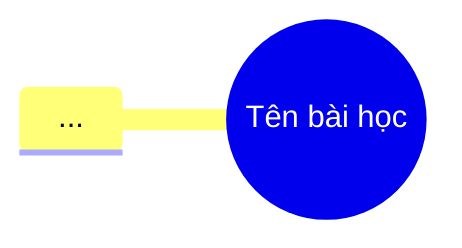

# AI Agent Rules: Quy Tắc Biên Soạn Bài Giảng NestJS

Tệp này quy định các chuẩn mực bắt buộc cho AI Agent khi tạo mới, chỉnh sửa hoặc làm đẹp các bài giảng (`.md` / slides) trong dự án **nestjs-basic-course**.

---

## 🌟 Nguyên Tắc Cốt Lõi: Đẹp Mắt - Trực Quan - Dễ Hiểu (Core Excellence)

Mọi bài giảng được AI Agent tạo ra hoặc chỉnh sửa **BẮT BUỘC** phải đạt tiêu chuẩn chất lượng cao nhất theo 3 tiêu chí:

1. **🎨 Đẹp mắt (Aesthetic & Professional):** Trình bày chuẩn Markdown cao cấp, trình bày thoáng đãng, màu sắc phối mượt mà, Shields.io badges đồng bộ, đồ họa vector & ảnh AI chất lượng cao.
2. **💡 Dễ hiểu (Clear & Pedagogical):** Văn phong truyền tải sư phạm thực chiến, giải thích khái niệm phức tạp bằng ví dụ ẩn dụ thực tế, chia nhỏ từng bước (step-by-step), luôn có kịch bản thử nghiệm thành công & bắt lỗi cụ thể.
3. **👁️ Trực quan (Visual-First):** Ưu tiên dùng sơ đồ luồng (Workflow/Architecture), hình ảnh UI Mockup, bảng so sánh trực quan (Comparison Tables) và khối mã nguồn luôn có nhãn file rõ ràng (`📄 path/to/file.ts`).

---

## 1. Cấu Trúc Thư Mục & Tệp Tin (Directory Structure)

- **Bài giảng lưu tại:** `docs/modules/module-0X/lesson-X.Y/`
- **File chính:** `lesson-X.Y.md` (hoặc `lesson-X.Y-slides.md` nếu là slide Marp).
- **Thư mục đồ họa đi kèm:** `docs/modules/module-0X/lesson-X.Y/assets/`
- **Tài liệu Blueprint:** `docs/00-curriculum-blueprint.md` — ⚠️ **LƯU Ý:** Chỉ chèn hyperlink `[Title](./modules/...)` cho những tệp bài giảng **thực sự đã tồn tại trên đĩa**. Các bài học chưa tạo phải giữ dạng plain text.

---

## 2. Quy Tắc Trình Bày & Nhận Diện Thị Giác (Visual & Badges)

### 🔹 Header & Badges

- Dùng thẻ `<p align="center">` cho badges và SVG banner để đảm bảo hiển thị đúng trên mọi Markdown Reader (VS Code, GitHub, Obsidian).
- **Cấm:** Không bọc cú pháp Markdown image `` bên trong `<div align="center">` vì sẽ gây lỗi render chuỗi raw SVG text.
- Mỗi bài giảng phải tạo ít nhất **01 SVG Overview Banner** lưu tại `assets/lesson_overview_banner.svg` và chèn ngay dưới thanh Badges.

```html
<p align="center">
  
  
</p>

<p align="center">
  
</p>
```

### 🔹 Hộp Thông Tin (GitHub Callouts)

Sử dụng chuẩn GitHub Callout Admonitions cho các ghi chú:

- `> [!NOTE]` — Thời lượng (`⏱️ 10 - 12 phút`) & Mục tiêu bài học (`🎯 ...`).
- `> [!TIP]` — Mẹo tối ưu & Thực thi nhanh.
- `> [!WARNING]` — Hậu quả/vấn đề thường gặp trong teamwork.
- `> [!IMPORTANT]` — Kiến thức/cấu hình cốt lõi không được bỏ qua.
- `> [!CAUTION]` — Cảnh báo lỗi runtime / exit code hỏng build.

---

## 3. Quy Tắc Đồ Họa, Sơ Đồ & AI Image Generation (Assets & Visuals)

1. **Tạo & Sử dụng Đa dạng Tài nguyên Đồ họa (Assets):**
   - **Custom SVG Diagrams & Banners:** Tự tạo các file SVG chất lượng cao với phối màu Dark Slate/Navy (`#0f172a`, `#1e293b`), bóng đổ (drop-shadow), font hệ thống Inter/JetBrains Mono.
   - **Mermaid Diagrams:** Dùng cho flowchart, sequence, ERD, timeline, mindmap khi cần biểu diễn luồng dữ liệu động hoặc sơ đồ cấu trúc.
   - **AI Generated Images (Nano Banana 2 / `generate_image` tool):** Sử dụng công cụ sinh ảnh AI khi bài học cần tạo **UI Mockup** (giao diện app web/mobile), sơ đồ hệ thống minh họa phong phú, hoặc ảnh đồ họa khái niệm trực quan.
   - **Vị trí lưu trữ:** Toàn bộ các file tài nguyên đồ họa (SVG, PNG, JPG) phải lưu trong thư mục `assets/` của bài học tương ứng (VD: `docs/modules/module-01/lesson-1.6/assets/`).

2. **Tuyệt đối KHÔNG trùng lặp sơ đồ (No Diagram Duplication):**
   - Không đặt cả ảnh SVG/AI Image và sơ đồ Mermaid cùng minh họa một workflow trong cùng một mục. Hãy chọn 1 định dạng biểu diễn phù hợp nhất.

3. **Quy tắc cú pháp Mermaid chuẩn mực (Strict Mermaid Rules):**
   - **Tài liệu tham khảo chính thức:** [Creating diagrams - GitHub Docs](https://docs.github.com/en/get-started/writing-on-github/working-with-advanced-formatting/creating-diagrams)
   - Tất cả các nhãn (labels), tên node chứa ký tự đặc biệt như `&`, `:`, `()`, `.`, `/` **BẮT BUỘC phải bọc trong dấu ngoặc kép `"..."`**.
   - **Ví dụ đúng:** `Dev2 -->|"git clone & pnpm install"| Husky2`
   - **Ví dụ sai (gây lỗi Lexical error):** `Husky2 <-- git clone & pnpm install -- Dev2`
   - Sử dụng đúng chiều mũi tên chuẩn (`-->`, `-->|label|`, `---`).

---

## 4. Bố Cục Bài Học Linh Hoạt (Flexible Lesson Layout)

AI Agent không rập khuôn tiêu đề các mục, mà linh hoạt tùy chỉnh bố cục các phần thân bài dựa trên **thể loại bài học** (Overview, Setup & Tools, Core Concept, API Implementation, Real-time Chat, Security, v.v.), đảm bảo luôn bao phủ đủ 4 thành phần nền tảng:

### 📌 Khung Cấu Trúc Tổng Thể:

````markdown
# Lesson X.Y: Tên Bài Học Sinh Động & Thu Hút

<p align="center">...Shields Badges...</p>
<p align="center"></p>

---

> [!NOTE]
> ⏱️ **Thời lượng dự kiến:** 10 – 15 phút  
> 🎯 **Mục tiêu bài học:** ...

---

<!-- NỘI DUNG CHÍNH (Linh hoạt từ 2 - 4 mục tùy thể loại bài học) -->

## 1. [Tên Mục Lý Thuyết / Đặt Vấn Đề / Tổng Quan]

...Khái niệm, bảng so sánh, sơ đồ minh họa SVG / Mermaid / AI Image...

## 2. [Tên Mục Quy Trình / Kiến Trúc / Cấu Hình Cốt Lõi]

...Giải thích workflow, kiến trúc, sơ đồ hoặc kịch bản chi tiết...

## 3. [Tên Mục Hướng Dẫn Thực Hành Step-by-Step]

...Các bước triển khai code rõ ràng...
...Luôn gán nhãn file phía trên khối code: 📄 **`path/to/file.ts`**...

## 4. [Tên Mục Kịch Bản Kiểm Tra & Thử Nghiệm (Hands-on Lab)]

### 🟢 Kịch Bản 1: Thành Công (Success Flow)

### 🔴 Kịch Bản 2: Kiểm Thử Lỗi & Ngăn Chặn (Blocked/Error Flow)

---

<!-- KẾT THÚC BÀI HỌC (Chuẩn hóa cố định) -->

## 5. Tổng Kết Bài Học & Checklist Ghi Nhớ


````

### ✅ Checklist Ghi Nhớ Bài Học:

- [x] Đã hiểu...
- [x] Đã thực hành...

---

👉 **Bài tiếp theo:** [Lesson X.Z: Tên bài tiếp](../lesson-X.Z/lesson-X.Z.md)

````

---

## 5. Gán Nhãn Code Block & Lệnh Terminal

- Mỗi khối code block phải có nhãn tên file in đậm rõ ràng phía trên:
  📄 **`package.json`**
  ```json
  ...
````

- Mọi lệnh terminal phải ghi rõ package manager đang dùng trong dự án (`pnpm` thay vì `npm` mặc định, ngoại trừ lệnh toàn cục `npm i -g`).
