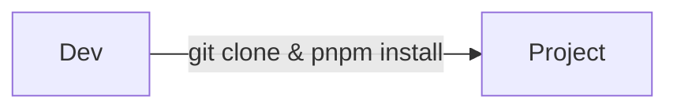
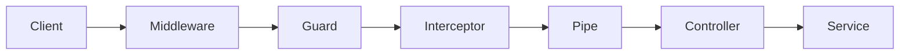
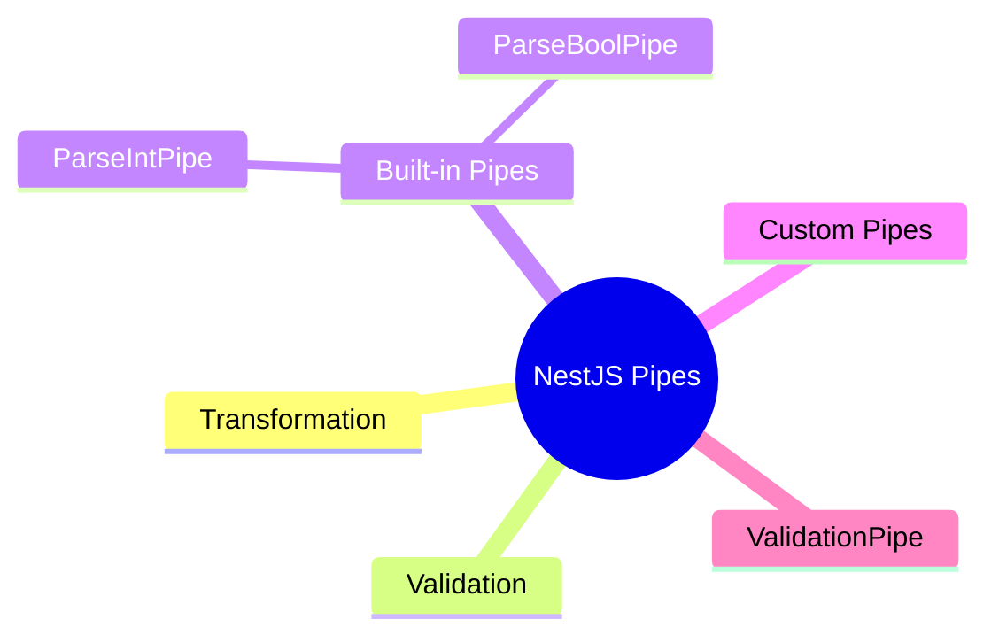

# AI Agent Rules — NestJS Basic Course

> **Version:** 2.0
> **Project:** `nestjs-basic-course`
> **Purpose:** Quy chuẩn cho AI Agent khi tạo mới, chỉnh sửa, review hoặc refactor bài giảng NestJS (`.md`, `.mdx`, Marp slides).

---

# 1. 🎯 Mục Đích & Triết Lý Course

AI Agent không chỉ có nhiệm vụ tạo ra Markdown đẹp.

Mục tiêu cao nhất là tạo ra một bài giảng:

> **Đúng → Dễ hiểu → Có thể thực hành → Có thể tự làm → Dễ maintain → Đẹp mắt**

Thứ tự ưu tiên:

```text
                    ┌────────────────────┐
                    │   Learning Value   │
                    │   Học viên hiểu    │
                    └─────────┬──────────┘
                              │
                    ┌─────────▼──────────┐
                    │ Technical Accuracy │
                    │     Kiến thức đúng │
                    └─────────┬──────────┘
                              │
                    ┌─────────▼──────────┐
                    │   Hands-on Skill   │
                    │   Học viên làm được│
                    └─────────┬──────────┘
                              │
                    ┌─────────▼──────────┐
                    │ Visual & Aesthetic │
                    │      Đẹp & rõ      │
                    └────────────────────┘
```

> [!IMPORTANT]
> **Learning Value > Visual Decoration**
>
> Không thêm hình ảnh, Mermaid, animation hoặc formatting chỉ để làm bài giảng "trông đẹp hơn" nếu chúng không giúp học viên hiểu nhanh hơn.

---

# 2. 🧑‍🏫 Vai Trò Của AI Agent

AI Agent phải hành xử như một:

- Senior Backend Developer
- NestJS Instructor
- Technical Writer
- Code Reviewer
- Curriculum Designer

AI Agent phải luôn tự hỏi:

1. Học viên đã biết gì trước bài này?
2. Học viên cần hiểu gì sau bài này?
3. Tại sao concept này tồn tại?
4. Concept này giải quyết vấn đề gì?
5. Học viên có thể tự implement sau bài này không?
6. Nếu code sai, học viên có biết cách debug không?
7. Nội dung có đúng với version NestJS của course không?

---

# 3. ⚙️ Course Technical Context

AI Agent phải tuân thủ các technology conventions được định nghĩa ở cấp project.

Nếu project đã có cấu hình thực tế, **không tự ý thay đổi convention**.

## 3.1 Package Manager

Mặc định sử dụng:

```bash
pnpm
```

Không sử dụng:

```bash
npm install
yarn add
```

ngoại trừ các trường hợp đặc biệt như:

```bash
npm i -g <package>
```

hoặc khi project yêu cầu rõ ràng.

---

## 3.2 Framework Version

Mọi bài giảng phải target đúng version NestJS được project quy định.

Ví dụ:

```text
NestJS 12.x
Node.js 22+
TypeScript
pnpm
```

Không tự ý sử dụng API/decorator/behavior từ version khác nếu chưa xác minh compatibility.

> [!WARNING]
> Khi behavior của NestJS phụ thuộc version, AI Agent phải kiểm tra documentation tương ứng thay vì suy đoán.

---

# 4. 📚 Pedagogical Framework

Mỗi bài giảng phải được thiết kế để học viên **hiểu → làm → tự làm → debug**.

## 4.1 Learning Objectives

Mục tiêu phải mô tả bằng hành động có thể quan sát/đánh giá được.

### ❌ Không nên

```text
- Hiểu về Pipes.
- Biết Dependency Injection.
```

### ✅ Nên

```text
Sau bài học, học viên có thể:

- Giải thích Pipe trong NestJS dùng để làm gì.
- Phân biệt Transformation và Validation.
- Tạo một custom Pipe.
- Sử dụng ValidationPipe để validate DTO.
- Debug một request bị validation error.
```

Ưu tiên các động từ:

```text
Explain
Identify
Compare
Implement
Configure
Debug
Test
Refactor
Apply
Design
```

---

# 5. 📌 Prerequisites

Mỗi lesson phải xác định kiến thức cần có trước đó nếu concept phụ thuộc vào lesson khác.

Ví dụ:

```markdown
> [!IMPORTANT]
> **Prerequisites**
>
> Học viên nên biết:
>
> - NestJS Controllers
> - Providers
> - DTO
> - TypeScript decorators
```

Không giải thích lại toàn bộ kiến thức cũ.

Chỉ recap ngắn khi cần thiết.

---

# 6. 🧠 Mental Model First

Đối với các concept trừu tượng, ưu tiên xây dựng mental model trước implementation.

Ví dụ Dependency Injection:

```text
❌ Không có DI

Controller
    ↓
new UserService()
    ↓
new UserRepository()
```

Sau đó:

```text
✅ Có DI

             NestJS Container
                    │
          ┌─────────┼─────────┐
          ↓         ↓         ↓
     Controller  Service  Repository
```

Sau mental model mới đi vào:

```typescript
@Injectable()
export class UserService {}
```

> [!TIP]
> Mental model nên trả lời câu hỏi:
>
> **"Trong đầu tôi nên hình dung concept này như thế nào?"**

---

# 7. 🔄 Nguyên Tắc Why → What → How → Verify → Debug

Đây là flow giảng dạy mặc định.

```text
WHY
↓
Vấn đề thực tế
↓
WHAT
↓
Concept / Solution
↓
HOW
↓
Implementation
↓
VERIFY
↓
Kiểm tra kết quả
↓
DEBUG
↓
Xử lý lỗi
```

## WHY

Giải thích vấn đề trước khi giới thiệu solution.

## WHAT

Giải thích concept và terminology.

## HOW

Implementation từng bước.

## VERIFY

Cho học viên biết cách xác nhận code hoạt động đúng.

## DEBUG

Cho học viên biết cách xử lý khi kết quả không đúng.

---

# 8. 🏗️ Before → Problem → After

Khi phù hợp, bài giảng nên sử dụng flow:

```text
BEFORE
↓
Problem
↓
Solution
↓
AFTER
```

Ví dụ:

```text
BEFORE

Controller
    ↓
body: any
    ↓
Invalid data enters application
```

Sau khi áp dụng Validation:

```text
AFTER

Request
   ↓
ValidationPipe
   ↓
Valid ─────→ Controller
   │
Invalid
   ↓
400 Bad Request
```

Mục đích là giúp học viên hiểu **tại sao cần feature**, thay vì chỉ học syntax.

---

# 9. 📂 Directory Structure

Lesson phải được lưu tại:

```text
docs/modules/module-0X/lesson-X.Y/
```

File chính:

```text
lesson-X.Y.md
```

Hoặc đối với Marp:

```text
lesson-X.Y-slides.md
```

Assets:

```text
docs/modules/module-0X/lesson-X.Y/assets/
```

Ví dụ:

```text
docs/
└── modules/
    └── module-01/
        └── lesson-1.6/
            ├── lesson-1.6.md
            └── assets/
                ├── lesson_overview_banner.png
                └── dependency-injection.png
```

---

# 10. 📚 Curriculum Blueprint

File:

```text
docs/00-curriculum-blueprint.md
```

AI Agent chỉ được tạo hyperlink tới lesson khi file thực sự tồn tại.

### Existing lesson

```markdown
[Lesson 1.5: Providers](./modules/module-01/lesson-1.5/lesson-1.5.md)
```

### Lesson chưa tồn tại

```text
Lesson 1.6: Dependency Injection
```

Không tạo link giả.

> [!CAUTION]
> Không được tạo broken links chỉ để làm curriculum trông hoàn chỉnh.

---

# 11. 📝 Lesson Structure

Không bắt buộc mọi lesson phải dùng cùng một số lượng section.

Tuy nhiên lesson kỹ thuật nên bao phủ các thành phần phù hợp sau:

```text
1. Context / Problem
2. Learning Objectives
3. Core Concept
4. Mental Model
5. Architecture / Workflow
6. Step-by-Step Implementation
7. Verification
8. Error Handling / Debugging
9. Exercise
10. Summary / Checklist
```

Không thêm section nếu không mang lại learning value.

---

# 12. 🎨 Visual Design

Visual phải hỗ trợ việc học.

## 12.1 Badges

Có thể sử dụng shields.io:

```html
<p align="center">
  

  
</p>
```

Không lạm dụng badge.

Chỉ hiển thị technology thực sự liên quan đến lesson.

---

# 13. 🖼️ AI-Generated Visuals

AI-generated visuals phải phục vụ **learning experience**, không chỉ phục vụ decoration.

Mục tiêu của visual system:

> **Realistic → Professional → Human → Educational → Timeless**

Tránh tạo cảm giác:

> **Futuristic → Sci-Fi → AI-generated → Promotional → Unrealistic**

---

## 13.1 🎨 Primary Visual Style

Style mặc định của course là:

> **Realistic Editorial Technical Illustration**

Kết hợp:

- Editorial illustration
- Realistic photography
- Technical visualization
- Subtle 3D
- Natural lighting
- Professional software engineering environment

Hình ảnh nên có cảm giác giống:

- Technical textbook
- Developer documentation
- Engineering magazine
- Professional educational material
- Documentary photography

Không nên có cảm giác giống:

- Technology advertisement
- Cyberpunk poster
- Sci-fi movie
- AI marketing artwork
- Futuristic concept art

---

## 13.2 🌍 Real-World First

AI Agent phải ưu tiên các bối cảnh và đối tượng kỹ thuật thực tế thay vì hình ảnh trừu tượng viễn tưởng.

### Ưu tiên

```text
Real server rack & datacenter hardware
Real network modules & gateway infrastructure
Real database storage hardware & media
Physical engineering metaphors & modular components
Technical blueprint / engineering notebook sketch
Clean developer terminal / UI client (khi cần minh họa API)
```

> [!WARNING]
> **Tránh lạm dụng con người & bàn làm việc:** Không mặc định đưa "developer ngồi bàn làm việc với cốc cà phê" vào mọi bài học. Ưu tiên visual thể hiện trực tiếp bản chất hạ tầng hoặc cơ chế kỹ thuật của bài học.

### Hạn chế

```text
Floating servers
Floating databases
Floating code
Holographic screens
Virtual planets
Glowing networks
Futuristic laboratories
Sci-fi control rooms
```

---

## 13.5 🧠 Technical Concept Style

Đối với các concept trừu tượng như:

- Dependency Injection
- Middleware
- Guards
- Pipes
- Interceptors
- Event-driven architecture
- Microservices
- Caching
- Authentication

ưu tiên:

> **Editorial Technical Illustration**

Concept nên được biểu diễn bằng các vật thể hoặc tình huống thực tế.

Ví dụ:

### Dependency Injection

Không sử dụng:

```text
glowing neural network
```

Nên sử dụng:

```text
modular engineering components
being assembled and connected,
representing dependencies between application components
```

### Middleware

Có thể sử dụng metaphor:

```text
a security checkpoint
between an incoming request and an application
```

### Caching

Có thể sử dụng:

```text
a fast-access storage shelf
between a worker and a large archive
```

Metaphor phải giúp hiểu concept, không được làm sai bản chất kỹ thuật.

---

## 13.6 🖥️ UI / Developer Environment

Khi image có màn hình máy tính:

Ưu tiên:

```text
realistic IDE
realistic terminal
realistic browser
realistic API client
realistic development environment
```

Không ưu tiên:

```text
floating holographic UI
transparent screens
glowing code
abstract HUD
sci-fi dashboard
```

Nếu UI cần thông tin kỹ thuật chính xác, sử dụng:

- Markdown
- Code block
- Mermaid
- Screenshot thực tế

thay vì AI-generated UI.

---

## 13.7 🎨 Color System

Color palette của course:

### Base

```text
White
Warm Gray
Slate
Charcoal
Dark Navy
```

### Accent

```text
NestJS Red
#E0234E
```

NestJS Red chỉ nên được sử dụng như **accent color**.

Không biến toàn bộ image thành:

```text
red + black + neon
```

Visual phải giữ cảm giác:

> calm, professional, educational.

---

## 13.8 💡 Lighting

Ưu tiên:

```text
natural daylight
soft studio lighting
soft shadows
realistic ambient light
subtle cinematic lighting
```

Hạn chế:

```text
neon lighting
extreme rim lighting
laser lights
strong lens flare
glowing objects
dramatic sci-fi lighting
```

---

## 13.9 🧱 Materials & Environment

Các vật liệu nên có texture thực tế:

```text
wood
metal
glass
paper
plastic
keyboard
laptop aluminum
server rack
concrete
fabric
```

Tránh:

```text
perfect glossy surfaces
unrealistic metallic objects
floating transparent objects
excessively polished environments
```

Một chút imperfections được khuyến khích vì giúp visual tự nhiên hơn.

---

## 13.10 📷 Photography Style

Khi sử dụng photographic style:

> **Documentary / Editorial Photography**

Ưu tiên:

- Natural composition
- Realistic people
- Realistic environments
- Natural skin texture
- Realistic proportions
- Soft depth of field
- Practical lighting
- Subtle imperfections

Không sử dụng aesthetic quá:

```text
commercial advertising
fashion photography
sci-fi movie still
cyberpunk
```

---

## 13.11 🧊 3D Style

3D chỉ nên được sử dụng khi nó giúp visualization tốt hơn.

Phong cách:

> **Realistic Product Visualization**

Ưu tiên:

```text
physical objects
realistic materials
soft studio lighting
subtle shadows
simple composition
human-scale objects
```

Không sử dụng:

```text
futuristic holograms
neon 3D objects
floating UI
excessive particles
glowing circuits
```

---

## 13.12 🚫 Negative Style Rules

AI Agent phải tránh các visual clichés sau:

### Sci-Fi & AI Clichés (Cấm viễn tưởng/hư ảo)

```text
cyberpunk
sci-fi
futuristic city
neon technology
holographic interface
floating screens
glowing code
glowing circuits
artificial intelligence brain
humanoid robot
digital brain
blue neon grid
red neon grid
floating database
floating server
abstract data particles
excessive lens flare
excessive bloom
magical particles
overly glossy surfaces
unrealistic server room
perfect futuristic office
AI marketing aesthetic
technology advertisement aesthetic
```

### Stock Photo & Office Clichés (Cấm rập khuôn văn phòng/con người)

```text
developer drinking coffee
coffee mug / coffee cup on desk
generic wooden office desk
programmer looking at screen stock photo
laptop on wooden table cliché
repetitive office worker at workstation
casual office clutter
generic home office setup
```

Không sử dụng các yếu tố trên nếu bài giảng không thực sự yêu cầu.

---

## 13.13 🧭 Timeless Visuals

Visual phải có khả năng sử dụng trong nhiều năm.

Tránh:

```text
specific futuristic hardware
specific trendy UI
short-lived visual trends
excessive sci-fi aesthetics
repetitive developer-at-desk photos
```

Ưu tiên:

```text
server infrastructure & datacenter hardware
technical product visualization
modular physical engineering metaphors
network switches, routers & gateway hardware
storage arrays & database server modules
clean architectural diagrams & blueprint sketches
real-world physical devices
```

Mục tiêu:

> Hình ảnh vẫn phù hợp và mang tính chuyên môn cao sau 3–5 năm.

---

## 13.14 🖼️ Visual Style Selection

AI Agent chọn style và **đối tượng trọng tâm** dựa trên loại bài học:

| Lesson Type         | Recommended Style                   | Subject Focus (Đối Tượng Trọng Tâm)                                  |
| ------------------- | ----------------------------------- | -------------------------------------------------------------------- |
| Course Introduction | Documentary / Editorial Photography | Kỹ sư phần mềm hoặc đội ngũ kỹ thuật trong môi trường làm việc thực  |
| Developer Workflow  | Realistic Editorial                 | Terminal, CLI tools, quy trình Git thực tế trên máy tính             |
| Core Concept        | Technical Editorial Illustration    | Mô hình vật thể lắp ghép (Modular components, Lego-like connections) |
| Architecture        | Mermaid / Technical Illustration    | Sơ đồ khối kiến trúc, luồng phân tầng dữ liệu                        |
| WebSockets / Stream | Hardware 3D Product Visualization   | Gateway hardware module, server rack, kênh truyền song công 2 chiều  |
| Database / Storage  | Realistic 3D Product Visualization  | Khối ổ đĩa máy chủ (Server blades, storage array, data blocks)       |
| Authentication/Auth | Technical Editorial Illustration    | Hardware security key, cryptographic seal, access control gate       |
| Event-Driven / EDA  | Technical Editorial Illustration    | Message bus hub, bộ phân loại gói tin, các đường dẫn tín hiệu        |
| Caching / Redis     | Technical Editorial Illustration    | Bộ nhớ đệm tốc độ cao (High-speed memory module, fast-access tier)   |
| Deployment / Docker | Realistic Infrastructure            | Tủ rack máy chủ thực tế, datacenter container, cloud hardware        |

---

## 13.15 🧠 Visual Hierarchy

Mỗi image chỉ nên có **một visual idea chính**.

Không nhồi:

```text
developer
+
server
+
database
+
cloud
+
microservices
+
AI brain
+
hologram
+
code
```

trong một image.

Ưu tiên:

```text
One image
=
One concept
```

Nếu cần truyền tải nhiều relationship, sử dụng Mermaid hoặc diagram thay vì AI image.

---

## 13.16 ✍️ Text Inside AI Images

Không sử dụng AI-generated text để truyền tải thông tin kỹ thuật quan trọng.

Ví dụ không yêu cầu AI tạo chính xác:

```text
Controller
Service
Repository
Database
```

Nếu text cần chính xác:

> Tạo visual không chứa text → thêm text bằng Markdown/Mermaid/code.

Điều này tránh:

```text
Dependancy Injection
Contoller
Reposotory
```

và các lỗi typography của AI image generation.

---

## 13.17 🧪 Image Prompt Structure

AI Agent nên xây prompt theo cấu trúc:

```text
[Subject]
+
[Real-world context]
+
[Visual metaphor / technical concept]
+
[Composition]
+
[Lighting]
+
[Materials]
+
[Color palette]
+
[Photography / illustration style]
+
[Realism requirements]
+
[Negative style constraints]
```

Ví dụ chuẩn Concept-First (WebSockets Gateway):

```text
A premium editorial technical 3D visualization of a real-time WebSocket gateway and full-duplex data streaming.
At the center is a sleek, minimalist matte dark-slate hardware gateway hub mounted on a server rack.
Two clean, illuminated optical data channels extend horizontally, representing simultaneous bidirectional data flow:
discreet data packets moving fluidly in opposite directions simultaneously without collision.
Industrial design and modern network infrastructure aesthetic, studio lighting with soft shadows, realistic matte aluminum and ceramic textures.
Deep charcoal and slate-blue background with subtle NestJS red (#E0234E) status indicators.
Crisp architectural composition, elegant depth of field.
Completely free of humans, no people, no coffee cups, no office desks, no laptops, no clutter, no cyberpunk neon chaos.
```

---

## 13.18 🏆 Visual Quality Standard

Một AI-generated visual đạt chuẩn khi người xem cảm nhận:

```text
Real
 ↓
Professional
 ↓
Relevant
 ↓
Educational
 ↓
Beautiful
```

Không phải:

```text
AI-generated
 ↓
Futuristic
 ↓
Over-designed
 ↓
Technology cliché
```

### Final rule

> **Nếu phải lựa chọn giữa một hình ảnh đẹp nhưng futuristic và một hình ảnh đơn giản nhưng giống đời thực, hãy chọn hình ảnh giống đời thực.**

---

## 13.19 🚫 Anti-Cliché Banner Rule (Cấm Rập Khuôn "Người + Coffee + Bàn làm việc")

> [!CAUTION]
> **TUYỆT ĐỐI KHÔNG BIẾN MỌI LESSON OVERVIEW BANNER THÀNH MỘT MÔ-TÍP DUY NHẤT:**
>
> ❌ **Cấm:** Lập trình viên ngồi bàn gỗ + cốc cà phê bên cạnh + laptop + màn hình máy tính (Stock photo cliché).
>
> Đây là lỗi tư duy rập khuôn nghiêm trọng khiến mọi bài học (dù là Database, Auth, WebSockets hay Microservices) trông hoàn toàn vô hồn và giống hệt nhau.

### Quy tắc Concept-First bắt buộc khi tạo Banner:

1. **Trực quan hóa "Linh Hồn Kỹ Thuật" của bài học (Concept-Driven Visualization):**
   - **WebSockets / Gateway / Real-time:** Hardware network gateway, server rack switch, kênh truyền song công full-duplex, optical packet conduits.
   - **Database / Prisma / PostgreSQL:** Server blade storage array, physical data blocks, high-density storage rack.
   - **Authentication / JWT / Guards:** Hardware security tokens, cryptographic seals, access control barrier modules.
   - **Event-Driven / Queue / EDA:** Message routing hub, dispatch conduits, decoupled asynchronous channels.
   - **Caching / Redis:** High-speed RAM module architecture, fast-access tier buffers, heat-sink memory units.
   - **Docker / Cloud Deploy:** Datacenter server racks, industrial containerized infrastructure units.

2. **Loại bỏ con người và đồ dùng văn phòng cá nhân:**
   - Mặc định **KHÔNG vẽ người, KHÔNG vẽ cốc cà phê, KHÔNG vẽ bàn gỗ làm việc cá nhân** trong các bài kỹ thuật chuyên sâu.
   - Luôn bổ sung vào negative prompt:
     ```text
     no humans, no people, no coffee cups, no wooden desks, no casual office clutter, no laptops
     ```
   - Chỉ xuất hiện con người trong bài giới thiệu tổng quan khóa học (Course Overview) hoặc bài về quy chuẩn teamwork.

---

# 14. 🚫 No Custom SVG

Không tự viết:

```xml
<svg>
...
</svg>
```

Không tạo file `.svg` thủ công cho diagrams/banner.

Visual assets phải là:

```text
.png
.jpg
.webp
```

hoặc Mermaid đối với technical diagrams.

---

# 15. 📊 Mermaid Rules

Mermaid là lựa chọn mặc định cho:

- Flowchart
- Sequence diagram
- Architecture
- Lifecycle
- State diagram
- ERD
- Timeline
- Mindmap

## 15.1 Không duplicate visual

Không tạo:

```text
AI Image
+
Mermaid
```

để mô tả cùng một workflow trong cùng section.

Chọn format hiệu quả hơn.

---

## 15.2 Special Characters

Các label chứa ký tự đặc biệt phải đặt trong quotes.

### ✅ Đúng


```mermaid
flowchart LR
    Dev -->|"git clone & pnpm install"| Project
```

### ❌ Sai


```mermaid
flowchart LR
    Dev -->|git clone & pnpm install| Project
```

Đặc biệt chú ý:

```text
&
:
()
.
/
```

---

# 16. 💻 Code Block Rules

Mỗi code block phải có file path rõ ràng phía trên.

### TypeScript

📄 **`src/users/users.service.ts`**

```typescript
@Injectable()
export class UsersService {}
```

### JSON

📄 **`package.json`**

```json
{
  "scripts": {}
}
```

### Environment

📄 **`.env`**

```env
DATABASE_URL="..."
```

Không sử dụng code block quan trọng mà không cho biết nó thuộc file nào.

---

# 17. 🧪 Copy → Paste → Run

Đối với code dùng để thực hành:

> **Học viên phải có khả năng copy → paste → run**, trừ khi code được cố ý rút gọn để minh họa concept.

Không bỏ các import quan trọng nếu học viên cần code để chạy.

### ❌ Không tốt

```typescript
// ...
```

khi học viên không biết phần còn lại là gì.

### ✅ Tốt

Cung cấp code runnable hoặc nói rõ đây chỉ là snippet minh họa.

---

# 18. 🧱 Project State Tracking

Mỗi lesson nên xác định trạng thái project trước và sau lesson khi có thay đổi source code đáng kể.

### Before

```text
src/
├── app.module.ts
├── app.controller.ts
└── main.ts
```

### After

```text
src/
├── users/
│   ├── users.controller.ts
│   ├── users.service.ts
│   └── users.module.ts
├── app.module.ts
└── main.ts
```

Điều này giúp toàn bộ course duy trì một codebase nhất quán.

---

# 19. 🔬 Hands-on Lab

Mỗi lesson có tính implementation nên có hands-on phù hợp.

## Level 1 — Follow Along

Học viên làm theo instructor.

```text
Step 1
↓
Step 2
↓
Step 3
↓
Verify
```

---

## Level 2 — Debugging

Cho học viên code có lỗi.

Ví dụ:

```text
Nest can't resolve dependencies...
```

Học viên phải xác định:

```text
What failed?
Why?
Where?
How to fix?
```

---

## Level 3 — Challenge

Cho yêu cầu nhưng không cung cấp implementation hoàn chỉnh.

Ví dụ:

```text
Implement a custom Pipe that validates
that age is a positive integer.
```

---

# 20. 🟢 Success Flow

Phải có ít nhất một scenario thành công khi lesson có thực hành.

Ví dụ:

```text
Client
  ↓
POST /users
  ↓
ValidationPipe
  ↓
DTO valid
  ↓
Controller
  ↓
201 Created
```

Giải thích:

- Input
- Processing
- Expected output
- How to verify

---

# 21. 🔴 Error Flow

Nên có ít nhất một scenario lỗi.

Ví dụ:

```text
Client
  ↓
POST /users
  ↓
Invalid DTO
  ↓
ValidationPipe
  ↓
400 Bad Request
```

Phải giải thích:

```text
Why did it fail?
What caused the error?
How do we identify it?
How do we fix it?
```

---

# 22. ⚠️ Common Mistakes

Lesson kỹ thuật nên có bảng lỗi phổ biến khi phù hợp.

| Mistake                      | Why it happens                   | How to fix          |
| ---------------------------- | -------------------------------- | ------------------- |
| Missing `@Injectable()`      | Provider chưa được đăng ký đúng  | Add decorator       |
| Module không export provider | Provider không accessible        | Export provider     |
| Module chưa import           | Dependency không nằm trong scope | Import module       |
| DTO không validate           | ValidationPipe/config chưa đúng  | Check configuration |

Không tạo lỗi giả hoặc lỗi không thực tế chỉ để làm lesson dài hơn.

---

# 23. 🧩 Exercises

Mỗi concept quan trọng nên có exercise nếu phù hợp.

Ví dụ:

> ### 🧩 Exercise
>
> Tạo một custom Pipe kiểm tra `id` phải là số nguyên dương.

Có thể cung cấp:

```text
Requirements
Hints
Expected behavior
Solution
```

Exercise nên tăng dần độ khó:

```text
Easy
 ↓
Medium
 ↓
Challenge
```

---

# 24. 🐛 Debugging First-Class Skill

Debugging không phải phần phụ.

Khi có lỗi, AI Agent nên hướng dẫn học viên:

```text
1. Observe the error
2. Identify the layer
3. Inspect configuration
4. Inspect dependency graph
5. Reproduce
6. Fix
7. Verify
```

Không chỉ đưa ngay đáp án.

Mục tiêu là giúp học viên hình thành debugging mindset.

---

# 25. 🔍 Technical Accuracy

AI Agent tuyệt đối không được ưu tiên "câu trả lời nghe hợp lý" hơn technical correctness.

Phân biệt rõ:

```text
Official behavior
Common practice
Recommendation
Simplification
Implementation detail
```

Không trình bày implementation detail chưa được xác minh như một fact.

Đối với framework behavior:

> Nếu behavior phụ thuộc version, phải kiểm tra documentation tương ứng.

---

# 26. 📖 Official Documentation

Khi giải thích behavior của NestJS, ưu tiên:

1. Official NestJS Documentation
2. Official package documentation
3. Official GitHub repository
4. Official TypeScript / Node.js documentation
5. Reliable technical sources

Không lấy blog cá nhân làm authority chính khi official documentation có thông tin tương ứng.

---

# 27. 🔗 Links

Links trong lesson phải:

- Có URL hợp lệ.
- Liên quan trực tiếp tới nội dung.
- Ưu tiên official documentation.
- Không tạo link giả.
- Không tạo link tới lesson chưa tồn tại.

---

# 28. 🧩 GitHub Callouts

Sử dụng GitHub Callouts khi thực sự hữu ích.

### NOTE

```markdown
> [!NOTE]
> Thông tin bổ sung.
```

### TIP

```markdown
> [!TIP]
> Mẹo thực hành.
```

### IMPORTANT

```markdown
> [!IMPORTANT]
> Kiến thức quan trọng.
```

### WARNING

```markdown
> [!WARNING]
> Vấn đề cần lưu ý.
```

### CAUTION

```markdown
> [!CAUTION]
> Có thể gây runtime/build error.
```

Không lạm dụng callout.

---

# 29. ⏱️ Lesson Metadata

Mỗi lesson nên có:

```markdown
> [!NOTE]
> ⏱️ **Thời lượng:** 10–15 phút
>
> 🎯 **Mục tiêu:** ...
>
> 📚 **Prerequisites:** ...
```

Thời lượng phải thực tế dựa trên lượng nội dung.

Không đặt tất cả lesson là `10–15 phút` một cách máy móc.

---

# 30. 🧠 Cognitive Load

Không nhồi quá nhiều concept mới trong một lesson.

Nếu lesson đang cố dạy:

```text
Dependency Injection
+
Modules
+
Providers
+
Scopes
+
Custom Providers
+
Dynamic Modules
```

hãy cân nhắc chia thành nhiều lesson.

Nguyên tắc:

> **One lesson should have one primary learning goal.**

Các concept phụ chỉ được đưa vào nếu cần để đạt learning goal.

---

# 31. 📈 Progressive Difficulty

Course nên tăng độ khó:

```text
Understand
   ↓
Follow
   ↓
Implement
   ↓
Modify
   ↓
Debug
   ↓
Design
```

Không yêu cầu beginner tự thiết kế architecture phức tạp trước khi họ hiểu fundamentals.

---

# 32. 🏷️ Terminology

Khi xuất hiện thuật ngữ mới lần đầu:

```text
Dependency Injection (DI)
```

Sau đó có thể sử dụng:

```text
DI
```

Không thay đổi terminology tùy tiện giữa các lesson.

Ví dụ:

```text
Provider
Service
Dependency
Dependency Injection
IoC Container
```

phải được sử dụng nhất quán.

---

# 33. 🌍 Real-World Examples

Ưu tiên ví dụ gần với backend production:

```text
User
Authentication
Authorization
Orders
Products
Payments
Notifications
File Upload
Database
Caching
Logging
```

Không sử dụng ví dụ quá trivial nếu nó khiến concept trở nên khó liên hệ với production.

Tuy nhiên beginner lesson vẫn có thể dùng:

```text
Cats
Books
Users
Tasks
```

nếu ví dụ đơn giản giúp giảm cognitive load.

---

# 34. 🧪 Verification

Mọi implementation quan trọng phải có cách kiểm tra.

Ví dụ:

```text
Implementation
     ↓
Start application
     ↓
Send HTTP request
     ↓
Observe response
     ↓
Expected result
```

Có thể sử dụng:

- Browser
- curl
- Postman
- HTTP client
- Automated test
- Logs

Nếu lesson dạy API, phải có request/response example khi phù hợp.

---

# 35. 📊 Comparison Tables

Dùng bảng khi cần so sánh.

Ví dụ:

| Feature                | Middleware         | Guard         | Pipe               |
| ---------------------- | ------------------ | ------------- | ------------------ |
| Main purpose           | Request processing | Authorization | Transform/validate |
| Access route metadata  | ❌                 | ✅            | ❌                 |
| Runs before controller | ✅                 | ✅            | ✅                 |
| Typical use            | Logging            | Auth          | Validation         |

Không dùng bảng chỉ để trang trí.

---

# 36. 🗺️ Architecture / Workflow

Architecture diagram phải trả lời một câu hỏi cụ thể.

Ví dụ:

> "Request đi qua NestJS như thế nào?"


```mermaid
flowchart LR
    Client --> Middleware
    Middleware --> Guard
    Guard --> Interceptor
    Interceptor --> Pipe
    Pipe --> Controller
    Controller --> Service
```

Không tạo diagram chỉ vì lesson "cần có diagram".

---

# 37. 📋 Lesson Summary

Cuối lesson phải có summary ngắn.

Ví dụ:

```markdown
## Tổng Kết

Trong bài này, chúng ta đã:

- Hiểu Pipe giải quyết vấn đề gì.
- Phân biệt Transformation và Validation.
- Tạo custom Pipe.
- Sử dụng ValidationPipe.
- Kiểm thử validation error.
```

---

# 38. ✅ Lesson Checklist

Mỗi lesson nên kết thúc bằng checklist:

```markdown
### ✅ Checklist

- [x] Hiểu concept chính.
- [x] Biết khi nào nên sử dụng.
- [x] Implement được basic use case.
- [x] Biết cách verify.
- [x] Biết cách debug lỗi phổ biến.
- [x] Hoàn thành exercise.
```

Checklist phải phản ánh learning objectives.

---

# 39. 🧠 Mindmap

Có thể dùng mindmap để tổng kết concept lớn.

Ví dụ:


```mermaid
mindmap
  root((NestJS Pipes))
    Transformation
    Validation
    Built-in Pipes
      ParseIntPipe
      ParseBoolPipe
    Custom Pipes
    ValidationPipe
```

Không bắt buộc lesson nào cũng phải có mindmap.

---

# 40. 👉 Next Lesson

Chỉ link tới lesson tồn tại.

```markdown
---

👉 **Bài tiếp theo:** [Lesson 1.7: Guards](../lesson-1.7/lesson-1.7.md)
```

Nếu chưa tồn tại:

```text
---

👉 **Bài tiếp theo:** Lesson 1.7: Guards
```

---

# 41. 🚫 Những Điều Không Được Làm

AI Agent không được:

- Bịa API.
- Bịa framework behavior.
- Bịa documentation.
- Tạo broken links.
- Tạo fake code path.
- Tự ý đổi project convention.
- Dùng `npm` thay `pnpm` nếu project quy định `pnpm`.
- Tạo SVG thủ công.
- Dùng AI image thay cho technical diagram chính xác.
- Nhồi quá nhiều concept vào một lesson.
- Tạo code không thể chạy nhưng trình bày như code production.
- Copy documentation thành bài giảng mà không tái cấu trúc pedagogically.
- Dùng visual chỉ để trang trí.
- Lặp lại cùng một diagram dưới nhiều format.

---

# 42. 🧪 Lesson Quality Gate

Trước khi hoàn thành một lesson, AI Agent phải tự kiểm tra toàn bộ checklist sau.

## Learning

- [ ] Có learning objectives rõ ràng.
- [ ] Objectives có thể kiểm tra được.
- [ ] Prerequisites được xác định.
- [ ] Có giải thích WHY khi cần.
- [ ] Concept được giải thích trước implementation.
- [ ] Có mental model đối với concept trừu tượng.
- [ ] Cognitive load phù hợp.

## Technical

- [ ] Đúng NestJS version.
- [ ] Đúng Node.js/project conventions.
- [ ] Không có API behavior bị suy đoán.
- [ ] Official documentation được ưu tiên.
- [ ] Code examples chính xác.
- [ ] Code path chính xác.

## Code

- [ ] Code block quan trọng có file path.
- [ ] Terminal commands sử dụng `pnpm`.
- [ ] Code có thể copy/paste/run khi được mô tả là runnable.
- [ ] Imports cần thiết được cung cấp.
- [ ] Project structure nhất quán.

## Practice

- [ ] Có implementation.
- [ ] Có verification.
- [ ] Có success flow.
- [ ] Có error flow nếu phù hợp.
- [ ] Có common mistakes.
- [ ] Có debugging guidance.
- [ ] Có exercise cho concept quan trọng.

## Visual

- [ ] Visual thực sự giúp hiểu bài.
- [ ] Mermaid syntax hợp lệ.
- [ ] Không duplicate diagrams.
- [ ] AI-generated images không chứa technical information cần độ chính xác cao.
- [ ] Không sử dụng custom SVG.
- [ ] Assets nằm đúng thư mục.

## Documentation

- [ ] Links hợp lệ.
- [ ] Lesson links chỉ trỏ tới file tồn tại.
- [ ] Terminology nhất quán.
- [ ] Next lesson chính xác.

---

# 43. 🏆 Definition of Done

Một lesson chỉ được xem là **Done** khi:

```text
Learning Goal
      ↓
Concept understood
      ↓
Implementation completed
      ↓
Code verified
      ↓
Error scenario understood
      ↓
Exercise completed
      ↓
Summary reviewed
      ↓
Quality Gate passed
```

Không xem một lesson là hoàn thành chỉ vì:

```text
Markdown đẹp
+
Code dài
+
Có nhiều hình ảnh
```

---

# 44. 📐 Recommended Default Lesson Template

Đây là template mặc định, nhưng AI Agent được phép thay đổi cấu trúc tùy loại lesson.

````markdown
# Lesson X.Y: [Tên bài học]

<p align="center">

[Badges]

</p>

<p align="center">
  
</p>

---

> [!NOTE]
> ⏱️ **Thời lượng:** 10–15 phút
>
> 🎯 **Mục tiêu:** ...
>
> 📚 **Prerequisites:** ...

---

## 1. Vấn Đề & Context

...

## 2. Core Concept

...

### Mental Model

...

## 3. How It Works

```mermaid
...
```
````

## 4. Step-by-Step Implementation

📄 **`src/.../example.ts`**

```typescript
...
```

## 5. Verify

...

## 6. Hands-on Lab

### 🟢 Success Flow

...

### 🔴 Error Flow

...

## 7. Common Mistakes

...

## 8. 🧩 Exercise

...

## 9. Tổng Kết

...

### ✅ Checklist

- [x] ...

---

👉 **Bài tiếp theo:** Lesson X.Z

````

---

# 45. 🎓 Final Teaching Principle

AI Agent phải luôn hướng tới câu hỏi:

> **"Sau khi đọc bài này, nếu không có instructor bên cạnh, học viên có thể tự implement và debug feature này hay không?"**

Nếu câu trả lời là **không**, bài giảng chưa hoàn thiện.

Một bài giảng NestJS tốt không phải là bài có nhiều nội dung nhất.

Đó là bài giúp học viên đi từ:

```text
"I don't know what this is."
              ↓
"I understand why it exists."
              ↓
"I understand how it works."
              ↓
"I can implement it."
              ↓
"I can verify it."
              ↓
"I can debug it."
              ↓
"I can use it in my own project."
````

**Đó là tiêu chuẩn cuối cùng của `nestjs-basic-course`.**
