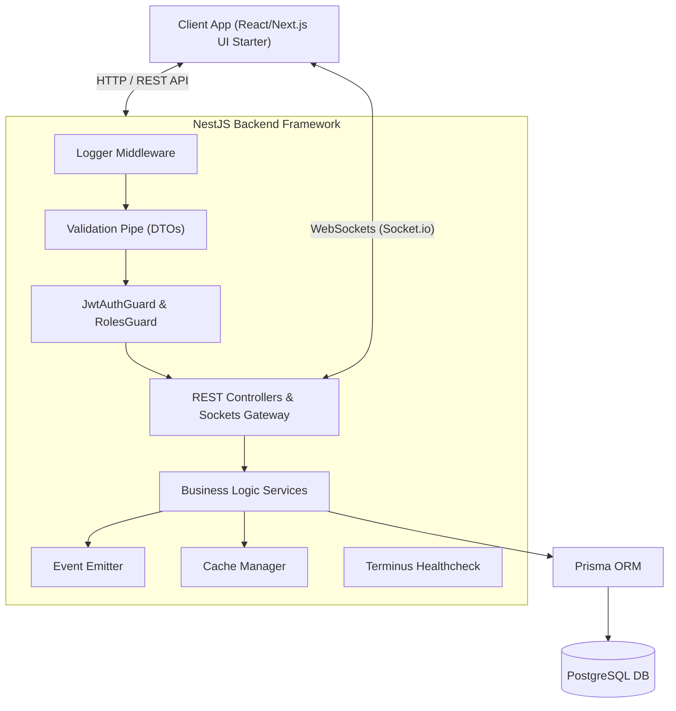

# NestJS Thực Chiến: Xây Dựng API Từ Cơ Bản Đến Nâng Cao

  
  
  
  
  
  

  

  <strong>NestJS & TypeScript Thực Chiến: Xây Dựng Real-time Chat App với PostgreSQL, Prisma, WebSockets & Docker</strong> 
  <em>Tài liệu chuẩn Enterprise dành cho Instructor giảng dạy khóa học NestJS trên Udemy</em>

---

## 1. Thống Kê Nhanh Về Khóa Học (Course Metrics)

| Chỉ số                 | Chi tiết                                                            |
| :--------------------- | :------------------------------------------------------------------ |
| **Đối tượng mục tiêu** | Người mới bắt đầu làm Backend (Đã biết cơ bản JS/TS)                |
| **Thời lượng dự kiến** | 10 – 14 Giờ học (7 Modules tinh gọn)                                |
| **Dự án tốt nghiệp**   | Real-Time Social Media & Chat Room Application                      |
| **Chuẩn Kiến Thức**    | RESTful API, OWASP Security, Event-Driven, WebSockets, Healthchecks |

---

## 2. Mô Hình Kiến Trúc Dự Án (System Architecture Diagram)

---

## 3. Danh Mục Tài Liệu Chi Tiết (`docs/`)

> [!NOTE]
> Tất cả các tài liệu bên dưới được biên soạn chi tiết từng bước, giúp Instructor dễ dàng chuẩn bị slide và kịch bản quay video.

| Tài liệu                      | Mô tả nội dung                                                            |                        Link nhanh                        |
| :---------------------------- | :------------------------------------------------------------------------ | :------------------------------------------------------: |
| **00. Curriculum Blueprint**  | Khung 7 Modules bài học sắp xếp chuẩn theo tiến trình phát triển sản phẩm |    [Xem tài liệu](./docs/00-curriculum-blueprint.md)     |
| **01. Pedagogical Strategy**  | Hướng dẫn kịch bản quay video, quy tắc giải thích code & debug thực tế    |    [Xem tài liệu](./docs/01-pedagogical-strategy.md)     |
| **02. Capstone Project Spec** | Bản thiết kế CSDL (ERD Diagram) và bảng đồ API endpoints chi tiết         |    [Xem tài liệu](./docs/02-capstone-project-spec.md)    |
| **03. Course Resources**      | Bộ tài nguyên đi kèm (Postman Collection, React UI Kit, PDF Slides)       | [Xem tài liệu](./docs/03-course-resources-and-assets.md) |
| **Module Materials**          | Kịch bản bài học & Slide Marp lưu theo cấu trúc chuẩn từng Module         |              [Xem Modules](./docs/modules/)              |
