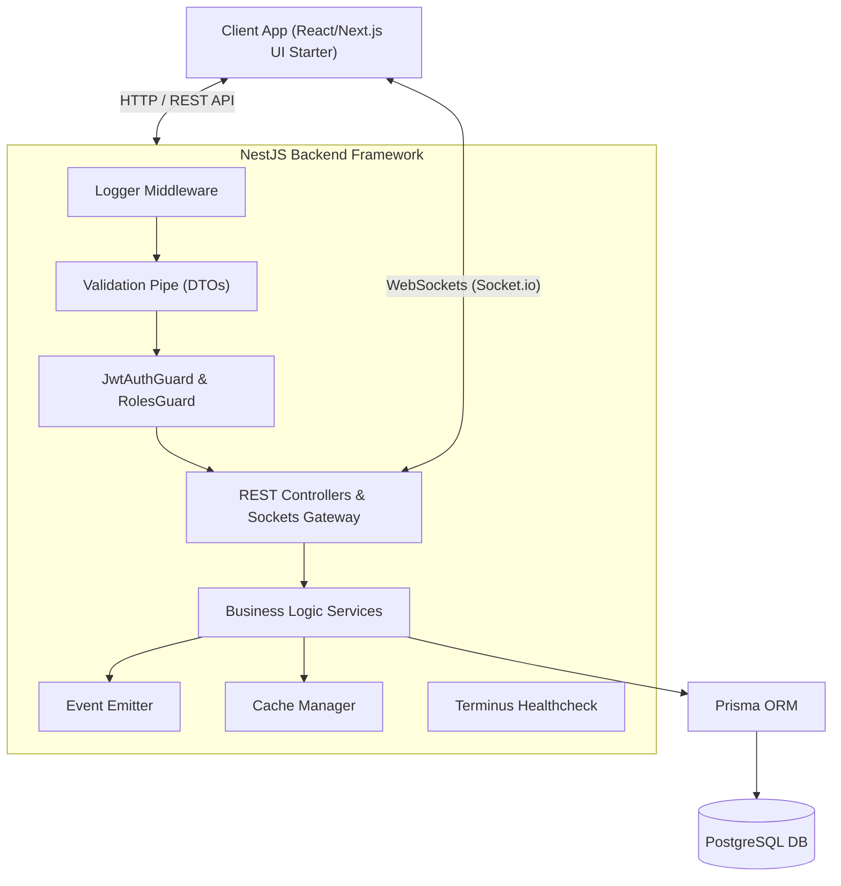

# NestJS Thực Chiến: Xây Dựng API Từ Cơ Bản Đến Nâng Cao

  
  
  
  
  
  

  

  <strong>NestJS & TypeScript Thực Chiến: Xây Dựng Real-time Chat App với PostgreSQL, Prisma, WebSockets & Docker</strong> 
  <em>Tài liệu chuẩn Enterprise dành cho Instructor giảng dạy khóa học NestJS trên Udemy</em>

---

## 1. Thống Kê Nhanh Về Khóa Học (Course Metrics)

| Chỉ số                 | Chi tiết                                                            |
| :--------------------- | :------------------------------------------------------------------ |
| **Đối tượng mục tiêu** | Người mới bắt đầu làm Backend (Đã biết cơ bản JS/TS)                |
| **Thời lượng dự kiến** | 10 – 14 Giờ học (7 Modules tinh gọn)                                |
| **Dự án tốt nghiệp**   | Real-Time Social Media & Chat Room Application                      |
| **Chuẩn Kiến Thức**    | RESTful API, OWASP Security, Event-Driven, WebSockets, Healthchecks |

---

## 2. Khóa Học Này Dành Cho Ai? (Target Audience)

> [!IMPORTANT]
> **Bạn có đang gặp phải những "cơn đau" này?**
>
> - Viết Express.js tự phát, dự án phình to thành "spaghetti code" cực kỳ khó bảo trì.
> - Làm Frontend (React/Vue/Next.js) nhưng bị nghẽn ở khâu Backend, chưa tự thiết kế được REST API & Real-time WebSockets chuẩn chỉnh.
> - Đã học NestJS suông nhưng chưa bao giờ tự tay đưa một dự án thực tế (Auth, Database Migrations, Events, Caching, Docker) lên Production.

**Khóa học này được thiết kế để giải quyết triệt để các vấn đề trên:**

- **Dev muốn làm chủ NestJS bài bản:** Thấu hiểu trọn vẹn từ Dependency Injection (DI), IoC Container đến kiến trúc Clean Enterprise.
- **Frontend Devs muốn nâng cấp Fullstack:** Tự xây dựng toàn bộ hệ thống API & Real-time Chat mà không phụ thuộc Backend team.
- **Node.js / Express Devs muốn nâng level:** Chuyển từ code bộc phát sang tư duy chuẩn Doanh nghiệp, tự tin cân dự án quy mô lớn.
- **Junior Devs & Sinh viên xây CV / Đồ án:** Sở hữu dự án thực chiến sản phẩm thật (Real-time Social Chat App) tạo lợi thế áp đảo khi phỏng vấn.

---

## 3. Điều Kiện Tiên Quyết (Prerequisites)

- **Kiến thức:** Nền tảng cơ bản về JavaScript (ES6+), TypeScript (type/interface) và khái niệm Web cơ bản (HTTP Request/Response).
- **Môi trường:** Máy tính cài sẵn Node.js (v20+), Docker Desktop, VS Code và pnpm/npm.
- **Thái độ:** Sẵn sàng gõ live-code 100%, tự tin thực hành và học cách đọc stacktrace sửa bug thực tế.

---

## 4. Học Viên Sẽ Học Được Gì? (What You'll Learn)

> [!TIP]
> **100% kiến thức gắn liền với xây dựng sản phẩm thực tế — không học lý thuyết suông.**

- **NestJS Architecture:** Thấu hiểu bản chất Dependency Injection, IoC, Modules, Controllers, Services, Guards & Interceptors.
- **Code Quality Chuẩn Teamwork:** Tự động hóa kiểm tra code với ESLint, Prettier, Husky Git Hooks & Commitlint.
- **PostgreSQL & Prisma ORM:** Thiết kế CSDL quan hệ thực chiến, Type-safe Queries, Database Migrations & Transactions.
- **Bảo Mật API chuẩn OWASP:** JWT Auth (Access/Refresh Token), Hashing Password (bcrypt) & Throttling (Rate Limiting).
- **Real-time Chat & Event-Driven:** WebSockets Gateway (Socket.io) phòng chat thời gian thực & `@nestjs/event-emitter`.
- **Production Ready:** Tăng tốc API với Caching, giám sát hệ thống với Terminus Healthchecks & đóng gói Docker Container.

---

## 5. Mô Hình Kiến Trúc Dự Án (System Architecture Diagram)

---

## 6. Danh Mục Tài Liệu Chi Tiết (`docs/`)

> [!NOTE]
> Tất cả các tài liệu bên dưới được biên soạn chi tiết từng bước, giúp Instructor dễ dàng chuẩn bị slide và kịch bản quay video.

| Tài liệu                      | Mô tả nội dung                                                            |                        Link nhanh                        |
| :---------------------------- | :------------------------------------------------------------------------ | :------------------------------------------------------: |
| **00. Curriculum Blueprint**  | Khung 7 Modules bài học sắp xếp chuẩn theo tiến trình phát triển sản phẩm |    [Xem tài liệu](./docs/00-curriculum-blueprint.md)     |
| **01. Pedagogical Strategy**  | Hướng dẫn kịch bản quay video, quy tắc giải thích code & debug thực tế    |    [Xem tài liệu](./docs/01-pedagogical-strategy.md)     |
| **02. Capstone Project Spec** | Bản thiết kế CSDL (ERD Diagram) và bảng đồ API endpoints chi tiết         |    [Xem tài liệu](./docs/02-capstone-project-spec.md)    |
| **03. Course Resources**      | Bộ tài nguyên đi kèm (Postman Collection, React UI Kit, PDF Slides)       | [Xem tài liệu](./docs/03-course-resources-and-assets.md) |
| **Module Materials**          | Kịch bản bài học & Slide Marp lưu theo cấu trúc chuẩn từng Module         |              [Xem Modules](./docs/modules/)              |

---

## 7. Kênh Hỗ Trợ & Liên Hệ Giảng Viên (Instructor Contact & Support)

> [!TIP]
> **Hỗ trợ học viên 24/7:** Trong quá trình học nếu gặp khó khăn về cài đặt môi trường, lỗi code hoặc cần giải đáp thắc mắc về kiến thức NestJS, bạn có thể liên hệ trực tiếp với Giảng viên qua các kênh bên dưới.

|                                                                        Kênh liên hệ                                                                        | Thông tin / Liên kết                                                               |
| :--------------------------------------------------------------------------------------------------------------------------------------------------------: | :--------------------------------------------------------------------------------- |
|                       | `dotanthanhvlog@gmail.com`                                                         |
|     | [Đỗ Tấn Thành (thanh270600)](https://www.linkedin.com/in/thanh270600/)             |
|                       | [@thanhmati](https://github.com/thanhmati)                                         |
|      | [Lập Trình Fullstack](https://www.youtube.com/@laptrinhfullstack)                  |
|  | [Group Cộng đồng Lập Trình Fullstack](https://www.facebook.com/groups/ltfullstack) |
|                               | Hotline / Zalo: `0762216048`                                                       |
