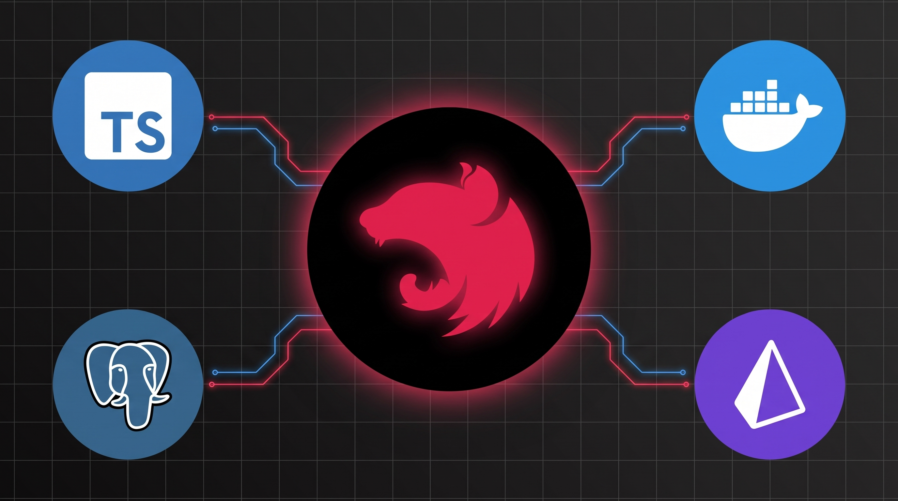
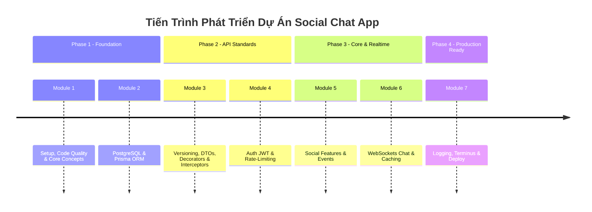

# Module Curriculum Blueprint: NestJS Thực Chiến: Xây Dựng API Từ Cơ Bản Đến Nâng Cao

  

> **NestJS & TypeScript Thực Chiến: Xây Dựng Real-time Chat App với PostgreSQL, Prisma, WebSockets & Docker**  
> Khung chương trình 7 Modules tinh gọn (Pragmatic Path) sắp xếp chuẩn theo tiến trình phát triển ứng dụng từ cơ bản đến nâng cao.

---

## 1. Lộ Trình Học Tổng Quan (Learning Roadmap)

---

## 2. Chi Tiết Nội Dung Từng Module

---

### Module 1: Khởi Tạo Dự Án, Code Quality Tools & NestJS Core Concepts

> [!NOTE]  
> **Mục tiêu:** Nắm vững setup môi trường, chuẩn hóa code quality trong team (ESLint, Prettier, Husky, Commitlint) và hiểu các khái niệm cốt lõi của NestJS.

- **1.1** [_Overview:_ Giới thiệu tổng quan về NestJS & Lý do lựa chọn kiến trúc NestJS.](./modules/module-01/lesson-1.1/lesson-1.1-slides.md)
- **1.2** _Demo App:_ Demo trải nghiệm ứng dụng Social Chat App hoàn chỉnh (REST API & Real-time WebSockets).
- **1.3** [_Environment Setup:_ Chuẩn bị môi trường phát triển (NodeJS, pnpm, VS Code, Postman, Docker).](./modules/module-01/lesson-1.3/lesson-1.3.md)
- **1.4** [_Nest CLI & Project Structure:_ Khởi tạo dự án NestJS với Nest CLI & Khám phá cấu trúc mã nguồn.](./modules/module-01/lesson-1.4/lesson-1.4.md)
- **1.5** [_Teamwork Standards:_ Vấn đề thường gặp trong teamwork (Lỗi format, lint và commit message).](./modules/module-01/lesson-1.5/lesson-1.5-slides.md)
- **1.6** [_Git Hooks & Husky:_ Giới thiệu Git Hooks & Tự động hóa kiểm tra code với Husky.](./modules/module-01/lesson-1.6/lesson-1.6.md)
- **1.7** [_Lint-staged:_ Tự động lint và format code trước commit với lint-staged.](./modules/module-01/lesson-1.7/lesson-1.7.md)
- **1.8** [_Commitlint:_ Commitlint & Conventional Commits - Giữ commit message chuẩn hóa.](./modules/module-01/lesson-1.8/lesson-1.8.md)
- **1.9** [_Core Concepts:_ Controller, Service, Module & Dependency Injection (DI) cơ bản.](./modules/module-01/lesson-1.9/lesson-1.9.md) ([Slides](./modules/module-01/lesson-1.9/lesson-1.9-slides.md))
- **1.10** [_Configuration:_ Đọc `.env` an toàn với `@nestjs/config` & `Joi` validation.](./modules/module-01/lesson-1.10/lesson-1.10.md)

---

### Module 2: Cơ Sở Dữ Liệu Với PostgreSQL & Prisma ORM

> [!TIP]  
> **Mục tiêu:** Nắm vững tư duy thiết kế CSDL quan hệ thực chiến cho Social Chat App, làm chủ Prisma ORM từ khởi tạo, seeding, type-safe queries đến xử lý Transactions và Exception Handling chuyên nghiệp.

- **2.1** [_Database Environment:_ Khởi chạy PostgreSQL & GUI Client (Adminer/pgAdmin) với Docker Compose.](./modules/module-02/lesson-2.1/lesson-2.1.md)
- **2.2** [_Prisma Overview & Setup:_ Giới thiệu Prisma ORM (Khái niệm ORM, Prisma Architecture) & Khởi tạo Prisma CLI (`prisma init`).](./modules/module-02/lesson-2.2/lesson-2.2.md)
- **2.3** [_Schema Design & Relations:_ Thiết kế Data Models chuẩn hóa cho Social App (`User`, `Post`, `Comment`, `Message`, `Notification`) với quan hệ 1-1, 1-N, N-N & Cascade Rules.](./modules/module-02/lesson-2.3/lesson-2.3.md)
- **2.4** [_Migrations & Prisma Studio:_ Quản lý phiên bản CSDL với `prisma migrate dev` và trực quan hóa dữ liệu bằng Prisma Studio.](./modules/module-02/lesson-2.4/lesson-2.4.md)
- **2.5** [_Database Seeding:_ Xây dựng Script tự động tạo dữ liệu mẫu (`prisma/seed.ts`) kết hợp `@faker-js/faker`.](./modules/module-02/lesson-2.5/lesson-2.5.md)
- **2.6** [_NestJS Integration:_ Tạo `PrismaService` quản lý Lifecycle Connection (`onModuleInit`, `onModuleDestroy`) & Đóng gói `@Global()` `PrismaModule`.](./modules/module-02/lesson-2.6/lesson-2.6.md)
- **2.7** [_Type-Safe Queries:_ Thực thi các thao tác CRUD với Prisma Client Type-Safety (`select`, `include`, `where`, `orderBy`).](./modules/module-02/lesson-2.7/lesson-2.7.md)
- **2.8** [_Transactions & Optimization:_ Kỹ thuật xử lý giao dịch dữ liệu với `$transaction` (Sequential & Interactive) và phòng chống N+1 Query.](./modules/module-02/lesson-2.8/lesson-2.8.md)
- **2.9** [_Prisma Error Handling:_ Bắt và chuẩn hóa lỗi Prisma Client (Lỗi trùng lặp dữ liệu `P2002`, lỗi không tìm thấy bản ghi `P2025`) với NestJS Exception Filter.](./modules/module-02/lesson-2.9/lesson-2.9.md)

---

### Module 3: Chuẩn Hóa REST API & Request Pipeline (Versioning, DTOs, Filters, Decorators & Interceptors)

> [!IMPORTANT]  
> **Mục tiêu:** Xây dựng API chuyên nghiệp với Request Pipeline linh hoạt (Middleware, Validation Pipes, Filters, Custom Decorators & Interceptors).

- **3.1** [_Versioning:_ Cấu hình API Versioning `/api/v1/...`.](./modules/module-03/lesson-3.1/lesson-3.1.md)
- **3.2** [_Validation:_ Sử dụng DTOs với `class-validator` & `ValidationPipe` toàn cục.](./modules/module-03/lesson-3.2/lesson-3.2.md)
- **3.3** [_Middleware:_ Viết `LoggerMiddleware` tự động log HTTP Method, URL, IP Address.](./modules/module-03/lesson-3.3/lesson-3.3.md)
- **3.4** [_Exception Filters:_ Viết `HttpExceptionFilter` chuẩn hóa JSON thông báo lỗi toàn cục.](./modules/module-03/lesson-3.4/lesson-3.4.md)
- **3.5** [_Custom Decorators:_ Xây dựng Param Decorators (`createParamDecorator`), Passing Data, kết hợp Pipes & Decorator Composition (`applyDecorators`).](./modules/module-03/lesson-3.5/lesson-3.5.md)
- **3.6** [_Interceptors:_ `TransformInterceptor` (chuẩn hóa success response) & `LoggingInterceptor` (đo execution time).](./modules/module-03/lesson-3.6/lesson-3.6.md)

---

### Module 4: Authentication, Security & Rate-Limiting

> [!CAUTION]  
> **Mục tiêu:** Bảo mật hệ thống với JWT Access Token và chống Brute-force/Spam.

- **4.1** [_Hash Password:_ Mã hóa mật khẩu an toàn với `bcrypt`.](./modules/module-04/lesson-4.1/lesson-4.1.md)
- **4.2** [_JWT Auth:_ Đăng ký, Đăng nhập & phát hành Access Token.](./modules/module-04/lesson-4.2/lesson-4.2.md)
- **4.3** [_Guards:_ Bảo vệ API bằng `JwtAuthGuard` & Passport Strategy.](./modules/module-04/lesson-4.3/lesson-4.3.md)
- **4.4** [_Auth Decorators:_ Vận dụng Custom Decorators tạo `@CurrentUser()` & `@Public()` kết hợp `Reflector` thiết lập Global `JwtAuthGuard`.](./modules/module-04/lesson-4.4/lesson-4.4.md)
- **4.5** [_Rate Limiting:_ Giới hạn lượt gọi request bằng `@nestjs/throttler`.](./modules/module-04/lesson-4.5/lesson-4.5.md)

---

### Module 5: OpenAPI (Swagger), Social Features & Event-Driven Architecture

> [!NOTE]  
> **Mục tiêu:** Tự động sinh tài liệu API tương tác với OpenAPI (Swagger), phát triển tính năng Social (Posts, File Upload, Comments) và tách rời logic bằng Events.

- **5.1** [_OpenAPI (Swagger):_ Tự động sinh Swagger UI tương tác (`@nestjs/swagger`) & Document REST API.](./modules/module-05/lesson-5.1/lesson-5.1.md)
- **5.2** [_Posts API:_ CRUD bài viết & Phân trang Cursor/Offset.](./modules/module-05/lesson-5.2/lesson-5.2.md)
- **5.3** [_File Upload:_ Upload ảnh đại diện/bài viết với Multer.](./modules/module-05/lesson-5.3/lesson-5.3.md)
- **5.4** _Comments API:_ Thêm bình luận dưới bài viết.
- **5.5** _Event-Driven:_ Bắn sự kiện `comment.created` với `@nestjs/event-emitter` để tự động tạo Notification.

---

### Module 6: Real-Time WebSockets Chat & Performance Caching

> [!TIP]  
> **Mục tiêu:** Tạo tính năng Chat nhóm/1-1 Real-time và tăng tốc tải trang với Caching.

- **6.1** _WebSockets:_ Tạo Gateway với `@WebSocketGateway()` (Socket.io).
- **6.2** _Socket Auth:_ Authen JWT ngay từ giai đoạn Socket Handshake.
- **6.3** _Chat Room:_ Join Room, Broadcast message real-time & lưu DB.
- **6.4** _Sockets + Events:_ Đẩy thông báo tức thì khi có sự kiện `comment.created`.
- **6.5** _Caching:_ Tăng tốc API Hot Feed với `@nestjs/cache-manager`.
- **6.6** _Frontend:_ Ghép nối Backend với Template React UI Starter.

---

### Module 7: Advanced Logging, Healthchecks (Terminus), Testing & Cloud Deploy

> [!IMPORTANT]  
> **Mục tiêu:** Kiểm tra sức khỏe ứng dụng, viết Unit Test và Deploy lên Cloud.

- **7.1** _Logging:_ Ghi log hệ thống dạng Structured JSON cho môi trường Production.
- **7.2** _Healthchecks:_ Tạo API `/api/v1/health` soi DB Postgres & RAM bằng `@nestjs/terminus`.
- **7.3** _Testing:_ Viết Unit Test cho Service & E2E Test cho Auth API với Jest.
- **7.4** _Dockerize:_ Viết `Dockerfile` & `docker-compose.yml` tối ưu.
- **7.5** _Cloud Deploy:_ Deploy miễn phí ứng dụng lên Render / Railway.
