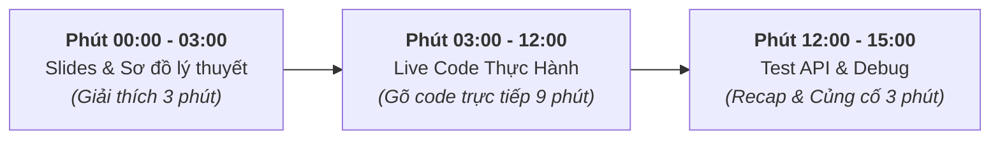

# Pedagogical Strategy & Recording Guidelines

> **Chiến lược truyền tải nội dung & Kịch bản quay video chuẩn Udemy Instructor**  
> **Khóa học:** NestJS Thực Chiến: Xây Dựng API Từ Cơ Bản Đến Nâng Cao  
> **Subtitle:** NestJS & TypeScript Thực Chiến: Xây Dựng Real-time Chat App với PostgreSQL, Prisma, WebSockets & Docker

---

## 1. Công Thức Video 10-15 Phút (Video Recording Formula)

---

## 2. 4 Nguyên Tắc Vàng Khi Giảng Dạy (Instructor Golden Rules)

| Nguyên tắc            | Mô tả chi tiết                          | Cách triển khai                                           |
| :-------------------- | :-------------------------------------- | :-------------------------------------------------------- |
| **1. Visual First**   | Tránh đọc lại tài liệu suông            | Dùng sơ đồ Request Lifecycle, Data Flow trước khi gõ code |
| **2. Code Live 100%** | Không dùng code viết sẵn để giải thích  | Gõ từng dòng code, vừa gõ vừa đọc mục đích decorator      |
| **3. Embrace Errors** | Lỗi là cơ hội học hỏi tốt nhất          | Khi gặp bug, hướng dẫn đọc Stacktrace Terminal để tự fix  |
| **4. Git Branching**  | Đảm bảo học viên luôn có code đối chiếu | Nhắc học viên git commit cuối mỗi bài                     |

---

## 3. Kịch Bản Chi Tiết Cho 1 Bài Học Mẫu (Lesson Script Template)

> [!TIP]
> **Ví dụ bài học: "Tạo Guard Bảo Vệ API Bằng JWT"**
>
> 1. **Phút 0-2 (Lý thuyết):**
>    - Chiếu slide mô tả vị trí của Guard trong Request Pipeline (Middleware ➔ **Guard** ➔ Interceptor ➔ Controller).
> 2. **Phút 2-10 (Live Code):**
>    - Mở VS Code, tạo `JwtAuthGuard extends AuthGuard('jwt')`.
>    - Đăng ký Guard vào Controller bài viết `@UseGuards(JwtAuthGuard)`.
> 3. **Phút 10-13 (Testing & Recap):**
>    - Bật Postman gửi Request không truyền Header Token ➔ Nhận lỗi `401 Unauthorized`.
>    - Thêm Token vào Header ➔ Nhận dữ liệu `200 OK`.
>    - Tóm tắt lại câu lệnh cốt lõi của bài.
