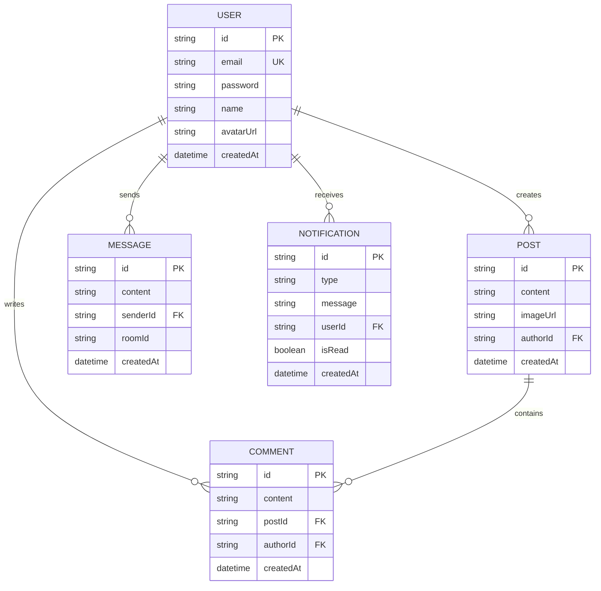
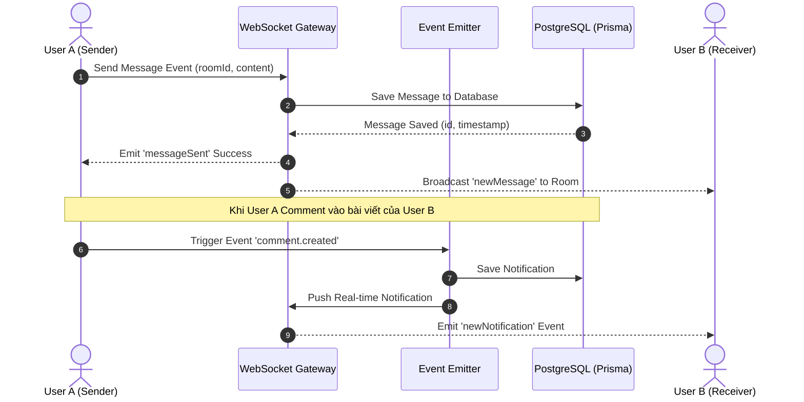

# Capstone Project Architecture: Real-Time Social Chat App

> **Tài liệu kỹ thuật thiết kế CSDL & Bản đồ API cho đồ án tốt nghiệp**

---

## 1. Mô Hình Sơ Đồ Thực Thể Quan Hệ (ERD Diagram)

---

## 2. Luồng Real-Time Chat & Notification (Sequence Diagram)

---

## 3. Bản Đồ REST API Endpoints

| Method | Endpoint | Description | Auth Required |
| :--- | :--- | :--- | :---: |
| `POST` | `/api/v1/auth/register` | Đăng ký tài khoản người dùng mới | No |
| `POST` | `/api/v1/auth/login` | Đăng nhập & Lấy Access Token | No |
| `GET` | `/api/v1/posts` | Lấy danh sách bài viết (Phân trang + Caching) | Optional |
| `POST` | `/api/v1/posts` | Tạo bài viết mới kèm upload hình ảnh | Bearer Token |
| `POST` | `/api/v1/posts/:id/comments` | Thêm bình luận (Bắn Event Notification) | Bearer Token |
| `GET` | `/api/v1/health` | Terminus Healthcheck (Soi DB & RAM) | No |
| `WS` | `ws://localhost:3000/socket.io` | WebSocket Gateway Chat & Real-time Alerts | Handshake Token |
