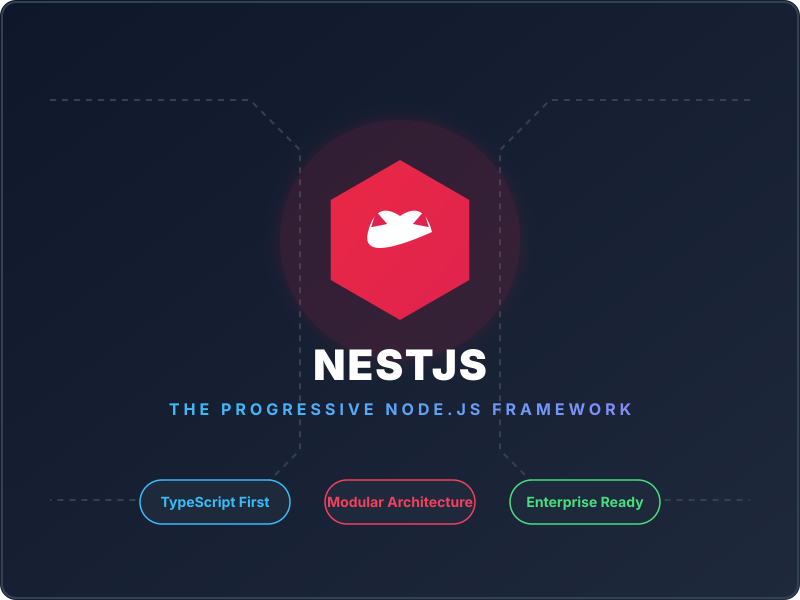
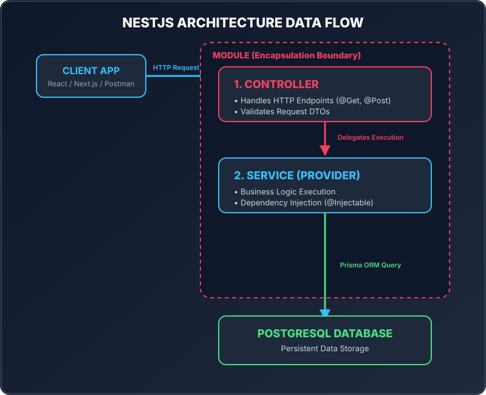

<!-- slide 1: Title -->

  

    <h1>Lesson 1.1: Tổng Quan Về NestJS</h1>
    <h3>Kiến Trúc Enterprise & Lý Do Lựa Chọn NestJS</h3>
    <ul>
      <li><strong>Khóa học:</strong> NestJS Practical Masterclass</li>
      <li><strong>Dự án thực chiến:</strong> Real-Time Social Chat App</li>
      <li><strong>Thời lượng:</strong> ~3 - 5 phút</li>
    </ul>
  

  

    
  

---

<!-- slide 2: What is NestJS -->

# NestJS Là Gì?

- **Progressive Node.js Framework**: Xây dựng dựa trên **TypeScript** chuẩn hóa.
- **Nền tảng bên dưới**: Sử dụng **Express.js** (mặc định) hoặc **Fastify** làm HTTP Engine.
- **Cảm hứng kiến trúc**: Ảnh hưởng bởi **Angular** (Modular, Decorators & Dependency Injection).

> **Mục tiêu cốt lõi:** Mang đến cấu trúc phần mềm chuẩn mực (Architectural Pattern) giúp quản lý ứng dụng Server-side Node.js quy mô lớn.

<!--
Speaker Notes:
Xin chào các bạn! Chào mừng các bạn đến với Lesson 1.1. Trong bài học này, chúng ta sẽ cùng tìm hiểu NestJS là gì và vì sao nó lại trở thành lựa chọn hàng đầu cho các hệ thống Backend Enterprise hiện nay.
NestJS không thay thế Express, mà nó bọc lấy Express để cung cấp một kiến trúc chuẩn mực giúp chúng ta viết code sạch và dễ quản lý.
-->

---

<!-- slide 3: Comparison Cards -->

# Express Spaghetti vs NestJS Architecture

  

    
Express.js Thuần

    <ul>
      <li><strong>Cấu trúc:</strong> Tự do quá mức ➔ Dễ thành "Spaghetti Code" khi dự án lớn.</li>
      <li><strong>Type Safety:</strong> Tùy chọn ➔ Dễ phát sinh lỗi Runtime không lường trước.</li>
      <li><strong>DI:</strong> Phải tự quản lý hoặc truyền thủ công.</li>
      <li><strong>Mở rộng:</strong> Khó maintain khi dự án & team phình to.</li>
    </ul>
  

  

    
NestJS Framework

    <ul>
      <li><strong>Cấu trúc:</strong> Định sẵn (Opinionated) ➔ Thống nhất phong cách code toàn team.</li>
      <li><strong>Type Safety:</strong> TypeScript First ➔ Phát hiện lỗi ngay lúc biên dịch.</li>
      <li><strong>DI:</strong> DI Container tự động ➔ Code loosely-coupled, dễ viết Unit Test.</li>
      <li><strong>Mở rộng:</strong> Dễ chia tách Module & phát triển song song.</li>
    </ul>
  

<!--
Speaker Notes:
Khi làm việc với Express thuần trong dự án lớn, mỗi lập trình viên lại có một phong cách viết code riêng, dẫn đến "Spaghetti Code". NestJS khắc phục triệt để bằng cách đưa ra bộ quy chuẩn chung: Controller ở đâu, Service ở đâu, Module nhóm thế nào.
-->

---

<!-- slide 4: Core Pillars with Architecture Diagram -->

  

    <h2>3 Trụ Cột Kiến Trúc Cốt Lõi</h2>
    <ul>
      <li><strong>Module</strong>: Đóng gói các tính năng liên quan.</li>
      <li><strong>Controller</strong>: Xử lý HTTP Request & Routing.</li>
      <li><strong>Service</strong>: Chứa Business Logic & tiêm qua DI.</li>
    </ul>
    <code>Client Request ➔ Controller ➔ Service ➔ Database</code>
  

  

    
  

<!--
Speaker Notes:
Mọi ứng dụng NestJS đều xoay quanh 3 khái niệm cốt lõi: Module dùng để đóng gói, Controller dùng để tiếp nhận yêu cầu từ client, và Service dùng để thực hiện các thao tác xử lý nghiệp vụ thực sự.
-->

---

<!-- slide 5: Ecosystem -->

# Hệ Sinh Thái Out-of-the-Box Chuẩn Enterprise

  

    
Validation & Security

    <ul>
      <li>Validate DTOs tự động với <code>class-validator</code>.</li>
      <li>Bảo mật với Passport, JWT Auth & Rate Limiting (<code>@nestjs/throttler</code>).</li>
    </ul>
  

  

    
Real-time & Tooling

    <ul>
      <li>WebSocket Gateways (Socket.io) & Event Emitter.</li>
      <li>Tự động sinh Swagger API UI (<code>@nestjs/swagger</code>).</li>
      <li>Cấu hình sẵn Jest cho Unit & E2E Testing.</li>
    </ul>
  

<!--
Speaker Notes:
Thay vì phải tự vắt óc tìm và ghép nối hàng chục thư viện lẻ tẻ, NestJS đã đóng gói sẵn mọi công cụ cần thiết cho một hệ thống Backend hoàn chỉnh theo tiêu chuẩn sản xuất (Production-Ready).
-->

---

<!-- slide 6: Summary & Next Step -->

# Tổng Kết & Bước Tiếp Theo

### Key Takeaways:

1. **NestJS** = TypeScript + Angular Architecture + Express Engine.
2. Giải quyết triệt để bài toán thiếu cấu trúc của Express trong dự án quy mô lớn.
3. Cung cấp sẵn **DI Container** và Hệ sinh thái đầy đủ cho Enterprise Backend.

---

### Bài học tiếp theo: **Lesson 1.2 - Demo App**

> Chúng ta sẽ cùng nhau **trải nghiệm & khám phá ứng dụng Real-time Social Chat App** hoàn chỉnh trước khi bắt tay vào code!

<!--
Speaker Notes:
Đó là toàn bộ tổng quan về NestJS. Hẹn gặp lại các bạn trong Lesson 1.2, nơi chúng ta sẽ cùng chạy thử ứng dụng Social Chat App thực tế để thấy được sức mạnh của hệ thống mà chúng ta sẽ tự tay xây dựng!
-->
