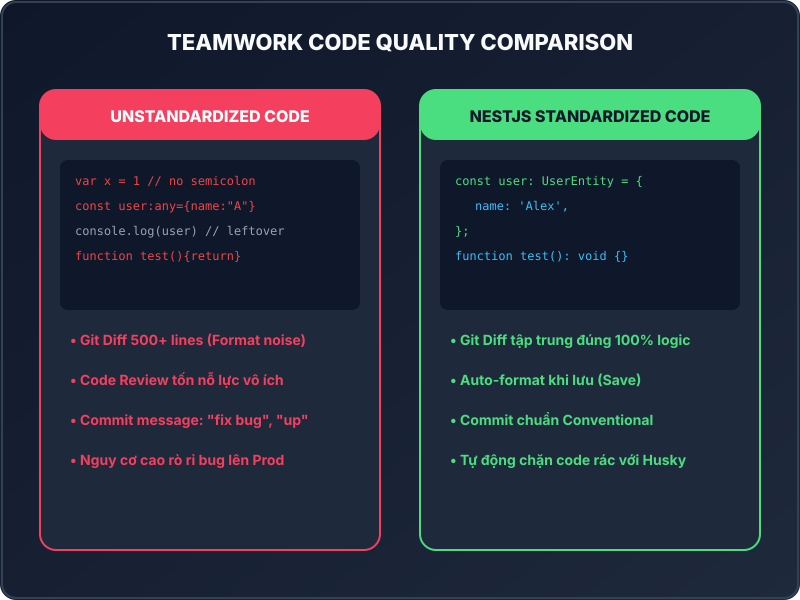
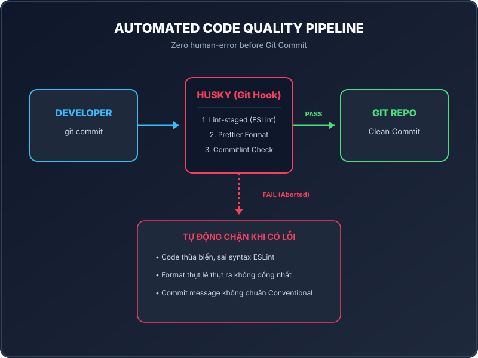

<!-- slide 1: Title -->

# Lesson 1.5: Teamwork Standards

### Vấn Đề Thường Gặp Trong Teamwork & Chuẩn Hóa Code Quality

- **Khóa học:** NestJS Thực Chiến: Xây Dựng API Từ Cơ Bản Đến Nâng Cao
- **Subtitle:** NestJS & TypeScript Thực Chiến: Xây Dựng Real-time Chat App với PostgreSQL, Prisma, WebSockets & Docker
- **Thời lượng:** ~3 - 5 phút

---

<!-- slide 2: Common Problems -->

# 3 Thách Thức Khi Làm Việc Nhóm

  

    <ul>
      <li><strong>Code Style Không Thống Nhất</strong>: Mỗi dev một kiểu format (tab/space, dấu phẩy).</li>
       
      <li><strong>Cảnh Báo Lint Bị Ngó Lơ</strong>: Để lọt kiểu <code>any</code>, thừa biến, rò rỉ <code>console.log</code>.</li>
       
      <li><strong>Commit Message Tùy Tiện</strong>: Đặt tên commit vô nghĩa như <code>"fix bug"</code>, <code>"update"</code>.</li>
    </ul>
  

  

    
  

<!--
Speaker Notes:
Xin chào các bạn! Khi làm việc một mình, bạn có thể viết code tùy ý. Tuy nhiên khi làm việc nhóm từ 3-10 người trở lên, nếu không có quy chuẩn tự động thì dự án sẽ rất nhanh chóng trở nên hỗn loạn.
-->

---

<!-- slide 3: Impacts -->

# Hậu Quả Của Việc Thiếu Chuẩn Hóa

  

    
Lãng Phí Nỗ Lực Code Review

    <ul>
      <li>Tech Lead phải bắt từng lỗi thụt lề, dấu chấm phẩy.</li>
      <li>Giảm 50% hiệu suất review logic nghiệp vụ thực tế.</li>
    </ul>
  

  

    
Git Diff Bị Nhiễu Sạn

    <ul>
      <li>Sửa 1 dòng code nhưng Git ghi nhận thay đổi 500 dòng do auto-format lệch nhau.</li>
      <li>Khó truy vết lịch sử commit khi cần Rollback.</li>
    </ul>
  

> **Thực tế ngành:** 80% thời gian của lập trình viên là đọc & bảo trì mã nguồn của đồng nghiệp.

<!--
Speaker Notes:
Hãy hình dung khi bạn review một Pull Request, thay vì xem logic đúng hay sai, bạn phải soi từng dấu chấm phẩy. Điều này làm giảm hiệu suất làm việc của cả tập thể.
-->

---

<!-- slide 4: Automated Solution -->

# Giải Pháp Tự Động Hóa (Automation First)

  

    <ul>
      <li><strong>Ngăn chặn từ gốc (Pre-commit Hook)</strong>: Chặn đứng code không chuẩn ngay trên máy dev trước khi gõ lệnh commit.</li>
       
      <li><strong>3 Lớp Kiểm Soát</strong>:
        <ol>
          <li><strong>ESLint</strong>: Quét lỗi cú pháp & code smells.</li>
          <li><strong>Prettier</strong>: Tự động định dạng code thống nhất.</li>
          <li><strong>Commitlint</strong>: Ép tuân thủ Conventional Commits.</li>
        </ol>
      </li>
    </ul>
  

  

    
  

<!--
Speaker Notes:
Giải pháp tối ưu nhất là cài đặt công cụ tự động kiểm tra và chặn lại ngay tại máy cá nhân nếu code chưa đạt tiêu chuẩn.
-->

---

<!-- slide 5: Tooling Stack -->

# Bộ Công Cụ Triển Khai Trong Module 1

  

    
Code Formatter & Linter

    <ul>
      <li><strong>ESLint:</strong> Phân tích tĩnh mã nguồn TypeScript.</li>
      <li><strong>Prettier:</strong> Tự động định dạng code nhất quán khi lưu.</li>
    </ul>
  

  

    
Git Automation & Commit Rules

    <ul>
      <li><strong>Husky:</strong> Tự động kích hoạt script khi chạy lệnh Git.</li>
      <li><strong>Lint-staged:</strong> Chỉ quét lint trên các tệp tin đang được commit.</li>
      <li><strong>Commitlint:</strong> Kiểm tra định dạng commit message.</li>
    </ul>
  

<!--
Speaker Notes:
Trong các bài học tiếp theo của Module 1, chúng ta sẽ lần lượt thiết lập trọn bộ 5 công cụ này cho dự án backend NestJS.
-->

---

<!-- slide 6: Summary & Next Step -->

# Tổng Kết & Bước Tiếp Theo

### Key Takeaways:

1. **Chuẩn hóa Code Quality** là bắt buộc cho dự án Enterprise & Teamwork.
2. Tự động hóa quá trình kiểm tra format & linting thông qua **Git Hooks**.
3. Đảm bảo mã nguồn luôn sạch trước khi đẩy (push) lên Git repository.

---

### Bài học tiếp theo: **Lesson 1.6 - Git Hooks & Husky**

> Chúng ta sẽ bắt tay vào **cấu hình Husky để tự động kiểm tra code** mỗi khi gõ lệnh `git commit`!

<!--
Speaker Notes:
Hẹn gặp lại các bạn trong Lesson 1.6, nơi chúng ta sẽ cài đặt và cấu hình thành công Husky cho dự án!
-->
