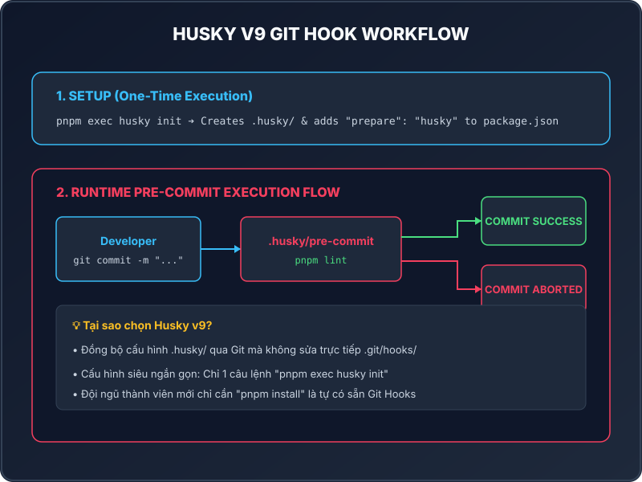

<!-- slide 1: Title -->

# Lesson 1.6: Git Hooks & Husky

### Tự Động Hóa Kiểm Tra Mã Nguồn Trước Khi Git Commit

- **Khóa học:** NestJS Practical Masterclass: Zero to Hero
- **Dự án thực chiến:** Real-Time Social Chat Application
- **Thời lượng:** ~3 - 5 phút

---

<!-- slide 2: Git Hooks Concepts -->

# Git Hooks Là Gì & Vấn Đề Thực Tế

<div class="grid-2">
  <div class="card">
    <div class="card-title text-solution">Git Hooks Mặc Định</div>
    <ul>
      <li>Là các kịch bản chạy tự động theo sự kiện Git.</li>
      <li><code>pre-commit</code>: Khởi chạy trước khi tạo commit.</li>
      <li><code>pre-push</code>: Khởi chạy trước khi push code lên Server.</li>
    </ul>
  </div>

  <div class="card">
    <div class="card-title text-problem">Hạn Chế Khi Làm Nhóm</div>
    <ul>
      <li>Thư mục <code>.git/hooks/</code> nằm ngoài Git quản lý.</li>
      <li>Không thể <code>git push</code> để chia sẻ cho đồng đội.</li>
      <li>Mỗi dev phải tự cấu hình bằng tay trên máy cá nhân.</li>
    </ul>
  </div>
</div>

<!--
Speaker Notes:
Xin chào các bạn! Mặc định Git hỗ trợ Git Hooks rất mạnh mẽ, nhưng do nó nằm trong thư mục .git nên không thể push lên GitHub để dùng chung cho cả team.
-->

---

<!-- slide 3: Husky v9 Solution -->

# Giải Pháp Cấu Hình Chuẩn Với Husky v9

- **Đồng bộ hóa đơn giản**: Lưu toàn bộ Git Hooks vào thư mục `.husky/` nằm trong mã nguồn dự án.
- **Tự động kích hoạt**: Tự động cài đặt Git Hooks cho mọi thành viên khi gõ `pnpm install`.
- **Khởi tạo 1-Click (Husky v9)**:

```bash
pnpm add --save-dev husky
pnpm exec husky init
```

> **Tự động hóa:** Thêm script `"prepare": "husky"` vào `package.json`.

<!--
Speaker Notes:
Husky v9 đã đơn giản hóa toàn bộ quá trình thiết lập. Bạn chỉ cần chạy lệnh husky init là toàn bộ hạ tầng Git Hooks đã sẵn sàng.
-->

---

<!-- slide 4: Visual Flow -->

<div class="grid-2">
  <div>
    <h2>Quy Trình Hoạt Động Của Pre-commit Hook</h2>
    <ul>
      <li>Lập trình viên gõ <code>git commit</code>.</li>
      <li>Git kích hoạt tệp script <code>.husky/pre-commit</code>.</li>
      <li>Nếu <code>pnpm lint</code> thành công ➔ Tạo commit thành công.</li>
      <li>Nếu phát sinh lỗi ➔ Tự động dừng commit và báo lỗi trên Terminal.</li>
    </ul>
  </div>

  <div>
    
  </div>
</div>

<!--
Speaker Notes:
Sơ đồ bên cạnh mô tả luồng kiểm tra của Husky. Nếu mã nguồn của bạn có biến thừa hoặc sai cú pháp ESLint, Husky sẽ ngăn không cho lưu commit đó lại.
-->

---

<!-- slide 5: Practice & Test -->

# Cấu Hình File `.husky/pre-commit` & Demo

<div class="grid-2">
  <div class="card">
    <div class="card-title text-solution">File Cấu Hình .husky/pre-commit</div>
    <pre><code class="language-bash">pnpm lint</code></pre>
    <p style="font-size: 0.85em; color: #94a3b8;">Chạy quét linter ESLint trên toàn bộ dự án NestJS trước khi commit.</p>
  </div>

  <div class="card">
    <div class="card-title text-problem">Demo Chặn Code Lỗi</div>
    <ul>
      <li>Khai báo 1 biến thừa <code>const unusedVar = 1;</code>.</li>
      <li>Chạy <code>git commit -m "test"</code>.</li>
      <li>Husky báo lỗi ESLint ➔ <strong>Commit Aborted</strong>.</li>
    </ul>
  </div>
</div>

<!--
Speaker Notes:
Bằng việc đưa lệnh pnpm lint vào file pre-commit, dự án của bạn sẽ không bao giờ bị dính các lỗi lặt vặt như thừa biến hay sai format lên kho lưu trữ.
-->

---

<!-- slide 6: Summary & Next Step -->

# Tổng Kết & Bước Tiếp Theo

### Key Takeaways:

1. **Husky v9** giúp quản lý & đồng bộ Git Hooks cực kỳ mượt mà cho Teamwork.
2. Script `"prepare": "husky"` tự động cài Git Hooks khi chạy `pnpm install`.
3. Tệp `.husky/pre-commit` đảm bảo mã nguồn luôn đi qua bộ lọc kiểm tra trước khi commit.

---

### Bài học tiếp theo: **Lesson 1.7 - Lint-staged**

> Chúng ta sẽ tìm hiểu **Lint-staged** để chỉ quét linter trên các file được chọn (staged), giúp tăng tốc độ commit gấp 10 lần!

<!--
Speaker Notes:
Hẹn gặp lại các bạn trong Lesson 1.7, nơi chúng ta sẽ tối ưu hóa tốc độ của pre-commit hook với Lint-staged!
-->
