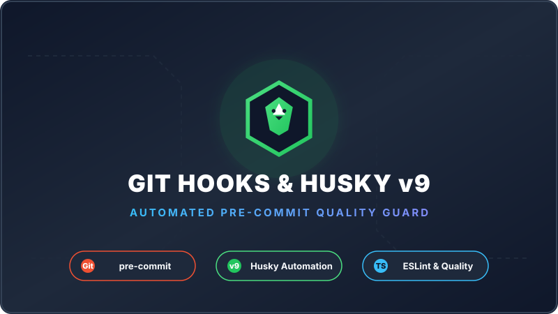
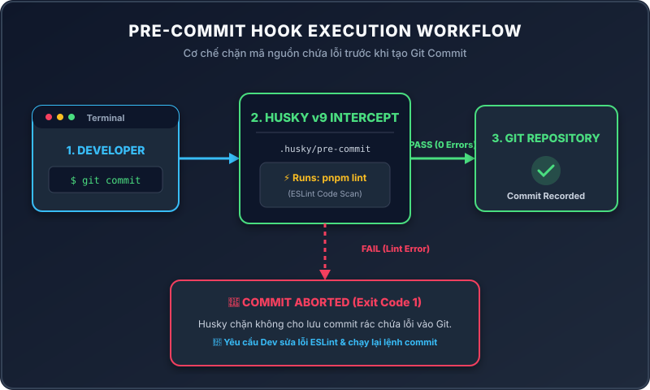
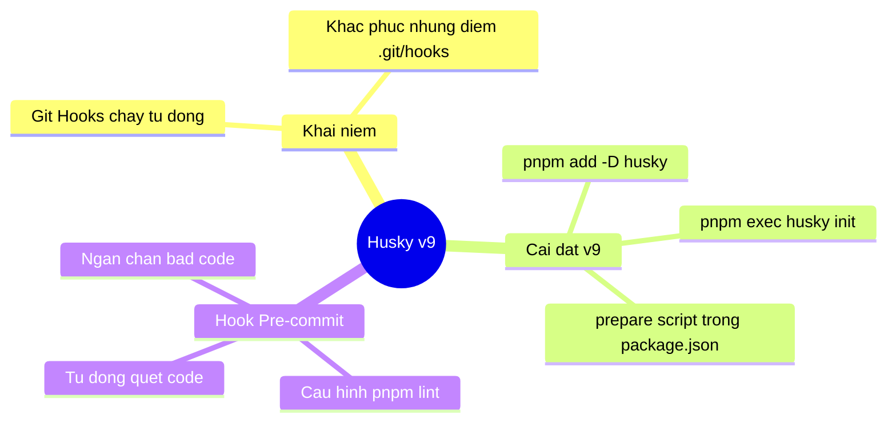

# Lesson 1.6: Git Hooks & Tự Động Hóa Kiểm Tra Code Với Husky v9

<p align="center">
  
  
  
  
  
</p>

<p align="center">
  
</p>

---

> [!NOTE]
> ⏱️ **Thời lượng dự kiến:** 10 – 12 phút  
> 🎯 **Mục tiêu bài học:** Nắm vững bản chất của Git Hooks, hiểu lý do cần đến Husky v9 và thực hành cài đặt, cấu hình script `.husky/pre-commit` để tự động hóa việc linter/testing trước khi lưu mã nguồn vào Git history.

---

## 1. Khái Niệm Git Hooks & Tại Sao Cần Husky?

### 🔹 Git Hooks Là Gì?

**Git Hooks** là các kịch bản (scripts) được Git tự động kích hoạt khi xuất hiện các sự kiện quan trọng trong quy trình làm việc với mã nguồn:

| Git Hook | Thời điểm kích hoạt | Ứng dụng phổ biến |
| :--- | :--- | :--- |
| `pre-commit` | Trước khi lệnh `git commit` ghi nhận commit | Chạy Linter, Formatter, Unit Tests |
| `commit-msg` | Khi đang kiểm tra thông điệp commit | Kiểm tra chuẩn **Conventional Commits** |
| `pre-push` | Trước khi lệnh `git push` đẩy code lên remote | Chạy Integration/E2E Tests |

---

### ⚠️ Bài Toán Đặt Ra Với Git Hooks Mặc Định

Mặc định, các file hooks của Git nằm trong thư mục ẩn `.git/hooks/`. Tuy nhiên, thư mục `.git/` **không bao giờ được push lên remote repository** (GitHub/GitLab).

> [!WARNING]
> **Hậu quả trong Teamwork:** Nếu bạn viết kịch bản kiểm tra code trong `.git/hooks/` trên máy cá nhân, các thành viên khác khi clone dự án về sẽ **hoàn toàn không nhận được cấu hình này**. Điều này dẫn đến việc mã nguồn không chuẩn hóa (chứa lỗi lint, format sai...) vẫn bị đẩy lên Git.

---

### 💡 Giải Pháp Với Husky (v9)

**Husky** là thư viện phổ biến nhất trong hệ sinh thái Node.js/TypeScript giúp đồng bộ hóa các Git Hooks trong dự án:

```mermaid
graph LR
    subgraph Local Machine
        Dev1[Dev A: git commit] --> Husky1[Husky: .husky/pre-commit]
    end

    subgraph Git Remote
        Repo[(GitHub Repository)]
    end

    subgraph Team Member
        Husky2[Husky Auto Installed via prepare] <-- git clone & pnpm install -- Dev2[Dev B]
    end

    Husky1 -->|Pushes .husky folder| Repo
    Repo -->|Pulls .husky folder| Dev2
```

- 📂 Đưa toàn bộ kịch bản kiểm tra vào thư mục `.husky/` nằm trực tiếp ở góc dự án.
- 🔄 Thư mục `.husky/` được commit và đẩy lên Git như mã nguồn bình thường.
- 🚀 Mọi thành viên khi `git clone` dự án và chạy `pnpm install` sẽ **tự động có đầy đủ các Git Hooks**.

---

## 2. Quy Trình Hoạt Động Của Pre-commit Hook

Sơ đồ mô tả luồng kiểm tra tự động khi lập trình viên thực hiện lệnh `git commit`:

<p align="center">
  
</p>

---

## 3. Các Bước Cài Đặt & Khởi Tạo Husky v9

### 📌 Bước 1: Kiểm Tra Git Repository

Đảm bảo dự án NestJS của bạn đã được khởi tạo Git. Nếu chưa, hãy mở Terminal tại thư mục dự án và chạy:

```bash
git init
```

---

### 📌 Bước 2: Cài Đặt Package Husky

Sử dụng `pnpm` để cài đặt Husky vào danh sách `devDependencies`:

```bash
pnpm add --save-dev husky
```

---

### 📌 Bước 3: Khởi Tạo Cấu Hình Husky v9

Khởi tạo cấu hình tự động với câu lệnh chuẩn từ tài liệu chính thức của Husky:

```bash
pnpm exec husky init
```

> [!TIP]
> Nếu dự án dùng `npm` hoặc `yarn`, câu lệnh tương đương sẽ là `npx husky init` hoặc `yarn husky init`.

---

### 🛠️ Tự Động Hóa 3 Tác Vụ Của `husky init`:

Sau khi chạy lệnh trên, Husky sẽ tự động thực thi 3 công việc:

| STT | Tác vụ tự động | Mục đích |
| :---: | :--- | :--- |
| **1** | Tạo thư mục `.husky/` | Lưu trữ toàn bộ các Git hooks của dự án |
| **2** | Tạo file mẫu `.husky/pre-commit` | Chứa câu lệnh hook mặc định |
| **3** | Cập nhật `package.json` | Tự động thêm script `"prepare": "husky"` |

Kiểm tra tệp `package.json`, bạn sẽ thấy trong mục `scripts` xuất hiện dòng lệnh mới:

📄 **`package.json`**
```json
{
  "scripts": {
    "prepare": "husky"
  }
}
```

> [!IMPORTANT]
> **Ý nghĩa của script `"prepare": "husky"`:** Khi đồng nghiệp tải dự án về và chạy `pnpm install`, quy trình lifecycle hook của npm/pnpm sẽ tự động chạy lệnh `prepare` này để kích hoạt Git Hooks trên máy của họ mà không cần thêm thao tác thủ công nào.

---

## 4. Cấu Hình Hook `.husky/pre-commit`

Mở tệp `.husky/pre-commit` vừa được tạo trong editor. Bạn sẽ thấy câu lệnh mặc định:

📄 **`.husky/pre-commit` (Mặc định)**
```bash
pnpm test
```

Hãy thay đổi nội dung tệp `.husky/pre-commit` thành lệnh quét linter của NestJS để đảm bảo mã nguồn sạch đẹp trước khi commit:

📄 **`.husky/pre-commit` (Đã cập nhật)**
```bash
pnpm lint
```

> [!NOTE]
> Lệnh `pnpm lint` sẽ chạy ESLint quét toàn bộ mã nguồn TypeScript trong thư mục `src/` để phát hiện lỗi cú pháp, biến không sử dụng hoặc vi phạm coding convention.

---

## 5. Thực Hành Kiểm Tra Tính Năng Của Husky

### 🟢 Kịch Bản 1: Commit Với Code Sạch (Thành Công)

1. Thêm các tệp đã sửa đổi vào Staging Area:
   ```bash
   git add .
   ```
2. Thực hiện lệnh commit:
   ```bash
   git commit -m "chore: setup husky pre-commit hook"
   ```
3. **Quan sát Terminal:** Bạn sẽ thấy Husky tự động kích hoạt `pnpm lint`. Khi không phát hiện lỗi nào, lệnh commit sẽ hoàn tất thành công.

---

### 🔴 Kịch Bản 2: Commit Khi Có Lỗi Syntax/Lint (Bị Chặn)

Để kiểm tra cơ chế ngăn chặn mã nguồn lỗi của Husky, hãy cố tình tạo ra một lỗi linter:

1. Mở tệp `src/app.controller.ts`.
2. Khai báo một biến thừa không được sử dụng bên trong hàm `getHello()`:

   📄 **`src/app.controller.ts`**
   ```typescript
   @Get()
   getHello(): string {
     const unusedVariable = 'I am a bug'; // ⚠️ Biến thừa không sử dụng
     return this.appService.getHello();
   }
   ```

3. Lưu file và thử thực hiện lệnh commit:
   ```bash
   git add .
   git commit -m "test: try committing unused variable"
   ```

4. **Kết quả hiển thị trên Terminal:**

   ```text
   > nestjs-basic-course@0.0.1 lint /Users/tanthanh/Documents/Project/nestjs-basic-course
   > eslint "{src,apps,libs,test}/**/*.ts" --fix

   /Users/tanthanh/Documents/Project/nestjs-basic-course/src/app.controller.ts
     7:11  error  'unusedVariable' is assigned a value but never used  @typescript-eslint/no-unused-vars

   ✖ 1 problem (1 error, 0 warnings)

   husky - pre-commit script failed (code 1)
   ```

> [!CAUTION]
> Husky đã phát hiện lỗi ESLint và **ngay lập tức hủy bỏ lệnh commit** (`code 1`). Lịch sử Git repository của bạn được bảo vệ an toàn khỏi commit chứa lỗi!

5. **Khắc phục lỗi:** Xóa dòng biến thừa `unusedVariable`, lưu tệp và chạy lệnh `git commit` lại. Quá trình commit sẽ vượt qua thành công!

---

## 6. Tổng Kết Bài Học & Checklist Ghi Nhớ



### ✅ Checklist Ghi Nhớ Bài Học:
- [x] Thư mục `.git/hooks` không được push lên Remote Repository.
- [x] Husky v9 lưu kịch bản trong thư mục `.husky/` giúp đồng bộ cả team.
- [x] Lệnh `pnpm exec husky init` tạo `.husky/`, pre-commit hook và tự động thêm script `"prepare": "husky"`.
- [x] `.husky/pre-commit` chạy lệnh `pnpm lint` để chặn commit lỗi.

---

👉 **Bài tiếp theo:** [Lesson 1.7: Tự Động Format & Lint Với Lint-Staged](../lesson-1.7/lesson-1.7.md) *(chỉ lint những file thực sự thay đổi thay vì quét toàn bộ project)*.
