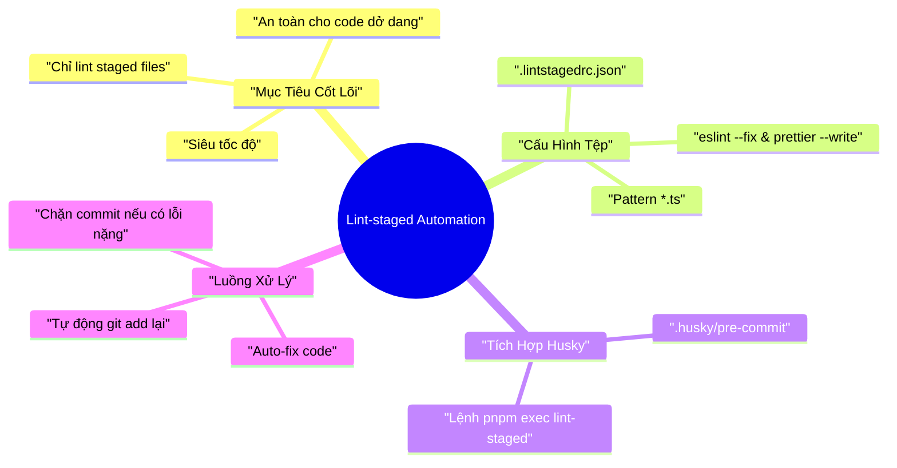

# Lesson 1.7: Lint-staged: Tự Động Lint và Format Code Trước Commit

<p align="center">
  
  
  
  
  
  
</p>

<p align="center">
  
</p>

---

> [!NOTE]
> ⏱️ **Thời lượng dự kiến:** 10 – 12 phút  
> 🎯 **Mục tiêu bài học:** Nắm vững lý do tại sao lint toàn bộ codebase trước commit là kém hiệu quả, hiểu cách `lint-staged` lọc các file trong Staging Area, thực hành cài đặt và cấu hình `.lintstagedrc.json` kết hợp với Husky pre-commit hook để tự động hóa quy trình lint & format siêu tốc.

---

## 1. Đặt Vấn Đề: Tại Sao Lint Cả Dự Án Lại Là "Thảm Họa"?

Ở [Lesson 1.6](../lesson-1.6/lesson-1.6.md), chúng ta đã tích hợp thành công **Husky** để tự động kích hoạt câu lệnh linter trước mỗi lần commit. Tuy nhiên, nếu bạn chỉ đặt lệnh `pnpm lint` hoặc `pnpm format` trực tiếp vào tệp `.husky/pre-commit`, dự án thực tế sẽ nhanh chóng gặp 3 bất cập lớn:

### ⚠️ 3 Bất Cập Khi Kiểm Tra Toàn Bộ Dự Án (Whole Repo Checking)

1. **⏱️ Chậm chạp (Performance Bottleneck):**
   Khi dự án phát triển lên hàng trăm tệp tin TypeScript (`.ts`), việc thực thi `pnpm lint` kiểm tra lại **toàn bộ codebase** mỗi lần gõ `git commit` sẽ tốn từ **30 giây đến vài phút**. Lập trình viên sẽ cảm thấy vô cùng ức chế khi chỉ sửa 1 dòng code nhưng phải ngồi chờ linter chạy xong.

2. **🚫 Bị phạt "oan" (Noise & Collateral Damage):**
   Bạn chỉ chỉnh sửa tệp `src/users/users.service.ts`, nhưng câu lệnh `git commit` lại bị chặn vì tệp `src/auth/auth.controller.ts` (do một đồng nghiệp khác commit từ hôm qua) đang chứa lỗi lint chưa sửa.

3. **💥 Format nhầm các tệp chưa làm xong (Unstaged Files Damage):**
   Nếu chạy `prettier --write .`, Prettier sẽ tự động định dạng lại **tất cả** tệp trong dự án — bao gồm cả những tệp bạn đang gõ dở, chưa kiểm thử và chưa hề muốn đưa vào `git add`.

---

### 💡 Giải Pháp: Lint-staged Là Gì?

**Lint-staged** là một thư viện Node.js chuyên biệt giúp lọc và **chỉ thực thi các kịch bản linter/formatter đối với những tệp đang nằm trong Staging Area** (tức các tệp đã được bạn chọn lọc thông qua lệnh `git add`).

| Tiêu chí | Chạy Linter Toàn Dự Án (`pnpm lint`) | Chạy Với Lint-staged (`lint-staged`) |
| :--- | :--- | :--- |
| **Phạm vi kiểm tra** | Toàn bộ 100% tệp tin trong repo | **Chỉ các tệp đã `git add` (Staged)** |
| **Tốc độ thực thi** | Chậm (Tăng dần theo quy mô dự án) | **Siêu tốc (Chỉ tốn vài trăm mili-giây)** |
| **Tự động Re-stage** | Không hỗ trợ tự động | **Tự động `git add` lại sau khi auto-fix** |
| **Tác động file dở dở** | Nguy cơ ảnh hưởng file chưa add | **Tuyệt đối an toàn cho unstaged files** |

---

## 2. Nguyên Lý Hoạt Động & Workflow Của Lint-staged

Quy trình phối hợp giữa **Git**, **Husky** và **Lint-staged** diễn ra theo 4 bước khép kín như sơ đồ dưới đây:

<p align="center">
  
</p>

### 🛠️ Chi Tiết 4 Bước Xử Lý:

1. **Kích hoạt Hook:** Lập trình viên chạy lệnh `git commit -m "..."`. Git kích hoạt kịch bản `.husky/pre-commit`.
2. **Lọc Staged Files:** Husky thực thi lệnh `lint-staged`. Lint-staged truy vấn Git để lấy danh sách các file trong trạng thái Staged (`git diff --staged --name-only`).
3. **Chạy Task Theo Match Pattern:** So khớp đuôi file với cấu hình:
   - Các file `*.ts`: Chạy `eslint --fix` và `prettier --write`.
   - Các file `*.json`, `*.md`: Chạy `prettier --write`.
4. **Tự Động Re-stage & Hoàn Tất:**
   - 🟢 Nếu code được tự động sửa (Auto-fixed) và không còn lỗi: Lint-staged tự động `git add` lại các thay đổi vừa sửa và ghi nhận commit thành công.
   - 🔴 Nếu chứa lỗi không thể auto-fix (Lỗi cú pháp syntax, thiếu kiểu dữ liệu...): Lint-staged trả về exit code `1`, ngăn chặn lệnh commit và in vị trí dòng lỗi ra terminal.

---

## 3. Các Bước Cài Đặt & Cấu Hình Step-by-Step

### 📌 Bước 1: Cài Đặt Package `lint-staged`

Mở terminal tại thư mục gốc của dự án NestJS và cài đặt `lint-staged` vào danh sách `devDependencies`:

```bash
pnpm add --save-dev lint-staged
```

---

### 📌 Bước 2: Tạo File Cấu Hình `.lintstagedrc.json`

Tạo một tệp cấu hình mới có tên `.lintstagedrc.json` nằm tại thư mục gốc của dự án (cùng cấp với `package.json`):

📄 **`.lintstagedrc.json`**
```json
{
  "*.ts": [
    "eslint --fix",
    "prettier --write"
  ],
  "*.{json,md,yml,yaml}": [
    "prettier --write"
  ]
}
```

> [!TIP]
> **Giải thích cấu hình:**
> - `"*.ts"`: Áp dụng cho mọi tệp TypeScript đang staged. Đầu tiên chạy `eslint --fix` để tự động sửa các quy tắc code style NestJS/TypeScript, sau đó chạy `prettier --write` để căn chỉnh khoảng trắng và format lại chuẩn xác.
> - `"*.{json,md,yml,yaml}"`: Định dạng lại các tệp cấu hình JSON, tài liệu Markdown và YAML với Prettier.

> [!NOTE]
> Ngoài cách dùng `.lintstagedrc.json`, bạn cũng có thể nhúng trực tiếp cấu hình này vào key `"lint-staged"` trong tệp `package.json`. Tuy nhiên, việc tách file riêng giúp `package.json` gọn gàng hơn.

---

### 📌 Bước 3: Tích Hợp Lint-staged Vào Husky Pre-commit Hook

Mở tệp kịch bản `.husky/pre-commit` đã khởi tạo từ Lesson 1.6, cập nhật nội dung để chuyển từ việc chạy linter toàn bộ sang dùng `lint-staged`:

📄 **`.husky/pre-commit`**
```bash
pnpm exec lint-staged
```

> [!IMPORTANT]
> Câu lệnh `pnpm exec lint-staged` giúp gọi trực tiếp binary executable của `lint-staged` đã cài trong `node_modules` một cách chuẩn xác trên cả macOS, Linux và Windows mà không lo lỗi môi trường path.

---

## 4. Kịch Bản Thử Nghiệm Thực Tế (Hands-on Lab)

Hãy cùng thực hành 2 kịch bản thực tế để kiểm chứng sức mạnh của `lint-staged`.

---

### 🟢 Kịch Bản 1: Tự Động Format & Fix Code Đang Staged (Success Flow)

Chúng ta sẽ cố tình viết một file code TypeScript bị lỗi format và thừa khoảng trắng để xem `lint-staged` tự động xử lý.

#### 1️⃣ Bước 1: Chỉnh sửa file `src/users/users.service.ts` với code "bẩn":

📄 **`src/users/users.service.ts`**
```typescript
import { Injectable } from '@nestjs/common';

@Injectable()
export class UsersService {
  findAll() {
      const msg = 'Hello NestJS'  ; // Dư thừa khoảng trắng & thiếu semicolon
    return msg;
  }
}
```

#### 2️⃣ Bước 2: Đưa file vào Staging Area và commit:

```bash
git add src/users/users.service.ts
git commit -m "feat: implement find all users"
```

#### 3️⃣ Bước 3: Quan sát Terminal Output:

```bash
✔ Preparing lint-staged...
✔ Running tasks for staged files...
  ❯ .lintstagedrc.json — 1 file
    ❯ *.ts — 1 file
      ✔ eslint --fix
      ✔ prettier --write
✔ Applying modifications from tasks...
✔ Cleaned up working tree.
[main 4f8a12b] feat: implement find all users
 1 file changed, 6 insertions(+)
```

#### 4️⃣ Bước 4: Kiểm tra lại tệp `src/users/users.service.ts`:

Mở lại file trong VS Code, bạn sẽ thấy code đã được **tự động căn chỉnh mượt mà** và tự động stage lại vào commit mà bạn không cần thao tác thêm bất kỳ lệnh nào!

```typescript
import { Injectable } from '@nestjs/common';

@Injectable()
export class UsersService {
  findAll() {
    const msg = 'Hello NestJS';
    return msg;
  }
}
```

---

### 🔴 Kịch Bản 2: Phát Hiện Lỗi Cú Pháp Không Thể Auto-Fix (Blocked Flow)

Bây giờ, chúng ta thử tạo một lỗi logic nghiêm trọng hoặc lỗi cú pháp syntax mà ESLint/TypeScript không thể tự sửa được.

#### 1️⃣ Bước 1: Cố tình viết code lỗi cú pháp tại `src/app.controller.ts`:

📄 **`src/app.controller.ts`**
```typescript
import { Controller, Get } from '@nestjs/common';

@Controller()
export class AppController {
  @Get()
  getHello(): string {
    const total: number = "INVALID_NUMBER_STRING"; // Lỗi gán sai type & chưa đóng ngoặc chuẩn
    return total
```

#### 2️⃣ Bước 2: Đưa file vào Staging Area và commit:

```bash
git add src/app.controller.ts
git commit -m "fix: add broken endpoint"
```

#### 3️⃣ Bước 3: Quan sát Terminal Output:

```bash
✔ Preparing lint-staged...
❯ Running tasks for staged files...
  ❯ .lintstagedrc.json — 1 file
    💥 *.ts — 1 file
      ✖ eslint --fix [FAILED]
      ◼ prettier --write

✖ eslint --fix:
/path/to/src/app.controller.ts
  8:5  error  Parsing error: Unexpected token, expected "}"

✖ lint-staged failed due to tasks errors.
husky - pre-commit script failed (exit code 1)
```

> [!CAUTION]
> **Kết quả:** Lệnh `git commit` bị chặn ngay lập tức với exit code `1`. Lỗi cú pháp được chỉ rõ dòng 8 cột 5. Tệp hư hỏng không thể bị đưa vào lịch sử Git branch của dự án.

---

## 5. Tổng Kết Bài Học & Checklist Ghi Nhớ



### ✅ Checklist Ghi Nhớ Bài Học:

- [x] Hiểu lý do không nên chạy `pnpm lint` toàn dự án trong `pre-commit` hook.
- [x] Đã cài đặt thư viện `lint-staged` bằng `pnpm add -D lint-staged`.
- [x] Đã tạo file cấu hình `.lintstagedrc.json` định nghĩa quy tắc cho `*.ts`, `*.json`, `*.md`.
- [x] Đã cập nhật file `.husky/pre-commit` thành `pnpm exec lint-staged`.
- [x] Thử nghiệm thành công kịch bản auto-fix & kịch bản ngăn chặn commit khi gặp lỗi syntax.

---

👉 **Bài tiếp theo:** [Lesson 1.8: Commitlint & Conventional Commits - Giữ Commit Message Chuẩn Hóa](../lesson-1.8/lesson-1.8.md)
