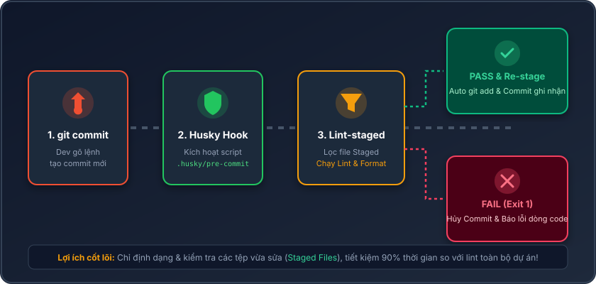
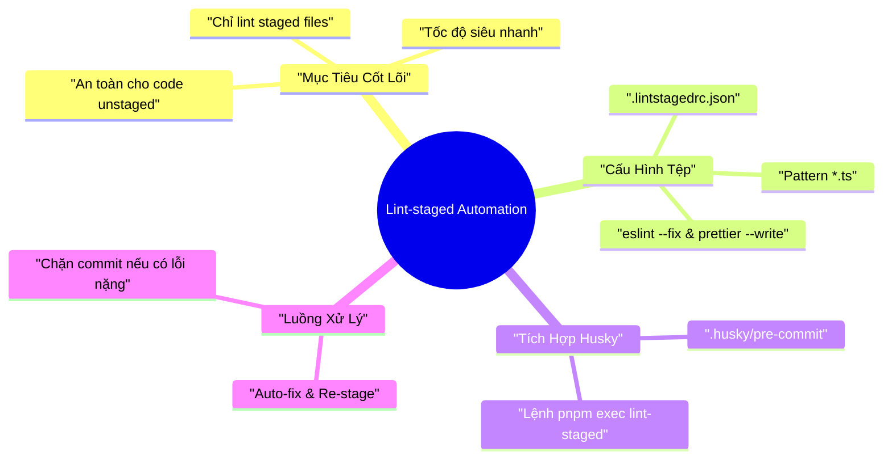

# Lesson 1.7: Lint-staged: Tự Động Lint và Format Code Trước Commit

<p align="center">
  
  
  
  
  
  
</p>

<p align="center">
  
</p>

---

> [!NOTE]
> ⏱️ **Thời lượng dự kiến:** 10 – 12 phút  
> 🎯 **Mục tiêu bài học:** Nắm vững lý do tại sao lint toàn bộ codebase trước commit là kém hiệu quả, hiểu cách `lint-staged` lọc các file trong Staging Area, thực hành cài đặt và cấu hình `.lintstagedrc.json` kết hợp với Husky pre-commit hook để tự động hóa quy trình lint & format siêu tốc.

---

## 1. Đặt Vấn Đề & Giải Pháp Lint-staged

Ở [Lesson 1.6](../lesson-1.6/lesson-1.6.md), chúng ta đã dùng **Husky** để tự động kích hoạt linter trước khi commit. Tuy nhiên, việc đặt trực tiếp `pnpm lint` vào `.husky/pre-commit` để kiểm tra **toàn bộ dự án** gây ra 3 vấn đề lớn:

> [!WARNING]
>
> - ⏱️ **Chậm chạp:** Dự án lớn tốn 30s – vài phút chạy lint dù bạn chỉ sửa 1 dòng code.
> - 🚫 **Bị phạt "oan":** Commit bị chối vì file của đồng nghiệp chưa sửa lỗi lint.
> - 💥 **Format nhầm:** `prettier --write .` format cả những file dở dang chưa `git add`.

### 💡 Giải Pháp Với Lint-staged

**Lint-staged** chỉ thực thi linter/formatter trên các tệp đang ở **Staging Area** (`git add`), tối ưu hóa tốc độ và bảo vệ mã nguồn.

| Tiêu chí                  | Chạy Linter Toàn Dự Án (`pnpm lint`) | Chạy Với Lint-staged (`lint-staged`)  |
| :------------------------ | :----------------------------------- | :------------------------------------ |
| **Phạm vi kiểm tra**      | 100% tệp tin trong repo              | **Chỉ các tệp đã `git add` (Staged)** |
| **Tốc độ thực thi**       | Chậm (Tăng theo quy mô dự án)        | **Siêu tốc (< 1 giây)**               |
| **Tự động Re-stage**      | Không hỗ trợ                         | **Tự động `git add` lại sau khi fix** |
| **Tác động file dở dang** | Nguy cơ ảnh hưởng file unstaged      | **Tuyệt đối an toàn**                 |

---

## 2. Nguyên Lý Hoạt Động & Workflow Của Lint-staged

Luồng phối hợp tự động giữa **Git**, **Husky** và **Lint-staged**:

<p align="center">
  
</p>

### 🛠️ 4 Bước Xử Lý Cốt Lõi:

1. **Kích hoạt Hook:** Dev chạy `git commit` $\rightarrow$ Husky gọi `.husky/pre-commit`.
2. **Lọc Staged Files:** `lint-staged` lấy danh sách file staged từ Git (`git diff --staged`).
3. **Chạy Task Theo Match Pattern:**
   - Files `*.ts`: Chạy `eslint --fix` & `prettier --write`.
   - Files `*.json`, `*.md`: Chạy `prettier --write`.
4. **Tự Động Re-stage & Hoàn Tất:**
   - 🟢 **Success:** Auto-fix thành công $\rightarrow$ Tự động `git add` lại $\rightarrow$ Commit ghi nhận.
   - 🔴 **Failed:** Phát hiện lỗi nặng (syntax/type) $\rightarrow$ Trả về Exit Code 1 $\rightarrow$ Hủy commit.

---

## 3. Cài Đặt & Cấu Hình Step-by-Step

### 📌 Bước 1: Cài Đặt Package `lint-staged`

```bash
pnpm add --save-dev lint-staged
```

### 📌 Bước 2: Tạo Tệp Cấu Hình `.lintstagedrc.json`

Tạo tệp `.lintstagedrc.json` tại thư mục gốc dự án:

📄 **`.lintstagedrc.json`**

```json
{
  "*.ts": ["eslint --fix", "prettier --write"],
  "*.{json,md,yml,yaml}": ["prettier --write"]
}
```

> [!TIP]
>
> - `"*.ts"`: Sửa lỗi code style NestJS/TypeScript với ESLint, sau đó định dạng lại chuẩn Prettier.
> - `"*.{json,md,yml,yaml}"`: Định dạng gọn gàng các tệp cấu hình & tài liệu.

### 📌 Bước 3: Tích Hợp Vào Husky Pre-commit Hook

Cập nhật kịch bản `.husky/pre-commit`:

📄 **`.husky/pre-commit`**

```bash
pnpm exec lint-staged
```

> [!IMPORTANT]
> Lệnh `pnpm exec lint-staged` gọi trực tiếp binary executable của `lint-staged` trong `node_modules`, đảm bảo chạy ổn định trên mọi hệ điều hành (macOS, Linux, Windows).

---

## 4. Kịch Bản Thử Nghiệm Thực Tế (Hands-on Lab)

### 🟢 Kịch Bản 1: Tự Động Format & Fix Code Staged (Success Flow)

1️⃣ **Cố tình viết code "bẩn" tại `src/users/users.service.ts`:**

📄 **`src/users/users.service.ts`**

```typescript
import { Injectable } from '@nestjs/common';

@Injectable()
export class UsersService {
  findAll() {
    const msg = 'Hello NestJS'; // Thừa khoảng trắng & thiếu dấu chấm phẩy
    return msg;
  }
}
```

2️⃣ **Stage file và commit:**

```bash
git add src/users/users.service.ts
git commit -m "feat: implement find all users"
```

3️⃣ **Kết quả trên Terminal:**

```bash
✔ Preparing lint-staged...
✔ Running tasks for staged files...
  ❯ .lintstagedrc.json — 1 file
    ❯ *.ts — 1 file
      ✔ eslint --fix
      ✔ prettier --write
✔ Applying modifications from tasks...
✔ Cleaned up working tree.
[main 4f8a12b] feat: implement find all users
```

4️⃣ **Kiểm tra file sau commit:** Code tự động được căn chỉnh chuẩn xác và lưu vào commit mà không cần can thiệp thủ công.

---

### 🔴 Kịch Bản 2: Chặn Commit Khi Có Lỗi Cú Pháp (Blocked Flow)

1️⃣ **Viết code lỗi syntax nghiêm trọng tại `src/app.controller.ts`:**

📄 **`src/app.controller.ts`**

```typescript
import { Controller, Get } from '@nestjs/common';

@Controller()
export class AppController {
  @Get()
  getHello(): string {
    const total: number = "INVALID_NUMBER_STRING";
    return total // Thừa lỗi syntax chưa đóng ngoặc
```

2️⃣ **Stage file và commit:**

```bash
git add src/app.controller.ts
git commit -m "fix: add broken endpoint"
```

3️⃣ **Kết quả trên Terminal:**

```bash
✖ eslint --fix:
/path/to/src/app.controller.ts
  8:5  error  Parsing error: Unexpected token, expected "}"

✖ lint-staged failed due to tasks errors.
husky - pre-commit script failed (exit code 1)
```

> [!CAUTION]
> Lệnh `git commit` bị chặn lập tức (Exit Code 1). File lỗi không thể lọt vào Git history của dự án.

---

## 5. Tổng Kết Bài Học & Checklist Ghi Nhớ



### ✅ Checklist Ghi Nhớ Bài Học:

- [x] Nắm vững ưu điểm của `lint-staged` so với việc lint toàn bộ dự án.
- [x] Cài đặt package `lint-staged` via `pnpm add -D lint-staged`.
- [x] Cấu hình tệp `.lintstagedrc.json` định nghĩa quy tắc cho `*.ts`, `*.json`, `*.md`.
- [x] Cập nhật kịch bản `.husky/pre-commit` với lệnh `pnpm exec lint-staged`.
- [x] Kiểm thử thành công 2 kịch bản: Auto-fix code & Chặn commit lỗi syntax.

---

👉 **Bài tiếp theo:** [Lesson 1.8: Commitlint & Conventional Commits - Giữ Commit Message Chuẩn Hóa](../lesson-1.8/lesson-1.8.md)
