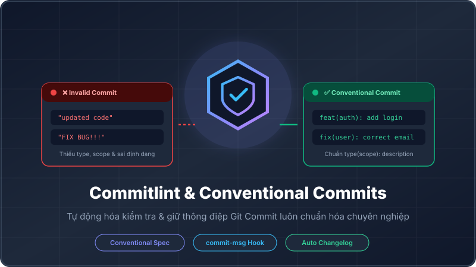
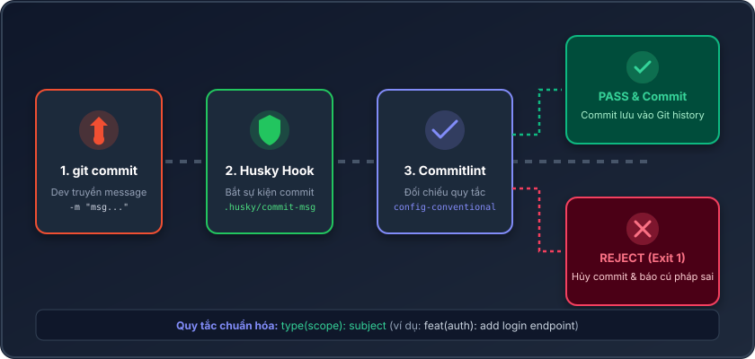

# Lesson 1.8: Commitlint & Conventional Commits: Giữ Commit Message Chuẩn Hóa

<p align="center">
  
  
  
  
  
</p>

<p align="center">
  
</p>

---

> [!NOTE]
> ⏱️ **Thời lượng dự kiến:** 10 – 12 phút  
> 🎯 **Mục tiêu bài học:** Nắm vững chuẩn **Conventional Commits**, hiểu vai trò của **Commitlint** trong quy trình phát triển chuyên nghiệp, và thực hành cài đặt `@commitlint/cli`, `@commitlint/config-conventional` kết hợp với Husky `commit-msg` hook để ép buộc toàn bộ thành viên ghi commit message đúng chuẩn.

---

## 1. Đặt Vấn Đề & Chuẩn Conventional Commits

Trong nhiều dự án thực tế, thành viên team thường đặt thông điệp commit tùy tiện như: `"update code"`, `"fix bug"`, `"done"`, hoặc `"asdfgh"`.

> [!WARNING]
> **Hậu quả của Commit Message tự do:**
>
> - 📜 **Khó tra cứu lịch sử:** Không thể biết commit nào thêm tính năng, commit nào sửa lỗi nếu không mở chi tiết diff code.
> - 🤖 **Không thể tự động hóa:** Không thể tự động tạo tệp `CHANGELOG.md` hay tự động tính toán phiên bản (Semantic Versioning `v1.0.0` $\rightarrow$ `v1.1.0`).

### 💡 Quy Tắc Chuẩn Conventional Commits

**Conventional Commits** là một quy chuẩn ghi lịch sử commit rõ ràng, dễ đọc cho cả con người và máy móc với cú pháp:

$$\text{\texttt{type(scope): subject}}$$

| Thành phần                 | Mô tả                               | Ví dụ                             |
| :------------------------- | :---------------------------------- | :-------------------------------- |
| **`type`** _(Bắt buộc)_    | Loại thay đổi của commit            | `feat`, `fix`, `docs`, `refactor` |
| **`scope`** _(Tùy chọn)_   | Phạm vi/Module bị tác động          | `(auth)`, `(users)`, `(database)` |
| **`subject`** _(Bắt buộc)_ | Mô tả ngắn gọn bằng chữ viết thường | `add JWT authentication endpoint` |

#### 📌 Các `type` Phổ Biến Theo Chuẩn:

- ✨ **`feat`**: Thêm một tính năng mới (Feature).
- 🐛 **`fix`**: Sửa một lỗi (Bug fix).
- 📝 **`docs`**: Thay đổi tài liệu (Documentation).
- 🎨 **`style`**: Sửa format, khoảng trắng, thiếu dấu chấm phẩy (không đổi logic).
- ♻️ **`refactor`**: Re-structure code (không sửa bug cũng không thêm feat).
- ⚡ **`perf`**: Cải thiện hiệu năng (Performance).
- 🧪 **`test`**: Thêm hoặc chỉnh sửa unit/e2e tests.
- 🔧 **`chore`**: Cập nhật build tool, dependencies, cấu hình phụ trợ.

---

## 2. Nguyên Lý Hoạt Động Của Commitlint & Husky `commit-msg`

Để ép buộc mọi người ghi đúng quy chuẩn, chúng ta tích hợp **Commitlint** thông qua kịch bản Git hook `.husky/commit-msg`:

<p align="center">
  
</p>

### 🛠️ Điểm Khác Biệt Giữa các Hooks:

- 🟢 **`pre-commit`** (Lesson 1.6 & 1.7): Kích hoạt **trước khi** tạo commit để chạy linter/formatter trên code.
- 🔵 **`commit-msg`** (Lesson 1.8): Kích hoạt **sau khi** người dùng gõ xong câu lệnh `git commit -m "..."` để kiểm tra văn bản của thông điệp commit.

---

## 3. Cài Đặt & Cấu Hình Step-by-Step

Theo [tài liệu chính thức của Commitlint](https://commitlint.js.org/guides/getting-started.html), chúng ta thực hiện 3 bước cài đặt sau:

### 📌 Bước 1: Cài Đặt Packages Commitlint

Cài đặt `@commitlint/cli` và bộ quy tắc chuẩn `@commitlint/config-conventional` vào `devDependencies`:

```bash
pnpm add --save-dev @commitlint/cli @commitlint/config-conventional
```

### 📌 Bước 2: Tạo Tệp Cấu Hình `commitlint.config.js`

Tạo tệp `commitlint.config.js` tại thư mục gốc dự án:

📄 **`commitlint.config.js`**

```javascript
module.exports = {
  extends: ['@commitlint/config-conventional'],
};
```

> [!TIP]
> Cấu hình `extends: ['@commitlint/config-conventional']` sẽ tự động nạp toàn bộ bộ luật chuẩn Conventional Commits (bắt buộc `type` hợp lệ, `subject` viết thường, không chứa dấu chấm cuối câu...).

> [!NOTE]
> **Xử lý lỗi ESLint Parsing Error (nếu có):**  
> Vì tệp `commitlint.config.js` nằm ngoài thư mục `src`, ESLint TypeScript Parser (`eslint.config.mjs`) có thể báo lỗi `Parsing error: ... was not found by the project service`. Hãy thêm `'commitlint.config.js'` vào mảng `ignores` trong `eslint.config.mjs`:
>
> 📄 **`eslint.config.mjs`**
>
> ```javascript
> export default tseslint.config(
>   {
>     ignores: ['eslint.config.mjs', 'commitlint.config.js'],
>   },
>   // ...
> );
> ```

### 📌 Bước 3: Tạo Husky Hook `.husky/commit-msg`

Tạo tệp kịch bản `.husky/commit-msg` để liên kết Husky với Commitlint:

📄 **`.husky/commit-msg`**

```bash
pnpm exec commitlint --edit $1
```

> [!IMPORTANT]
> Biến `$1` được Git tự động truyền vào, chứa đường dẫn đến tệp lưu tạm thời thông điệp commit (thường là `.git/COMMIT_EDITMSG`). Commitlint sẽ đọc tệp này để kiểm tra tính hợp lệ.

---

## 4. Kịch Bản Thử Nghiệm Thực Tế (Hands-on Lab)

### 🟢 Kịch Bản 1: Commit Đạt Chuẩn Conventional Commits (Success Flow)

1️⃣ **Thực hiện lệnh commit với đúng cú pháp `type(scope): subject`:**

```bash
git commit -m "feat(auth): add JWT login endpoint"
```

2️⃣ **Kết quả:** Commitlint kiểm tra thông điệp hợp lệ và Git ghi nhận commit thành công vào lịch sử.

---

### 🔴 Kịch Bản 2: Chặn Commit Khi Sai Quy Chuẩn (Blocked Flow)

1️⃣ **Thử commit với thông điệp tự do không đúng chuẩn:**

```bash
git commit -m "updated login feature"
```

2️⃣ **Kết quả hiển thị trên Terminal:**

```bash
⧗   input: updated login feature
✖   type must not be empty [type-empty]
✖   subject must not be empty [subject-empty]

✖   found 2 errors, 0 warnings
ⓘ   Get help: https://github.com/conventional-changelog/commitlint/#what-is-commitlint

husky - commit-msg script failed (exit code 1)
```

> [!CAUTION]
> **Kết quả:** Commitlint báo rõ lỗi `type-empty` (thiếu loại commit) và ngay lập tức trả về Exit Code `1` để chặn đứng lệnh commit sai chuẩn.

---

## 5. Tổng Kết Bài Học & Checklist Ghi Nhớ

```mermaid
mindmap
  root(("Commitlint Standardization"))
    "Mục Tiêu"
      "Chuẩn hóa commit message"
      "Hỗ trợ auto CHANGELOG"
      "Đồng bộ quy chuẩn team"
    "Cú Pháp Conventional"
      "type(scope): subject"
      "Ví dụ: feat(auth): add login"
    "Cấu Hình Tệp"
      "commitlint.config.js"
      "extends config-conventional"
    "Tích Hợp Husky"
      ".husky/commit-msg"
      "Lệnh commitlint --edit $1"
```

### ✅ Checklist Ghi Nhớ Bài Học:

- [x] Hiểu cấu trúc chuẩn của Conventional Commits: `type(scope): subject`.
- [x] Phân biệt được nhiệm vụ của `pre-commit` hook và `commit-msg` hook.
- [x] Đã cài đặt `@commitlint/cli` và `@commitlint/config-conventional` via `pnpm`.
- [x] Đã tạo file `commitlint.config.js` và bổ sung tệp vào mảng `ignores` của `eslint.config.mjs`.
- [x] Đã khởi tạo hook `.husky/commit-msg` với lệnh `pnpm exec commitlint --edit $1`.
- [x] Thử nghiệm thành công commit hợp lệ và kiểm chứng việc chặn commit sai cú pháp.

---

👉 **Bài tiếp theo:** [Lesson 1.9: Controller, Service, Module & Dependency Injection (DI) cơ bản](../lesson-1.9/lesson-1.9.md)
