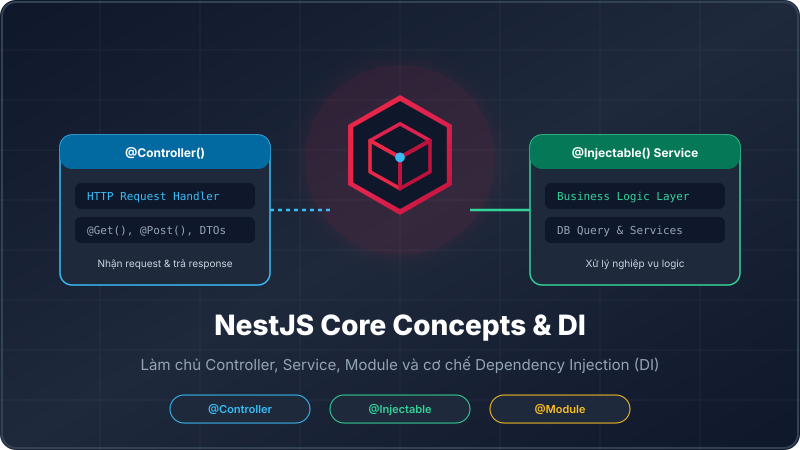
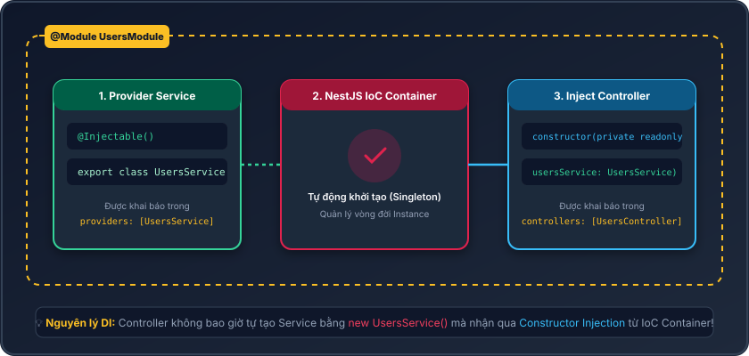
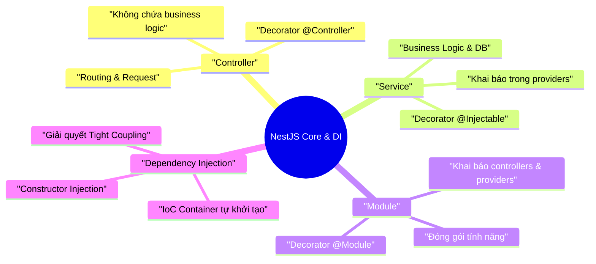

# Lesson 1.9: Controller, Service, Module & Dependency Injection (DI) cơ bản

<p align="center">
  
  
  
  
  
</p>

<p align="center">
  
</p>

---

> [!NOTE]
> ⏱️ **Thời lượng dự kiến:** 12 – 15 phút  
> 🎯 **Mục tiêu bài học:** Thấu hiểu bộ ba kiến trúc cốt lõi của NestJS (**Module - Controller - Service**), nắm vững nguyên lý **Dependency Injection (DI)** và **Inversion of Control (IoC)** Container, tự tay tạo một module `Users` hoàn chỉnh bằng Nest CLI và giải quyết các lỗi resolve dependency thường gặp.

---

## 1. Bộ Ba Kiến Trúc Cốt Lõi Trong NestJS

NestJS áp dụng chặt chẽ nguyên lý **Separation of Concerns** (Tách biệt trách nhiệm) giúp ứng dụng dễ dàng mở rộng, kiểm thử và bảo trì:

| Thành phần             | Decorator chính       | Trách nhiệm cốt lõi                                                                    |
| :--------------------- | :-------------------- | :------------------------------------------------------------------------------------- |
| **Controller**         | `@Controller('path')` | Đón nhận **HTTP Request**, điều hướng đường dẫn (Routing) và trả về **HTTP Response**. |
| **Service (Provider)** | `@Injectable()`       | Xử lý **Business Logic** (tính toán, truy vấn CSDL, gọi API bên thứ ba).               |
| **Module**             | `@Module({ ... })`    | Đóng gói và gom nhóm các Controller & Service thành một khối tính năng độc lập.        |

> [!WARNING]
> **Quy tắc vàng:** **Controller tuyệt đối không được xử lý logic nghiệp vụ nặng** (như tính toán CSDL, mã hóa...). Controller chỉ nên đóng vai trò "tiếp tân" điều hướng request tới Service tương ứng.

---

## 2. Dependency Injection (DI) & IoC Container Là Gì?

### ⚠️ Bài Toán Lập Trình Truyền Thống (Tight Coupling)

Trong hướng đối tượng thông thường, nếu `UsersController` cần dùng `UsersService`, lập trình viên thường tự khởi tạo:

```typescript
// ❌ Tight Coupling: Controller phụ thuộc trực tiếp vào Service
export class UsersController {
  private usersService = new UsersService();
}
```

Cách làm này khiến việc viết Unit Test vô cùng khó khăn (không thể Mock Service) và gây phụ thuộc chặt chẽ giữa các lớp.

---

### 💡 Giải Pháp Với Dependency Injection (DI) Trong NestJS

NestJS tích hợp sẵn một **IoC Container** (Inversion of Control). Lập trình viên không tự dùng từ khóa `new`, mà khai báo nhu cầu sử dụng thông qua **Constructor Injection**:

<p align="center">
  
</p>

### 🛠️ Nguyên Lý Xử Lý 3 Bước Của NestJS:

1. **Đăng ký Provider:** Khi đánh dấu `@Injectable()` trên `UsersService` và khai báo vào mảng `providers: [UsersService]` của `UsersModule`, NestJS IoC Container sẽ ghi nhận Service này.
2. **Khởi tạo Singleton:** NestJS tự động tạo duy nhất **01 instance** (Singleton) của `UsersService` trong bộ nhớ.
3. **Tiêm phụ thuộc (Inject):** Khi `UsersController` khai báo `constructor(private readonly usersService: UsersService)`, NestJS tự tìm instance `UsersService` đã tạo và "tiêm" vào Controller.

---

## 3. Thực Hành Tạo Users Module Step-by-Step

Bây giờ chúng ta sẽ dùng **Nest CLI** để sinh mã nguồn chuẩn cho module `Users`.

### 📌 Bước 1: Tạo Module, Service & Controller Bằng Nest CLI

Mở Terminal tại thư mục dự án và chạy 3 lệnh sau:

```bash
# 1. Tạo UsersModule
pnpm nest g module users

# 2. Tạo UsersService
pnpm nest g service users --no-spec

# 3. Tạo UsersController
pnpm nest g controller users --no-spec
```

> [!TIP]
> Cờ `--no-spec` giúp bỏ qua việc sinh file test `.spec.ts` để dự án gọn gàng hơn trong bước đầu học tập.

---

### 📌 Bước 2: Viết Logic Nghiệp Vụ Tại `UsersService`

Mở tệp `src/users/users.service.ts` và thêm phương thức lấy danh sách người dùng:

📄 **`src/users/users.service.ts`**

```typescript
import { Injectable } from '@nestjs/common';

export interface User {
  id: number;
  name: string;
  email: string;
}

@Injectable()
export class UsersService {
  private users: User[] = [
    { id: 1, name: 'Alice', email: 'alice@example.com' },
    { id: 2, name: 'Bob', email: 'bob@example.com' },
  ];

  findAll(): User[] {
    return this.users;
  }
}
```

---

### 📌 Bước 3: Tiếp Nhận HTTP Request Tại `UsersController`

Mở tệp `src/users/users.controller.ts` và tiêm `UsersService` vào constructor:

📄 **`src/users/users.controller.ts`**

```typescript
import { Controller, Get } from '@nestjs/common';
import { User, UsersService } from './users.service';

@Controller('users')
export class UsersController {
  constructor(private readonly usersService: UsersService) {}

  @Get()
  getAllUsers(): User[] {
    return this.usersService.findAll();
  }
}
```

---

### 📌 Bước 4: Kiểm Tra Khai Báo Tại `UsersModule` & `AppModule`

Nest CLI sẽ tự động liên kết các thành phần vào `src/users/users.module.ts`:

📄 **`src/users/users.module.ts`**

```typescript
import { Module } from '@nestjs/common';
import { UsersController } from './users.controller';
import { UsersService } from './users.service';

@Module({
  controllers: [UsersController],
  providers: [UsersService],
})
export class UsersModule {}
```

Đồng thời, `UsersModule` cũng được tự động import vào `AppModule` gốc:

📄 **`src/app.module.ts`**

```typescript
import { Module } from '@nestjs/common';
import { UsersModule } from './users/users.module';

@Module({
  imports: [UsersModule],
})
export class AppModule {}
```

---

## 4. Kịch Bản Thử Nghiệm Thực Tế (Hands-on Lab)

### 🟢 Kịch Bản 1: Khởi Chạy Server & Gọi API Thành Công (Success Flow)

1️⃣ **Khởi chạy ứng dụng NestJS ở chế độ Watch Mode:**

```bash
pnpm start:dev
```

2️⃣ **Mở Terminal mới hoặc Browser/Postman để gọi API GET `/users`:**

```bash
curl http://localhost:3000/users
```

3️⃣ **Kết quả trả về:**

```json
[
  { "id": 1, "name": "Alice", "email": "alice@example.com" },
  { "id": 2, "name": "Bob", "email": "bob@example.com" }
]
```

---

### 🔴 Kịch Bản 2: Lỗi Quên Đăng Ký Provider Trong Module (Blocked Flow)

Một trong những lỗi kinh điển nhất của người mới học NestJS là quên khai báo Service vào mảng `providers` của Module.

1️⃣ **Cố tình xóa `UsersService` khỏi mảng `providers` trong `src/users/users.module.ts`:**

📄 **`src/users/users.module.ts`**

```typescript
@Module({
  controllers: [UsersController],
  providers: [], // ❌ Cố tình bỏ trống
})
export class UsersModule {}
```

2️⃣ **Quan sát Terminal khi server khởi chạy:**

```bash
[Nest] 12345  - 08/10/2026, 3:30:00 PM   ERROR [ExceptionHandler] Nest can't resolve dependencies of the UsersController (?). Please make sure that the argument UsersService at index [0] is available in the UsersModule context.

Potential solutions:
- Is UsersService a provider? Did you add it to the providers array of the UsersModule?
- If UsersService is exported from another module, is that module imported within UsersModule?
```

> [!CAUTION]
> **Giải thích lỗi:** Lỗi `Nest can't resolve dependencies` xuất hiện vì IoC Container không tìm thấy instance của `UsersService` để tiêm vào `UsersController`. Bạn chỉ cần thêm `UsersService` lại vào mảng `providers: [UsersService]` là lỗi lập tức biến mất!

---

## 5. Tổng Kết Bài Học & Checklist Ghi Nhớ



### ✅ Checklist Ghi Nhớ Bài Học:

- [x] Hiểu rõ phân công nhiệm vụ của **Controller**, **Service** và **Module**.
- [x] Nắm vững cơ chế Constructor Injection và lợi ích của IoC Container.
- [x] Thành thạo sử dụng lệnh Nest CLI: `nest g module`, `nest g service`, `nest g controller`.
- [x] Biết cách đọc và sửa lỗi kinh điển `Nest can't resolve dependencies of...`.

---

👉 **Bài tiếp theo:** [Lesson 1.10: Configuration - Đọc .env An Toàn Với @nestjs/config & Joi Validation](../lesson-1.10/lesson-1.10.md)
