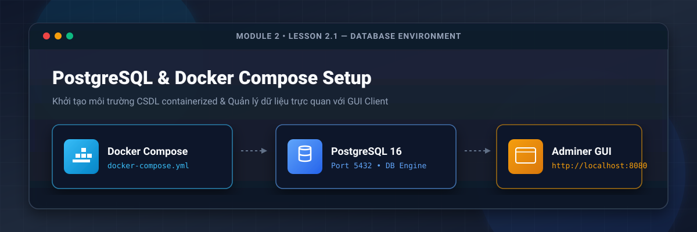
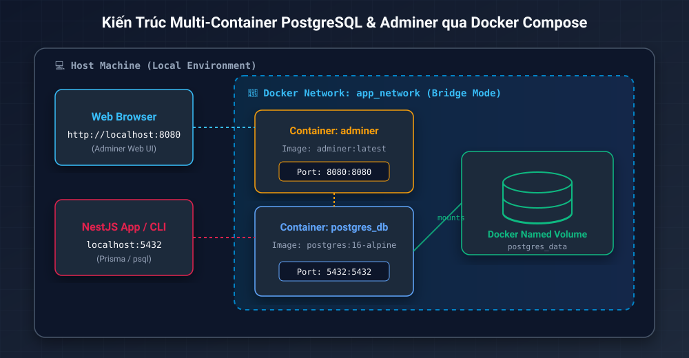
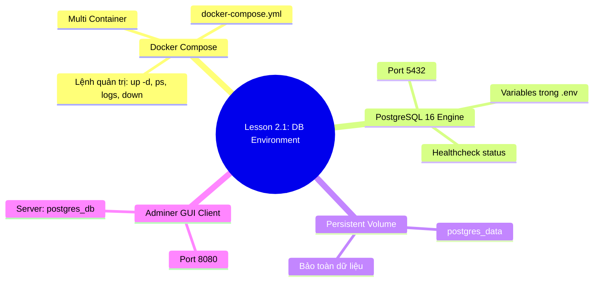

# Lesson 2.1: Database Environment — Khởi Chạy PostgreSQL & GUI Client Với Docker Compose

<p align="center">
  
  
  
  
  
</p>

<p align="center">
  
</p>

---

> [!NOTE]
> ⏱️ **Thời lượng dự kiến:** 12 – 15 phút  
> 🎯 **Mục tiêu bài học:** Hiểu rõ ưu điểm của việc sử dụng Docker Compose thay vì cài đặt CSDL trực tiếp trên máy local; tự tay xây dựng tệp cấu hình `docker-compose.yml` khởi chạy PostgreSQL 16 và Adminer GUI Client; thiết lập lưu trữ dữ liệu bền vững (Persistent Data Volume) và làm chủ các câu lệnh quản trị container bằng Docker CLI.

---

## 1. Tổng Quan & Tại Sao Nên Dùng Docker Compose Cho Database Local?

### 🔹 Cài Đặt Trực Tiếp (Native Install) vs Docker Container

Trong quá trình phát triển ứng dụng NestJS, CSDL là thành phần không thể thiếu. Trước đây, lập trình viên thường tải installer (.exe / .dmg) và cài trực tiếp PostgreSQL lên hệ điều hành. Tuy nhiên, cách làm này phát sinh nhiều vấn đề trong môi trường doanh nghiệp và làm việc nhóm:

| Tiêu chí               | Cài đặt trực tiếp (Native Host)                                  | Sử dụng Docker Compose Container                                                |
| :--------------------- | :--------------------------------------------------------------- | :------------------------------------------------------------------------------ |
| **Đồng bộ môi trường** | Khó đồng bộ phiên bản giữa các thành viên (Windows/macOS/Linux). | **100% nhất quán**: Cùng phiên bản PostgreSQL, cấu hình encoding và timezone.   |
| **Quản lý tài nguyên** | Chạy ẩn background ngay cả khi không code, tốn RAM/CPU hệ thống. | Khởi chạy/dừng tức thì chỉ với **1 câu lệnh**, giải phóng tài nguyên hoàn toàn. |
| **Xung đột phần mềm**  | Dễ bị xung đột Cổng `5432` nếu máy đã cài Postgres từ trước.     | Dễ dàng map lại cổng host (ví dụ `5433:5432`) mà không sửa cấu hình trong CSDL. |
| **Dọn dẹp & Reset**    | Phải gỡ cài đặt phức tạp, dễ sót lại tệp rác và cấu hình cũ.     | **Reset sạch 100%** trong 2 giây bằng lệnh `docker compose down -v`.            |

---

### 💡 Giải Pháp Với Docker Compose

**Docker Compose** là công cụ cho phép bạn định nghĩa và khởi chạy **nhiều Docker Containers đồng thời** chỉ thông qua một tệp khai báo duy nhất `docker-compose.yml`.

> [!TIP]
> Đối với ứng dụng **Social Chat App** trong khóa học này, chúng ta sẽ cần khởi chạy đồng thời **PostgreSQL 16 Engine** và công cụ quản trị giao diện **Adminer GUI Client** trên môi trường Local.

---

## 2. Kiến Trúc Multi-Container PostgreSQL & GUI Client

Sơ đồ dưới đây mô tả cách các thành viên trong hệ thống tương tác với hệ thống Containerized Database:

<p align="center">
  
</p>

- **Host Machine:** Máy tính lập trình của bạn (chạy macOS, Windows hoặc Linux).
- **NestJS Application / CLI:** Kết nối trực tiếp vào Postgres Engine qua cổng `localhost:5432`.
- **Adminer GUI Client:** Công cụ giao diện Web siêu nhẹ kết nối tới PostgreSQL trong cùng `app_network` và mở giao diện Web tại `http://localhost:8080`.
- **Named Volume (`postgres_data`):** Vùng lưu trữ dữ liệu persistent nằm trên đĩa Host Machine, đảm bảo dữ liệu **không bị mất** ngay cả khi container bị xóa hay khởi động lại.

---

## 3. Hướng Dẫn Thực Hành Cấu Hình Docker Compose Step-by-Step

### 📌 Bước 1: Khởi Tạo File Biến Môi Trường `.env`

Tạo tệp `.env` tại thư mục gốc của dự án NestJS để lưu trữ thông tin đăng nhập CSDL (tránh ghi cứng password vào file code):

📄 **`.env`**

```env
# Database Configuration
POSTGRES_USER=postgres
POSTGRES_PASSWORD=postgres_secret_password
POSTGRES_DB=social_chat_db
POSTGRES_PORT=5432

# Adminer GUI Client Configuration
ADMINER_PORT=8080
```

> [!IMPORTANT]
> Đảm bảo file `.env` đã được đưa vào `.gitignore` để tránh rò rỉ mật khẩu lên GitHub!

---

### 📌 Bước 2: Tạo Tệp `docker-compose.yml`

Tạo file `docker-compose.yml` ở thư mục gốc dự án NestJS với nội dung chuẩn hóa production-ready:

📄 **`docker-compose.yml`**

```yaml
version: '3.8'

services:
  # Service 1: PostgreSQL 16 Database Engine
  postgres_db:
    image: postgres:16-alpine
    container_name: nestjs_postgres_db
    restart: always
    environment:
      POSTGRES_USER: ${POSTGRES_USER}
      POSTGRES_PASSWORD: ${POSTGRES_PASSWORD}
      POSTGRES_DB: ${POSTGRES_DB}
    ports:
      - '${POSTGRES_PORT}:5432'
    volumes:
      - postgres_data:/var/lib/postgresql/data
    healthcheck:
      test: ['CMD-SHELL', 'pg_isready -U ${POSTGRES_USER} -d ${POSTGRES_DB}']
      interval: 5s
      timeout: 5s
      retries: 5
    networks:
      - app_network

  # Service 2: Adminer Lightweight Database Management Web GUI
  adminer:
    image: adminer:latest
    container_name: nestjs_adminer_gui
    restart: always
    ports:
      - '${ADMINER_PORT}:8080'
    depends_on:
      postgres_db:
        condition: service_healthy
    networks:
      - app_network

# Persistent Data Storage
volumes:
  postgres_data:
    driver: local

# Internal Isolated Network
networks:
  app_network:
    driver: bridge
```

---

### 📌 Bước 3: Các Lệnh Thao Tác Với Docker Compose

Mở Terminal tại thư mục gốc dự án và thực hiện các thao tác sau:

#### 🚀 1. Khởi chạy toàn bộ Container ở chế độ chạy ngầm (Background / Detached):

```bash
docker compose up -d
```

_(Nếu sử dụng phiên bản Docker CLI cũ, lệnh tương đương là `docker-compose up -d`)_

#### 📋 2. Kiểm tra trạng thái hoạt động của các Container:

```bash
docker compose ps
```

_Kết quả kỳ vọng:_ Cả 2 service `nestjs_postgres_db` và `nestjs_adminer_gui` đều ở trạng thái `running` (hoặc `healthy`).

#### 📜 3. Xem log thời gian thực của PostgreSQL:

```bash
docker compose logs -f postgres_db
```

#### 🛑 4. Dừng toàn bộ Containers (Giữ nguyên dữ liệu):

```bash
docker compose down
```

#### 🧹 5. Xóa sạch Containers kèm Toàn Bộ Dữ Liệu (Reset hoàn toàn):

```bash
docker compose down -v
```

---

## 4. Kịch Bản Thử Nghiệm & Thao Tác Kiểm Thử (Hands-on Lab)

### 🟢 Kịch Bản 1: Kiểm Thử Kết Nối Thành Công (Success Flow)

1. Khởi chạy hệ thống bằng lệnh `docker compose up -d`.
2. Mở trình duyệt Web bất kỳ và truy cập đường dẫn: `http://localhost:8080`
3. Màn hình đăng nhập **Adminer** hiện ra, điền chính xác thông tin đăng nhập từ `.env`:
   - **System:** `PostgreSQL`
   - **Server:** `postgres_db` _(Tên service định nghĩa trong docker-compose.yml)_
   - **Username:** `postgres`
   - **Password:** `postgres_secret_password`
   - **Database:** `social_chat_db`
4. Nhấn **Login**. Bạn sẽ tiến vào giao diện quản trị cơ sở dữ liệu thành công!

> [!TIP]
> Bạn có thể thử nghiệm tạo 1 Bảng `test_users` đơn giản trên giao diện Adminer, sau đó chạy `docker compose restart postgres_db` rồi kiểm tra lại — Bảng dữ liệu vẫn còn nguyên nhờ **Docker Named Volume (`postgres_data`)**.

---

### 🔴 Kịch Bản 2: Kiểm Thử Ngăn Chặn & Xử Lý Lỗi Phổ Biến (Error Flow)

#### Lỗi 1: Xung đột Cổng `Port 5432 is already allocated`

- **Hiện tượng:** Khi chạy `docker compose up -d`, Terminal báo lỗi `Error response from daemon: driver failed programming external connectivity on endpoint... port is already allocated`.
- **Nguyên nhân:** Máy cá nhân của bạn đã có một service PostgreSQL cài trực tiếp (Native) đang chiếm cổng `5432`.
- **Cách khắc phục:**
  Đổi cổng Host trong file 📄 **`.env`** sang `5433`:
  ```env
  POSTGRES_PORT=5433
  ```
  Sau đó khởi chạy lại: `docker compose up -d`. Trong NestJS hoặc GUI Client bên ngoài (DBeaver, TablePlus), bạn kết nối tới cổng `5433`.

#### Lỗi 2: Adminer báo lỗi `Connection refused` hoặc `SQLSTATE[08006]`

- **Nguyên nhân:** Điền sai ô **Server** thành `localhost` thay vì `postgres_db`.
- **Giải thích:** Khi Adminer chạy bên trong Docker container, `localhost` trỏ vào chính container Adminer chứ không phải container PostgreSQL. Hai container này nói chuyện với nhau thông qua tên service `postgres_db` trong cùng `app_network`.

---

## 5. Tổng Kết Bài Học & Checklist Ghi Nhớ



### ✅ Checklist Ghi Nhớ Bài Học:

- [x] Hiểu lý do nên dùng Docker Compose cho môi trường phát triển Database local.
- [x] Tạo file `.env` lưu thông tin đăng nhập CSDL an toàn.
- [x] Viết tệp `docker-compose.yml` gồm PostgreSQL 16, Adminer, Named Volume và Healthcheck.
- [x] Thành thạo các câu lệnh `docker compose up -d`, `ps`, `logs`, `down -v`.
- [x] Đăng nhập thành công vào Adminer tại `http://localhost:8080` qua tên server `postgres_db`.
- [x] Biết cách đổi port map trong `.env` khi gặp xung đột cổng `5432`.

---

👉 **Bài tiếp theo:** [Lesson 2.2: Prisma Overview & Setup — Giới Thiệu Prisma ORM & Khởi Tạo Prisma CLI](../lesson-2.2/lesson-2.2.md)
