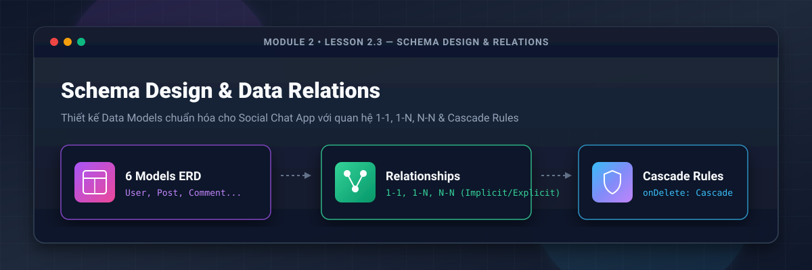
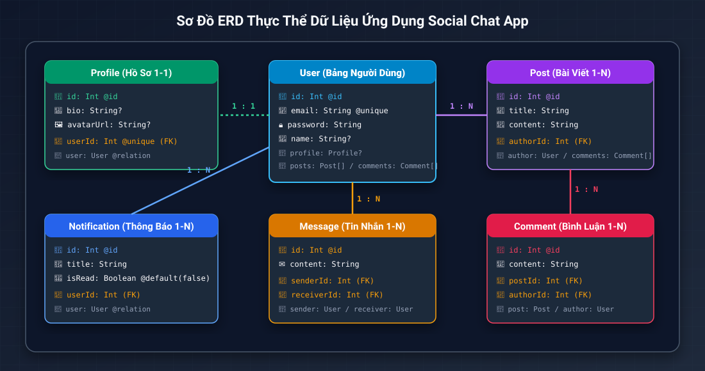
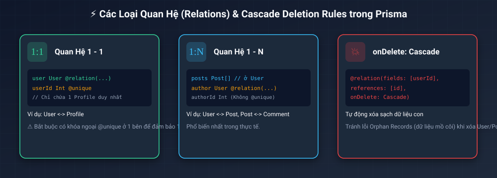
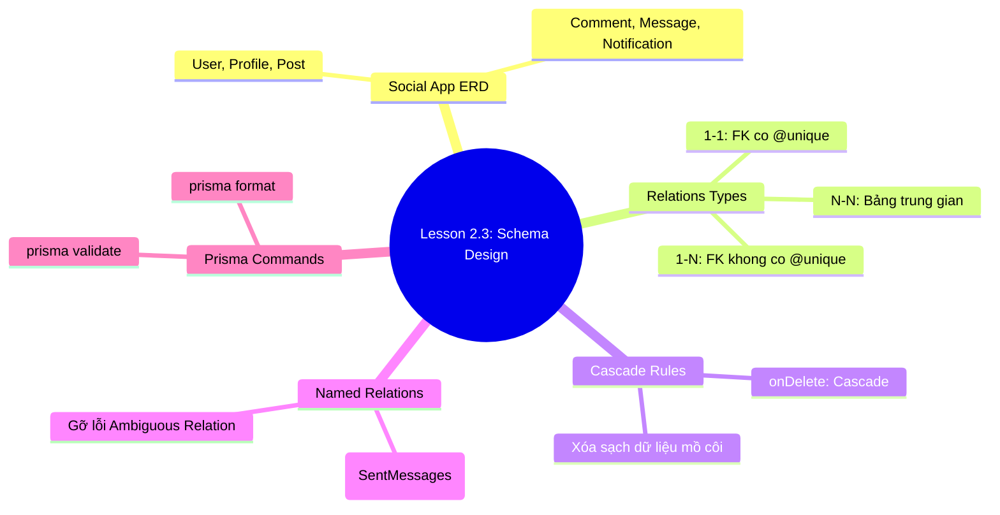

# Lesson 2.3: Schema Design & Relations — Thiết Kế Data Models Cho Social Chat App

<p align="center">
  
  
  
  
  
</p>

<p align="center">
  
</p>

---

> [!NOTE]
> ⏱️ **Thời lượng dự kiến:** 15 – 18 phút  
> 🎯 **Mục tiêu bài học:** Nắm vững tư duy thiết kế CSDL quan hệ thực chiến cho ứng dụng **Social Chat App**; làm chủ cú pháp định nghĩa Data Models trong Prisma Schema; hiểu sâu các loại quan hệ (1-1, 1-N, N-N) và thiết lập quy tắc toàn vẹn dữ liệu xóa liên tầng (`onDelete: Cascade`).

---

## 1. Tư Duy Thiết Kế CSDL Cho Ứng Dụng Social Chat App

Trong các dự án thực tế, CSDL không đơn thuần là tập hợp các bảng riêng lẻ mà là một hệ thống dữ liệu có mối quan hệ chặt chẽ. Dự án **Social Chat App** trong khóa học này yêu cầu 6 mô hình dữ liệu chính:

<p align="center">
  
</p>

### 📋 6 Thực Thể Cốt Lõi Trong Hệ Thống:

1. **`User` (Người dùng):** Trung tâm hệ thống, quản lý tài khoản, mật khẩu mã hóa, vai trò (Role: `USER` / `ADMIN`).
2. **`Profile` (Hồ sơ):** Thông tin mở rộng (bio, avatarUrl, location), liên kết 1-1 với `User`.
3. **`Post` (Bài viết):** Nội dung bài đăng social do `User` tạo ra (quan hệ 1-N).
4. **`Comment` (Bình luận):** Ý kiến thảo luận trên bài viết, liên kết đồng thời với `User` (tác giả) và `Post` (bài viết).
5. **`Message` (Tin nhắn Direct Chat):** Tin nhắn trò chuyện giữa 2 người dùng (sender & receiver).
6. **`Notification` (Thông báo):** Thông báo hệ thống gửi tới `User`.

---

## 2. Giải Mã Các Loại Quan Hệ (Relations) & Cascade Rules Trong Prisma

<p align="center">
  
</p>

### 🔹 1. Quan Hệ 1 - 1 (One-to-One Relation)

Mỗi bản ghi ở bảng A liên kết với duy nhất 1 bản ghi ở bảng B (Ví dụ: 1 `User` có đúng 1 `Profile`).

- **Quy tắc Prisma:** Bên giữ Khóa Ngoại (Foreign Key) phải gắn thêm attribute **`@unique`** để đảm bảo tính duy nhất.

```prisma
model User {
  id      Int      @id @default(autoincrement())
  profile Profile? // Chiều tham chiếu không chứa FK
}

model Profile {
  id     Int  @id @default(autoincrement())
  userId Int  @unique // FK phải có @unique cho quan hệ 1-1
  user   User @relation(fields: [userId], references: [id], onDelete: Cascade)
}
```

---

### 🔹 2. Quan Hệ 1 - N (One-to-Many Relation)

Một bản ghi ở bảng A có thể sở hữu nhiều bản ghi ở bảng B (Ví dụ: 1 `User` viết nhiều `Post`).

- **Quy tắc Prisma:** Bên bảng N (`Post`) sẽ giữ Khóa Ngoại `authorId` và **không có** `@unique`.

```prisma
model User {
  id    Int    @id @default(autoincrement())
  posts Post[] // Mảng danh sách các bài viết
}

model Post {
  id       Int  @id @default(autoincrement())
  authorId Int  // FK của User (không có @unique)
  author   User @relation(fields: [authorId], references: [id], onDelete: Cascade)
}
```

---

### 🔹 3. Quy Tắc Xóa Liên Tầng (Cascade Deletion Rules)

> [!WARNING]
> **Vấn đề Dữ liệu Mồ côi (Orphan Records):** Nếu bạn xóa một `User` khỏi hệ thống mà không cấu hình Cascade Rules, các bài viết `Post` hoặc `Profile` của user đó vẫn nằm lại trong database với `userId` không tồn tại, gây rác CSDL và lỗi runtime API.

Trong Prisma, ta chỉ định **`onDelete: Cascade`** ngay tại directive `@relation(...)`:

- **`onDelete: Cascade`:** Khi `User` bị xóa, PostgreSQL tự động xóa toàn bộ `Profile`, `Post`, `Comment` liên quan của user đó.
- **`onDelete: SetNull`:** Khi parent bị xóa, giá trị Foreign Key ở child tự động chuyển thành `null`.

---

## 3. Hướng Dẫn Thực Hành Viết Complete Schema Step-by-Step

Bây giờ, chúng ta sẽ tiến hành xây dựng tệp `prisma/schema.prisma` hoàn chỉnh cho ứng dụng Social Chat App.

Mở tệp 📄 **`prisma/schema.prisma`** và cập nhật toàn bộ nội dung sau:

📄 **`prisma/schema.prisma`**

```prisma
// Prisma Schema File — Social Chat App Data Models

generator client {
  provider = "prisma-client"
}

datasource db {
  provider = "postgresql"
}

enum Role {
  USER
  ADMIN
}

// 1. User Model (Trung tâm hệ thống)
model User {
  id        Int      @id @default(autoincrement())
  email     String   @unique
  password  String
  name      String?
  role      Role     @default(USER)
  createdAt DateTime @default(now())
  updatedAt DateTime @updatedAt

  // Relationships
  profile          Profile?
  posts            Post[]
  comments         Comment[]
  sentMessages     Message[]      @relation("SentMessages")
  receivedMessages Message[]      @relation("ReceivedMessages")
  notifications    Notification[]

  @@map("users")
}

// 2. Profile Model (Quan hệ 1-1 với User)
model Profile {
  id        Int      @id @default(autoincrement())
  bio       String?
  avatarUrl String?
  location  String?
  createdAt DateTime @default(now())
  updatedAt DateTime @updatedAt

  // Foreign Key (1-1 requires @unique)
  userId Int  @unique
  user   User @relation(fields: [userId], references: [id], onDelete: Cascade)

  @@map("profiles")
}

// 3. Post Model (Quan hệ 1-N với User)
model Post {
  id        Int      @id @default(autoincrement())
  title     String
  content   String
  published Boolean  @default(false)
  createdAt DateTime @default(now())
  updatedAt DateTime @updatedAt

  // Relationships
  authorId Int
  author   User      @relation(fields: [authorId], references: [id], onDelete: Cascade)
  comments Comment[]

  @@map("posts")
}

// 4. Comment Model (Quan hệ 1-N với Post và User)
model Comment {
  id        Int      @id @default(autoincrement())
  content   String
  createdAt DateTime @default(now())
  updatedAt DateTime @updatedAt

  // Relationships
  postId   Int
  post     Post @relation(fields: [postId], references: [id], onDelete: Cascade)
  authorId Int
  author   User @relation(fields: [authorId], references: [id], onDelete: Cascade)

  @@map("comments")
}

// 5. Message Model (Direct Chat 1-N với Sender & Receiver)
model Message {
  id        Int      @id @default(autoincrement())
  content   String
  isRead    Boolean  @default(false)
  createdAt DateTime @default(now())

  // Named Relationships (Phân biệt Sender & Receiver)
  senderId   Int
  sender     User @relation("SentMessages", fields: [senderId], references: [id], onDelete: Cascade)
  receiverId Int
  receiver   User @relation("ReceivedMessages", fields: [receiverId], references: [id], onDelete: Cascade)

  @@map("messages")
}

// 6. Notification Model (Quan hệ 1-N với User)
model Notification {
  id        Int      @id @default(autoincrement())
  title     String
  content   String
  isRead    Boolean  @default(false)
  createdAt DateTime @default(now())

  // Foreign Key
  userId Int
  user   User @relation(fields: [userId], references: [id], onDelete: Cascade)

  @@map("notifications")
}
```

> [!IMPORTANT]
> **Giải thích kỹ thuật nâng cao:**
>
> - Directive **`@@map("users")`**: Đổi tên bảng trong PostgreSQL thành chữ thường dạng số nhiều (`users`, `posts`, `profiles`), tuân thủ chuẩn đặt tên Database Conventions.
> - **Named Relations `@relation("SentMessages")`**: Khi 1 model (`User`) có 2 mối quan hệ song song tới cùng 1 model khác (`Message` là sender và receiver), ta **bắt buộc phải đặt tên quan hệ** để Prisma phân biệt chính xác.

---

## 4. Kịch Bản Thử Nghiệm & Kiểm Thử Cấu Hình (Hands-on Lab)

### 🟢 Kịch Bản 1: Kiểm Thử Validate & Căn Chỉnh Schema Thành Công (Success Flow)

Sau khi lưu tệp `schema.prisma`, mở Terminal và thực hiện 2 lệnh sau:

#### 1. Kiểm tra tính toàn vẹn và cú pháp Schema:

```bash
pnpm exec prisma validate
```

_Kết quả kỳ vọng:_ `The schema at prisma/schema.prisma is valid 🎉`

#### 2. Tự động căn chỉnh và sắp xếp đẹp mắt:

```bash
pnpm exec prisma format
```

_Kết quả kỳ vọng:_ Prisma CLI tự động căn lề các thuộc tính thẳng hàng và ghi lại tệp `schema.prisma`.

---

### 🔴 Kịch Bản 2: Kiểm Thử Ngăn Chặn & Xử Lý Lỗi Phổ Biến (Error Flow)

#### ❌ Lỗi 1: `Ambiguous relation detected` (Lỗi mập mờ quan hệ lặp)

- **Hiện tượng:** Màn hình Terminal báo lỗi `Error: Ambiguous relation detected between User and Message`.
- **Nguyên nhân:** Mô hình `Message` có 2 trường `sender` và `receiver` cùng trỏ về `User`, nhưng ở model `User` bạn lại không khai báo tên relation để phân biệt.
- **Cách khắc phục:** Đặt tên cho relation bằng chuỗi ký tự ở cả 2 đầu:
  ```prisma
  // Ở Model User:
  sentMessages Message[] @relation("SentMessages")

  // Ở Model Message:
  sender User @relation("SentMessages", fields: [senderId], references: [id])
  ```

#### ❌ Lỗi 2: Quên thêm `@unique` cho Foreign Key trong Quan hệ 1-1

- **Hiện tượng:** Prisma tự động coi quan hệ `User` - `Profile` là quan hệ 1-N thay vì 1-1.
- **Cách khắc phục:** Bổ sung directive **`@unique`** vào trường `userId Int @unique` trong model `Profile`.

---

## 5. Tổng Kết Bài Học & Checklist Ghi Nhớ



### ✅ Checklist Ghi Nhớ Bài Học:

- [x] Hiểu tư duy thiết kế CSDL chuẩn hóa cho Social Chat App với 6 thực thể.
- [x] Phân biệt rõ cách khai báo Quan hệ 1-1 (có `@unique`) và Quan hệ 1-N trong Prisma.
- [x] Thiết lập quy tắc xóa liên tầng `onDelete: Cascade` bảo vệ toàn vẹn dữ liệu.
- [x] Làm chủ Named Relations `@relation("Name")` khi xử lý quan hệ kép giữa 2 bảng.
- [x] Đặt tên bảng Postgres số nhiều chuẩn hóa với `@@map("table_name")`.
- [x] Thực thi thành công `pnpm exec prisma validate` và `pnpm exec prisma format`.

---

👉 **Bài tiếp theo:** [Lesson 2.4: Migrations & Prisma Studio — Quản Lý Phiên Bản CSDL & Trực Quan Hóa Dữ Liệu](../lesson-2.4/lesson-2.4.md)
