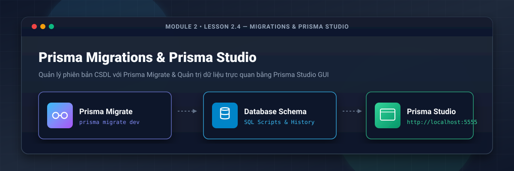
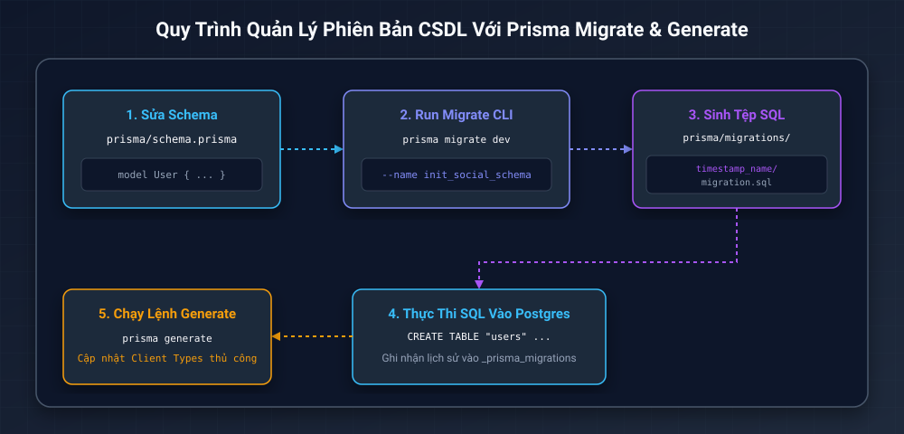
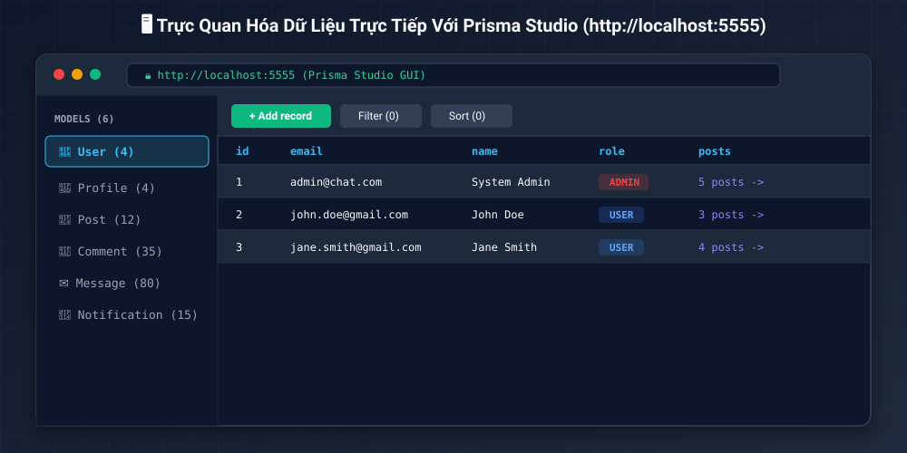
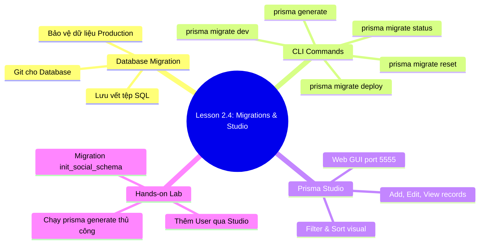

# Lesson 2.4: Migrations & Prisma Studio — Quản Lý Phiên Bản CSDL & Trực Quan Hóa Dữ Liệu

<p align="center">
  
  
  
  
  
</p>

<p align="center">
  
</p>

---

> [!NOTE]
> ⏱️ **Thời lượng dự kiến:** 12 – 15 phút  
> 🎯 **Mục tiêu bài học:** Nắm vững bản chất của Database Migration (Quản lý phiên bản CSDL); làm chủ các câu lệnh `prisma migrate dev`, `deploy`, `reset`; tạo thành công migration đầu tiên cho ứng dụng Social Chat App và quản trị dữ liệu trực quan bằng **Prisma Studio GUI** trên cổng `5555`.

---

## 1. Database Migration Là Gì & Tại Sao Cần Thiết?

### 💡 Ẩn Dụ Thực Tế: Migration Như Hệ Thống Git Version Control Cho CSDL

Trong quá trình phát triển mã nguồn, ta dùng **Git** để lưu vết từng commit (`git commit`), giúp xem lại lịch sử code và đồng bộ giữa các thành viên.

**Database Migration** chính là "Git dành cho CSDL". Mỗi khi bạn thêm, sửa hay xóa một thuộc tính trong `schema.prisma`, Migration sẽ ghi lại thay đổi đó dưới dạng một tệp **SQL Commit Script** có dấu mốc thời gian (Timestamp).

---

### ⚠️ Rủi Ro Của Việc "Auto Synchronize" Trong Dự Án Teamwork

Nhiều ORM cũ cung cấp tính năng tự động đồng bộ CSDL (`synchronize: true`). Tuy nhiên, cách làm này chứa đựng nguy cơ rất lớn:

- ❌ **Mất dữ liệu sản xuất (Data Loss):** Nếu bạn đổi tên 1 trường (`name` -> `fullName`), tính năng auto sync sẽ thực hiện lệnh `DROP COLUMN name` và `ADD COLUMN fullName` — xóa sạch dữ liệu người dùng cũ!
- ❌ **Xung đột giữa các thành viên:** Đồng đội khi pull code về không biết bạn đã sửa những gì trong CSDL để cập nhật theo.

> [!IMPORTANT]
> **Giải pháp với Prisma Migrate:** Mọi thay đổi cấu trúc CSDL đều phải thông qua các file SQL migration minh bạch, lưu trong thư mục `prisma/migrations/`, được commit và đẩy lên Git như mã nguồn bình thường.

---

## 2. Quy Trình Hoạt Động Của Prisma Migrate (Migration Flow)

Sơ đồ dưới đây mô tả chính xác quy trình 5 bước khi làm việc với Prisma Migrate:

<p align="center">
  
</p>

### 🔄 5 Bước Trong Quy Trình Migration:

1. **Developer sửa Schema:** Thêm/sửa các Model trong `prisma/schema.prisma`.
2. **Chạy Lệnh Migrate CLI:** Chạy `pnpm exec prisma migrate dev --name <ten_migration>`.
3. **Sinh Tệp SQL Migration:** Prisma tự động so sánh diff và sinh ra tệp `prisma/migrations/<timestamp>_<name>/migration.sql`.
4. **Thực Thi Vào PostgreSQL:** Áp dụng câu lệnh SQL vào CSDL container và ghi mốc lịch sử vào bảng hệ thống `_prisma_migrations`.
5. **Chạy Lệnh Generate Thủ Công:** Thực thi `pnpm exec prisma generate` để cập nhật TypeScript Client Types theo schema mới nhất tại vị trí `output` đã định nghĩa.

> [!NOTE]
> **Lưu ý kiến trúc Prisma hiện đại:** Trong phiên bản Prisma mới, lệnh `prisma migrate dev` tập trung chuyên biệt vào việc quản lý và thực thi tệp SQL Migration. Sau khi migration hoàn tất, chúng ta cần chủ động chạy `pnpm exec prisma generate` để cập nhật mã nguồn Prisma Client.

---

## 3. Bộ Câu Lệnh Quản Trị Migrations Chuẩn Production

| Câu lệnh CLI                      | Môi trường áp dụng          | Mục đích sử dụng                                                                 |
| :-------------------------------- | :-------------------------- | :------------------------------------------------------------------------------- |
| `pnpm exec prisma migrate dev`    | 💻 **Local Development**    | So sánh diff, sinh file SQL migration mới và áp dụng ngay vào Dev DB.            |
| `pnpm exec prisma generate`       | 💻 **Local / Build**        | Cập nhật TypeScript types cho Prisma Client theo schema mới.                     |
| `pnpm exec prisma migrate deploy` | 🚀 **Staging / Production** | Chỉ thực thi các file SQL migrations chưa chạy lên Prod DB (Không tạo file mới). |
| `pnpm exec prisma migrate status` | 🔍 **Dev / CI-CD**          | Kiểm tra xem DB hiện tại có bị lệch (drift) so với các file migration hay không. |
| `pnpm exec prisma migrate reset`  | 🧹 **Local Development**    | Xóa sạch DB (Drop DB), tạo lại từ đầu và chạy lại toàn bộ migrations + seeds.    |

---

## 4. Hướng Dẫn Thực Hành Step-by-Step Chạy Migration Đầu Tiên

Bây giờ chúng ta sẽ áp dụng tệp `prisma/schema.prisma` của dự án Social Chat App (đã xây dựng ở Lesson 2.3) vào PostgreSQL container.

### 📌 Bước 1: Khởi Chạy PostgreSQL Container

Đảm bảo container PostgreSQL của bạn đang hoạt động (từ **Lesson 2.1**):

```bash
docker compose up -d
```

---

### 📌 Bước 2: Chạy Lệnh Migration Khởi Tạo (`init_social_schema`)

Mở Terminal tại thư mục gốc dự án NestJS và thực thi câu lệnh tạo migration:

```bash
pnpm exec prisma migrate dev --name init_social_schema
```

_Kết quả kỳ vọng trên Terminal:_

```text
Loaded Prisma config from prisma.config.ts.
Prisma schema loaded from prisma/schema.prisma.
Datasource "db": PostgreSQL database

Applying migration `20260810235000_init_social_schema`

The following migration(s) have been applied:

migrations/
  └─ 20260810235000_init_social_schema/
      └─ migration.sql
```

> [!TIP]
> Bạn hãy mở cây thư mục dự án và kiểm tra: Một thư mục mới `prisma/migrations/2026xxxxxx_init_social_schema/migration.sql` đã được tạo ra chứa toàn bộ các câu lệnh `CREATE TABLE "users" ...`, `CREATE TABLE "posts" ...` bằng ngôn ngữ SQL thuần.

---

### 📌 Bước 3: Cập Nhật Prisma Client Types (`prisma generate`)

Sau khi migration hoàn tất, chạy câu lệnh sinh client types:

```bash
pnpm exec prisma generate
```

_Kết quả kỳ vọng:_

```text
✔ Generated Prisma Client to ./src/generated/prisma
```

---

## 5. Trực Quan Hóa & Quản Trị Dữ Liệu Với Prisma Studio GUI

**Prisma Studio** là công cụ quản trị CSDL trực quan trên giao diện Web được tích hợp sẵn trong Prisma, giúp bạn xem, thêm, sửa, xóa dữ liệu cực kỳ thuận tiện mà không cần cài thêm phần mềm bên ngoài.

<p align="center">
  
</p>

### 📌 Khởi Chạy Prisma Studio

Mở một cửa sổ Terminal mới và gõ câu lệnh:

```bash
pnpm exec prisma studio
```

- Trình duyệt sẽ tự động mở giao diện tại địa chỉ: **`http://localhost:5555`**
- Tại đây, bạn có thể nhấp vào danh sách các Models (`users`, `posts`, `profiles`...), nhấn **+ Add record** để tạo thử dữ liệu người dùng hoặc chỉnh sửa quan hệ 1-1, 1-N trực quan bằng chuột!

---

## 6. Kịch Bản Thử Nghiệm & Kiểm Thử (Hands-on Lab)

### 🟢 Kịch Bản 1: Kiểm Thử Tạo Dữ Liệu Mẫu Qua Prisma Studio (Success Flow)

1. Mở trình duyệt tại `http://localhost:5555`.
2. Chọn bảng **`users`** -> Nhấn **+ Add record**.
3. Điền thông tin thử nghiệm:
   - `email`: `admin@socialchat.com`
   - `password`: `$2b$10$hashedpassword`
   - `name`: `System Admin`
   - `role`: `ADMIN`
4. Nhấn **Save 1 change**.
5. Mở ứng dụng **Adminer** (`http://localhost:8080`) hoặc kết nối DB — Bạn sẽ thấy bản ghi người dùng mới vừa thêm từ Prisma Studio đã xuất hiện trong PostgreSQL!

---

### 🔴 Kịch Bản 2: Kiểm Thử Ngăn Chặn & Xử Lý Drift Migration (Error Flow)

#### ❌ Lỗi 1: `Drift detected: Your database schema is not in sync with migration history`

- **Hiện tượng:** Khi chạy `prisma migrate dev`, Prisma cảnh báo DB bị lệch cấu trúc so với thư mục `migrations/` và yêu cầu reset DB.
- **Nguyên nhân:** Ai đó (hoặc chính bạn) đã dùng GUI tool (Adminer / DBeaver) sửa trực tiếp tên cột trong CSDL PostgreSQL mà không thông qua `schema.prisma`.
- **Cách khắc phục:**
  1. Trong môi trường Dev local: Đồng ý gõ `y` để `prisma migrate reset` làm sạch DB.
  2. Nguyên tắc vàng: **Không bao giờ sửa trực tiếp DDL trong CSDL**, mọi thay đổi phải bắt đầu từ `schema.prisma`.

---

## 7. Tổng Kết Bài Học & Checklist Ghi Nhớ



### ✅ Checklist Ghi Nhớ Bài Học:

- [x] Hiểu tầm quan trọng của Database Migration trong teamwork và sản phẩm thực tế.
- [x] Nắm vững quy trình các bước làm việc với Prisma Migrate & Generate.
- [x] Phân biệt sự khác nhau giữa `migrate dev` (Local) và `migrate deploy` (Production).
- [x] Biết cách chạy `pnpm exec prisma generate` để cập nhật TypeScript types sau mỗi lần migrate.
- [x] Khởi tạo thành công tệp migration `init_social_schema` cho Social Chat App.
- [x] Mở thành công Prisma Studio GUI tại `http://localhost:5555`.
- [x] Biết cách xử lý lỗi Schema Drift và nguyên tắc không sửa DB trực tiếp.

---

👉 **Bài tiếp theo:** [Lesson 2.5: Database Seeding — Xây Dựng Script Tạo Dữ Liệu Mẫu Với FakerJS](../lesson-2.5/lesson-2.5.md)
