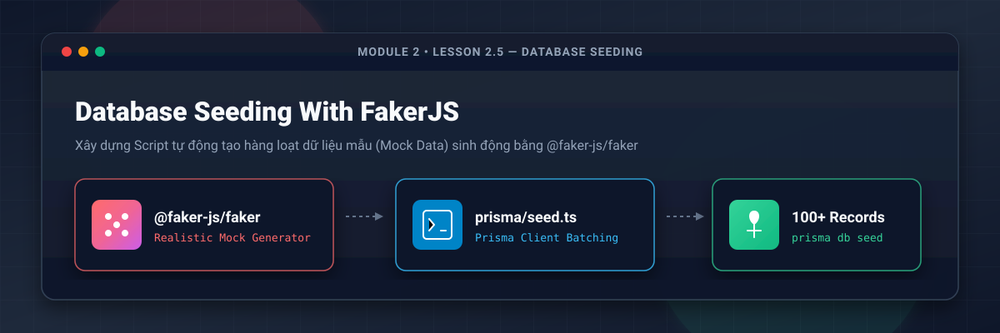
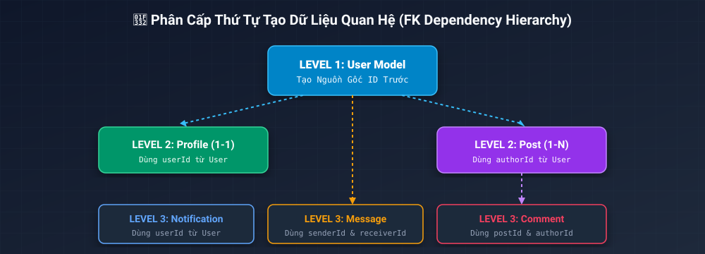
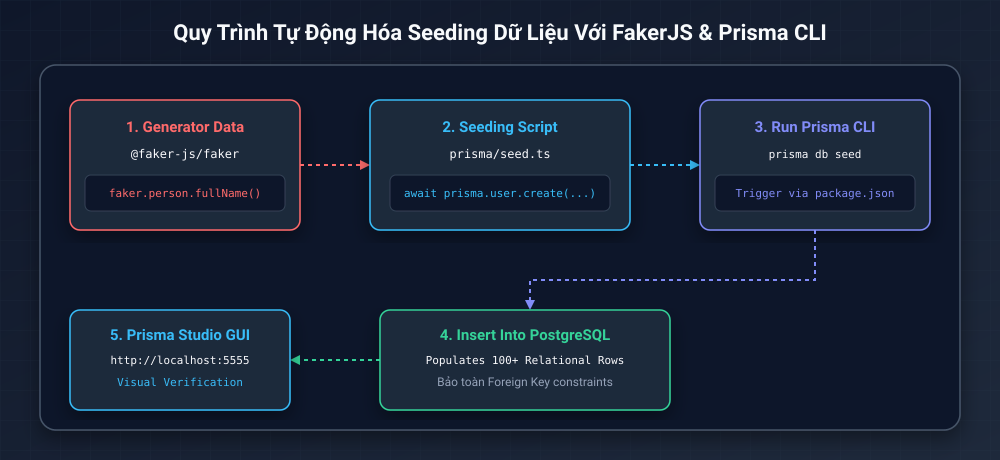
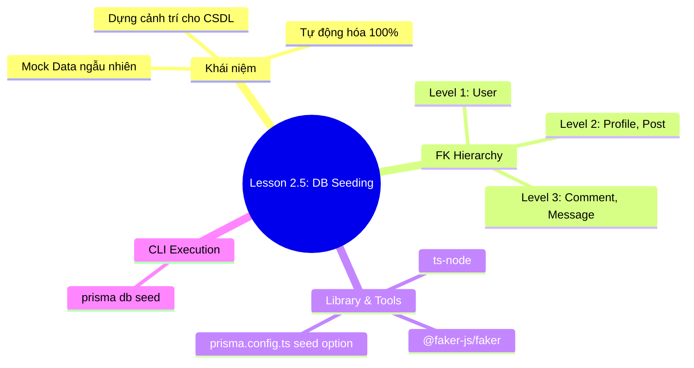

# Lesson 2.5: Database Seeding — Xây Dựng Script Tạo Dữ Liệu Mẫu Với FakerJS

<p align="center">
  
  
  
  
  
</p>

<p align="center">
  
</p>

---

> [!NOTE]
> ⏱️ **Thời lượng dự kiến:** 12 – 15 phút  
> 🎯 **Mục tiêu bài học:** Hiểu bản chất của Database Seeding trong quy trình phát triển sản phẩm; làm chủ thư viện `@faker-js/faker` để sinh dữ liệu ngẫu nhiên sinh động; nắm vững thứ tự khởi tạo dữ liệu quan hệ (FK Dependency Hierarchy); tự tay xây dựng kịch bản 📄 `prisma/seed.ts`, cấu hình thuộc tính `seed` trong 📄 `prisma.config.ts` và thực thi bằng lệnh `prisma db seed`.

---

## 1. Database Seeding Là Gì & Tại Sao Nhập Liệu Thủ Công Là Hạ Sách?

### 💡 Ẩn Dụ Thực Tế: Seeding Như Việc Dựng Cảnh Trí Cho Sân Khấu Trước Khi Diễn

Trước một buổi biểu diễn, đạo diễn cần sắp xếp bàn ghế, đạo cụ và diễn viên vào đúng vị trí. Nếu không có cảnh trí, sân khấu sẽ trống rỗng và buổi diễn không thể bắt đầu.

**Database Seeding** chính là hành động "dựng cảnh trí" cho CSDL. Đó là quá trình chạy một kịch bản code tự động để đổ sẵn một lượng **Dữ liệu mẫu (Mock Data)** sinh động vào database ngay khi hệ thống vừa khởi tạo.

---

### ⚖️ So Sánh Nhập Dữ Liệu Thủ Công vs Tự Động Hóa Seeding

| Tiêu chí             | ❌ Nhập dữ liệu thủ công (Adminer / GUI)             | ⚡ Tự động hóa với Database Seeding                       |
| :------------------- | :--------------------------------------------------- | :-------------------------------------------------------- |
| **Tốc độ**           | Rất chậm, tốn nhiều giờ đồng hồ gõ từng ô.           | **Siêu tốc**: Sinh 100+ bản ghi chỉ trong **1 - 2 giây**. |
| **Độ chân thực**     | Dữ liệu ngẫu nhiên sơ sài (`test1`, `test2`, `abc`). | **Sinh động 100%**: Tên thật, Email thật, Avatar thật.    |
| **Khả năng tái lập** | Bị xóa mất là phải nhập lại từ đầu bằng tay.         | **Tái tạo 100%**: Chỉ cần gõ lệnh `prisma db seed`.       |
| **Hỗ trợ Teamwork**  | Mỗi dev trong team có dữ liệu test khác nhau.        | Mọi thành viên trong team **đồng bộ 100% data test**.     |

---

## 2. Phân Cấp Thứ Tự Khởi Tạo Dữ Liệu Quan Hệ (FK Dependency)

> [!CAUTION]
> **Cảnh báo lỗi Vi phạm Khóa Ngoại (Foreign Key Constraint Violation):** Bạn không thể tạo một `Comment` trỏ tới `postId = 5` nếu bài viết `Post` số 5 chưa được tạo! Tương tự, bạn không thể tạo `Post` nếu tác giả `authorId = 1` chưa tồn tại trong bảng `User`.

Để script seeding không bị dừng đột ngột do lỗi khóa ngoại, dữ liệu phải được khởi tạo theo đúng **3 Cấp độ Phân cấp**:

<p align="center">
  
</p>

1. **LEVEL 1 (Parent Core):** Tạo dữ liệu bảng gốc **`User`** trước tiên (ví dụ: tạo 10 Users).
2. **LEVEL 2 (Direct Relatives):** Tạo **`Profile`** (quan hệ 1-1 với `User`) và **`Post`** (quan hệ 1-N với `User`).
3. **LEVEL 3 (Leaf Relatives):** Tạo **`Comment`** (phụ thuộc `Post` & `User`), **`Message`** (phụ thuộc `senderId` & `receiverId`), **`Notification`**.

---

## 3. Quy Trình Seeding Tự Động Với FakerJS & Prisma

Sơ đồ mô tả quy trình kết hợp giữa thư viện `@faker-js/faker`, tệp script `prisma/seed.ts` và Prisma CLI:

<p align="center">
  
</p>

### 📦 Sức Mạnh Của `@faker-js/faker`

Thư viện `@faker-js/faker` cung cấp hàng trăm phương thức sinh dữ liệu giả lập như thật:

- `faker.person.fullName()` -> _"Nguyễn Văn An"_ / _"John Doe"_
- `faker.internet.email()` -> _"john.doe@gmail.com"_
- `faker.image.avatar()` -> URL hình ảnh đại diện người dùng.
- `faker.lorem.paragraph()` -> Đoạn văn bản ngẫu nhiên làm nội dung bài viết/bình luận.

---

## 4. Hướng Dẫn Thực Hành Viết Seed Script Step-by-Step

### 📌 Bước 1: Cài Đặt Packages `@faker-js/faker` & `tsx`

Mở Terminal tại thư mục gốc dự án NestJS và chạy lệnh cài đặt:

```bash
pnpm add --save-dev @faker-js/faker tsx
```

- `@faker-js/faker`: Thư viện sinh dữ liệu ngẫu nhiên.
- `tsx`: Công cụ thực thi TypeScript siêu tốc, tương thích chuẩn ESM mới nhất cho Node.js & Prisma CLI.

---

### 📌 Bước 2: Tạo Tệp Script `prisma/seed.ts`

Tạo mới tệp `prisma/seed.ts` và dán toàn bộ đoạn mã khởi tạo dữ liệu mẫu chuẩn hóa dưới đây:

📄 **`prisma/seed.ts`**

```typescript
import { Post, PrismaClient, Role, User } from '../src/generated/prisma/client';
import { PrismaPg } from '@prisma/adapter-pg';
import { Pool } from 'pg';
import { faker } from '@faker-js/faker';
import 'dotenv/config';

// 1. Khởi tạo Prisma Client với Driver Adapter
const connectionString = process.env.DATABASE_URL;
const pool = new Pool({ connectionString });
const adapter = new PrismaPg(pool);
const prisma = new PrismaClient({ adapter });

async function main() {
  console.log('🌱 Bắt đầu tiến trình Seeding dữ liệu mẫu...');

  // 2. Dọn dẹp dữ liệu cũ (Xóa theo thứ tự ngược lại của FK)
  await prisma.notification.deleteMany();
  await prisma.message.deleteMany();
  await prisma.comment.deleteMany();
  await prisma.post.deleteMany();
  await prisma.profile.deleteMany();
  await prisma.user.deleteMany();

  console.log('🧹 Đã xóa sạch dữ liệu cũ!');

  // 3. LEVEL 1: Tạo User Admin cố định & 10 Users ngẫu nhiên
  const adminUser = await prisma.user.create({
    data: {
      email: 'admin@socialchat.com',
      password: 'admin_hashed_password', // Mật khẩu mã hóa giả lập
      name: 'System Admin',
      role: Role.ADMIN,
      profile: {
        create: {
          bio: 'Tài khoản quản trị viên hệ thống Social Chat App',
          avatarUrl: faker.image.avatar(),
          location: 'Hà Nội, Việt Nam',
        },
      },
    },
  });

  const createdUsers: User[] = [adminUser];

  for (let i = 0; i < 10; i++) {
    const user = await prisma.user.create({
      data: {
        email: faker.internet.email().toLowerCase(),
        password: 'user_hashed_password',
        name: faker.person.fullName(),
        role: Role.USER,
        profile: {
          create: {
            bio: faker.lorem.sentence(),
            avatarUrl: faker.image.avatar(),
            location: faker.location.city(),
          },
        },
      },
    });
    createdUsers.push(user);
  }

  console.log(`✅ Đã tạo ${createdUsers.length} Users kèm Profiles!`);

  // 4. LEVEL 2: Tạo 25 Bài viết (Posts) ngẫu nhiên cho các Users
  const createdPosts: Post[] = [];
  for (let i = 0; i < 25; i++) {
    const randomUser = faker.helpers.arrayElement(createdUsers);
    const post = await prisma.post.create({
      data: {
        title: faker.lorem.sentence({ min: 3, max: 8 }),
        content: faker.lorem.paragraphs(2),
        published: faker.datatype.boolean(0.8), // 80% cơ hội published = true
        authorId: randomUser.id,
      },
    });
    createdPosts.push(post);
  }

  console.log(`✅ Đã tạo ${createdPosts.length} Posts!`);

  // 5. LEVEL 3: Tạo 50 Bình luận (Comments) ngẫu nhiên
  for (let i = 0; i < 50; i++) {
    const randomUser = faker.helpers.arrayElement(createdUsers);
    const randomPost = faker.helpers.arrayElement(createdPosts);

    await prisma.comment.create({
      data: {
        content: faker.lorem.sentence(),
        postId: randomPost.id,
        authorId: randomUser.id,
      },
    });
  }

  console.log('✅ Đã tạo 50 Comments!');

  // 6. LEVEL 3: Tạo 20 Tin nhắn Direct Chat (Messages) giữa các Users
  for (let i = 0; i < 20; i++) {
    const sender = faker.helpers.arrayElement(createdUsers);
    let receiver = faker.helpers.arrayElement(createdUsers);

    // Đảm bảo người gửi và người nhận không trùng nhau
    while (receiver.id === sender.id) {
      receiver = faker.helpers.arrayElement(createdUsers);
    }

    await prisma.message.create({
      data: {
        content: faker.lorem.sentence(),
        isRead: faker.datatype.boolean(0.5),
        senderId: sender.id,
        receiverId: receiver.id,
      },
    });
  }

  console.log('✅ Đã tạo 20 Direct Messages!');
  console.log('🎉 Tiến trình Seeding hoàn tất thành công!');
}

main()
  .catch((e) => {
    console.error('❌ Lỗi Seeding:', e);
    process.exit(1);
  })
  .finally(async () => {
    await prisma.$disconnect();
    await pool.end();
  });
```

---

### 📌 Bước 3: Cấu Hình Seeding Trong `prisma.config.ts`

> [!IMPORTANT]
> **Điểm mới trong kiến trúc Prisma hiện đại:** Đường dẫn kịch bản seeding được khai báo trực tiếp bên trong đối tượng `migrations` của tệp 📄 **`prisma.config.ts`** thay vì nằm trong `package.json` như trước đây.

Mở tệp 📄 **`prisma.config.ts`** và bổ sung thuộc tính `seed`:

📄 **`prisma.config.ts`**

```typescript
import 'dotenv/config';
import { defineConfig, env } from 'prisma/config';

export default defineConfig({
  schema: 'prisma/schema.prisma',
  migrations: {
    path: 'prisma/migrations',
    seed: 'tsx prisma/seed.ts',
  },
  datasource: {
    url: env('DATABASE_URL'),
  },
});
```

---

### 📌 Bước 4: Thực Thi Lệnh Seeding CSDL

Mở Terminal và khởi chạy lệnh seeding của Prisma CLI:

```bash
pnpm exec prisma db seed
```

_Kết quả kỳ vọng trên Terminal:_

```text
Running seed command `tsx prisma/seed.ts` ...
🌱 Bắt đầu tiến trình Seeding dữ liệu mẫu...
🧹 Đã xóa sạch dữ liệu cũ!
✅ Đã tạo 11 Users kèm Profiles!
✅ Đã tạo 25 Posts!
✅ Đã tạo 50 Comments!
✅ Đã tạo 20 Direct Messages!
🎉 Tiến trình Seeding hoàn tất thành công!

🌱 The seed command has been executed.
```

---

## 5. Kịch Bản Thử Nghiệm & Kiểm Thử (Hands-on Lab)

### 🟢 Kịch Bản 1: Kiểm Tra Dữ Liệu Sinh Động Trên Prisma Studio (Success Flow)

1. Mở một Terminal mới và bật Prisma Studio:
   ```bash
   pnpm exec prisma studio
   ```
2. Mở trình duyệt tại: **`http://localhost:5555`**
3. Nhấp vào bảng **`users`**: Bạn sẽ thấy 11 người dùng có tên tiếng Anh sinh động, avatar URL đẹp mắt và email phong phú.
4. Nhấp vào cột `posts` hoặc `profile`: Dữ liệu quan hệ 1-1 và 1-N được kết nối chính xác 100%!

---

### 🔴 Kịch Bản 2: Kiểm Thử Ngăn Chặn & Xử Lý Lỗi Phổ Biến (Error Flow)

#### ❌ Lỗi 1: `Foreign key constraint failed on the field` khi Seeding

- **Hiện tượng:** CLI dừng giữa chừng với báo lỗi `P2003: Foreign key constraint failed`.
- **Nguyên nhân:** Đặt nhầm thứ tự code trong `seed.ts` — ví dụ: tạo `Comment` trước khi tạo `Post`.
- **Cách khắc phục:** Tuân thủ tuyệt đối quy tắc **Hierarchy 3 Cấp Độ**: `User` -> `Post` -> `Comment`.

#### ❌ Lỗi 2: `Unique constraint failed on the fields: (email)`

- **Hiện tượng:** Báo lỗi trùng lặp Email unique.
- **Nguyên nhân:** Do hàm `faker.internet.email()` vô tình sinh ra 2 email giống nhau trong vòng lặp `for`.
- **Cách khắc phục:** Thêm chỉ số ngẫu nhiên hoặc gõ `.toLowerCase()` kết hợp biến đếm `i` nếu cần.

---

## 6. Tổng Kết Bài Học & Checklist Ghi Nhớ



### ✅ Checklist Ghi Nhớ Bài Học:

- [x] Hiểu rõ tầm quan trọng của Database Seeding trong phát triển và kiểm thử phần mềm.
- [x] Nắm vững thứ tự tạo dữ liệu theo 3 cấp độ phân cấp (Hierarchy) tránh lỗi Khóa ngoại.
- [x] Cài đặt thành công `@faker-js/faker` và `ts-node` làm Dev Dependencies.
- [x] Viết thành công tệp script `prisma/seed.ts` tạo 100+ bản ghi dữ liệu mẫu.
- [x] Cấu hình thuộc tính `seed: 'ts-node prisma/seed.ts'` trong `prisma.config.ts`.
- [x] Thực thi thành công `pnpm exec prisma db seed` và kiểm tra trên Prisma Studio.

---

👉 **Bài tiếp theo:** [Lesson 2.6: NestJS Integration — Tạo PrismaService & Đóng Gói Global PrismaModule](../lesson-2.6/lesson-2.6.md)
