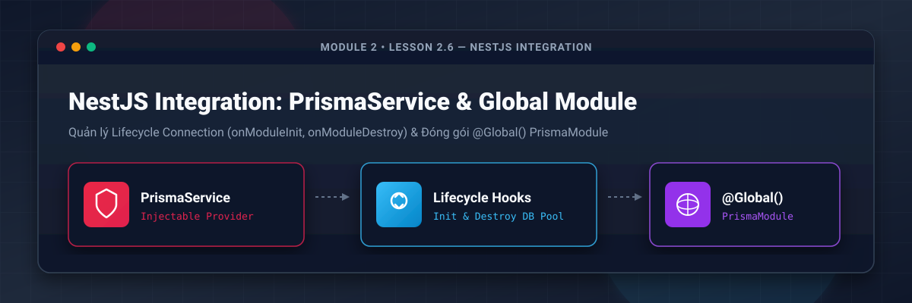
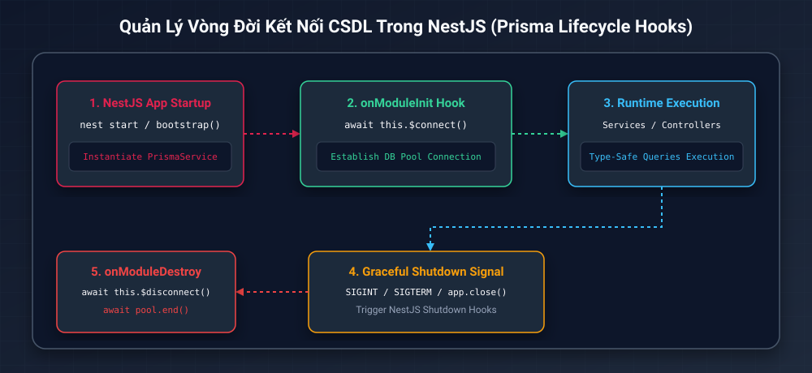
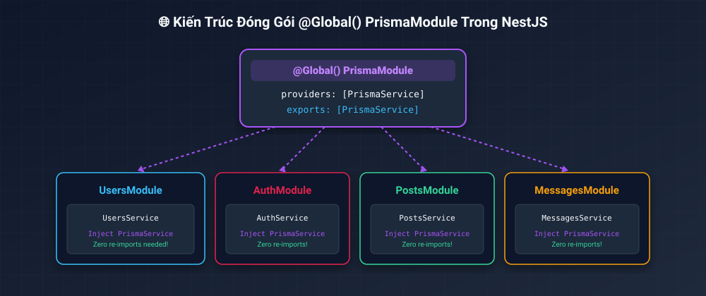
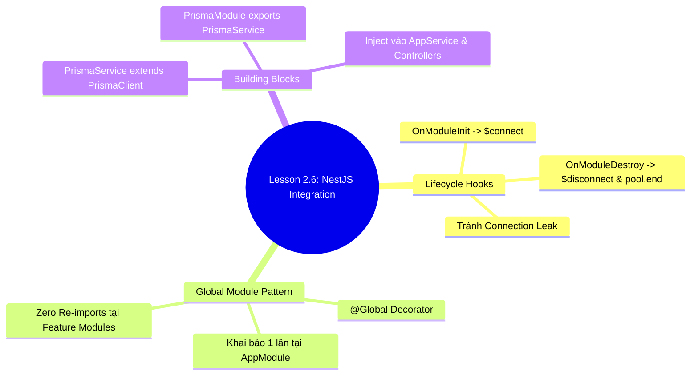

# Lesson 2.6: NestJS Integration — Tạo PrismaService & Đóng Gói Global PrismaModule

<p align="center">
  
  
  
  
  
</p>

<p align="center">
  
</p>

---

> [!NOTE]
> ⏱️ **Thời lượng dự kiến:** 12 – 15 phút  
> 🎯 **Mục tiêu bài học:** Nắm vững tư duy tích hợp Prisma ORM vào kiến trúc Dependency Injection của NestJS; quản lý chuyên nghiệp Vòng đời kết nối CSDL (Lifecycle Hooks: `OnModuleInit`, `OnModuleDestroy`); tự tay viết `PrismaService` chuẩn kiến trúc Driver Adapter và đóng gói thành `@Global()` `PrismaModule` tái sử dụng toàn bộ dự án.

---

## 1. Quản Lý Vòng Đời Kết Nối CSDL Trong NestJS (Lifecycle Hooks)

### 💡 Ẩn Dụ Thực Tế: Công Tắc Điện Tự Động Trong Ngôi Nhà Tự Động Hóa

Hãy hình dung ứng dụng NestJS của bạn như một ngôi nhà thông minh. Khi bạn mở cửa bước vào (Khởi động Server), hệ thống đèn và điều hòa (Kết nối Database) cần tự động bật lên. Khi bạn rời đi và khóa cửa (Tắt Server), ngôi nhà phải tự động ngắt toàn bộ thiết bị điện để tránh lãng phí năng lượng và nguy cơ chập cháy (Rò rỉ Connection Pool).

Trong NestJS, **Lifecycle Hooks** (`OnModuleInit` và `OnModuleDestroy`) chính là bộ "công tắc thông minh" giúp quản lý thời điểm mở và đóng kết nối CSDL một cách an toàn nhất.

---

### 🔄 Sơ Đồ Vòng Đời Kết Nối Prisma Trong NestJS

Sơ đồ dưới đây mô tả chuỗi sự kiện khi NestJS khởi tạo và kết thúc `PrismaService`:

<p align="center">
  
</p>

1. **Bootstrap Phase:** NestJS khởi tạo instance của `PrismaService`.
2. **`onModuleInit()`:** Tự động gọi `await this.$connect()` để thiết lập kết nối sẵn sàng tới PostgreSQL Connection Pool.
3. **Runtime Execution:** Các HTTP Requests thực thi các truy vấn CSDL mượt mà qua `PrismaService`.
4. **Shutdown Signal:** Khi nhận tín hiệu tắt ứng dụng (`SIGINT` / `SIGTERM`), NestJS kích hoạt Graceful Shutdown.
5. **`onModuleDestroy()`:** Tự động ngắt kết nối `await this.$disconnect()` và đóng Connection Pool `await pool.end()`.

> [!WARNING]
> **Rủi ro rò rỉ Connection Pool (Connection Leak):** Nếu không triển khai `OnModuleDestroy` để đóng `Pool` khi tắt ứng dụng, các connection rác tới PostgreSQL sẽ bị treo trong memory, dẫn đến lỗi quá tải connection (`FATAL: sorry, too many clients already`).

---

## 2. Mô Hình Đóng Gói `@Global()` Module Pattern

Trong các ứng dụng quy mô lớn với hàng chục Feature Modules (`UsersModule`, `PostsModule`, `AuthModule`, `MessagesModule`...), nếu mỗi module đều phải import `PrismaModule`, mã nguồn sẽ trở nên cồng kềnh và lặp lại.

<p align="center">
  
</p>

### ⚖️ So Sánh Module Thường vs Global Module

| Tiêu chí             | ❌ Module Thường (`PrismaModule`)                           | 🌐 Global Module (`@Global() PrismaModule`)                 |
| :------------------- | :---------------------------------------------------------- | :---------------------------------------------------------- |
| **Khai báo Import**  | Phải gõ `imports: [PrismaModule]` ở **mọi** Feature Module. | Khai báo `PrismaModule` **duy nhất 1 lần** tại `AppModule`. |
| **Inject Service**   | Rủi ro quên import dẫn đến lỗi `UnknownElementException`.   | Mọi Service có thể trực tiếp `@Inject()` `PrismaService`.   |
| **Độ sạch mã nguồn** | Cồng kềnh, sinh ra hàng chục dòng import dư thừa.           | Gọn gàng, chuẩn mực kiến trúc Enterprise NestJS.            |

---

## 3. Hướng Dẫn Thực Hành Triển Khai Step-by-Step

Bây giờ chúng ta sẽ từng bước xây dựng `PrismaService` và `PrismaModule` trong thư mục `src/prisma/`.

### 📌 Bước 1: Tạo `PrismaService` Quản Lý Lifecycle & Driver Adapter

Tạo mới tệp 📄 **`src/prisma/prisma.service.ts`**:

📄 **`src/prisma/prisma.service.ts`**

```typescript
import { Injectable, OnModuleDestroy, OnModuleInit } from '@nestjs/common';
import { ConfigService } from '@nestjs/config';
import { PrismaClient } from '../generated/prisma/client';
import { PrismaPg } from '@prisma/adapter-pg';
import { Pool } from 'pg';

@Injectable()
export class PrismaService
  extends PrismaClient
  implements OnModuleInit, OnModuleDestroy
{
  private pool: Pool;

  constructor(private readonly configService: ConfigService) {
    const connectionString = configService.get<string>('DATABASE_URL');
    const pool = new Pool({ connectionString });
    const adapter = new PrismaPg(pool);
    super({ adapter });
    this.pool = pool;
  }

  async onModuleInit() {
    await this.$connect();
  }

  async onModuleDestroy() {
    await this.$disconnect();
    await this.pool.end();
  }
}
```

> [!IMPORTANT]
> **Giải thích code:**
>
> - `ConfigService`: Truy cập an toàn biến môi trường `DATABASE_URL` từ NestJS Config System.
> - `extends PrismaClient`: Giúp `PrismaService` thừa hưởng toàn bộ các hàm thao tác CSDL type-safe (`user.findMany`, `post.create`...).
> - `implements OnModuleInit, OnModuleDestroy`: Đảm bảo NestJS sẽ bắt buộc triển khai 2 phương thức quản lý vòng đời kết nối.

---

### 📌 Bước 2: Tạo `@Global()` `PrismaModule`

Tạo mới tệp 📄 **`src/prisma/prisma.module.ts`**:

📄 **`src/prisma/prisma.module.ts`**

```typescript
import { Global, Module } from '@nestjs/common';
import { PrismaService } from './prisma.service';

@Global()
@Module({
  providers: [PrismaService],
  exports: [PrismaService],
})
export class PrismaModule {}
```

- `@Global()` Decorator biến `PrismaModule` thành một Module toàn cục.
- `exports: [PrismaService]` cung cấp instance `PrismaService` cho bất kỳ provider nào trong ứng dụng.

---

### 📌 Bước 3: Đăng Ký `PrismaModule` Trong `AppModule`

Mở tệp 📄 **`src/app.module.ts`** và import `PrismaModule`:

📄 **`src/app.module.ts`**

```typescript
import { Module } from '@nestjs/common';
import { AppController } from './app.controller';
import { AppService } from './app.service';
import { PrismaModule } from './prisma/prisma.module';

@Module({
  imports: [PrismaModule],
  controllers: [AppController],
  providers: [AppService],
})
export class AppModule {}
```

---

### 📌 Bước 4: Kiểm Thử Inject `PrismaService` Trong `AppService`

Mở tệp 📄 **`src/app.service.ts`** và tiêm (Inject) `PrismaService` để đếm số lượng người dùng từ CSDL:

📄 **`src/app.service.ts`**

```typescript
import { Injectable } from '@nestjs/common';
import { PrismaService } from './prisma/prisma.service';

@Injectable()
export class AppService {
  constructor(private readonly prisma: PrismaService) {}

  async getHello(): Promise<string> {
    const userCount = await this.prisma.user.count();
    return `Xin chào! Social Chat App có tổng cộng ${userCount} người dùng trong CSDL.`;
  }
}
```

Cập nhật lại 📄 **`src/app.controller.ts`** xử lý `async`:

📄 **`src/app.controller.ts`**

```typescript
import { Controller, Get } from '@nestjs/common';
import { AppService } from './app.service';

@Controller()
export class AppController {
  constructor(private readonly appService: AppService) {}

  @Get()
  async getHello(): Promise<string> {
    return await this.appService.getHello();
  }
}
```

---

## 4. Kịch Bản Thử Nghiệm & Kiểm Thử (Hands-on Lab)

### 🟢 Kịch Bản 1: Khởi Động Server & Kiểm Tra Kết Nối Dữ Liệu (Success Flow)

1. Mở Terminal và bật chế độ phát triển dev:
   ```bash
   pnpm start:dev
   ```
2. Mở trình duyệt và truy cập địa chỉ: **`http://localhost:3000`**
3. **Kết quả kỳ vọng:** Trình duyệt hiển thị dòng chữ:
   ```text
   Xin chào! Social Chat App có tổng cộng 11 người dùng trong CSDL.
   ```
4. Thử dừng server bằng tổ hợp phím `Ctrl + C`: NestJS sẽ phát tín hiệu Graceful Shutdown, gọi `onModuleDestroy()`, ngắt kết nối an toàn với PostgreSQL mà không để lại bất kỳ connection rác nào!

---

### 🔴 Kịch Bản 2: Kiểm Thử Ngăn Chặn Lỗi Rò Rỉ Resource (Error Flow)

#### ❌ Lỗi 1: Lỗi `UnknownElementException` hoặc `Cannot resolve dependency`

- **Hiện tượng:** Ứng dụng NestJS không khởi động được và báo lỗi DI Dependency Injection.
- **Nguyên nhân:** Quên thêm decorator `@Global()` trên đầu `PrismaModule` hoặc quên khai báo `exports: [PrismaService]`.
- **Cách khắc phục:** Kiểm tra lại tệp `src/prisma/prisma.module.ts` đảm bảo đã bọc `@Global()` và có mảng `exports`.

---

## 5. Tổng Kết Bài Học & Checklist Ghi Nhớ



### ✅ Checklist Ghi Nhớ Bài Học:

- [x] Hiểu nguyên lý quản lý kết nối CSDL theo Lifecycle của NestJS Framework.
- [x] Xây dựng thành công `PrismaService` với Driver Adapter `@prisma/adapter-pg`.
- [x] Đóng gói thành công `@Global()` `PrismaModule`.
- [x] Đăng ký `PrismaModule` vào `AppModule`.
- [x] Inject thành công `PrismaService` vào `AppService` và kiểm tra API `http://localhost:3000` chạy mượt mà.

---

👉 **Bài tiếp theo:** [Lesson 2.7: Type-Safe Queries — Thao Tác CRUD Chuẩn Hóa Với Prisma Client (select, include, where, orderBy)](../lesson-2.7/lesson-2.7.md)
