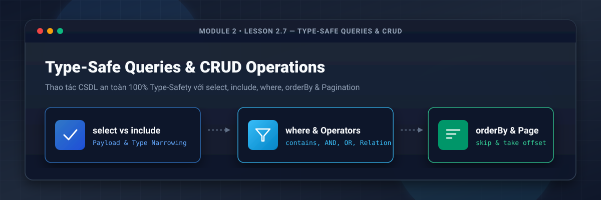
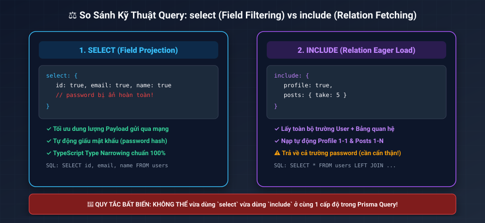
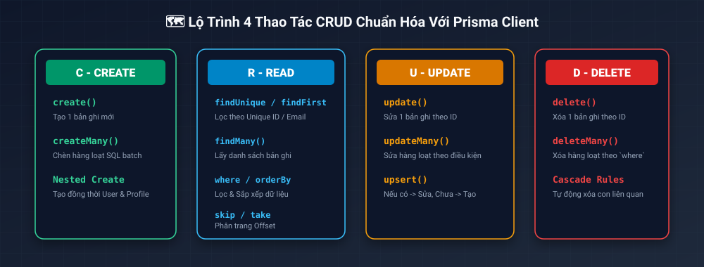
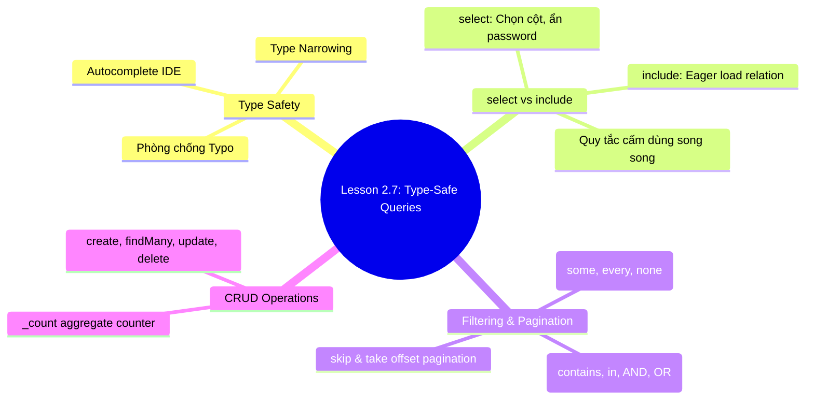

# Lesson 2.7: Type-Safe Queries — Thao Tác CRUD Chuẩn Hóa Với Prisma Client

<p align="center">
  
  
  
  
  
</p>

<p align="center">
  
</p>

---

> [!NOTE]
> ⏱️ **Thời lượng dự kiến:** 15 – 18 phút  
> 🎯 **Mục tiêu bài học:** Nắm vững sức mạnh Type-Safety của Prisma Client; phân biệt chính xác khi nào dùng `select` (Field Filtering) và `include` (Relation Loading); làm chủ các toán tử điều kiện phức tạp trong `where` (`contains`, `in`, `AND`, `OR`, `some`); triển khai chuẩn hóa thuật toán phân trang (`skip`, `take`) và thực thi bộ 4 thao tác CRUD thực chiến trong NestJS Service.

---

## 1. Sức Mạnh Type-Safety & Autocomplete Của Prisma Client

### 💡 Ẩn Dụ Thực Tế: Thực Đơn Điện Tử Đặt Món Thông Minh

Khi bạn gọi món ở một nhà hàng cao cấp qua máy máy tính bảng (Tablet), màn hình chỉ hiển thị đúng các món đang có sẵn trong kho, với đúng tùy chọn giá và size. Bạn không thể gõ nhầm một tên món không tồn tại.

Các ORM truyền thống gõ chuỗi SQL thuần (`SELECT username FROM users`) rất dễ bị rủi ro gõ sai chính tả (`user_name` hay `username`?) dẫn đến lỗi Runtime Crash trên Production.

**Prisma Client** hoạt động như "Thực đơn thông minh": Dựa trên tệp `schema.prisma`, Prisma tự động sinh ra bộ TypeScript Types 100% khớp với CSDL. Khi bạn gõ `prisma.user.findMany({ where: { ... } })`, IDE sẽ tự động gợi ý (Autocomplete) chính xác từng tên thuộc tính và kiểu dữ liệu tương ứng!

---

## 2. Phân Biệt `select` vs `include` (Payload & Type Narrowing)

Trong Prisma Query, việc chọn dữ liệu trả về được chia làm 2 chiến lược cốt lõi:

<p align="center">
  
</p>

### ⚖️ Bảng So Sánh Chi Tiết: `select` vs `include`

| Tiêu chí            | 🎯 `select` (Field Projection)                                     | 🔗 `include` (Relation Fetching)                              |
| :------------------ | :----------------------------------------------------------------- | :------------------------------------------------------------ |
| **Mục đích**        | Chỉ chọn các thuộc tính cụ thể được định nghĩa.                    | Lấy toàn bộ trường của Model + Nạp kèm Bảng quan hệ.          |
| **Bảo mật**         | **Rất tốt**: Dễ dàng loại bỏ trường nhạy cảm (`password`).         | **Cần lưu ý**: Trả về toàn bộ cột của Model (gồm `password`). |
| **Dung lượng mạng** | **Tối ưu**: Chỉ tải đúng các cột cần thiết về client.              | **Nặng hơn**: Tải toàn bộ dữ liệu của Model chính.            |
| **Type System**     | TypeScript **bản hẹp (Type Narrowing)**: Chỉ infer các field chọn. | TypeScript infer kiểu dữ liệu gốc + quan hệ đính kèm.         |

> [!CAUTION]
> **Quy tắc bất biến trong Prisma Client:** Bạn **KHÔNG THỂ** sử dụng đồng thời cả `select` và `include` ở cùng một cấp độ trong một câu truy vấn!
>
> ```typescript
> // ❌ BỊ LỖI BUILD: Không thể dùng song song ở cùng 1 level!
> await prisma.user.findUnique({
>   where: { id: 1 },
>   select: { id: true, email: true },
>   include: { posts: true },
> });
>
> // ✅ ĐÚNG CHUẨN: Lồng select bên trong select hoặc include!
> await prisma.user.findUnique({
>   where: { id: 1 },
>   select: {
>     id: true,
>     email: true,
>     posts: { select: { id: true, title: true } }, // Nested Select
>   },
> });
> ```

---

## 3. Lọc Dữ Liệu Nâng Cao Nâng Cao Với `where`, Operators & Phân Trang

Sơ đồ tổng quan bộ 4 thao tác CRUD và các toán tử bổ trợ trong Prisma Client:

<p align="center">
  
</p>

### 🔍 1. Các Toán Tử Lọc Dữ Liệu Chuẩn (`where`)

- **Tìm kiếm tương đối (Search / Like):**
  ```typescript
  where: {
    email: { contains: '@gmail.com', mode: 'insensitive' } // Không phân biệt chữ hoa/thường
  }
  ```
- **Lọc theo danh sách (`in` / `notIn`):**
  ```typescript
  where: {
    role: { in: [Role.ADMIN, Role.USER] }
  }
  ```
- **So sánh số & thời gian (`gt`, `gte`, `lt`, `lte`):**
  ```typescript
  where: {
    createdAt: {
      gte: new Date('2026-01-01');
    }
  }
  ```

---

### 🧠 2. Toán Tử Logic Phức Tạp (`AND`, `OR`, `NOT`)

```typescript
where: {
  OR: [
    { title: { contains: 'NestJS', mode: 'insensitive' } },
    { content: { contains: 'Prisma', mode: 'insensitive' } },
  ],
  AND: [
    { published: true }
  ]
}
```

---

### 🕸️ 3. Lọc Dữ Liệu Theo Quan Hệ (Relation Filters: `some`, `every`, `none`)

Tìm tất cả người dùng có **ít nhất một bài viết** chứa từ khóa `"GraphQL"`:

```typescript
where: {
  posts: {
    some: {
      title: { contains: 'GraphQL', mode: 'insensitive' }
    }
  }
}
```

---

### 📄 4. Sắp Xếp (`orderBy`) & Phân Trang (`skip`, `take`)

Thuật toán phân trang Offset-based tiêu chuẩn cho REST API:

```typescript
const page = 2;
const limit = 10;

const posts = await prisma.post.findMany({
  skip: (page - 1) * limit, // Bỏ qua 10 bản ghi đầu (Trang 1)
  take: limit, // Lấy 10 bản ghi tiếp theo (Trang 2)
  orderBy: {
    createdAt: 'desc', // Bài viết mới nhất xếp lên đầu
  },
});
```

---

## 4. Hướng Dẫn Thực Hành Viết Service CRUD Trong NestJS

Bây giờ chúng ta sẽ áp dụng các kỹ thuật query type-safe trên để viết một ví dụ thực chiến trong NestJS Service.

### 📌 Bước 1: Tạo Tệp `src/posts/posts.service.ts`

📄 **`src/posts/posts.service.ts`**

```typescript
import { Injectable, NotFoundException } from '@nestjs/common';
import { PrismaService } from '../prisma/prisma.service';
import { Prisma } from '../generated/prisma/client';

@Injectable()
export class PostsService {
  constructor(private readonly prisma: PrismaService) {}

  // 1. CREATE: Tạo bài viết mới kèm tác giả
  async createPost(authorId: string, title: string, content: string) {
    return await this.prisma.post.create({
      data: {
        title,
        content,
        published: true,
        author: {
          connect: { id: authorId },
        },
      },
      select: {
        id: true,
        title: true,
        content: true,
        createdAt: true,
        author: {
          select: { id: true, name: true, email: true },
        },
      },
    });
  }

  // 2. READ: Truy vấn danh sách bài viết phân trang & tìm kiếm từ khóa
  async findAllPosts(search?: string, page = 1, limit = 10) {
    const skip = (page - 1) * limit;

    const whereCondition: Prisma.PostWhereInput = {
      published: true,
      ...(search && {
        OR: [
          { title: { contains: search, mode: 'insensitive' } },
          { content: { contains: search, mode: 'insensitive' } },
        ],
      }),
    };

    const [items, total] = await Promise.all([
      this.prisma.post.findMany({
        where: whereCondition,
        skip,
        take: limit,
        orderBy: { createdAt: 'desc' },
        select: {
          id: true,
          title: true,
          createdAt: true,
          author: {
            select: { id: true, name: true },
          },
          _count: {
            select: { comments: true }, // Đếm số bình luận mà không cần nạp mảng comments!
          },
        },
      }),
      this.prisma.post.count({ where: whereCondition }),
    ]);

    return {
      data: items,
      meta: {
        total,
        page,
        lastPage: Math.ceil(total / limit),
      },
    };
  }

  // 3. UPDATE: Cập nhật bài viết theo ID
  async updatePost(id: string, title?: string, content?: string) {
    try {
      return await this.prisma.post.update({
        where: { id },
        data: {
          ...(title && { title }),
          ...(content && { content }),
        },
      });
    } catch {
      throw new NotFoundException(`Không tìm thấy bài viết với ID ${id}`);
    }
  }

  // 4. DELETE: Xóa bài viết
  async deletePost(id: string) {
    try {
      return await this.prisma.post.delete({
        where: { id },
      });
    } catch {
      throw new NotFoundException(
        `Không thể xóa! Bài viết ID ${id} không tồn tại.`,
      );
    }
  }
}
```

---

## 5. Kịch Bản Thử Nghiệm & Kiểm Thử (Hands-on Lab)

### 🟢 Kịch Bản 1: Kiểm Thử Type Autocomplete & Aggregate Counter (Success Flow)

1. Mở IDE (VS Code) và gõ thử câu lệnh:
   ```typescript
   const users = await this.prisma.user.findMany({
     select: { id: true, name: true },
   });
   ```
2. Thử truy cập `users[0].password` — **IDE sẽ báo lỗi đỏ ngay lập tức** vì `password` không nằm trong danh sách `select`! Đây chính là tính năng **Type Narrowing** giúp ngăn ngừa rò rỉ dữ liệu nhạy cảm ra ngoài API.
3. Chạy hàm `findAllPosts()` -> Kết quả trả về chứa object `meta` phân trang chuẩn xác kèm biến đếm `_count: { comments: 5 }` với hiệu năng SQL cực cao!

---

### 🔴 Kịch Bản 2: Kiểm Thử Bắt Lỗi Xung Đột Query (Error Flow)

#### ❌ Lỗi 1: `Cannot use both 'select' and 'include' operations back-to-back`

- **Hiện tượng:** TypeScript bôi đỏ và báo lỗi hỏng type khi compile.
- **Nguyên nhân:** Cố tình khai báo cả `select` và `include` ở mảng tham số gốc.
- **Cách khắc phục:** Chuyển câu lệnh `include` thành câu lệnh `select` lồng nhau (Nested Select) như hướng dẫn ở Mục 2.

---

## 6. Tổng Kết Bài Học & Checklist Ghi Nhớ



### ✅ Checklist Ghi Nhớ Bài Học:

- [x] Hiểu ưu điểm của Type-Safety trong Prisma Client so với SQL ORM truyền thống.
- [x] Nắm vững sự khác nhau giữa `select` và `include` và quy tắc không kết hợp song song.
- [x] Sử dụng nhuần nhuyễn các toán tử lọc `contains`, `in`, `AND`, `OR` và `some`.
- [x] Làm chủ công thức tính phân trang `skip = (page - 1) * limit` và `take = limit`.
- [x] Viết thành công Service CRUD bài viết thực chiến trong NestJS.

---

👉 **Bài tiếp theo:** [Lesson 2.8: Transactions & Optimization — Xử Lý Giao Dịch Dữ Liệu Với $transaction & Phòng Chống N+1 Query](../lesson-2.8/lesson-2.8.md)
