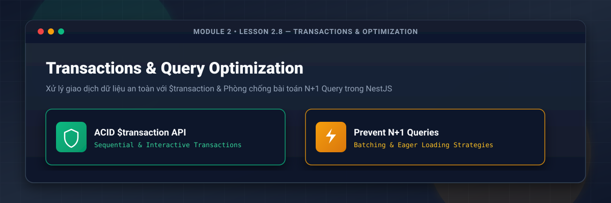
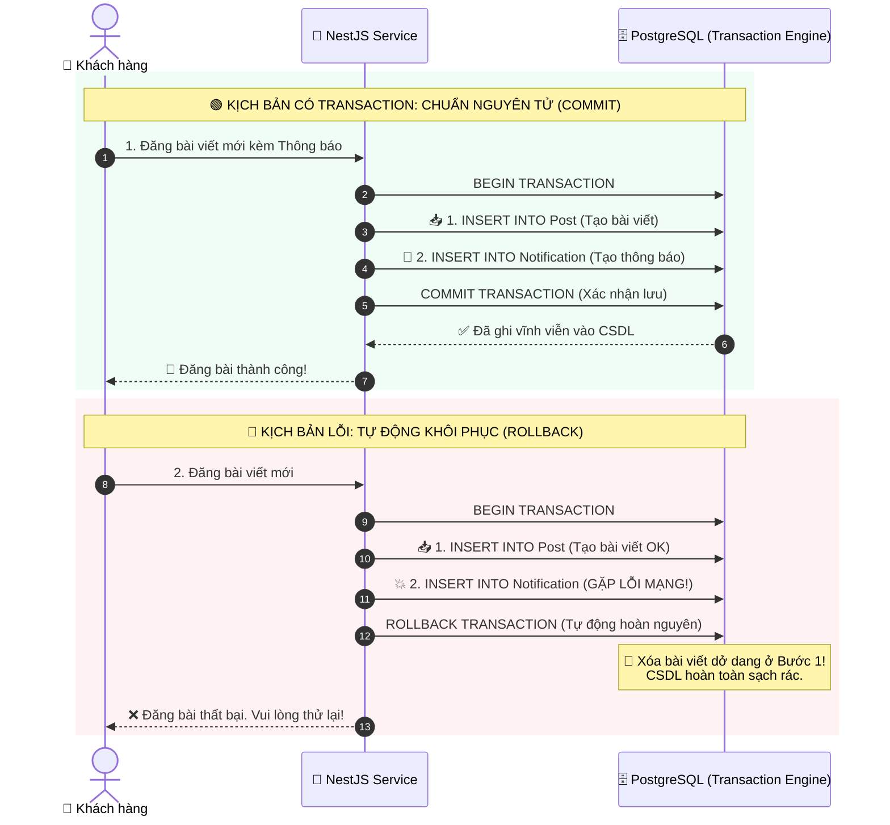
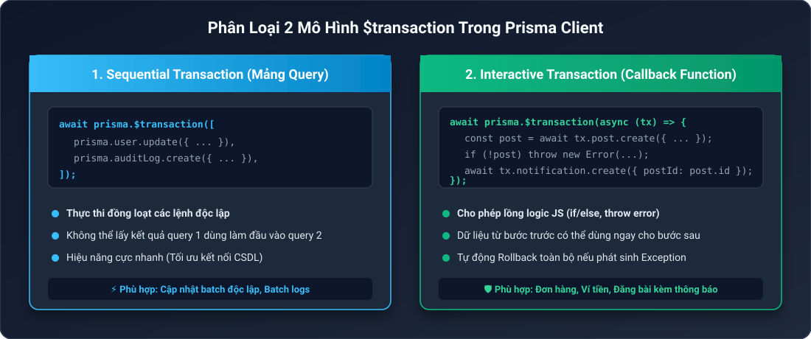
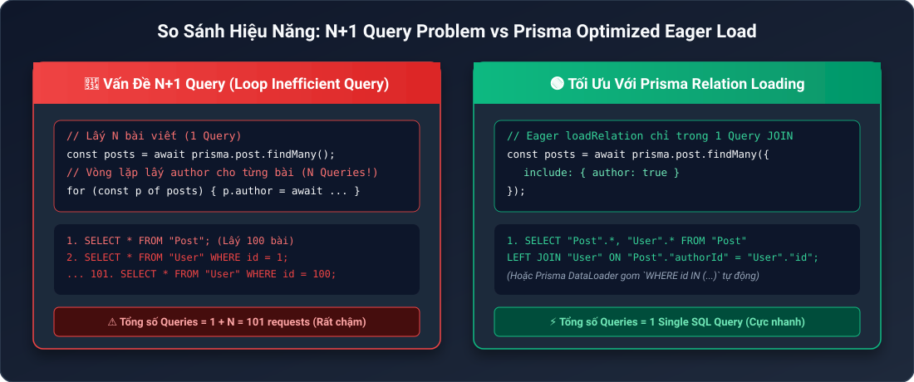
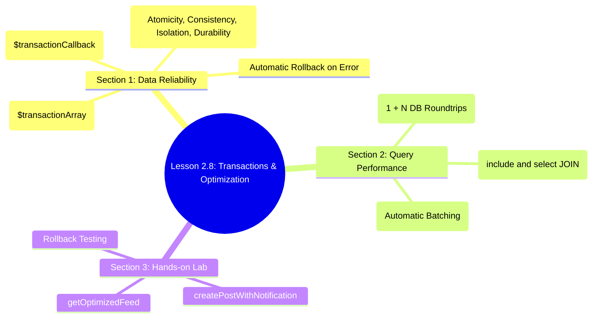

# Lesson 2.8: Transactions & Performance — Xử Lý Giao Dịch ACID & Loại Bỏ N+1 Query

<p align="center">
  
  
  
  
  
</p>

<p align="center">
  
</p>

---

> [!NOTE]
> ⏱️ **Thời lượng dự kiến:** 15 – 18 phút  
> 🎯 **Mục tiêu bài học:** Bài học được chia làm **2 Chủ đề cốt lõi (2 Sections)**:
>
> 1. **Chủ đề 1 (Data Reliability):** Nắm vững nguyên lý ACID & làm chủ bộ đôi `$transaction` (Sequential & Interactive) để bảo toàn tính nhất quán CSDL.
> 2. **Chủ đề 2 (Query Performance):** Nhận diện hiểm họa N+1 Query và áp dụng triệt để chiến lược Eager Loading (`include`/`select`) & Prisma DataLoader Batching.

---

## 🏛️ PHẦN I: Quản Lý Giao Dịch An Toàn Dữ Liệu Với `$transaction`

### 💡 1. Ẩn Dụ Thực Tế: Câu Chuyện Chuyển Tiền & Vé Xem Phim IMAX

#### 🎭 Kịch Bản 1: Thảm Họa Khi "Trừ Tiền Nhưng Không Có Vé"

Hãy tưởng tượng bạn đang săn vé xem phim bom tấn IMAX ngày công chiếu. Hệ thống thanh toán thực hiện 2 thao tác:

1. **Bước 1:** Trừ **200.000đ** trong Ví MoMo của bạn. _(Thành công ✅)_
2. **Bước 2:** Hệ thống máy chủ Rạp phim bị nghẽn mạng đúng lúc phát hành mã vé! _(Lỗi 💥)_

Nếu hệ thống CSDL **KHÔNG có Transaction**:

- Ví của bạn bị trừ tiền nhưng rạp phim không xuất vé.
- Bạn rơi vào trạng thái "tiền mất tật mang", hotline tổng đài quá tải vì hàng nghìn người khiếu nại!



#### 📌 Áp Dụng Trong Social Chat App:

Khi người dùng đăng một bài viết mới:

- **Hành động 1:** Chèn dữ liệu bài viết vào bảng `Post`.
- **Hành động 2:** Chèn dữ liệu thông báo vào bảng `Notification`.
- **Hành động 3:** Tăng biến đếm bài viết `postCount` của người dùng trong bảng `User`.

**Yêu cầu sống còn:** Cả 3 hành động phải chạy như một khối thống nhất. **Tất cả cùng thành công (Commit), hoặc tất cả cùng quay về trạng thái ban đầu (Rollback)**.

---

### 🛡️ 4 Trụ Cột ACID Qua Ẩn Dụ Đời Thường

| Thuộc tính ACID                       | Ẩn dụ đời thực                                                                                                                                                          | Giải thích trong CSDL                                                                                     |
| :------------------------------------ | :---------------------------------------------------------------------------------------------------------------------------------------------------------------------- | :-------------------------------------------------------------------------------------------------------- |
| ⚛️ **Atomicity** _(Tính nguyên tử)_   | **Chuyến Phóng Tên Lửa Vũ Trụ**: Chỉ cần 1 động cơ phụ gặp sự cố ở giây cuối, toàn bộ lệnh phóng bị hủy bỏ (`Abort`). Không thể phóng 50% tên lửa rồi nằm im giữa trời. | **"Tất cả hoặc Không có gì"**. Nếu 1 câu SQL trong chuỗi bị lỗi, toàn bộ transaction bị Rollback lập tức. |
| 🔄 **Consistency** _(Tính nhất quán)_ | **Bảo Toàn Năng Lượng**: Tổng số tiền trong hệ thống trước và sau khi chuyển phải bằng nhau. Tiền không tự nhiên sinh ra hay mất đi.                                    | Dữ liệu sau giao dịch luôn hợp lệ, tuân thủ các quy tắc ràng buộc (Foreign Key, Unique Key, Not Null).    |
| 🔒 **Isolation** _(Tính cô lập)_      | **Phòng Rửa Vé Độc Lập**: 2 khách hàng cùng ấn mua chiếc vé cuối cùng. Hệ thống xử lý từng người trong phòng riêng để không bao giờ bị trùng vé (`Race condition`).     | Hai transaction chạy song song không nhìn thấy dữ liệu "rác" dở dang của nhau cho đến khi Commit.         |
| 💾 **Durability** _(Tính bền vững)_   | **Khắc Chữ Trên Đá**: Khi bản hợp đồng đã đóng dấu đỏ, kể cả mất điện tòa nhà 1 giây sau đó thì hợp đồng vẫn còn nguyên vẹn.                                            | Dữ liệu sau khi `COMMIT` thành công sẽ được ghi vĩnh viễn xuống đĩa cứng, an toàn cả khi sập máy chủ.     |

---

### ⚖️ 2. Phân Loại 2 Dạng `$transaction` Trong Prisma Client

Prisma cung cấp 2 mô hình giao dịch đáp ứng từng trường hợp nghiệp vụ:

<p align="center">
  
</p>

#### A. Sequential Transactions (`$transaction([ ... ])`)

Truyền vào một mảng chứa các câu query độc lập. Prisma sẽ gom tất cả gửi đến CSDL trong 1 SQL Transaction block.

```typescript
// ✅ Thích hợp khi các câu query độc lập, không cần đọc dữ liệu của nhau
const [updatedUser, auditLog] = await prisma.$transaction([
  prisma.user.update({ where: { id: userId }, data: { status: 'ACTIVE' } }),
  prisma.auditLog.create({ data: { action: 'ACTIVATE_USER', userId } }),
]);
```

#### B. Interactive Transactions (`$transaction(async (tx) => { ... })`)

Truyền vào một hàm `async callback` chứa tham số `tx` (**Transactional Client**). Cho phép viết logic JavaScript (`if/else`, `throw Exception`) và dùng kết quả câu lệnh trước làm đầu vào cho câu lệnh sau.

```typescript
// ✅ Thích hợp khi câu lệnh sau phụ thuộc vào kết quả của câu lệnh trước
await prisma.$transaction(async (tx) => {
  // Step 1: Tạo bài viết
  const post = await tx.post.create({
    data: { title: 'NestJS Masterclass', authorId },
  });

  // Step 2: Dùng post.id vừa tạo để chèn bảng Notification
  await tx.notification.create({
    data: {
      userId: authorId,
      content: `Bài viết "${post.title}" của bạn đã được xuất bản!`,
    },
  });
});
```

> [!CAUTION]
> **Quy tắc sinh tử trong Interactive Transaction:** Bên trong hàm callback, bạn **BẮT BUỘC** phải gọi các câu truy vấn qua tham số `tx` (VD: `tx.post.create()`), **TUYỆT ĐỐI KHÔNG** dùng `this.prisma.post.create()`. Nếu dùng `this.prisma`, truy vấn đó sẽ chạy ngoài Transaction và không thể Rollback khi gặp lỗi!

---

## ⚡ PHẦN II: Phòng Chống N+1 Query & Tối Ưu Truy Vấn CSDL

### 🚨 1. Bản Chất Hiểm Họa N+1 Query Problem

**N+1 Query** là lỗi hiệu năng nghiêm trọng khi ứng dụng gửi **1 câu query lấy danh sách N bản ghi**, sau đó chạy vòng lặp gửi thêm **N câu query con** để lấy dữ liệu bảng quan hệ.

<p align="center">
  
</p>

#### ❌ Mã nguồn dính lỗi N+1 Query (Ví dụ thực tế gây sập DB):

```typescript
// Query 1: Lấy danh sách 100 bài viết (1 Query)
const posts = await prisma.post.findMany({ take: 100 });

// Query 2 -> 101: Vòng lặp truy vấn tác giả cho từng bài (100 Queries!)
for (const post of posts) {
  post.author = await prisma.user.findUnique({
    where: { id: post.authorId },
  });
}
// ⚠️ TỔNG CỘNG HỆ THỐNG PHẢI GỬI: 1 + 100 = 101 QUERIES VỀ DATABASE!
```

> [!WARNING]
> Khi số bài viết lên 1,000 bản ghi, hệ thống sẽ thực thi **1,001 truy vấn**. Việc này làm kiệt quệ Connection Pool, ngốn RAM CSDL và gây trễ API nặng nề.

---

### 🛡️ 2. Bộ 2 Giải Pháp Tối Ưu Triệt Để Với Prisma Client

#### Solution 1: Eager Loading Với `select` / `include` (Single SQL JOIN Query)

Cho phép CSDL PostgreSQL thực thi phép `JOIN` trực tiếp ở tầng SQL Engine và trả về toàn bộ dữ liệu chỉ trong **01 câu Query duy nhất**.

```typescript
// ✅ TỐI ƯU 100%: Chỉ tốn duy nhất 1 câu SQL JOIN
const posts = await prisma.post.findMany({
  take: 100,
  select: {
    id: true,
    title: true,
    author: {
      select: { id: true, name: true, email: true },
    },
  },
});
```

#### Solution 2: Prisma DataLoader Batching (Tự Động Gom Query)

Khi có nhiều câu lệnh `findUnique` được kích hoạt đồng thời trong cùng một tick của Event Loop, Prisma Client tự động gom chúng thành 1 câu SQL duy nhất bằng cú pháp `WHERE id IN (...)`:

```typescript
// ✅ Prisma tự động gom 100 query đơn lẻ thành 1 câu SQL:
// SELECT * FROM "User" WHERE id IN (1, 2, 3, ..., 100);
const authors = await Promise.all(
  authorIds.map((id) => prisma.user.findUnique({ where: { id } })),
);
```

---

## 🛠️ PHẦN III: Hướng Dẫn Thực Hành Viết Service Trong NestJS

Dưới đây là mã nguồn thực chiến triển khai cả **Interactive Transaction** và **Eager Loading Optimization** trong NestJS.

📄 **`src/posts/posts.service.ts`**

```typescript
import { Injectable, BadRequestException } from '@nestjs/common';
import { PrismaService } from '../prisma/prisma.service';

@Injectable()
export class PostsService {
  constructor(private readonly prisma: PrismaService) {}

  /**
   * PHẦN I DEMO: Interactive Transaction tạo bài viết kèm thông báo nguyên tử
   */
  async createPostWithNotification(
    authorId: string,
    title: string,
    content: string,
  ) {
    return await this.prisma.$transaction(
      async (tx) => {
        // Step 1: Bắt buộc kiểm tra tác giả tồn tại qua Transactional Client (tx)
        const author = await tx.user.findUnique({
          where: { id: authorId },
        });

        if (!author) {
          throw new BadRequestException('Tác giả không tồn tại trên hệ thống!');
        }

        // Step 2: Tạo bài viết mới
        const post = await tx.post.create({
          data: {
            title,
            content,
            published: true,
            authorId,
          },
        });

        // Step 3: Tạo notification thông báo
        await tx.notification.create({
          data: {
            userId: authorId,
            content: `Bài viết "${post.title}" của bạn đã được phát hành thành công.`,
          },
        });

        return post;
      },
      {
        maxWait: 5000, // Thời gian chờ tối đa Connection Pool (5s)
        timeout: 10000, // Thời gian thực thi tối đa Transaction (10s)
      },
    );
  }

  /**
   * PHẦN II DEMO: Truy vấn danh sách bài viết tối ưu chống N+1 Query
   */
  async getOptimizedFeed(limit = 10) {
    return await this.prisma.post.findMany({
      take: limit,
      where: { published: true },
      orderBy: { createdAt: 'desc' },
      select: {
        id: true,
        title: true,
        createdAt: true,
        // Eager load tác giả bằng Nested Select (01 Single SQL Query JOIN)
        author: {
          select: {
            id: true,
            name: true,
            email: true,
          },
        },
        // Count bình luận bằng SQL Aggregate Counter (Không bị N+1)
        _count: {
          select: { comments: true },
        },
      },
    });
  }
}
```

📄 **`src/posts/posts.controller.ts`**

```typescript
import { Controller, Post, Get, Body, Query } from '@nestjs/common';
import { PostsService } from './posts.service';

@Controller('posts')
export class PostsController {
  constructor(private readonly postsService: PostsService) {}

  @Post()
  async createPost(
    @Body() body: { authorId: string; title: string; content: string },
  ) {
    return await this.postsService.createPostWithNotification(
      body.authorId,
      body.title,
      body.content,
    );
  }

  @Get('feed')
  async getFeed(@Query('limit') limit?: string) {
    return await this.postsService.getOptimizedFeed(
      limit ? parseInt(limit, 10) : 10,
    );
  }
}
```

---

## 🧪 PHẦN IV: Kịch Bản Thử Nghiệm & Kiểm Thử (Hands-on Lab)

### 🟢 Kịch Bản 1: Kiểm Thử Transaction & Eager Load Thành Công (Success Flow)

1. Khởi động ứng dụng NestJS:
   ```bash
   pnpm run start:dev
   ```
2. Mở Terminal mới và gửi lệnh HTTP POST bằng **cURL** (hoặc sử dụng Postman / Thunder Client):
   ```bash
   curl -X POST http://localhost:3000/posts \
     -H "Content-Type: application/json" \
     -d '{"authorId": "user-uuid-123", "title": "Bài viết test Transaction", "content": "Nội dung bài viết..."}'
   ```
3. Mở **Prisma Studio** để kiểm tra kết quả lưu trữ CSDL:
   ```bash
   pnpm exec prisma studio
   ```
4. Khám phá 2 bảng `Post` và `Notification` -> Cả 2 bản ghi đều được chèn chính xác đồng thời (Transaction Commit thành công ✅).
5. Gọi API `GET http://localhost:3000/posts/feed` -> Kết quả trả về chứa đủ thông tin `author` và số lượng `comments` chỉ với **01 câu lệnh SQL duy nhất**:
   ```bash
   curl http://localhost:3000/posts/feed
   ```

---

### 🔴 Kịch Bản 2: Kiểm Thử Rollback Tự Động Khi Có Exception (Error Flow)

1. Gửi lệnh cURL tạo bài viết với `authorId` không tồn tại trên CSDL (`invalid-user-id`):
   ```bash
   curl -X POST http://localhost:3000/posts \
     -H "Content-Type: application/json" \
     -d '{"authorId": "invalid-user-id", "title": "Bài viết rác", "content": "Nội dung..."}'
   ```
2. Hàm dừng lại tại Step 1 do không tìm thấy tác giả và ném ra `BadRequestException`.
3. Kiểm tra lại CSDL trên **Prisma Studio**:
   - **Bảng `Post`:** KHÔNG CÓ bài viết mới nào bị tạo dở dang!
   - **Bảng `Notification`:** KHÔNG CÓ thông báo rác nào bị lưu!
4. **Kết luận:** Giao dịch Transaction đã **Rollback 100%** dữ liệu về trạng thái sạch sẽ ban đầu.

---

## 📋 PHẦN V: Tổng Kết Bài Học & Checklist Ghi Nhớ



### ✅ Checklist Ghi Nhớ Bài Học:

- [x] Hiểu nguyên lý 4 thuộc tính ACID trong CSDL quan hệ.
- [x] Phân biệt được khi nào dùng Sequential vs Interactive Transaction.
- [x] Nhớ quy tắc sinh tử: Luôn dùng tham số `tx` trong Interactive Transaction callback.
- [x] Nhận diện nguyên nhân và tác hại của lỗi N+1 Query đối với hiệu năng ứng dụng.
- [x] Áp dụng nhuần nhuyễn Eager Loading (`select`/`include`) và Prisma DataLoader để loại bỏ N+1 Query.

---

👉 **Bài tiếp theo:** [Lesson 2.9: Prisma Error Handling — Bắt Và Chuẩn Hóa Lỗi Prisma Client Với NestJS Exception Filter](../lesson-2.9/lesson-2.9.md)
