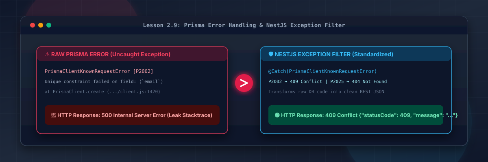
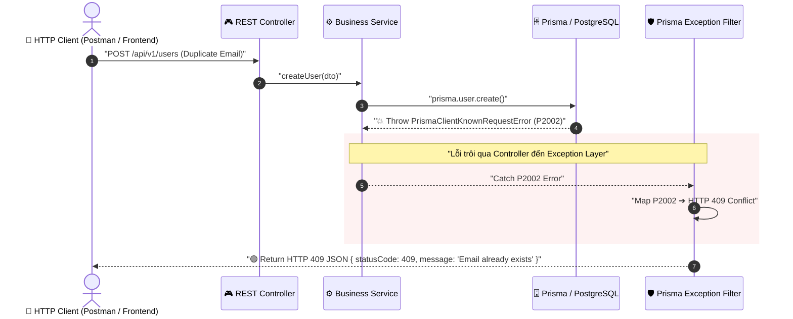
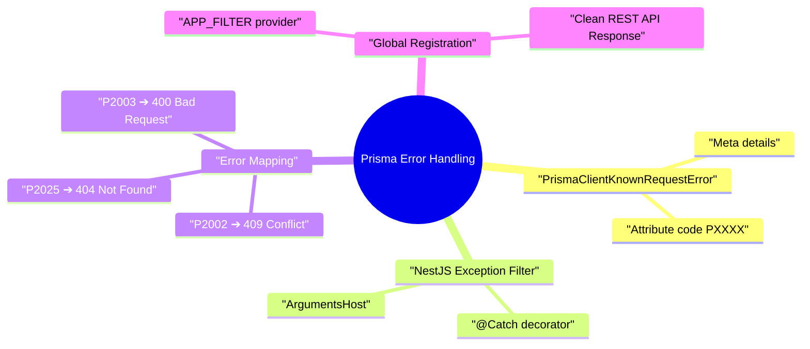

# Lesson 2.9: Prisma Error Handling — Bắt & Chuẩn Hóa Lỗi Database Với NestJS Exception Filter

<p align="center">
  
  
  
  
  
</p>

<p align="center">
  
</p>

---

> [!NOTE]
> ⏱️ **Thời lượng dự kiến:** 12 – 15 phút  
> 🎯 **Mục tiêu bài học:** Thấu hiểu nguyên nhân tại sao lỗi Prisma CSDL chưa được bắt sẽ trôi ra ngoài và biến thành `500 Internal Server Error` làm lộ thông tin hệ thống; phân biệt các mã lỗi Prisma Client phổ biến (`P2002`, `P2025`, `P2003`); tự tay xây dựng NestJS Custom Exception Filter (`PrismaClientExceptionFilter`) để tự động chuyển đổi mã lỗi CSDL thành phản hồi HTTP chuẩn RESTful (`409 Conflict`, `404 Not Found`, `400 Bad Request`); đăng ký Exception Filter toàn cục trong ứng dụng NestJS.

---

## 1. Vấn Đề Lỗi CSDL Chưa Xử Lý & Kiến Trúc Exception Filter

### 💡 Ẩn Dụ Thực Tế: Người Bảo Vệ Nhà Hàng & Bức Thư Bằng Tiếng Nước Ngoài

Hãy hình dung một nhà hàng sang trọng (ứng dụng NestJS) đón tiếp thực khách. Khi có sự cố xảy ra ở nhà bếp (CSDL PostgreSQL gặp lỗi trùng lặp dữ liệu):

- **Nếu KHÔNG có Exception Filter:** Bếp trưởng chạy thẳng ra sảnh và hét lên một chuỗi thuật ngữ chuyên môn phức tạp bằng tiếng nước ngoài (_"PrismaClientKnownRequestError P2002 unique constraint failed on field email at line 142"_). Thực khách hoang mang, hoảng sợ và không hiểu chuyện gì xảy ra, còn hacker đứng ngoài có thể đọc được cấu trúc nhà bếp của bạn.
- **Nếu CÓ Exception Filter:** Người tiếp tân lịch sự (Exception Filter) đứng ở cửa, nhận bức thư báo lỗi từ nhà bếp, phiên dịch lại thành một thông báo văn minh, gọn gàng (_"409 Conflict: Email này đã được đăng ký, vui lòng chọn email khác"_) và trao cho khách hàng.



---

### 🔹 So Sánh Trải Nghiệm API Trước & Sau Khi Dùng Exception Filter

| Tiêu chí                 | Khi chưa có Exception Filter (Mặc định)            | Sau khi có `PrismaClientExceptionFilter`                     |
| :----------------------- | :------------------------------------------------- | :----------------------------------------------------------- |
| **HTTP Status Code**     | `500 Internal Server Error` (Sai bản chất lỗi)     | `409 Conflict`, `404 Not Found`, `400 Bad Request`           |
| **Bảo mật (Security)**   | Lộ Stacktrace, tên bảng CSDL, tên cột DB           | Che giấu chi tiết DB, chỉ trả về message chuẩn hóa           |
| **Trải nghiệm Frontend** | Rất khó xử lý UI vì lỗi nào cũng trả về status 500 | Dễ dàng hiển thị thông báo lỗi trên Form dựa vào Status Code |
| **Log Hệ Thống**         | Log bị trôi không kiểm soát                        | Log lỗi ngắn gọn, chính xác tại tầng Filter                  |

---

## 2. Phân Tích Các Mã Lỗi Prisma Client Phổ Biến (`PrismaClientKnownRequestError`)

Khi truy vấn CSDL thất bại, Prisma ORM sẽ throw một ngoại lệ thuộc lớp `PrismaClientKnownRequestError`. Ngoại lệ này chứa thuộc tính `code` với định dạng `PXXXX`.

### 📋 Bảng Mã Lỗi Prisma Cốt Lõi Cần Chuẩn Hóa:

| Mã lỗi Prisma | Ý nghĩa lỗi (Database Exception)                                                  | HTTP Status tương ứng | Ví dụ thực tế                                        |
| :-----------: | :-------------------------------------------------------------------------------- | :-------------------: | :--------------------------------------------------- |
|  **`P2002`**  | Unique constraint failed (Trùng dữ liệu duy nhất)                                 |    `409 Conflict`     | Đăng ký tài khoản với email đã tồn tại trong DB      |
|  **`P2025`**  | An operation failed because it depends on one or more records that were not found |    `404 Not Found`    | Xóa hoặc cập nhật User / Post với ID không tồn tại   |
|  **`P2003`**  | Foreign key constraint failed                                                     |   `400 Bad Request`   | Tạo bài viết gán `authorId` không có trong bảng User |
|  **`P2000`**  | The provided value for the column is too long                                     |   `400 Bad Request`   | Chuỗi ký tự vượt quá độ dài tối đa của cột CSDL      |

---

## 3. Hướng Dẫn Thực Hành Step-by-Step — Xây Dựng `PrismaClientExceptionFilter`

### 📌 Bước 1: Tạo Tệp Exception Filter

Tạo tệp mới tại đường dẫn `src/common/filters/prisma-client-exception.filter.ts`:

📄 **`src/common/filters/prisma-client-exception.filter.ts`**

```typescript
import {
  ArgumentsHost,
  Catch,
  ExceptionFilter,
  HttpStatus,
  Logger,
} from '@nestjs/common';
import { Prisma } from '@generated/prisma/client';
import { Response } from 'express';

@Catch(Prisma.PrismaClientKnownRequestError)
export class PrismaClientExceptionFilter implements ExceptionFilter {
  private readonly logger = new Logger(PrismaClientExceptionFilter.name);

  catch(exception: Prisma.PrismaClientKnownRequestError, host: ArgumentsHost) {
    const ctx = host.switchToHttp();
    const response = ctx.getResponse<Response>();

    const errorCode = exception.code;
    const target = (exception.meta?.target as string[]) || [];

    this.logger.error(`Prisma Error Code: ${errorCode} - ${exception.message}`);

    switch (errorCode) {
      case 'P2002': {
        const status = HttpStatus.CONFLICT;
        const fieldName = target.join(', ');
        response.status(status).json({
          statusCode: status,
          error: 'Conflict',
          message: fieldName
            ? `Bản ghi với ${fieldName} này đã tồn tại trong hệ thống.`
            : 'Dữ liệu bị trùng lặp.',
        });
        break;
      }

      case 'P2025': {
        const status = HttpStatus.NOT_FOUND;
        response.status(status).json({
          statusCode: status,
          error: 'Not Found',
          message:
            (exception.meta?.cause as string) ||
            'Không tìm thấy bản ghi yêu cầu.',
        });
        break;
      }

      case 'P2003': {
        const status = HttpStatus.BAD_REQUEST;
        response.status(status).json({
          statusCode: status,
          error: 'Bad Request',
          message: 'Lỗi ràng buộc khóa ngoại (Foreign key constraint failed).',
        });
        break;
      }

      default: {
        // Các lỗi Prisma chưa xử lý riêng sẽ trả về 500 nhưng không làm lộ Stacktrace
        const status = HttpStatus.INTERNAL_SERVER_ERROR;
        response.status(status).json({
          statusCode: status,
          error: 'Internal Server Error',
          message: 'Lỗi cơ sở dữ liệu không xác định.',
        });
        break;
      }
    }
  }
}
```

---

### 📌 Bước 2: Đăng Ký Exception Filter Toàn Cục (Global Binding)

Có 2 cách đăng ký Filter trong NestJS. Chúng ta sẽ đăng ký theo cách chuẩn Dependency Injection trong `PrismaModule` để Filter có thể sử dụng Logger của NestJS.

Mở tệp `src/prisma/prisma.module.ts` và cập nhật:

📄 **`src/prisma/prisma.module.ts`**

```typescript
import { Global, Module } from '@nestjs/common';
import { APP_FILTER } from '@nestjs/core';
import { PrismaClientExceptionFilter } from '@/common/filters';
import { PrismaService } from './prisma.service';

@Global()
@Module({
  providers: [
    PrismaService,
    {
      provide: APP_FILTER,
      useClass: PrismaClientExceptionFilter,
    },
  ],
  exports: [PrismaService],
})
export class PrismaModule {}
```

> [!TIP]
> **Mẹo kiến trúc:** Đóng gói `PrismaClientExceptionFilter` trực tiếp vào `@Global()` `PrismaModule` giúp toàn bộ ứng dụng tự động thừa hưởng cơ chế bắt lỗi Prisma mà không cần gọi `app.useGlobalFilters()` thủ công trong `main.ts`.

---

## 4. Kịch Bản Kiểm Tra & Thử Nghiệm (Hands-on Lab)

### 🟢 Kịch Bản 1: Kiểm Thử Lỗi Trùng Email (`P2002` ➔ `409 Conflict`)

1. Tạo người dùng mới qua API `POST /users`:
   ```bash
   curl -X POST http://localhost:3000/users \
     -H "Content-Type: application/json" \
     -d '{"email": "admin@gmail.com", "name": "Admin User", "password": "123"}'
   ```
2. Thực hiện gọi lại API trên với **cùng Email** (`admin@gmail.com`):
   ```bash
   curl -X POST http://localhost:3000/users \
     -H "Content-Type: application/json" \
     -d '{"email": "admin@gmail.com", "name": "Admin User 2", "password": "123"}'
   ```

#### 📥 Phản hồi HTTP nhận được từ Server:

```json
HTTP/1.1 409 Conflict
Content-Type: application/json

{
  "statusCode": 409,
  "error": "Conflict",
  "message": "Bản ghi với email này đã tồn tại trong hệ thống."
}
```

✅ **Kết quả:** Status Code được chuyển đổi chính xác từ error CSDL sang `409 Conflict`, dữ liệu phản hồi ngắn gọn và không để lộ thông tin nhạy cảm của CSDL!

---

### 🔴 Kịch Bản 2: Kiểm Thử Lỗi Bản Ghi Không Tồn Tại (`P2025` ➔ `404 Not Found`)

1. Mở tệp `src/modules/posts/posts.controller.ts` để thêm endpoint xóa bài viết:

   📄 **`src/modules/posts/posts.controller.ts`**

   ```typescript
   @Delete(':id')
   async deletePost(@Param('id') id: string) {
     return await this.postsService.deletePost(parseInt(id, 10));
   }
   ```

2. Thực thi câu lệnh cURL xóa một bài viết với ID không tồn tại (ví dụ `999999`):
   ```bash
   curl -X DELETE http://localhost:3000/posts/999999
   ```

#### 📥 Phản hồi HTTP nhận được từ Server:

```json
HTTP/1.1 404 Not Found
Content-Type: application/json

{
  "statusCode": 404,
  "error": "Not Found",
  "message": "Không tìm thấy bản ghi yêu cầu."
}
```

✅ **Kết quả:** Phản hồi `404 Not Found` giúp Frontend dễ dàng bắt lỗi và hiển thị thông báo _"Bài viết không tồn tại hoặc đã bị xóa"_.

---

## 5. Tổng Kết Bài Học & Checklist Ghi Nhớ



### ✅ Checklist Ghi Nhớ Bài Học:

- [x] Đã hiểu nguy cơ bảo mật và trải nghiệm kém khi để trôi lỗi CSDL thành `500 Internal Server Error`.
- [x] Nhớ các mã lỗi Prisma Client phổ biến: `P2002` (Duplicate), `P2025` (Not Found), `P2003` (Foreign Key).
- [x] Tạo thành công `PrismaClientExceptionFilter` implements `ExceptionFilter`.
- [x] Đăng ký Filter toàn cục thông qua token `APP_FILTER` trong `PrismaModule`.
- [x] Đã thử nghiệm thành công 2 kịch bản bắt lỗi trùng dữ liệu (409) và không tìm thấy bản ghi (404).

---

👉 **Bài tiếp theo:** Hoàn thành Module 2! Chuyển sang [Module 3: Chuẩn Hóa REST API & Request Pipeline](../../module-03/lesson-3.1/lesson-3.1.md) (hoặc xem lại [Curriculum Blueprint](../../../00-curriculum-blueprint.md)).
