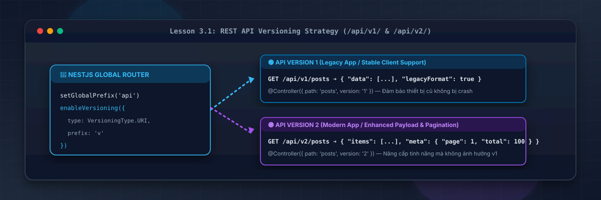
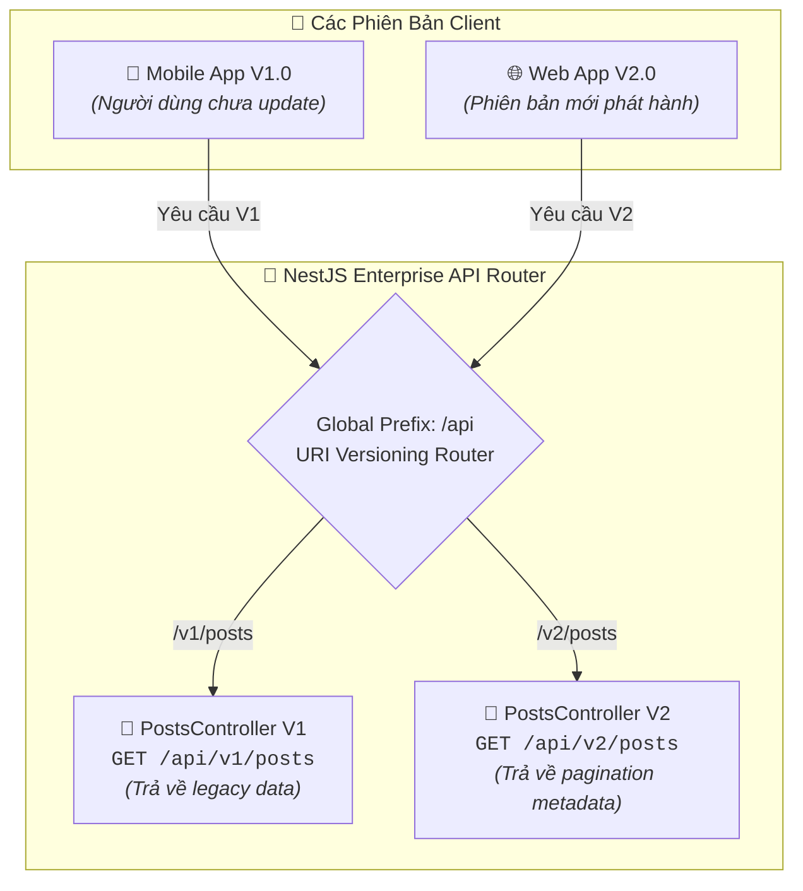
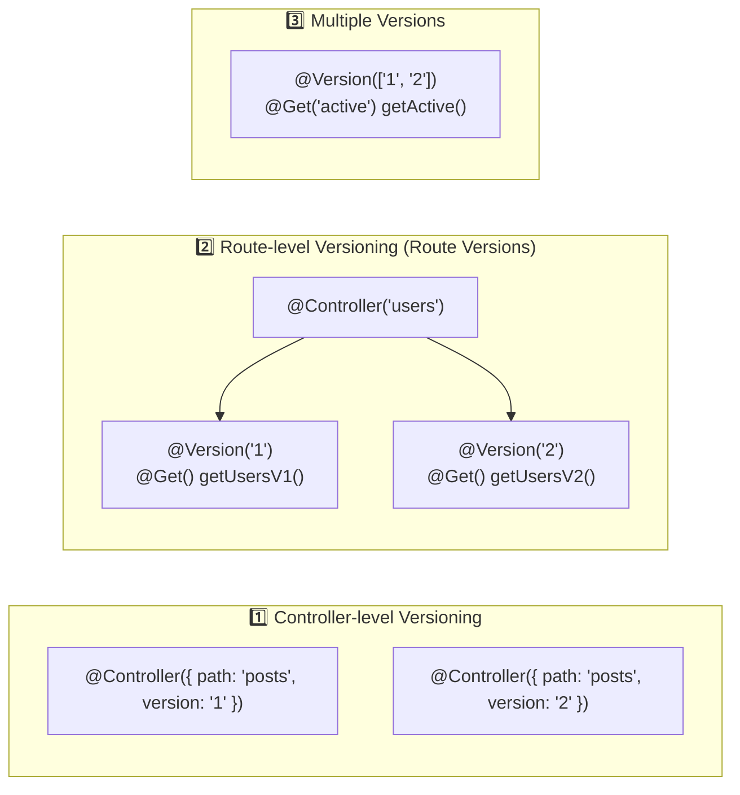

# Lesson 3.1: REST API Versioning — Quản Lý Phiên Bản API Chuẩn Enterprise Trong NestJS

<p align="center">
  
  
  
  
  
</p>

<p align="center">
  
</p>

---

> [!NOTE]
> ⏱️ **Thời lượng dự kiến:** 12 – 15 phút  
> 🎯 **Mục tiêu bài học:** Thấu hiểu tầm quan trọng của việc quản lý phiên bản API (API Versioning) trong hệ thống Enterprise để tránh gây vỡ ứng dụng (Breaking Changes); phân biệt các chiến lược Versioning chính (URI, Header, Media Type); tự tay cấu hình URI Versioning toàn cục (`/api/v1/...`) với NestJS `enableVersioning()`; làm chủ 3 cấp độ phân chia phiên bản: **Controller-level**, **Route-level (Route versions với `@Version()`)** và **Multiple versions (`['1', '2']`)**; thực hành kịch bản kiểm thử đảm bảo tính tương thích ngược (Backward Compatibility) giữa các phiên bản app Mobile / Web khác nhau.

---

## 1. Tại Sao API Versioning Là Bắt Buộc Trong Sản Phẩm Thực Tế?

### 💡 Ẩn Dụ Thực Tế: Câu Chuyện Ổ Cắm Điện & Ứng Dụng Mobile Đã Cài Đặt

Hãy tưởng tượng ứng dụng Backend NestJS của bạn đang phục vụ **100.000 người dùng Mobile App** (iOS & Android):

- **Ngày 1:** Bạn phát hành API v1 trả về thông tin người dùng với trường `fullName`. Người dùng tải app từ App Store và chạy bình thường.
- **Ngày 30:** Đội ngũ sản xuất quyết định tái cấu trúc CSDL, tách `fullName` thành `firstName` và `lastName` (_Breaking Change_).
- **Thảm họa xảy ra:** Nếu bạn sửa trực tiếp API cũ mà **KHÔNG dùng Versioning**, 100.000 người dùng chưa kịp ấn nút "Cập nhật ứng dụng" trên App Store sẽ bị vỡ giao diện (Crash App) vì ứng dụng cũ không tìm thấy trường `fullName`!



---

### 🔹 Khái Niệm Breaking Changes vs Non-Breaking Changes

| Loại thay đổi           | Định nghĩa                                                                      | Ảnh hưởng đến Client | Giải pháp xử lý                          |
| :---------------------- | :------------------------------------------------------------------------------ | :------------------: | :--------------------------------------- |
| **Non-Breaking Change** | Bổ sung thêm trường mới vào JSON, thêm Endpoint mới                             |  🟢 Không vỡ Client  | Giữ nguyên phiên bản API hiện tại (`v1`) |
| **Breaking Change**     | Đổi tên/xóa trường dữ liệu, đổi kiểu dữ liệu (String ➔ Number), đổi Status Code |  🔴 Vỡ ứng dụng cũ   | **Bắt buộc tạo Version mới (`v2`)**      |

---

## 2. So Sánh Các Chiến Lược API Versioning Trong NestJS

NestJS hỗ trợ sẵn 4 chiến lược Versioning phổ biến thông qua enum `VersioningType`:

### 📋 Bảng So Sánh Các Chiến Lược Versioning:

| Chiến lược                         | Cú pháp ví dụ Request                               | Định dạng NestJS Enum       | Ưu điểm & Trường hợp sử dụng                                                |
| :--------------------------------- | :-------------------------------------------------- | :-------------------------- | :-------------------------------------------------------------------------- |
| **URI Versioning** _(Khuyên dùng)_ | `GET /api/v1/posts`                                 | `VersioningType.URI`        | **Rõ ràng, dễ test bằng trình duyệt/Postman, chuẩn RESTful phổ biến nhất.** |
| **Header Versioning**              | `GET /api/posts`<br/>`X-API-Version: 1`             | `VersioningType.HEADER`     | Giữ URL sạch sẽ, thích hợp cho hệ thống Microservices nội bộ.               |
| **Media Type (Accept)**            | `GET /api/posts`<br/>`Accept: application/json;v=1` | `VersioningType.MEDIA_TYPE` | Chuẩn RESTful thuần túy (Content Negotiation).                              |
| **Custom Versioning**              | Tùy biến từ Query parameter hay Cookie              | `VersioningType.CUSTOM`     | Linh hoạt khi cần đọc phiên bản từ Token hoặc Session đặc thù.              |

---

## 3. Hướng Dẫn Thực Hành Step-by-Step — Cấu Hình URI Versioning Trong NestJS

### 📌 Bước 1: Khởi Tạo Prefix Toàn Cục & Cấu Hình Versioning Trong `main.ts`

Mở tệp `src/main.ts` và cấu hình bộ đôi `setGlobalPrefix` & `enableVersioning`:

📄 **`src/main.ts`**

```typescript
import { VersioningType } from '@nestjs/common';
import { NestFactory } from '@nestjs/core';
import { AppModule } from './app.module';

async function bootstrap() {
  const app = await NestFactory.create(AppModule);

  // 1. Cấu hình Global Prefix cho tất cả REST API
  app.setGlobalPrefix('api');

  // 2. Kích hoạt URI Versioning (/api/v1/..., /api/v2/...)
  app.enableVersioning({
    type: VersioningType.URI,
    prefix: 'v',
    defaultVersion: '1', // Mặc định các Controller/Route không khai báo phiên bản sẽ là v1
  });

  await app.listen(3000);
  console.log(`🚀 Server running on: http://localhost:3000/api/v1`);
}
bootstrap();
```

---

### 📌 Bước 2: Kỹ Thuật Gán Version (Controller-level vs Route-level vs Multiple Versions)

Trong NestJS, bạn có thể áp dụng Versioning linh hoạt ở 3 cấp độ khác nhau tùy theo kiến trúc và mức độ thay đổi của API:



---

#### 🔹 Cách 1: Controller-level Versioning (Tách Controller riêng cho từng phiên bản)

_Trường hợp áp dụng:_ Khi cấu hình response hoặc nghiệp vụ giữa các phiên bản thay đổi diện rộng (toàn bộ Controller).

1. Controller cho Version 1:

📄 **`src/posts/posts-v1.controller.ts`**

```typescript
import { Controller, Get } from '@nestjs/common';

@Controller({
  path: 'posts',
  version: '1', // Route: GET /api/v1/posts
})
export class PostsV1Controller {
  @Get()
  getPostsV1() {
    return [
      { id: '1', title: 'Bài viết NestJS v1', author: 'Thành Đỗ' },
      { id: '2', title: 'Hướng dẫn Versioning v1', author: 'NestJS Team' },
    ];
  }
}
```

2. Controller cho Version 2:

📄 **`src/posts/posts-v2.controller.ts`**

```typescript
import { Controller, Get } from '@nestjs/common';

@Controller({
  path: 'posts',
  version: '2', // Route: GET /api/v2/posts
})
export class PostsV2Controller {
  @Get()
  getPostsV2() {
    return {
      items: [
        {
          id: '1',
          title: 'Bài viết NestJS v2',
          author: 'Thành Đỗ',
          views: 1500,
        },
        {
          id: '2',
          title: 'Hướng dẫn Versioning v2',
          author: 'NestJS Team',
          views: 3200,
        },
      ],
      meta: {
        page: 1,
        limit: 10,
        totalItems: 2,
        totalPages: 1,
      },
    };
  }
}
```

---

#### 🔹 Cách 2: Route-level Versioning / Route Versions (Gán `@Version()` ở từng Method trong cùng 1 Controller)

_Trường hợp áp dụng:_ Khi một Controller chỉ có **1-2 endpoint cần nâng cấp lên `v2`**, còn các endpoint khác giữ nguyên. Giúp tránh việc phải tạo lại một Controller mới hoàn toàn.

> [!IMPORTANT]
> **Decorator `@Version()`:** Được import trực tiếp từ `@nestjs/common` và gắn phía trên từng phương thức xử lý (Route Handler). Nó sẽ ghi đè hoặc thiết lập phiên bản riêng cho đúng Route đó.

📄 **`src/users/users.controller.ts`**

```typescript
import { Controller, Get, Version } from '@nestjs/common';

@Controller('users')
export class UsersController {
  // Route Version 1: GET /api/v1/users
  @Version('1')
  @Get()
  getUsersV1() {
    return [{ id: '1', username: 'alex', fullName: 'Alex Johnson' }];
  }

  // Route Version 2: GET /api/v2/users (Trả về dữ liệu đã tái cấu trúc)
  @Version('2')
  @Get()
  getUsersV2() {
    return {
      items: [
        { id: '1', username: 'alex', firstName: 'Alex', lastName: 'Johnson' },
      ],
      totalItems: 1,
    };
  }
}
```

---

#### 🔹 Cách 3: Multiple Versions (Gán mảng phiên bản `['1', '2']`)

_Trường hợp áp dụng:_ Khi một Endpoint giữ nguyên logic và cấu hình response trên **nhiều phiên bản cùng lúc** (ví dụ `v1` và `v2` dùng chung logic, không cần nhân bản code).

1. **Ở cấp Route Method:**

📄 **`src/users/users.controller.ts`**

```typescript
import { Controller, Get, Version } from '@nestjs/common';

@Controller('users')
export class UsersController {
  // Phục vụ ĐỒNG THỜI cả GET /api/v1/users/active lẫn GET /api/v2/users/active
  @Version(['1', '2'])
  @Get('active')
  getActiveUsers() {
    return {
      status: 'success',
      activeUsersCount: 150,
    };
  }
}
```

2. **Ở cấp Controller:**

📄 **`src/analytics/analytics.controller.ts`**

```typescript
import { Controller, Get } from '@nestjs/common';

// Tất cả các Route trong Controller này đều đáp ứng cho cả /api/v1/analytics và /api/v2/analytics
@Controller({
  path: 'analytics',
  version: ['1', '2'],
})
export class AnalyticsController {
  @Get('summary')
  getSummary() {
    return { status: 'ok', views: 9999 };
  }
}
```

---

### 📌 Bước 3: Đăng Ký Các Controller Vào Module

📄 **`src/app.module.ts`**

```typescript
import { Module } from '@nestjs/common';
import { PostsV1Controller } from './posts/posts-v1.controller';
import { PostsV2Controller } from './posts/posts-v2.controller';
import { UsersController } from './users/users.controller';
import { AnalyticsController } from './analytics/analytics.controller';

@Module({
  controllers: [
    PostsV1Controller,
    PostsV2Controller,
    UsersController,
    AnalyticsController,
  ],
})
export class AppModule {}
```

> [!TIP]
> **Kỹ thuật nâng cao — Version Neutral:** Nếu có một Endpoint giữ nguyên hành vi ở MỌI phiên bản kể cả khi client gọi không kèm version hoặc gọi version bất kỳ (như API Healthcheck `/api/health`), bạn có thể dùng hằng số `VERSION_NEUTRAL`:
>
> ```typescript
> import { Controller, Get, VERSION_NEUTRAL } from '@nestjs/common';
>
> @Controller({ path: 'health', version: VERSION_NEUTRAL })
> export class HealthController {
>   @Get()
>   check() {
>     return { status: 'healthy', uptime: process.uptime() };
>   }
> }
> ```

---

## 4. Kịch Bản Kiểm Tra & Thử Nghiệm (Hands-on Lab)

### 🟢 Kịch Bản 1: Thành Công — Kiểm Thử Controller-level & Route-level Versioning

Mở Terminal và thực hiện các câu lệnh cURL tới ứng dụng NestJS đang chạy:

#### 1. Kiểm thử Controller-level Versioning (`/api/v1/posts` & `/api/v2/posts`):

```bash
curl -X GET http://localhost:3000/api/v1/posts
curl -X GET http://localhost:3000/api/v2/posts
```

📥 **Phản hồi HTTP trả về cho `v1` (Legacy Format):**

```json
[
  { "id": "1", "title": "Bài viết NestJS v1", "author": "Thành Đỗ" },
  { "id": "2", "title": "Hướng dẫn Versioning v1", "author": "NestJS Team" }
]
```

📥 **Phản hồi HTTP trả về cho `v2` (Enhanced Format):**

```json
{
  "items": [
    {
      "id": "1",
      "title": "Bài viết NestJS v2",
      "author": "Thành Đỗ",
      "views": 1500
    },
    {
      "id": "2",
      "title": "Hướng dẫn Versioning v2",
      "author": "NestJS Team",
      "views": 3200
    }
  ],
  "meta": { "page": 1, "limit": 10, "totalItems": 2, "totalPages": 1 }
}
```

---

#### 2. Kiểm thử Route-level Versioning (`@Version()`) & Multiple Versions (`/api/v1/users` & `/api/v2/users`):

```bash
# Gọi Route Version 1:
curl -X GET http://localhost:3000/api/v1/users

# Gọi Route Version 2:
curl -X GET http://localhost:3000/api/v2/users

# Gọi Route Multiple Versions (Thử với v1 và v2 đều hoạt động):
curl -X GET http://localhost:3000/api/v1/users/active
curl -X GET http://localhost:3000/api/v2/users/active
```

📥 **Phản hồi HTTP cho `GET /api/v1/users/active` & `GET /api/v2/users/active`:**

```json
{
  "status": "success",
  "activeUsersCount": 150
}
```

✅ **Kết quả:** Cả Controller-level, Route-level và Multiple Versions đều hoạt động chính xác và độc lập trên cùng một Server!

---

### 🔴 Kịch Bản 2: Kiểm Thử Lỗi — Gọi Sai Prefix Hoặc Version Không Tồn Tại

Thử gửi Yêu cầu tới đường dẫn không hợp lệ (ví dụ gọi version `v99` chưa định nghĩa):

```bash
curl -X GET http://localhost:3000/api/v99/posts
```

📥 **Phản hồi HTTP nhận được từ Server:**

```json
HTTP/1.1 404 Not Found
Content-Type: application/json

{
  "message": "Cannot GET /api/v99/posts",
  "error": "Not Found",
  "statusCode": 404
}
```

✅ **Kết quả:** NestJS Router tự động bảo vệ hệ thống, ngăn chặn các truy vấn vào phiên bản không tồn tại.

---

## 5. Tổng Kết Bài Học & Checklist Ghi Nhớ

```mermaid
mindmap
  root(("API Versioning in NestJS"))
    "Tầm quan trọng"
      "Tránh Breaking Changes"
      "Hỗ trợ Backward Compatibility"
    "Các Chiến lược"
      "URI Versioning (Khuyên dùng)"
      "Header Versioning"
      "Media Type Versioning"
    "Cấu hình NestJS"
      "setGlobalPrefix('api')"
      "enableVersioning({ type: URI })"
      "defaultVersion: '1'"
    "Các Cấp Độ Gán Version"
      "Controller Level: @Controller({ version: '1' })"
      "Route Level (Route Versions): @Version('1') / @Version('2')"
      "Multiple Versions: @Version(['1', '2'])"
      "Version Neutral: VERSION_NEUTRAL"
```

### ✅ Checklist Ghi Nhớ Bài Học:

- [x] Phân biệt được Breaking Change và Non-breaking Change.
- [x] Thấu hiểu lý do URI Versioning (`/api/v1/...`) là chuẩn mực được ưa chuộng nhất trong thiết kế REST API.
- [x] Cấu hình thành công `app.setGlobalPrefix('api')` và `app.enableVersioning()` trong `main.ts`.
- [x] Phân biệt và ứng dụng linh hoạt **Controller-level Versioning** và **Route-level Versioning (Route versions)** sử dụng `@Version()`.
- [x] Sử dụng mảng Version `['1', '2']` cho các Route phục vụ nhiều phiên bản và `VERSION_NEUTRAL` cho API không phụ thuộc phiên bản.
- [x] Thử nghiệm thành công cURL nhận về dữ liệu chuẩn xác cho mọi kịch bản phiên bản API.

---

👉 **Bài tiếp theo:** [Lesson 3.2: Validation — DTOs & ValidationPipe Toàn Cục Với class-validator](../lesson-3.2/lesson-3.2.md)
