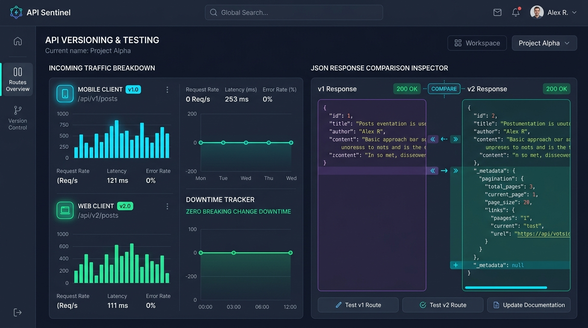
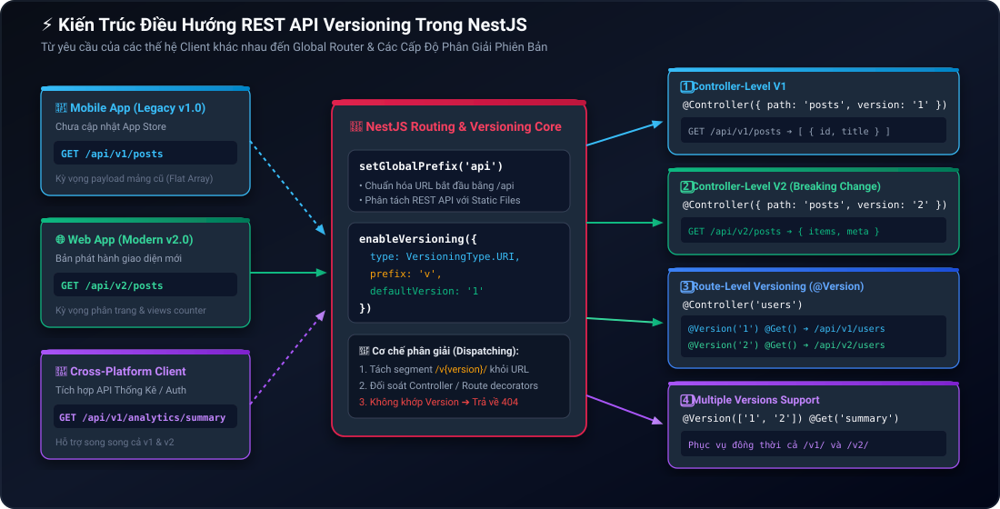
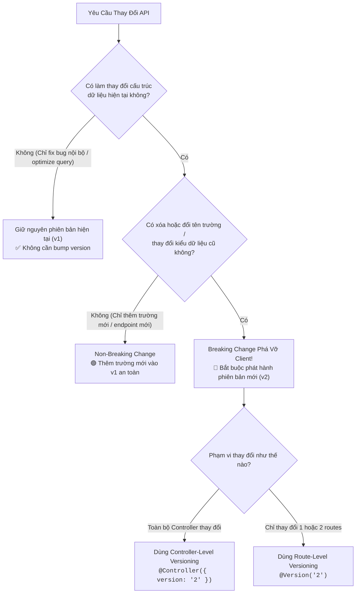

# Lesson 3.1: REST API Versioning — Quản Lý Phiên Bản API Chuẩn Enterprise Trong NestJS

<p align="center">
  
  
  
  
  
</p>

<p align="center">
  
</p>

---

> [!NOTE]
> ⏱️ **Thời lượng:** 12 – 15 phút thực chiến  
> 🎯 **Mục tiêu:** Thấu hiểu tầm quan trọng sống còn của việc quản lý phiên bản API (API Versioning) trong các hệ sinh thái đa nền tảng (Web, iOS, Android, Đối tác B2B); phân biệt rõ ràng giữa **Breaking Changes** và **Non-Breaking Changes**; tự tay cấu hình URI Versioning toàn cục (`/api/v1/...`) với `enableVersioning()`; làm chủ trọn vẹn 4 kỹ thuật định tuyến phiên bản trong NestJS: **Controller-level**, **Route-level (`@Version()`)**, **Multiple versions (`['1', '2']`)** và **Version Neutral (`VERSION_NEUTRAL`)**; bảo toàn 100% tính tương thích ngược (Backward Compatibility) trong môi trường sản phẩm thực tế.

---

## 1. Trực Quan Hóa Bài Toán: Hệ Sinh Thái Đa Nền Tảng & Rủi Ro Phá Vỡ Hợp Đồng (Breaking Changes)

### 📱 Sản Phẩm Thực Tế & Dashboard Giám Sát Versioning

Trong môi trường Enterprise thực tế, máy chủ backend NestJS không bao giờ phục vụ duy nhất một trình duyệt web. Nó cùng lúc cung cấp dữ liệu cho ứng dụng di động iOS/Android, Single Page Application (SPA), ứng dụng nội bộ của admin và hệ thống tích hợp của các đối tác bên thứ ba:

<p align="center">
  
</p>

Nhìn vào bảng điều khiển giám sát API ở trên, bạn sẽ nhận thấy bài toán thực tế mà mọi kỹ sư backend phải đối mặt:

- 📱 **Mobile Client (v1.0):** Hàng chục ngàn người dùng vẫn đang sử dụng phiên bản ứng dụng cũ được cài từ App Store từ nhiều tháng trước, tiếp tục gọi vào `GET /api/v1/posts` và kỳ vọng nhận về cấu trúc dữ liệu phẳng đơn giản.
- 🌐 **Web Client (v2.0):** Phiên bản web hiện đại vừa được triển khai, gọi vào `GET /api/v2/posts` để khai thác hệ thống phân trang (pagination metadata) và thông số lượt xem bài viết.
- 🛡️ **Zero Breaking Change Downtime:** Cả hai thế hệ ứng dụng cùng hoạt động song song, mượt mà trên cùng một hệ thống NestJS mà không bên nào bị gián đoạn hay lỗi cú pháp.

---

### 🔥 Góc Thực Chiến: 3 "Thảm Họa Đau Thương" Khi Bỏ Quên API Versioning

> [!CAUTION]
>
> 1. **Thảm họa Crash App hàng loạt lúc 8h sáng:** Đội ngũ Backend đổi tên trường `fullName` thành `firstName` và `lastName` để chuẩn hóa CSDL. Ngay lập tức, 50.000 người dùng mở app Mobile bị crash văng ra ngoài màn hình chính vì ứng dụng cũ không tìm thấy key `fullName`!
> 2. **Bẫy trễ hạn App Store Review:** Đội ngũ Mobile không thể cập nhật ứng dụng tức thì như Web. Bản cập nhật sửa lỗi phải chờ Apple / Google kiểm duyệt từ 24h đến 72h. Chưa kể, một tỷ lệ lớn người dùng tắt tính năng "Tự động cập nhật ứng dụng", khiến phiên bản client cũ tồn tại ngoài thị trường suốt nhiều năm.
> 3. **Vỡ hợp đồng tích hợp đối tác B2B (API Contract Breach):** Các đối tác tích hợp cổng thanh toán hoặc hệ sinh thái bên ngoài phụ thuộc vào JSON schema cố định của bạn. Việc thay đổi định dạng response đột ngột sẽ lập tức làm gián đoạn dòng tiền và vi phạm cam kết chất lượng dịch vụ (SLA).

---

### ⚖️ Ma Trận Phân Biệt: Breaking Changes vs Non-Breaking Changes

Trước khi viết bất kỳ dòng code nào, kỹ sư backend cần có phản xạ phân loại thay đổi theo bảng chuẩn sau:

| Tiêu chí               | 🟢 Non-Breaking Change (An Toàn)                                                                                                                                | 🔴 Breaking Change (Nguy Cấp)                                                                                                                                                                                                           |
| :--------------------- | :-------------------------------------------------------------------------------------------------------------------------------------------------------------- | :-------------------------------------------------------------------------------------------------------------------------------------------------------------------------------------------------------------------------------------- |
| **Bản chất**           | Mở rộng tính năng, không làm ảnh hưởng đến dữ liệu cũ mà client đang đọc.                                                                                       | Thay đổi cấu trúc, kiểu dữ liệu hoặc quy ước giao tiếp đã cam kết trước đó.                                                                                                                                                             |
| **Ví dụ thực tế**      | • Bổ sung trường mới `avatarUrl` vào JSON User.<br/>• Tạo thêm Endpoint mới `POST /api/v1/posts/bookmark`.<br/>• Thêm Query param tùy chọn `?sortBy=createdAt`. | • Đổi tên `title` thành `postTitle`.<br/>• Đổi kiểu dữ liệu từ `id: "123"` (String) sang `id: 123` (Number).<br/>• Xóa bỏ một trường dữ liệu trong response.<br/>• Thay đổi HTTP Status Code thành công từ `200 OK` sang `201 Created`. |
| **Hành động kỹ thuật** | Giữ nguyên phiên bản hiện tại (`v1`).                                                                                                                           | **Bắt buộc phát hành phiên bản mới (`v2`) song song.**                                                                                                                                                                                  |

---

## 2. Kiến Trúc Điều Hướng & So Sánh Các Chiến Lược Versioning

### 🧩 Sơ Đồ Kiến Trúc Điều Hướng Request Trong NestJS

Dưới đây là sơ đồ chi tiết về cách thức NestJS Core tiếp nhận các HTTP Request từ các thế hệ client khác nhau, phân giải tiền tố URI và chuyển tiếp tới đúng Controller/Route Handler tương ứng:

<p align="center">
  
</p>

Kiến trúc này vận hành dựa trên 3 mắt xích chính:

1. **Global Prefix Layer:** Bộ lọc tầng đầu tiên gom toàn bộ REST API dưới tiền tố `/api`, phân biệt rõ với các luồng khác như Static Assets, WebSocket, hay Health Checks.
2. **URI Versioning Router:** Tự động bắt cặp phân đoạn `/v{version}/` trong URL, đối chiếu với Metadata gắn trên các Controller hoặc Method. Nếu không tìm thấy phiên bản khớp, Router sẽ lập tức từ chối với mã phản hồi `404 Not Found`.
3. **Target Handlers:** Các Controller độc lập (`v1`, `v2`) hoặc các Method gắn decorator `@Version()` chịu trách nhiệm xử lý logic nghiệp vụ đặc thù cho từng thế hệ dữ liệu.

---

### 📊 So Sánh 4 Chiến Lược API Versioning Trong NestJS

NestJS cung cấp enum `VersioningType` cho phép linh hoạt lựa chọn chiến lược phù hợp với từng bài toán:

| Chiến lược                                        | Cú pháp ví dụ Request                                      | Định danh NestJS Enum       | Đánh giá & Khuyến nghị sử dụng                                                                                                                                                         |
| :------------------------------------------------ | :--------------------------------------------------------- | :-------------------------- | :------------------------------------------------------------------------------------------------------------------------------------------------------------------------------------- |
| **URI Versioning**<br/>`🏆 Chuẩn mực khuyên dùng` | `GET /api/v1/posts`<br/>`GET /api/v2/posts`                | `VersioningType.URI`        | **Ưu điểm:** Trực quan 100%, dễ kiểm thử trực tiếp trên URL trình duyệt, Postman, Swagger UI; là tiêu chuẩn phổ biến nhất trong các công ty công nghệ lớn (Stripe, Twitter/X, GitHub). |
| **Header Versioning**                             | `GET /api/posts`<br/>`X-API-Version: 1`                    | `VersioningType.HEADER`     | **Ưu điểm:** Giữ URL sạch sẽ, thuận tiện cho hệ thống giao tiếp nội bộ giữa các dịch vụ Microservices. Tuy nhiên khó test nhanh bằng trình duyệt.                                      |
| **Media Type (Accept)**                           | `GET /api/posts`<br/>`Accept: application/vnd.app.v1+json` | `VersioningType.MEDIA_TYPE` | **Ưu điểm:** Chuẩn RESTful học thuật (Content Negotiation). Tuy nhiên phức tạp trong việc cấu hình client và tài liệu hóa Swagger.                                                     |
| **Custom Versioning**                             | Tùy biến đọc từ Session, Token JWT hoặc Cookie             | `VersioningType.CUSTOM`     | **Ưu điểm:** Linh hoạt tuyệt đối khi cần cấp phát phiên bản API theo gói cước (Tier Enterprise vs Free) hoặc qua Feature Flag.                                                         |

---

### 🌳 Cây Quyết Định (Decision Tree): Khi Nào Bắt Buộc Bump Phiên Bản API?



---

## 3. Hướng Dẫn Thực Hành Step-by-Step

### 📂 Cấu Trúc Mã Nguồn Triển Khai

Một kiến trúc chuẩn Enterprise sẽ phân tách các phiên bản API theo bố cục module rõ ràng:

```
src/
├── posts/
│   ├── posts-v1.controller.ts    👈 Controller v1 độc lập (Legacy Payload phẳng)
│   └── posts-v2.controller.ts    👈 Controller v2 tái cấu trúc (Phân trang & Lượt xem)
├── users/
│   └── users.controller.ts       👈 Route-level Versioning dùng @Version('1') & @Version('2')
├── analytics/
│   └── analytics.controller.ts   👈 Multiple Versions phục vụ đồng thời ['1', '2']
├── common/
│   └── health.controller.ts      👈 Version Neutral phục vụ mọi phiên bản với VERSION_NEUTRAL
├── app.module.ts                 👈 Đăng ký toàn bộ danh sách Controllers
└── main.ts                       👈 Cấu hình setGlobalPrefix & enableVersioning
```

---

### 📌 Bước 1: Khởi Tạo Global Prefix & Kích Hoạt URI Versioning Trong `main.ts`

Mở tệp `src/main.ts` và kích hoạt bộ đôi quản lý URL:

📄 **`src/main.ts`**

```typescript
import { VersioningType } from '@nestjs/common';
import { NestFactory } from '@nestjs/core';
import { AppModule } from './app.module';

async function bootstrap() {
  const app = await NestFactory.create(AppModule);

  // 1. Thiết lập tiền tố toàn cục cho toàn bộ REST API
  app.setGlobalPrefix('api');

  // 2. Kích hoạt cơ chế URI Versioning chuẩn hóa (/api/v1/..., /api/v2/...)
  app.enableVersioning({
    type: VersioningType.URI,
    prefix: 'v',
    defaultVersion: '1', // Bất kỳ controller/route nào không khai báo version sẽ tự động nhận v1
  });

  await app.listen(3000);
  console.log(`🚀 API Server đang khởi chạy tại: http://localhost:3000/api/v1`);
}
bootstrap();
```

> [!IMPORTANT]
> **Quy tắc ghép chuỗi URL của NestJS:**  
> `http://localhost:3000` + `/[globalPrefix]` + `/[prefix][version]` + `/[controllerPath]` + `/[routePath]`  
> ➔ Ví dụ: `http://localhost:3000` + `/api` + `/v1` + `/posts` ➔ **`http://localhost:3000/api/v1/posts`**

---

### 📌 Bước 2: Hiện Thực Hóa 4 Cấp Độ Versioning Trong NestJS

#### 🔹 Cấp độ 1: Controller-Level Versioning (Tách Controller riêng biệt)

_Áp dụng khi:_ Mô hình dữ liệu và nghiệp vụ thay đổi diện rộng trên toàn bộ tính năng.

Tạo Controller cho phiên bản cũ v1:

📄 **`src/posts/posts-v1.controller.ts`**

```typescript
import { Controller, Get } from '@nestjs/common';

@Controller({
  path: 'posts',
  version: '1', // Định tuyến URL: GET /api/v1/posts
})
export class PostsV1Controller {
  @Get()
  getPostsV1() {
    // Trả về cấu trúc mảng phẳng legacy cho client cũ
    return [
      { id: '1', title: 'Hướng dẫn cơ bản về NestJS', author: 'Thành Đỗ' },
      {
        id: '2',
        title: 'Kiến trúc Module trong thực tế',
        author: 'NestJS Team',
      },
    ];
  }
}
```

Tạo Controller cho phiên bản mới v2:

📄 **`src/posts/posts-v2.controller.ts`**

```typescript
import { Controller, Get } from '@nestjs/common';

@Controller({
  path: 'posts',
  version: '2', // Định tuyến URL: GET /api/v2/posts
})
export class PostsV2Controller {
  @Get()
  getPostsV2() {
    // Trả về dữ liệu cải tiến kèm phân trang và số liệu views
    return {
      items: [
        {
          id: '1',
          title: 'Hướng dẫn cơ bản về NestJS',
          author: 'Thành Đỗ',
          views: 1250,
        },
        {
          id: '2',
          title: 'Kiến trúc Module trong thực tế',
          author: 'NestJS Team',
          views: 3400,
        },
      ],
      meta: {
        page: 1,
        limit: 10,
        totalItems: 2,
        totalPages: 1,
      },
    };
  }
}
```

---

#### 🔹 Cấp độ 2: Route-Level Versioning (Gán `@Version()` trực tiếp trên Method)

_Áp dụng khi:_ Bạn chỉ cần nâng cấp **1 hoặc 2 endpoint cụ thể**, các endpoint khác trong Controller vẫn giữ nguyên. Kỹ thuật này giúp tránh việc phải duplicate cả Controller.

📄 **`src/users/users.controller.ts`**

```typescript
import { Controller, Get, Version } from '@nestjs/common';

@Controller('users')
export class UsersController {
  // Phiên bản cũ v1: GET /api/v1/users (trả về trường fullName)
  @Version('1')
  @Get()
  getUsersV1() {
    return [{ id: '1', username: 'alex', fullName: 'Alex Johnson' }];
  }

  // Phiên bản mới v2: GET /api/v2/users (tái cấu trúc thành firstName + lastName)
  @Version('2')
  @Get()
  getUsersV2() {
    return {
      items: [
        { id: '1', username: 'alex', firstName: 'Alex', lastName: 'Johnson' },
      ],
      totalItems: 1,
    };
  }
}
```

---

#### 🔹 Cấp độ 3: Multiple Versions Support (Dùng mảng `['1', '2']`)

_Áp dụng khi:_ Một API duy trì cùng một logic và dữ liệu trên **nhiều phiên bản song song**, không cần viết lặp code (tuân thủ nguyên lý DRY - Don't Repeat Yourself).

📄 **`src/analytics/analytics.controller.ts`**

```typescript
import { Controller, Get, Version } from '@nestjs/common';

@Controller('analytics')
export class AnalyticsController {
  // Đáp ứng đồng thời cho cả GET /api/v1/analytics/summary và GET /api/v2/analytics/summary
  @Version(['1', '2'])
  @Get('summary')
  getSummary() {
    return {
      activeUsers: 342,
      totalRequestsToday: 89201,
      systemStatus: 'optimal',
    };
  }
}
```

---

#### 🔹 Cấp độ 4: Version Neutral (Không phụ thuộc phiên bản với `VERSION_NEUTRAL`)

_Áp dụng khi:_ Các endpoint mang tính hạ tầng (như kiểm tra tình trạng máy chủ `Health Check`), cần phản hồi bất kể client gọi kèm phiên bản nào hoặc không truyền phiên bản.

📄 **`src/shared/health.controller.ts`**

```typescript
import { Controller, Get, VERSION_NEUTRAL } from '@nestjs/common';

@Controller({
  path: 'health',
  version: VERSION_NEUTRAL, // Chấp nhận cả /api/health, /api/v1/health, /api/v2/health,...
})
export class HealthController {
  @Get()
  checkHealth() {
    return {
      status: 'healthy',
      timestamp: new Date().toISOString(),
      uptimeSeconds: Math.floor(process.uptime()),
    };
  }
}
```

---

### 📌 Bước 3: Đăng Ký Tất Cả Controllers Trong `app.module.ts`

Sau khi hoàn tất định nghĩa các controller, gom cụm đăng ký chúng vào Root Module:

📄 **`src/app.module.ts`**

```typescript
import { Module } from '@nestjs/common';
import { PostsV1Controller } from './posts/posts-v1.controller';
import { PostsV2Controller } from './posts/posts-v2.controller';
import { UsersController } from './users/users.controller';
import { AnalyticsController } from './analytics/analytics.controller';
import { HealthController } from './common/health.controller';

@Module({
  controllers: [
    PostsV1Controller,
    PostsV2Controller,
    UsersController,
    AnalyticsController,
    HealthController,
  ],
})
export class AppModule {}
```

---

### 💡 Pro-Tip Thực Chiến: Chiến Lược Khai Tử API (API Deprecation Strategy — RFC 8594)

> [!TIP]
> **Làm thế nào để thông báo client ngừng dùng v1 một cách văn minh?**  
> Khi bạn quyết định phát hành `v2` và muốn khai tử `v1` sau 6 tháng, **tuyệt đối không xóa code v1 ngay lập tức**. Hãy đính kèm các HTTP Response Headers theo chuẩn **RFC 8594**:
>
> ```http
> Deprecation: @1735689600
> Sunset: Wed, 31 Dec 2026 23:59:59 GMT
> Link: <https://api.domain.com/docs/v2-migration>; rel="deprecation"
> ```
>
> Nhờ đó, các hệ thống client giám sát tự động (Monitoring/Log Analytics) sẽ phát hiện cảnh báo và thông báo cho đội ngũ lập trình viên di động/đối tác lên kế hoạch nâng cấp trước ngày hết hạn (Sunset).

---

## 4. Kịch Bản Kiểm Tra & Thử Nghiệm (Hands-on Lab)

Hãy khởi động ứng dụng NestJS:

```bash
pnpm start:dev
```

Mở một cửa sổ Terminal mới và thực hiện kiểm thử theo các kịch bản thực chiến bên dưới:

---

### 🟢 Kịch Bản 1: Thành Công — Bảo Toàn Tính Tương Thích Ngược (Backward Compatibility)

#### 1. Kiểm thử Controller-level Versioning (`PostsController`):

Thực thi lệnh cURL gọi phiên bản v1:

```bash
curl -i -X GET http://localhost:3000/api/v1/posts
```

📥 **Phản hồi HTTP từ Server (`v1` — Legacy Array Format):**

```json
HTTP/1.1 200 OK
Content-Type: application/json; charset=utf-8

[
  { "id": "1", "title": "Hướng dẫn cơ bản về NestJS", "author": "Thành Đỗ" },
  { "id": "2", "title": "Kiến trúc Module trong thực tế", "author": "NestJS Team" }
]
```

Thực thi lệnh cURL gọi phiên bản mới v2:

```bash
curl -i -X GET http://localhost:3000/api/v2/posts
```

📥 **Phản hồi HTTP từ Server (`v2` — Enhanced Object with Pagination):**

```json
HTTP/1.1 200 OK
Content-Type: application/json; charset=utf-8

{
  "items": [
    { "id": "1", "title": "Hướng dẫn cơ bản về NestJS", "author": "Thành Đỗ", "views": 1250 },
    { "id": "2", "title": "Kiến trúc Module trong thực tế", "author": "NestJS Team", "views": 3400 }
  ],
  "meta": {
    "page": 1,
    "limit": 10,
    "totalItems": 2,
    "totalPages": 1
  }
}
```

> [!NOTE]
> **Quan sát kết quả:** Cả 2 URL cùng tồn tại song song, trả về dữ liệu chuẩn xác cho từng nhóm thiết bị mà không có sự xung đột nào.

---

#### 2. Kiểm thử Route-level Versioning (`UsersController`):

```bash
# Thử nghiệm v1:
curl -s http://localhost:3000/api/v1/users

# Thử nghiệm v2:
curl -s http://localhost:3000/api/v2/users
```

📥 **So sánh nhanh dữ liệu trả về:**

- Với `v1`: Trả về `[{ "id": "1", "username": "alex", "fullName": "Alex Johnson" }]`
- Với `v2`: Trả về `{"items": [{"id": "1", "username": "alex", "firstName": "Alex", "lastName": "Johnson"}], "totalItems": 1}`

---

#### 3. Kiểm thử Multiple Versions & Version Neutral:

```bash
# Multiple Versions: gọi v1 và v2 đều nhận kết quả y hệt
curl -s http://localhost:3000/api/v1/analytics/summary
curl -s http://localhost:3000/api/v2/analytics/summary

# Version Neutral: gọi không cần version
curl -s http://localhost:3000/api/health
```

📥 **Phản hồi từ `GET /api/health`:**

```json
{
  "status": "healthy",
  "timestamp": "2026-09-08T16:30:00.000Z",
  "uptimeSeconds": 48
}
```

---

### 🔴 Kịch Bản 2: Kiểm Thử Chặn Lỗi — Gọi Sai Phiên Bản Hoặc Thiếu Prefix

Thử gửi Request tới một phiên bản API hoàn toàn không tồn tại (ví dụ `v99`):

```bash
curl -i -X GET http://localhost:3000/api/v99/posts
```

📥 **Phản hồi HTTP từ Server:**

```json
HTTP/1.1 404 Not Found
Content-Type: application/json; charset=utf-8

{
  "message": "Cannot GET /api/v99/posts",
  "error": "Not Found",
  "statusCode": 404
}
```

Thử gửi Request bỏ quên tiền tố `/api`:

```bash
curl -i -X GET http://localhost:3000/v1/posts
```

📥 **Phản hồi HTTP từ Server:**

```json
HTTP/1.1 404 Not Found
Content-Type: application/json; charset=utf-8

{
  "message": "Cannot GET /v1/posts",
  "error": "Not Found",
  "statusCode": 404
}
```

✅ **Kết luận bài kiểm tra:** NestJS Router hoạt động như một bức tường lửa thông minh: định tuyến chuẩn xác request hợp lệ, đồng thời triệt tiêu các truy vấn dị dạng với mã phản hồi `404 Not Found`.

---

## 5. Tổng Kết Bài Học & Checklist Ghi Nhớ

```mermaid
mindmap
  root(("REST API Versioning in NestJS"))
    "Bản chất cốt lõi"
      "Tránh thảm họa Crash App"
      "Bảo toàn Backward Compatibility"
      "Phân biệt Breaking vs Non-Breaking Changes"
    "Các Chiến lược Phổ biến"
      "URI Versioning (Khuyên dùng chuẩn Enterprise)"
      "Header Versioning"
      "Media Type Versioning"
    "Cấu hình Cốt lõi tại main.ts"
      "setGlobalPrefix('api')"
      "enableVersioning({ type: URI, prefix: 'v' })"
      "defaultVersion: '1'"
    "4 Kỹ thuật Gán Version"
      "Controller-Level: @Controller({ version: '1' })"
      "Route-Level: @Version('1') / @Version('2')"
      "Multiple Versions: @Version(['1', '2'])"
      "Version Neutral: VERSION_NEUTRAL"
    "Quy trình Khai tử API"
      "Header Deprecation & Sunset (RFC 8594)"
      "Lộ trình di dời Client tối thiểu 6 tháng"
```

### ✅ Checklist Ghi Nhớ Bài Học:

- [x] Nắm rõ sự khác biệt bản chất giữa **Breaking Change** (bắt buộc bump version) và **Non-Breaking Change** (mở rộng an toàn trên version hiện tại).
- [x] Hiểu rõ lý do vì sao **URI Versioning** (`/api/v1/...`) là tiêu chuẩn trực quan, ổn định và được tin dùng nhất trong các hệ thống lớn.
- [x] Tự tay thiết lập thành thạo `app.setGlobalPrefix('api')` và `app.enableVersioning()` trong `main.ts`.
- [x] Phân biệt chính xác trường hợp áp dụng giữa **Controller-Level Versioning** (thay đổi diện rộng) và **Route-Level Versioning** (`@Version()`, can thiệp cục bộ).
- [x] Ứng dụng thành thạo mảng phiên bản `['1', '2']` nhằm tối ưu tái sử dụng mã nguồn và `VERSION_NEUTRAL` cho các dịch vụ kiểm tra sức khỏe hệ thống.
- [x] Hiểu cách thông báo lộ trình khai tử API chuyên nghiệp qua các HTTP Header `Sunset` & `Deprecation` theo chuẩn RFC 8594.

---

👉 **Bài tiếp theo:** [Lesson 3.2: Validation — DTOs & ValidationPipe Toàn Cục Với class-validator](../lesson-3.2/lesson-3.2.md)
