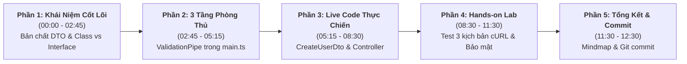
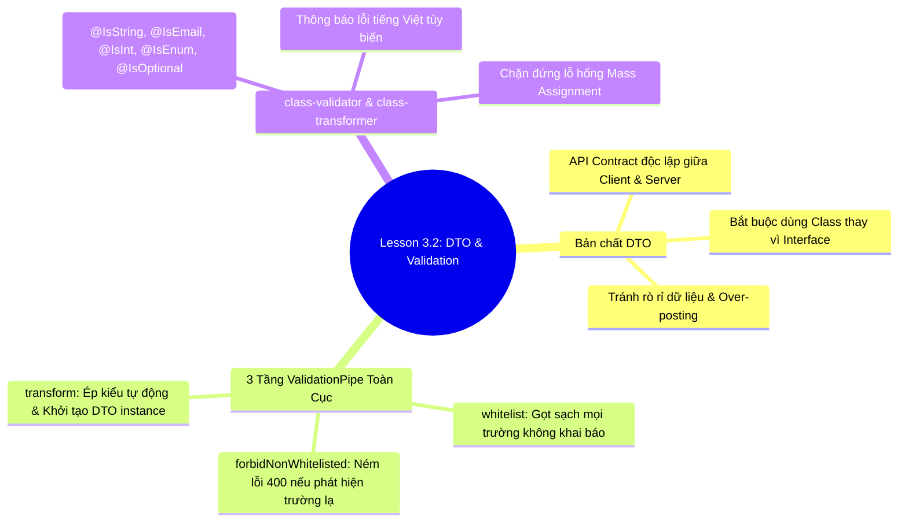

# Kịch Bản Giảng Dạy (Instructor Script)

## Lesson 3.2: DTO & Validation — Chuẩn Hóa Dữ Liệu & Bộ Lọc An Ninh Toàn Cục Với class-validator

<p align="center">
  
  
  
  
  
</p>

<p align="center">
  
</p>

---

## 🎯 Thông Tin Tổng Quan Bài Học

- **Bài học:** Lesson 3.2: DTO & Validation — Chuẩn Hóa Dữ Liệu & Bộ Lọc An Ninh Toàn Cục Với class-validator
- **Khóa học:** NestJS Thực Chiến: Xây Dựng API Từ Cơ Bản Đến Nâng Cao
- **Thời lượng dự kiến:** 11 – 13 phút thực chiến
- **Mục tiêu cốt lõi:**
  1. Thấu hiểu bản chất **DTO (Data Transfer Object)** là bản hợp đồng dữ liệu (API Contract) độc lập và lý do bắt buộc dùng **Class** thay vì **Interface** ở Runtime.
  2. Nắm vững cơ chế và cấu hình thành thạo **3 tầng phòng thủ** của `ValidationPipe` toàn cục trong `src/main.ts` (`whitelist`, `forbidNonWhitelisted`, `transform`).
  3. Live-code 100% xây dựng `CreateUserDto` với đầy đủ các validation decorators thông dụng và thông báo lỗi tiếng Việt thân thiện.
  4. Thực hiện Hands-on Lab kiểm thử 3 kịch bản: Tự động ép kiểu primitives, Bắt lỗi vi phạm ràng buộc, và Triệt tiêu lỗ hổng **Mass Assignment**.
- **Chuẩn bị trước khi quay (Instructor Pre-recording Checklist):**
  - [x] Mở sẵn dự án trong VS Code với giao diện sạch, font chữ JetBrains Mono size 16-18 để học viên dễ đọc trên mobile/desktop.
  - [x] Đảm bảo PostgreSQL & Docker container đang chạy nền nếu cần kiểm tra cơ sở dữ liệu.
  - [x] Chuẩn bị sẵn 2 tab Terminal: Tab 1 chạy `pnpm start:dev`, Tab 2 dùng để gõ lệnh cURL hoặc mở Thunder Client/Postman.
  - [x] Tắt toàn bộ thông báo hệ thống (Do Not Disturb), kiểm tra âm lượng micro và chất lượng webcam góc màn hình.

---

## ⏱️ Sơ Đồ Phân Bổ Thời Gian (Timeline Roadmap)



---

## 🎬 Chi Tiết Kịch Bản Giảng Dạy Từng Phân Cảnh (Scene-by-Scene)

---

### PHẦN 1: KHỞI ĐỘNG & BẢN CHẤT DTO (00:00 – 02:45)

#### ⏱️ Phút 00:00 - 01:15 | Mở Đầu Cuốn Hút & Đặt Vấn Đề

- 🎬 **Hành động & Màn hình hiển thị (Screen/Visuals):**
  - Xuất hiện webcam giảng viên góc màn hình (hoặc toàn màn hình trong 15 giây đầu), phong thái tự tin, hào hứng.
  - Chiếu Slide Title bài học và Banner Overview `lesson_overview_banner.svg`.
  - Chuyển sang chiếu hình ảnh trực quan [dto_concept_explainer.jpg](./assets/dto_concept_explainer.jpg) minh họa bản hợp đồng dữ liệu giữa Client và Server.

- 🎙️ **Lời thoại Giảng viên (Instructor Dialogue):**
  > "Xin chào tất cả các bạn! Chào mừng các bạn quay trở lại với khóa học **NestJS Thực Chiến: Xây Dựng API Từ Cơ Bản Đến Nâng Cao**!
  >
  > Ở bài học trước, chúng ta đã cấu hình thành công Global API Prefix và URI Versioning để chuẩn hóa cấu trúc URL theo chuẩn RESTful chuyên nghiệp.
  >
  > Hôm nay, chúng ta sẽ bước sang một bài học cực kỳ quan trọng và xuất hiện trong **100% các dự án thực tế**: **Lesson 3.2: DTO & Validation — Chuẩn Hóa Dữ Liệu & Thiết Lập Bộ Lọc An Ninh Toàn Cục Với class-validator**.
  >
  > Hãy tưởng tượng tình huống sau: Client gửi lên server một request tạo tài khoản người dùng. Làm sao backend của chúng ta biết được: email có đúng cú pháp `@` hay không? Tuổi có phải là số nguyên dương hay là số âm? Và quan trọng nhất: làm sao để ngăn kẻ xấu cố tình gửi kèm trường `role: 'SUPER_ADMIN'` để tự nâng quyền quản trị hệ thống?
  >
  > Câu trả lời nằm ở bộ đôi hoàn hảo: **DTO** và **ValidationPipe**!"

---

#### ⏱️ Phút 01:15 - 02:45 | DTO Là Gì & Tại Sao Bắt Buộc Dùng Class Thay Vì Interface?

- 🎬 **Hành động & Màn hình hiển thị (Screen/Visuals):**
  - Chiếu sơ đồ so sánh trực quan [dto_vs_entity_comparison.svg](./assets/dto_vs_entity_comparison.svg).
  - Highlight 3 cột: `TypeScript Interface`, `Database Entity (Prisma)`, và `NestJS DTO Class`.

- 🎙️ **Lời thoại Giảng viên (Instructor Dialogue):**

  > "Đầu tiên, **DTO (Data Transfer Object)** là gì?
  >
  > DTO là một đối tượng thuần túy **chỉ chứa dữ liệu** — không chứa business logic. Nó đóng vai trò như một **bản hợp đồng cam kết (API Contract)** giữa Client và Server. Client muốn gọi API của tôi thì bắt buộc phải tuân theo đúng khuôn mẫu dữ liệu được định nghĩa trong DTO này.
  >
  > Rất nhiều bạn mới làm quen với NestJS thường thắc mắc 2 câu hỏi lớn:
  >
  > **Câu hỏi 1: Tại sao chúng ta không dùng trực tiếp Database Model (như Prisma User Entity) để hứng request cho nhanh?**
  >
  > - Thứ nhất: **Nguy cơ rò rỉ dữ liệu nhạy cảm**. Database Entity thường có các trường bí mật như `passwordHash`, `resetPasswordToken`. Nếu dùng chung, rất dễ vô tình để lộ ra ngoài API response.
  > - Thứ hai: **Nguy cơ bị tấn công Over-posting**. Kẻ xấu có thể gửi kèm các trường nội bộ của database để ghi đè dữ liệu.
  > - Thứ ba: **Nguyên tắc phân tách trách nhiệm (Separation of Concerns)**. DTO phục vụ cho mạng (Network Payload), còn Entity phục vụ lưu trữ đĩa (Database Persistence). Hai tầng này phải hoàn toàn độc lập!
  >
  > **Câu hỏi 2: Đây là câu hỏi phỏng vấn cực kỳ phổ biến: Tại sao trong NestJS, DTO bắt buộc phải là Class mà không dùng TypeScript Interface?**
  >
  > - Hãy nhớ lại nguyên lý hoạt động của TypeScript: **Interface chỉ tồn tại lúc Compile time**. Khi mã nguồn được biên dịch sang JavaScript thuần để chạy trên Node.js runtime, toàn bộ Interface sẽ bị xóa sổ hoàn toàn — thuật ngữ kỹ thuật gọi là **Type Erasure**!
  > - Trong khi đó, **Class là tính năng chuẩn của ES6**, nó tiếp tục tồn tại ở Runtime. Nhờ Class tồn tại ở Runtime, NestJS và thư viện `class-validator` mới có thể đọc metadata của các Decorator để tự động kiểm tra tính hợp lệ của dữ liệu!"

- 💡 **Mẹo sư phạm (Pedagogical Tip):**
  > Nhấn mạnh cụm từ **"Type Erasure"** và sự khác biệt giữa Compile-time và Runtime. Đây là kiến thức nền tảng ăn điểm khi học viên đi phỏng vấn vị trí Backend NodeJS / NestJS.

---

### PHẦN 2: KIẾN TRÚC VALIDATION PIPELINE & CẤU HÌNH MAIN.TS (02:45 – 05:15)

#### ⏱️ Phút 02:45 - 03:45 | 3 Tầng Phòng Thủ Của ValidationPipe

- 🎬 **Hành động & Màn hình hiển thị (Screen/Visuals):**
  - Chiếu sơ đồ kiến trúc [validation_pipeline_architecture.svg](./assets/validation_pipeline_architecture.svg).
  - Dùng trỏ chuột lướt theo luồng: `Incoming HTTP Request` ➔ `Lớp 1: whitelist` ➔ `Lớp 2: forbidNonWhitelisted` ➔ `Lớp 3: transform` ➔ `Controller Handler`.

- 🎙️ **Lời thoại Giảng viên (Instructor Dialogue):**
  > "Bây giờ, mời các bạn nhìn lên sơ đồ kiến trúc **Validation Pipeline** của NestJS.
  >
  > Khi một HTTP Request gửi đến, trước khi lọt được vào Controller, nó bắt buộc phải đi qua người gác cổng mang tên **`ValidationPipe`**. Trong khóa học này, chúng ta sẽ thiết lập **3 tầng phòng thủ thép** chuẩn Production:
  >
  > 🛡️ **Tầng 1: `whitelist: true` (Gọt sạch trường thừa)**
  >
  > - Nếu Client cố tình gửi lên các trường lạ không được khai báo Decorator trong DTO, tầng này sẽ tự động loại bỏ (strip out) hoàn toàn các trường đó, chỉ giữ lại đúng những trường hợp lệ.
  >
  > 🛡️ **Tầng 2: `forbidNonWhitelisted: true` (Báo động đỏ)**
  >
  > - Thay vì âm thầm bỏ qua, nếu phát hiện bất kỳ trường lạ nào, NestJS sẽ lập tức 'quăng' ngay mã lỗi `400 Bad Request` trả về cho Client! Điều này cực kỳ hữu ích để ngăn chặn tin tặc cố tình gửi payload rác hoặc dò quét các thuộc tính ẩn.
  >
  > 🛡️ **Tầng 3: `transform: true` & `enableImplicitConversion: true` (Ép kiểu tự động & Khởi tạo Instance)**
  >
  > - Mặc định, payload gửi qua HTTP chỉ là Plain JavaScript Object thông thường. Tầng này sẽ chuyển đổi Plain Object thành một **Instance thực sự của DTO Class**, đồng thời tự động ép kiểu các kiểu dữ liệu nguyên thủy (ví dụ chuỗi `'25'` gửi qua query/body sẽ tự động chuyển thành số nguyên `25`)."

---

#### ⏱️ Phút 03:45 - 05:15 | Cài Đặt Gói & Cấu Hình Global Pipe Trong `src/main.ts`

- 🎬 **Hành động & Màn hình hiển thị (Screen/Visuals):**
  - Mở VS Code, chuyển sang Terminal tích hợp.
  - Gõ lệnh cài đặt bằng `pnpm`.
  - Mở tệp 📄 **`src/main.ts`**, gõ trực tiếp đoạn code `app.useGlobalPipes(...)`.

- 🎙️ **Lời thoại Giảng viên (Instructor Dialogue):**
  > "Để sử dụng được sức mạnh này, chúng ta cần cài đặt 2 thư viện nền tảng là `class-validator` và `class-transformer`.
  > Mở terminal và chạy lệnh:
  >
  > ```bash
  > pnpm add class-validator class-transformer
  > ```
  >
  > Quá trình cài đặt hoàn tất rất nhanh!
  >
  > Bây giờ, các bạn hãy mở tệp `src/main.ts`. Chúng ta sẽ kích hoạt `ValidationPipe` ở phạm vi toàn cục (Global Pipe) để bảo vệ toàn bộ các Controller trong hệ thống:
  >
  > 📄 **`src/main.ts`**
  >
  > ```typescript
  > import { Logger, ValidationPipe, VersioningType } from '@nestjs/common';
  > // ... các import khác giữ nguyên
  > ```
  >
  > Chúng ta gọi phương thức `app.useGlobalPipes()` ngay trước khi `app.listen()`:
  >
  > ```typescript
  > // 🛡️ Kích hoạt Bộ Lọc An Ninh Toàn Cục
  > app.useGlobalPipes(
  >   new ValidationPipe({
  >     whitelist: true, // Lớp 1: Gọt sạch mọi trường thừa không khai báo
  >     forbidNonWhitelisted: true, // Lớp 2: Quăng lỗi 400 nếu phát hiện trường lạ
  >     transform: true, // Lớp 3: Khởi tạo Plain Object thành DTO Class Instance
  >     transformOptions: {
  >       enableImplicitConversion: true, // Tự động ép kiểu chuỗi sang số/boolean
  >     },
  >   }),
  > );
  > ```
  >
  > Như vậy là chỉ với 10 dòng code trong `main.ts`, mọi API nhận dữ liệu từ Request Body, Query Params hay Route Params đều đã được bọc trong bộ lọc an ninh tối tân!"

---

### PHẦN 3: LIVE-CODE XÂY DỰNG DTO & CONTROLLER (05:15 – 08:30)

#### ⏱️ Phút 05:15 - 07:15 | Xây Dựng `CreateUserDto` Với Decorators & Thông Báo Lỗi Tiếng Việt

- 🎬 **Hành động & Màn hình hiển thị (Screen/Visuals):**
  - Tạo thư mục `src/users/dto/` và tệp 📄 **`src/users/dto/create-user.dto.ts`**.
  - Vừa gõ từng dòng code vừa giải thích từng Decorator: `@IsString`, `@IsNotEmpty`, `@MinLength`, `@IsEmail`, `@IsInt`, `@Min`, `@Max`, `@IsEnum`, `@IsOptional`.

- 🎙️ **Lời thoại Giảng viên (Instructor Dialogue):**

  > "Tiếp theo, chúng ta cùng nhau xây dựng DTO đầu tiên cho chức năng tạo người dùng.
  > Trong thư mục `src/users/`, chúng ta tạo thư mục con `dto` và tạo tệp `create-user.dto.ts`.
  >
  > Đầu tiên, chúng ta định nghĩa một Enum đại diện cho vai trò người dùng:
  >
  > ```typescript
  > export enum UserRole {
  >   USER = 'USER',
  >   MODERATOR = 'MODERATOR',
  > }
  > ```
  >
  > Tiếp theo là Class `CreateUserDto`:
  >
  > ```typescript
  > export class CreateUserDto {
  >   @IsString({ message: 'Username phải là chuỗi ký tự!' })
  >   @IsNotEmpty({ message: 'Username không được để trống!' })
  >   @MinLength(3, { message: 'Username phải có ít nhất 3 ký tự!' })
  >   username: string;
  >
  >   @IsEmail({}, { message: 'Email không đúng định dạng chuẩn!' })
  >   @IsNotEmpty({ message: 'Email không được để trống!' })
  >   email: string;
  >
  >   @IsInt({ message: 'Tuổi phải là số nguyên!' })
  >   @Min(18, { message: 'Người dùng phải từ 18 tuổi trở lên!' })
  >   @Max(100, { message: 'Tuổi không hợp lệ (tối đa 100)!' })
  >   age: number;
  >
  >   @IsEnum(UserRole, { message: 'Vai trò phải là USER hoặc MODERATOR!' })
  >   @IsOptional()
  >   role?: UserRole = UserRole.USER;
  > }
  > ```
  >
  > Các bạn chú ý chi tiết ăn điểm này:
  > Ở mỗi decorator, chúng ta đều truyền tham số `{ message: '...' }` với nội dung tiếng Việt rõ ràng, thân thiện. Khi dữ liệu vi phạm, NestJS sẽ tự động tổng hợp toàn bộ các thông báo này trả về mảng `message` ở client. Đội ngũ Frontend của bạn sẽ cực kỳ biết ơn bạn vì không phải viết logic dịch lỗi thủ công nữa!"

- 💡 **Mẹo sư phạm (Pedagogical Tip):**
  > Nhắc học viên: "Nếu bạn khai báo một trường trong DTO như `address: string;` nhưng **quên không gắn bất kỳ decorator nào**, thì do cấu hình `whitelist: true`, NestJS sẽ xem trường đó là trường thừa và xóa bỏ luôn! Do đó, mọi thuộc tính trong DTO đều phải có ít nhất một decorator."

---

#### ⏱️ Phút 07:15 - 08:30 | Đưa DTO Vào `UsersController`

- 🎬 **Hành động & Màn hình hiển thị (Screen/Visuals):**
  - Mở tệp 📄 **`src/users/users.controller.ts`**.
  - Import `CreateUserDto`, `@Body`, `@Post`, `@Version`.
  - Thêm phương thức `createUser()` hứng DTO.

- 🎙️ **Lời thoại Giảng viên (Instructor Dialogue):**
  > "Bây giờ, chúng ta mang `CreateUserDto` gắn vào Controller.
  > Mở file `src/users/users.controller.ts`:
  >
  > 📄 **`src/users/users.controller.ts`**
  >
  > ```typescript
  > import { Body, Controller, Post, Version } from '@nestjs/common';
  > import { CreateUserDto } from './dto/create-user.dto';
  >
  > @Controller('users')
  > export class UsersController {
  >   @Version('1')
  >   @Post()
  >   createUser(@Body() createUserDto: CreateUserDto) {
  >     return {
  >       success: true,
  >       message: 'Người dùng đã được xác thực hợp lệ!',
  >       data: createUserDto,
  >     };
  >   }
  > }
  > ```
  >
  > Hãy nhìn xem code của chúng ta sạch đến mức nào!
  > Chúng ta không cần phải viết một rừng câu lệnh `if (!email) ... if (age < 18) ...`.
  > Chỉ cần khai báo kiểu `@Body() createUserDto: CreateUserDto`, khi luồng code chạy vào bên trong hàm `createUser`, chúng ta được cam kết **100% Type-Safety**: Dữ liệu đã sạch, đã đúng kiểu, và hoàn toàn an toàn!"

---

### PHẦN 4: HANDS-ON LAB — KIỂM THỬ 3 KỊCH BẢN THỰC CHIẾN (08:30 – 11:30)

#### ⏱️ Phút 08:30 - 09:30 | Kịch Bản 1: Thành Công & Ép Kiểu Tự Động (Success Flow)

- 🎬 **Hành động & Màn hình hiển thị (Screen/Visuals):**
  - Chạy ứng dụng bằng lệnh: `pnpm start:dev` ở Terminal 1.
  - Ở Terminal 2, gõ lệnh cURL gửi request có trường `"age": "25"` (dạng chuỗi).
  - Chiếu kết quả JSON trả về: `HTTP/1.1 201 Created`.

- 🎙️ **Lời thoại Giảng viên (Instructor Dialogue):**
  > "Lý thuyết đã xong, bây giờ là phần thú vị nhất: **Hands-on Lab thử nghiệm thực tế**!
  > Trước hết, khởi động server NestJS:
  >
  > ```bash
  > pnpm start:dev
  > ```
  >
  > Server đã chạy mượt mà tại cổng 3000 với prefix `api/v1`.
  >
  > Ở kịch bản đầu tiên, chúng ta sẽ kiểm tra tính năng **tự động ép kiểu (Implicit Conversion)**.
  > Để ý trong JSON gửi lên, trường `age` mình cố tình để trong dấu nháy kép `"25"` (tức là dạng string):
  >
  > ```bash
  > curl -i -X POST http://localhost:3000/api/v1/users \
  >   -H "Content-Type: application/json" \
  >   -d '{
  >     "username": "alex_johnson",
  >     "email": "alex@example.com",
  >     "age": "25"
  >   }'
  > ```
  >
  > Hãy ấn Enter và quan sát kết quả trả về:
  > `HTTP/1.1 201 Created`!
  > Nhìn vào body JSON trả về:
  >
  > - Trường `age` đã tự động biến thành **số nguyên 25** (không còn dấu ngoặc kép)!
  > - Trường `role` không truyền lên nhưng tự động nhận giá trị mặc định là `"USER"`!
  >   Thật kỳ diệu phải không nào?"

---

#### ⏱️ Phút 09:30 - 10:30 | Kịch Bản 2: Bắt Lỗi Vi Phạm Ràng Buộc (Validation Error)

- 🎬 **Hành động & Màn hình hiển thị (Screen/Visuals):**
  - Gửi request vi phạm nhiều tiêu chí cùng lúc: username 2 ký tự, email không có `@`, tuổi 16.
  - Chiếu response `HTTP 400 Bad Request` với mảng `message` tiếng Việt.

- 🎙️ **Lời thoại Giảng viên (Instructor Dialogue):**
  > "Bây giờ, hãy đóng vai một người dùng vô tình hoặc cố ý nhập sai dữ liệu:
  >
  > - `username: "al"` (chỉ có 2 ký tự, vi phạm tối thiểu 3 ký tự).
  > - `email: "email-sai-dinh-dang"` (thiếu `@` và tên miền).
  > - `age: 16` (chưa đủ 18 tuổi).
  >
  > Chúng ta bắn request bằng cURL:
  >
  > ```bash
  > curl -i -X POST http://localhost:3000/api/v1/users \
  >   -H "Content-Type: application/json" \
  >   -d '{
  >     "username": "al",
  >     "email": "email-sai-dinh-dang",
  >     "age": 16
  >   }'
  > ```
  >
  > Bùm! Server phản hồi ngay lập tức `400 Bad Request`!
  > Hãy nhìn vào mảng `message` mà NestJS trả về:
  >
  > ```json
  > {
  >   "message": [
  >     "Username phải có ít nhất 3 ký tự!",
  >     "Email không đúng định dạng chuẩn!",
  >     "Người dùng phải từ 18 tuổi trở lên!"
  >   ],
  >   "error": "Bad Request",
  >   "statusCode": 400
  > }
  > ```
  >
  > Toàn bộ 3 câu thông báo lỗi tùy biến bằng tiếng Việt của chúng ta đều được gom lại đầy đủ. Request bị chặn đứng ngay tại cửa ngõ `ValidationPipe`, controller hoàn toàn không bị ảnh hưởng!"

---

#### ⏱️ Phút 10:30 - 11:30 | Kịch Bản 3: Triệt Tiêu Lỗ Hổng Bảo Mật Mass Assignment

- 🎬 **Hành động & Màn hình hiển thị (Screen/Visuals):**
  - Gửi request cố tình chèn trường lạ: `"hackRole": "SUPER_ADMIN"`.
  - Chiếu response `HTTP 400` với thông báo: `property hackRole should not exist`.

- 🎙️ **Lời thoại Giảng viên (Instructor Dialogue):**
  > "Cuối cùng là kịch bản giá trị nhất: **Bảo vệ ứng dụng trước lỗ hổng Mass Assignment (Over-posting)**.
  >
  > Lỗ hổng này xảy ra khi lập trình viên tin tưởng dữ liệu client gửi lên và lưu thẳng vào database (`prisma.user.create({ data: req.body })`). Tin tặc sẽ lợi dụng điều này bằng cách gửi kèm trường `isAdmin: true` hoặc `hackRole: "SUPER_ADMIN"`.
  >
  > Hãy xem `forbidNonWhitelisted: true` của chúng ta đối phó thế nào:
  >
  > ```bash
  > curl -i -X POST http://localhost:3000/api/v1/users \
  >   -H "Content-Type: application/json" \
  >   -d '{
  >     "username": "hacker",
  >     "email": "hacker@test.com",
  >     "age": 28,
  >     "hackRole": "SUPER_ADMIN"
  >   }'
  > ```
  >
  > Ngay lập tức, Server trả về mã lỗi 400:
  >
  > ```json
  > {
  >   "message": ["property hackRole should not exist"],
  >   "error": "Bad Request",
  >   "statusCode": 400
  > }
  > ```
  >
  > Máy chủ từ chối phục vụ ngay tức khắc và chỉ rõ: `Thuộc tính hackRole không được phép tồn tại!`. Kẻ xấu hoàn toàn không có bất kỳ cơ hội nào để can thiệp vào tầng dữ liệu của bạn!"

---

### PHẦN 5: TỔNG KẾT, GHI NHỚ & GIT COMMIT (11:30 – 12:30)

#### ⏱️ Phút 11:30 - 12:30 | Đúc Kết Kiến Thức & Giới Thiệu Bài Tiếp Theo

- 🎬 **Hành động & Màn hình hiển thị (Screen/Visuals):**
  - Chiếu Mindmap tổng kết bài học.
  - Mở Terminal, thực hiện câu lệnh Git commit chuẩn mực.
  - Chiếu Slide bài học tiếp theo (Lesson 3.3).

- 🎙️ **Lời thoại Giảng viên (Instructor Dialogue):**
  > "Tuyệt vời! Như vậy trong bài học hôm nay, chúng ta đã chinh phục trọn vẹn:
  >
  > 1. **Bản chất DTO**: Là API Contract, bắt buộc dùng **Class** thay vì Interface để tồn tại ở Runtime.
  > 2. **3 Tầng ValidationPipe**: `whitelist` gọt trường thừa, `forbidNonWhitelisted` báo lỗi trường lạ, và `transform` tự động ép kiểu.
  > 3. **class-validator**: Sử dụng linh hoạt các decorator kèm custom error message tiếng Việt thân thiện.
  >
  > Trước khi kết thúc, theo đúng nguyên tắc vàng số 4 của khóa học, chúng ta hãy lưu lại thành quả bằng Git:
  >
  > ```bash
  > git add .
  > git commit -m "feat: implement global validation pipe with DTOs"
  > ```
  >
  > 🎯 **Bài tập nhỏ dành cho bạn:** Hãy thử bổ sung trường `phoneNumber` vào `CreateUserDto` và sử dụng decorator `@IsPhoneNumber('VN')` của `class-validator` để kiểm tra số điện thoại hợp lệ tại Việt Nam nhé!
  >
  > Ở bài học tiếp theo, chúng ta sẽ tìm hiểu về **Lesson 3.3: Middleware — Xây Dựng LoggerMiddleware Tự Động Ghi Log Mọi HTTP Request**.
  >
  > Cảm ơn các bạn đã theo dõi và hẹn gặp lại các bạn trong bài học tiếp theo!"

---

## 🧠 Sơ Đồ Tư Duy Tổng Kết Bài Học (Recap Mindmap)



---

## ✅ Checklist Kiểm Tra Chuẩn Bị Trước Khi Bấm Record (Ready to Record Checklist)

- [ ] Node.js & pnpm hoạt động ổn định.
- [ ] Gói `class-validator` và `class-transformer` sẵn sàng được cài đặt trong bài.
- [ ] Tệp `main.ts` sẵn sàng được thêm `ValidationPipe`.
- [ ] Cửa sổ terminal cURL đã soạn sẵn 3 lệnh test để paste nhanh khi quay.
- [ ] Âm thanh to, rõ ràng, không lẫn tiếng quạt gió hoặc tạp âm môi trường.
