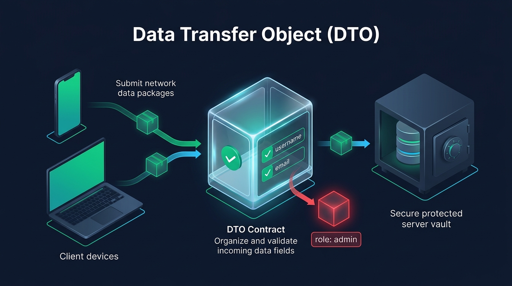
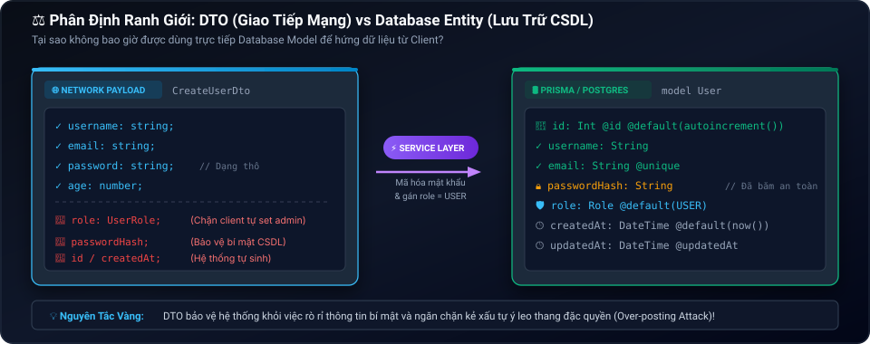
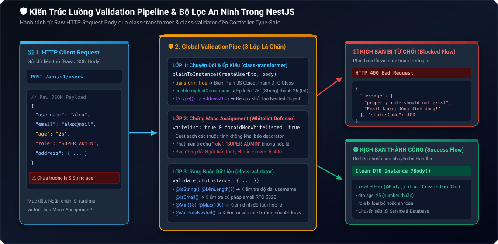
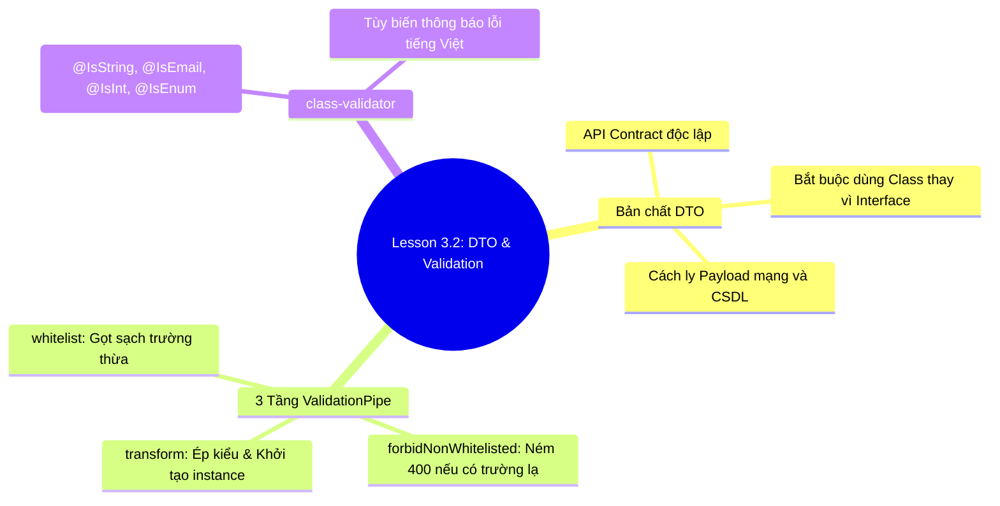

# Lesson 3.2: DTO & Validation — Chuẩn Hóa Dữ Liệu & Bộ Lọc An Ninh Toàn Cục Với class-validator

<p align="center">
  
  
  
  
  
</p>

<p align="center">
  
</p>

---

> [!NOTE]
> ⏱️ **Thời lượng:** 10 – 12 phút  
> 🎯 **Mục tiêu:** Hiểu rõ bản chất DTO (Data Transfer Object) và lý do bắt buộc dùng Class thay vì Interface; kích hoạt `ValidationPipe` toàn cục trong `main.ts` với 3 tầng bảo vệ (`whitelist`, `forbidNonWhitelisted`, `transform`); áp dụng `class-validator` & `class-transformer` để validate dữ liệu và triệt tiêu lỗ hổng Mass Assignment.

---

## 1. Bản Chất DTO & Tại Sao Không Dùng Trực Tiếp Database Model?

### 🔹 DTO (Data Transfer Object) Là Gì?

**DTO (Data Transfer Object)** là đối tượng thuần túy **chỉ chứa dữ liệu** (không chứa logic nghiệp vụ), đóng vai trò là **Bản hợp đồng giao tiếp (API Contract)** giữa Client và Server:

<p align="center">
  
</p>

### ⚖️ So Sánh Cốt Lõi: Interface vs Database Entity vs DTO Class

<p align="center">
  
</p>

| Tiêu chí      | 📄 TypeScript Interface                     | 🗄️ Database Entity (Prisma)                             | 🛡️ NestJS DTO Class                              |
| :------------ | :------------------------------------------ | :------------------------------------------------------ | :----------------------------------------------- |
| **Ở Runtime** | ❌ Bị xóa sạch khi biên dịch (Type Erasure) | Quá thừa trường nhạy cảm (`passwordHash`, `resetToken`) | ✅ Tồn tại dưới dạng ES6 Class                   |
| **Bảo mật**   | Không thể validate lúc chạy ứng dụng        | Nguy cơ bị Over-posting (`{"role": "ADMIN"}`)           | ✅ Chỉ nhận đúng các trường được cho phép        |
| **Decorator** | Không gắn được decorator                    | Gắn Prisma schema attributes                            | ✅ Gắn trực tiếp decorator của `class-validator` |

---

## 2. Kiến Trúc Validation Pipeline & 3 Tầng Phòng Thủ

<p align="center">
  
</p>

### 🛡️ 3 Tầng Bảo Vệ Của `ValidationPipe` Toàn Cục

| Cấu hình                     | Cơ chế hoạt động & Ý nghĩa an ninh                                                                                    |
| :--------------------------- | :-------------------------------------------------------------------------------------------------------------------- |
| `whitelist: true`            | **Gọt sạch trường thừa:** Tự động loại bỏ các field không được khai báo decorator trong DTO.                          |
| `forbidNonWhitelisted: true` | **Báo động đỏ:** Ném ngay mã lỗi `400 Bad Request` nếu phát hiện Client gửi trường lạ (chặn đứng hacker dò field).    |
| `transform: true`            | **Khởi tạo Instance & Ép kiểu:** Chuyển Plain Object thành Class Instance thật sự (`enableImplicitConversion: true`). |

### 📋 Bảng Tra Cứu Decorator Phổ Biến (`class-validator`)

- **Chuỗi:** `@IsString()`, `@IsNotEmpty()`, `@MinLength(min)`, `@MaxLength(max)`
- **Email & Định dạng:** `@IsEmail()`, `@IsUrl()`, `@IsUUID()`
- **Số học:** `@IsInt()`, `@IsNumber()`, `@Min(val)`, `@Max(val)`
- **Enum & Boolean:** `@IsBoolean()`, `@IsEnum(MyEnum)`
- **Tùy chọn & Lồng nhau:** `@IsOptional()`, `@ValidateNested()`, `@Type(() => SubDto)`

---

## 3. Hướng Dẫn Thực Hành Step-by-Step

### 📌 Bước 1: Cài Đặt Thư Viện Cốt Lõi

```bash
pnpm add class-validator class-transformer
```

---

### 📌 Bước 2: Kích Hoạt `ValidationPipe` Toàn Cục Trong `src/main.ts`

📄 **`src/main.ts`**

```typescript
import { Logger, ValidationPipe, VersioningType } from '@nestjs/common';
import { ConfigService } from '@nestjs/config';
import { NestFactory } from '@nestjs/core';
import { AppModule } from './app.module';

async function bootstrap() {
  const app = await NestFactory.create(AppModule);
  const configService = app.get(ConfigService);

  const port = configService.get<number>('PORT', 3000);
  const globalPrefix = configService.get<string>('GLOBAL_PREFIX', 'api');
  const versionPrefix = configService.get<string>('VERSION_PREFIX', 'v');
  const versionApi = configService.get<string>('VERSION_API', '1');

  app.setGlobalPrefix(globalPrefix);
  app.enableVersioning({
    type: VersioningType.URI,
    prefix: versionPrefix,
    defaultVersion: versionApi,
  });

  // 🛡️ Kích hoạt Bộ Lọc An Ninh Toàn Cục
  app.useGlobalPipes(
    new ValidationPipe({
      whitelist: true, // Lớp 1: Gọt sạch mọi trường thừa
      forbidNonWhitelisted: true, // Lớp 2: Quăng lỗi 400 nếu phát hiện trường lạ
      transform: true, // Lớp 3: Tự động khởi tạo Plain Object thành DTO Class Instance
      transformOptions: {
        enableImplicitConversion: true, // Tự động ép kiểu primitives (chuỗi sang số/boolean)
      },
    }),
  );

  await app.listen(port);
  Logger.log(
    `🚀 Server running at: http://localhost:${port}/${globalPrefix}/${versionPrefix}${versionApi}`,
    'Bootstrap',
  );
}
bootstrap();
```

---

### 📌 Bước 3: Tạo DTO Với Các Ràng Buộc Xác Thực

Tạo tệp DTO định nghĩa các quy tắc kiểm tra và thông báo lỗi tiếng Việt:

📄 **`src/users/dto/create-user.dto.ts`**

```typescript
import {
  IsEmail,
  IsEnum,
  IsInt,
  IsNotEmpty,
  IsOptional,
  IsString,
  Max,
  Min,
  MinLength,
} from 'class-validator';

export enum UserRole {
  USER = 'USER',
  MODERATOR = 'MODERATOR',
}

export class CreateUserDto {
  @IsString({ message: 'Username phải là chuỗi ký tự!' })
  @IsNotEmpty({ message: 'Username không được để trống!' })
  @MinLength(3, { message: 'Username phải có ít nhất 3 ký tự!' })
  username: string;

  @IsEmail({}, { message: 'Email không đúng định dạng chuẩn!' })
  @IsNotEmpty({ message: 'Email không được để trống!' })
  email: string;

  @IsInt({ message: 'Tuổi phải là số nguyên!' })
  @Min(18, { message: 'Người dùng phải từ 18 tuổi trở lên!' })
  @Max(100, { message: 'Tuổi không hợp lệ (tối đa 100)!' })
  age: number;

  @IsEnum(UserRole, { message: 'Vai trò phải là USER hoặc MODERATOR!' })
  @IsOptional()
  role?: UserRole = UserRole.USER;
}
```

---

### 📌 Bước 4: Áp Dụng DTO Sạch Sẽ Vào Controller

📄 **`src/users/users.controller.ts`**

```typescript
import { Body, Controller, Post, Version } from '@nestjs/common';
import { CreateUserDto } from './dto/create-user.dto';

@Controller('users')
export class UsersController {
  @Version('1')
  @Post()
  createUser(@Body() createUserDto: CreateUserDto) {
    return {
      success: true,
      message: 'Người dùng đã được xác thực hợp lệ!',
      data: createUserDto,
    };
  }
}
```

---

## 4. Kịch Bản Kiểm Tra & Thử Nghiệm (Hands-on Lab)

Khởi động ứng dụng NestJS:

```bash
pnpm start:dev
```

---

### 🟢 Kịch Bản 1: Thành Công — Ép Kiểu Tự Động (Success Flow)

Gửi request với trường `"age": "25"` (dạng chuỗi) để kiểm chứng khả năng tự động ép kiểu:

```bash
curl -i -X POST http://localhost:3000/api/v1/users \
  -H "Content-Type: application/json" \
  -d '{
    "username": "alex_johnson",
    "email": "alex@example.com",
    "age": "25"
  }'
```

📥 **Kết quả nhận được (`201 Created`):**

- Trường `age` tự động được ép kiểu thành số nguyên `25` (Number).
- Trường `role` tự động nhận giá trị mặc định `"USER"`.

---

### 🔴 Kịch Bản 2: Bắt Lỗi Vi Phạm Ràng Buộc (Validation Error)

Gửi dữ liệu vi phạm (username < 3 ký tự, email sai, tuổi 16):

```bash
curl -i -X POST http://localhost:3000/api/v1/users \
  -H "Content-Type: application/json" \
  -d '{
    "username": "al",
    "email": "email-sai-dinh-dang",
    "age": 16
  }'
```

📥 **Phản hồi từ Server (`400 Bad Request`):**

```json
{
  "message": [
    "Username phải có ít nhất 3 ký tự!",
    "Email không đúng định dạng chuẩn!",
    "Người dùng phải từ 18 tuổi trở lên!"
  ],
  "error": "Bad Request",
  "statusCode": 400
}
```

---

### 🔴 Kịch Bản 3: Chặn Đứng Tấn Công Mass Assignment (Security Protection)

Kẻ tấn công cố tình gửi kèm trường `hackRole: "SUPER_ADMIN"` để chiếm quyền:

```bash
curl -i -X POST http://localhost:3000/api/v1/users \
  -H "Content-Type: application/json" \
  -d '{
    "username": "hacker",
    "email": "hacker@test.com",
    "age": 28,
    "hackRole": "SUPER_ADMIN"
  }'
```

📥 **Phản hồi từ Server (`400 Bad Request`):**

```json
{
  "message": ["property hackRole should not exist"],
  "error": "Bad Request",
  "statusCode": 400
}
```

🛡️ **Phân tích an ninh:** Nhờ `forbidNonWhitelisted: true`, máy chủ từ chối phục vụ ngay lập tức khi phát hiện trường lạ ngoài DTO, triệt tiêu nguy cơ thao túng dữ liệu.

---

## 5. Tổng Kết Bài Học & Checklist Ghi Nhớ



### ✅ Checklist Ghi Nhớ Bài Học:

- [x] Hiểu bản chất DTO là API Contract độc lập giữa Client và Database.
- [x] Nắm rõ vì sao DTO phải là Class (tồn tại ở Runtime) thay vì Interface (bị Type Erasure).
- [x] Cấu hình thành thạo 3 tầng phòng thủ của `ValidationPipe` trong `src/main.ts`.
- [x] Khai báo các decorator thông dụng của `class-validator` kèm thông báo lỗi tiếng Việt.
- [x] Kiểm chứng thành công khả năng tự động ép kiểu và chặn đứng tấn công Mass Assignment.

---

👉 **Bài tiếp theo:** [Lesson 3.3: Middleware — Viết LoggerMiddleware Tự Động Log HTTP Request](../lesson-3.3/lesson-3.3.md)
