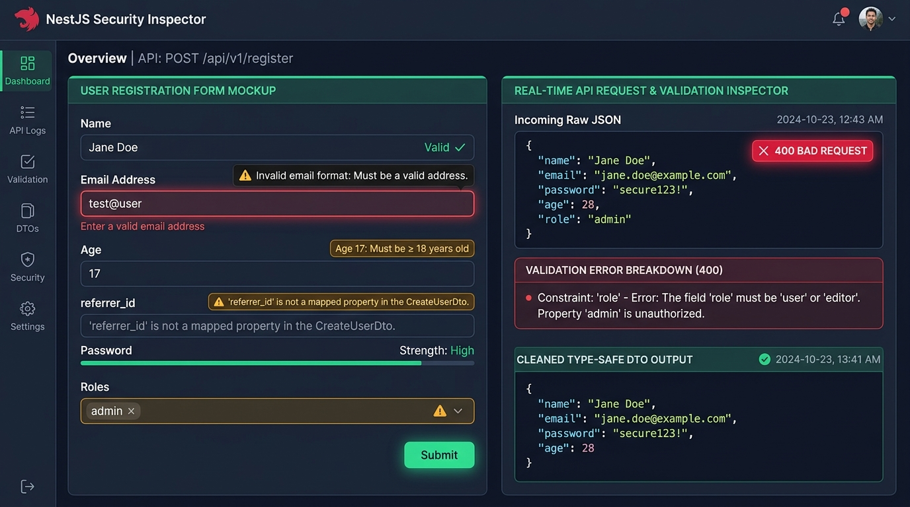

# Lesson 3.2: Validation — DTOs & ValidationPipe Toàn Cục Với class-validator

<p align="center">
  
  
  
  
  
</p>

<p align="center">
  
</p>

---

> [!NOTE]
> ⏱️ **Thời lượng:** 12 – 15 phút thực chiến  
> 🎯 **Mục tiêu:** Nắm vững vai trò sống còn của DTO (Data Transfer Object) và Validation trong kiến trúc API Enterprise; thiết lập "bộ lọc an ninh" `ValidationPipe` toàn cục trong `main.ts` với 3 tầng phòng thủ nghiêm ngặt (`whitelist: true`, `forbidNonWhitelisted: true`, `transform: true`); áp dụng thành thạo các decorator từ `class-validator` và `class-transformer` để kiểm tra kiểu dữ liệu, tự động ép kiểu dữ liệu primitive (`enableImplicitConversion`) cũng như validate các Object lồng nhau (Nested DTOs); thực hành kịch bản kiểm thử chặn đứng dữ liệu độc hại và triệt tiêu lỗ hổng Mass Assignment trước khi chạm tới Service Layer.

---

## 1. Trực Quan Hóa Bài Toán: Cửa Khẩu An Ninh Dữ Liệu & Lỗ Hổng Mass Assignment

### 📱 Sản Phẩm Thực Tế & Dashboard Giám Sát Validation

Trong một ứng dụng thực tế, người dùng tương tác với hệ thống qua các Form giao diện (Đăng ký tài khoản, Đặt hàng, Cập nhật hồ sơ). Tuy nhiên, kẻ tấn công (hoặc client bị lỗi) có thể gửi bất kỳ chuỗi JSON nào lên máy chủ:

<p align="center">
  
</p>

Nhìn vào màn hình giám sát an ninh ở trên, bạn sẽ thấy 2 bức tranh đối lập:

- 📝 **Form Đăng Ký (Phía Client):** Khi người dùng nhập sai định dạng email, khai báo tuổi chưa đủ 18, hoặc truyền trường lạ không hợp lệ, hệ thống cần phản hồi lập tức với thông báo lỗi rõ ràng, chính xác và thân thiện bằng tiếng Việt.
- 🛡️ **Real-time API Inspector (Phía Server):** Khi kẻ xấu cố tình tiêm trường nguy hiểm như `"role": "admin"` vào Request Body hòng tự chiếm quyền quản trị, NestJS Validation Pipe lập tức kích hoạt báo động đỏ: **từ chối ngay tại cửa ngõ bằng mã `400 Bad Request`** và chỉ chuyển tiếp những DTO đã được làm sạch hoàn toàn vào Controller.

---

### 🔥 Góc Thực Chiến: 3 "Cơn Ác Mộng" Dữ Liệu Rác & Lỗ Hổng Mass Assignment

> [!CAUTION]
>
> 1. **Vụ bê bối bảo mật GitHub (Egor Homakov Hack 2012):** Một lập trình viên đã khai thác lỗ hổng Mass Assignment trên Ruby on Rails của GitHub bằng cách gửi kèm public key SSH cá nhân vào tổ chức của Rails. Kết quả là anh ta chiếm toàn quyền commit code vào repository chính của Rails! Nếu không có **DTO Whitelist**, bất kỳ ai cũng có thể tự gắn `isAdmin: true` hoặc `balance: 999999` vào Payload gửi lên!
> 2. **Thảm họa Crash Database vì thiếu Type Casting:** Client gửi dữ liệu số qua Query hoặc Body dưới dạng chuỗi `"15"`. Nếu không có cơ chế ép kiểu tự động, phép cộng logic sẽ biến thành phép nối chuỗi: `"15" + 1 = "151"`, gây sai lệch số dư ví, hoặc câu lệnh truy vấn PostgreSQL bị từ chối vì không đúng kiểu `integer`.
> 3. **Lỗ hổng Tiêm Nhiễm Dữ Liệu Rác (Payload Pollution):** Kẻ tấn công gửi chuỗi văn bản dài 50.000 ký tự hoặc mảng lồng nhau vô hạn vào trường `username`. Nếu không có validation chặn chặn độ dài (`@MaxLength`), máy chủ sẽ cạn kiệt bộ nhớ RAM và tê liệt CSDL.

---

### ⚖️ Bản Chất Kỹ Thuật: Interface vs DTO Class Trong TypeScript

Rất nhiều lập trình viên mới chuyển sang NestJS đặt câu hỏi: _"Tại sao phải tạo DTO bằng Class mà không dùng Interface cho gọn?"_

Bảng so sánh dưới đây làm sáng tỏ sự khác biệt cốt lõi:

| Tiêu chí                        | 📄 TypeScript Interface                                                                                                | 🛡️ NestJS DTO Class                                                                                           |
| :------------------------------ | :--------------------------------------------------------------------------------------------------------------------- | :------------------------------------------------------------------------------------------------------------ |
| **Giai đoạn tồn tại**           | ❌ **Bị xóa sổ hoàn toàn khi biên dịch** (Type Erasure sang file `.js`). Ở Runtime, Interface hoàn toàn không tồn tại! | ✅ **Tồn tại vĩnh viễn ở Runtime** dưới dạng Constructor Function / ES6 Class tiêu chuẩn của JavaScript.      |
| **Khả năng gắn Decorator**      | ❌ Không thể gắn Decorator `@IsEmail()`, `@IsNotEmpty()` vào thuộc tính interface.                                     | ✅ **Gắn Decorator trực tiếp** từ `class-validator` để định nghĩa quy tắc kiểm tra.                           |
| **Khả năng Khởi tạo & Ép kiểu** | ❌ Không thể dùng toán tử `new` hoặc phản chiếu metadata (Reflection).                                                 | ✅ **Hỗ trợ `class-transformer`** để đệ quy chuyển đổi Plain Object thành Instance hoàn chỉnh (`instanceof`). |
| **Vai trò kiến trúc**           | Phù hợp định nghĩa kiểu nội bộ lúc viết code (Compile-time type checking).                                             | **Tiêu chuẩn bắt buộc cho Data Transfer Objects (DTO)** giao tiếp giữa Client & Server.                       |

---

## 2. Kiến Trúc Luồng Validation Pipeline & Các Tầng Bảo Vệ

### 🧩 Sơ Đồ Luồng Xử Lý Dữ Liệu Trong NestJS

Dưới đây là sơ đồ chi tiết hành trình của một HTTP Request Body đi qua bộ lọc an ninh toàn cục `ValidationPipe` trước khi được bàn giao cho Controller và Database:

<p align="center">
  
</p>

---

### 🛡️ 3 Tầng Phòng Thủ Của `ValidationPipe` Toàn Cục

Khi bạn cấu hình `ValidationPipe` trong NestJS, hệ thống dựng nên 3 lớp phòng thủ liên hoàn:

| Tầng bảo vệ                             | Cấu hình tham số                                       | Cơ chế hoạt động & Ý nghĩa an ninh                                                                                                                                                                                                   |
| :-------------------------------------- | :----------------------------------------------------- | :----------------------------------------------------------------------------------------------------------------------------------------------------------------------------------------------------------------------------------- |
| **Lớp 1: Gọt giũa dữ liệu thừa**        | `whitelist: true`                                      | **Tự động lọc bỏ các thuộc tính không được khai báo Decorator trong DTO.** Nếu client gửi `{ email, password, hackRole: "admin" }`, trường `hackRole` sẽ bị âm thầm gạch bỏ trước khi tới Controller.                                |
| **Lớp 2: Báo động đỏ kẻ xâm nhập**      | `forbidNonWhitelisted: true`                           | **Bật chế độ nghiêm ngặt tối đa:** Thay vì chỉ âm thầm gọt bỏ, hệ thống lập tức ngắt request và ném mã lỗi `400 Bad Request` kèm thông báo `property hackRole should not exist`. Giúp lập tức ngăn chặn bot/hacker dò quét field ẩn. |
| **Lớp 3: Tự động chuyển đổi & Ép kiểu** | `transform: true`<br/>`enableImplicitConversion: true` | Sử dụng `class-transformer` chuyển Plain JavaScript Object thành **DTO Class Instance thật sự**, đồng thời tự động ép kiểu chuỗi `"25"` thành số `25`, chuỗi `"true"` thành boolean `true` ở Query và Param.                         |

---

### 📋 Bảng Tra Cứu Toàn Diện: Các Decorators Phổ Biến Nhất Của `class-validator`

| Nhóm dữ liệu                 | Decorator                                                         | Mô tả & Ví dụ ràng buộc                                                         |
| :--------------------------- | :---------------------------------------------------------------- | :------------------------------------------------------------------------------ |
| **Kiểm tra cơ bản**          | `@IsNotEmpty({ message: '...' })`<br/>`@IsOptional()`             | Bắt buộc không được để trống / Cho phép trường không bắt buộc truyền.           |
| **Chuỗi ký tự (String)**     | `@IsString()`<br/>`@MinLength(min)`<br/>`@MaxLength(max)`         | Ràng buộc kiểu chuỗi và giới hạn độ dài ký tự tối thiểu / tối đa.               |
| **Định dạng đặc biệt**       | `@IsEmail({}, { message: '...' })`<br/>`@IsUrl()`<br/>`@IsUUID()` | Kiểm tra chuẩn RFC Email, URL hợp lệ, hoặc chuỗi định danh UUIDv4.              |
| **Số học (Number)**          | `@IsInt()`<br/>`@IsNumber()`<br/>`@Min(val)`<br/>`@Max(val)`      | Kiểm tra số nguyên, số thực, và giới hạn giá trị từ ngưỡng `Min` đến `Max`.     |
| **Kiểu Đúng/Sai & Danh Mục** | `@IsBoolean()`<br/>`@IsEnum(MyEnum)`                              | Kiểm tra giá trị boolean hoặc chỉ cho phép các giá trị nằm trong `enum`.        |
| **Cấu trúc phức tạp**        | `@IsArray()`<br/>`@ValidateNested()`<br/>`@Type(() => SubDto)`    | Kiểm tra mảng dữ liệu, hoặc kích hoạt kiểm tra đệ quy vào các Object lồng nhau. |

---

## 3. Hướng Dẫn Thực Hành Step-by-Step

### 📂 Cấu Trúc Mã Nguồn Triển Khai

Một cấu trúc tổ chức DTO chuẩn mực cho Module `users`:

```
src/
├── users/
│   ├── dto/
│   │   ├── address.dto.ts        👈 Nested DTO: Cấu trúc địa chỉ con lồng nhau
│   │   └── create-user.dto.ts    👈 Main DTO: Xác thực thông tin tạo mới người dùng
│   ├── users.controller.ts       👈 Nhận DTO sạch qua @Body() đã được kiểm chứng
│   └── users.service.ts          👈 Nhận dữ liệu Type-Safe chuyển tới Prisma/Database
├── app.module.ts                 👈 Đăng ký Module
└── main.ts                       👈 Kích hoạt Global ValidationPipe với cấu hình nghiêm ngặt
```

---

### 📌 Bước 1: Cài Đặt Bộ Đôi Thư Viện Cốt Lõi

Mở Terminal tại thư mục gốc của dự án và cài đặt bằng `pnpm`:

```bash
pnpm add class-validator class-transformer
```

---

### 📌 Bước 2: Cấu Hình `ValidationPipe` Toàn Cục Trong `src/main.ts`

Mở tệp `src/main.ts` và gắn `ValidationPipe` vào hệ thống thông qua `app.useGlobalPipes`:

📄 **`src/main.ts`**

```typescript
import { Logger, ValidationPipe, VersioningType } from '@nestjs/common';
import { ConfigService } from '@nestjs/config';
import { NestFactory } from '@nestjs/core';
import { AppModule } from './app.module';

async function bootstrap() {
  const app = await NestFactory.create(AppModule);
  const configService = app.get(ConfigService);

  const port = configService.get<number>('PORT', 3000);
  const globalPrefix = configService.get<string>('GLOBAL_PREFIX', 'api');
  const versionPrefix = configService.get<string>('VERSION_PREFIX', 'v');
  const versionApi = configService.get<string>('VERSION_API', '1');

  // 1. Cấu hình tiền tố toàn cục & API Versioning
  app.setGlobalPrefix(globalPrefix);
  app.enableVersioning({
    type: VersioningType.URI,
    prefix: versionPrefix,
    defaultVersion: versionApi,
  });

  // 2. 🛡️ Kích hoạt Lá Chắn Bảo Vệ Toàn Cục (Global ValidationPipe)
  app.useGlobalPipes(
    new ValidationPipe({
      whitelist: true, // Lớp 1: Gọt sạch mọi thuộc tính không khai báo decorator trong DTO
      forbidNonWhitelisted: true, // Lớp 2: Quăng lỗi 400 Bad Request ngay nếu phát hiện trường lạ độc hại
      transform: true, // Lớp 3: Tự động khởi tạo DTO thành Class Instance thật sự
      transformOptions: {
        enableImplicitConversion: true, // Tự động ép kiểu primitives (chuỗi sang số/boolean ở Query & Param)
      },
    }),
  );

  await app.listen(port);
  Logger.log(
    `🚀 Server đang khởi chạy tại: http://localhost:${port}/${globalPrefix}/${versionPrefix}${versionApi}`,
    'Bootstrap',
  );
}
bootstrap();
```

---

### 📌 Bước 3: Tạo Nested DTO (Địa Chỉ Người Dùng)

Khi dữ liệu gửi lên chứa một Object con bên trong (ví dụ trường `address`), ta tạo một DTO riêng để quản lý các trường con:

📄 **`src/users/dto/address.dto.ts`**

```typescript
import { IsNotEmpty, IsString } from 'class-validator';

export class AddressDto {
  @IsString({ message: 'Tên đường phải là chuỗi ký tự!' })
  @IsNotEmpty({ message: 'Tên đường không được để trống!' })
  street: string;

  @IsString({ message: 'Tên thành phố phải là chuỗi ký tự!' })
  @IsNotEmpty({ message: 'Tên thành phố không được để trống!' })
  city: string;
}
```

---

### 📌 Bước 4: Tạo Main DTO Toàn Diện Với Các Ràng Buộc Nâng Cao

Tạo file `create-user.dto.ts` bao gồm kiểm tra chuỗi, email, số tuổi, danh mục `enum`, giá trị tùy chọn (`@IsOptional`) và Object lồng nhau (`@ValidateNested`):

📄 **`src/users/dto/create-user.dto.ts`**

```typescript
import { Type } from 'class-transformer';
import {
  IsEmail,
  IsEnum,
  IsInt,
  IsNotEmpty,
  IsOptional,
  IsString,
  Max,
  Min,
  MinLength,
  ValidateNested,
} from 'class-validator';
import { AddressDto } from './address.dto';

// Khai báo Enum vai trò người dùng
export enum UserRole {
  USER = 'USER',
  MODERATOR = 'MODERATOR',
}

export class CreateUserDto {
  @IsString({ message: 'Username phải là chuỗi ký tự!' })
  @IsNotEmpty({ message: 'Username không được để trống!' })
  @MinLength(3, { message: 'Username phải có ít nhất 3 ký tự!' })
  username: string;

  @IsEmail(
    {},
    { message: 'Email không đúng định dạng chuẩn (ví dụ: user@example.com)!' },
  )
  @IsNotEmpty({ message: 'Email không được để trống!' })
  email: string;

  @IsInt({ message: 'Tuổi phải là số nguyên!' })
  @Min(18, { message: 'Người dùng phải từ 18 tuổi trở lên!' })
  @Max(100, { message: 'Tuổi không hợp lệ (tối đa 100)!' })
  age: number;

  @IsEnum(UserRole, { message: 'Vai trò phải là USER hoặc MODERATOR!' })
  @IsOptional()
  role?: UserRole = UserRole.USER;

  // 🔄 Validate Object lồng nhau (Nested DTO)
  @ValidateNested()
  @Type(() => AddressDto) // BẮT BUỘC có @Type để class-transformer biết đây là kiểu Class con
  @IsOptional()
  address?: AddressDto;
}
```

> [!IMPORTANT]
> **Quy tắc vàng khi validate Object lồng nhau:**  
> Bạn **bắt buộc** phải sử dụng đồng thời cặp đôi:
>
> 1. `@ValidateNested()` của `class-validator`: Ra lệnh cho Pipe kiểm tra sâu vào các thuộc tính bên trong.
> 2. `@Type(() => AddressDto)` của `class-transformer`: Hướng dẫn JavaScript khởi tạo object thô thành một instance của `AddressDto`. Nếu thiếu `@Type`, NestJS sẽ bỏ qua việc validate các trường bên trong `address`!

---

### 📌 Bước 5: Áp Dụng DTO Sạch Sẽ Vào Controller

Mở tệp `src/users/users.controller.ts` và gán DTO vào tham số `@Body()`:

📄 **`src/users/users.controller.ts`**

```typescript
import { Body, Controller, Post, Version } from '@nestjs/common';
import { CreateUserDto } from './dto/create-user.dto';

@Controller('users')
export class UsersController {
  @Version('1')
  @Post()
  createUser(@Body() createUserDto: CreateUserDto) {
    // Nhờ có transform: true, createUserDto là một Instance đích thực của class CreateUserDto
    console.log('Kiểm tra Instance:', createUserDto instanceof CreateUserDto); // true

    return {
      success: true,
      message: 'Người dùng đã được xác thực hợp lệ và tạo thành công!',
      data: createUserDto,
    };
  }
}
```

---

## 4. Kịch Bản Kiểm Tra & Thử Nghiệm (Hands-on Lab)

Khởi động ứng dụng NestJS của bạn:

```bash
pnpm start:dev
```

Mở một cửa sổ Terminal mới và thực hiện kiểm thử theo các kịch bản thực tế bên dưới:

---

### 🟢 Kịch Bản 1: Thành Công — Gửi Payload Hợp Lệ Kèm Ép Kiểu Tự Động

Thực thi lệnh cURL gửi dữ liệu hoàn chỉnh, chú ý trường `"age": "25"` cố tình truyền chuỗi để kiểm chứng khả năng tự động ép kiểu sang số nguyên của `enableImplicitConversion`:

```bash
curl -i -X POST http://localhost:3000/api/v1/users \
  -H "Content-Type: application/json" \
  -d '{
    "username": "alex_johnson",
    "email": "alex@example.com",
    "age": "25",
    "address": {
      "street": "123 Đường Lê Lợi",
      "city": "Hồ Chí Minh"
    }
  }'
```

📥 **Phản hồi HTTP nhận được (`201 Created`):**

```json
HTTP/1.1 201 Created
Content-Type: application/json; charset=utf-8

{
  "success": true,
  "message": "Người dùng đã được xác thực hợp lệ và tạo thành công!",
  "data": {
    "username": "alex_johnson",
    "email": "alex@example.com",
    "age": 25,
    "role": "USER",
    "address": {
      "street": "123 Đường Lê Lợi",
      "city": "Hồ Chí Minh"
    }
  }
}
```

> [!NOTE]
> **Phân tích kết quả:**
>
> - Trường `age` đã tự động được ép kiểu từ chuỗi `"25"` thành số `25` nguyên bản (Number).
> - Trường `role` tự động nhận giá trị mặc định `"USER"` do DTO định nghĩa.
> - Cấu trúc `address` lồng nhau được kiểm tra an toàn và giữ nguyên tính toàn vẹn.

---

### 🔴 Kịch Bản 2: Kiểm Thử Bắt Lỗi — Vi Phạm Ràng Buộc Dữ Liệu

Thử gửi yêu cầu với các lỗi điển hình: username quá ngắn (< 3 ký tự), định dạng email sai, và tuổi dưới 18:

```bash
curl -i -X POST http://localhost:3000/api/v1/users \
  -H "Content-Type: application/json" \
  -d '{
    "username": "al",
    "email": "email-khong-dung-dinh-dang",
    "age": 16
  }'
```

📥 **Phản hồi HTTP nhận được từ Server (`400 Bad Request`):**

```json
HTTP/1.1 400 Bad Request
Content-Type: application/json; charset=utf-8

{
  "message": [
    "Username phải có ít nhất 3 ký tự!",
    "Email không đúng định dạng chuẩn (ví dụ: user@example.com)!",
    "Người dùng phải từ 18 tuổi trở lên!"
  ],
  "error": "Bad Request",
  "statusCode": 400
}
```

✅ **Kết quả:** NestJS tự động gom toàn bộ danh sách lỗi vi phạm vào mảng `message` kèm thông báo tùy biến tiếng Việt thân thiện, giúp đội ngũ Frontend dễ dàng hiển thị lỗi tương ứng lên giao diện người dùng.

---

### 🔴 Kịch Bản 3: Kiểm Thử Bảo Mật — Triệt Tiêu Tấn Công Mass Assignment

Kẻ tấn công cố tình tiêm thêm trường `hackRole: "SUPER_ADMIN"` và `isVip: true` nhằm chiếm quyền trái phép:

```bash
curl -i -X POST http://localhost:3000/api/v1/users \
  -H "Content-Type: application/json" \
  -d '{
    "username": "hacker_pro",
    "email": "hacker@security.io",
    "age": 28,
    "hackRole": "SUPER_ADMIN",
    "isVip": true
  }'
```

📥 **Phản hồi HTTP nhận được từ Server (`400 Bad Request` do `forbidNonWhitelisted`):**

```json
HTTP/1.1 400 Bad Request
Content-Type: application/json; charset=utf-8

{
  "message": [
    "property hackRole should not exist",
    "property isVip should not exist"
  ],
  "error": "Bad Request",
  "statusCode": 400
}
```

🛡️ **Phân tích an ninh:** Nhờ cấu hình `forbidNonWhitelisted: true`, máy chủ phát hiện ngay các trường nằm ngoài khai báo của DTO và **từ chối phục vụ ngay lập tức**. Kẻ xấu hoàn toàn không có cơ hội thao túng cơ sở dữ liệu!

---

## 5. Tổng Kết Bài Học & Checklist Ghi Nhớ

```mermaid
mindmap
  root(("NestJS Data Validation"))
    "Bản chất cốt lõi"
      "DTO Class tồn tại ở Runtime"
      "Khắc phục nhược điểm của Interface"
      "Triệt tiêu lỗi Mass Assignment"
    "3 Lớp Lá Chắn ValidationPipe"
      "whitelist: true (Gọt sạch trường thừa)"
      "forbidNonWhitelisted: true (Ném 400 nếu có trường lạ)"
      "transform: true (Khởi tạo DTO Class Instance)"
      "enableImplicitConversion: true (Ép kiểu primitives)"
    "Thư viện Cốt lõi"
      "class-validator (Decorators kiểm định)"
      "class-transformer (plainToInstance & Type casting)"
    "Kỹ thuật Nâng cao"
      "Thông báo lỗi tùy biến tiếng Việt"
      "Validate Object lồng nhau (@ValidateNested + @Type)"
      "Kiểm tra danh mục Enum an toàn"
```

### ✅ Checklist Ghi Nhớ Bài Học:

- [x] Thấu hiểu lý do vì sao phải dùng DTO Class (tồn tại ở Runtime) thay vì Interface (bị xóa sổ khi biên dịch).
- [x] Nắm vững cơ chế của 3 lớp phòng thủ trong `ValidationPipe`: `whitelist`, `forbidNonWhitelisted`, và `transform`.
- [x] Cài đặt và cấu hình thành công bộ đôi `class-validator` & `class-transformer` trong `src/main.ts`.
- [x] Xây dựng thành thạo DTO với đầy đủ các decorator thông dụng (`@IsString`, `@IsEmail`, `@Min`, `@Max`, `@IsEnum`) kèm thông báo lỗi tiếng Việt dễ hiểu.
- [x] Làm chủ kỹ thuật validate Object lồng nhau bằng bộ đôi `@ValidateNested()` và `@Type(() => SubDto)`.
- [x] Thử nghiệm thành công kịch bản chặn đứng tấn công Mass Assignment và kiểm chứng cơ chế tự động ép kiểu dữ liệu.

---

👉 **Bài tiếp theo:** [Lesson 3.3: Middleware — Viết LoggerMiddleware Tự Động Log HTTP Request](../lesson-3.3/lesson-3.3.md)
