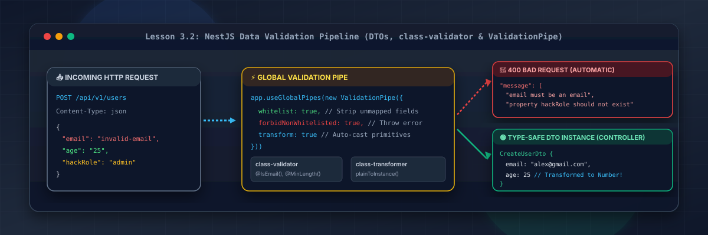
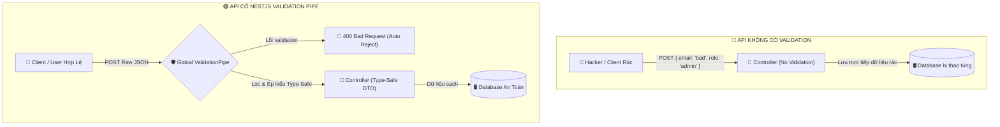
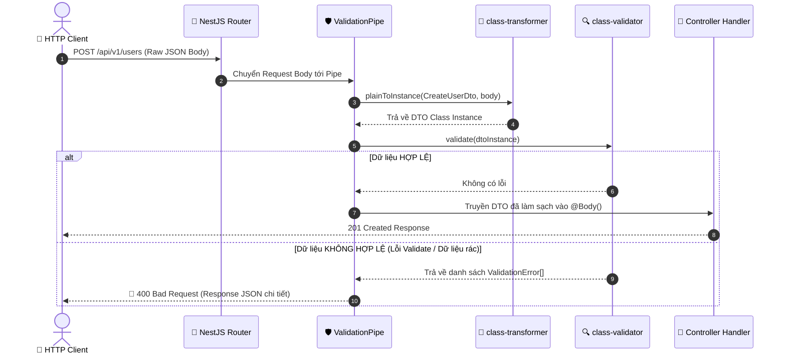

# Lesson 3.2: Validation — DTOs & ValidationPipe Toàn Cục Với class-validator

<p align="center">
  
  
  
  
  
</p>

<p align="center">
  
</p>

---

> [!NOTE]
> ⏱️ **Thời lượng dự kiến:** 12 – 15 phút  
> 🎯 **Mục tiêu bài học:** Nắm vững vai trò cốt lõi của DTO (Data Transfer Object) và Validation trong kiến trúc API Enterprise; cấu hình `ValidationPipe` toàn cục trong `main.ts` với các thuộc tính bảo mật nghiêm ngặt (`whitelist: true`, `forbidNonWhitelisted: true`, `transform: true`); áp dụng decorator từ `class-validator` và `class-transformer` để kiểm tra kiểu dữ liệu, biến đổi tự động kiểu dữ liệu primitive cũng như validate các Object lồng nhau (Nested DTOs); thực hành kịch bản kiểm thử chặn đứng dữ liệu độc hại/rác trước khi vào đến Service Layer.

---

## 1. Tại Sao DTO & Validation Là "Lớp Giáp Bảo Vệ" Của REST API?

### 💡 Ẩn Dụ Thực Tế: Cửa An Ninh Sân Bay & Lỗ Hổng Mass Assignment

Hãy hình dung ứng dụng Backend của bạn giống như một **Sân Bay Quốc Tế**:

- Hành khách (Request Body) gửi đến có thể mang theo hành lý đúng quy định (dữ liệu hợp lệ).
- Tuy nhiên, kẻ xấu có thể tìm cách ngụy trang hàng cấm (SQL Injection, XSS Payload) hoặc mang thêm đồ không khai báo (Lỗ hổng **Mass Assignment / Over-posting Attack** — cố tình truyền thêm `role: "admin"` hoặc `isVip: true` để tự cấp quyền cao cấp).

Nếu Controller nhận trực tiếp dữ liệu thô (raw JSON) mà không qua kiểm duyệt, kẻ tấn công có thể thay đổi dữ liệu cơ sở dữ liệu một cách trái phép!



---

### 🔹 Khái Niệm DTO (Data Transfer Object) Là Gì?

**DTO (Data Transfer Object)** là một đối tượng (Class trong TypeScript) định nghĩa chính xác cấu trúc dữ liệu gửi qua mạng giữa Client và Server.

| Đặc tính                          | Interface (TypeScript)                                      | DTO Class (TypeScript)                             |
| :-------------------------------- | :---------------------------------------------------------- | :------------------------------------------------- |
| **Bản chất khi biên dịch**        | Bị xóa hoàn toàn (Type Erasure) khi sang JavaScript (`.js`) | **Tồn tại ở Runtime** dưới dạng ES6 Class          |
| **Khả năng gán Decorator**        | ❌ Không thể dùng `@IsEmail()`, `@IsString()`               | ✅ **Hoàn toàn dùng được với `class-validator`**   |
| **Khả năng Ép kiểu (Reflection)** | ❌ Không hỗ trợ                                             | ✅ **Hỗ trợ `class-transformer` biến đổi dữ liệu** |

---

## 2. Luồng Hoạt Động Của Validation Pipeline Trong NestJS

NestJS cung cấp sẵn `ValidationPipe` kết hợp cùng 2 thư viện mạnh mẽ:

1. `class-validator`: Sử dụng các Decorators (`@IsString()`, `@IsEmail()`, `@MinLength()`,...) để kiểm tra ràng buộc dữ liệu.
2. `class-transformer`: Chuyển đổi dữ liệu thô (Plain JavaScript Object) thành Instance của DTO Class (`plainToInstance()`).



---

## 3. Hướng Dẫn Thực Hành Step-by-Step — Cấu Hình & Sử Dụng DTO Validation

### 📌 Bước 0: Cài Đặt Các Thư Viện Cần Thiết

Mở Terminal tại thư mục gốc của dự án và cài đặt bộ đôi `class-validator` & `class-transformer`:

```bash
pnpm add class-validator class-transformer
```

---

### 📌 Bước 1: Kích Hoạt `ValidationPipe` Toàn Cục Trong `src/main.ts`

Mở file `src/main.ts` và thêm `app.useGlobalPipes` với bộ tham số chuẩn Enterprise:

📄 **`src/main.ts`**

```typescript
import { ValidationPipe, VersioningType } from '@nestjs/common';
import { NestFactory } from '@nestjs/core';
import { AppModule } from './app.module';

async function bootstrap() {
  const app = await NestFactory.create(AppModule);

  app.setGlobalPrefix('api');

  app.enableVersioning({
    type: VersioningType.URI,
    prefix: 'v',
    defaultVersion: '1',
  });

  // 🛡️ Kích hoạt ValidationPipe Toàn Cục
  app.useGlobalPipes(
    new ValidationPipe({
      whitelist: true, // Lọc bỏ tất cả các field lạ không định nghĩa trong DTO
      forbidNonWhitelisted: true, // Bật chế độ nghiêm ngặt: Quăng lỗi 400 ngay nếu có field lạ
      transform: true, // Tự động convert Plain Object thành DTO Instance & ép kiểu primitives
      transformOptions: {
        enableImplicitConversion: true, // Tự động ép kiểu chuỗi "123" sang số 123 ở @Query()/@Param()
      },
    }),
  );

  await app.listen(3000);
  console.log(`🚀 Server running on: http://localhost:3000/api/v1`);
}
bootstrap();
```

> [!IMPORTANT]
> **Giải thích tham số bảo mật:**
>
> - `whitelist: true`: Loại bỏ nguy cơ **Mass Assignment**. Nếu Hacker gửi `{ "username": "alex", "role": "admin" }` nhưng DTO chỉ khai báo `username`, trường `role` sẽ bị tự động loại bỏ.
> - `forbidNonWhitelisted: true`: Nâng cấp bảo mật lên mức cao nhất bằng cách **quăng ngay lỗi 400 Bad Request** nếu client cố tình gửi các thuộc tính nằm ngoài DTO.

---

### 📌 Bước 2: Tạo DTO Chuẩn Enterprise Với `class-validator` & `class-transformer`

Tạo thư mục `src/users/dto/` và tạo các DTOs phục vụ việc tạo mới người dùng:

#### 1. Tạo Nested DTO (Địa chỉ người dùng):

📄 **`src/users/dto/address.dto.ts`**

```typescript
import { IsNotEmpty, IsString } from 'class-validator';

export class AddressDto {
  @IsString({ message: 'Tên đường phải là chuỗi ký tự!' })
  @IsNotEmpty({ message: 'Tên đường không được để trống!' })
  street: string;

  @IsString({ message: 'Tên thành phố phải là chuỗi ký tự!' })
  @IsNotEmpty({ message: 'Tên thành phố không được để trống!' })
  city: string;
}
```

#### 2. Tạo Main DTO (Thông tin tạo User):

📄 **`src/users/dto/create-user.dto.ts`**

```typescript
import { Type } from 'class-transformer';
import {
  IsEmail,
  IsEnum,
  IsInt,
  IsNotEmpty,
  IsOptional,
  IsString,
  Max,
  Min,
  MinLength,
  ValidateNested,
} from 'class-validator';
import { AddressDto } from './address.dto';

export enum UserRole {
  USER = 'USER',
  MODERATOR = 'MODERATOR',
}

export class CreateUserDto {
  @IsString({ message: 'Username phải là chuỗi ký tự!' })
  @IsNotEmpty({ message: 'Username không được để trống!' })
  @MinLength(3, { message: 'Username phải có ít nhất 3 ký tự!' })
  username: string;

  @IsEmail(
    {},
    { message: 'Email không đúng định dạng chuẩn (VD: user@example.com)!' },
  )
  @IsNotEmpty({ message: 'Email không được để trống!' })
  email: string;

  @IsInt({ message: 'Tuổi phải là số nguyên!' })
  @Min(18, { message: 'Người dùng phải từ 18 tuổi trở lên!' })
  @Max(100, { message: 'Tuổi không hợp lệ (tối đa 100)!' })
  age: number;

  @IsEnum(UserRole, { message: 'Role phải là USER hoặc MODERATOR!' })
  @IsOptional()
  role?: UserRole = UserRole.USER;

  // 🔄 Validate Object lồng nhau (Nested DTO)
  @ValidateNested()
  @Type(() => AddressDto) // Bắt buộc phải có @Type() để class-transformer hiểu kiểu Class lồng nhau
  @IsOptional()
  address?: AddressDto;
}
```

---

### 📌 Bước 3: Áp Dụng DTO Vào Controller

Mở tệp `src/users/users.controller.ts` và gán DTO vào tham số `@Body()`:

📄 **`src/users/users.controller.ts`**

```typescript
import { Body, Controller, Post, Version } from '@nestjs/common';
import { CreateUserDto } from './dto/create-user.dto';

@Controller('users')
export class UsersController {
  @Version('1')
  @Post()
  createUser(@Body() createUserDto: CreateUserDto) {
    // Lúc này createUserDto đã được ValidationPipe kiểm tra sạch sẽ
    // và là một Instance hoàn chỉnh của CreateUserDto class
    console.log('DTO Instance type:', createUserDto instanceof CreateUserDto); // true

    return {
      message: 'Tạo người dùng thành công!',
      data: createUserDto,
    };
  }
}
```

---

## 4. Kịch Bản Kiểm Tra & Thử Nghiệm (Hands-on Lab)

### 🟢 Kịch Bản 1: Thành Công — Gửi Payload Hợp Lệ & Tự Động Ép Kiểu

Mở Terminal và gửi yêu cầu HTTP POST với đầy đủ dữ liệu hợp lệ:

```bash
curl -X POST http://localhost:3000/api/v1/users \
  -H "Content-Type: application/json" \
  -d '{
    "username": "alex_johnson",
    "email": "alex@example.com",
    "age": 25,
    "address": {
      "street": "123 Đường Lê Lợi",
      "city": "Hồ Chí Minh"
    }
  }'
```

📥 **Phản hồi HTTP trả về (`201 Created`):**

```json
{
  "message": "Tạo người dùng thành công!",
  "data": {
    "username": "alex_johnson",
    "email": "alex@example.com",
    "age": 25,
    "role": "USER",
    "address": {
      "street": "123 Đường Lê Lợi",
      "city": "Hồ Chí Minh"
    }
  }
}
```

✅ **Kết quả:** Dữ liệu hợp lệ đi qua Pipe mượt mà, `age` được giữ nguyên kiểu số, `role` tự động gán giá trị mặc định `USER`.

---

### 🔴 Kịch Bản 2: Kiểm Thử Lỗi & Ngăn Chặn (Blocked/Error Flow)

#### Case A: Gửi dữ liệu vi phạm ràng buộc (Email sai, tuổi dưới 18, username ngắn)

```bash
curl -X POST http://localhost:3000/api/v1/users \
  -H "Content-Type: application/json" \
  -d '{
    "username": "al",
    "email": "invalid-email-format",
    "age": 15
  }'
```

📥 **Phản hồi HTTP nhận được (`400 Bad Request`):**

```json
{
  "message": [
    "Username phải có ít nhất 3 ký tự!",
    "Email không đúng định dạng chuẩn (VD: user@example.com)!",
    "Người dùng phải từ 18 tuổi trở lên!"
  ],
  "error": "Bad Request",
  "statusCode": 400
}
```

✅ **Kết quả:** NestJS tự động gom toàn bộ thông báo lỗi tùy chỉnh và trả về mảng `message` trực quan cho Frontend.

---

#### Case B: Gửi kèm thuộc tính lạ độc hại (Tấn công Mass Assignment)

Thử gửi thuộc tính `hackRole` không khai báo trong DTO:

```bash
curl -X POST http://localhost:3000/api/v1/users \
  -H "Content-Type: application/json" \
  -d '{
    "username": "hacker",
    "email": "hacker@example.com",
    "age": 22,
    "hackRole": "SUPER_ADMIN"
  }'
```

📥 **Phản hồi HTTP nhận được (`400 Bad Request` do `forbidNonWhitelisted`):**

```json
{
  "message": ["property hackRole should not exist"],
  "error": "Bad Request",
  "statusCode": 400
}
```

✅ **Kết quả:** Hệ thống phát hiện trường lạ và chặn đứng yêu cầu ngay lập tức, ngăn ngừa nguy cơ bị tiêm dữ liệu độc hại!

---

## 5. Tổng Kết Bài Học & Checklist Ghi Nhớ

```mermaid
mindmap
  root(("NestJS Data Validation"))
    "Khái niệm DTO"
      "Data Transfer Object Class"
      "Tồn tại ở Runtime"
      "Bảo vệ Mass Assignment"
    "ValidationPipe Global Options"
      "whitelist: true"
      "forbidNonWhitelisted: true"
      "transform: true"
      "enableImplicitConversion: true"
    "Thư viện Cốt lõi"
      "class-validator (Decorators)"
      "class-transformer (plainToInstance)"
    "Kỹ thuật Nâng cao"
      "Custom Validation Messages"
      "Validate Nested DTOs (@ValidateNested)"
      "Validate Enums (@IsEnum)"
```

### ✅ Checklist Ghi Nhớ Bài Học:

- [x] Hiểu rõ sự khác biệt giữa Interface (chỉ tồn tại lúc compile) và DTO Class (tồn tại ở Runtime).
- [x] Cài đặt thành công `class-validator` và `class-transformer`.
- [x] Cấu hình `ValidationPipe` toàn cục trong `main.ts` với `whitelist`, `forbidNonWhitelisted` và `transform`.
- [x] Tạo được DTO chứa đầy đủ các decorator validation primitive (`@IsString`, `@IsEmail`, `@Min`, `@Max`) và custom error message tiếng Việt.
- [x] Áp dụng kỹ thuật `@ValidateNested()` và `@Type()` để kiểm tra dữ liệu Object lồng nhau.
- [x] Chạy thử kịch bản thành công và kịch bản lỗi chặn trường độc hại (Mass Assignment).

---

👉 **Bài tiếp theo:** [Lesson 3.3: Middleware — Viết LoggerMiddleware Tự Động Log HTTP Request](../lesson-3.3/lesson-3.3.md)
