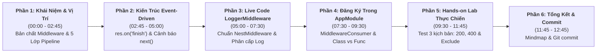
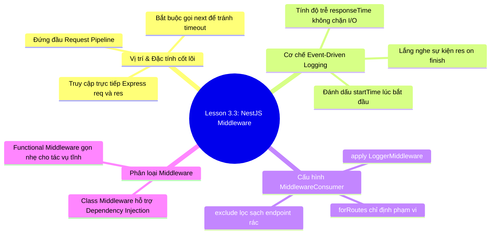

# Kịch Bản Giảng Dạy (Instructor Script)

## Lesson 3.3: Middleware — Viết LoggerMiddleware Tự Động Log HTTP Request

<p align="center">
  
  
  
  
  
</p>

<p align="center">
  
</p>

---

## 🎯 Thông Tin Tổng Quan Bài Học

- **Bài học:** Lesson 3.3: Middleware — Viết LoggerMiddleware Tự Động Log HTTP Request
- **Khóa học:** NestJS Thực Chiến: Xây Dựng API Từ Cơ Bản Đến Nâng Cao
- **Thời lượng dự kiến:** 11 – 13 phút thực chiến
- **Mục tiêu cốt lõi:**
  1. Thấu hiểu sâu sắc bản chất và vị trí độc nhất của **Middleware** trong Request Lifecycle của NestJS (chạy đầu tiên, truy cập trực tiếp Express `req` và `res`).
  2. Nắm vững cơ chế **Event-Driven Logging** bất đồng bộ thông qua sự kiện `res.on('finish')` để đo độ trễ `responseTime` (ms) chính xác mà không làm chậm luồng xử lý chính.
  3. Live-code 100% xây dựng `LoggerMiddleware` triển khai `NestMiddleware` interface với định dạng log chuẩn Enterprise, phân cấp màu sắc cảnh báo (`LOG`, `WARN`, `ERROR`).
  4. Làm chủ kỹ thuật cấu hình `MiddlewareConsumer` trong `AppModule`, phối hợp linh hoạt giữa `apply()`, `forRoutes('*')` và loại trừ endpoint bằng `.exclude()`.
  5. Phân biệt rõ nét giữa **Class Middleware** (hỗ trợ Dependency Injection) và **Functional Middleware** (nhẹ nhàng, tác vụ tĩnh).
  6. Thực hành Hands-on Lab kiểm nghiệm 3 kịch bản: Request thành công `200 OK`, Bắt lỗi validation `400 Bad Request` (màu vàng cảnh báo), và Kiểm chứng lọc sạch log rác với `.exclude()`.
- **Chuẩn bị trước khi quay (Instructor Pre-recording Checklist):**
  - [x] Mở sẵn dự án trong VS Code với độ phân giải màn hình chuẩn 1080p, font size 16–18 (JetBrains Mono).
  - [x] Đảm bảo nhánh code của Lesson 3.2 đã hoàn thiện (có `CreateUserDto` và `ValidationPipe` toàn cục hoạt động bình thường).
  - [x] Mở sẵn 2 tab Terminal: Tab 1 chạy server NestJS (`pnpm start:dev`), Tab 2 dùng để gõ cURL / HTTP request test.
  - [x] Chuẩn bị sẵn các file đồ họa trong thư mục `assets/` để chuyển cảnh mượt mà: `middleware_logger_ui_mockup.jpg` và `middleware_lifecycle_architecture.svg`.

---

## ⏱️ Sơ Đồ Phân Bổ Thời Gian (Timeline Roadmap)



---

## 🎬 Chi Tiết Kịch Bản Giảng Dạy Từng Phân Cảnh (Scene-by-Scene)

---

### PHẦN 1: KHỞI ĐỘNG & VỊ TRÍ CỐT LÕI CỦA MIDDLEWARE (00:00 – 02:45)

#### ⏱️ Phút 00:00 - 01:15 | Mở Đầu Cuốn Hút & Đặt Vấn Đề

- 🎬 **Hành động & Màn hình hiển thị (Screen/Visuals):**
  - Giảng viên xuất hiện webcam góc màn hình với phong thái chuyên nghiệp, hào hứng.
  - Chiếu Slide Title bài học và Banner Overview `lesson_overview_banner.svg`.
  - Chuyển sang chiếu hình ảnh UI Mockup trực quan [middleware_logger_ui_mockup.jpg](./assets/middleware_logger_ui_mockup.jpg) minh họa màn hình giám sát Observability Dashboard trong thực tế doanh nghiệp.

- 🎙️ **Lời thoại Giảng viên (Instructor Dialogue):**

  > "Xin chào tất cả các bạn! Chào mừng các bạn quay trở lại với khóa học **NestJS Thực Chiến: Xây Dựng API Từ Cơ Bản Đến Nâng Cao**!
  >
  > Ở bài học trước, chúng ta đã biến hệ thống của mình thành một pháo đài kiên cố bằng cách kích hoạt `ValidationPipe` 3 tầng phòng thủ cùng `class-validator`, chặn đứng hoàn toàn lỗ hổng Mass Assignment nguy hiểm.
  >
  > Hôm nay, chúng ta sẽ cùng giải quyết một bài toán sống còn trong môi trường Enterprise: **Làm sao để hệ thống Backend của bạn có mắt và có tai?**
  >
  > Hãy tưởng tượng hệ thống production của bạn đang phục vụ hàng chục ngàn người dùng mỗi phút. Đột nhiên hệ thống báo chậm, hoặc khách hàng phàn nàn bị trừ tiền nhưng không nhận được hàng. Nếu không có cơ chế ghi log tự động, bạn sẽ hoàn toàn 'mù thông tin':
  >
  > - Không biết ai đã gọi API nào?
  > - Gọi từ địa chỉ IP nào?
  > - Kết quả trả về thành công `200` hay lỗi `500`?
  > - Và quan trọng nhất: Mỗi API mất bao nhiêu miligiây để phản hồi?
  >
  > Nhìn lên màn hình, đây chính là **API Observability Dashboard** mà các kỹ sư DevOps / Backend luôn cần. Và trong bài học **Lesson 3.3** ngày hôm nay, chúng ta sẽ tự tay xây dựng một **`LoggerMiddleware`** chuyên nghiệp để thu thập toàn bộ dữ liệu này!"

---

#### ⏱️ Phút 01:15 - 02:45 | Ẩn Dụ Trạm Thu Phí & So Sánh 5 Thành Phần Request Pipeline

- 🎬 **Hành động & Màn hình hiển thị (Screen/Visuals):**
  - Chiếu sơ đồ bảng so sánh 5 thành phần cốt lõi: `Middleware`, `Guard`, `Interceptor`, `Pipe`, `Exception Filter`.
  - Highlight dòng đầu tiên: **🛡️ Middleware**.

- 🎙️ **Lời thoại Giảng viên (Instructor Dialogue):**

  > "Để các bạn dễ hình dung, hãy tưởng tượng ứng dụng NestJS của chúng ta như một **Thành phố trung tâm**, và mỗi HTTP Request gửi đến giống như một **Chiếc xe ô tô** chạy trên đường cao tốc.
  >
  > Trước khi chiếc xe được phép tiến vào sâu trong nội đô thành phố, nó bắt buộc phải chạy qua **Trạm thu phí tự động (Middleware)** đặt ở cửa ngõ:
  >
  > - Tại đây, camera trạm thu phí sẽ ghi nhận: **Biển số xe (Client IP)**, **Thời gian vào trạm (Timestamp)**, **Loại xe (User-Agent)** và **Làn đường muốn đi (HTTP Method & URL)**.
  > - Sau khi trích xuất dữ liệu, thanh chắn barie mở ra (`next()`) để xe tiếp tục lưu thông.
  >
  > Trong NestJS, luồng xử lý request (Request Pipeline) gồm 5 lớp theo thứ tự cực kỳ nghiêm ngặt:
  >
  > 1. **Middleware**: Chạy đầu tiên, trước tất cả mọi thứ!
  > 2. **Guard**: Kiểm tra xem chiếc xe có vé hay thẻ ra vào hợp lệ không (Authentication / Authorization).
  > 3. **Interceptor**: Tiền xử lý dữ liệu trước khi vào Controller và biến đổi dữ liệu sau khi Controller xử lý xong.
  > 4. **Pipe**: Kiểm định và ép kiểu dữ liệu DTO.
  > 5. **Exception Filter**: Bắt các trường hợp tai nạn, quăng lỗi để trả về thông báo chuẩn hóa.
  >
  > ⭐ **Điểm khác biệt sống còn mà các bạn phải nhớ:**  
  > Middleware là thành phần **duy nhất** nằm ở tầng HTTP Engine gốc (Express thuần). Nó có quyền truy cập trực tiếp vào hai đối tượng nguyên bản: `req: Request` và `res: Response`. Chính vì thế, Middleware là nơi hoàn hảo nhất để ghi log, xử lý CORS, nén dữ liệu gzip và rate limiting!"

- 💡 **Mẹo sư phạm (Pedagogical Tip):**
  > Nhấn mạnh thứ tự thực thi của 5 thành phần. Khuyên học viên vẽ lại sơ đồ này ra sổ tay vì đây là câu hỏi kinh điển trong các buổi phỏng vấn Senior NestJS Engineer.

---

### PHẦN 2: KIẾN TRÚC EVENT-DRIVEN & CƠ CHẾ LOGGING (02:45 – 05:00)

#### ⏱️ Phút 02:45 - 04:00 | Sơ Đồ Vòng Đời & Sự Kiện `res.on('finish')`

- 🎬 **Hành động & Màn hình hiển thị (Screen/Visuals):**
  - Chiếu sơ đồ kiến trúc [middleware_lifecycle_architecture.svg](./assets/middleware_lifecycle_architecture.svg).
  - Dùng con trỏ chuột chỉ rõ 4 giai đoạn:
    1. `Request Ingestion` (Ghi nhận `startTime`).
    2. `Event Registration` (Đăng ký sự kiện `finish`).
    3. `Yield Control` (`next()`).
    4. `Finish & Log` (Kích hoạt callback tính toán `responseTime`).

- 🎙️ **Lời thoại Giảng viên (Instructor Dialogue):**

  > "Bây giờ, một câu hỏi hóc búa đặt ra:  
  > _'Thưa thầy, Middleware chạy ở ĐẦU TIÊN của Request Pipeline. Vậy làm sao Middleware có thể biết được Controller xử lý mất bao lâu và mã trạng thái HTTP cuối cùng là 200 hay 500 để ghi log?'_
  >
  > Câu trả lời là: **Cơ chế Event-Driven (Lắng nghe sự kiện bất đồng bộ)** của Node.js!
  >
  > Mời các bạn nhìn vào sơ đồ kiến trúc vòng đời của `LoggerMiddleware`:
  >
  > - **Bước 1 (Request Ingestion):** Khi Request vừa chạm vào Middleware, ta lập tức bấm đồng hồ đo giờ: `const startTime = Date.now()`, đồng thời lấy ra Method, URL và IP.
  > - **Bước 2 (Event Registration):** Chúng ta đăng ký một hàm lắng nghe sự kiện: `res.on('finish', callback)`. Sự kiện `finish` này chỉ được Express phát ra **sau khi toàn bộ dữ liệu phản hồi đã được truyền tải hoàn tất xuống socket mạng của Client**.
  > - **Bước 3 (Yield Control):** Ngay sau khi đăng ký sự kiện xong, Middleware lập tức gọi lệnh `next()` để trao quyền điều khiển cho Guard, Pipe và Controller tiếp tục tính toán nghiệp vụ. Middleware hoàn toàn **không đứng chờ**, không hề gây nghẽn bất kỳ mili-giây nào!
  > - **Bước 4 (Finish & Log):** Khi Controller xử lý xong, Response được gửi đi, sự kiện `finish` nổ ra! Lúc này callback của chúng ta mới thức dậy, lấy mốc thời gian hiện tại trừ đi `startTime` để tính ra `responseTime`, và in dòng log màu sắc chuyên nghiệp ra Terminal!"

---

#### ⏱️ Phút 04:00 - 05:00 | Cảnh Báo Sinh Tử: Đừng Quên `next()`!

- 🎬 **Hành động & Màn hình hiển thị (Screen/Visuals):**
  - Zoom cận cảnh vào dòng lệnh `next()`.
  - Hiển thị màn hình trình duyệt xoay tròn vô tận kèm hộp cảnh báo `> [!CAUTION]`.

- 🎙️ **Lời thoại Giảng viên (Instructor Dialogue):**

  > "⚠️ **LƯU Ý CỰC KỲ QUAN TRỌNG — QUY TẮC SINH TỬ CỦA MIDDLEWARE:**
  >
  > Trong hàm xử lý của Middleware, bạn **BẮT BUỘC** phải kết thúc bằng lệnh:
  >
  > ```typescript
  > next();
  > ```
  >
  > Nếu bạn quên gọi `next()`, Request của người dùng sẽ bị kẹt lại vĩnh viễn tại Middleware!
  > Trình duyệt của khách hàng sẽ xoay tròn vô tận trong 30 đến 60 giây, và cuối cùng nhận về lỗi **`504 Gateway Timeout`**.
  > Hãy luôn nhớ: _'Chưa gọi next() thì barie chưa mở, xe không thể đi tiếp!'_."

---

### PHẦN 3: LIVE-CODE XÂY DỰNG LOGGERMIDDLEWARE (05:00 – 07:30)

#### ⏱️ Phút 05:00 - 06:30 | Viết `LoggerMiddleware` Chuẩn `NestMiddleware` Interface

- 🎬 **Hành động & Màn hình hiển thị (Screen/Visuals):**
  - Mở VS Code, tạo thư mục `src/common/middleware/`.
  - Tạo tệp 📄 **`src/common/middleware/logger.middleware.ts`**.
  - Gõ live-code từng dòng: `@Injectable()`, `implements NestMiddleware`, `new Logger('HTTP')`, và cài đặt hàm `use()`.

- 🎙️ **Lời thoại Giảng viên (Instructor Dialogue):**

  > "Bây giờ chúng ta bắt tay vào phần thực hành live-code!
  >
  > Trong thư mục `src/`, chúng ta tạo thư mục `common/middleware/` và tạo tệp `logger.middleware.ts`.
  >
  > Chúng ta khai báo Class `LoggerMiddleware` triển khai interface `NestMiddleware`:
  >
  > 📄 **`src/common/middleware/logger.middleware.ts`**
  >
  > ```typescript
  > import { Injectable, Logger, NestMiddleware } from '@nestjs/common';
  > import { NextFunction, Request, Response } from 'express';
  >
  > @Injectable()
  > export class LoggerMiddleware implements NestMiddleware {
  >   // Khởi tạo Logger với ngữ cảnh 'HTTP' để hiển thị tag màu xanh đẹp mắt
  >   private readonly logger = new Logger('HTTP');
  >
  >   use(req: Request, res: Response, next: NextFunction): void {
  >     const { ip, method, originalUrl } = req;
  >     const userAgent = req.get('user-agent') || 'Unknown Agent';
  >     const startTime = Date.now();
  >
  >     // Lắng nghe khi HTTP Response hoàn tất phát dữ liệu
  >     res.on('finish', () => {
  >       const { statusCode } = res;
  >       const contentLength = res.get('content-length') || 0;
  >       const responseTime = Date.now() - startTime;
  >
  >       // Chuẩn hóa định dạng log chuyên nghiệp
  >       const logMessage = `${method} ${originalUrl} ${statusCode} ${contentLength}b - +${responseTime}ms [IP: ${ip}] [Agent: ${userAgent}]`;
  >
  >       // Phân cấp màu sắc cảnh báo theo HTTP Status Code
  >       if (statusCode >= 500) {
  >         this.logger.error(logMessage);
  >       } else if (statusCode >= 400) {
  >         this.logger.warn(logMessage);
  >       } else {
  >         this.logger.log(logMessage);
  >       }
  >     });
  >
  >     // Gọi next() để luồng tiếp tục sang Controller
  >     next();
  >   }
  > }
  > ```
  >
  > Các bạn hãy nhìn vào khối điều kiện `if/else`:
  >
  > - Nếu mã lỗi `>= 500` (lỗi hệ thống nghiêm trọng), ta dùng `this.logger.error()` ➔ Terminal sẽ in **màu đỏ rực**, kèm stack trace.
  > - Nếu mã lỗi `>= 400` (lỗi người dùng nhập sai dữ liệu), ta dùng `this.logger.warn()` ➔ Terminal in **màu vàng cảnh báo**.
  > - Còn lại các mã `200`, `201`, `304`, ta dùng `this.logger.log()` ➔ Terminal in **màu xanh lá cây dịu mắt**.
  >   Cách phân loại màu sắc này giúp bạn khi nhìn vào terminal hàng trăm dòng log vẫn lập tức phát hiện ra lỗi trong tích tắc!"

---

#### ⏱️ Phút 06:30 - 07:30 | Giải Thích Các Trường Dữ Liệu Được Bóc Tách

- 🎬 **Hành động & Màn hình hiển thị (Screen/Visuals):**
  - Highlight các biến: `ip`, `method`, `originalUrl`, `userAgent`, `contentLength`, `responseTime`.

- 🎙️ **Lời thoại Giảng viên (Instructor Dialogue):**

  > "Hãy cùng điểm qua những thông tin giá trị mà chúng ta vừa bóc tách:
  >
  > - `method`: Ví dụ `GET`, `POST`, `PUT`, `DELETE`.
  > - `originalUrl`: Đường dẫn đầy đủ bao gồm cả prefix và version, ví dụ `/api/v1/users`.
  > - `statusCode`: Mã kết quả HTTP như `200`, `400`, `404`, `500`.
  > - `contentLength`: Kích thước payload trả về tính bằng byte (ví dụ `128b`), cực kỳ hữu ích để phát hiện các query vô tình trả về cục JSON khổng lồ làm nghẽn băng thông.
  > - `responseTime`: Thời gian phản hồi tính bằng miligiây (`+12ms`).
  > - `ip`: Địa chỉ IP của Client (chuẩn IPv4 hoặc IPv6 `::1` ở localhost).
  > - `userAgent`: Tên trình duyệt hoặc công cụ gửi request (như Chrome, Firefox hay `curl/8.7.1`)."

---

### PHẦN 4: ĐĂNG KÝ TRONG APPMODULE & SO SÁNH FUNCTIONAL MIDDLEWARE (07:30 – 09:30)

#### ⏱️ Phút 07:30 - 08:30 | Cấu Hình `MiddlewareConsumer` Trong `AppModule`

- 🎬 **Hành động & Màn hình hiển thị (Screen/Visuals):**
  - Mở tệp 📄 **`src/app.module.ts`**.
  - Thêm `implements NestModule`.
  - Cài đặt phương thức `configure(consumer: MiddlewareConsumer)`.
  - Sử dụng chuỗi phương thức: `.apply()`, `.exclude()`, `.forRoutes('*')`.

- 🎙️ **Lời thoại Giảng viên (Instructor Dialogue):**

  > "Bây giờ, làm thế nào để kích hoạt Middleware này?
  > Trong NestJS, có một điểm đặc biệt: **Middleware không khai báo trong mảng `providers` của Module!**
  > Thay vào đó, Module quản lý cần triển khai interface **`NestModule`** và định nghĩa phương thức `configure()`.
  >
  > Mở tệp `src/app.module.ts`:
  >
  > 📄 **`src/app.module.ts`**
  >
  > ```typescript
  > import {
  >   MiddlewareConsumer,
  >   Module,
  >   NestModule,
  >   RequestMethod,
  > } from '@nestjs/common';
  > import { LoggerMiddleware } from './common/middleware/logger.middleware';
  > // ... các import khác
  >
  > @Module({
  >   imports: [ConfigModule.forRoot(...), PrismaModule, UsersModule, PostsModule],
  >   controllers: [AppController],
  >   providers: [AppService],
  > })
  > export class AppModule implements NestModule {
  >   configure(consumer: MiddlewareConsumer) {
  >     consumer
  >       .apply(LoggerMiddleware)
  >       // 1. Loại trừ các endpoint không cần ghi log (như Healthcheck của K8s/Docker)
  >       .exclude(
  >         { path: 'health', method: RequestMethod.GET },
  >         { path: 'api/v1/health', method: RequestMethod.GET },
  >       )
  >       // 2. Áp dụng LoggerMiddleware cho toàn bộ các route còn lại
  >       .forRoutes('*');
  >   }
  > }
  > ```
  >
  > Hãy chú ý phương thức `.exclude()`:
  > Trong môi trường production chạy trên Kubernetes hay AWS, các load balancer sẽ liên tục gửi request thăm dò sức khỏe hệ thống (Healthcheck) mỗi 5 đến 10 giây một lần. Nếu không dùng `.exclude()`, terminal và database log của bạn sẽ bị ngập trong 'rác' log healthcheck!"

---

#### ⏱️ Phút 08:30 - 09:30 | Khi Nào Dùng Functional Middleware Thay Vì Class Middleware?

- 🎬 **Hành động & Màn hình hiển thị (Screen/Visuals):**
  - Chiếu bảng so sánh: **Class Middleware (`NestMiddleware`)** vs **Functional Middleware (`app.use()`)**.
  - Demo nhanh code dạng hàm thuần túy `simpleLogger`.

- 🎙️ **Lời thoại Giảng viên (Instructor Dialogue):**

  > "Bên cạnh Class Middleware, NestJS còn cho phép viết **Functional Middleware** — tức là một function JavaScript thuần túy:
  >
  > ```typescript
  > export function simpleLogger(
  >   req: Request,
  >   res: Response,
  >   next: NextFunction,
  > ) {
  >   console.log(`[Fast Logger] ${req.method} ${req.originalUrl}`);
  >   next();
  > }
  > ```
  >
  > Và đăng ký thẳng trong `main.ts` bằng `app.use(simpleLogger)`.
  >
  > Vậy khi nào dùng Class, khi nào dùng Function?
  >
  > - **Dùng Class Middleware khi:** Bạn cần tận dụng **Dependency Injection** (ví dụ inject `ConfigService`, inject `PrismaService` để lưu log vào database), hoặc khi bạn cần cấu hình linh hoạt cho từng controller bằng `forRoutes()` và `exclude()`.
  > - **Dùng Functional Middleware khi:** Tác vụ cực kỳ đơn giản, siêu nhẹ, không cần DI (như gắn thêm một header tĩnh hoặc ghi log console đơn giản)."

---

### PHẦN 5: HANDS-ON LAB — KIỂM THỬ 3 KỊCH BẢN THỰC CHIẾN (09:30 – 11:45)

#### ⏱️ Phút 09:30 - 10:15 | Kịch Bản 1: Request Hợp Lệ (`200 OK`)

- 🎬 **Hành động & Màn hình hiển thị (Screen/Visuals):**
  - Mở Terminal 1: Chạy `pnpm start:dev`.
  - Mở Terminal 2: Bắn lệnh cURL lấy danh sách posts: `curl -i -X GET http://localhost:3000/api/v1/posts`.
  - Chỉ vào dòng log màu xanh lá cây xuất hiện tức thì tại Terminal 1.

- 🎙️ **Lời thoại Giảng viên (Instructor Dialogue):**

  > "Bây giờ, chúng ta bước vào phần hấp dẫn nhất: **Hands-on Lab thực nghiệm trên Terminal**!
  >
  > Khởi động server NestJS:
  >
  > ```bash
  > pnpm start:dev
  > ```
  >
  > Server đã sẵn sàng! Bây giờ mở tab Terminal số 2, gửi một request `GET` lấy danh sách bài viết:
  >
  > ```bash
  > curl -i -X GET http://localhost:3000/api/v1/posts
  > ```
  >
  > Ngay khi request trả về, nhìn sang Terminal chạy server:
  >
  > ```text
  > [Nest] 51240  - 11/09/2026, 14:32:01     LOG [HTTP] GET /api/v1/posts 200 128b - +12ms [IP: ::1] [Agent: curl/8.7.1]
  > ```
  >
  > Tuyệt đẹp! Dòng log xuất hiện với nhãn `[HTTP]` màu xanh lá:
  > Method là `GET`, URL là `/api/v1/posts`, mã trạng thái `200`, kích thước `128b`, thời gian xử lý siêu tốc chỉ mất **`+12ms`**, IP là `::1` và Client là curl!"

---

#### ⏱️ Phút 10:15 - 11:00 | Kịch Bản 2: Bắt Lỗi Validation (`400 Bad Request` — Cảnh Báo Màu Vàng)

- 🎬 **Hành động & Màn hình hiển thị (Screen/Visuals):**
  - Bắn request tạo user với email sai định dạng.
  - Quan sát Terminal hiển thị dòng log `WARN` màu vàng rực rỡ.

- 🎙️ **Lời thoại Giảng viên (Instructor Dialogue):**

  > "Ở kịch bản số 2, chúng ta gửi một request tạo User mới nhưng cố tình truyền email sai định dạng để kích hoạt `ValidationPipe` từ bài trước:
  >
  > ```bash
  > curl -i -X POST http://localhost:3000/api/v1/users \
  >   -H "Content-Type: application/json" \
  >   -d '{"email": "email-sai-dinh-dang"}'
  > ```
  >
  > Kết quả trả về cho client là lỗi `400 Bad Request`.
  > Và hãy nhìn vào Terminal máy chủ của chúng ta:
  >
  > ```text
  > [Nest] 51240  - 11/09/2026, 14:32:05    WARN [HTTP] POST /api/v1/users 400 185b - +8ms [IP: ::1] [Agent: curl/8.7.1]
  > ```
  >
  > Dòng chữ `WARN` nổi bật với **màu vàng cảnh báo**!
  > Nhờ logic phân cấp trạng thái HTTP trong `LoggerMiddleware`, bất cứ khi nào client gửi dữ liệu lỗi, hệ thống của bạn sẽ đánh dấu màu vàng để đội ngũ vận hành dễ dàng tra cứu."

---

#### ⏱️ Phút 11:00 - 11:45 | Kịch Bản 3: Kiểm Chứng Tính Năng Loại Trừ Route (`exclude()`)

- 🎬 **Hành động & Màn hình hiển thị (Screen/Visuals):**
  - Gửi request đến endpoint `/api/v1/health`.
  - Chỉ vào Terminal máy chủ: Hoàn toàn im lặng, không có dòng log `[HTTP]` nào.

- 🎙️ **Lời thoại Giảng viên (Instructor Dialogue):**

  > "Bây giờ là bài kiểm tra kịch bản số 3: **Kiểm chứng tính năng loại trừ `.exclude()`**.
  > Chúng ta giả lập một con bot của Kubernetes gửi request kiểm tra sức khỏe hệ thống:
  >
  > ```bash
  > curl -i -X GET http://localhost:3000/api/v1/health
  > ```
  >
  > Hãy quan sát Terminal chạy NestJS:
  > **Hoàn toàn im lặng! Không có bất kỳ dòng log `[HTTP]` nào xuất hiện cả!**
  >
  > Điều này chứng minh cấu hình `.exclude()` của chúng ta trong `AppModule` đã hoạt động cực kỳ chính xác. Endpoint `/health` đã được bỏ qua, giữ cho log của hệ thống luôn sạch bóng, chỉ tập trung vào các luồng dữ liệu nghiệp vụ quan trọng."

---

### PHẦN 6: TỔNG KẾT, GHI NHỚ & GIT COMMIT (11:45 – 12:45)

#### ⏱️ Phút 11:45 - 12:45 | Recap Kiến Thức & Teaser Bài Tiếp Theo

- 🎬 **Hành động & Màn hình hiển thị (Screen/Visuals):**
  - Chiếu Mindmap tổng kết bài học.
  - Mở Terminal, thực hiện câu lệnh Git commit chuẩn mực.
  - Chiếu Slide giới thiệu Lesson 3.4 (Exception Filters).

- 🎙️ **Lời thoại Giảng viên (Instructor Dialogue):**

  > "Xuất sắc! Chúng ta vừa hoàn thành trọn vẹn bài học về Middleware.
  >
  > Hãy cùng nhau điểm lại 4 trụ cột kiến thức cốt lõi:
  >
  > 1. **Middleware đứng đầu Request Pipeline**, là nơi duy nhất chạm trực tiếp vào đối tượng Express gốc `req` và `res`.
  > 2. **Cơ chế Event-Driven** thông qua `res.on('finish')` cho phép đo lường chính xác `responseTime` mà không làm chậm luồng xử lý chính.
  > 3. **Luôn nhớ gọi `next()`** để tránh làm treo ứng dụng dính lỗi 504 Timeout.
  > 4. **Cấu hình `MiddlewareConsumer`** linh hoạt kết hợp `apply()`, `forRoutes()` và `exclude()`.
  >
  > Theo đúng nguyên tắc của khóa học, hãy mở terminal và lưu lại cột mốc này bằng Git:
  >
  > ```bash
  > git add .
  > git commit -m "feat: implement HTTP request logger middleware"
  > ```
  >
  > 🎯 **Thử thách mở rộng dành cho bạn:** Hãy thử bổ sung trường `req.headers['x-request-id']` vào dòng log để phục vụ truy vết phân tán (Distributed Tracing) giữa các Microservices nhé!
  >
  > Ở bài học tiếp theo — **Lesson 3.4**, chúng ta sẽ tìm hiểu về **Exception Filters** — kỹ thuật chuẩn hóa định dạng JSON phản hồi lỗi toàn cầu cho toàn bộ hệ thống NestJS.
  >
  > Cảm ơn các bạn đã chú ý lắng nghe và hẹn gặp lại các bạn trong video tiếp theo!"

---

## 🧠 Sơ Đồ Tư Duy Tổng Kết Bài Học (Recap Mindmap)



---

## ✅ Checklist Kiểm Tra Chuẩn Bị Trước Khi Bấm Record (Ready to Record Checklist)

- [ ] Node.js & pnpm hoạt động ổn định, dự án NestJS build không lỗi.
- [ ] Thư mục `src/common/middleware/` đã sẵn sàng để tạo file `logger.middleware.ts`.
- [ ] File `src/app.module.ts` đã sẵn sàng để implements `NestModule`.
- [ ] Soạn sẵn 3 câu lệnh cURL ra Notepad để copy-paste mượt mà trong lúc quay, tránh gõ nhầm URL.
- [ ] Độ phân giải màn hình 1920x1080, font size VS Code 16–18, webcam góc phải không che khuất mã nguồn.
