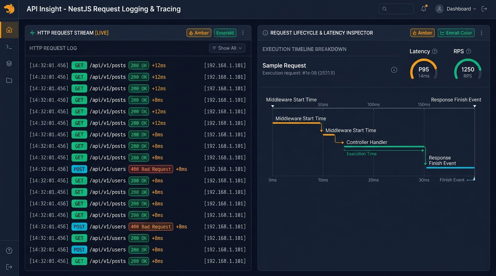
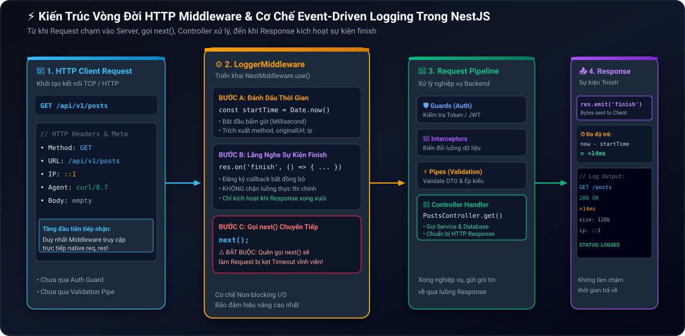
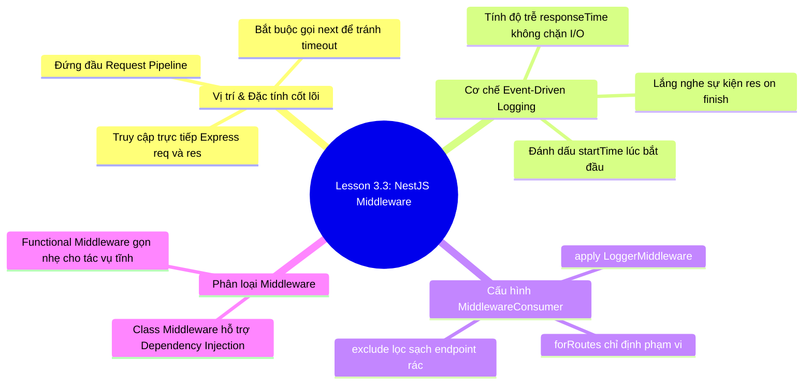

# Lesson 3.3: Middleware — Viết LoggerMiddleware Tự Động Log HTTP Request

<p align="center">
  
  
  
  
  
</p>

<p align="center">
  
</p>

---

> [!NOTE]
> ⏱️ **Thời lượng:** 10 – 12 phút thực chiến  
> 🎯 **Mục tiêu:** Thấu hiểu vị trí độc nhất của Middleware trong Vòng đời Request (Request Lifecycle) của NestJS; tự tay xây dựng `LoggerMiddleware` theo chuẩn `NestMiddleware` interface để tự động ghi vết HTTP Method, URL, Status Code, IP Address và Execution Time (ms); phân biệt Class Middleware và Functional Middleware; làm chủ kỹ thuật đăng ký và loại trừ endpoint với `MiddlewareConsumer`, `forRoutes()` và `exclude()`.

---

## 1. Bản Chất Middleware & Vị Trí Trong Request Pipeline

Trong hệ thống Backend thực tế, mỗi giây có hàng ngàn HTTP Request gửi đến máy chủ. Nếu không có cơ chế ghi log tự động, đội ngũ kỹ thuật sẽ hoàn toàn "mù thông tin" khi hệ thống gặp sự cố: _Không biết ai đã gọi API nào, gọi từ IP nào, phản hồi thành công hay thất bại, và mất bao nhiêu miligiây để xử lý._

### 📱 Sản Phẩm Thực Tế & Dashboard Giám Sát HTTP Request

Dưới đây là giao diện bảng điều khiển giám sát API (Observability Dashboard) mà dữ liệu từ `LoggerMiddleware` sẽ trực tiếp cung cấp:

<p align="center">
  
</p>

Nhìn vào màn hình quan sát ở trên, hai giá trị cốt lõi của LoggerMiddleware được thể hiện rõ ràng:

- 🟢 **HTTP Request Stream (Phía Trái):** Ghi vết tức thì từng lượt truy cập với Method, Path, Status Code (`200 OK`, `400 Bad Request`), Client IP và thời gian phản hồi chuẩn xác (`+12ms`, `+8ms`).
- ⏱️ **Lifecycle & Latency Inspector (Phía Phải):** Đo đạc chính xác tổng thời gian từ lúc Request chạm vào tầng Middleware đầu tiên cho đến khi Response phát sự kiện kết thúc (`finish`).

---

### ⚖️ So Sánh 5 Thành Phần Cốt Lõi Trong NestJS Request Pipeline

NestJS cung cấp 5 lớp xử lý theo thứ tự nghiêm ngặt. Hiểu rõ bảng so sánh này giúp bạn chọn đúng công cụ, tránh dùng nhầm lẫn:

| Thành phần              | Vị trí thực thi                   | Quyền truy cập `req`, `res`, `next` | Trường hợp sử dụng chính                                                  |
| :---------------------- | :-------------------------------- | :---------------------------------: | :------------------------------------------------------------------------ |
| **🛡️ Middleware**       | **Đầu tiên (Trước tất cả)**       |     ✅ **Có (Express Native)**      | **Logging, CORS, Compression, Rate Limiting, Body Parser.**               |
| **🔐 Guard**            | Sau Middleware, trước Interceptor |     ❌ Dùng `ExecutionContext`      | Xác thực danh tính (Authentication) & Kiểm tra quyền hạn (Authorization). |
| **🔄 Interceptor**      | Xung quanh Controller Handler     |       ❌ Dùng RxJS Observable       | Chuyển đổi dữ liệu Response (Transform Payload), Cache, Timeout.          |
| **⚡ Pipe**             | Trước Controller Handler          |     ❌ Dùng `ArgumentMetadata`      | Validate dữ liệu DTO, chuyển đổi kiểu dữ liệu (ParseInt, Type Casting).   |
| **🚨 Exception Filter** | Khi có lỗi quăng ra (Throw Error) |       ❌ Dùng `ArgumentsHost`       | Chuẩn hóa định dạng JSON phản hồi lỗi (4xx, 5xx) về Client.               |

> [!IMPORTANT]
> **Điểm khác biệt sống còn của Middleware:**  
> Middleware là thành phần **duy nhất** chạy ở tầng HTTP Engine gốc (Express/Fastify) và có quyền truy cập trực tiếp vào đối tượng gốc `req: Request` và `res: Response`. Do đó, Middleware là nơi lý tưởng nhất để thực hiện các tác vụ hạ tầng như ghi log, đo thời gian xử lý và gắn header bảo mật.

---

## 2. Kiến Trúc Vòng Đời Middleware & Cơ Chế Event-Driven Logging

### 🧩 Sơ Đồ Luồng Xử Lý Của `LoggerMiddleware`

Để đo được chính xác thời gian xử lý của một API (Response Time), Middleware áp dụng cơ chế **Event-Driven (Lắng nghe sự kiện)** bất đồng bộ, không hề làm chậm luồng xử lý chính:

<p align="center">
  
</p>

Quy trình vận hành gồm 4 bước liền mạch:

1. **Request Ingestion:** Request từ Client chạm vào `LoggerMiddleware`. Middleware ghi nhận mốc thời gian bắt đầu `const startTime = Date.now()` và trích xuất thông tin IP, Method, URL.
2. **Event Registration:** Đăng ký hàm callback lắng nghe sự kiện `res.on('finish', ...)`. Sự kiện này **chỉ kích hoạt sau khi toàn bộ dữ liệu phản hồi đã được truyền xong về Client**.
3. **Yield Control (`next()`):** Middleware gọi `next()` để chuyển giao quyền điều khiển cho Guards, Pipes, và Controller tiếp tục xử lý nghiệp vụ.
4. **Finish & Log:** Khi Response hoàn tất, sự kiện `finish` phát ra. Callback được kích hoạt, tính toán độ trễ `Date.now() - startTime` và in dòng log chuyên nghiệp ra Terminal.

---

## 3. Hướng Dẫn Thực Hành Step-by-Step

### 📂 Cấu Trúc Mã Nguồn Triển Khai

```
src/
├── common/
│   └── middleware/
│       └── logger.middleware.ts    👈 Class Middleware chuẩn NestMiddleware
├── posts/                          👈 Module Posts (Controller & Service)
├── users/                          👈 Module Users (Controller & Service)
├── app.module.ts                   👈 Cấu hình MiddlewareConsumer (apply, forRoutes, exclude)
└── main.ts                         👈 Điểm khởi chạy ứng dụng
```

---

### 📌 Bước 1: Xây Dựng `LoggerMiddleware` Chuẩn `NestMiddleware`

Tạo file `src/shared/middleware/logger.middleware.ts` triển khai interface `NestMiddleware`:

📄 **`src/shared/middleware/logger.middleware.ts`**

```typescript
import { Injectable, Logger, NestMiddleware } from '@nestjs/common';
import { NextFunction, Request, Response } from 'express';

@Injectable()
export class LoggerMiddleware implements NestMiddleware {
  // Tạo Logger instance với ngữ cảnh 'HTTP' giúp hiển thị nhãn đẹp mắt trong Terminal
  private readonly logger = new Logger('HTTP');

  use(req: Request, res: Response, next: NextFunction): void {
    const { ip, method, originalUrl } = req;
    const userAgent = req.get('user-agent') || 'Unknown Agent';
    const startTime = Date.now();

    // Lắng nghe sự kiện khi HTTP Response hoàn tất truyền dữ liệu về Client
    res.on('finish', () => {
      const { statusCode } = res;
      const contentLength = res.get('content-length') || 0;
      const responseTime = Date.now() - startTime;

      // Chuẩn hóa định dạng log chuyên nghiệp
      const logMessage = `${method} ${originalUrl} ${statusCode} ${contentLength}b - +${responseTime}ms [IP: ${ip}] [Agent: ${userAgent}]`;

      // Phân cấp màu sắc cảnh báo dựa theo HTTP Status Code
      if (statusCode >= 500) {
        this.logger.error(logMessage);
      } else if (statusCode >= 400) {
        this.logger.warn(logMessage);
      } else {
        this.logger.log(logMessage);
      }
    });

    // ⚠️ QUY TẮC SINH TỬ: Bắt buộc gọi next() để Request không bị treo Timeout!
    next();
  }
}
```

> [!CAUTION]
> **Cảnh báo sinh tử về `next()`:**  
> Nếu bạn quên gọi `next()`, Request của người dùng sẽ bị kẹt lại vĩnh viễn ở Middleware và trình duyệt sẽ bị xoay tròn vô tận cho đến khi dính lỗi `504 Gateway Timeout`!

---

### 📌 Bước 2: Đăng Ký Middleware Trong Module (`AppModule`)

Trong NestJS, Middleware không đăng ký trong mảng `providers` mà được cấu hình thông qua phương thức `configure()` của interface `NestModule`:

📄 **`src/app.module.ts`**

```typescript
import {
  MiddlewareConsumer,
  Module,
  NestModule,
  RequestMethod,
} from '@nestjs/common';
import { LoggerMiddleware } from './common/middleware/logger.middleware';
import { PostsModule } from './posts/posts.module';
import { UsersModule } from './users/users.module';

@Module({
  imports: [PostsModule, UsersModule],
})
export class AppModule implements NestModule {
  configure(consumer: MiddlewareConsumer) {
    consumer
      .apply(LoggerMiddleware)
      // 1. Loại trừ các endpoint không cần ghi log (tránh rác log từ Healthcheck của K8s / AWS)
      .exclude(
        { path: 'health', method: RequestMethod.GET },
        { path: 'api/v1/health', method: RequestMethod.GET },
      )
      // 2. Áp dụng LoggerMiddleware cho toàn bộ các routes còn lại trong hệ thống
      .forRoutes('*');
  }
}
```

---

### 💡 Mở Rộng: Khi Nào Dùng Functional Middleware?

Nếu Middleware của bạn hoàn toàn đơn giản, không cần tiêm phụ thuộc (Dependency Injection), bạn có thể viết dạng **Functional Middleware** trực tiếp bằng hàm:

📄 **`src/shared/middleware/simple-logger.middleware.ts`**

```typescript
import { NextFunction, Request, Response } from 'express';

export function simpleLogger(req: Request, res: Response, next: NextFunction) {
  console.log(`[Fast Logger] ${req.method} ${req.originalUrl}`);
  next();
}
```

Đăng ký nhanh chóng trong `src/main.ts` bằng `app.use()`:

```typescript
// Gắn Functional Middleware toàn cục trực tiếp tại bootstrap
app.use(simpleLogger);
```

| Tiêu chí                 | 🏛️ Class Middleware (`NestMiddleware`)                             | ⚡ Functional Middleware (`app.use`)           |
| :----------------------- | :----------------------------------------------------------------- | :--------------------------------------------- |
| **Dependency Injection** | ✅ **Hỗ trợ đầy đủ** (có thể inject Service, Config).              | ❌ Không hỗ trợ DI.                            |
| **Phạm vi áp dụng**      | Linh hoạt qua `forRoutes()`, `exclude()`, áp dụng theo Controller. | Toàn cục cho toàn bộ ứng dụng.                 |
| **Khuyên dùng khi**      | **Logging nâng cao, Auth Middleware, Audit Log.**                  | **Tác vụ siêu nhẹ, CORS cơ bản, Header tĩnh.** |

---

## 4. Kịch Bản Kiểm Tra & Thử Nghiệm (Hands-on Lab)

Khởi động ứng dụng NestJS của bạn:

```bash
pnpm start:dev
```

Mở một cửa sổ Terminal mới và gửi các yêu cầu HTTP để kiểm chứng hoạt động của bộ ghi vết:

---

### 🟢 Kịch Bản 1: Thành Công — Request Hợp Lệ (`200 OK`)

Gửi request lấy danh sách bài viết:

```bash
curl -i -X GET http://localhost:3000/api/v1/posts
```

🖥️ **Dòng Log xuất hiện tức thì tại Terminal chạy Server:**

```text
[Nest] 51240  - 11/09/2026, 14:32:01     LOG [HTTP] GET /api/v1/posts 200 128b - +12ms [IP: ::1] [Agent: curl/8.7.1]
```

> [!NOTE]
> **Phân tích dòng log:**
>
> - Tag `[HTTP]` hiển thị màu xanh lá cây (`LOG`).
> - Đo chính xác độ trễ xử lý `+12ms`.
> - Kích thước gói tin trả về `128b` và định danh Client `IP: ::1`.

---

### 🟡 Kịch Bản 2: Bắt Lỗi Validation — Cảnh Báo Màu Vàng (`400 Bad Request`)

Gửi request tạo User với payload vi phạm ràng buộc DTO:

```bash
curl -i -X POST http://localhost:3000/api/v1/users \
  -H "Content-Type: application/json" \
  -d '{"email": "email-sai-dinh-dang"}'
```

🖥️ **Dòng Log cảnh báo xuất hiện tại Terminal Server:**

```text
[Nest] 51240  - 11/09/2026, 14:32:05    WARN [HTTP] POST /api/v1/users 400 185b - +8ms [IP: ::1] [Agent: curl/8.7.1]
```

✅ **Kết quả:** `LoggerMiddleware` tự động phát hiện mã lỗi `400` và chuyển đổi cấp độ log sang **`WARN`** (màu vàng), giúp kỹ sư phát hiện ngay các request bất thường.

---

### ⚪ Kịch Bản 3: Kiểm Chứng Loại Trừ Route (`exclude()`)

Gửi request kiểm tra tình trạng sức khỏe hệ thống:

```bash
curl -i -X GET http://localhost:3000/api/v1/health
```

🖥️ **Kết quả quan sát tại Terminal Server:**

- **Hoàn toàn im lặng, không có bất kỳ dòng log `[HTTP]` nào xuất hiện.**
- ✅ **Kết luận:** Hàm `.exclude()` đã lọc sạch các truy vấn thăm dò tự động của Kubernetes / Load Balancer, giữ cho log hệ thống luôn sạch sẽ và tập trung vào các luồng nghiệp vụ quan trọng.

---

## 5. Tổng Kết Bài Học & Checklist Ghi Nhớ



### ✅ Checklist Ghi Nhớ Bài Học:

- [x] Hiểu rõ vị trí của Middleware trong Request Pipeline (thực thi trước Guards, Interceptors, Pipes).
- [x] Nắm vững lý do Middleware là thành phần duy nhất truy cập được native `req`, `res` của Express.
- [x] Tự tay xây dựng `LoggerMiddleware` triển khai `NestMiddleware` interface và hàm `use()`.
- [x] Làm chủ cơ chế lắng nghe sự kiện `res.on('finish')` để đo thời gian phản hồi (ms) mà không làm nghẽn luồng.
- [x] Luôn ghi nhớ gọi `next()` để tránh làm treo ứng dụng.
- [x] Cấu hình thành thạo `MiddlewareConsumer` với `apply()`, `forRoutes('*')` và loại trừ endpoint bằng `.exclude()`.
- [x] Phân biệt chính xác trường hợp sử dụng Class Middleware vs Functional Middleware.

---

👉 **Bài tiếp theo:** [Lesson 3.4: Exception Filters — Viết HttpExceptionFilter Chuẩn Hóa JSON Thông Báo Lỗi Toàn Cục](../lesson-3.4/lesson-3.4.md)
