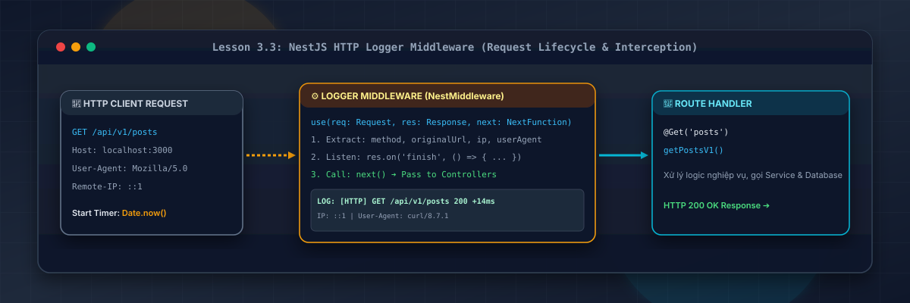
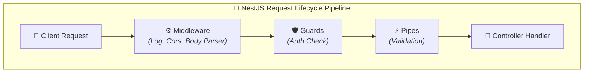
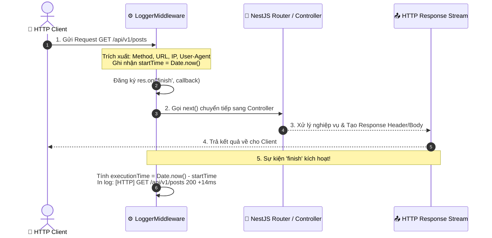

# Lesson 3.3: Middleware — Viết LoggerMiddleware Tự Động Log HTTP Request

<p align="center">
  
  
  
  
  
</p>

<p align="center">
  
</p>

---

> [!NOTE]
> ⏱️ **Thời lượng dự kiến:** 10 – 12 phút  
> 🎯 **Mục tiêu bài học:** Thấu hiểu khái niệm và vị trí của Middleware trong Vòng đời Request (Request Lifecycle) của NestJS; tự tay xây dựng `LoggerMiddleware` theo chuẩn `NestMiddleware` interface để tự động ghi vết HTTP Method, URL, Status Code, IP Address và Execution Time (ms); làm chủ kỹ thuật đăng ký Middleware toàn cục hoặc áp dụng linh hoạt cho từng Route/Controller với `MiddlewareConsumer`, `forRoutes()` và `exclude()`.

---

## 1. Tại Sao Ứng Dụng Enterprise Cần HTTP Middleware?

### 💡 Ẩn Dụ Thực Tế: Trạm Thu Phí Tự Động Trên Đường Cao Tốc

Hãy tưởng tượng tuyến đường cao tốc đi vào trung tâm thành phố (ứng dụng NestJS của bạn):

- Mọi xe ô tô (HTTP Request) muốn truy cập vào thành phố đều phải chạy qua **Trạm Thu Phí / Đăng Kiểm (Middleware)**.
- Tại trạm này, thiết bị sẽ tự động ghi lại **Biển số xe (IP Address)**, **Loại xe (User-Agent)**, **Giờ vào trạm (Timestamp)** và **Làn đường muốn đi (HTTP Method & URL)** trước khi cho phép xe đi tiếp (`next()`).

Nếu hệ thống Backend không có Middleware ghi log, khi xảy ra sự cố (như bị tấn công DDoS, API bị treo hoặc nghi vấn rò rỉ dữ liệu), bạn sẽ hoàn toàn "mù thông tin" vì không biết ai đã gọi API nào, lúc mấy giờ và mất bao nhiêu miligiây để xử lý!



---

### 🔹 So Sánh Các Thành Phần Trong NestJS Request Pipeline

| Thành phần           | Vị trí thực thi                     | Mục đích sử dụng chính                                     | Có truy cập `req`, `res`, `next()` không? |
| :------------------- | :---------------------------------- | :--------------------------------------------------------- | :---------------------------------------: |
| **Middleware**       | **Đầu tiên (Trước Guards & Pipes)** | Logging, CORS, Compression, Session, Body Parsing          |        ✅ **Có (Express Native)**         |
| **Guard**            | Sau Middleware, trước Pipe          | Xác thực (Authentication) & Phân quyền (Authorization)     |        ❌ Dùng `ExecutionContext`         |
| **Pipe**             | Trước Controller Handler            | Validate & Transform DTO Payload                           |        ❌ Dùng `ArgumentMetadata`         |
| **Interceptor**      | Xung quanh Controller Handler       | Transform Response, Caching, Log Execution Time chuyên sâu |          ❌ Dùng RxJS Observable          |
| **Exception Filter** | Khi có lỗi xảy ra                   | Chuẩn hóa JSON Response lỗi (4xx, 5xx)                     |          ❌ Dùng `ArgumentsHost`          |

---

## 2. Vòng Đời Xử Lý Của LoggerMiddleware

NestJS Middleware về bản chất tương thích hoàn toàn với Express Middleware. Đối với bài toán Logging, chúng ta sẽ bắt thời điểm **Request bắt đầu** và lắng nghe sự kiện `finish` của `Response` để tính toán thời gian phản hồi:



---

## 3. Hướng Dẫn Thực Hành Step-by-Step — Viết & Đăng Ký LoggerMiddleware

### 📌 Bước 1: Xây Dựng `LoggerMiddleware` Class

Tạo tệp `src/common/middleware/logger.middleware.ts` và triển khai interface `NestMiddleware`:

📄 **`src/common/middleware/logger.middleware.ts`**

```typescript
import { Injectable, Logger, NestMiddleware } from '@nestjs/common';
import { NextFunction, Request, Response } from 'express';

@Injectable()
export class LoggerMiddleware implements NestMiddleware {
  // Khởi tạo Logger instance với context 'HTTP' để phân biệt log trong Terminal
  private readonly logger = new Logger('HTTP');

  use(req: Request, res: Response, next: NextFunction): void {
    const { ip, method, originalUrl } = req;
    const userAgent = req.get('user-agent') || 'Unknown User-Agent';
    const startTime = Date.now();

    // Lắng nghe sự kiện khi HTTP Response hoàn tất truyền dữ liệu về Client
    res.on('finish', () => {
      const { statusCode } = res;
      const contentLength = res.get('content-length') || 0;
      const responseTime = Date.now() - startTime;

      // Định dạng dòng log chuyên nghiệp
      const logMessage = `${method} ${originalUrl} ${statusCode} ${contentLength}b - +${responseTime}ms [IP: ${ip}] [Agent: ${userAgent}]`;

      // Phân loại màu sắc/level log dựa trên Status Code
      if (statusCode >= 500) {
        this.logger.error(logMessage);
      } else if (statusCode >= 400) {
        this.logger.warn(logMessage);
      } else {
        this.logger.log(logMessage);
      }
    });

    // ⚠️ BẮT BỘC: Gọi next() để Yêu cầu không bị treo mãi mãi ở Middleware
    next();
  }
}
```

> [!IMPORTANT]
> **Lưu ý sinh tử:**Luôn phải gọi `next()` ở cuối phương thức `use()`. Nếu quên `next()`, Request của người dùng sẽ bị kẹt lại vĩnh viễn ở Middleware và rơi vào trạng thái Timeout!

---

### 📌 Bước 2: Đăng Ký Middleware Trong Module (`AppModule`)

Trong NestJS, Middleware **không đăng ký** qua mảng `providers` hay `imports`, mà được cấu hình thông qua phương thức `configure()` của interface `NestModule`:

📄 **`src/app.module.ts`**

```typescript
import {
  MiddlewareConsumer,
  Module,
  NestModule,
  RequestMethod,
} from '@nestjs/common';
import { LoggerMiddleware } from './common/middleware/logger.middleware';
import { PostsV1Controller } from './posts/posts-v1.controller';
import { PostsV2Controller } from './posts/posts-v2.controller';
import { UsersController } from './users/users.controller';

@Module({
  controllers: [PostsV1Controller, PostsV2Controller, UsersController],
})
export class AppModule implements NestModule {
  configure(consumer: MiddlewareConsumer) {
    consumer
      .apply(LoggerMiddleware)
      // 1. Loại trừ các endpoint không cần ghi log (như Healthcheck hoặc Static files)
      .exclude(
        { path: 'health', method: RequestMethod.GET },
        { path: 'api/v1/health', method: RequestMethod.GET },
      )
      // 2. Áp dụng LoggerMiddleware cho TẤT CẢ các routes còn lại
      .forRoutes('*');
  }
}
```

---

### 📌 Mở Rộng: Functional Middleware (Middleware Dạng Hàm Đơn Giản)

Nếu Middleware của bạn cực kỳ đơn giản, không phụ thuộc vào bất kỳ Service nào (Dependency Injection), bạn có thể viết dạng **Functional Middleware** ngắn gọn hơn:

📄 **`src/common/middleware/simple-logger.middleware.ts`**

```typescript
import { NextFunction, Request, Response } from 'express';

export function simpleLogger(req: Request, res: Response, next: NextFunction) {
  console.log(`[Functional Logger] Request incoming: ${req.method} ${req.url}`);
  next();
}
```

Đăng ký Functional Middleware trực tiếp trong `main.ts`:
📄 **`src/main.ts`**

```typescript
import { simpleLogger } from './common/middleware/simple-logger.middleware';

async function bootstrap() {
  const app = await NestFactory.create(AppModule);

  // Đăng ký functional middleware toàn cục cho toàn bộ ứng dụng
  app.use(simpleLogger);

  await app.listen(3000);
}
bootstrap();
```

---

## 4. Kịch Bản Kiểm Tra & Thử Nghiệm (Hands-on Lab)

### 🟢 Kịch Bản 1: Thành Công — Ghi Log Tự Động Cho Các API Hit Vào Server

Khởi động ứng dụng NestJS (`pnpm start:dev`) và mở một Terminal khác để gửi các yêu cầu cURL:

#### 1. Gửi request thành công (`200 OK`):

```bash
curl -X GET http://localhost:3000/api/v1/posts
```

🖥️ **Kết quả ghi vết tại Terminal chạy NestJS Server:**

```text
[Nest] 48210  - 13/08/2026, 14:00:00     LOG [HTTP] GET /api/v1/posts 200 128b - +12ms [IP: ::1] [Agent: curl/8.7.1]
```

#### 2. Gửi request lỗi do validation (`400 Bad Request`):

```bash
curl -X POST http://localhost:3000/api/v1/users \
  -H "Content-Type: application/json" \
  -d '{"email": "sai-dinh-dang"}'
```

🖥️ **Kết quả ghi vết tại Terminal chạy NestJS Server (Cảnh báo mảng màu vàng `WARN`):**

```text
[Nest] 48210  - 13/08/2026, 14:00:05    WARN [HTTP] POST /api/v1/users 400 185b - +8ms [IP: ::1] [Agent: curl/8.7.1]
```

✅ **Kết quả:** `LoggerMiddleware` tự động tính toán thời gian phản hồi từng millisecond và phân loại mức độ quan trọng (`LOG` vs `WARN`) dựa trên Status Code!

---

### 🔴 Kịch Bản 2: Kiểm Thử Route Được Loại Trừ (`exclude()`)

Thử gửi yêu cầu tới Endpoint `/api/v1/health` đã được cấu hình trong hàm `.exclude()`:

```bash
curl -X GET http://localhost:3000/api/v1/health
```

🖥️ **Kết quả quan sát tại Terminal Server:**

- **Không có bất kỳ dòng log `[HTTP]` nào xuất hiện.**
  ✅ **Kết quả:** Hàm `.exclude()` hoạt động chính xác, giúp lọc sạch log rác từ các cuộc gọi kiểm tra sức khỏe tự động (Healthcheck Polling) của Kubernetes / AWS Load Balancer!

---

## 5. Tổng Kết Bài Học & Checklist Ghi Nhớ

```mermaid
mindmap
  root(("NestJS Middleware"))
    "Đặc tính cốt lõi"
      "Chạy ở đầu Request Pipeline"
      "Truy cập req, res, next()"
      "Bắt buộc phải gọi next()"
    "Hình thức triển khai"
      "Class Middleware (NestMiddleware)"
      "Functional Middleware (Hàm đơn giản)"
    "Cấu hình MiddlewareConsumer"
      "apply(LoggerMiddleware)"
      "forRoutes('*' hoặc Controller)"
      "exclude('health', ...)"
    "Tính năng của LoggerMiddleware"
      "Đo thời gian phản hồi (ms)"
      "Trích xuất IP, User-Agent, Status Code"
      "Lắng nghe res.on('finish')"
```

### ✅ Checklist Ghi Nhớ Bài Học:

- [x] Nắm vững vị trí của Middleware trong Request Pipeline (thực thi trước Guards, Pipes, Interceptors).
- [x] Tạo thành công `LoggerMiddleware` triển khai `NestMiddleware` interface.
- [x] Lắng nghe sự kiện `res.on('finish')` để tính toán chính xác Response Time (ms).
- [x] Đăng ký Middleware trong `AppModule` với `MiddlewareConsumer` và `forRoutes('*')`.
- [x] Làm chủ kỹ thuật loại trừ Route ghi log không cần thiết với `.exclude()`.
- [x] Phân biệt được khi nào dùng Class Middleware và Functional Middleware (`app.use()`).

---

👉 **Bài tiếp theo:** [Lesson 3.4: Exception Filters — Viết HttpExceptionFilter Chuẩn Hóa JSON Thông Báo Lỗi](../lesson-3.4/lesson-3.4.md)
