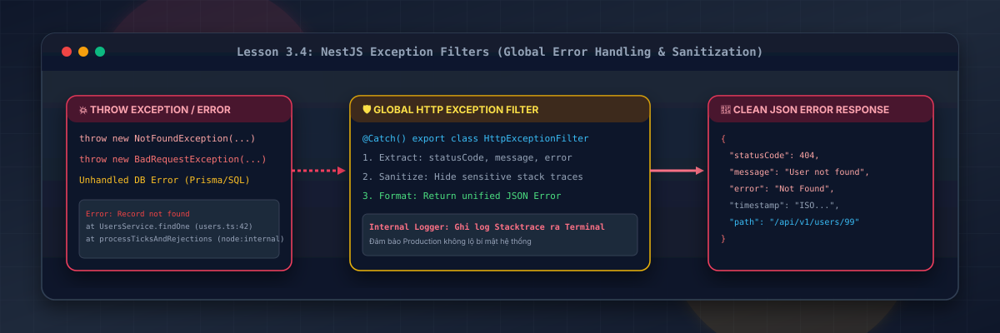
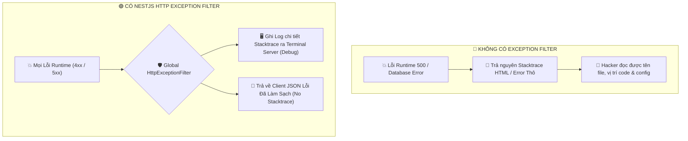
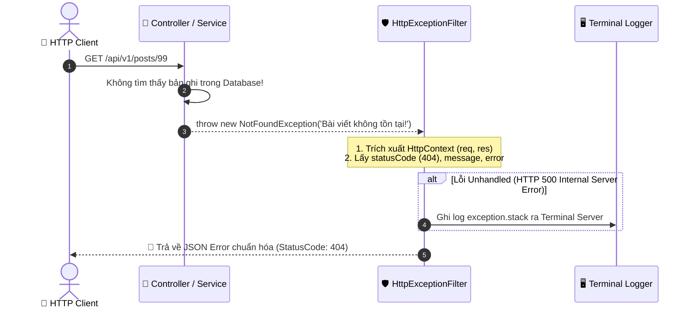

# Lesson 3.4: Exception Filters — Viết HttpExceptionFilter Chuẩn Hóa JSON Thông Báo Lỗi Toàn Cục

<p align="center">
  
  
  
  
  
</p>

<p align="center">
  
</p>

---

> [!NOTE]
> ⏱️ **Thời lượng dự kiến:** 12 – 15 phút  
> 🎯 **Mục tiêu bài học:** Thấu hiểu cơ chế xử lý ngoại lệ (Exception Handling) của NestJS và vị trí của Exception Filter; phân biệt các `HttpException` có sẵn trong `@nestjs/common` (`NotFoundException`, `BadRequestException`, `ForbiddenException`,...); tự tay xây dựng `HttpExceptionFilter` chuẩn hóa toàn bộ JSON Error (4xx, 5xx), bảo mật thông tin bằng cách giấu kín stack trace khỏi Client và ghi log vết nội bộ; đăng ký bộ lọc lỗi toàn cục với `app.useGlobalFilters()`.

---

## 1. Tại Sao Ứng Dụng Enterprise Cần Chuẩn Hóa Lỗi API?

### 💡 Ẩn Dụ Thực Tế: Phòng Cấp Cứu Bệnh Viện & Lỗ Hổng Rò Rỉ Thông Tin (Information Disclosure)

Hãy hình dung ứng dụng Backend của bạn như một **Bệnh Viện**:

- Khi có bệnh nhân (HTTP Request) gặp sự cố hoặc triệu chứng bất thường (Lỗi Runtime / Dữ liệu sai), ứng dụng cần được chuyển tới **Phòng Cấp Cứu (Exception Filter)** để phân loại và xử lý.
- Nếu không có Exception Filter chuẩn hóa, khi gặp sự cố nghiêm trọng (như sập kết nối Database), Server có thể trả về cho Client nguyên một trang HTML chứa **Stack Trace** (chi tiết dòng code, tên file, mật khẩu CSDL trong biến môi trường).

Đây là lỗ hổng bảo mật cực kỳ nguy hiểm có tên **Information Disclosure** (Bại lộ thông tin hệ thống), giúp Hacker dễ dàng khai thác kiến trúc bên trong của bạn!



---

### 🔹 Cấu Trúc JSON Error Chuẩn Enterprise

Để Frontend (React, Vue, Flutter, iOS) dễ dàng bắt và hiển thị thông báo lỗi thân thiện cho người dùng, toàn bộ các lỗi trong hệ thống sẽ được đóng gói theo đúng **1 cấu trúc duy nhất**:

```json
{
  "statusCode": 404,
  "message": "Không tìm thấy bài viết với ID 99!",
  "error": "Not Found",
  "timestamp": "2026-08-13T15:00:00.000Z",
  "path": "/api/v1/posts/99"
}
```

---

## 2. Vòng Đời Bắt Lỗi Của Exception Filter Trong NestJS

NestJS có sẵn một **Global Exception Layer** mặc định. Tuy nhiên, khi bạn tự viết một `HttpExceptionFilter` custom với decorator `@Catch()`, bạn sẽ nắm toàn quyền kiểm soát quá trình phản hồi lỗi:



---

## 3. Hướng Dẫn Thực Hành Step-by-Step — Viết & Đăng Ký HttpExceptionFilter

### 📌 Bước 1: Tìm Hiểu Các `HttpException` Có Sẵn Trong NestJS

NestJS cung cấp sẵn các Class kế thừa từ `HttpException` nằm trong `@nestjs/common`. Bạn chỉ cần `throw` chúng trực tiếp trong Controller hoặc Service:

| Class Exception                | HTTP Status Code | Ý nghĩa sử dụng                                          |
| :----------------------------- | :--------------: | :------------------------------------------------------- |
| `BadRequestException`          |      `400`       | Dữ liệu đầu vào vi phạm DTO / Validation.                |
| `UnauthorizedException`        |      `401`       | Chưa đăng nhập / JWT Token không hợp lệ.                 |
| `ForbiddenException`           |      `403`       | Đã đăng nhập nhưng không đủ quyền hạn (Role/Permission). |
| `NotFoundException`            |      `404`       | Không tìm thấy bản ghi / tài nguyên yêu cầu.             |
| `ConflictException`            |      `409`       | Dữ liệu bị trùng lặp (ví dụ Email đã tồn tại).           |
| `InternalServerErrorException` |      `500`       | Lỗi sập hệ thống / CSDL không lường trước.               |

---

### 📌 Bước 2: Xây Dựng Class `HttpExceptionFilter`

Tạo tệp `src/shared/filters/http-exception.filter.ts` và triển khai `ExceptionFilter`:

📄 **`src/shared/filters/http-exception.filter.ts`**

```typescript
import {
  ArgumentsHost,
  Catch,
  ExceptionFilter,
  HttpException,
  HttpStatus,
  Logger,
} from '@nestjs/common';
import { Request, Response } from 'express';

// Decorator @Catch() không truyền tham số có nghĩa là bắt TẤT CẢ mọi loại ngoại lệ (Catch-All)
@Catch()
export class HttpExceptionFilter implements ExceptionFilter {
  private readonly logger = new Logger(HttpExceptionFilter.name);

  catch(exception: unknown, host: ArgumentsHost) {
    const ctx = host.switchToHttp();
    const response = ctx.getResponse<Response>();
    const request = ctx.getRequest<Request>();

    // 1. Phân loại Status Code: Nếu là HttpException lấy từ exception, ngược lại gán 500
    const status =
      exception instanceof HttpException
        ? exception.getStatus()
        : HttpStatus.INTERNAL_SERVER_ERROR;

    // 2. Trích xuất thông báo lỗi và kiểu lỗi
    let message: string | string[] = 'Lỗi hệ thống nội bộ!';
    let error = 'Internal Server Error';

    if (exception instanceof HttpException) {
      const res = exception.getResponse();
      if (typeof res === 'object' && res !== null) {
        const resObj = res as Record<string, any>;
        message = resObj.message || exception.message;
        error = resObj.error || exception.name;
      } else {
        message = res;
      }
    } else if (exception instanceof Error) {
      // ⚠️ ĐỐI VỚI LỖI 500: Ghi log chi tiết stack trace ra Terminal để Developer debug
      this.logger.error(
        `[Unhandled Exception] ${exception.message}`,
        exception.stack,
      );
    }

    // 3. Chuẩn hóa định dạng Response JSON gửi về cho Client (Tuyệt đối KHÔNG chứa stacktrace)
    const errorResponse = {
      statusCode: status,
      message,
      error,
      timestamp: new Date().toISOString(),
      path: request.originalUrl,
    };

    response.status(status).json(errorResponse);
  }
}
```

> [!IMPORTANT]
> **Điểm mấu chốt về Bảo mật:**
> Việc phân biệt `exception instanceof HttpException` giúp bạn **che giấu hoàn toàn** các lỗi CSDL (Prisma/PostgreSQL Error) hoặc lỗi Crash Code (Null Pointer) khỏi mắt người dùng Client. Server chỉ ghi vết ra Terminal và trả về cho Client mảng lỗi 500 an toàn!

---

### 📌 Bước 3: Đăng Ký `HttpExceptionFilter` Toàn Cục Trong `main.ts`

Mở file `src/main.ts` và đăng ký filter toàn cục:

📄 **`src/main.ts`**

```typescript
import { ValidationPipe, VersioningType } from '@nestjs/common';
import { NestFactory } from '@nestjs/core';
import { AppModule } from './app.module';
import { HttpExceptionFilter } from './common/filters/http-exception.filter';

async function bootstrap() {
  const app = await NestFactory.create(AppModule);

  app.setGlobalPrefix('api');

  app.enableVersioning({
    type: VersioningType.URI,
    prefix: 'v',
    defaultVersion: '1',
  });

  app.useGlobalPipes(
    new ValidationPipe({
      whitelist: true,
      forbidNonWhitelisted: true,
      transform: true,
    }),
  );

  // 🔴 Kích hoạt HttpExceptionFilter toàn cục
  app.useGlobalFilters(new HttpExceptionFilter());

  await app.listen(3000);
  console.log(`🚀 Server running on: http://localhost:3000/api/v1`);
}
bootstrap();
```

---

## 4. Kịch Bản Kiểm Tra & Thử Nghiệm (Hands-on Lab)

### 🔴 Kịch Bản 1: Kiểm Thử Lỗi Validation (`400 Bad Request`)

Gửi một Yêu cầu POST chứa dữ liệu sai DTO đến Server:

```bash
curl -X POST http://localhost:3000/api/v1/users \
  -H "Content-Type: application/json" \
  -d '{"email": "sai- dinh-dang"}'
```

📥 **Phản hồi HTTP nhận được từ Server (`400 Bad Request`):**

```json
{
  "statusCode": 400,
  "message": ["Email không đúng định dạng chuẩn!"],
  "error": "Bad Request",
  "timestamp": "2026-08-13T15:15:00.123Z",
  "path": "/api/v1/users"
}
```

✅ **Kết quả:** Lỗi Validation Pipe được tự động đóng gói theo chuẩn JSON nhất quán.

---

### 🔴 Kịch Bản 2: Kiểm Thử Lỗi Không Tìm Thấy Bản Ghi (`404 Not Found`)

Thêm một API cố tình throw `NotFoundException` trong Controller:

```typescript
@Get(':id')
getPostById(@Param('id') id: string) {
  if (id === '99') {
    throw new NotFoundException(`Không tìm thấy bài viết với ID ${id}!`);
  }
  return { id, title: 'Bài viết hợp lệ' };
}
```

Thực hiện gọi cURL:

```bash
curl -X GET http://localhost:3000/api/v1/posts/99
```

📥 **Phản hồi HTTP nhận được (`404 Not Found`):**

```json
{
  "statusCode": 404,
  "message": "Không tìm thấy bài viết với ID 99!",
  "error": "Not Found",
  "timestamp": "2026-08-13T15:15:05.456Z",
  "path": "/api/v1/posts/99"
}
```

---

### 🔴 Kịch Bản 3: Kiểm Thử Lỗi Crash Code / Database (`500 Internal Server Error`)

Thêm một API cố tình bị lỗi runtime (truy cập biến `undefined`):

```typescript
@Get('test-crash')
testCrash() {
  const user: any = null;
  return user.profile.name; // 💥 Quăng lỗi TypeError: Cannot read properties of null
}
```

Thực hiện gọi cURL:

```bash
curl -X GET http://localhost:3000/api/v1/posts/test-crash
```

📥 **Phản hồi HTTP trả về cho Client (`500 Internal Server Error` - Đã giấu Stacktrace):**

```json
{
  "statusCode": 500,
  "message": "Lỗi hệ thống nội bộ!",
  "error": "Internal Server Error",
  "timestamp": "2026-08-13T15:15:10.789Z",
  "path": "/api/v1/posts/test-crash"
}
```

🖥️ **Ghi vết nội bộ tại Terminal Server (Dành cho Developer debug):**

```text
[Nest] 51200  - 13/08/2026, 15:15:10   ERROR [HttpExceptionFilter] [Unhandled Exception] Cannot read properties of null (reading 'name')
TypeError: Cannot read properties of null (reading 'name')
    at PostsV1Controller.testCrash (/src/posts/posts-v1.controller.ts:45:21)
```

✅ **Kết quả:** Client chỉ nhận về JSON thông báo lỗi an toàn, còn Developer vẫn xem được chi tiết dòng code bị lỗi tại Terminal Server!

---

## 5. Tổng Kết Bài Học & Checklist Ghi Nhớ

```mermaid
mindmap
  root(("NestJS Exception Filters"))
    "Tầm quan trọng"
      "Chuẩn hóa JSON Error"
      "Bảo mật Information Disclosure"
      "Giấu kín Stacktrace khỏi Client"
    "HttpException có sẵn"
      "BadRequestException (400)"
      "UnauthorizedException (401)"
      "ForbiddenException (403)"
      "NotFoundException (404)"
      "InternalServerErrorException (500)"
    "Triển khai HttpExceptionFilter"
      "Triển khai ExceptionFilter interface"
      "Sử dụng @Catch() bắt Catch-All"
      "Phân biệt 4xx vs 5xx Unhandled"
      "Ghi log stacktrace ra Terminal"
    "Đăng ký"
      "app.useGlobalFilters(new HttpExceptionFilter())"
```

### ✅ Checklist Ghi Nhớ Bài Học:

- [x] Thấu hiểu tầm quan trọng của Exception Filter trong việc ngăn chặn rò rỉ Stack Trace hệ thống.
- [x] Sử dụng thành thạo các class `HttpException` có sẵn trong `@nestjs/common`.
- [x] Triển khai thành công `HttpExceptionFilter` chuẩn hóa JSON Error chứa `statusCode`, `message`, `error`, `timestamp`, `path`.
- [x] Phân loại được lỗi Client (4xx) và lỗi Server Unhandled (500) để ghi log debug thích hợp.
- [x] Đăng ký thành công Exception Filter toàn cục trong `main.ts`.
- [x] Thử nghiệm thành công cURL cho cả 3 kịch bản lỗi Validation (400), Not Found (404) và Server Crash (500).

---

👉 **Bài tiếp theo:** [Lesson 3.5: Interceptors — TransformInterceptor (Chuẩn Hóa Success Response) & Logging Performance](../lesson-3.5/lesson-3.5.md)
