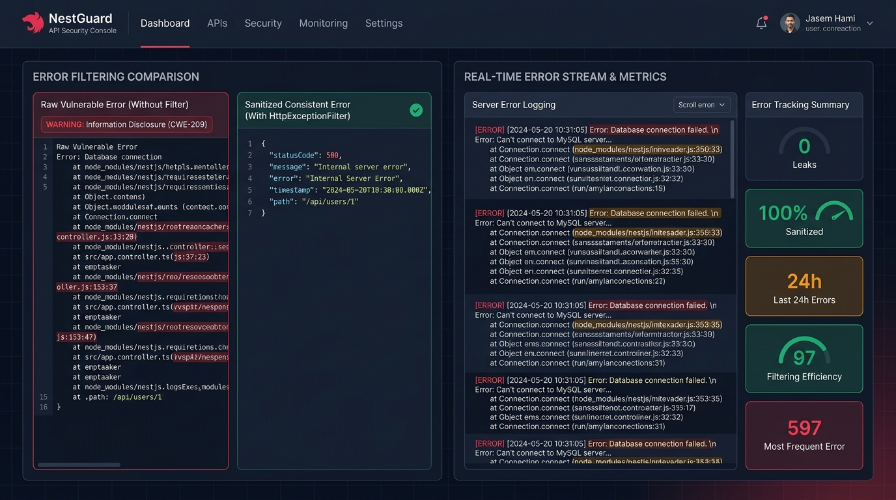
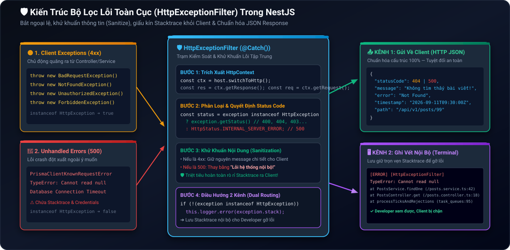

# Lesson 3.4: Exception Filters — Viết HttpExceptionFilter Chuẩn Hóa JSON Thông Báo Lỗi Toàn Cục

<p align="center">
  
  
  
  
  
</p>

<p align="center">
  
</p>

---

> [!NOTE]
> ⏱️ **Thời lượng:** 10 – 12 phút thực chiến  
> 🎯 **Mục tiêu:** Thấu hiểu cơ chế xử lý ngoại lệ (Exception Handling) của NestJS và vai trò của Exception Filter; phân biệt các class `HttpException` có sẵn trong `@nestjs/common` (`NotFoundException`, `BadRequestException`, `ForbiddenException`,...); tự tay xây dựng `HttpExceptionFilter` chuẩn hóa toàn bộ JSON Error (4xx, 5xx), bảo mật thông tin bằng cách khử khuẩn (Sanitize) giấu kín stack trace khỏi Client và lưu log vết chi tiết nội bộ; kích hoạt bộ lọc lỗi toàn cục với `app.useGlobalFilters()`.

---

## 1. Bản Chất Của Chuẩn Hóa Lỗi API & Rủi Ro Bại Lộ Thông Tin (Information Disclosure)

Trong các ứng dụng thực tế, lỗi là điều không thể tránh khỏi: Người dùng nhập sai dữ liệu (400), tìm bài viết không tồn tại (404), hoặc sập kết nối cơ sở dữ liệu (500). Tuy nhiên, cách thức mà ứng dụng phản hồi lỗi ra bên ngoài sẽ quyết định trực tiếp **chất lượng trải nghiệm người dùng** và **độ an toàn bảo mật** của toàn bộ hệ thống.

### 📱 Sản Phẩm Thực Tế & Bảng Điều Khiển So Sánh Lỗi

Dưới đây là bảng điều khiển giám sát lỗi (Error Security Console) phản ánh sự khác biệt giữa một API chưa qua xử lý và một API đã được bảo vệ bởi `HttpExceptionFilter`:

<p align="center">
  
</p>

Nhìn vào màn hình so sánh ở trên, bạn sẽ nhận thấy 2 bài toán sống còn mà một kỹ sư Backend phải giải quyết:

1. 🔴 **Lỗ hổng Bại Lộ Thông Tin (CWE-209: Information Disclosure):** Khi xảy ra lỗi crash không lường trước (500), nếu không có Filter, Node.js/Express sẽ trả về nguyên một trang HTML hoặc chuỗi text chứa **Stack Trace** (tên file nội bộ, dòng code bị crash, câu truy vấn SQL, tên bảng CSDL). Kẻ tấn công có thể lợi dụng dữ liệu này để thăm dò lỗ hổng và tấn công khai thác!
2. 🟢 **Chuẩn Hóa Cấu Trúc Phản Hồi (Consistent Error Contract):** Thay vì mỗi endpoint trả về một cấu trúc lộn xộn (chỗ thì `{ err: "..." }`, chỗ thì `{ message: "..." }`), toàn bộ lỗi trong hệ thống sẽ được đóng gói theo đúng **1 cấu trúc JSON duy nhất**, giúp đội ngũ Frontend (React, Vue, Flutter, iOS) dễ dàng viết Interceptor xử lý lỗi tập trung.

---

### 📋 Cấu Trúc JSON Error Chuẩn Enterprise

Một định dạng phản hồi lỗi chuẩn mực cần cung cấp đầy đủ thông tin định danh mà không làm lộ chi tiết mã nguồn nội bộ:

```json
{
  "statusCode": 404,
  "message": "Không tìm thấy bài viết với ID 99!",
  "error": "Not Found",
  "timestamp": "2026-09-11T09:30:00.000Z",
  "path": "/api/v1/posts/99"
}
```

- `statusCode`: Mã trạng thái HTTP chuẩn xác (400, 401, 403, 404, 500,...).
- `message`: Thông điệp lỗi chi tiết (hoặc mảng thông báo đối với lỗi validation).
- `error`: Tên định danh ngắn gọn của lỗi theo chuẩn HTTP.
- `timestamp`: Thời điểm chính xác xảy ra lỗi theo chuẩn ISO 8601, hỗ trợ đối soát log.
- `path`: Đường dẫn URI mà Client đã gọi vào, giúp dễ dàng nhận diện nguồn gốc lỗi.

---

## 2. Kiến Trúc Bắt Lỗi Toàn Cục & Cơ Chế Khử Khuẩn (Sanitization)

### 🧩 Sơ Đồ Điều Hướng Của `HttpExceptionFilter`

NestJS sở hữu cơ chế Exception Handling thông minh. Khi một Controller hoặc Service quăng ra ngoại lệ (`throw new ...`), Request sẽ lập tức chuyển hướng tới tầng **Exception Filters** nằm ở lớp ngoài cùng:

<p align="center">
  
</p>

Bộ lọc `HttpExceptionFilter` thực hiện chiến lược điều hướng 2 kênh độc lập:

- 📤 **Kênh 1 — Phản hồi công khai cho Client:** Khử khuẩn dữ liệu (Sanitization). Với các lỗi 4xx (Client Error), giữ nguyên thông điệp rõ ràng để người dùng biết mình làm sai ở đâu. Với các lỗi 500 (Server Crash), lập tức thay thế bằng thông điệp an toàn `"Lỗi hệ thống nội bộ!"`, tuyệt đối không để lộ Stack Trace.
- 🖥️ **Kênh 2 — Ghi vết nội bộ cho Developer (Terminal Server):** Lưu giữ trọn vẹn Call Stack, tên tệp, dòng code bị crash thông qua `this.logger.error()`, giúp lập trình viên nhanh chóng tra cứu và sửa lỗi mà không làm ảnh hưởng đến tính bảo mật.

---

### 📚 Bảng Tra Cứu Các Built-in `HttpException` Trong NestJS

NestJS cung cấp sẵn các class ngoại lệ kế thừa từ `HttpException` trong package `@nestjs/common`. Bạn chỉ cần `throw` trực tiếp mà không phải tự tạo thủ công:

| Exception Class                | HTTP Status Code | Khi nào nên sử dụng?                                                   |
| :----------------------------- | :--------------: | :--------------------------------------------------------------------- |
| `BadRequestException`          |      `400`       | Dữ liệu gửi lên sai định dạng hoặc vi phạm ràng buộc DTO validation.   |
| `UnauthorizedException`        |      `401`       | Người dùng chưa đăng nhập, thiếu token hoặc JWT đã hết hạn.            |
| `ForbiddenException`           |      `403`       | Đã đăng nhập nhưng không đủ quyền hạn (Role/Permission) để truy cập.   |
| `NotFoundException`            |      `404`       | Không tìm thấy tài nguyên yêu cầu (User, Post, Order không tồn tại).   |
| `ConflictException`            |      `409`       | Xung đột dữ liệu (ví dụ Email hoặc Username đã được đăng ký trước đó). |
| `UnprocessableEntityException` |      `422`       | Cú pháp request hợp lệ nhưng ngữ nghĩa logic không thể xử lý được.     |
| `InternalServerErrorException` |      `500`       | Sự cố máy chủ bất ngờ (sập kết nối database, lỗi logic ngoài dự kiến). |

---

## 3. Hướng Dẫn Thực Hành Step-by-Step

### 📂 Cấu Trúc Mã Nguồn Triển Khai

```
src/
├── shared/
│   └── filters/
│       └── http-exception.filter.ts    👈 Catch-all ExceptionFilter toàn diện
├── posts/
│   └── posts.controller.ts             👈 Thử nghiệm ném lỗi 404 & giả lập crash 500
├── app.module.ts
└── main.ts                             👈 Kích hoạt app.useGlobalFilters()
```

---

### 📌 Bước 1: Xây Dựng `HttpExceptionFilter` Bắt Mọi Ngoại Lệ

Tạo file `src/shared/filters/http-exception.filter.ts` triển khai interface `ExceptionFilter`:

📄 **`src/shared/filters/http-exception.filter.ts`**

```typescript
import {
  ArgumentsHost,
  Catch,
  ExceptionFilter,
  HttpException,
  HttpStatus,
  Logger,
} from '@nestjs/common';
import { Request, Response } from 'express';

// @Catch() không truyền tham số giúp bắt TẤT CẢ mọi loại ngoại lệ (Catch-All Filter)
@Catch()
export class HttpExceptionFilter implements ExceptionFilter {
  private readonly logger = new Logger(HttpExceptionFilter.name);

  catch(exception: unknown, host: ArgumentsHost) {
    const ctx = host.switchToHttp();
    const response = ctx.getResponse<Response>();
    const request = ctx.getRequest<Request>();

    // 1. Phân loại Status Code: Nếu là HttpException thì lấy status chuẩn, ngược lại gán 500
    const status =
      exception instanceof HttpException
        ? exception.getStatus()
        : HttpStatus.INTERNAL_SERVER_ERROR;

    // 2. Trích xuất thông điệp và phân loại lỗi
    let message: string | string[] = 'Lỗi hệ thống nội bộ!';
    let error = 'Internal Server Error';

    if (exception instanceof HttpException) {
      const res = exception.getResponse();
      if (typeof res === 'object' && res !== null) {
        const resObj = res as { message?: string | string[]; error?: string };
        message = resObj.message ?? exception.message;
        error = resObj.error ?? exception.name;
      } else if (typeof res === 'string') {
        message = res;
      }
    } else if (exception instanceof Error) {
      // ⚠️ GHI VẾT NỘI BỘ: Lưu Stack Trace ra Terminal để Developer debug lỗi 500
      this.logger.error(
        `[Unhandled Exception] ${exception.message}`,
        exception.stack,
      );
    }

    // 3. Chuẩn hóa cấu trúc JSON Error an toàn gửi về cho Client (Tuyệt đối KHÔNG có stacktrace)
    const errorResponse = {
      statusCode: status,
      message,
      error,
      timestamp: new Date().toISOString(),
      path: request.originalUrl,
    };

    response.status(status).json(errorResponse);
  }
}
```

> [!IMPORTANT]
> **Điểm mấu chốt về Bảo mật:**  
> Điều kiện kiểm tra `exception instanceof HttpException` là ranh giới phân định an toàn:
>
> - Các lỗi có chủ đích từ lập trình viên (`NotFoundException`, `BadRequestException`) sẽ được giữ nguyên thông báo chi tiết.
> - Các lỗi không lường trước (Crash code, Prisma Error, Null Pointer) sẽ tự động bị ẩn đi và chuyển thành `500 Internal Server Error`, triệt tiêu hoàn toàn nguy cơ rò rỉ mã nguồn.

---

### 📌 Bước 2: Đăng Ký Bộ Lọc Toàn Cục Trong `src/main.ts`

Mở tệp `src/main.ts` và gắn filter thông qua `app.useGlobalFilters()`:

📄 **`src/main.ts`**

```typescript
import { Logger, ValidationPipe, VersioningType } from '@nestjs/common';
import { ConfigService } from '@nestjs/config';
import { NestFactory } from '@nestjs/core';
import { AppModule } from './app.module';
import { HttpExceptionFilter } from './shared/filters/http-exception.filter';

async function bootstrap() {
  const app = await NestFactory.create(AppModule);
  const configService = app.get(ConfigService);

  const port = configService.get<number>('PORT', 3000);
  const globalPrefix = configService.get<string>('GLOBAL_PREFIX', 'api');
  const versionPrefix = configService.get<string>('VERSION_PREFIX', 'v');
  const versionApi = configService.get<string>('VERSION_API', '1');

  app.setGlobalPrefix(globalPrefix);
  app.enableVersioning({
    type: VersioningType.URI,
    prefix: versionPrefix,
    defaultVersion: versionApi,
  });

  // Kích hoạt ValidationPipe toàn cục
  app.useGlobalPipes(
    new ValidationPipe({
      whitelist: true,
      forbidNonWhitelisted: true,
      transform: true,
      transformOptions: { enableImplicitConversion: true },
    }),
  );

  // 🛡️ Kích hoạt Bộ Lọc Lỗi Toàn Cục (Global Exception Filter)
  app.useGlobalFilters(new HttpExceptionFilter());

  await app.listen(port);
  Logger.log(
    `🚀 Server running at: http://localhost:${port}/${globalPrefix}/${versionPrefix}${versionApi}`,
    'Bootstrap',
  );
}
bootstrap();
```

---

### 💡 Mở Rộng: Khi Nào Nên Đăng Ký Filter Qua `APP_FILTER`?

Ngoài cách dùng `app.useGlobalFilters(new HttpExceptionFilter())` trong `main.ts`, bạn còn có thể đăng ký filter trong `AppModule` bằng custom provider `APP_FILTER`:

📄 **`src/app.module.ts`**

```typescript
import { Module } from '@nestjs/common';
import { APP_FILTER } from '@nestjs/core';
import { HttpExceptionFilter } from './shared/filters/http-exception.filter';

@Module({
  providers: [
    {
      provide: APP_FILTER,
      useClass: HttpExceptionFilter,
    },
  ],
})
export class AppModule {}
```

| Tiêu chí                 | 🚀 `app.useGlobalFilters()` (trong `main.ts`)  | 🏛️ `APP_FILTER` Provider (trong `AppModule`)                         |
| :----------------------- | :--------------------------------------------- | :------------------------------------------------------------------- |
| **Dependency Injection** | ❌ Không hỗ trợ DI (phải khởi tạo bằng `new`). | ✅ **Hỗ trợ tiêm Service/ConfigService** vào constructor của Filter. |
| **Độ đơn giản**          | Rất ngắn gọn, áp dụng ngay tại điểm khởi động. | Cần khai báo cú pháp Provider trong Module.                          |
| **Khuyên dùng khi**      | **Filter độc lập, chỉ dùng Logger cơ bản.**    | **Filter cần ghi log vào CSDL hoặc gửi cảnh báo qua Slack/Sentry.**  |

---

## 4. Kịch Bản Kiểm Tra & Thử Nghiệm (Hands-on Lab)

Khởi động ứng dụng NestJS của bạn:

```bash
pnpm start:dev
```

Mở một cửa sổ Terminal mới và thực hiện kiểm thử theo 3 kịch bản thực tế:

---

### 🟢 Kịch Bản 1: Bắt Lỗi Validation (`400 Bad Request`)

Gửi một request vi phạm ràng buộc DTO (email không hợp lệ):

```bash
curl -i -X POST http://localhost:3000/api/v1/users \
  -H "Content-Type: application/json" \
  -d '{"username": "alex", "email": "invalid-email", "age": 25}'
```

📥 **Phản hồi HTTP nhận được từ Server (`400 Bad Request`):**

```json
HTTP/1.1 400 Bad Request
Content-Type: application/json; charset=utf-8

{
  "statusCode": 400,
  "message": [
    "Email không đúng định dạng chuẩn!"
  ],
  "error": "Bad Request",
  "timestamp": "2026-09-11T09:35:10.123Z",
  "path": "/api/v1/users"
}
```

✅ **Kết quả:** Lỗi Validation Pipe được tự động đóng gói theo đúng cấu trúc JSON nhất quán.

---

### 🟡 Kịch Bản 2: Bắt Lỗi Không Tìm Thấy Bản Ghi (`404 Not Found`)

Gửi request tìm kiếm bài viết với ID không tồn tại:

```bash
curl -i -X GET http://localhost:3000/api/v1/posts/99999
```

📥 **Phản hồi HTTP nhận được từ Server (`404 Not Found`):**

```json
HTTP/1.1 404 Not Found
Content-Type: application/json; charset=utf-8

{
  "statusCode": 404,
  "message": "Không tìm thấy bài viết với ID 99999!",
  "error": "Not Found",
  "timestamp": "2026-09-11T09:35:25.456Z",
  "path": "/api/v1/posts/99999"
}
```

✅ **Kết quả:** Thông điệp ném ra từ `NotFoundException` được chuyển tiếp nguyên vẹn và trực quan cho người dùng.

---

### 🔴 Kịch Bản 3: Chặn Đứng Lỗi Crash Code / Database (`500 Internal Server Error`)

Thêm tạm thời một route cố tình gây lỗi runtime (truy cập thuộc tính của `null`) trong Controller:

📄 **`src/posts/posts.controller.ts`**

```typescript
@Get('test-crash')
testCrash() {
  const user: any = null;
  return user.profile.name; // 💥 Quăng lỗi TypeError: Cannot read properties of null
}
```

Gửi request kích hoạt lỗi:

```bash
curl -i -X GET http://localhost:3000/api/v1/posts/test-crash
```

📥 **Phản hồi HTTP trả về cho Client (Đã khử khuẩn an toàn — Tuyệt đối không có Stack Trace):**

```json
HTTP/1.1 500 Internal Server Error
Content-Type: application/json; charset=utf-8

{
  "statusCode": 500,
  "message": "Lỗi hệ thống nội bộ!",
  "error": "Internal Server Error",
  "timestamp": "2026-09-11T09:35:40.789Z",
  "path": "/api/v1/posts/test-crash"
}
```

🖥️ **Ghi vết nội bộ xuất hiện tại Terminal Server (Dành riêng cho Developer gỡ lỗi):**

```text
[Nest] 54310  - 11/09/2026, 14:35:40   ERROR [HttpExceptionFilter] [Unhandled Exception] Cannot read properties of null (reading 'name')
TypeError: Cannot read properties of null (reading 'name')
    at PostsController.testCrash (/src/posts/posts.controller.ts:35:15)
    at processTicksAndRejections (node:internal/process/task_queues:95:5)
```

🛡️ **Kết luận an ninh:** Client chỉ nhận được thông báo lỗi chung an toàn, trong khi Developer vẫn có đầy đủ Stack Trace tại Terminal để xác định chính xác dòng code bị crash.

---

## 5. Tổng Kết Bài Học & Checklist Ghi Nhớ

```mermaid
mindmap
  root(("Lesson 3.4: NestJS Exception Filters"))
    "Tầm quan trọng"
      "Chuẩn hóa định dạng JSON lỗi duy nhất"
      "Bảo vệ an ninh Information Disclosure CWE-209"
      "Giấu kín Stacktrace khỏi Client"
    "HttpException Phổ biến"
      "BadRequestException (400)"
      "UnauthorizedException (401)"
      "ForbiddenException (403)"
      "NotFoundException (404)"
      "InternalServerErrorException (500)"
    "Cơ chế HttpExceptionFilter"
      "Triển khai ExceptionFilter interface"
      "Sử dụng @Catch() bắt Catch-All"
      "Phân loại 4xx (giữ message) vs 5xx (khử khuẩn)"
      "Ghi log stacktrace nội bộ ra Terminal"
    "Hình thức Đăng ký"
      "app.useGlobalFilters() tại bootstrap"
      "APP_FILTER provider hỗ trợ Dependency Injection"
```

### ✅ Checklist Ghi Nhớ Bài Học:

- [x] Thấu hiểu tầm quan trọng của Exception Filter trong việc chuẩn hóa cấu trúc lỗi và triệt tiêu lỗ hổng rò rỉ Stack Trace.
- [x] Sử dụng thành thạo các class `HttpException` có sẵn trong `@nestjs/common`.
- [x] Xây dựng thành công `HttpExceptionFilter` chuẩn hóa JSON Error với đầy đủ `statusCode`, `message`, `error`, `timestamp`, `path`.
- [x] Phân biệt rõ cơ chế xử lý giữa lỗi Client (4xx) và lỗi Crash Server (5xx).
- [x] Đăng ký thành công Exception Filter toàn cục trong `main.ts`.
- [x] Nắm vững sự khác biệt giữa `app.useGlobalFilters()` và `APP_FILTER` khi cần Dependency Injection.
- [x] Thử nghiệm thành công kịch bản kiểm tra an ninh và giấu kín mã nguồn khi server gặp sự cố crash.

---

👉 **Bài tiếp theo:** [Lesson 3.5: Custom Decorators — Sáng Tạo Param & Route Metadata Decorators](../lesson-3.5/lesson-3.5.md)
