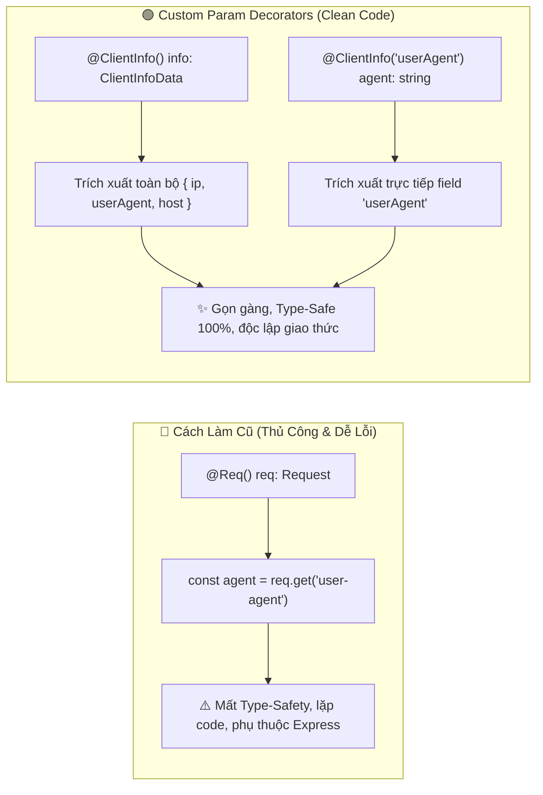
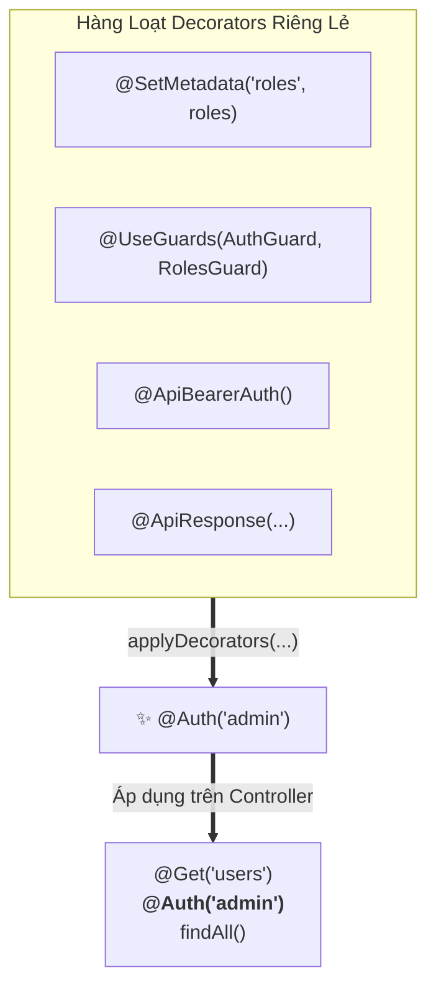

# Lesson 3.5: Custom Decorators — Kỹ Thuật Định Nghĩa Param Decorator & Decorator Composition Trong NestJS

<p align="center">
  
  
  
  
  
</p>

<p align="center">
  
</p>

---

> [!NOTE]
> ⏱️ **Thời lượng dự kiến:** 12 – 15 phút  
> 🎯 **Mục tiêu bài học:** Nắm vững bản chất Decorator trong TypeScript và cách NestJS ứng dụng Decorators làm nền tảng kiến trúc; tự tay xây dựng Custom Param Decorators bằng hàm `createParamDecorator()`; làm chủ kỹ thuật truyền tham số `data` (Property Selector) để trích xuất dữ liệu thực tế từ Request; hiểu cách kết hợp Pipes và gộp Decorators với `applyDecorators()` theo chuẩn tài liệu chính thức của NestJS.

---

## 1. Bản Chất Decorators Trong NestJS & Built-in Param Decorators

### 💡 Decorator Trong TypeScript Là Gì?

NestJS được thiết kế xoay quanh tính năng ngôn ngữ **Decorators** của ES2016 / TypeScript.

Về bản chất, **Decorator là một hàm (function)** nhận vào định nghĩa của class, method, accessor, property hoặc parameter để gán thêm siêu dữ liệu (metadata) hoặc can thiệp/thay đổi hành vi thực thi mà không làm xáo trộn mã nguồn gốc.

```typescript
// Cú pháp Decorator: Đặt trước khai báo với tiền tố @
@Controller('users')
export class UsersController {
  @Get(':id')
  findOne(@Param('id') id: string) { ... }
}
```

---

### 🔹 Bảng Ánh Xạ Các Built-in Param Decorators Với Express Request Object

Để giúp lập trình viên không phải thao tác trực tiếp với đối tượng `req` thô của Express, NestJS cung cấp sẵn một hệ thống các **Built-in Param Decorators**:

| Built-in Decorator        | Đối tượng tương đương trong Express    | Mục đích sử dụng                                   |
| :------------------------ | :------------------------------------- | :------------------------------------------------- |
| `@Request()`, `@Req()`    | `req`                                  | Truy cập toàn bộ Request Object                    |
| `@Response()`, `@Res()`   | `res`                                  | Truy cập Response Object (thao tác trực tiếp HTTP) |
| `@Next()`                 | `next`                                 | Chuyển tiếp Middleware tiếp theo                   |
| `@Session()`              | `req.session`                          | Đọc thông tin Session                              |
| `@Param(key?: string)`    | `req.params` hoặc `req.params[key]`    | Lấy Path Parameters trên URL (`/users/:id`)        |
| `@Body(key?: string)`     | `req.body` hoặc `req.body[key]`        | Lấy Request Payload (JSON Body)                    |
| `@Query(key?: string)`    | `req.query` hoặc `req.query[key]`      | Lấy URL Query String (`?page=1&limit=10`)          |
| `@Headers(name?: string)` | `req.headers` hoặc `req.headers[name]` | Lấy HTTP Request Headers                           |
| `@Ip()`                   | `req.ip`                               | Lấy địa chỉ IP của Client                          |
| `@HostParam()`            | `req.hosts`                            | Lấy tham số Hostname khi định tuyến đa miền        |

---

### 💡 Vấn Đề Khi Chỉ Sử Dụng Built-in Decorators

Trong thực tế phát triển phần mềm, dữ liệu nghiệp vụ thường được các Middleware hoặc Guards gán động vào Request Object (ví dụ: `req.user`, `req.clientInfo`, `req.tenantId`):

- **Cách làm cũ (Code Smell):** Phải tiêm `@Req() req: Request`, sau đó bóc tách thủ công `const user = req['user']`. Cách này gây lặp code ở mọi Controller, làm mất gợi ý kiểu (Type-Safety) của TypeScript và khiến Controller bị phụ thuộc chặt vào nền tảng HTTP bên dưới.
- **Giải pháp của NestJS:** Sử dụng hàm tiện ích `createParamDecorator()` để tự tạo ra các **Custom Param Decorators** chuyên biệt, có thể tái sử dụng ở bất kỳ đâu trong toàn bộ hệ thống.



---

## 2. Các Kỹ Thuật Cốt Lõi Về Custom Decorators

### 🔹 1. Tạo Param Decorator Với `createParamDecorator()`

Hàm `createParamDecorator()` nhận vào một **Factory Function** với 2 tham số:

1. `data`: Dữ liệu/tham số truyền vào decorator khi được gọi trong Controller (ví dụ `'userAgent'` trong `@ClientInfo('userAgent')`).
2. `ctx`: Đối tượng `ExecutionContext` cung cấp quyền truy cập vào vòng đời của Request.

```typescript
import { createParamDecorator, ExecutionContext } from '@nestjs/common';
import { Request } from 'express';

export const ClientInfo = createParamDecorator(
  (data: string | undefined, ctx: ExecutionContext) => {
    // 1. Chuyển đổi context sang HTTP Request
    const request = ctx.switchToHttp().getRequest<Request>();

    const clientData = {
      ip: request.ip || request.socket.remoteAddress || '127.0.0.1',
      userAgent: request.get('user-agent') || 'Unknown Agent',
      host: request.get('host') || 'localhost',
    };

    // 2. Nếu có truyền tham số data (Property Selector), trả về đúng thuộc tính đó
    return data ? clientData[data] : clientData;
  },
);
```

> [!TIP]
> **Sức mạnh của `ExecutionContext`:** Không chỉ hỗ trợ HTTP thông thường (`ctx.switchToHttp()`), `ExecutionContext` còn hỗ trợ đa giao thức như WebSockets (`ctx.switchToWs()`) và Microservices (`ctx.switchToRpc()`), giúp Decorator có thể tái sử dụng xuyên suốt toàn bộ ứng dụng.

---

### 🔹 2. Cơ Chế Truyền Tham Số Cho Decorator (Passing Data / Property Selector)

Một Custom Decorator có thể hoạt động linh hoạt ở 2 chế độ:

- **Lấy toàn bộ đối tượng:** Khi không truyền tham số `data`:
  ```typescript
  @Get('profile')
  getProfile(@ClientInfo() info: ClientInfoData) {
    // info nhận đầy đủ: { ip, userAgent, host }
    return info;
  }
  ```
- **Lấy một trường cụ thể (Property Selector):** Khi truyền tham số `data`:
  ```typescript
  @Get('agent')
  getAgent(@ClientInfo('userAgent') userAgent: string) {
    // userAgent nhận trực tiếp chuỗi User-Agent
    return { userAgent };
  }
  ```

---

### 🔹 3. Kết Hợp Custom Decorators Với Pipes (Working With Pipes)

NestJS đối xử với Custom Param Decorators **bình đẳng 100%** như các built-in decorators (`@Body()`, `@Query()`). Bạn hoàn toàn có thể gắn các Pipes trực tiếp vào Custom Decorator để biến đổi (Transform) hoặc kiểm tra tính hợp lệ (Validation):

```typescript
// 1. Áp dụng Pipe để ép kiểu dữ liệu
@Get('port')
getPort(
  @ClientInfo('port', ParseIntPipe) port: number, // Tự động transform string -> number
) {
  return { port };
}

// 2. Áp dụng ValidationPipe để validate dữ liệu từ Custom Decorator
@Get('account')
getAccount(
  @ClientInfo(new ValidationPipe({ validateCustomDecorators: true }))
  info: ClientInfoDto,
) {
  return info;
}
```

---

### 🔹 4. Kỹ Thuật Gộp Nhiều Decorators (Decorator Composition Với `applyDecorators`)

#### 💡 Vấn Nạn "Decorator Hell"

Trong các dự án Enterprise, một Route Handler thường phải gắn liên tiếp 4-5 Decorators khác nhau để cấu hình phân quyền, tài liệu Swagger và xác thực:

```typescript
// 🔴 Bị rối mắt bởi quá nhiều Decorators xếp chồng lên nhau
@Get('admin/dashboard')
@SetMetadata('roles', ['admin'])
@UseGuards(AuthGuard, RolesGuard)
@ApiBearerAuth()
@ApiResponse({ status: 200, description: 'Lấy dữ liệu thành công' })
@ApiResponse({ status: 403, description: 'Không có quyền truy cập' })
getDashboard() {
  return { status: 'ok' };
}
```

#### 🟢 Giải Pháp: `applyDecorators()`

NestJS cung cấp hàm tiện ích `applyDecorators()` giúp gom tất cả các Decorators trên thành một **Composite Decorator** duy nhất:

```typescript
import { applyDecorators, SetMetadata, UseGuards } from '@nestjs/common';

export function Auth(...roles: string[]) {
  return applyDecorators(
    SetMetadata('roles', roles),
    UseGuards(AuthGuard, RolesGuard),
  );
}
```

Khi sử dụng trong Controller, mã nguồn trở nên siêu ngắn gọn và có tính khai báo (Declarative) cực kỳ rõ ràng:

```typescript
@Get('admin/dashboard')
@Auth('admin') // 👈 Gom toàn bộ AuthGuard, RolesGuard và Metadata vào 1 dòng duy nhất!
getDashboard() {
  return { status: 'ok' };
}
```



---

## 3. Hướng Dẫn Thực Hành Step-by-Step

### 📌 Bước 1: Tạo Custom Param Decorator `@ClientInfo()`

Tạo tệp `src/shared/decorators/client-info.decorator.ts`:

📄 **`src/shared/decorators/client-info.decorator.ts`**

```typescript
import { createParamDecorator, ExecutionContext } from '@nestjs/common';
import { Request } from 'express';

export interface ClientInfoData {
  ip: string;
  userAgent: string;
  host: string;
}

/**
 * Custom Param Decorator trích xuất thông tin thực tế từ Request (IP, User-Agent, Host)
 *
 * Cách sử dụng:
 * 1. Lấy toàn bộ thông tin: getInfo(@ClientInfo() info: ClientInfoData)
 * 2. Lấy 1 trường cụ thể: getAgent(@ClientInfo('userAgent') agent: string)
 */
export const ClientInfo = createParamDecorator(
  (data: keyof ClientInfoData | undefined, ctx: ExecutionContext) => {
    const request = ctx.switchToHttp().getRequest<Request>();

    const clientInfo: ClientInfoData = {
      ip: request.ip || request.socket.remoteAddress || '127.0.0.1',
      userAgent: request.get('user-agent') || 'Unknown User-Agent',
      host: request.get('host') || 'localhost',
    };

    return data ? clientInfo[data] : clientInfo;
  },
);
```

---

### 📌 Bước 2: Áp Dụng `@ClientInfo()` Trong Controller

Mở tệp `src/users/users.controller.ts` và thêm 2 route để trích xuất dữ liệu thật từ Request:

📄 **`src/users/users.controller.ts`**

```typescript
import { Controller, Get } from '@nestjs/common';
import {
  ClientInfo,
  ClientInfoData,
} from '../shared/decorators/client-info.decorator';

@Controller('users')
export class UsersController {
  // 1. Trích xuất toàn bộ thông tin Client thật từ Request
  @Get('client-info')
  getClientInfo(@ClientInfo() client: ClientInfoData) {
    return {
      message: 'Trích xuất thông tin Client từ Request thành công!',
      data: client,
    };
  }

  // 2. Trích xuất riêng trường 'userAgent' qua Property Selector
  @Get('agent')
  getUserAgent(@ClientInfo('userAgent') agent: string) {
    return {
      userAgent: agent,
    };
  }
}
```

---

## 4. Kịch Bản Kiểm Tra & Thử Nghiệm (Hands-on Lab)

Khởi động server (`pnpm start:dev`) và gửi các lệnh cURL kèm Header thực tế:

### 🟢 Test 1: Kiểm Thử Trích Xuất Toàn Bộ Dữ Liệu Thực Tế

Gửi request kèm User-Agent tùy chỉnh:

```bash
curl -X GET http://localhost:3000/api/v1/users/client-info \
  -H "User-Agent: AntigravityTestClient/1.0"
```

📥 **Phản hồi JSON trả về từ Server (Dữ liệu thực tế 100%):**

```json
{
  "message": "Trích xuất thông tin Client từ Request thành công!",
  "data": {
    "ip": "::1",
    "userAgent": "AntigravityTestClient/1.0",
    "host": "localhost:3000"
  }
}
```

---

### 🟢 Test 2: Kiểm Thử Property Selector Với `@ClientInfo('userAgent')`

Gửi request với User-Agent từ trình duyệt Chrome / Postman:

```bash
curl -X GET http://localhost:3000/api/v1/users/agent \
  -H "User-Agent: PostmanRuntime/7.39.0"
```

📥 **Phản hồi JSON trả về:**

```json
{
  "userAgent": "PostmanRuntime/7.39.0"
}
```

✅ **Kết quả:** Decorator `@ClientInfo()` bóc tách chính xác các dữ liệu thực tế từ HTTP Request (`req.get('user-agent')`, `req.ip`, `req.get('host')`) mà không cần sử dụng dữ liệu giả (mock data)!

---

## 5. Tổng Kết Bài Học & Checklist Ghi Nhớ

```mermaid
mindmap
  root(("NestJS Custom Decorators"))
    "Param Decorators"
      "createParamDecorator()"
      "Bóc tách dữ liệu từ ExecutionContext"
      "Hỗ trợ Property Selector data"
    "Working with Pipes"
      "Áp dụng ParseIntPipe, ValidationPipe"
      "validateCustomDecorators: true"
    "applyDecorators()"
      "Gộp nhiều decorators thành 1 nhãn"
      "Xóa bỏ Decorator Hell"
      "Clean Code & Declarative"
```

### ✅ Checklist Ghi Nhớ Bài Học:

- [x] Nắm vững bản chất Decorator trong TypeScript và bảng ánh xạ Built-in Param Decorators của NestJS.
- [x] Tạo thành công Custom Param Decorator `@ClientInfo()` bằng `createParamDecorator()`.
- [x] Trích xuất trực tiếp dữ liệu thực tế từ HTTP Request (`ip`, `userAgent`, `host`).
- [x] Sử dụng thành thạo tham số `data` (Property Selector) để trích xuất từng field dữ liệu.
- [x] Hiểu cách kết hợp Pipes với Custom Decorators và kỹ thuật gộp Decorator Composition với `applyDecorators()`.
- [x] Thử nghiệm thành công cURL với các Header thực tế từ Client.

---

👉 **Bài tiếp theo:** [Lesson 3.6: Interceptors — TransformInterceptor (Chuẩn Hóa Success Response) & Logging Performance](../lesson-3.6/lesson-3.6.md)
