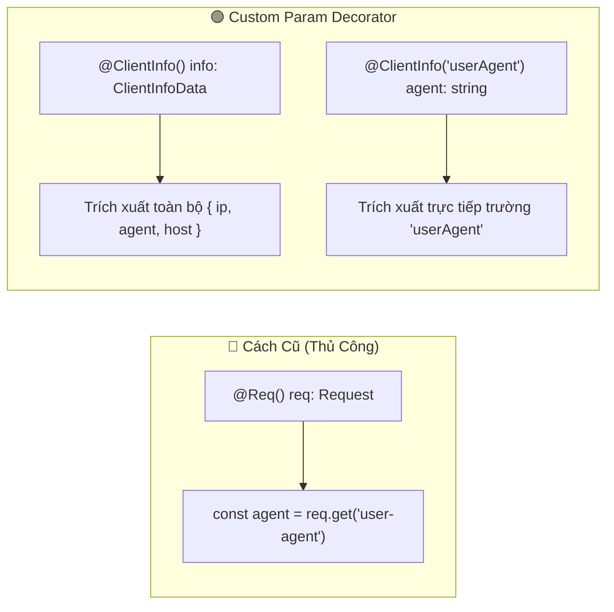

# Lesson 3.5: Custom Decorators — Kỹ Thuật Định Nghĩa Param Decorator & Decorator Composition Trong NestJS

<p align="center">
  
  
  
  
  
</p>

<p align="center">
  
</p>

---

> [!NOTE]
> ⏱️ **Thời lượng dự kiến:** 10 – 12 phút  
> 🎯 **Mục tiêu bài học:** Nắm vững bản chất Decorator trong TypeScript và NestJS; tự tay xây dựng Custom Param Decorator bằng hàm `createParamDecorator()`; làm chủ kỹ thuật truyền tham số `data` (Property Selector) để trích xuất dữ liệu thực tế từ Request; hiểu cách kết hợp Pipes và gộp Decorators với `applyDecorators()`.

---

## 1. Tại Sao Cần Tự Định Nghĩa Custom Decorators?

### 💡 Ẩn Dụ Thực Tế: Chiếc Tay Gắp Dữ Liệu Tự Động Từ Request

Trong ứng dụng Backend, Request gửi lên chứa rất nhiều thông tin cần khai thác như Headers, IP Client, Host, Cookies:

- **Cách làm cũ:** Phải tiêm cả Request object `@Req() req: Request`, sau đó bóc tách thủ công `const userAgent = req.get('user-agent'); const ip = req.ip;`. Cách này làm Controller bị phụ thuộc vào Express và lặp lại code ở nhiều nơi.
- **Giải pháp của NestJS:** Cung cấp hàm `createParamDecorator()` giúp bạn tạo ra **Chiếc Tay Gắp Tự Động** để trích xuất trực tiếp dữ liệu thực tế từ Request vào tham số của Controller một cách gọn gàng, Type-Safe.



---

## 2. Các Kỹ Thuật Cốt Lõi Về Custom Decorators

### 🔹 1. Tạo Param Decorator Với `createParamDecorator()`

Factory function nhận vào 2 tham số:

- `data`: Tham số truyền vào decorator (ví dụ `'userAgent'` trong `@ClientInfo('userAgent')`).
- `ctx`: `ExecutionContext` chứa toàn bộ ngữ cảnh của request (HTTP, WebSockets, Microservices).

```typescript
import { createParamDecorator, ExecutionContext } from '@nestjs/common';
import { Request } from 'express';

export const ClientInfo = createParamDecorator(
  (data: string | undefined, ctx: ExecutionContext) => {
    const request = ctx.switchToHttp().getRequest<Request>();
    const clientData = {
      ip: request.ip || '127.0.0.1',
      userAgent: request.get('user-agent') || 'Unknown Agent',
      host: request.get('host') || 'localhost',
    };

    // Nếu truyền data (vd: @ClientInfo('userAgent')), trả về đúng trường đó
    return data ? clientData[data] : clientData;
  },
);
```

---

### 🔹 2. Kết Hợp Custom Decorators Với Pipes (Working with Pipes)

Custom Param Decorators tương thích hoàn toàn với các Pipes của NestJS để validate hoặc transform dữ liệu:

```typescript
@Get('info')
getInfo(
  @ClientInfo('port', ParseIntPipe) port: number, // Tự động convert sang number
) {
  return { port };
}
```

---

### 🔹 3. Gộp Nhiều Decorators Với `applyDecorators()` (Decorator Composition)

Khi một Route cần gắn nhiều cấu hình, bạn có thể gộp chúng lại thành 1 nhãn duy nhất:

```typescript
import { applyDecorators, SetMetadata, UseGuards } from '@nestjs/common';

export function Auth(...roles: string[]) {
  return applyDecorators(
    SetMetadata('roles', roles),
    UseGuards(AuthGuard),
  );
}

// Sử dụng gọn gàng trong Controller:
@Get('admin')
@Auth('admin')
getAdminData() { ... }
```

---

## 3. Hướng Dẫn Thực Hành Step-by-Step

### 📌 Bước 1: Tạo Custom Param Decorator `@ClientInfo()`

Tạo tệp `src/shared/decorators/client-info.decorator.ts`:

📄 **`src/shared/decorators/client-info.decorator.ts`**

```typescript
import { createParamDecorator, ExecutionContext } from '@nestjs/common';
import { Request } from 'express';

export interface ClientInfoData {
  ip: string;
  userAgent: string;
  host: string;
}

/**
 * Custom Param Decorator trích xuất thông tin thực tế từ Request (IP, User-Agent, Host)
 *
 * Cách sử dụng:
 * 1. Lấy toàn bộ thông tin: getInfo(@ClientInfo() info: ClientInfoData)
 * 2. Lấy 1 trường cụ thể: getAgent(@ClientInfo('userAgent') agent: string)
 */
export const ClientInfo = createParamDecorator(
  (data: keyof ClientInfoData | undefined, ctx: ExecutionContext) => {
    const request = ctx.switchToHttp().getRequest<Request>();

    const clientInfo: ClientInfoData = {
      ip: request.ip || request.socket.remoteAddress || '127.0.0.1',
      userAgent: request.get('user-agent') || 'Unknown User-Agent',
      host: request.get('host') || 'localhost',
    };

    return data ? clientInfo[data] : clientInfo;
  },
);
```

---

### 📌 Bước 2: Áp Dụng `@ClientInfo()` Trong Controller

Mở tệp `src/users/users.controller.ts` và thêm 2 route để trích xuất dữ liệu thật từ Request:

📄 **`src/users/users.controller.ts`**

```typescript
import { Controller, Get } from '@nestjs/common';
import {
  ClientInfo,
  ClientInfoData,
} from '../shared/decorators/client-info.decorator';

@Controller('users')
export class UsersController {
  // 1. Trích xuất toàn bộ thông tin Client thật từ Request
  @Get('client-info')
  getClientInfo(@ClientInfo() client: ClientInfoData) {
    return {
      message: 'Trích xuất thông tin Client từ Request thành công!',
      data: client,
    };
  }

  // 2. Trích xuất riêng trường 'userAgent' qua Property Selector
  @Get('agent')
  getUserAgent(@ClientInfo('userAgent') agent: string) {
    return {
      userAgent: agent,
    };
  }
}
```

---

## 4. Kịch Bản Kiểm Tra & Thử Nghiệm (Hands-on Lab)

Khởi động server (`pnpm start:dev`) và gửi các lệnh cURL kèm Header thực tế:

### 🟢 Test 1: Kiểm Thử Trích Xuất Toàn Bộ Dữ Liệu Thực Tế

Gửi request kèm User-Agent tùy chỉnh:

```bash
curl -X GET http://localhost:3000/api/v1/users/client-info \
  -H "User-Agent: AntigravityTestClient/1.0"
```

📥 **Phản hồi JSON trả về từ Server (Dữ liệu thực tế 100%):**

```json
{
  "message": "Trích xuất thông tin Client từ Request thành công!",
  "data": {
    "ip": "::1",
    "userAgent": "AntigravityTestClient/1.0",
    "host": "localhost:3000"
  }
}
```

---

### 🟢 Test 2: Kiểm Thử Property Selector Với `@ClientInfo('userAgent')`

Gửi request với User-Agent từ trình duyệt Chrome / Postman:

```bash
curl -X GET http://localhost:3000/api/v1/users/agent \
  -H "User-Agent: PostmanRuntime/7.39.0"
```

📥 **Phản hồi JSON trả về:**

```json
{
  "userAgent": "PostmanRuntime/7.39.0"
}
```

✅ **Kết quả:** Decorator `@ClientInfo()` bóc tách chính xác các dữ liệu thực tế từ HTTP Request (`req.get('user-agent')`, `req.ip`, `req.get('host')`) mà không cần sử dụng dữ liệu giả (mock data)!

---

## 5. Tổng Kết Bài Học & Checklist Ghi Nhớ

```mermaid
mindmap
  root(("NestJS Custom Decorators"))
    "Param Decorators"
      "createParamDecorator()"
      "Bóc tách dữ liệu từ ExecutionContext"
      "Hỗ trợ Property Selector data"
    "Working with Pipes"
      "Áp dụng ParseIntPipe, ValidationPipe"
    "applyDecorators()"
      "Gộp nhiều decorators thành 1 nhãn"
      "Clean Code & Declarative"
```

### ✅ Checklist Ghi Nhớ Bài Học:

- [x] Hiểu bản chất và lợi ích của Custom Decorators trong NestJS.
- [x] Tạo thành công Custom Param Decorator `@ClientInfo()` bằng `createParamDecorator()`.
- [x] Trích xuất trực tiếp dữ liệu thực tế từ HTTP Request (`ip`, `userAgent`, `host`).
- [x] Sử dụng thành thạo tham số `data` (Property Selector) để trích xuất từng field dữ liệu.
- [x] Nắm được cách áp dụng Pipes lên Custom Decorators và kỹ thuật gộp với `applyDecorators()`.
- [x] Thử nghiệm thành công cURL với các Header thực tế từ Client.

---

👉 **Bài tiếp theo:** [Lesson 3.6: Interceptors — TransformInterceptor (Chuẩn Hóa Success Response) & Logging Performance](../lesson-3.6/lesson-3.6.md)
