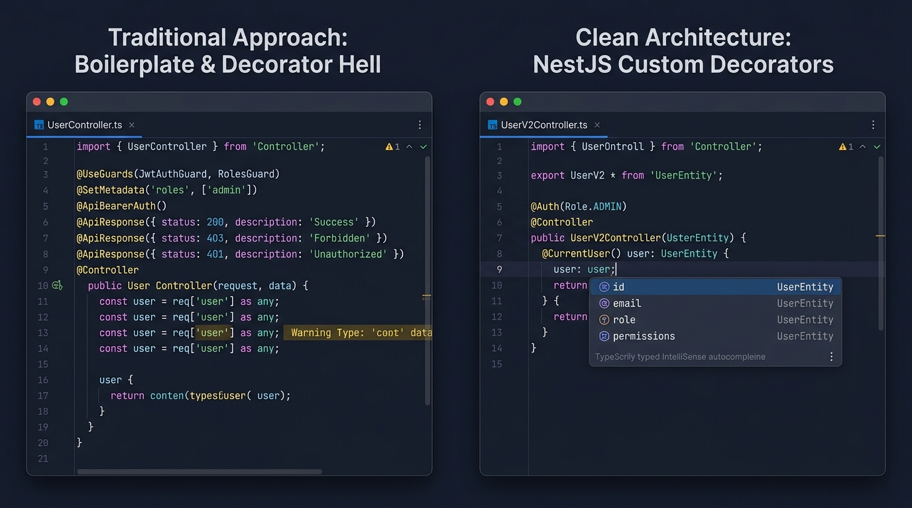
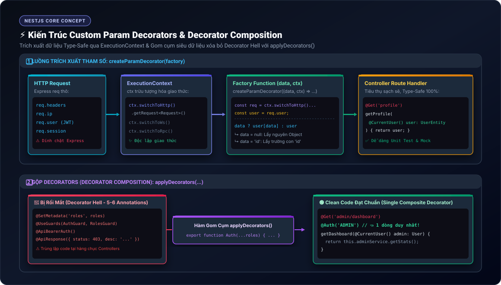

# Lesson 3.5: Custom Decorators — Kỹ Thuật Định Nghĩa Param Decorator & Decorator Composition Trong NestJS

<p align="center">
  
  
  
  
  
</p>

<p align="center">
  
</p>

---

> [!NOTE]
> ⏱️ **Thời lượng:** 10 – 12 phút thực chiến  
> 🎯 **Mục tiêu:** Hiểu bản chất Decorator trong TypeScript; tự xây dựng Custom Param Decorator với `createParamDecorator()`; làm chủ Property Selector (`data`); kết hợp Pipes và gộp Decorators bằng `applyDecorators()` để xóa bỏ hoàn toàn "Decorator Hell".

---

## 1. Tại Sao Cần Custom Decorators?

Trong NestJS, dữ liệu người dùng hoặc client thường được Middleware/Guard gắn vào Request (`req.user`, `req.clientInfo`).

### 📱 So Sánh Trực Quan: Cách Cũ vs Custom Decorators

<p align="center">
  
</p>

| Tiêu chí         | 🔴 Cách cũ (`req: Request`)                               | 🟢 Custom Decorator (`@ClientInfo()`)                      |
| :--------------- | :-------------------------------------------------------- | :--------------------------------------------------------- |
| **Type-Safety**  | ❌ Mất kiểu, phải `as any`, không có gợi ý code IDE       | ✅ Type-Safe 100%, tự động autocomplete thuộc tính         |
| **Unit Testing** | ❌ Phải mock toàn bộ đối tượng Express `Request` phức tạp | ✅ Độc lập, chỉ cần truyền mock data trực tiếp vào tham số |
| **Đa giao thức** | ❌ Dính chặt vào Express HTTP                             | ✅ Tái sử dụng mượt mà cho cả WebSockets & Microservices   |
| **Độ gọn gàng**  | ❌ Lặp code ở mọi route, dễ gặp "Decorator Hell"          | ✅ Ngắn gọn, có tính khai báo (Declarative Clean Code)     |

---

### 📚 Bảng Tra Cứu Built-in Param Decorators Thường Gặp

| Decorator          | Express Object | Ví dụ sử dụng                          |
| :----------------- | :------------- | :------------------------------------- |
| `@Param(key?)`     | `req.params`   | `@Param('id') id: string`              |
| `@Body(key?)`      | `req.body`     | `@Body() dto: CreateUserDto`           |
| `@Query(key?)`     | `req.query`    | `@Query('page') page: string`          |
| `@Headers(name?)`  | `req.headers`  | `@Headers('user-agent') agent: string` |
| `@Ip()`            | `req.ip`       | `@Ip() ip: string`                     |
| `@Req()`, `@Res()` | `req`, `res`   | Thao tác trực tiếp với HTTP Stream     |

---

## 2. Kiến Trúc 2 Vũ Khí Cốt Lõi: `createParamDecorator` & `applyDecorators`

<p align="center">
  
</p>

### 🔹 1. `createParamDecorator(factory)` — Bóc Tách Tham Số Type-Safe

Hàm nhận vào Factory Function với 2 tham số:

1. `data`: Giá trị truyền vào decorator (ví dụ: `'userAgent'` trong `@ClientInfo('userAgent')`).
2. `ctx: ExecutionContext`: Cung cấp quyền truy cập Request trên nhiều giao thức (`switchToHttp()`, `switchToWs()`, `switchToRpc()`).

> [!TIP]
> **Property Selector:** Nếu có truyền `data`, trả về đúng trường con đó (`data ? info[data] : info`). Nếu không truyền, trả về nguyên đối tượng.

---

### 🔹 2. Tương Thích Hoàn Hảo Với Pipes

NestJS đối xử với Custom Decorator bình đẳng như `@Body()` hay `@Query()`. Bạn có thể áp dụng trực tiếp Pipes:

```typescript
@Get('port')
getPort(@ClientInfo('port', ParseIntPipe) port: number) {
  return { port };
}
```

> [!CAUTION]
> Để `ValidationPipe` toàn cục kiểm tra DTO của Custom Decorator, cần bật cờ:  
> `new ValidationPipe({ validateCustomDecorators: true })`.

---

### 🔹 3. `applyDecorators()` — Xóa Bỏ "Decorator Hell"

Khi một endpoint phải cõng 4-5 annotations (`@SetMetadata`, `@UseGuards`, `@ApiBearerAuth`), hãy gộp chúng lại:

```typescript
// Định nghĩa Composite Decorator
export function Auth(...roles: string[]) {
  return applyDecorators(
    SetMetadata('roles', roles),
    UseGuards(AuthGuard, RolesGuard),
  );
}

// Áp dụng gọn gàng trên Controller (1 dòng duy nhất!)
@Get('admin')
@Auth('ADMIN')
getAdminData() { ... }
```

---

## 3. Hướng Dẫn Thực Hành Step-by-Step

### 📂 Cấu Trúc File Triển Khai

```
src/
├── shared/
│   └── decorators/
│       ├── client-info.decorator.ts    👈 Param Decorator (createParamDecorator)
│       └── auth.decorator.ts           👈 Composite Decorator (applyDecorators)
└── users/
    └── users.controller.ts             👈 Sử dụng Decorators thực tế
```

---

### 📌 Bước 1: Tạo Custom Param Decorator `@ClientInfo()`

Tạo file `src/shared/decorators/client-info.decorator.ts`:

📄 **`src/shared/decorators/client-info.decorator.ts`**

```typescript
import { createParamDecorator, ExecutionContext } from '@nestjs/common';
import { Request } from 'express';

export interface ClientInfoData {
  ip: string;
  userAgent: string;
  host: string;
}

export const ClientInfo = createParamDecorator(
  (data: keyof ClientInfoData | undefined, ctx: ExecutionContext) => {
    const request = ctx.switchToHttp().getRequest<Request>();

    const clientInfo: ClientInfoData = {
      ip: request.ip || request.socket.remoteAddress || '127.0.0.1',
      userAgent: request.get('user-agent') || 'Unknown User-Agent',
      host: request.get('host') || 'localhost',
    };

    // Property Selector: Trả về trường con nếu có truyền data
    return data ? clientInfo[data] : clientInfo;
  },
);
```

---

### 📌 Bước 2: Tạo Composite Decorator `@Auth()`

Tạo file `src/shared/decorators/auth.decorator.ts`:

📄 **`src/shared/decorators/auth.decorator.ts`**

```typescript
import { applyDecorators, SetMetadata } from '@nestjs/common';

export const ROLES_KEY = 'roles';

export function Auth(...roles: string[]) {
  return applyDecorators(
    SetMetadata(ROLES_KEY, roles),
    // Sau này có thể gộp thêm: UseGuards(AuthGuard, RolesGuard), ApiBearerAuth()
  );
}
```

---

### 📌 Bước 3: Áp Dụng Trong `UsersController`

Mở file `src/users/users.controller.ts` và thêm các route thử nghiệm:

📄 **`src/users/users.controller.ts`**

```typescript
import { Body, Controller, Get, Post } from '@nestjs/common';
import { UsersService } from './users.service';
import { CreateUserDto } from './dto/create-user.dto';
import {
  ClientInfo,
  ClientInfoData,
} from '../shared/decorators/client-info.decorator';
import { Auth } from '../shared/decorators/auth.decorator';

@Controller('users')
export class UsersController {
  constructor(private readonly usersService: UsersService) {}

  @Get()
  findAll() {
    return this.usersService.findAll();
  }

  @Post()
  createUser(@Body() body: CreateUserDto) {
    return this.usersService.create(body);
  }

  // 1. Lấy toàn bộ thông tin Client thật từ Request
  @Get('client-info')
  getClientInfo(@ClientInfo() client: ClientInfoData) {
    return {
      message: 'Trích xuất thông tin Client thành công!',
      data: client,
    };
  }

  // 2. Chỉ lấy riêng trường 'userAgent' qua Property Selector
  @Get('agent')
  getUserAgent(@ClientInfo('userAgent') agent: string) {
    return { userAgent: agent };
  }

  // 3. Kết hợp Composite Decorator @Auth()
  @Get('admin-only')
  @Auth('ADMIN')
  getAdminResource(@ClientInfo('ip') ip: string) {
    return { message: 'Truy cập route quản trị thành công!', ip };
  }
}
```

---

## 4. Kịch Bản Kiểm Thử (Hands-on Lab)

Khởi động server:

```bash
pnpm start:dev
```

Mở Terminal mới và gửi 3 lệnh cURL kiểm thử:

---

### 🟢 Kịch Bản 1: Lấy Toàn Bộ Dữ Liệu Client Thực Tế

```bash
curl -i -X GET http://localhost:3000/api/v1/users/client-info \
  -H "User-Agent: NestJS-Test-Client/1.0"
```

📥 **Phản hồi từ Server (`200 OK`):**

```json
{
  "message": "Trích xuất thông tin Client thành công!",
  "data": {
    "ip": "::1",
    "userAgent": "NestJS-Test-Client/1.0",
    "host": "localhost:3000"
  }
}
```

---

### 🟢 Kịch Bản 2: Kiểm Thử Property Selector `@ClientInfo('userAgent')`

```bash
curl -i -X GET http://localhost:3000/api/v1/users/agent \
  -H "User-Agent: PostmanRuntime/7.39.0"
```

📥 **Phản hồi từ Server (`200 OK`):**

```json
{
  "userAgent": "PostmanRuntime/7.39.0"
}
```

---

### 🟡 Kịch Bản 3: Kiểm Thử Tuyến Quản Trị Kết Hợp `@Auth('ADMIN')`

```bash
curl -i -X GET http://localhost:3000/api/v1/users/admin-only
```

📥 **Phản hồi từ Server (`200 OK`):**

```json
{
  "message": "Truy cập route quản trị thành công!",
  "ip": "::1"
}
```

---

## 5. Tổng Kết Bài Học & Checklist Ghi Nhớ

```mermaid
mindmap
  root(("NestJS Custom Decorators"))
    "Param Decorators"
      "createParamDecorator()"
      "Bóc tách dữ liệu từ ExecutionContext"
      "Hỗ trợ Property Selector thông qua data"
      "Độc lập hoàn toàn khỏi Express Engine"
    "Working with Pipes"
      "Tương thích với ParseIntPipe, ParseUUIDPipe"
      "ValidationPipe với validateCustomDecorators: true"
    "applyDecorators()"
      "Gom nhiều Decorators thành 1 Composite Decorator"
      "Triệt tiêu hoàn toàn Decorator Hell"
      "Chuẩn Declarative & Clean Code"
```

### ✅ Checklist Ghi Nhớ:

- [x] Hiểu ưu thế của Custom Decorator so với việc bóc tách thủ công từ `req`.
- [x] Tạo thành công Custom Param Decorator `@ClientInfo()` với `createParamDecorator()`.
- [x] Sử dụng thành thạo Property Selector (`data`) để lấy toàn bộ hoặc từng trường con.
- [x] Biết cách gộp nhiều Decorators với `applyDecorators()` để code Controller ngắn gọn.
- [x] Thực hành kiểm thử thành công 3 kịch bản cURL thực tế.

---

👉 **Bài tiếp theo:** [Lesson 3.6: Interceptors — TransformInterceptor (Chuẩn Hóa Success Response) & Logging Performance](../lesson-3.6/lesson-3.6.md)
