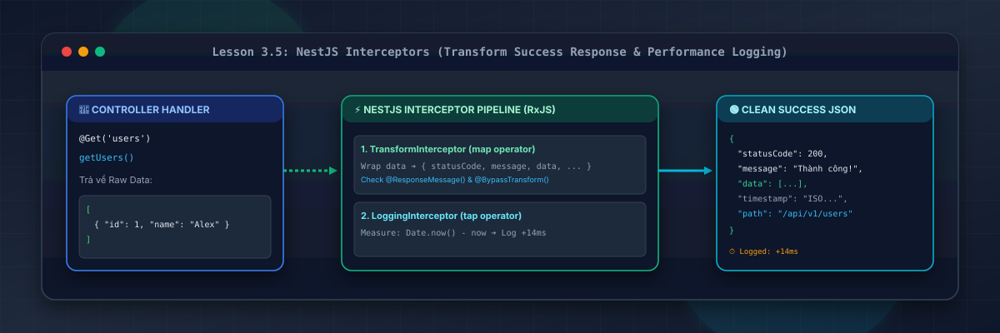
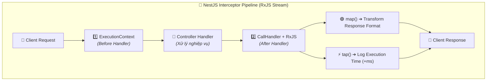
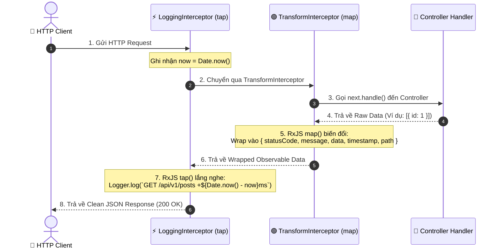

# Lesson 3.5: Interceptors — TransformInterceptor (Chuẩn Hóa Success Response) & Logging Performance

<p align="center">
  
  
  
  
  
</p>

<p align="center">
  
</p>

---

> [!NOTE]
> ⏱️ **Thời lượng dự kiến:** 12 – 15 phút  
> 🎯 **Mục tiêu bài học:** Nắm vững khái niệm Interceptor (Aspect-Oriented Programming - AOP) và sức mạnh của RxJS trong NestJS; tự tay xây dựng `TransformInterceptor` bọc dữ liệu thành công (HTTP 2xx) thành định dạng JSON chuẩn Enterprise; làm chủ kỹ thuật tạo Custom Decorators `@ResponseMessage()` & `@BypassTransform()`; triển khai `LoggingInterceptor` sử dụng RxJS `tap()` để đo lường chính xác thời gian thực thi (execution time `+Xms`) của từng API Endpoint.

---

## 1. Interceptor Trong NestJS Là Gì? Vòng Đời AOP (Aspect-Oriented Programming)

### 💡 Ẩn Dụ Thực Tế: Dây Chuyền Đóng Gói Hàng Hóa Tự Động

Hãy hình dung Controller Handler của bạn giống như một **Công Nhân Chế Tạo Sản Phẩm**:

- Công nhân chỉ tập trung tạo ra cốt lõi sản phẩm (Ví dụ: Trả về mảng dữ liệu `[{ id: 1, name: "Shirt" }]`).
- Sau khi sản phẩm làm xong, nó đi qua **Dây Chuyền Đóng Gói Tự Động (TransformInterceptor)**: Dây chuyền sẽ tự động cho sản phẩm vào hộp đẹp mắt, dán nhãn Mã trạng thái (`statusCode`), Thẻ thời gian (`timestamp`), Đường dẫn (`path`) và Thông báo (`message`).
- Đồng thời, cảm biến trên dây chuyền **(LoggingInterceptor)** ghi nhận chính xác thời gian từ lúc bắt đầu gia công đến khi đóng gói xong mất bao nhiêu miligiây (`+14ms`).



---

### 🔹 Khả Năng Mạnh Mẽ Của Interceptor Trong NestJS

Interceptor lấy cảm hứng từ kỹ thuật **Aspect-Oriented Programming (AOP)**. Nó có thể can thiệp vào cả **trước (Before)** và **sau (After)** khi Controller Handler thực thi:

1. **Biến đổi kết quả trả về (`map` operator):** Chuẩn hóa toàn bộ Success Payload thành 1 cấu trúc JSON duy nhất.
2. **Đo lường hiệu năng (`tap` operator):** Tính toán thời gian thực thi của Handler để phát hiện API chậm.
3. **Bỏ qua hoặc Thay thế logic:** Trả về kết quả từ Cache (Redis/In-Memory) mà không cần gọi vào Controller.
4. **Xử lý Timeout (`timeout` operator):** Tự động hủy yêu cầu nếu Handler chạy quá thời gian cho phép (ví dụ > 5 giây).

---

## 2. Luồng Hoạt Động Của TransformInterceptor & LoggingInterceptor



---

## 3. Hướng Dẫn Thực Hành Step-by-Step — Viết Custom Decorators & Interceptors

### 📌 Bước 1: Tạo Custom Decorators (`@ResponseMessage` & `@BypassTransform`)

Để linh hoạt tùy chỉnh thông báo hoặc bỏ qua việc bọc data (đối với các API xuất file Excel/PDF), chúng ta tạo 2 Decorator:

#### 1. Custom Decorator `@ResponseMessage()`:

📄 **`src/common/decorators/response-message.decorator.ts`**

```typescript
import { SetMetadata } from '@nestjs/common';

export const RESPONSE_MESSAGE_KEY = 'response_message';

// Decorator gán thông báo thành công tùy chỉnh ở Controller Handler
export const ResponseMessage = (message: string) =>
  SetMetadata(RESPONSE_MESSAGE_KEY, message);
```

#### 2. Custom Decorator `@BypassTransform()`:

📄 **`src/common/decorators/bypass-transform.decorator.ts`**

```typescript
import { SetMetadata } from '@nestjs/common';

export const BYPASS_TRANSFORM_KEY = 'bypass_transform';

// Decorator dùng khi muốn trả về dữ liệu thô (Raw Response / Download File)
export const BypassTransform = () => SetMetadata(BYPASS_TRANSFORM_KEY, true);
```

---

### 📌 Bước 2: Triển Khai `TransformInterceptor` Chuẩn Hóa Success Response

Tạo tệp `src/common/interceptors/transform.interceptor.ts`:

📄 **`src/common/interceptors/transform.interceptor.ts`**

```typescript
import {
  CallHandler,
  ExecutionContext,
  Injectable,
  NestInterceptor,
} from '@nestjs/common';
import { Reflector } from '@nestjs/core';
import { Request, Response } from 'express';
import { Observable } from 'rxjs';
import { map } from 'rxjs/operators';
import { BYPASS_TRANSFORM_KEY } from '../decorators/bypass-transform.decorator';
import { RESPONSE_MESSAGE_KEY } from '../decorators/response-message.decorator';

export interface ResponseFormat<T> {
  statusCode: number;
  message: string;
  data: T;
  timestamp: string;
  path: string;
}

@Injectable()
export class TransformInterceptor<T> implements NestInterceptor<
  T,
  ResponseFormat<T> | T
> {
  constructor(private reflector: Reflector) {}

  intercept(
    context: ExecutionContext,
    next: CallHandler,
  ): Observable<ResponseFormat<T> | T> {
    // 1. Kiểm tra nếu Route Handler có gắn @BypassTransform() thì giữ nguyên dữ liệu gốc
    const isBypass = this.reflector.getAllAndOverride<boolean>(
      BYPASS_TRANSFORM_KEY,
      [context.getHandler(), context.getClass()],
    );
    if (isBypass) {
      return next.handle();
    }

    const ctx = context.switchToHttp();
    const response = ctx.getResponse<Response>();
    const request = ctx.getRequest<Request>();

    // 2. Trích xuất thông báo tùy chỉnh từ @ResponseMessage() (nếu có)
    const customMessage =
      this.reflector.getAllAndOverride<string>(RESPONSE_MESSAGE_KEY, [
        context.getHandler(),
        context.getClass(),
      ]) || 'Thao tác thực hiện thành công!';

    // 3. Sử dụng RxJS operator map() để đóng gói dữ liệu thành công
    return next.handle().pipe(
      map((data) => ({
        statusCode: response.statusCode,
        message: customMessage,
        data: data ?? null,
        timestamp: new Date().toISOString(),
        path: request.originalUrl,
      })),
    );
  }
}
```

---

### 📌 Bước 3: Triển Khai `LoggingInterceptor` Đo Thời Gian Thực Thi (Execution Time)

Tạo tệp `src/common/interceptors/logging.interceptor.ts`:

📄 **`src/common/interceptors/logging.interceptor.ts`**

```typescript
import {
  CallHandler,
  ExecutionContext,
  Injectable,
  Logger,
  NestInterceptor,
} from '@nestjs/common';
import { Request } from 'express';
import { Observable } from 'rxjs';
import { tap } from 'rxjs/operators';

@Injectable()
export class LoggingInterceptor implements NestInterceptor {
  private readonly logger = new Logger('Performance');

  intercept(context: ExecutionContext, next: CallHandler): Observable<any> {
    const request = context.switchToHttp().getRequest<Request>();
    const { method, originalUrl } = request;
    const now = Date.now();

    // RxJS tap() operator cho phép thực hiện side-effect (ghi log) mà KHÔNG làm thay đổi dữ liệu Stream
    return next.handle().pipe(
      tap(() => {
        const executionTime = Date.now() - now;
        this.logger.log(
          `[Execution Time] ${method} ${originalUrl} +${executionTime}ms`,
        );
      }),
    );
  }
}
```

---

### 📌 Bước 4: Đăng Ký Interceptors Toàn Cục Trong `main.ts`

Mở tệp `src/main.ts` và áp dụng cả 2 Interceptor:

📄 **`src/main.ts`**

```typescript
import { ValidationPipe, VersioningType } from '@nestjs/common';
import { NestFactory, Reflector } from '@nestjs/core';
import { AppModule } from './app.module';
import { HttpExceptionFilter } from './common/filters/http-exception.filter';
import { LoggingInterceptor } from './common/interceptors/logging.interceptor';
import { TransformInterceptor } from './common/interceptors/transform.interceptor';

async function bootstrap() {
  const app = await NestFactory.create(AppModule);

  app.setGlobalPrefix('api');

  app.enableVersioning({
    type: VersioningType.URI,
    prefix: 'v',
    defaultVersion: '1',
  });

  app.useGlobalPipes(
    new ValidationPipe({
      whitelist: true,
      forbidNonWhitelisted: true,
      transform: true,
    }),
  );

  const reflector = app.get(Reflector);

  // 🟢 Kích hoạt các Interceptors Toàn Cục (Thứ tự thực thi: Logging ➔ Transform)
  app.useGlobalInterceptors(
    new LoggingInterceptor(),
    new TransformInterceptor(reflector),
  );

  app.useGlobalFilters(new HttpExceptionFilter());

  await app.listen(3000);
  console.log(`🚀 Server running on: http://localhost:3000/api/v1`);
}
bootstrap();
```

---

## 4. Kịch Bản Kiểm Tra & Thử Nghiệm (Hands-on Lab)

### 🟢 Kịch Bản 1: Kiểm Thử Success Response Auto Transform & Performance Log

Khởi chạy Server và thực hiện câu lệnh cURL lấy danh sách bài viết:

```bash
curl -X GET http://localhost:3000/api/v1/posts
```

📥 **Phản hồi HTTP trả về cho Client (`200 OK` - Chuẩn hóa tự động):**

```json
{
  "statusCode": 200,
  "message": "Thao tác thực hiện thành công!",
  "data": [
    { "id": "1", "title": "Bài viết NestJS v1", "author": "Thành Đỗ" },
    { "id": "2", "title": "Hướng dẫn Versioning v1", "author": "NestJS Team" }
  ],
  "timestamp": "2026-08-13T15:20:00.123Z",
  "path": "/api/v1/posts"
}
```

🖥️ **Log thời gian thực thi ghi nhận tại Terminal Server:**

```text
[Nest] 52300  - 13/08/2026, 15:20:00     LOG [Performance] [Execution Time] GET /api/v1/posts +11ms
```

✅ **Kết quả:** Response được bọc chuẩn JSON đồng nhất và Terminal hiển thị chính xác execution time `+11ms`.

---

### 🟢 Kịch Bản 2: Kiểm Thử Custom `@ResponseMessage()` & `@BypassTransform()`

Thêm các Route thử nghiệm trong Controller:

```typescript
// 1. Route có thông báo tùy chỉnh
@Post()
@ResponseMessage('Đăng ký tài khoản mới thành công!')
createUser(@Body() dto: CreateUserDto) {
  return { userId: '1001', username: dto.username };
}

// 2. Route Bypass (Xuất dữ liệu thô/Stream)
@Get('export-raw')
@BypassTransform()
exportRaw() {
  return "RAW_CSV_DATA_LINE1,LINE2";
}
```

#### Test 1: Gọi API Đăng ký tài khoản:

```bash
curl -X POST http://localhost:3000/api/v1/users \
  -H "Content-Type: application/json" \
  -d '{"username": "alex", "email": "alex@example.com", "age": 25}'
```

📥 **Phản hồi JSON:**

```json
{
  "statusCode": 201,
  "message": "Đăng ký tài khoản mới thành công!",
  "data": { "userId": "1001", "username": "alex" },
  "timestamp": "2026-08-13T15:20:05.456Z",
  "path": "/api/v1/users"
}
```

#### Test 2: Gọi API Export Raw:

```bash
curl -X GET http://localhost:3000/api/v1/users/export-raw
```

📥 **Phản hồi Text Thô (Không bị bọc data):**

```text
RAW_CSV_DATA_LINE1,LINE2
```

✅ **Kết quả:** `@BypassTransform()` hoạt động hoàn hảo, cho phép giữ nguyên dữ liệu gốc cho các API đặc thù!

---

## 5. Tổng Kết Bài Học & Checklist Ghi Nhớ

```mermaid
mindmap
  root(("NestJS Interceptors"))
    "Tư duy AOP"
      "Can thiệp Before & After Handler"
      "Sử dụng RxJS Observables"
    "TransformInterceptor"
      "Dùng RxJS map() operator"
      "Bọc Success Data { statusCode, message, data, ... }"
      "Gán @ResponseMessage()"
      "Hỗ trợ @BypassTransform()"
    "LoggingInterceptor"
      "Dùng RxJS tap() operator"
      "Đo thời gian thực thi (+ms)"
      "Phát hiện API chốt cổ chai"
    "Đăng ký Toàn Cục"
      "app.useGlobalInterceptors()"
```

### ✅ Checklist Ghi Nhớ Bài Học:

- [x] Thấu hiểu tư duy Aspect-Oriented Programming (AOP) và vai trò của Interceptors trong NestJS.
- [x] Tạo thành công `@ResponseMessage()` và `@BypassTransform()` Custom Decorators với `Reflector`.
- [x] Triển khai `TransformInterceptor` đóng gói chuẩn JSON cho toàn bộ Success Response.
- [x] Triển khai `LoggingInterceptor` đo lường chính xác thời gian thực thi (Execution Time) với RxJS `tap()`.
- [x] Đăng ký thành công Interceptors toàn cục trong `main.ts`.
- [x] Thử nghiệm thành công cURL cho cả 3 kịch bản Success Transform, Custom Message và Bypass Data.

---

👉 **Bài tiếp theo:** [Lesson 4.1: Password Hashing — Mã Hóa Mật Khẩu An Toàn Với bcrypt](../../module-04/lesson-4.1/lesson-4.1.md)
