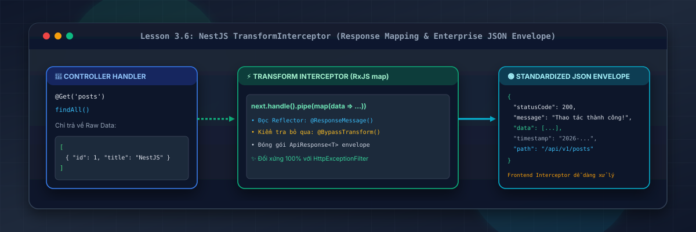
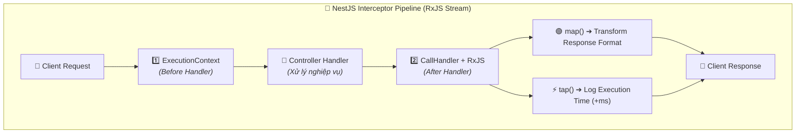
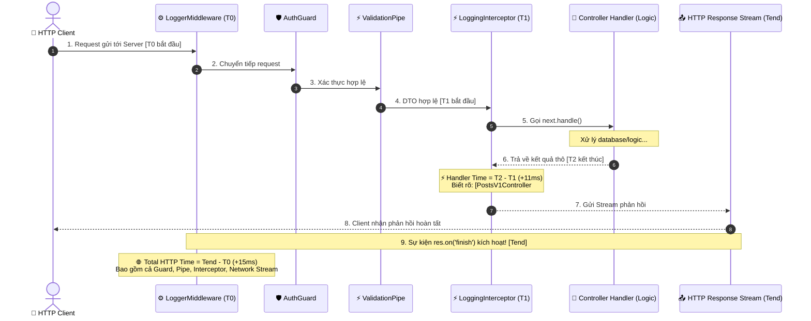
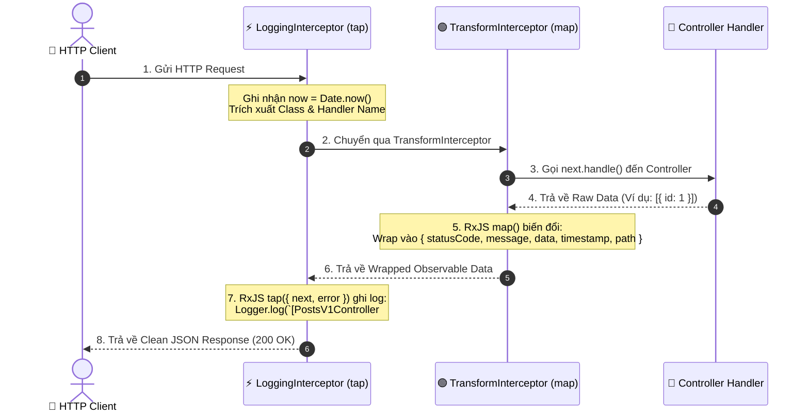

# Lesson 3.6: Interceptors — TransformInterceptor (Chuẩn Hóa Success Response) & Logging Performance

<p align="center">
  
  
  
  
  
  
</p>

<p align="center">
  
</p>

---

> [!NOTE]
> ⏱️ **Thời lượng dự kiến:** 15 – 18 phút  
> 🎯 **Mục tiêu bài học:** Nắm vững tư duy Aspect-Oriented Programming (AOP) và sức mạnh xử lý luồng dữ liệu của RxJS trong NestJS; tự tay xây dựng `TransformInterceptor` bọc dữ liệu thành công (HTTP 2xx) thành định dạng JSON chuẩn Enterprise đối xứng với `HttpExceptionFilter`; làm chủ kỹ thuật tạo Route Decorators `@ResponseMessage()` & `@BypassTransform()` điều khiển Interceptor; triển khai `LoggingInterceptor` xử lý an toàn đa giao thức (Transport-Agnostic), bắt trọn thời gian thực thi cả khi Success lẫn Error với RxJS `tap({ next, error })`; làm chủ kỹ thuật đăng ký Interceptor toàn cục qua Dependency Injection (`APP_INTERCEPTOR`).

---

## 1. Interceptor Trong NestJS Là Gì? Vòng Đời AOP (Aspect-Oriented Programming)

### 💡 Ẩn Dụ Thực Tế: Dây Chuyền Đóng Gói Hàng Hóa Tự Động

Hãy hình dung Controller Handler của bạn giống như một **Công Nhân Chế Tạo Sản Phẩm**:

- Công nhân chỉ tập trung tạo ra cốt lõi sản phẩm (Ví dụ: Trả về mảng dữ liệu `[{ id: 1, name: "Shirt" }]`).
- Sau khi sản phẩm làm xong, nó đi qua **Dây Chuyền Đóng Gói Tự Động (TransformInterceptor)**: Dây chuyền sẽ tự động đọc nhãn dán thông báo (`@ResponseMessage()`) hoặc cờ bỏ qua (`@BypassTransform()`), rồi cho sản phẩm vào hộp đẹp mắt, dán nhãn Mã trạng thái (`statusCode`), Thẻ thời gian (`timestamp`), Đường dẫn (`path`) và Thông báo (`message`).
- Đồng thời, cảm biến trên dây chuyền **(LoggingInterceptor)** ghi nhận chính xác thời gian từ lúc bắt đầu gia công đến khi đóng gói xong mất bao nhiêu miligiây (`+11ms`), kèm theo mã định danh của công đoạn (`PostsV1Controller#findAll`).



---

### 🔹 Khả Năng Mạnh Mẽ Của Interceptor Trong NestJS

Interceptor lấy cảm hứng từ kỹ thuật **Aspect-Oriented Programming (AOP)**. Nó có thể can thiệp vào cả **trước (Before)** và **sau (After)** khi Controller Handler thực thi:

1. **Biến đổi kết quả trả về (`map` operator):** Chuẩn hóa toàn bộ Success Payload thành 1 cấu trúc JSON duy nhất đồng nhất với Error Payload của `HttpExceptionFilter`.
2. **Đo lường hiệu năng (`tap` operator):** Tính toán thời gian thực thi của từng Handler cụ thể để phát hiện chốt cổ chai (Slow API / Bottleneck).
3. **Bỏ qua hoặc Thay thế logic:** Trả về kết quả từ Cache (Redis/In-Memory) mà không cần gọi vào Controller Database.
4. **Xử lý Timeout (`timeout` operator):** Tự động hủy yêu cầu nếu Handler chạy quá thời gian cho phép (ví dụ > 5 giây).

---

## 2. 💡 Deep Dive: So Sánh Toàn Diện `LoggerMiddleware` vs `LoggingInterceptor`

> [!IMPORTANT]
> **Câu hỏi kiến trúc cốt lõi:** _"Tại sao ở Lesson 3.3 chúng ta đã viết `LoggerMiddleware`, sang Lesson 3.6 lại viết thêm `LoggingInterceptor`? Chúng giải quyết bài toán gì ở các tầng khác nhau?"_

### 📊 Bảng So Sánh Chi Tiết Giữa 2 Tầng Logging

| Tiêu chí                                       | `LoggerMiddleware` (Lesson 3.3)                                                                                                                                        | `LoggingInterceptor` (Lesson 3.6)                                                                                                                                             |
| :--------------------------------------------- | :--------------------------------------------------------------------------------------------------------------------------------------------------------------------- | :---------------------------------------------------------------------------------------------------------------------------------------------------------------------------- |
| **Vị trí trong Pipeline**                      | **Tầng HTTP thấp nhất (Express/Fastify)**, chạy đầu tiên trước Guards/Pipes.                                                                                           | **Tầng NestJS Execution Context**, bao quanh Controller Handler (sau Guards).                                                                                                 |
| **Phạm vi thời gian đo (`+ms`)**               | **Total HTTP Roundtrip (Toàn trình mạng)**:<br/>Từ lúc nhận TCP stream đến khi `res.on('finish')` hoàn tất (gồm cả Middleware, Guards, Pipes, Handler, Serialization). | **Pure Handler Execution Time (Thời gian Controller)**:<br/>Chỉ đo thời gian thực thi thuật toán nghiệp vụ bên trong Controller Method & Service.                             |
| **Khi Request bị lỗi sớm (401 Auth, 400 DTO)** | ✅ **Luôn ghi log được** (vì `res.on('finish')` kích hoạt khi HTTP response trả về).                                                                                   | ❌ **Không được kích hoạt** (nếu `AuthGuard` chặn 401 hoặc `ValidationPipe` chặn 400 thì Interceptor chưa kịp chạy).                                                          |
| **Khả năng truy cập Context**                  | Chỉ có `req`, `res` thô của Express. **Không biết** tên Controller Class, Handler Method hay Metadata.                                                                 | ✅ **Truy cập đầy đủ `ExecutionContext`**: Lấy được Class name (`context.getClass().name`), Method name (`context.getHandler().name`), và Decorator Metadata qua `Reflector`. |
| **Hỗ trợ đa giao thức (Transport)**            | ❌ **Chỉ chạy trên HTTP** (Express).                                                                                                                                   | ✅ **Transport-Agnostic**: Chạy được trên HTTP, **WebSockets** (Module 6), **Microservices** (gRPC, Kafka, Redis).                                                            |
| **Mục đích thực tế trong ứng dụng**            | **HTTP Access Log / Traffic Audit**:<br/>Ghi vết mọi request ra vào (IP, User-Agent, Status Code, Bandwidth byte size).                                                | **Performance Profiling & Application Audit**:<br/>Truy vết chốt cổ chai (bottleneck) của từng hàm Controller, gắn log theo user context và custom metadata.                  |

---

### ⏱️ Sơ Đồ Đối Chiếu Điểm Đo Thời Gian (Timing Measurement)



---

## 3. Luồng Hoạt Động Của TransformInterceptor & LoggingInterceptor



---

## 4. Hướng Dẫn Thực Hành Step-by-Step

### 📌 Bước 1: Tạo Custom Decorators (`@ResponseMessage` & `@BypassTransform`)

Để linh hoạt tùy chỉnh thông báo hoặc bỏ qua việc bọc data (đối với các API xuất file Excel/PDF, SSE stream), chúng ta tạo 2 Decorator chuyên dụng bằng `SetMetadata()`:

#### 1. Custom Decorator `@ResponseMessage()`:

📄 **`src/shared/decorators/response-message.decorator.ts`**

```typescript
import { SetMetadata } from '@nestjs/common';

export const RESPONSE_MESSAGE_KEY = 'RESPONSE_MESSAGE_KEY';

/**
 * Custom Decorator dùng để gán thông báo thành công tùy chỉnh ở cấp độ Route Handler
 * @param message Nội dung thông báo phản hồi (ví dụ: 'Lấy danh sách bài viết thành công')
 */
export const ResponseMessage = (message: string) =>
  SetMetadata(RESPONSE_MESSAGE_KEY, message);
```

#### 2. Custom Decorator `@BypassTransform()`:

📄 **`src/shared/decorators/bypass-transform.decorator.ts`**

```typescript
import { SetMetadata } from '@nestjs/common';

export const BYPASS_TRANSFORM_KEY = 'BYPASS_TRANSFORM_KEY';

/**
 * Custom Decorator dùng khi muốn trả về dữ liệu thô (Raw Response, Binary File, Export Excel/CSV)
 * mà không bị TransformInterceptor đóng gói thành JSON envelope
 */
export const BypassTransform = () => SetMetadata(BYPASS_TRANSFORM_KEY, true);
```

---

### 📌 Bước 2: Triển Khai `TransformInterceptor` Chuẩn Hóa Success Response

> [!TIP]
> **Lưu ý khi triển khai:**
>
> 1. Định nghĩa interface `ApiResponse<T>` mang tính tổng quát (Generics Type-safe).
> 2. Luôn kiểm tra `response.headersSent` để tránh xung đột khi controller đã tự stream dữ liệu hoặc gửi headers.
> 3. Cấu trúc response đối xứng với `HttpExceptionFilter` (có `statusCode`, `message`, `data`, `timestamp`, `path`).

📄 **`src/shared/interceptors/transform.interceptor.ts`**

```typescript
import {
  CallHandler,
  ExecutionContext,
  Injectable,
  NestInterceptor,
} from '@nestjs/common';
import { Reflector } from '@nestjs/core';
import { Request, Response } from 'express';
import { Observable } from 'rxjs';
import { map } from 'rxjs/operators';
import { BYPASS_TRANSFORM_KEY } from '../decorators/bypass-transform.decorator';
import { RESPONSE_MESSAGE_KEY } from '../decorators/response-message.decorator';

export interface ApiResponse<T> {
  statusCode: number;
  message: string;
  data: T;
  timestamp: string;
  path: string;
}

@Injectable()
export class TransformInterceptor<T> implements NestInterceptor<
  T,
  ApiResponse<T> | T
> {
  constructor(private readonly reflector: Reflector) {}

  intercept(
    context: ExecutionContext,
    next: CallHandler<T>,
  ): Observable<ApiResponse<T> | T> {
    // 1. Kiểm tra nếu không phải HTTP context (ví dụ WebSockets / Microservices) -> bỏ qua
    if (context.getType() !== 'http') {
      return next.handle();
    }

    // 2. Kiểm tra nếu Route Handler hoặc Controller Class có gắn @BypassTransform()
    const isBypass = this.reflector.getAllAndOverride<boolean>(
      BYPASS_TRANSFORM_KEY,
      [context.getHandler(), context.getClass()],
    );

    if (isBypass) {
      return next.handle();
    }

    const ctx = context.switchToHttp();
    const response = ctx.getResponse<Response>();
    const request = ctx.getRequest<Request>();

    // 3. Trích xuất thông báo tùy chỉnh từ @ResponseMessage() (nếu có)
    const customMessage =
      this.reflector.getAllAndOverride<string>(RESPONSE_MESSAGE_KEY, [
        context.getHandler(),
        context.getClass(),
      ]) || 'Thao tác thực hiện thành công!';

    // 4. Sử dụng RxJS map() operator để bao bọc dữ liệu thành công
    return next.handle().pipe(
      map((data: T): ApiResponse<T> => {
        return {
          statusCode: response.statusCode,
          message: customMessage,
          data: data ?? (null as unknown as T),
          timestamp: new Date().toISOString(),
          path: request.originalUrl || request.url,
        };
      }),
    );
  }
}
```

---

### 📌 Bước 3: Triển Khai `LoggingInterceptor` Đo Thời Gian Thực Thi (Execution Time)

> [!IMPORTANT]
> **Điểm cốt lõi:**
>
> 1. **Transport-Agnostic Check**: Kiểm tra ngữ cảnh giao thức (`context.getType() === 'http'`) để an toàn khi scale sang WebSockets / Microservices.
> 2. **Xử lý trọn vẹn cả Success & Error với RxJS `tap({ next, error })`**: Nếu Controller xảy ra ngoại lệ (throw Exception), hàm callback `error` vẫn ghi nhận thời gian thực thi trước khi kết thúc, không làm mất vết profiling của API lỗi.
> 3. **Cảnh báo API chậm (Slow API Threshold)**: Nếu thời gian thực thi $\ge 1000\text{ms}$, ghi log ở level `WARN` để cảnh báo cần tối ưu query DB.
> 4. **Trích xuất Context `[Class#Method]`**: Dùng `context.getClass().name` và `context.getHandler().name`.

📄 **`src/shared/interceptors/logging.interceptor.ts`**

```typescript
import {
  CallHandler,
  ExecutionContext,
  Injectable,
  Logger,
  NestInterceptor,
} from '@nestjs/common';
import { Request } from 'express';
import { Observable } from 'rxjs';
import { tap } from 'rxjs/operators';

@Injectable()
export class LoggingInterceptor implements NestInterceptor {
  private readonly logger = new Logger('Performance');
  private readonly SLOW_REQUEST_THRESHOLD_MS = 1000; // Ngưỡng cảnh báo API chạy chậm (1 giây)

  intercept(context: ExecutionContext, next: CallHandler): Observable<any> {
    // 1. Chỉ áp dụng trích xuất HTTP Request nếu đang ở ngữ cảnh HTTP
    if (context.getType() !== 'http') {
      return next.handle();
    }

    const request = context.switchToHttp().getRequest<Request>();
    const { method, originalUrl, url } = request;
    const targetUrl = originalUrl || url;

    // 2. Trích xuất tên Controller Class và tên Method Handler
    const className = context.getClass().name;
    const handlerName = context.getHandler().name;
    const startTime = Date.now();

    // 3. Sử dụng tap() với cả 2 luồng next (thành công) và error (thất bại)
    return next.handle().pipe(
      tap({
        next: () => {
          const duration = Date.now() - startTime;
          const logMessage = `[${className}#${handlerName}] ${method} ${targetUrl} +${duration}ms`;

          if (duration >= this.SLOW_REQUEST_THRESHOLD_MS) {
            this.logger.warn(`[SLOW API] ${logMessage}`);
          } else {
            this.logger.log(logMessage);
          }
        },
        error: (error: Error) => {
          const duration = Date.now() - startTime;
          this.logger.error(
            `[${className}#${handlerName}] ${method} ${targetUrl} +${duration}ms [FAILED: ${error.message}]`,
          );
        },
      }),
    );
  }
}
```

---

### 📌 Bước 4: Đăng Ký Interceptors Toàn Cục Trong `AppModule`

> [!TIP]
> **Khuyến nghị thiết kế:** Thay vì dùng `app.useGlobalInterceptors(new ...)` trong `main.ts`, đăng ký qua token `APP_INTERCEPTOR` trong `AppModule` là cách làm chuẩn vì:
>
> 1. Cho phép NestJS **Dependency Injection (DI)** tự động inject các dependencies (như `Reflector`, `ConfigService`) vào Interceptor mà không cần khởi tạo thủ công bằng từ khóa `new`.
> 2. Dễ dàng viết Unit Test và E2E Test với Test Mock Container.
> 3. Giữ tệp `main.ts` cực kỳ tinh gọn, đúng nhiệm vụ duy nhất là bootstrap HTTP server.

Mở tệp `src/app.module.ts` và đăng ký 2 Interceptor vào mảng `providers`:

📄 **`src/app.module.ts`**

```typescript
import { MiddlewareConsumer, Module, RequestMethod } from '@nestjs/common';
import { APP_FILTER, APP_INTERCEPTOR } from '@nestjs/core';
import { ConfigModule } from '@nestjs/config';
import { AppController } from './app.controller';
import { AppService } from './app.service';
import { UsersModule } from './users/users.module';
import { PostsModule } from './posts/posts.module';
import { PrismaModule } from './prisma/prisma.module';
import { envValidationSchema } from './config/env.validation';
import { LoggerMiddleware } from './shared/middleware/logger.middleware';
import { HttpExceptionFilter } from './shared/filters/http-exception.filter';
import { PrismaClientExceptionFilter } from './shared/filters/prisma-client-exception.filter';
import { LoggingInterceptor } from './shared/interceptors/logging.interceptor';
import { TransformInterceptor } from './shared/interceptors/transform.interceptor';

@Module({
  imports: [
    ConfigModule.forRoot({
      validationSchema: envValidationSchema,
      isGlobal: true,
    }),
    PrismaModule,
    UsersModule,
    PostsModule,
  ],
  controllers: [AppController],
  providers: [
    AppService,
    // 1. Đăng ký Global Interceptors theo thứ tự thực thi: Logging -> Transform
    {
      provide: APP_INTERCEPTOR,
      useClass: LoggingInterceptor,
    },
    {
      provide: APP_INTERCEPTOR,
      useClass: TransformInterceptor,
    },
    // 2. Đăng ký Global Exception Filters
    {
      provide: APP_FILTER,
      useClass: PrismaClientExceptionFilter,
    },
    {
      provide: APP_FILTER,
      useClass: HttpExceptionFilter,
    },
  ],
})
export class AppModule {
  configure(consumer: MiddlewareConsumer) {
    consumer
      .apply(LoggerMiddleware)
      .exclude({ path: 'health', method: RequestMethod.GET })
      .forRoutes('*');
  }
}
```

---

## 5. Kịch Bản Kiểm Tra & Thử Nghiệm (Hands-on Lab)

### 🟢 Kịch Bản 1: Kiểm Thử Success Response Auto Transform & Performance Log

Khởi chạy Server (`pnpm start:dev`) và thực hiện câu lệnh cURL lấy danh sách bài viết:

```bash
curl -X GET http://localhost:3000/api/v1/posts
```

📥 **Phản hồi HTTP trả về cho Client (`200 OK` - Chuẩn hóa tự động):**

```json
{
  "statusCode": 200,
  "message": "Thao tác thực hiện thành công!",
  "data": [
    { "id": "1", "title": "Bài viết NestJS v1", "author": "Thành Đỗ" },
    { "id": "2", "title": "Hướng dẫn Versioning v1", "author": "NestJS Team" }
  ],
  "timestamp": "2026-08-13T15:20:00.123Z",
  "path": "/api/v1/posts"
}
```

🖥️ **Log đồng thời ghi nhận tại Terminal Server (Cả Middleware lẫn Interceptor cùng phối hợp):**

```text
[Nest] 52300  - 13/08/2026, 15:20:00     LOG [Performance] [PostsV1Controller#findAll] GET /api/v1/posts +11ms
[Nest] 52300  - 13/08/2026, 15:20:00     LOG [HTTP] GET /api/v1/posts 200 248b - +15ms [IP: ::1] [Agent: curl/8.7.1]
```

> [!NOTE]
> **Quan sát độ trễ:**
>
> - `[Performance]` ghi nhận `+11ms`: Thời gian xử lý thuần túy bên trong `PostsV1Controller#findAll`.
> - `[HTTP]` ghi nhận `+15ms`: Tổng thời gian từ khi nhận request đến khi hoàn tất gửi trả dữ liệu. Phần chênh lệch `4ms` là thời gian đi qua Middleware, Pipe, TransformInterceptor và đóng gói response stream.

---

### 🟢 Kịch Bản 2: Kiểm Thử Custom `@ResponseMessage()` & `@BypassTransform()`

Thêm các Route thử nghiệm trong Controller:

```typescript
import { Controller, Get, Post, Body } from '@nestjs/common';
import { ResponseMessage } from '../shared/decorators/response-message.decorator';
import { BypassTransform } from '../shared/decorators/bypass-transform.decorator';
import { CreateUserDto } from './dto/create-user.dto';

@Controller('users')
export class UsersController {
  // 1. Route có thông báo tùy chỉnh
  @Post()
  @ResponseMessage('Đăng ký tài khoản mới thành công!')
  createUser(@Body() dto: CreateUserDto) {
    return { userId: '1001', username: dto.username };
  }

  // 2. Route Bypass (Xuất dữ liệu thô/Stream CSV)
  @Get('export-raw')
  @BypassTransform()
  exportRaw() {
    return 'RAW_CSV_DATA_LINE1,LINE2';
  }
}
```

#### Test 1: Gọi API Đăng ký tài khoản:

```bash
curl -X POST http://localhost:3000/api/v1/users \
  -H "Content-Type: application/json" \
  -d '{"username": "alex", "email": "alex@example.com", "age": 25}'
```

📥 **Phản hồi JSON:**

```json
{
  "statusCode": 201,
  "message": "Đăng ký tài khoản mới thành công!",
  "data": { "userId": "1001", "username": "alex" },
  "timestamp": "2026-08-13T15:20:05.456Z",
  "path": "/api/v1/users"
}
```

#### Test 2: Gọi API Export Raw:

```bash
curl -X GET http://localhost:3000/api/v1/users/export-raw
```

📥 **Phản hồi Text Thô (Không bị bọc data):**

```text
RAW_CSV_DATA_LINE1,LINE2
```

✅ **Kết quả:** `@BypassTransform()` hoạt động hoàn hảo, cho phép giữ nguyên dữ liệu gốc cho các API đặc thù!

---

## 6. Tổng Kết Bài Học & Checklist Ghi Nhớ

```mermaid
mindmap
  root(("NestJS Interceptors"))
    "Tư duy AOP"
      "Can thiệp Before & After Handler"
      "Sử dụng RxJS Observables"
      "Đa giao thức (HTTP, WS, Microservices)"
    "TransformInterceptor"
      "Generics Type-safe ApiResponse<T>"
      "Bọc Success Data đồng bộ với HttpExceptionFilter"
      "Tùy biến với @ResponseMessage()"
      "Hỗ trợ @BypassTransform()"
    "LoggingInterceptor"
      "Bắt trọn cả Success & Error qua RxJS tap"
      "Cảnh báo Slow API (>=1000ms)"
      "Lấy tên Controller#Method từ ExecutionContext"
      "Khác biệt với LoggerMiddleware (HTTP Level)"
    "Dependency Injection"
      "Đăng ký qua token APP_INTERCEPTOR"
      "Tự động resolve Reflector qua DI container"
```

### ✅ Checklist Ghi Nhớ Bài Học:

- [x] Thấu hiểu tư duy Aspect-Oriented Programming (AOP) và vai trò của Interceptors trong NestJS.
- [x] Phân biệt rõ bản chất giữa `LoggerMiddleware` (HTTP Level, Total Roundtrip) và `LoggingInterceptor` (Application AOP Level, Handler Performance Profiling).
- [x] Triển khai thành công `@ResponseMessage()` và `@BypassTransform()` Route Decorators.
- [x] Triển khai `TransformInterceptor` bọc chuẩn JSON type-safe `ApiResponse<T>` đối xứng hoàn hảo với `HttpExceptionFilter`.
- [x] Triển khai `LoggingInterceptor` an toàn đa giao thức, bắt trọn cả Success & Error với RxJS `tap({ next, error })`, tự động phát hiện `[SLOW API]`.
- [x] Đăng ký thành công Interceptors toàn cục qua NestJS Dependency Injection với token `APP_INTERCEPTOR` trong `AppModule`.
- [x] Thử nghiệm thành công cURL cho cả 3 kịch bản Success Transform, Custom Message và Bypass Data.

---

👉 **Bài tiếp theo:** [Lesson 4.1: Password Hashing — Mã Hóa Mật Khẩu An Toàn Với bcrypt](../../module-04/lesson-4.1/lesson-4.1.md)
