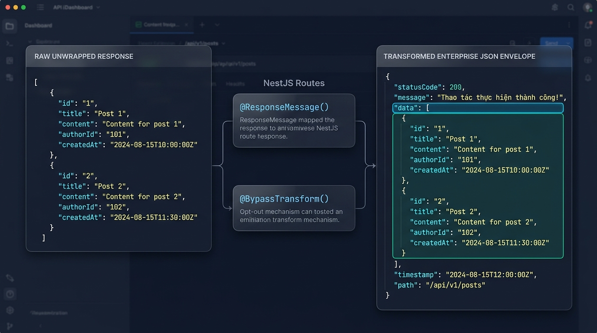
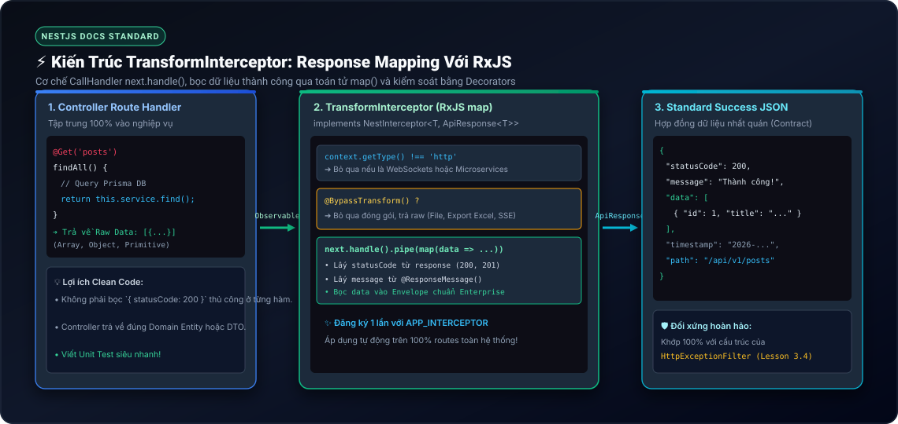

# Lesson 3.6: Interceptors — Xây Dựng TransformInterceptor Chuẩn Hóa Dữ Liệu Phản Hồi Toàn Cục

<p align="center">
  
  
  
  
  
</p>

<p align="center">
  
</p>

---

> [!NOTE]
> ⏱️ **Thời lượng:** 10 – 12 phút thực chiến  
> 🎯 **Mục tiêu:** Nắm vững tư duy Aspect-Oriented Programming (AOP) và kỹ thuật **Response Mapping** theo tài liệu chính thức của NestJS; hiểu rõ cơ chế `CallHandler` và hàm `next.handle()`; tự tay xây dựng `TransformInterceptor` bọc dữ liệu thành công (2xx) thành định dạng JSON Envelope chuẩn mực đối xứng với `HttpExceptionFilter`; làm chủ bộ đôi decorators `@ResponseMessage()` & `@BypassTransform()`; đăng ký Interceptor toàn cục qua Dependency Injection (`APP_INTERCEPTOR`).

---

## 1. Interceptor Trong NestJS Là Gì? (Theo Chuẩn NestJS Docs)

Theo [Tài liệu chính thức của NestJS](https://docs.nestjs.com/interceptors), Interceptor được lấy cảm hứng từ kỹ thuật **Aspect-Oriented Programming (AOP)** với các năng lực mạnh mẽ:

- Gắn thêm logic bổ trợ trước (**Before**) và sau (**After**) khi Route Handler thực thi.
- **Biến đổi kết quả trả về (Transform/Response Mapping):** Thay đổi cấu trúc dữ liệu trả về từ hàm Controller.
- **Biến đổi ngoại lệ (Transform Exception):** Can thiệp vào lỗi ném ra.
- **Mở rộng hành vi (Override):** Thay thế logic hàm (ví dụ phục vụ bộ nhớ đệm Caching).

Trong bài học này, chúng ta tập trung vào năng lực quan trọng nhất: **Response Mapping** với toán tử RxJS `map()`.

---

### 📱 So Sánh Trực Quan: Raw Response vs Enterprise JSON Envelope

<p align="center">
  
</p>

| Tiêu chí                   | 🔴 Raw Controller Response                             | 🟢 Standardized JSON Envelope                                          |
| :------------------------- | :----------------------------------------------------- | :--------------------------------------------------------------------- |
| **Cấu trúc dữ liệu**       | Trả về mảng hoặc object trần trụi (`[{ id: 1 }]`)      | Đóng gói nhất quán: `{ statusCode, message, data, timestamp, path }`   |
| **Tính đối xứng**          | Bất đối xứng (Lỗi có envelope nhưng Success thì không) | Đối xứng 100% với `HttpExceptionFilter` (Lesson 3.4)                   |
| **Phía Client / Frontend** | Frontend phải viết code kiểm tra định dạng từng route  | Axios Interceptor xử lý tự động trên toàn bộ hệ thống                  |
| **Tùy biến linh hoạt**     | Viết code bọc thủ công ở từng Controller method        | Tùy biến qua `@ResponseMessage()` hoặc bỏ qua với `@BypassTransform()` |

---

## 2. Kiến Trúc `TransformInterceptor` & Cơ Chế `CallHandler`

<p align="center">
  
</p>

### 🔹 Cơ Chế Hoạt Động Của `CallHandler` & `next.handle()`

Mỗi Interceptor bắt buộc phải triển khai interface `NestInterceptor`:

```typescript
export interface NestInterceptor<T = any, R = any> {
  intercept(context: ExecutionContext, next: CallHandler<T>): Observable<R>;
}
```

1. **`ExecutionContext`**: Cung cấp ngữ cảnh thực thi (HTTP, WebSockets, Microservices).
2. **`next.handle()`**: Là điểm mấu chốt kích hoạt Controller Route Handler.
   - Nếu bạn **không gọi** `next.handle()`, hàm trong Controller sẽ **không bao giờ được thực thi**!
   - `next.handle()` trả về một RxJS `Observable`. Khi Controller return dữ liệu, giá trị đó sẽ chảy qua luồng stream.
3. **Toán tử `map()` của RxJS**: Bắt lấy dữ liệu thô từ Stream và đóng gói thành đối tượng `ApiResponse<T>` trước khi gửi về Client.

---

## 3. Hướng Dẫn Thực Hành Step-by-Step

### 📂 Cấu Trúc File Triển Khai (Tách Biệt Trách Nhiệm - SoC)

```
src/shared/
├── constants/
│   └── metadata.constant.ts           👈 Metadata Keys tập trung
├── interfaces/
│   └── api-response.interface.ts      👈 Data Contract ApiResponse<T>
├── decorators/
│   ├── response-message.decorator.ts  👈 @ResponseMessage('...')
│   └── bypass-transform.decorator.ts  👈 @BypassTransform()
└── interceptors/
    └── transform.interceptor.ts       👈 TransformInterceptor duy nhất
```

---

### 📌 Bước 1: Khởi Tạo Constants & Interface

📄 **`src/shared/constants/metadata.constant.ts`**

```typescript
export const RESPONSE_MESSAGE_KEY = 'RESPONSE_MESSAGE_KEY';
export const BYPASS_TRANSFORM_KEY = 'BYPASS_TRANSFORM_KEY';
```

📄 **`src/shared/interfaces/api-response.interface.ts`**

```typescript
export interface ApiResponse<T> {
  statusCode: number;
  message: string;
  data: T;
  timestamp: string;
  path: string;
}
```

---

### 📌 Bước 2: Tạo Bộ Đôi Decorators Điều Khiển Interceptor

📄 **`src/shared/decorators/response-message.decorator.ts`**

```typescript
import { SetMetadata } from '@nestjs/common';
import { RESPONSE_MESSAGE_KEY } from '../constants/metadata.constant';

export const ResponseMessage = (message: string) =>
  SetMetadata(RESPONSE_MESSAGE_KEY, message);
```

📄 **`src/shared/decorators/bypass-transform.decorator.ts`**

```typescript
import { SetMetadata } from '@nestjs/common';
import { BYPASS_TRANSFORM_KEY } from '../constants/metadata.constant';

export const BypassTransform = () => SetMetadata(BYPASS_TRANSFORM_KEY, true);
```

---

### 📌 Bước 3: Triển Khai `TransformInterceptor`

📄 **`src/shared/interceptors/transform.interceptor.ts`**

```typescript
import {
  CallHandler,
  ExecutionContext,
  Injectable,
  NestInterceptor,
} from '@nestjs/common';
import { Reflector } from '@nestjs/core';
import { Request, Response } from 'express';
import { Observable } from 'rxjs';
import { map } from 'rxjs/operators';
import {
  BYPASS_TRANSFORM_KEY,
  RESPONSE_MESSAGE_KEY,
} from '../constants/metadata.constant';
import { ApiResponse } from '../interfaces/api-response.interface';

@Injectable()
export class TransformInterceptor<T> implements NestInterceptor<
  T,
  ApiResponse<T> | T
> {
  constructor(private readonly reflector: Reflector) {}

  intercept(
    context: ExecutionContext,
    next: CallHandler<T>,
  ): Observable<ApiResponse<T> | T> {
    // 1. Bỏ qua nếu không phải ngữ cảnh HTTP (an toàn đa giao thức)
    if (context.getType() !== 'http') {
      return next.handle();
    }

    // 2. Kiểm tra cờ @BypassTransform() trên Handler hoặc Controller Class
    const isBypass = this.reflector.getAllAndOverride<boolean>(
      BYPASS_TRANSFORM_KEY,
      [context.getHandler(), context.getClass()],
    );
    if (isBypass) {
      return next.handle();
    }

    const ctx = context.switchToHttp();
    const response = ctx.getResponse<Response>();
    const request = ctx.getRequest<Request>();

    // 3. Đọc thông báo tùy biến từ @ResponseMessage()
    const customMessage =
      this.reflector.getAllAndOverride<string>(RESPONSE_MESSAGE_KEY, [
        context.getHandler(),
        context.getClass(),
      ]) || 'Thao tác thực hiện thành công!';

    // 4. Kích hoạt Controller qua next.handle() và bọc dữ liệu bằng RxJS map()
    return next.handle().pipe(
      map((data: T): ApiResponse<T> => ({
        statusCode: response.statusCode,
        message: customMessage,
        data: data ?? (null as unknown as T),
        timestamp: new Date().toISOString(),
        path: request.originalUrl || request.url,
      })),
    );
  }
}
```

---

### 📌 Bước 4: Đăng Ký Interceptor Toàn Cục Trong `AppModule`

Đăng ký thông qua token **`APP_INTERCEPTOR`** trong `AppModule` giúp NestJS IoC Container tự động tiêm (inject) `Reflector` vào constructor:

📄 **`src/app.module.ts`**

```typescript
import { Module } from '@nestjs/common';
import { APP_INTERCEPTOR } from '@nestjs/core';
import { TransformInterceptor } from './shared/interceptors/transform.interceptor';

@Module({
  providers: [
    {
      provide: APP_INTERCEPTOR,
      useClass: TransformInterceptor,
    },
  ],
})
export class AppModule {}
```

---

## 4. Kịch Bản Kiểm Thử (Hands-on Lab)

Khởi động server:

```bash
pnpm start:dev
```

Mở Terminal và thực hiện 3 kịch bản kiểm thử:

---

### 🟢 Kịch Bản 1: Tự Động Bọc Chuẩn Success Response Mặc Định

Gửi request lấy danh sách bài viết:

```bash
curl -i -X GET http://localhost:3000/api/v1/posts
```

📥 **Phản hồi nhận được (`200 OK` — Tự động bọc Envelope):**

```json
HTTP/1.1 200 OK
Content-Type: application/json; charset=utf-8

{
  "statusCode": 200,
  "message": "Thao tác thực hiện thành công!",
  "data": [
    { "id": 1, "title": "Bài viết NestJS v1" },
    { "id": 2, "title": "Hướng dẫn Versioning v1" }
  ],
  "timestamp": "2026-09-19T10:30:00.123Z",
  "path": "/api/v1/posts"
}
```

---

### 🟢 Kịch Bản 2: Tùy Biến Thông Báo Với `@ResponseMessage()`

Thêm route tạo tài khoản có gắn thông báo tùy chỉnh:

```typescript
@Post()
@ResponseMessage('Đăng ký tài khoản mới thành công!')
createUser(@Body() dto: CreateUserDto) {
  return this.usersService.create(dto);
}
```

Gửi request tạo người dùng:

```bash
curl -i -X POST http://localhost:3000/api/v1/users \
  -H "Content-Type: application/json" \
  -d '{"username": "alex", "email": "alex@example.com", "age": 25}'
```

📥 **Phản hồi nhận được (`201 Created` kèm message tùy biến):**

```json
HTTP/1.1 201 Created
Content-Type: application/json; charset=utf-8

{
  "statusCode": 201,
  "message": "Đăng ký tài khoản mới thành công!",
  "data": { "id": 1001, "username": "alex" },
  "timestamp": "2026-09-19T17:35:05.456Z",
  "path": "/api/v1/users"
}
```

---

### 🟡 Kịch Bản 3: Bỏ Qua Đóng Gói Dữ Liệu Với `@BypassTransform()`

Sử dụng khi xuất file Excel, PDF, Text thô hoặc Server-Sent Events (SSE):

```typescript
@Get('export-raw')
@BypassTransform()
exportRaw() {
  return 'ID,USERNAME,EMAIL\n1,alex,alex@example.com';
}
```

Gửi request:

```bash
curl -i -X GET http://localhost:3000/api/v1/users/export-raw
```

📥 **Phản hồi nhận được (Giữ nguyên Raw Text, không bị bọc Envelope):**

```text
HTTP/1.1 200 OK
Content-Type: text/html; charset=utf-8

ID,USERNAME,EMAIL
1,alex,alex@example.com
```

✅ **Kết quả:** `@BypassTransform()` cho phép bạn giữ nguyên dữ liệu gốc cho các API đặc thù mà không làm ảnh hưởng đến các API khác!

---

## 5. Tổng Kết Bài Học & Checklist Ghi Nhớ

```mermaid
mindmap
  root(("NestJS TransformInterceptor"))
    "Khái Niệm AOP"
      "Can thiệp Before & After Handler"
      "Cơ chế CallHandler next.handle()"
      "Response Mapping với RxJS map()"
    "Cấu Trúc Hợp Đồng"
      "Data Contract: ApiResponse<T>"
      "Đối xứng 100% với HttpExceptionFilter"
      "Tách biệt Constants & Interfaces (SoC)"
    "Route Decorators"
      "@ResponseMessage('...') tùy biến message"
      "@BypassTransform() trả về dữ liệu thô"
    "Cấu Hình Toàn Cục"
      "Đăng ký token APP_INTERCEPTOR trong AppModule"
      "Tự động tiêm Reflector qua DI Container"
```

### ✅ Checklist Ghi Nhớ:

- [x] Hiểu rõ cơ chế AOP và vai trò của `CallHandler.handle()` theo chuẩn NestJS Docs.
- [x] Thấu hiểu tính đối xứng giữa `TransformInterceptor` (Thành công) và `HttpExceptionFilter` (Lỗi).
- [x] Triển khai thành công bộ đôi Route Decorators `@ResponseMessage()` và `@BypassTransform()`.
- [x] Xây dựng hoàn chỉnh `TransformInterceptor` bọc dữ liệu qua toán tử RxJS `map()`.
- [x] Đăng ký Interceptor toàn cục qua `APP_INTERCEPTOR` trong `AppModule`.
- [x] Kiểm thử thành công cả 3 kịch bản: Envelope mặc định, Custom Message, và Bypass Data.

---

👉 **Bài tiếp theo:** [Lesson 4.1: Password Hashing — Mã Hóa Mật Khẩu An Toàn Với bcrypt](../../module-04/lesson-4.1/lesson-4.1.md)
