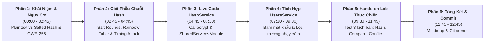

# Kịch Bản Giảng Dạy (Instructor Script)

## Lesson 4.1: Password Hashing — Mã Hóa Mật Khẩu An Toàn Với bcrypt Trong NestJS

<p align="center">
  
  
  
  
  
</p>

<p align="center">
  
</p>

---

## 🎯 Thông Tin Tổng Quan Bài Học

- **Bài học:** Lesson 4.1: Password Hashing — Mã Hóa Mật Khẩu An Toàn Với bcrypt Trong NestJS
- **Khóa học:** NestJS Thực Chiến: Xây Dựng API Từ Cơ Bản Đến Nâng Cao
- **Thời lượng dự kiến:** 11 – 13 phút thực chiến
- **Mục tiêu cốt lõi:**
  1. Thấu hiểu nguyên lý an toàn thông tin bắt buộc: **Tuyệt đối không lưu mật khẩu Plaintext** (nguy cơ CWE-256 & OWASP Cryptographic Failures).
  2. Phân biệt sâu sắc giữa **Mã hóa 2 chiều (Encryption)** và **Băm 1 chiều (Salted Hashing)** trong lưu trữ thông tin xác thực.
  3. Giải phẫu chi tiết chuỗi băm 60 ký tự của `bcrypt` (Thuật toán, Cost Factor, 128-bit Salt ngẫu nhiên và Hash).
  4. Live-code 100% xây dựng `HashService` chuẩn mực với `hashPassword()` và `comparePassword()` (so sánh Constant-Time chống Timing Attack).
  5. Đóng gói `@Global()` `SharedServicesModule` để tái sử dụng dịch vụ mã hóa toàn hệ thống mà không cần import lặp lại.
  6. Tích hợp băm mật khẩu vào `UsersService`, lọc sạch trường `password` khỏi response trả về Client, và kiểm thử 3 kịch bản thực tế qua cURL & Prisma Studio.
- **Chuẩn bị trước khi quay (Instructor Pre-recording Checklist):**
  - [x] Đang ở branch `lesson/4.1` (`git checkout -b lesson/4.1`).
  - [x] Mở sẵn VS Code với giao diện chuẩn 1080p, font chữ JetBrains Mono size 16–18 rõ nét.
  - [x] Đảm bảo PostgreSQL & Docker container đang chạy nền, kết nối Prisma ổn định.
  - [x] Mở sẵn 2 tab Terminal: Tab 1 chạy server NestJS (`pnpm start:dev`), Tab 2 dùng để gõ lệnh cURL hoặc mở Prisma Studio (`pnpm prisma studio`).
  - [x] Chuẩn bị sẵn các file hình ảnh và sơ đồ trong `assets/` để chuyển cảnh mượt mà: `password_hashing_ui_mockup.jpg` và `password_hashing_architecture.svg`.

---

## ⏱️ Sơ Đồ Phân Bổ Thời Gian (Timeline Roadmap)



---

## 🎬 Chi Tiết Kịch Bản Giảng Dạy Từng Phân Cảnh (Scene-by-Scene)

---

### PHẦN 1: KHỞI ĐỘNG & NGUY CƠ BẢO MẬT PLAINTEXT (00:00 – 02:45)

#### ⏱️ Phút 00:00 - 01:15 | Lời Mở Đầu Cuốn Hút & Chào Đón Module 4

- 🎬 **Hành động & Màn hình hiển thị (Screen/Visuals):**
  - Giảng viên xuất hiện trên webcam với phong thái hào hứng, chuyên nghiệp.
  - Chiếu Slide Title bài học và Banner Overview `lesson_overview_banner.svg`.
  - Chuyển sang chiếu hình ảnh UI Mockup trực quan [password_hashing_ui_mockup.jpg](./assets/password_hashing_ui_mockup.jpg) minh họa sự khác biệt kinh hoàng giữa lưu mật khẩu thô và chuỗi băm an toàn trong CSDL.

- 🎙️ **Lời thoại Giảng viên (Instructor Dialogue):**

  > "Xin chào tất cả các bạn! Chào mừng các bạn đến với **Module 04: Authentication & Authorization (Bảo Mật & Xác Thực)** — một trong những module quan trọng và cốt lõi nhất của toàn bộ khóa học **NestJS Thực Chiến**!
  >
  > Nếu Module 3 đã trang bị cho chúng ta hệ thống Request Pipeline vững chắc với DTO, Validation, Middleware và Exception Filters, thì từ Module 4 này, chúng ta sẽ xây dựng 'Trái tim an ninh' của hệ thống: Quản lý người dùng, Đăng ký, Đăng nhập, JWT Token và Phân quyền RBAC.
  >
  > Và bài học mở đầu hôm nay chính là: **Lesson 4.1: Password Hashing — Mã Hóa Mật Khẩu An Toàn Với bcrypt Trong NestJS**.
  >
  > Hãy nhìn lên màn hình: Ở phía bên trái là kịch bản 'ác mộng' của mọi kỹ sư phần mềm — lưu mật khẩu người dùng dạng thô (Plaintext). Nếu một ngày cơ sở dữ liệu của bạn vô tình bị rò rỉ, mọi mật khẩu của người dùng sẽ bị phơi bày hoàn toàn!
  >
  > Hôm nay, chúng ta sẽ học cách bảo vệ dữ liệu bằng **bcrypt Salted Hashing** — chuẩn mực bảo mật được khuyến nghị bởi tổ chức an ninh mạng toàn cầu OWASP!"

---

#### ⏱️ Phút 01:15 - 02:45 | Tại Sao Không Được Lưu Plaintext? & Phân Biệt Encryption vs Hashing

- 🎬 **Hành động & Màn hình hiển thị (Screen/Visuals):**
  - Chiếu bảng so sánh: **🔴 Mã hóa 2 chiều (Encryption)** vs **🟢 Băm 1 chiều (Salted Hashing)**.
  - Highlight 2 khái niệm: `CWE-256 (Unprotected Storage of Credentials)` và `Credential Stuffing Attack`.

- 🎙️ **Lời thoại Giảng viên (Instructor Dialogue):**

  > "Trong an toàn thông tin, lưu mật khẩu thô vi phạm nghiêm trọng lỗi **CWE-256** thuộc top lỗ hổng nguy hiểm nhất của OWASP.
  >
  > Tại sao nó lại nguy hiểm đến vậy?
  >
  > Bởi vì đa số người dùng có thói quen **dùng chung một mật khẩu** cho rất nhiều dịch vụ: từ tài khoản diễn đàn, mạng xã hội, cho đến email và tài khoản ngân hàng. Nếu website của bạn để lộ mật khẩu thô, tin tặc sẽ lập tức dùng danh sách đó để tấn công vào các tài khoản khác của người dùng — hình thức này gọi là **Credential Stuffing Attack**!
  >
  > Vậy giải pháp là gì? Rất nhiều bạn mới học thường nhầm lẫn giữa **Mã hóa (Encryption)** và **Băm (Hashing)**:
  >
  > - **Mã hóa 2 chiều (Encryption - ví dụ AES, RSA):** Có tính chất khả nghịch. Nó dùng một chiếc chìa khóa bí mật (Secret Key) để biến đổi dữ liệu, và khi cần có thể giải mã ngược lại từ ciphertext về plaintext. Mã hóa dùng cho việc truyền dữ liệu SSL/TLS hoặc mã hóa file. Nhưng nếu dùng để lưu mật khẩu thì cực kỳ nguy hiểm: _Chỉ cần lộ Secret Key, toàn bộ mật khẩu của triệu người dùng sẽ bị giải mã sạch!_
  > - **Băm 1 chiều (Salted Hashing - ví dụ bcrypt, Argon2):** Là một hàm toán học **một chiều (One-way Function)**. Nó biến đổi mật khẩu thành một chuỗi băm cố định. Tính chất sống còn là: **KHÔNG THỂ giải mã ngược từ chuỗi băm trở lại mật khẩu gốc**, ngay cả khi tin tặc nắm toàn bộ mã nguồn và cơ sở dữ liệu của bạn!
  >
  > Khi người dùng đăng nhập, chúng ta không giải mã database, mà chúng ta lấy mật khẩu họ vừa gõ vào, băm lại bằng cùng thuật toán, rồi so sánh hai chuỗi băm với nhau!"

- 💡 **Mẹo sư phạm (Pedagogical Tip):**
  > Nhấn mạnh sự khác biệt: _Encryption cần giải mã ngược, còn Hashing là con đường một chiều không lối về!_ Đây là câu hỏi kinh điển kiểm tra kiến thức bảo mật nền tảng khi đi phỏng vấn.

---

### PHẦN 2: CƠ CHẾ BCRYPT & GIẢI PHẪU CHUỖI HASH 60 KÝ TỰ (02:45 – 04:45)

#### ⏱️ Phút 02:45 - 04:00 | Giải Phẫu Cấu Trúc Chuỗi Hash 60 Ký Tự

- 🎬 **Hành động & Màn hình hiển thị (Screen/Visuals):**
  - Chiếu sơ đồ kiến trúc trực quan [password_hashing_architecture.svg](./assets/password_hashing_architecture.svg).
  - Dùng chuột chỉ rõ 4 phần của chuỗi hash mẫu: `$2b$10$N9qo8uLOickgx2ZMRZoMyeIjZAgcfl7p92ldGxad68LJZdL17lhWy`.

- 🎙️ **Lời thoại Giảng viên (Instructor Dialogue):**

  > "Mời các bạn nhìn lên sơ đồ kiến trúc giải phẫu chuỗi băm của `bcrypt`.
  >
  > Chuỗi băm của `bcrypt` luôn luôn có độ dài chuẩn mực đúng **60 ký tự**, và được chia làm 4 phần rõ rệt:
  >
  > 1. **`$2b$` (2 ký tự đầu):** Định danh phiên bản thuật toán bcrypt (hiện tại `$2b$` là phiên bản mới nhất, an toàn nhất chống lại lỗi tràn bộ đệm).
  > 2. **`$10$` (2 ký tự tiếp theo):** **Cost Factor** hay còn gọi là **Salt Rounds**. Giá trị `10` nghĩa là thuật toán sẽ thực hiện $2^{10} = 1024$ vòng lặp tính toán.
  > 3. **`22 ký tự tiếp theo`:** Chuỗi **Salt (Muối)** ngẫu nhiên 128-bit được sinh tự động.
  > 4. **`31 ký tự cuối cùng`:** Giá trị băm thực sự của mật khẩu sau khi kết hợp với Salt và trải qua 1024 vòng lặp.
  >
  > Cộng toàn bộ lại, chúng ta có một chuỗi an toàn tuyệt đối dài đúng 60 ký tự!"

---

#### ⏱️ Phút 04:00 - 04:45 | 2 Vũ Khí Chống Tấn Công Của bcrypt: Salt & Cost Factor

- 🎬 **Hành động & Màn hình hiển thị (Screen/Visuals):**
  - Highlight 2 cơ chế: **Salt ngẫu nhiên (Chống Rainbow Table)** và **Cost Factor (Chống Brute-force & GPU Mining)**.

- 🎙️ **Lời thoại Giảng viên (Instructor Dialogue):**

  > "Tại sao chúng ta không dùng các hàm băm nhanh như `MD5` hay `SHA-256` mà bắt buộc phải là `bcrypt`?
  >
  > Bởi vì `bcrypt` sở hữu 2 vũ khí bảo vệ đột phá:
  >
  > 🛡️ **Vũ khí 1: Tự động sinh Muối (128-bit Salt):**  
  > Với `MD5` hay `SHA-256`, chuỗi `'123456'` băm ra lúc nào cũng giống nhau. Tin tặc chỉ cần tạo một bảng tra cứu khổng lồ chứa hàng tỷ mật khẩu thông dụng đã băm sẵn (gọi là **Rainbow Table**) để tra ngược ra mật khẩu trong 1 phần triệu giây!  
  > Nhưng với `bcrypt`, mỗi lần băm nó tự sinh một chuỗi Salt ngẫu nhiên mới. Nếu 100 người dùng cùng đặt mật khẩu là `'Secret123!'`, thì trong database sẽ là **100 chuỗi hash hoàn toàn khác nhau**! Rainbow Table hoàn toàn 'bó tay'!
  >
  > 🛡️ **Vũ khí 2: Cost Factor — Làm chậm có chủ đích (Slow by Design):**  
  > `SHA-256` chạy cực nhanh, một máy tính trang bị card GPU hiện đại có thể thử **hàng tỷ mật khẩu mỗi giây** để bẻ khóa (Brute-force).  
  > Ngược lại, `bcrypt` được thiết kế có chủ đích để **tiêu tốn CPU**. Với `Salt Rounds = 10`, mỗi lần băm mất khoảng 60 đến 80 mili-giây. Người dùng đăng nhập mất 70ms thì không hề cảm nhận được độ trễ, nhưng đối với hacker muốn thử 1 tỷ mật khẩu, chúng sẽ phải mất hàng chục năm!
  >
  > ⭐ **Điểm kỳ diệu khi Đăng nhập:**  
  > Các bạn có thắc mắc: _Nếu Salt nằm chung trong chuỗi hash, làm sao khi người dùng đăng nhập, bcrypt biết Salt là gì để so sánh?_  
  > Hàm `bcrypt.compare()` cực kỳ thông minh! Nó tự động đọc Cost Factor và 22 ký tự Salt từ chính chuỗi hash trong database, lấy đúng thông số đó băm mật khẩu người dùng vừa nhập, rồi so sánh bằng kỹ thuật **Constant-Time** để ngăn chặn cả tấn công phân tích độ trễ (Timing Attack)!"

---

### PHẦN 3: LIVE-CODE XÂY DỰNG HASHSERVICE & SHAREDSERVICESMODULE (04:45 – 07:30)

#### ⏱️ Phút 04:45 - 05:45 | Cài Đặt Thư Viện bcrypt & Khởi Tạo HashService

- 🎬 **Hành động & Màn hình hiển thị (Screen/Visuals):**
  - Chuyển sang VS Code, mở Terminal.
  - Gõ lệnh cài đặt `pnpm add bcrypt` và `pnpm add -D @types/bcrypt`.
  - Tạo tệp 📄 **`src/shared/services/hash.service.ts`**.

- 🎙️ **Lời thoại Giảng viên (Instructor Dialogue):**

  > "Bây giờ, chúng ta cùng nhau bắt tay vào phần thực hành live-code!
  >
  > Đầu tiên, chúng ta cần cài đặt thư viện `bcrypt` và gói type definition cho TypeScript:
  >
  > ```bash
  > pnpm add bcrypt
  > pnpm add -D @types/bcrypt
  > ```
  >
  > Sau khi cài đặt xong, theo chuẩn kiến trúc Clean Code trong NestJS, chúng ta không nên gọi trực tiếp `bcrypt.hash()` rải rác ở khắp các controller hay service. Thay vào đó, ta sẽ đóng gói nó thành một **`HashService`** chuyên trách.
  >
  > Chúng ta tạo tệp: `src/shared/services/hash.service.ts`:
  >
  > 📄 **`src/shared/services/hash.service.ts`**
  >
  > ```typescript
  > import { Injectable } from '@nestjs/common';
  > import * as bcrypt from 'bcrypt';
  >
  > @Injectable()
  > export class HashService {
  >   // Salt Rounds = 10 là chuẩn cân bằng hoàn hảo giữa an ninh và hiệu năng CPU
  >   private readonly SALT_ROUNDS = 10;
  >
  >   /**
  >    * Băm mật khẩu thô thành chuỗi bcrypt hash 60 ký tự an toàn
  >    */
  >   async hashPassword(plainText: string): Promise<string> {
  >     return bcrypt.hash(plainText, this.SALT_ROUNDS);
  >   }
  >
  >   /**
  >    * So sánh mật khẩu thô với chuỗi hash trong CSDL (so sánh Constant-Time)
  >    */
  >   async comparePassword(plainText: string, hash: string): Promise<boolean> {
  >     return bcrypt.compare(plainText, hash);
  >   }
  > }
  > ```
  >
  > Rất ngắn gọn và tường minh!
  >
  > - `hashPassword()` nhận vào chuỗi mật khẩu thô và trả về Promise chuỗi băm 60 ký tự.
  > - `comparePassword()` nhận vào mật khẩu người dùng gõ khi đăng nhập và chuỗi hash lưu trong database, trả về `true` nếu khớp và `false` nếu sai."

---

#### ⏱️ Phút 05:45 - 07:30 | Đóng Gói `@Global()` SharedServicesModule

- 🎬 **Hành động & Màn hình hiển thị (Screen/Visuals):**
  - Tạo tệp 📄 **`src/shared/services/shared-services.module.ts`**.
  - Gắn decorator `@Global()`.
  - Mở 📄 **`src/app.module.ts`** và import `SharedServicesModule`.

- 🎙️ **Lời thoại Giảng viên (Instructor Dialogue):**

  > "Bây giờ, làm sao để các module khác như `UsersModule`, `AuthModule` có thể sử dụng được `HashService`?
  >
  > Thông thường, nếu không cấu hình khéo léo, bạn sẽ phải đi import `HashModule` vào từng module một rất rườm rà.
  > Trong NestJS, giải pháp chuẩn Enterprise là tạo một **`SharedServicesModule`** và đánh dấu decorator **`@Global()`**!
  >
  > Tạo tệp: `src/shared/services/shared-services.module.ts`:
  >
  > 📄 **`src/shared/services/shared-services.module.ts`**
  >
  > ```typescript
  > import { Global, Module } from '@nestjs/common';
  > import { HashService } from './hash.service';
  >
  > @Global()
  > @Module({
  >   providers: [HashService],
  >   exports: [HashService],
  > })
  > export class SharedServicesModule {}
  > ```
  >
  > Tiếp theo, chúng ta mở tệp gốc `src/app.module.ts` và đăng ký nó vào mảng `imports`:
  >
  > 📄 **`src/app.module.ts`**
  >
  > ```typescript
  > import { SharedServicesModule } from './shared/services/shared-services.module';
  >
  > @Module({
  >   imports: [
  >     ConfigModule.forRoot(...),
  >     PrismaModule,
  >     SharedServicesModule, // 👈 Đăng ký Global Module tại đây!
  >     UsersModule,
  >     PostsModule,
  >   ],
  >   // ...
  > })
  > export class AppModule implements NestModule { ... }
  > ```
  >
  > ⭐ **Sức mạnh của `@Global()`:**  
  > Chỉ cần đăng ký một lần duy nhất tại `AppModule`, từ thời điểm này trở đi, bất kỳ service nào trong toàn bộ dự án muốn dùng `HashService` chỉ việc khai báo trong constructor: `constructor(private readonly hashService: HashService) {}` là NestJS DI container sẽ tự động inject vào, không cần phải import lại module thủ công nữa!"

---

### PHẦN 4: TÍCH HỢP BĂM MẬT KHẨU VÀO DTO & USERSSERVICE (07:30 – 09:30)

#### ⏱️ Phút 07:30 - 08:30 | Bổ Sung Trường `password` Trong `CreateUserDto`

- 🎬 **Hành động & Màn hình hiển thị (Screen/Visuals):**
  - Mở tệp 📄 **`src/users/dto/create-user.dto.ts`**.
  - Thêm thuộc tính `password` với các validation decorators: `@IsString()`, `@MinLength(6)`.

- 🎙️ **Lời thoại Giảng viên (Instructor Dialogue):**

  > "Bây giờ, chúng ta cập nhật DTO tạo người dùng. Mở tệp `src/users/dto/create-user.dto.ts`:
  >
  > 📄 **`src/users/dto/create-user.dto.ts`**
  >
  > ```typescript
  > import { IsEmail, IsNotEmpty, IsString, MinLength } from 'class-validator';
  >
  > export class CreateUserDto {
  >   @IsString({ message: 'Tên người dùng phải là chuỗi ký tự!' })
  >   @IsNotEmpty({ message: 'Tên người dùng không được để trống!' })
  >   username: string;
  >
  >   @IsEmail({}, { message: 'Email không đúng định dạng!' })
  >   email: string;
  >
  >   @IsString({ message: 'Mật khẩu phải là chuỗi ký tự!' })
  >   @MinLength(6, { message: 'Mật khẩu phải có tối thiểu 6 ký tự!' })
  >   password: string;
  > }
  > ```
  >
  > Nhờ có `ValidationPipe` toàn cục đã cài từ Lesson 3.2, nếu client gửi mật khẩu dưới 6 ký tự hoặc bỏ trống, hệ thống sẽ tự động chặn đứng ngay từ tầng cửa ngõ!"

---

#### ⏱️ Phút 08:30 - 09:30 | Tích Hợp Băm & Lọc Sạch Password Trong `UsersService`

- 🎬 **Hành động & Màn hình hiển thị (Screen/Visuals):**
  - Mở tệp 📄 **`src/users/users.service.ts`**.
  - Inject `PrismaService` và `HashService` vào constructor.
  - Viết logic: Kiểm tra trùng email ➔ Băm password ➔ Lưu vào database ➔ Bóc tách `password` ra khỏi kết quả trả về bằng destructuring.

- 🎙️ **Lời thoại Giảng viên (Instructor Dialogue):**

  > "Bây giờ là trái tim nghiệp vụ: Mở tệp `src/users/users.service.ts`:
  >
  > 📄 **`src/users/users.service.ts`**
  >
  > ```typescript
  > import { ConflictException, Injectable } from '@nestjs/common';
  > import { HashService } from '../shared/services/hash.service';
  > import { PrismaService } from '../prisma/prisma.service';
  > import { CreateUserDto } from './dto/create-user.dto';
  >
  > @Injectable()
  > export class UsersService {
  >   constructor(
  >     private readonly prisma: PrismaService,
  >     private readonly hashService: HashService, // 👈 Inject HashService dễ dàng
  >   ) {}
  >
  >   async create(dto: CreateUserDto) {
  >     // Bước 1: Kiểm tra email đã tồn tại hay chưa
  >     const existingUser = await this.prisma.user.findUnique({
  >       where: { email: dto.email },
  >     });
  >     if (existingUser) {
  >       throw new ConflictException('Email này đã được sử dụng!');
  >     }
  >
  >     // Bước 2: Băm mật khẩu thô trước khi lưu
  >     const hashedPassword = await this.hashService.hashPassword(
  >       dto.password,
  >     );
  >
  >     // Bước 3: Lưu người dùng vào CSDL với mật khẩu đã băm
  >     const user = await this.prisma.user.create({
  >       data: {
  >         name: dto.username,
  >         email: dto.email,
  >         password: hashedPassword,
  >       },
  >     });
  >
  >     // Bước 4: ⚠️ NGUYÊN TẮC AN NINH SỐNG CÒN — Lọc bỏ password khỏi response!
  >     const { password, ...userWithoutPassword } = user;
  >     return userWithoutPassword;
  >   }
  > }
  > ```
  >
  > Các bạn chú ý đặc biệt ở **Bước 4**:
  > Dù mật khẩu trong database đã được băm, nhưng **TUYỆT ĐỐI KHÔNG BAO GIỜ trả chuỗi hash này về cho Client** trong API Response!  
  > Bằng cú pháp JavaScript Object Destructuring: `const { password, ...userWithoutPassword } = user;`, chúng ta tách riêng biến `password` ra và chỉ trả về `userWithoutPassword`. Client sẽ chỉ nhận được `id`, `name`, `email`, `createdAt`, thông tin mật khẩu hoàn toàn biến mất!"

---

### PHẦN 5: HANDS-ON LAB — KIỂM THỬ 3 KỊCH BẢN THỰC CHIẾN (09:30 – 11:45)

#### ⏱️ Phút 09:30 - 10:30 | Kịch Bản 1: Đăng Ký Tài Khoản & Soi CSDL Trên Prisma Studio

- 🎬 **Hành động & Màn hình hiển thị (Screen/Visuals):**
  - Chạy `pnpm start:dev` ở Terminal 1.
  - Ở Terminal 2, bắn lệnh cURL tạo user với `"password": "MySecretPassword123!"`.
  - Mở trình duyệt chạy `pnpm prisma studio`, mở bảng `users` và chỉ vào trường `password` hiển thị chuỗi hash 60 ký tự.

- 🎙️ **Lời thoại Giảng viên (Instructor Dialogue):**

  > "Bây giờ là phần hào hứng nhất: **Hands-on Lab thực nghiệm trên Terminal & Prisma Studio**!
  >
  > Đầu tiên, đảm bảo server NestJS đang chạy: `pnpm start:dev`.
  > Mở tab Terminal thứ 2, chúng ta bắn request đăng ký tài khoản đầu tiên:
  >
  > ```bash
  > curl -i -X POST http://localhost:3000/api/v1/users \
  >   -H "Content-Type: application/json" \
  >   -d '{
  >     "username": "security_dev",
  >     "email": "dev@example.com",
  >     "password": "MySecretPassword123!"
  >   }'
  > ```
  >
  > Hãy quan sát HTTP Response trả về:
  > `HTTP/1.1 201 Created`!
  >
  > Nhìn vào body JSON: Chúng ta có `id: 1`, `name: "security_dev"`, `email: "dev@example.com"`. Không hề có bất kỳ dấu vết nào của trường `password`!
  >
  > Bây giờ, hãy mở Prisma Studio bằng lệnh `pnpm prisma studio` để xem trong Database lưu những gì:
  > Nhìn vào bảng `users`, cột `password` hiển thị:  
  > `$2b$10$e83U5x4H9kL0mN1oP2qR3u4v5w6x7y8z9A0B1C2D3E4F5G6H7I8J9`  
  > Mật khẩu thô ban đầu đã biến mất hoàn toàn! Kể cả khi có ai chụp màn hình database của bạn, họ cũng không tài nào biết được mật khẩu gốc là gì!"

---

#### ⏱️ Phút 10:30 - 11:15 | Kịch Bản 2: Kiểm Thử Phương Thức So Sánh `comparePassword()`

- 🎬 **Hành động & Màn hình hiển thị (Screen/Visuals):**
  - Mở nhanh file test hoặc console log kiểm thử hàm so sánh:
    - Đúng mật khẩu ➔ `true`.
    - Sai 1 ký tự (viết hoa/thường) ➔ `false`.

- 🎙️ **Lời thoại Giảng viên (Instructor Dialogue):**

  > "Bây giờ, hãy xem hàm `comparePassword` hoạt động ra sao khi người dùng đăng nhập:
  >
  > - Nếu truyền mật khẩu đúng `'MySecretPassword123!'` và chuỗi hash trong database ➔ Kết quả trả về: `🟢 true`.
  > - Nếu người dùng chỉ cần gõ sai dù chỉ **một ký tự duy nhất** (ví dụ thiếu dấu chấm than hoặc đổi chữ hoa thành chữ thường) ➔ Kết quả lập tức trả về: `🔴 false`!
  >
  > Thuật toán `bcrypt` so sánh an toàn bằng cơ chế **Constant-Time**, giúp triệt tiêu hoàn toàn nguy cơ bị tấn công Timing Attack!"

---

#### ⏱️ Phút 11:15 - 11:45 | Kịch Bản 3: Bắt Lỗi Trùng Lặp Email (`409 Conflict`)

- 🎬 **Hành động & Màn hình hiển thị (Screen/Visuals):**
  - Gửi lại request đăng ký với cùng email `dev@example.com`.
  - Quan sát phản hồi lỗi `HTTP 409 Conflict`.

- 🎙️ **Lời thoại Giảng viên (Instructor Dialogue):**

  > "Ở kịch bản số 3, nếu một người dùng khác hoặc hacker cố tình đăng ký lại với email đã có trong hệ thống:
  >
  > ```bash
  > curl -i -X POST http://localhost:3000/api/v1/users \
  >   -H "Content-Type: application/json" \
  >   -d '{
  >     "username": "hacker",
  >     "email": "dev@example.com",
  >     "password": "AnotherPassword456!"
  >   }'
  > ```
  >
  > Server lập tức trả về mã lỗi: **`409 Conflict`**!
  >
  > ```json
  > {
  >   "statusCode": 409,
  >   "message": "Email này đã được sử dụng!",
  >   "error": "Conflict"
  > }
  > ```
  >
  > Cơ chế kiểm tra email tồn tại đã chặn đứng request ngay trước khi thực hiện băm mật khẩu, giúp tiết kiệm tài nguyên CPU cho hệ thống!"

---

### PHẦN 6: TỔNG KẾT, GHI NHỚ & GIT COMMIT (11:45 – 12:45)

#### ⏱️ Phút 11:45 - 12:45 | Đúc Kết Kiến Thức, Thử Thách & Git Commit

- 🎬 **Hành động & Màn hình hiển thị (Screen/Visuals):**
  - Chiếu Mindmap tổng kết bài học.
  - Mở Terminal, thực hiện câu lệnh Git commit chuẩn mực.
  - Chiếu Slide bài học tiếp theo (Lesson 4.2).

- 🎙️ **Lời thoại Giảng viên (Instructor Dialogue):**

  > "Tuyệt vời! Như vậy trong bài học hôm nay, chúng ta đã nắm vững nền tảng bảo mật số một trong lập trình Backend:
  >
  > 1. **Nguyên tắc vàng:** Tuyệt đối không lưu Plaintext mật khẩu.
  > 2. **Băm 1 chiều (Salted Hashing):** Phân biệt rõ với Encryption 2 chiều; hiểu cơ chế 128-bit Salt và Cost Factor chống Rainbow Table & Brute-force.
  > 3. **Đóng gói chuyên nghiệp:** Xây dựng `HashService` trong `@Global()` `SharedServicesModule` để tái sử dụng toàn hệ thống.
  > 4. **An ninh đầu cuối:** Băm mật khẩu trước khi ghi vào Database và luôn lọc bỏ trường `password` khỏi response trả về.
  >
  > Theo đúng nguyên tắc của khóa học, hãy mở Terminal và lưu lại bước tiến này vào Git:
  >
  > ```bash
  > git add .
  > git commit -m "feat: implement password hashing with bcrypt and global shared services module"
  > ```
  >
  > 🎯 **Thử thách nhỏ dành cho bạn:**  
  > Hãy thử nâng `SALT_ROUNDS` trong `HashService` từ `10` lên `12` hoặc `14`, đo thời gian băm bằng `console.time()` và cho mình biết thời gian thực thi trên máy tính của bạn nhé! Bạn sẽ hiểu vì sao con số `10` lại là điểm cân bằng vàng giữa Bảo mật và Tải CPU của Server.
  >
  > Ở bài học tiếp theo — **Lesson 4.2**, chúng ta sẽ tích hợp `HashService` vào quy trình **JWT Authentication** hoàn chỉnh: Xây dựng API Đăng nhập, Xác thực danh tính và Phát hành JSON Web Token (Access Token).
  >
  > Cảm ơn các bạn đã theo dõi và hẹn gặp lại các bạn trong video tiếp theo!"

---

## 🧠 Sơ Đồ Tư Duy Tổng Kết Bài Học (Recap Mindmap)

```mermaid
mindmap
  root((Lesson 4.1: Password Hashing))
    Bản Chất Bảo Mật
      Tuyệt đối không lưu Plaintext mật khẩu
      CWE-256 & OWASP Cryptographic Failures
      Băm 1 chiều không thể giải mã ngược
    Cơ Chế Đột Phá Của bcrypt
      128-bit Salt ngẫu nhiên chống Rainbow Table
      Cost Factor (Salt Rounds = 10) chống GPU Brute-force
      Chuỗi băm chuẩn mực 60 ký tự ($2b$10$...)
    Kiến Trúc Module Chuẩn Enterprise
      HashService với hashPassword & comparePassword
      So sánh Constant-Time chống Timing Attack
      SharedServicesModule toàn cục với @Global
    Quy Tắc Vận Hành Thực Tế
      Băm mật khẩu trước khi lưu vào CSDL
      Kiểm tra trùng email trước khi băm để tối ưu CPU
      Lọc sạch trường password khỏi JSON response
```

---

## ✅ Checklist Kiểm Tra Chuẩn Bị Trước Khi Bấm Record (Ready to Record Checklist)

- [ ] Dự án đang ở nhánh `lesson/4.1` sạch sẽ.
- [ ] Gói `bcrypt` và `@types/bcrypt` sẵn sàng được cài đặt trong bài giảng.
- [ ] Docker PostgreSQL đang chạy ổn định, Prisma Studio mở được mượt mà.
- [ ] Soạn sẵn câu lệnh cURL đăng ký user để copy-paste mượt mà trong lúc quay.
- [ ] Font chữ VS Code phóng to 16–18, webcam góc phải không che khuất phần mã nguồn.
