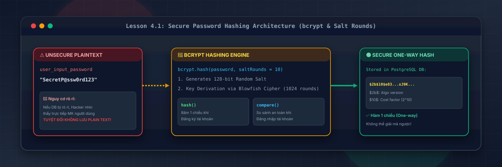
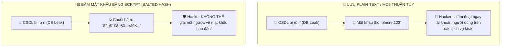
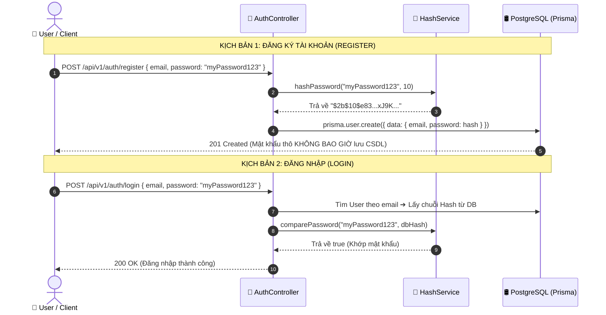

# Lesson 4.1: Password Hashing — Mã Hóa Mật Khẩu An Toàn Với bcrypt Trong NestJS

<p align="center">
  
  
  
  
  
</p>

<p align="center">
  
</p>

---

> [!NOTE]
> ⏱️ **Thời lượng dự kiến:** 10 – 12 phút  
> 🎯 **Mục tiêu bài học:** Nắm vững nguyên lý an toàn thông tin tối quan trọng: **Tuyệt đối không lưu mật khẩu dạng Plaintext**; phân biệt sự khác nhau giữa Mã hóa 2 chiều (Encryption) và Băm 1 chiều có Muối (Salted One-way Hashing); tự tay cài đặt và sử dụng `bcrypt` trong NestJS; đóng gói `HashService` chuẩn tái sử dụng để băm mật khẩu khi Đăng ký và so sánh mật khẩu khi Đăng nhập; thực hành kịch bản kiểm thử bảo mật chống lại tấn công Rainbow Table & Brute-force.

---

## 1. Tại Sao Lưu Mật Khẩu Plaintext Là "Án Tử" Cho Hệ Thống?

### 💡 Ẩn Dụ Thực Tế: Chiếc Két Sắt Khai Sinh & Thảm Họa Rò Rỉ Dữ Liệu

Hãy tưởng tượng cơ sở dữ liệu của bạn lưu trữ 100.000 tài khoản người dùng:

- Nếu bạn lưu mật khẩu dưới dạng **Plaintext** (văn bản thô như `"MyPassword123"`), chỉ cần một phút lơ là lộ biến môi trường CSDL hoặc bị tấn công SQL Injection, toàn bộ thông tin đăng nhập của người dùng sẽ bị phơi bày công khai.
- Vì người dùng thường có thói quen **dùng chung một mật khẩu** cho nhiều dịch vụ (Gmail, Facebook, Ngân hàng), việc rò rỉ Plaintext ở ứng dụng của bạn sẽ gây thảm họa dây chuyền cho chính người dùng!



---

### 🔹 Khái Niệm Hashing vs Encryption (Băm 1 Chiều vs Mã Hóa 2 Chiều)

| Đặc tính             | Mã hóa 2 Chiều (Encryption - AES, RSA)             | Băm 1 Chiều (One-Way Hashing - bcrypt, Argon2)      |
| :------------------- | :------------------------------------------------- | :-------------------------------------------------- |
| **Tính khả nghịch**  | 🔄 **Có thể giải mã ngược** nếu có Secret Key      | ⛔ **KHÔNG THỂ giải mã ngược** (Hàm 1 chiều)        |
| **Mục đích sử dụng** | Truyền nhận dữ liệu bí mật (SSL/TLS, file bảo mật) | **Lưu trữ mật khẩu người dùng trong Cơ sở dữ liệu** |
| **Cơ chế kiểm tra**  | Giải mã dữ liệu và so sánh                         | Băm chuỗi đầu vào mới và so sánh 2 chuỗi Hash       |

---

### 🔹 Tại Sao `bcrypt` Được Ưu Chuộng Chuẩn OWASP?

1. **Tự động sinh Muối (Salt):** Mỗi lần băm, `bcrypt` tự tạo ra một chuỗi ngẫu nhiên 128-bit gọi là **Salt**. Dù hai người dùng có cùng mật khẩu `"123456"`, kết quả chuỗi băm trong CSDL vẫn hoàn toàn khác nhau! Điều này vô hiệu hóa kỹ thuật tấn công **Rainbow Table Attack** (bảng tra cứu mật khẩu băm sẵn).
2. **Work Factor / Salt Rounds (Độ khó băm):** `bcrypt` cho phép cấu hình tham số `cost factor` (ví dụ `10` nghĩa là $2^{10} = 1024$ vòng lặp băm). Kỹ thuật này cố tình làm chậm quá trình tính toán của máy tính (khoảng 50-100ms cho 1 lần băm), giúp chống lại tấn công dò quét mật khẩu **Brute-Force Attack** bằng card đồ họa GPU tốc độ cao.

---

## 2. Giải Mã Cấu Trúc Chuỗi Băm `bcrypt`

Khi bạn gọi `bcrypt.hash("MyPassword", 10)`, hàm sẽ trả về một chuỗi mã hóa 60 ký tự có cấu trúc như sau:

```text
 $2b$10$e83U5x4...Y6aK...
 └───┘└──┘└────────────┘└──────────────────────────────┘
   │   │        │                      │
   │   │        │                      └── Hash Value (31 ký tự)
   │   │        └───────────────────────── Salt Ngẫu Nhiên (22 ký tự)
   │   └────────────────────────────────── Cost Factor / Salt Rounds (2^10 vòng)
   └────────────────────────────────────── Thuật toán bcrypt (v2b)
```



---

## 3. Hướng Dẫn Thực Hành Step-by-Step — Cài Đặt & Viết HashService

### 📌 Bước 0: Cài Đặt Thư Viện `bcrypt` & Type Definitions

Mở Terminal tại thư mục gốc dự án và cài đặt gói `bcrypt` cùng type cho TypeScript:

```bash
pnpm add bcrypt
pnpm add -D @types/bcrypt
```

---

### 📌 Bước 1: Xây Dựng `HashService` Reusable Component

Tạo tệp `src/shared/services/hash.service.ts` đóng gói các phương thức băm và so sánh mật khẩu:

📄 **`src/shared/services/hash.service.ts`**

```typescript
import { Injectable } from '@nestjs/common';
import * as bcrypt from 'bcrypt';

@Injectable()
export class HashService {
  // Số vòng lặp băm mặc định (Cost Factor). Giá trị 10 là chuẩn cân bằng giữa Bảo mật & Hiệu năng
  private readonly SALT_ROUNDS = 10;

  /**
   * Băm mật khẩu thô thành chuỗi bcrypt hash an toàn
   * @param plainTextMật khẩu thô do người dùng nhập vào
   * @returns Chuỗi băm bcrypt 60 ký tự
   */
  async hashPassword(plainText: string): Promise<string> {
    return bcrypt.hash(plainText, this.SALT_ROUNDS);
  }

  /**
   * So sánh mật khẩu thô với chuỗi bcrypt hash lưu trong CSDL
   * @param plainText Mật khẩu thô cần kiểm tra khi Đăng nhập
   * @param hash Chuỗi băm lưu sẵn trong Cơ sở dữ liệu
   * @returns true nếu trùng khớp, false nếu sai mật khẩu
   */
  async comparePassword(plainText: string, hash: string): Promise<boolean> {
    return bcrypt.compare(plainText, hash);
  }
}
```

---

### 📌 Bước 2: Đóng Gói `HashModule` Để Dùng Chung Trong Toàn Ứng Dụng

Tạo tệp `src/shared/services/hash.module.ts` và export `HashService`:

📄 **`src/shared/services/hash.module.ts`**

```typescript
import { Global, Module } from '@nestjs/common';
import { HashService } from './hash.service';

@Global()
@Module({
  providers: [HashService],
  exports: [HashService],
})
export class HashModule {}
```

---

### 📌 Bước 3: Tích Hợp `HashService` Vào Quy Trình Đăng Ký Người Dùng (`UsersService`)

Mở tệp `src/users/users.service.ts` và băm mật khẩu trước khi lưu vào PostgreSQL qua Prisma:

📄 **`src/users/users.service.ts`**

```typescript
import { ConflictException, Injectable } from '@nestjs/common';
import { HashService } from '../common/services/hash.service';
import { PrismaService } from '../prisma/prisma.service';
import { CreateUserDto } from './dto/create-user.dto';

@Injectable()
export class UsersService {
  constructor(
    private readonly prisma: PrismaService,
    private readonly hashService: HashService,
  ) {}

  async createUser(dto: CreateUserDto) {
    // 1. Kiểm tra Email đã tồn tại chưa
    const existingUser = await this.prisma.user.findUnique({
      where: { email: dto.email },
    });
    if (existingUser) {
      throw new ConflictException('Email này đã được sử dụng!');
    }

    // 2. Băm mật khẩu thô bằng HashService
    const hashedPassword = await this.hashService.hashPassword(dto.password);

    // 3. Lưu vào Cơ sở dữ liệu với mật khẩu đã băm
    const user = await this.prisma.user.create({
      data: {
        username: dto.username,
        email: dto.email,
        password: hashedPassword, // 🔒 Lưu chuỗi băm an toàn
      },
    });

    // 4. Loại bỏ trường password trước khi trả về kết quả cho Client
    const { password, ...userWithoutPassword } = user;
    return userWithoutPassword;
  }
}
```

> [!CAUTION]
> **Quy tắc bảo mật thông tin:** Sau khi tạo User thành công, luôn sử dụng kỹ thuật Destructuring để loại bỏ thuộc tính `password` trước khi trả về Response JSON cho Client!

---

## 4. Kịch Bản Kiểm Tra & Thử Nghiệm (Hands-on Lab)

### 🟢 Kịch Bản 1: Thành Công — Đăng Ký Tài Khoản & Kiểm Tra Dữ Liệu Băm

Thực hiện gửi yêu cầu cURL Đăng ký người dùng mới:

```bash
curl -X POST http://localhost:3000/api/v1/users \
  -H "Content-Type: application/json" \
  -d '{
    "username": "security_master",
    "email": "security@example.com",
    "password": "MySuperSecretPassword123!",
    "age": 25
  }'
```

📥 **Phản hồi HTTP nhận được từ Server (`201 Created` - Đã ẩn password):**

```json
{
  "statusCode": 201,
  "message": "Thao tác thực hiện thành công!",
  "data": {
    "id": "clx123abc456",
    "username": "security_master",
    "email": "security@example.com",
    "createdAt": "2026-08-13T15:30:00.000Z"
  },
  "timestamp": "2026-08-13T15:30:00.123Z",
  "path": "/api/v1/users"
}
```

🖥️ **Kiểm tra dữ liệu trực tiếp trong CSDL (Prisma Studio `npx prisma studio`):**

- Mở bảng `User`, trường `password` hiển thị chuỗi:  
  `$2b$10$e83U5x4H9kL0mN1oP2qR3u4v5w6x7y8z9A0B1C2D3E4F5G6H7I8J9`
  ✅ **Kết quả:** Mật khẩu thô đã biến mất hoàn toàn và được lưu trữ dưới dạng chuỗi băm bcrypt cực kỳ an toàn!

---

### 🔴 Kịch Bản 2: Kiểm Thử Bảo Mật — Khả Năng So Sánh Mật Khẩu Với `comparePassword()`

Thử nghiệm phương thức `comparePassword` trong unit test hoặc Controller:

```typescript
// Test 1: Truyền đúng mật khẩu ban đầu
const isMatchCorrect = await hashService.comparePassword(
  'MySuperSecretPassword123!',
  hashedPasswordInDb,
);
console.log('Mật khẩu đúng:', isMatchCorrect); // 🟢 Output: true

// Test 2: Truyền sai 1 ký tự
const isMatchWrong = await hashService.comparePassword(
  'MySuperSecretPassword123', // Thiếu dấu '!'
  hashedPasswordInDb,
);
console.log('Mật khẩu sai:', isMatchWrong); // 🔴 Output: false
```

✅ **Kết quả:** `bcrypt.compare()` tự động trích xuất Salt từ chuỗi băm DB và tính toán chính xác tính hợp lệ của mật khẩu!

---

## 5. Tổng Kết Bài Học & Checklist Ghi Nhớ

```mermaid
mindmap
  root(("Password Hashing với bcrypt"))
    "Nguyên lý An toàn"
      "KHÔNG BAO GIỜ lưu Plaintext"
      "Hàm 1 chiều (One-Way Hashing)"
      "Không thể giải mã ngược"
    "Cơ chế bcrypt"
      "Tự động tạo Salt 128-bit"
      "Chống Rainbow Table Attack"
      "Cost Factor / Salt Rounds (10)"
      "Chống GPU Brute-Force"
    "Triển khai HashService"
      "hashPassword(plainText)"
      "comparePassword(plainText, hash)"
      "@Global() HashModule"
    "Quy tắc Bảo mật"
      "Băm mật khẩu trước khi lưu DB"
      "Loại bỏ password khỏi Response JSON"
```

### ✅ Checklist Ghi Nhớ Bài Học:

- [x] Hiểu lý do tại sao tuyệt đối không được lưu mật khẩu thô (Plaintext) vào Cơ sở dữ liệu.
- [x] Phân biệt sự khác nhau giữa Mã hóa 2 chiều (Encryption) và Băm 1 chiều (Hashing).
- [x] Nắm vững cơ chế Salt và Cost Factor (Salt Rounds = 10) trong `bcrypt`.
- [x] Cài đặt gói `bcrypt` và `@types/bcrypt` thành công.
- [x] Đóng gói `HashService` trong `HashModule` toàn cục để tái sử dụng sạch sẽ.
- [x] Tích hợp băm mật khẩu khi tạo User và loại bỏ thuộc tính `password` trước khi trả về Client.

---

👉 **Bài tiếp theo:** [Lesson 4.2: JWT Auth — Đăng Ký, Đăng Nhập & Phát Hành Access Token](../lesson-4.2/lesson-4.2.md)
