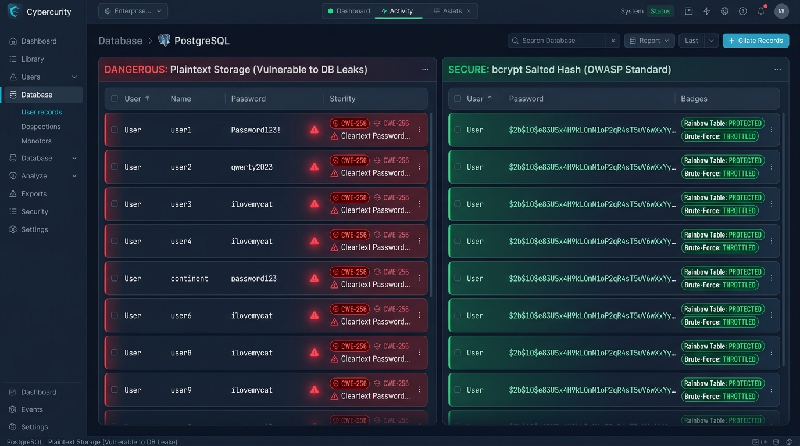
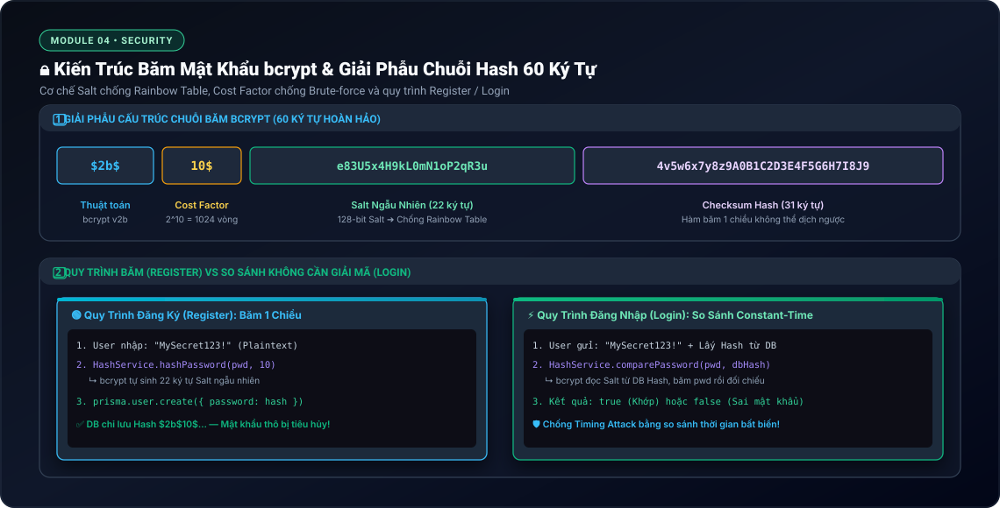

# Lesson 4.1: Password Hashing — Mã Hóa Mật Khẩu An Toàn Với bcrypt Trong NestJS

<p align="center">
  
  
  
  
  
</p>

<p align="center">
  
</p>

---

> [!NOTE]
> ⏱️ **Thời lượng:** 10 – 12 phút thực chiến  
> 🎯 **Mục tiêu:** Nắm vững nguyên lý bảo mật bắt buộc: **Tuyệt đối không lưu mật khẩu Plaintext**; phân biệt Mã hóa 2 chiều (Encryption) vs Băm 1 chiều (Salted Hashing); giải phẫu chuỗi băm 60 ký tự của `bcrypt`; đóng gói `HashService` trong `SharedServicesModule` toàn cục để tái sử dụng; tích hợp băm mật khẩu khi Đăng ký và so sánh mật khẩu khi Đăng nhập; kiểm thử bảo mật chống Rainbow Table & Brute-force.

---

## 1. Bản Chất Bảo Mật: Tại Sao Không Được Lưu Mật Khẩu Plaintext?

Trong an toàn thông tin, lưu mật khẩu dạng thô (Plaintext) là lỗi nghiêm trọng thuộc nhóm **CWE-256 (Unprotected Storage of Credentials)** và **OWASP Top 10 (Cryptographic Failures)**:

- Khi cơ sở dữ liệu bị rò rỉ (qua SQL Injection hoặc lộ biến môi trường), mật khẩu thô sẽ bị phơi bày công khai.
- Kẻ tấn công sẽ sử dụng mật khẩu này để thực hiện tấn công **Credential Stuffing** (chiếm đoạt tài khoản người dùng trên các dịch vụ khác như Email, Ngân hàng, Mạng xã hội).

---

### 📱 So Sánh Trực Quan: Plaintext Nguy Hiểm vs bcrypt Salted Hash

<p align="center">
  
</p>

| Tiêu chí             | 🔴 Mã hóa 2 chiều (Encryption - AES, RSA)         | 🟢 Băm 1 chiều (Salted Hash - bcrypt, Argon2)          |
| :------------------- | :------------------------------------------------ | :----------------------------------------------------- |
| **Tính khả nghịch**  | 🔄 **Có thể giải mã ngược** nếu có Secret Key     | ⛔ **KHÔNG THỂ giải mã ngược** (One-way Function)      |
| **Mục đích sử dụng** | Truyền nhận dữ liệu bí mật (SSL/TLS, mã hóa file) | **Lưu trữ an toàn mật khẩu người dùng trong Database** |
| **Cơ chế xác thực**  | Giải mã dữ liệu và so sánh                        | Băm chuỗi đầu vào mới và so sánh 2 chuỗi Hash          |
| **Bảo vệ CSDL**      | Nếu lộ Secret Key ➔ Toàn bộ dữ liệu bị giải mã    | CSDL bị lộ ➔ Kẻ tấn công không thể phục hồi mật khẩu   |

---

### 🛡️ 2 Cơ Chế Bảo Vệ Đột Phá Của `bcrypt`

1. **Tự động sinh Muối (128-bit Salt):**  
   Mỗi lần băm, `bcrypt` tự tạo một chuỗi Salt ngẫu nhiên. Hai người dùng có cùng mật khẩu `"Secret123!"` sẽ có 2 chuỗi băm hoàn toàn khác nhau trong CSDL. Điều này triệt tiêu hoàn toàn kỹ thuật tấn công **Rainbow Table Attack** (bảng tra cứu băm sẵn).
2. **Cost Factor / Salt Rounds (Chống Brute-force):**  
   `bcrypt` cho phép thiết lập số vòng lặp tính toán (chuẩn khuyến nghị: `10`, tương đương $2^{10} = 1024$ vòng lặp, tiêu tốn ~70ms CPU). Độ trễ có chủ đích này vô hiệu hóa các máy đào GPU chuyên bẻ khóa mật khẩu tốc độ cao.

---

## 2. Kiến Trúc bcrypt & Giải Phẫu Chuỗi Hash 60 Ký Tự

<p align="center">
  
</p>

> [!TIP]
> **Điểm kỳ diệu khi Đăng nhập:** Hàm `bcrypt.compare(password, dbHash)` tự động đọc 22 ký tự Salt và Cost Factor từ chính chuỗi `dbHash`, băm mật khẩu người dùng vừa nhập với đúng thông số đó, rồi so sánh bằng kỹ thuật **Constant-Time** để ngăn chặn tấn công kênh phụ (Timing Attack).

---

## 3. Hướng Dẫn Thực Hành Step-by-Step

### 📂 Cấu Trúc File Triển Khai

```
src/
├── shared/
│   └── services/
│       ├── hash.service.ts              👈 Đóng gói bcrypt.hash() & bcrypt.compare()
│       └── shared-services.module.ts    👈 @Global() module quản lý các service dùng chung
└── users/
    ├── dto/
    │   └── create-user.dto.ts           👈 Bổ sung field password validation
    └── users.service.ts                 👈 Băm password & loại bỏ khỏi response JSON
```

---

### 📌 Bước 0: Cài Đặt Thư Viện `bcrypt`

```bash
pnpm add bcrypt
pnpm add -D @types/bcrypt
```

---

### 📌 Bước 1: Xây Dựng `HashService`

Tạo file `src/shared/services/hash.service.ts`:

📄 **`src/shared/services/hash.service.ts`**

```typescript
import { Injectable } from '@nestjs/common';
import * as bcrypt from 'bcrypt';

@Injectable()
export class HashService {
  // Salt Rounds = 10 là chuẩn cân bằng tối ưu giữa Bảo mật và Hiệu năng CPU
  private readonly SALT_ROUNDS = 10;

  /**
   * Băm mật khẩu thô thành chuỗi bcrypt hash 60 ký tự an toàn
   */
  async hashPassword(plainText: string): Promise<string> {
    return bcrypt.hash(plainText, this.SALT_ROUNDS);
  }

  /**
   * So sánh mật khẩu thô với chuỗi hash trong CSDL (so sánh Constant-Time)
   */
  async comparePassword(plainText: string, hash: string): Promise<boolean> {
    return bcrypt.compare(plainText, hash);
  }
}
```

---

### 📌 Bước 2: Đóng Gói `SharedServicesModule` Toàn Cục

Thay vì tạo riêng từng module nhỏ cho mỗi utility service, ta tạo `SharedServicesModule` để gom nhóm và tái sử dụng các dịch vụ dùng chung trong toàn bộ ứng dụng (như `HashService`, `MailService`,...):

Tạo file `src/shared/services/shared-services.module.ts` gắn decorator `@Global()`:

📄 **`src/shared/services/shared-services.module.ts`**

```typescript
import { Global, Module } from '@nestjs/common';
import { HashService } from './hash.service';

@Global()
@Module({
  providers: [HashService],
  exports: [HashService],
})
export class SharedServicesModule {}
```

Sau đó đăng ký `SharedServicesModule` vào `AppModule`:

📄 **`src/app.module.ts`**

```typescript
import { Module } from '@nestjs/common';
import { SharedServicesModule } from './shared/services/shared-services.module';
import { UsersModule } from './users/users.module';

@Module({
  imports: [SharedServicesModule, UsersModule],
})
export class AppModule {}
```

> [!IMPORTANT]
> Nhờ decorator `@Global()`, sau khi đăng ký `SharedServicesModule` tại `AppModule`, mọi feature module khác (`UsersModule`, `AuthModule`) đều có thể trực tiếp inject `HashService` vào constructor mà không cần import lại `SharedServicesModule`.

---

### 📌 Bước 3: Cập Nhật DTO & Băm Mật Khẩu Trong `UsersService`

#### 1. Bổ sung trường `password` vào `CreateUserDto`:

📄 **`src/users/dto/create-user.dto.ts`**

```typescript
import { IsEmail, IsNotEmpty, IsString, MinLength } from 'class-validator';

export class CreateUserDto {
  @IsString({ message: 'Tên người dùng phải là chuỗi ký tự!' })
  @IsNotEmpty({ message: 'Tên người dùng không được để trống!' })
  username: string;

  @IsEmail({}, { message: 'Email không đúng định dạng!' })
  email: string;

  @IsString({ message: 'Mật khẩu phải là chuỗi ký tự!' })
  @MinLength(6, { message: 'Mật khẩu phải có tối thiểu 6 ký tự!' })
  password: string;
}
```

#### 2. Tích hợp băm mật khẩu vào `UsersService`:

📄 **`src/users/users.service.ts`**

```typescript
import { ConflictException, Injectable } from '@nestjs/common';
import { HashService } from '../shared/services/hash.service';
import { PrismaService } from '../prisma/prisma.service';
import { CreateUserDto } from './dto/create-user.dto';

@Injectable()
export class UsersService {
  constructor(
    private readonly prisma: PrismaService,
    private readonly hashService: HashService,
  ) {}

  async create(dto: CreateUserDto) {
    // 1. Kiểm tra trùng lặp email
    const existingUser = await this.prisma.user.findUnique({
      where: { email: dto.email },
    });
    if (existingUser) {
      throw new ConflictException('Email này đã được sử dụng!');
    }

    // 2. Băm mật khẩu thô trước khi lưu
    const hashedPassword = await this.hashService.hashPassword(dto.password);

    // 3. Lưu vào Database với mật khẩu đã băm
    const user = await this.prisma.user.create({
      data: {
        name: dto.username,
        email: dto.email,
        password: hashedPassword,
      },
    });

    // 4. BẢO MẬT: Tuyệt đối không trả password về cho Client
    const { password, ...userWithoutPassword } = user;
    return userWithoutPassword;
  }
}
```

---

## 4. Kịch Bản Kiểm Tra & Thử Nghiệm (Hands-on Lab)

Khởi động ứng dụng:

```bash
pnpm start:dev
```

Mở Terminal và thực hiện 3 kịch bản kiểm thử:

---

### 🟢 Kịch Bản 1: Đăng Ký Tài Khoản & Kiểm Tra Chuỗi Băm

Gửi request tạo người dùng mới:

```bash
curl -i -X POST http://localhost:3000/api/v1/users \
  -H "Content-Type: application/json" \
  -d '{
    "username": "security_dev",
    "email": "dev@example.com",
    "password": "MySecretPassword123!"
  }'
```

📥 **Phản hồi từ Server (`201 Created` — Trường password đã được lọc sạch):**

```json
{
  "statusCode": 201,
  "message": "Thao tác thực hiện thành công!",
  "data": {
    "id": 1,
    "name": "security_dev",
    "email": "dev@example.com",
    "createdAt": "2026-09-19T15:30:00.000Z"
  },
  "timestamp": "2026-09-19T15:30:00.123Z",
  "path": "/api/v1/users"
}
```

🖥️ **Kiểm tra dữ liệu trong CSDL qua Prisma Studio (`pnpm prisma studio`):**

- Bảng `users`, trường `password` hiển thị chuỗi:  
  `$2b$10$e83U5x4H9kL0mN1oP2qR3u4v5w6x7y8z9A0B1C2D3E4F5G6H7I8J9`
- ✅ **Kết quả:** Mật khẩu thô biến mất hoàn toàn, CSDL chỉ lưu chuỗi băm 60 ký tự an toàn.

---

### 🟢 Kịch Bản 2: Kiểm Thử Phương Thức So Sánh `comparePassword()`

Thực nghiệm hàm so sánh của `HashService`:

```typescript
// Kịch bản A: Nhập đúng mật khẩu
const isCorrect = await hashService.comparePassword(
  'MySecretPassword123!',
  hashedPasswordInDb,
);
console.log('Khớp mật khẩu:', isCorrect); // 🟢 Output: true

// Kịch bản B: Sai 1 ký tự duy nhất
const isWrong = await hashService.comparePassword(
  'MySecretPassword123',
  hashedPasswordInDb,
);
console.log('Khớp mật khẩu:', isWrong); // 🔴 Output: false
```

✅ **Kết quả:** `bcrypt.compare()` tự động trích xuất Salt, tính toán chính xác mà không cần giải mã CSDL.

---

### 🔴 Kịch Bản 3: Chặn Đứng Đăng Ký Trùng Email (`409 Conflict`)

Gửi lại request đăng ký với cùng email `dev@example.com`:

```bash
curl -i -X POST http://localhost:3000/api/v1/users \
  -H "Content-Type: application/json" \
  -d '{
    "username": "hacker",
    "email": "dev@example.com",
    "password": "AnotherPassword456!"
  }'
```

📥 **Phản hồi lỗi (`409 Conflict` — Được bọc bởi `HttpExceptionFilter`):**

```json
{
  "statusCode": 409,
  "message": "Email này đã được sử dụng!",
  "error": "Conflict",
  "timestamp": "2026-09-19T15:35:00.456Z",
  "path": "/api/v1/users"
}
```

---

## 5. Tổng Kết Bài Học & Checklist Ghi Nhớ

```mermaid
mindmap
  root(("Password Hashing với bcrypt"))
    "Bản Chất Bảo Mật"
      "CWE-256: Tuyệt đối không lưu Plaintext"
      "Hàm 1 chiều (One-Way Hashing) không thể dịch ngược"
      "Phân biệt Hashing vs Encryption 2 chiều"
    "Cơ Chế bcrypt"
      "128-bit Salt ngẫu nhiên chống Rainbow Table"
      "Cost Factor (Salt Rounds = 10) chống GPU Brute-force"
      "Chuỗi băm chuẩn mực 60 ký tự"
    "Kiến Trúc Module"
      "HashService tái sử dụng"
      "@Global() SharedServicesModule"
      "So sánh Constant-Time chống Timing Attack"
    "Quy Tắc Vận Hành"
      "Băm mật khẩu trước khi lưu DB"
      "Lọc bỏ thuộc tính password khỏi JSON trả về"
```

### ✅ Checklist Ghi Nhớ:

- [x] Hiểu lý do tại sao tuyệt đối không được lưu mật khẩu Plaintext (nguy cơ CWE-256 & Credential Stuffing).
- [x] Phân biệt rõ sự khác biệt giữa Encryption (Mã hóa 2 chiều) và Salted Hashing (Băm 1 chiều).
- [x] Nắm vững cấu trúc 4 phần của chuỗi băm bcrypt 60 ký tự.
- [x] Cài đặt thành công thư viện `bcrypt` và `@types/bcrypt`.
- [x] Đóng gói `HashService` trong `SharedServicesModule` toàn cục và đăng ký tại `AppModule`.
- [x] Tích hợp băm mật khẩu trong `UsersService` và lọc sạch trường `password` trước khi trả về Client.
- [x] Thực hành kiểm thử thành công 3 kịch bản: Băm mật khẩu, so sánh hợp lệ, và bắt lỗi trùng email.

---

👉 **Bài tiếp theo:** [Lesson 4.2: JWT Auth — Đăng Ký, Đăng Nhập & Phát Hành Access Token](../lesson-4.2/lesson-4.2.md)
