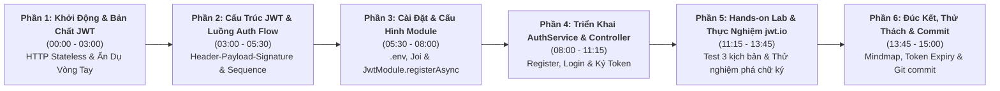

# Kịch Bản Giảng Dạy (Instructor Script)

## Lesson 4.2: JWT Auth — Đăng Ký, Đăng Nhập & Cấp Phát Access Token Trong NestJS

<p align="center">
  
  
  
  
  
</p>

<p align="center">
  
</p>

---

## 🎯 Thông Tin Tổng Quan Bài Học

- **Bài học:** Lesson 4.2: JWT Auth — Đăng Ký, Đăng Nhập & Cấp Phát Access Token Trong NestJS
- **Khóa học:** NestJS Thực Chiến: Xây Dựng API Từ Cơ Bản Đến Nâng Cao
- **Thời lượng dự kiến:** 13 – 15 phút thực chiến
- **Mục tiêu cốt lõi:**
  1. Thấu hiểu bản chất **HTTP Stateless** và lý do vì sao hệ thống RESTful API hiện đại cần **JSON Web Token (JWT)** để định danh người dùng an toàn.
  2. Nắm vững ẩn dụ đời thực trực quan: **Chiếc vòng tay công viên nước có tem chống giả** và 3 siêu năng lực của JWT: _Stateless_, _Tamper-proof_, và _Cross-platform_.
  3. Giải phẫu cấu trúc 3 phần chuẩn mực của JWT: **Header (Thuật toán) – Payload (Claims Base64URL) – Signature (Chữ ký số HMAC-SHA256)**.
  4. Phân biệt rõ ràng kiến trúc **Stateless JWT** với **Stateful Session truyền thống** và lý do kiến trúc Token giải phóng hoàn toàn bộ nhớ máy chủ.
  5. Cấu hình chuyên nghiệp `@nestjs/jwt` theo cơ chế bất đồng bộ `JwtModule.registerAsync()` nạp `JWT_SECRET` từ `ConfigService`.
  6. Xây dựng hoàn chỉnh luồng nghiệp vụ Đăng ký (`register`) và Đăng nhập (`login`), tái sử dụng `HashService` từ Global Module và thực nghiệm kiểm tra tính toàn vẹn chữ ký trên **jwt.io**.
- **Chuẩn bị trước khi quay (Instructor Pre-recording Checklist):**
  - [x] Đang ở branch `lesson/4.2` (`git checkout -b lesson/4.2`).
  - [x] Đã hoàn thành code của Lesson 4.1 (`HashService` đã sẵn sàng trong `SharedServiceModule`).
  - [x] Mở sẵn trình duyệt: Tab 1 mở trang web [jwt.io](https://jwt.io), Tab 2 mở Postman / Bruno hoặc mở sẵn Terminal để chạy cURL.
  - [x] Mở sẵn các tài nguyên hình ảnh trong `assets/`: `jwt_concept_metaphor.jpg`, `jwt_auth_ui_mockup.jpg`, `session_vs_jwt_architecture.jpg`.
  - [x] Terminal 1: Chạy sẵn `pnpm start:dev`, kiểm tra kết nối PostgreSQL và Prisma.
  - [x] Terminal 2: Dùng để test cURL và thao tác lệnh git.

---

## ⏱️ Sơ Đồ Phân Bổ Thời Gian (Timeline Roadmap)



---

## 🎬 Chi Tiết Kịch Bản Giảng Dạy Từng Phân Cảnh (Scene-by-Scene)

---

### PHẦN 1: KHỞI ĐỘNG & BẢN CHẤT: TẠI SAO CẦN DÙNG JWT? (00:00 – 03:00)

#### ⏱️ Phút 00:00 - 01:20 | Lời Chào & Đặt Vấn Đề: "Server Nhận Diện Bạn Bằng Cách Nào?"

- 🎬 **Hành động & Màn hình hiển thị (Screen/Visuals):**
  - Giảng viên xuất hiện trên webcam góc phải, phong thái tự tin, truyền cảm hứng.
  - Chiếu Slide Title bài học và Overview Banner `lesson_overview_banner.svg`.
  - Chuyển sang màn hình slide đặt câu hỏi lớn: _"Sau khi đăng nhập thành công, Server nhận diện bạn bằng cách nào?"_.

- 🎙️ **Lời thoại Giảng viên (Instructor Dialogue):**

  > "Chào mừng tất cả các bạn quay trở lại với khóa học **NestJS Thực Chiến**!
  >
  > Ở bài học 4.1, chúng ta đã xây dựng thành công `HashService` với thuật toán bcrypt, giải quyết triệt để bài toán lưu trữ mật khẩu an toàn vào cơ sở dữ liệu.
  >
  > Hôm nay, chúng ta chính thức bước sang bài học mang tính bản lề của mọi hệ thống Backend hiện đại: **Lesson 4.2: JWT Auth — Đăng Ký, Đăng Nhập & Cấp Phát Access Token Trong NestJS**.
  >
  > Hãy cùng mình bắt đầu bằng một câu hỏi cực kỳ thú vị:  
  > _Sau khi người dùng bấm nút Đăng nhập và nhập đúng mật khẩu, làm thế nào để ở các request tiếp theo — ví dụ như sửa trang cá nhân, đăng bài viết hay thanh toán giỏ hàng — Server nhận biết được người đang gọi API chính là bạn?_
  >
  > Các bạn đều biết giao thức HTTP vốn dĩ là **Stateless — tức là hoàn toàn mất trí nhớ giữa các request**! Mỗi lần Client gửi request lên, máy chủ xem đó là một yêu cầu độc lập và không tự nhớ bạn là ai.
  >
  > Nếu không có giải pháp an toàn, chúng ta sẽ rơi vào 2 cái bẫy chết người:
  >
  > - Thứ nhất: Bắt Client gửi `email & password` trong mọi request? Đây là thảm họa! Mật khẩu rất dễ bị lộ trên mạng, và thuật toán bcrypt ngốn CPU sẽ đánh sập máy chủ ngay khi có vài chục người truy cập cùng lúc.
  > - Thứ hai: Chỉ gửi kèm `userId: 1`? Cực kỳ nguy hiểm! Kẻ gian chỉ việc đổi số 1 thành số 2 là chiếm sạch dữ liệu người khác!
  >
  > Vậy giải pháp chuẩn công nghiệp là gì? Đó chính là **JWT — JSON Web Token**!"

---

#### ⏱️ Phút 01:20 - 03:00 | JWT Là Gì? Ẩn Dụ Chiếc Vòng Tay & 3 Siêu Năng Lực Của JWT

- 🎬 **Hành động & Màn hình hiển thị (Screen/Visuals):**
  - Chiếu hình ảnh đồ họa 3D trực quan [jwt_concept_metaphor.jpg](./assets/jwt_concept_metaphor.jpg).
  - Trỏ chuột lần lượt vào hai nửa hình ảnh: _High-tech Wristband_ bên trái và _JSON Web Token_ bên phải.
  - Chiếu bảng đối chiếu 1-1 giữa Ẩn dụ vòng tay công viên nước và Thực tế kỹ thuật NestJS.

- 🎙️ **Lời thoại Giảng viên (Instructor Dialogue):**

  > "Vậy **JSON Web Token** là gì mà cả thế giới phần mềm đều sử dụng?
  >
  > Các bạn hãy nhìn lên hình ảnh minh họa trên màn hình. Để dễ hiểu nhất, hãy tưởng tượng JWT giống hệt như **'Chiếc Vòng Tay Công Viên Nước Có Tem Chống Giả'**:
  >
  > 1. **Bước 1 — Mua vé (Đăng nhập):** Bạn đến quầy vé, xuất trình CCCD và trả tiền. Ban quản lý (Server) kiểm tra hợp lệ và phát cho bạn một chiếc vòng đeo tay công nghệ cao.
  > 2. **Bước 2 — Nội dung trên vòng (Payload):** Trên mặt vòng ghi sẵn tên bạn, mã khách hàng, hạn dùng trong ngày và phân quyền: VIP hay Phổ thông.
  > 3. **Bước 3 — Tem chống giả (Signature):** Trên vòng có một con dấu bảo an dập nổi độc quyền bằng chiếc khuôn dập bí mật mà chỉ Ban quản lý sở hữu (`JWT_SECRET`).
  > 4. **Bước 4 — Đi chơi (Gọi API):** Bạn đến hồ tạo sóng, tàu lượn hay cầu trượt nước, nhân viên soát vé ở từng cổng chỉ việc nhìn con dấu bảo an còn nguyên vẹn hay không để mở cổng. Nhân viên **hoàn toàn không cần chạy về phòng vé lục lại sổ sách hay gọi điện cho giám đốc**!
  >
  > Chính cơ chế này mang lại cho JWT **3 Siêu năng lực sống còn**:
  >
  > - **Thứ nhất — Hoàn toàn Stateless (Zero Server Memory):** Server không tốn 1 byte RAM nào để lưu phiên làm việc. Toàn bộ thông tin user đã được đóng gói ngay trong Token do Client tự cất giữ.
  > - **Thứ hai — Chống giả mạo tuyệt đối (Tamper-proof):** Nhờ Chữ ký số (Signature), nếu hacker cố tình sửa `role: USER` thành `role: ADMIN`, chữ ký sẽ bị lệch ngay tức thì, Server từ chối mà không cần truy vấn Database!
  > - **Thứ ba — Đa nền tảng (Cross-platform):** Token được truyền qua HTTP Header chuẩn `Authorization: Bearer <token>`, dùng chung hoàn hảo cho cả Web, Mobile App Flutter, React Native hay Microservices!"

- 💡 **Mẹo sư phạm (Pedagogical Tip):**
  > Nhấn mạnh cụm từ _"Server không cần chạy về phòng vé lục sổ sách"_ = _"Server không cần query Database/Redis để verify danh tính"_. Phép so sánh này giúp học viên nhớ suốt đời về bản chất Stateless của JWT.

---

### PHẦN 2: CẤU TRÚC JWT & LUỒNG XÁC THỰC AUTH FLOW (03:00 – 05:30)

#### ⏱️ Phút 03:00 - 04:15 | Giải Phẫu 3 Phần: Header • Payload • Signature

- 🎬 **Hành động & Màn hình hiển thị (Screen/Visuals):**
  - Chiếu hình ảnh UI Mockup [jwt_auth_ui_mockup.jpg](./assets/jwt_auth_ui_mockup.jpg).
  - Highlight 3 khối màu: Đỏ (Header), Tím (Payload), Cyan/Xanh (Signature).
  - Mở tab trình duyệt `jwt.io` giới thiệu nhanh cấu diện Debugger trực tuyến.

- 🎙️ **Lời thoại Giảng viên (Instructor Dialogue):**

  > "Bây giờ, chúng ta cùng giải phẫu một chuỗi JWT thực tế.
  >
  > Khi nhìn vào chuỗi Token, bạn sẽ thấy nó là một chuỗi ký tự dài gồm 3 phần, ngăn cách nhau bởi **hai dấu chấm** (`.`):
  >
  > 🔴 **Phần 1 (Màu Đỏ) — Header:** Khai báo kiểu token là `JWT` và thuật toán ký, phổ biến nhất là `HS256` (HMAC với SHA-256).
  >
  > 🟣 **Phần 2 (Màu Tím) — Payload (Claims):** Chứa dữ liệu của người dùng. Ở đây chúng ta thường đưa vào:
  >
  > - `sub` (Subject): ID người dùng trong Database.
  > - `email`: Email tài khoản.
  > - `role`: Quyền hạn (`USER`, `ADMIN`).
  > - `exp`: Thời điểm hết hạn tính bằng giây timestamp.
  >
  > ⚠️ **Lưu ý sống còn:** Payload chỉ được mã hóa **Base64URL**, chứ **KHÔNG PHẢI MÃ HÓA BÍ MẬT**! Ai cũng có thể dán lên `jwt.io` để đọc. Vì vậy: **Tuyệt đối không lưu mật khẩu hay dữ liệu nhạy cảm vào Payload!**
  >
  > 🔵 **Phần 3 (Màu Cyan) — Signature (Chữ ký số):** Đây là trái tim bảo mật của JWT. Server lấy `Base64(Header) + "." + Base64(Payload)` và băm cùng với một chuỗi khóa bí mật `JWT_SECRET`.
  >
  > Nếu không có `JWT_SECRET`, không ai có thể tạo ra con dấu hợp lệ. Kẻ gian đổi dù chỉ 1 ký tự trong Payload thì chữ ký tính lại sẽ sai khác hoàn toàn!"

---

#### ⏱️ Phút 04:15 - 05:30 | Sơ Đồ Tuần Tự: Luồng Đăng Nhập & Cấp Phát Token (Auth Flow)

- 🎬 **Hành động & Màn hình hiển thị (Screen/Visuals):**
  - Chiếu sơ đồ tuần tự Mermaid Sequence Diagram từ mục 2 của giáo trình.
  - Đi theo từng mũi tên từ `Client` ➔ `AuthController` ➔ `AuthService` ➔ `HashService` ➔ `JwtService`.

- 🎙️ **Lời thoại Giảng viên (Instructor Dialogue):**

  > "Hãy cùng nhìn vào sơ đồ kiến trúc Auth Flow khi Client đăng nhập:
  >
  > 1. Client gửi request: `POST /api/v1/auth/login` kèm email và password.
  > 2. `AuthController` nhận request và chuyển giao cho `AuthService.login()`.
  > 3. `AuthService` tìm user theo email trong Database. Nếu tìm thấy, nó gọi `HashService.comparePassword()` — dịch vụ băm mà chúng ta đã dựng từ Lesson 4.1.
  > 4. Nếu mật khẩu sai: Trả về lỗi `401 Unauthorized` ngay lập tức.
  > 5. Nếu mật khẩu khớp: `AuthService` gọi `JwtService.signAsync()` với payload gồm `{ sub, email, role }` để tạo chuỗi `accessToken`.
  > 6. Cuối cùng, trả về mã `200 OK` kèm theo thông tin user và chuỗi `accessToken`.
  >
  > Rất rõ ràng và mạch lạc đúng không các bạn? Bây giờ, chúng ta cùng mở VS Code lên và live-code toàn bộ tính năng này!"

---

### PHẦN 3: CÀI ĐẶT THƯ VIỆN & CẤU HÌNH JWTMODULE (05:30 – 08:00)

#### ⏱️ Phút 05:30 - 06:40 | Cài Đặt Package & Thiết Lập Biến Môi Trường (.env + Joi)

- 🎬 **Hành động & Màn hình hiển thị (Screen/Visuals):**
  - Chuyển sang màn hình VS Code. Mở Terminal tích hợp.
  - Gõ lệnh cài đặt thư viện bằng `pnpm`.
  - Mở tệp `.env` và thêm `JWT_SECRET`, `JWT_EXPIRES_IN`.
  - Mở tệp `src/config/env.validation.ts` và thêm schema Joi.

- 🎙️ **Lời thoại Giảng viên (Instructor Dialogue):**

  > "Đầu tiên, chúng ta cần cài đặt các thư viện phục vụ cho JWT và Passport trong NestJS:
  >
  > ```bash
  > pnpm add @nestjs/jwt @nestjs/passport passport passport-jwt
  > pnpm add -D @types/passport-jwt
  > ```
  >
  > Sau khi cài đặt xong, bước không thể thiếu theo chuẩn Clean Architecture là khai báo biến môi trường.
  >
  > Mở file 📄 **`.env`**, chúng ta bổ sung 2 biến:
  >
  > ```env
  > JWT_SECRET="nestjs_basic_course_super_secret_jwt_key_2026"
  > JWT_EXPIRES_IN="1d"
  > ```
  >
  > Để đảm bảo server không khởi động nếu lỡ quên cấu hình `JWT_SECRET`, chúng ta cập nhật file kiểm tra môi trường 📄 **`src/config/env.validation.ts`**:
  >
  > ```typescript
  > JWT_SECRET: Joi.string().required(),
  > JWT_EXPIRES_IN: Joi.string().default('1d'),
  > ```
  >
  > Nhờ Joi validation đã học ở Module 2, ứng dụng của chúng ta luôn được bảo vệ an toàn ngay từ khi boot-up!"

---

#### ⏱️ Phút 06:40 - 08:00 | Cấu Hình `AuthModule` Bằng `JwtModule.registerAsync()`

- 🎬 **Hành động & Màn hình hiển thị (Screen/Visuals):**
  - Tạo thư mục `src/auth/` và file 📄 **`src/auth/auth.module.ts`**.
  - Nhấn mạnh việc dùng `registerAsync()` kết hợp `ConfigService` thay vì `register()` đồng bộ tĩnh.

- 🎙️ **Lời thoại Giảng viên (Instructor Dialogue):**

  > "Bây giờ, chúng ta tạo module xác thực: `src/auth/auth.module.ts`.
  >
  > Ở đây có một lưu ý kiến trúc cực kỳ quan trọng: Trong tài liệu chính thức của NestJS, họ có hướng dẫn `JwtModule.register({ secret: '...' })`.
  > Tuy nhiên, trong môi trường sản phẩm thực tế, **tuyệt đối không dùng `register()` tĩnh**, bởi vì lúc module nạp vào, biến môi trường có thể chưa kịp load xong!
  >
  > Chuẩn Enterprise là sử dụng **`JwtModule.registerAsync()`**:
  >
  > 📄 **`src/auth/auth.module.ts`**
  >
  > ```typescript
  > @Module({
  >   imports: [
  >     JwtModule.registerAsync({
  >       imports: [ConfigModule],
  >       inject: [ConfigService],
  >       useFactory: (configService: ConfigService) => ({
  >         secret: configService.get<string>('JWT_SECRET'),
  >         signOptions: {
  >           expiresIn: configService.get<string>('JWT_EXPIRES_IN', '1d'),
  >         },
  >       }),
  >     }),
  >   ],
  >   controllers: [AuthController],
  >   providers: [AuthService],
  >   exports: [AuthService, JwtModule],
  > })
  > export class AuthModule {}
  > ```
  >
  > Nhờ `useFactory`, NestJS sẽ inject `ConfigService` vào một cách an toàn và lấy ra chính xác `JWT_SECRET` và `expiresIn` từ file `.env`!"

---

### PHẦN 4: TRIỂN KHAI DTO, AUTHSERVICE & AUTHCONTROLLER (08:00 – 11:15)

#### ⏱️ Phút 08:00 - 09:15 | Tạo RegisterDto & LoginDto Với Validation

- 🎬 **Hành động & Màn hình hiển thị (Screen/Visuals):**
  - Tạo thư mục `src/auth/dto/`.
  - Tạo lần lượt 📄 **`register.dto.ts`** và 📄 **`login.dto.ts`**.
  - Thêm các decorator `@IsEmail()`, `@MinLength(6)`, `@IsNotEmpty()`.

- 🎙️ **Lời thoại Giảng viên (Instructor Dialogue):**

  > "Tiếp theo, chúng ta tạo 2 Data Transfer Object (DTO) cho luồng Đăng ký và Đăng nhập.
  >
  > File thứ nhất: `src/auth/dto/register.dto.ts`:
  >
  > ```typescript
  > export class RegisterDto {
  >   @IsEmail({}, { message: 'Email không đúng định dạng!' })
  >   @IsNotEmpty({ message: 'Email không được để trống!' })
  >   email: string;
  >
  >   @IsString({ message: 'Mật khẩu phải là chuỗi ký tự!' })
  >   @IsNotEmpty({ message: 'Mật khẩu không được để trống!' })
  >   @MinLength(6, { message: 'Mật khẩu phải có ít nhất 6 ký tự!' })
  >   password: string;
  >
  >   @IsOptional()
  >   @IsString({ message: 'Họ tên phải là chuỗi ký tự!' })
  >   name?: string;
  > }
  > ```
  >
  > Và file thứ hai: `src/auth/dto/login.dto.ts`: Tương tự như Register nhưng chỉ cần `email` và `password`.
  >
  > Toàn bộ dữ liệu gửi lên sẽ được `ValidationPipe` toàn cục kiểm tra tự động trước khi lọt vào Service!"

---

#### ⏱️ Phút 09:15 - 10:30 | Xây Dựng `AuthService`: Tái Sử Dụng HashService & Ký JWT

- 🎬 **Hành động & Màn hình hiển thị (Screen/Visuals):**
  - Tạo file 📄 **`src/auth/auth.service.ts`**.
  - Constructor inject 3 dependency: `PrismaService`, `HashService`, và `JwtService`.
  - Viết 3 method: `register()`, `login()`, và `generateAccessToken()`.

- 🎙️ **Lời thoại Giảng viên (Instructor Dialogue):**

  > "Bây giờ đến phần quan trọng nhất: **`AuthService`**!
  >
  > Nhờ ở bài 4.1 chúng ta đã bọc `HashService` trong `@Global()` `SharedServicesModule`, nên ở đây ta có thể inject trực tiếp `HashService` mà không cần import thêm module nào!
  >
  > ```typescript
  > constructor(
  >   private readonly prisma: PrismaService,
  >   private readonly hashService: HashService,
  >   private readonly jwtService: JwtService,
  > ) {}
  > ```
  >
  > Hãy xem phương thức `register()`:
  >
  > - Đầu tiên: Kiểm tra email đã tồn tại chưa qua `findUnique`. Nếu trùng, ném ngay `ConflictException`.
  > - Tiếp theo: Băm mật khẩu bằng `this.hashService.hashPassword(password)`.
  > - Tạo User mới trong Prisma và dùng option `omit: { password: true }` để bảo đảm không trả mật khẩu băm về.
  > - Cuối cùng: Ký token và trả về `{ user, accessToken }`.
  >
  > Còn phương thức `login()`:
  >
  > - Tìm user theo email. Nếu không thấy ➔ Ném lỗi `UnauthorizedException('Email hoặc mật khẩu không chính xác!')`.
  > - Gọi `this.hashService.comparePassword(password, user.password)`. Nếu sai ➔ Tiếp tục ném `UnauthorizedException`.
  > - Nếu đúng ➔ Ký token bằng hàm helper `generateAccessToken()` và trả về kết quả!
  >
  > 💡 **Lưu ý bảo mật:** Dù sai email hay sai mật khẩu, chúng ta đều trả về chung một thông điệp: _'Email hoặc mật khẩu không chính xác'_. Tuyệt đối không nói rõ là 'Email không tồn tại', vì hacker có thể dùng thông tin đó để dò quét danh sách tài khoản của bạn!"

---

#### ⏱️ Phút 10:30 - 11:15 | Triển Khai `AuthController` & Đăng Ký Root Module

- 🎬 **Hành động & Màn hình hiển thị (Screen/Visuals):**
  - Tạo file 📄 **`src/auth/auth.controller.ts`**.
  - Gắn `@Version('1')`, `@ResponseMessage()`, `@HttpCode(HttpStatus.OK)` cho route login.
  - Mở file 📄 **`src/app.module.ts`** và khai báo `AuthModule` vào mảng `imports`.

- 🎙️ **Lời thoại Giảng viên (Instructor Dialogue):**

  > "Bây giờ, chúng ta tạo file Controller: `src/auth/auth.controller.ts`.
  >
  > ```typescript
  > @Controller('auth')
  > export class AuthController {
  >   constructor(private readonly authService: AuthService) {}
  >
  >   @Version('1')
  >   @Post('register')
  >   @ResponseMessage('Đăng ký tài khoản thành công!')
  >   async register(@Body() registerDto: RegisterDto) {
  >     return this.authService.register(registerDto);
  >   }
  >
  >   @Version('1')
  >   @Post('login')
  >   @HttpCode(HttpStatus.OK)
  >   @ResponseMessage('Đăng nhập thành công!')
  >   async login(@Body() loginDto: LoginDto) {
  >     return this.authService.login(loginDto);
  >   }
  > }
  > ```
  >
  > Lưu ý: Mặc định route POST trong NestJS trả về status code `201 Created`. Với route `login`, chúng ta không tạo mới tài nguyên mà chỉ xác thực danh tính, nên ta dùng `@HttpCode(HttpStatus.OK)` để trả về chuẩn mã `200 OK`!
  >
  > Cuối cùng, mở file `src/app.module.ts` và đăng ký `AuthModule` vào mảng `imports`.
  >
  > Hệ thống đã hoàn thiện 100%! Bây giờ là lúc chúng ta chạy thử nghiệm thực chiến!"

---

### PHẦN 5: HANDS-ON LAB & THỰC NGHIỆM TRÊN JWT.IO (11:15 – 13:45)

#### ⏱️ Phút 11:15 - 12:30 | Test Kịch Bản 1 & 2: Đăng Ký, Đăng Nhập & Soi Token Trên jwt.io

- 🎬 **Hành động & Màn hình hiển thị (Screen/Visuals):**
  - Mở Terminal, chạy lệnh cURL `POST /api/v1/auth/register`.
  - Hiển thị response `201 Created` có `accessToken`.
  - Tiếp tục chạy lệnh cURL `POST /api/v1/auth/login`.
  - Copy chuỗi `accessToken` vừa nhận, chuyển sang trình duyệt mở trang web **jwt.io**.
  - Dán chuỗi token vào ô **Encoded**.

- 🎙️ **Lời thoại Giảng viên (Instructor Dialogue):**

  > "Mời các bạn nhìn lên màn hình Terminal.
  >
  > Chúng ta thực hiện đăng ký tài khoản mới qua cURL:
  >
  > ```bash
  > curl -i -X POST http://localhost:3000/api/v1/auth/register \
  >   -H "Content-Type: application/json" \
  >   -d '{"email": "dev@example.com", "password": "Password123!", "name": "Dev Hero"}'
  > ```
  >
  > Kết quả trả về mã `201 Created` cực kỳ đẹp mắt, password đã được ẩn hoàn toàn và chúng ta có chuỗi `accessToken` đầu tiên!
  >
  > Bây giờ, mình đăng nhập lại bằng lệnh `POST /api/v1/auth/login`:
  > Server phản hồi ngay `200 OK` kèm theo `accessToken`.
  >
  > Mình sẽ copy chuỗi token này và mang sang trang web huyền thoại của giới lập trình viên: **jwt.io**!
  >
  > Các bạn thấy không:
  >
  > - Bên phải màn hình, phần Header hiển thị rõ thuật toán `HS256`.
  > - Phần Payload lập tức được giải mã: `sub: 1`, `email: "dev@example.com"`, `role: "USER"`, thời hạn hết hạn `exp`.
  > - Và ở dưới cùng, có dòng chữ màu xanh lá cây tuyệt đẹp: **`Signature Verified`**!"

---

#### ⏱️ Phút 12:30 - 13:45 | Kịch Bản Nghịch Ngợm (Hack Test) & Test Đăng Nhập Sai Mật Khẩu

- 🎬 **Hành động & Màn hình hiển thị (Screen/Visuals):**
  - Giữ nguyên trang `jwt.io`. Thử chỉnh sửa trường `sub: 1` thành `sub: 2` hoặc thêm `"role": "ADMIN"`.
  - Chỉ rõ dòng chữ dưới Signature đổi thành màu đỏ: **`Invalid Signature`**.
  - Quay lại Terminal chạy cURL login với mật khẩu sai để thấy mã `401 Unauthorized`.

- 🎙️ **Lời thoại Giảng viên (Instructor Dialogue):**

  > "Bây giờ, hãy thử đóng vai làm một hacker tinh nghịch:
  >
  > _Điều gì xảy ra nếu kẻ gian tự ý sửa `"sub": 1` thành `"sub": 2` hoặc sửa `"role": "USER"` thành `"role": "ADMIN"` trong ô Payload?_
  >
  > Hãy nhìn xem: Ngay khoảnh khắc mình vừa gõ chữ `ADMIN`, phía dưới chữ ký số lập tức chuyển sang màu đỏ rực: **`Invalid Signature` — Chữ ký không hợp lệ!**
  >
  > Kẻ tấn công không hề có chìa khóa bí mật `JWT_SECRET`, nên chiếc khuôn dập bảo an ban đầu không thể tái tạo lại được. Khi token giả mạo này gửi lên Server, NestJS sẽ quăng nó vào thùng rác ngay lập tức!
  >
  > Tiếp theo, hãy thử kịch bản thứ 3: Gõ sai mật khẩu:
  >
  > ```bash
  > curl -i -X POST http://localhost:3000/api/v1/auth/login \
  >   -H "Content-Type: application/json" \
  >   -d '{"email": "dev@example.com", "password": "WrongPassword!"}'
  > ```
  >
  > Server lập tức trả về mã lỗi `401 Unauthorized` với thông báo thân thiện: _'Email hoặc mật khẩu không chính xác!'_. Hệ thống của chúng ta hoạt động chuẩn xác 100%!"

---

### PHẦN 6: TỔNG KẾT, THỬ THÁCH & GIT COMMIT (13:45 – 15:00)

#### ⏱️ Phút 13:45 - 15:00 | Đúc Kết Kiến Thức, Thử Thách Mở Rộng & Lời Chào

- 🎬 **Hành động & Màn hình hiển thị (Screen/Visuals):**
  - Chiếu Mindmap tổng kết bài học từ mục 5 của giáo trình.
  - Mở Terminal, thực hiện câu lệnh Git commit chuẩn mực.
  - Chiếu Slide hé lộ nội dung bài tiếp theo: **Lesson 4.3 — Guards & Passport JWT Strategy**.

- 🎙️ **Lời thoại Giảng viên (Instructor Dialogue):**

  > "Xin chúc mừng tất cả các bạn! Chúng ta vừa hoàn thành xuất sắc một trong những bài học trọng tâm nhất của khóa học:
  >
  > Hãy cùng điểm lại 4 trụ cột kiến thức các bạn đã chinh phục hôm nay:
  >
  > 1. **Bản chất JWT:** Giải quyết bài toán HTTP Stateless bằng cơ chế Token tự chứa dữ liệu và verify bằng chữ ký số siêu tốc.
  > 2. **Cấu trúc 3 phần:** Header (thuật toán), Payload (Base64URL), và Signature (chữ ký bảo mật với `JWT_SECRET`).
  > 3. **Cấu hình NestJS chuẩn:** `JwtModule.registerAsync()` nạp cấu hình từ `ConfigService` và tái sử dụng `HashService` toàn cục.
  > 4. **Trực quan hóa:** Thấu hiểu vì sao hacker không thể chỉnh sửa dữ liệu trong Token qua thực nghiệm trên `jwt.io`.
  >
  > Hãy mở Terminal và lưu lại bước tiến này vào Git:
  >
  > ```bash
  > git add .
  > git commit -m "feat: implement jwt authentication with register and login endpoints"
  > ```
  >
  > 🎯 **Thử thách nhỏ dành cho bạn:**  
  > Hãy thử thay đổi `JWT_EXPIRES_IN` trong `.env` thành `60s` (1 phút). Đăng nhập lấy token, đợi 61 giây rồi dán lên `jwt.io` xem điều gì xảy ra nhé! Bạn sẽ thấy cơ chế tự động hết hạn của Token hoạt động kỳ diệu như thế nào.
  >
  > Ở bài học tiếp theo — **Lesson 4.3**, chúng ta sẽ trả lời câu hỏi: _Client đã có Access Token rồi, làm sao để chặn các API riêng tư và chỉ cho phép những request có Token hợp lệ đi qua?_ Chúng ta sẽ cùng nhau chinh phục **JwtAuthGuard & Passport Strategy**.
  >
  > Cảm ơn các bạn đã chú ý lắng nghe và hẹn gặp lại các bạn trong bài học tiếp theo!"

---

## 🧠 Sơ Đồ Tư Duy Tổng Kết Bài Học (Recap Mindmap)

```mermaid
mindmap
  root(("NestJS JWT Auth (Lesson 4.2)"))
    Bản Chất & Nhu Cầu
      HTTP Stateless: Mất trí nhớ giữa các request
      Ẩn dụ: Vòng tay công viên nước có tem chống giả
      3 Siêu năng lực: Stateless - Tamper proof - Cross platform
    Cấu Trúc Chuẩn 3 Phần
      Header: Thuật toán HS256
      Payload: Claims (sub, email, role, exp) Base64URL
      Signature: Chữ ký số HMAC-SHA256 với JWT_SECRET
    Cấu Hình Kiến Trúc NestJS
      JwtModule.registerAsync nạp qua ConfigService
      Joi Validation bắt buộc JWT_SECRET
      Tái sử dụng HashService từ SharedServiceModule
    Quy Trình Nghiệp Vụ
      register: Băm mật khẩu -> Lưu CSDL -> Phát hành Token
      login: Kiểm tra email & so khớp bcrypt -> Ký Access Token
      Bảo mật: Thông báo lỗi chung, không phơi bày mật khẩu
    Thực Nghiệm Thực Tế
      jwt.io verify chữ ký số
      Sửa Payload làm hỏng Signature (Invalid Signature)
      Status code: 201 cho Register và 200 cho Login
```

---

## ✅ Checklist Kiểm Tra Chuẩn Bị Trước Khi Bấm Record (Ready to Record Checklist)

- [ ] Branch git hiện tại là `lesson/4.2` sạch sẽ.
- [ ] Các package `@nestjs/jwt`, `@nestjs/passport`, `passport`, `passport-jwt` đã sẵn sàng lệnh cài đặt.
- [ ] Database PostgreSQL chạy nền ổn định trên Docker.
- [ ] Chuẩn bị sẵn 2 tab trình duyệt: Trang chủ [jwt.io](https://jwt.io) và Swagger / Postman.
- [ ] Mở sẵn ảnh minh họa [jwt_concept_metaphor.jpg](./assets/jwt_concept_metaphor.jpg) và [jwt_auth_ui_mockup.jpg](./assets/jwt_auth_ui_mockup.jpg) trên trình xem ảnh để chuyển cảnh mượt mà.
- [ ] Kiểm tra micro và webcam, đảm bảo cỡ chữ trong VS Code tối thiểu từ 16pt trở lên.
