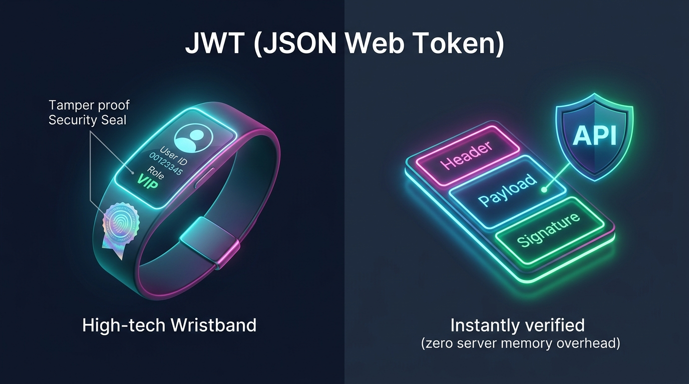
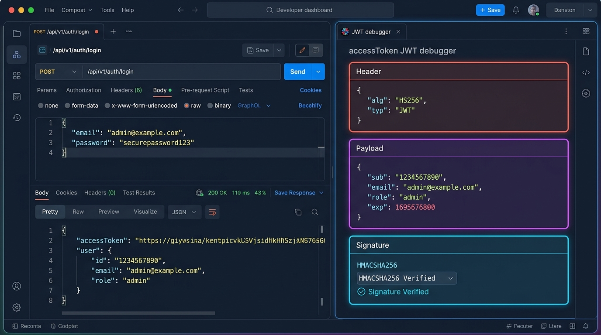
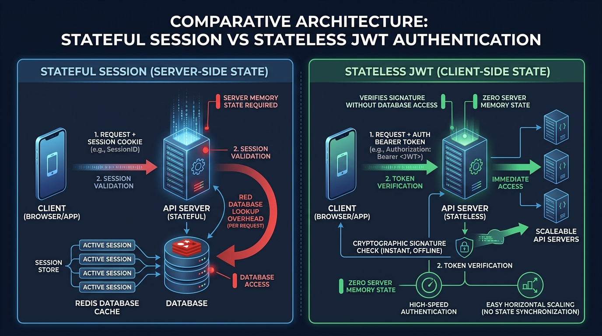
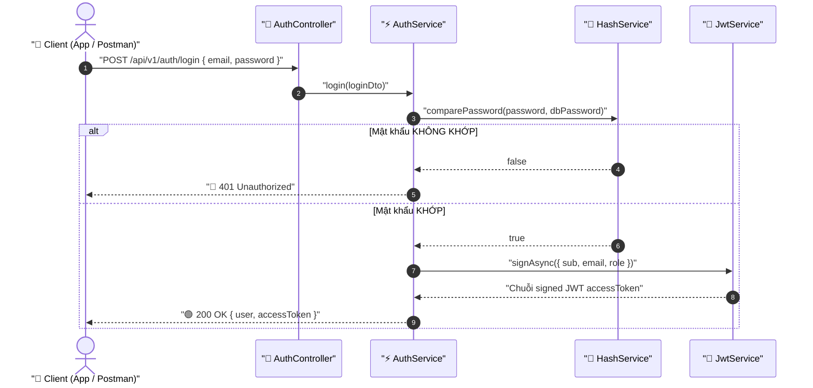

# Lesson 4.2: JWT Auth — Đăng Ký, Đăng Nhập & Cấp Phát Access Token Trong NestJS

<p align="center">
  
  
  
  
  
</p>

<p align="center">
  
</p>

---

> [!NOTE]
> ⏱️ **Thời lượng:** 12 – 15 phút thực chiến  
> 🎯 **Mục tiêu cốt lõi:**
>
> 1. Hiểu bản chất JWT là gì, vì sao RESTful API cần JWT để định danh người dùng an toàn trên giao thức HTTP Stateless.
> 2. Giải mã cấu trúc 3 phần của JWT: **Header – Payload – Signature**.
> 3. Cấu hình `@nestjs/jwt` kết hợp `ConfigService` và tái sử dụng `HashService` từ `SharedServiceModule`.
> 4. Xây dựng hoàn chỉnh luồng Đăng ký / Đăng nhập và thực nghiệm kiểm tra Token trên **jwt.io**.

---

## 1. Bản Chất Vấn Đề: JWT Là Gì & Tại Sao Lại Cần Nó?

### ❓ Vấn Đề Thực Tế: Server Nhận Diện Bạn Bằng Cách Nào?

Giao thức HTTP vốn dĩ mang đặc tính **Stateless (Không lưu trạng thái)**: Mỗi request gửi lên máy chủ đều độc lập hoàn toàn. Khi bạn vừa đăng nhập thành công xong và gửi tiếp một request khác (như xem trang cá nhân, đăng bài viết), Server hoàn toàn "mất trí nhớ", không tự động biết bạn là ai!

Nếu không có một cơ chế định danh an toàn, chúng ta sẽ rơi vào các bẫy chết người:

- ❌ **Bắt Client gửi `email & password` ở mọi request?** ➔ **Thảm họa:** Mật khẩu rất dễ bị lộ trên đường truyền, và việc chạy thuật toán `bcrypt` ngốn ~70ms CPU cho từng request sẽ đánh sập máy chủ ngay khi có đông người dùng.
- ❌ **Chỉ gửi kèm `userId: 1`?** ➔ **Lỗ hổng bảo mật chết người:** Kẻ tấn công chỉ cần đổi số `1` thành số `2` (Admin) là chiếm trọn dữ liệu và quyền hạn của người khác!

---

### 💡 JWT (JSON Web Token) Là Gì?

**JSON Web Token (JWT)** là một tiêu chuẩn mở (RFC 7519) dùng để truyền tải thông tin an toàn giữa Client và Server dưới dạng một **chuỗi ký tự nén gọn (compact string)** có chứa **Chữ ký số (Digital Signature)**.

<p align="center">
  
</p>

#### 🎟️ Ẩn Dụ Thực Tế: "Chiếc Vòng Tay Công Viên Nước Có Tem Chống Giả"

Để hiểu sâu sắc cơ chế hoạt động của JWT, hãy so sánh từng bước của chiếc vòng đeo tay tại khu du lịch với luồng xử lý API trong NestJS:

| Quy Trình                  | 🎟️ Ẩn Dụ: Vòng Tay Công Viên Nước                               | 💻 Thực Tế Kỹ Thuật: JSON Web Token (JWT)                                                          |
| :------------------------- | :-------------------------------------------------------------- | :------------------------------------------------------------------------------------------------- |
| **1. Xác thực ban đầu**    | Mua vé tại quầy: Xuất trình CCCD & Trả tiền vé.                 | Gửi `POST /auth/login` kèm Email & Mật khẩu để Server kiểm tra.                                    |
| **2. Cấp phát định danh**  | Ban quản lý dập tem và phát cho bạn **chiếc vòng tay**.         | Server ký bảo mật và trả về chuỗi **`accessToken`** cho Client lưu giữ.                            |
| **3. Thông tin mang theo** | Tên bạn, Mã vé, Hạn dùng, Quyền vào khu VIP / Thường.           | **Payload (Claims):** Chứa `{ sub: 1, email: '...', role: 'VIP', exp: ... }`.                      |
| **4. Con dấu bảo an**      | Tem dập nổi độc quyền bằng khuôn dập bí mật của ban quản lý.    | **Chữ ký số (Signature):** Được sinh bằng thuật toán băm bí mật `JWT_SECRET`.                      |
| **5. Khi dùng dịch vụ**    | Soát vé trò chơi chỉ cần soi tem nổi còn nguyên vẹn là cho vào. | Client kẹp Header `Authorization: Bearer <token>`, Server verify trong **0.01ms (không chạm DB)**. |

---

### 🎯 3 Lý Do Sống Còn Chúng Ta Cần Sử Dụng JWT Cho REST API

Bảng so sánh dưới đây giải thích vì sao JWT đã thay thế hoàn toàn các phương thức truyền thống để trở thành tiêu chuẩn vàng của ngành:

| Siêu Năng Lực Của JWT                                           | ⚠️ Nếu KHÔNG Dùng JWT                                                                                                               | 🚀 Khi Có JWT Bảo Vệ                                                                                                                             |
| :-------------------------------------------------------------- | :---------------------------------------------------------------------------------------------------------------------------------- | :----------------------------------------------------------------------------------------------------------------------------------------------- |
| **⚡ 1. Hoàn toàn Stateless**<br>_(Zero Server Memory)_         | Server phải mở RAM lưu trữ phiên làm việc (Session) hoặc tốn kém duy trì Redis Cluster. Khi có triệu user, máy chủ dễ cạn kiệt RAM. | Server **không cần nhớ gì cả**. Thông tin user nằm sẵn trong Token do Client giữ, giải phóng 100% tài nguyên bộ nhớ cho Server.                  |
| **🛡️ 2. Chống giả mạo tuyệt đối**<br>_(Tamper-Proof Signature)_ | Kẻ gian có thể đổi `userId: 1` thành `2` để đánh cắp tài khoản, hoặc Server phải truy vấn Database ở mọi request để đối chiếu.      | Bất kỳ ký tự nào trong Token bị chỉnh sửa sẽ làm **sai lệch Chữ ký số** ➔ Server phát hiện gian lận ngay tức thì mà không cần truy vấn Database. |
| **🌐 3. Chuẩn hóa & Đa nền tảng**<br>_(Cross-Platform Bearer)_  | Bị trói buộc bởi Cookie trình duyệt Web; ứng dụng Mobile (Flutter, React Native) hay Microservices rất khó tích hợp.                | Truyền gọn gàng qua HTTP Header `Authorization: Bearer <token>`, dùng chung hoàn hảo cho **Web, Mobile App và Microservices**.                   |

---

### 📱 Giải Phẫu 3 Phần Của JWT: Header • Payload • Signature

Một chuỗi JWT hoàn chỉnh được tạo thành từ 3 phần phân cách bởi dấu chấm: `Header.Payload.Signature`

<p align="center">
  
</p>

```text
  eyJhbGciOiJIUzI1Ni... . eyJzdWIiOjEsImVtYWls... . SflKxwRJSMeKKF2QT4fwpMeJf...
  └───────────────────┘   └──────────────────────┘   └───────────────────────────┘
            │                        │                             │
     1. HEADER (Đỏ)           2. PAYLOAD (Tím)              3. SIGNATURE (Cyan)
```

1. 🔴 **Header (Tiêu đề):** Khai báo kiểu token (`typ: "JWT"`) và thuật toán ký mã hóa (phổ biến nhất là `HS256`).
2. 🟣 **Payload (Nội dung / Claims):** Chứa các thông tin công khai của người dùng được mã hóa Base64URL:
   - `sub` (Subject): Mã định danh duy nhất của người dùng (`userId`).
   - `email`: Email của người dùng.
   - `role`: Phân quyền (ví dụ: `USER` hoặc `ADMIN`).
   - `exp` (Expiration Time): Thời điểm hết hạn của token (tính bằng giây timestamp).
3. 🔵 **Signature (Chữ ký số):** Con dấu bảo an được Server tạo ra bằng thuật toán băm kết hợp với chuỗi khóa bí mật `JWT_SECRET`:
   $$\text{Signature} = \text{HMACSHA256}(\text{Base64}(Header) + "." + \text{Base64}(Payload),\ \text{JWT\_SECRET})$$

> [!CAUTION]
> **2 Nguyên Tắc Bảo Mật Vàng Khi Làm Việc Với JWT:**
>
> 1. **Payload chỉ được mã hóa Base64URL, KHÔNG PHẢI MÃ HÓA BÍ MẬT:** Bất kỳ ai có token đều có thể dán lên [jwt.io](https://jwt.io) để đọc toàn bộ dữ liệu trong Payload. **Tuyệt đối không lưu mật khẩu, thông tin thẻ tín dụng hay dữ liệu nhạy cảm vào Payload!**
> 2. **Chìa khóa bí mật `JWT_SECRET` là tài sản sống còn:** Nếu để lộ `JWT_SECRET`, kẻ tấn công có thể tự ký cấp phát các token giả mạo danh phận bất kỳ ai (kể cả Super Admin) để chiếm đoạt toàn bộ hệ thống!

---

### 💡 Góc Nhìn Mở Rộng: Tại Sao REST API Ưu Tiên JWT Hơn Session Truyền Thống?

Trước khi JWT trở thành chuẩn mực, các ứng dụng Web nguyên khối thường dùng cơ chế **Session-Based (Stateful)**. Bảng so sánh và sơ đồ kiến trúc dưới đây giúp bạn thấy rõ bước tiến vượt bậc của JWT:

<p align="center">
  
</p>

| Tiêu chí so sánh           | 🔴 Session-Based (Stateful)                               | 🟢 JWT Token-Based (Stateless)                                           |
| :------------------------- | :-------------------------------------------------------- | :----------------------------------------------------------------------- |
| **Nơi lưu trữ trạng thái** | **Phía Server:** Server phải lưu Session trong RAM/Redis. | **Phía Client:** Dữ liệu user đóng gói trực tiếp trong Token.            |
| **Xác thực mỗi Request**   | Phải gọi I/O truy vấn Redis/Database để tìm Session.      | Tự kiểm tra Chữ ký số bằng thuật toán toán học (~0.01ms, không chạm DB). |
| **Mở rộng cụm (Scale)**    | Cồng kềnh, bắt buộc cấu hình Redis Cluster để đồng bộ.    | **Scale ngang tự do**, bất kỳ server nào có Secret Key đều verify được.  |
| **Phù hợp ứng dụng**       | Web MVC truyền thống sử dụng Cookie trình duyệt.          | Chuẩn `Bearer Token`, tối ưu hoàn hảo cho Mobile App & Microservices.    |

---

## 2. Quy Trình Đăng Nhập & Cấp Phát Token (Auth Flow)



---

## 3. Hướng Dẫn Thực Hành Step-by-Step

### 📂 Cấu Trúc File Triển Khai

```
src/
├── auth/
│   ├── dto/
│   │   ├── register.dto.ts          👈 DTO validation đăng ký
│   │   └── login.dto.ts             👈 DTO validation đăng nhập
│   ├── auth.controller.ts           👈 API endpoints /auth/register & /login
│   ├── auth.service.ts              👈 Nghiệp vụ băm pass & ký phát JWT
│   └── auth.module.ts               👈 JwtModule.registerAsync() với ConfigService
├── shared/services/
│   ├── hash.service.ts              👈 HashService tái sử dụng (Lesson 4.1)
│   └── shared-service.module.ts     👈 @Global() module
└── app.module.ts                    👈 Đăng ký AuthModule vào root
```

---

### 📌 Bước 0: Cài Đặt Thư Viện

```bash
pnpm add @nestjs/jwt @nestjs/passport passport passport-jwt
pnpm add -D @types/passport-jwt
```

---

### 📌 Bước 1: Khai Báo Biến Môi Trường JWT

📄 **`.env`**

```env
JWT_SECRET="nestjs_basic_course_super_secret_jwt_key_2026"
JWT_EXPIRES_IN="1d"
```

Cập nhật schema xác thực trong 📄 **`src/config/env.validation.ts`**:

```typescript
import * as Joi from 'joi';

export const envValidationSchema = Joi.object({
  NODE_ENV: Joi.string()
    .valid('development', 'preprod', 'prod')
    .default('development'),
  PORT: Joi.number().default(3000),
  DATABASE_URL: Joi.string().required(),
  GLOBAL_PREFIX: Joi.string().default('api'),
  VERSION_API: Joi.string().default('1'),
  VERSION_PREFIX: Joi.string().default('v'),
  JWT_SECRET: Joi.string().required(),
  JWT_EXPIRES_IN: Joi.string().default('1d'),
});
```

---

### 📌 Bước 2: Tạo DTOs Cho Đăng Ký & Đăng Nhập

📄 **`src/auth/dto/register.dto.ts`**

```typescript
import {
  IsEmail,
  IsNotEmpty,
  IsOptional,
  IsString,
  MinLength,
} from 'class-validator';

export class RegisterDto {
  @IsEmail({}, { message: 'Email không đúng định dạng!' })
  @IsNotEmpty({ message: 'Email không được để trống!' })
  email: string;

  @IsString({ message: 'Mật khẩu phải là chuỗi ký tự!' })
  @IsNotEmpty({ message: 'Mật khẩu không được để trống!' })
  @MinLength(6, { message: 'Mật khẩu phải có ít nhất 6 ký tự!' })
  password: string;

  @IsOptional()
  @IsString({ message: 'Họ tên phải là chuỗi ký tự!' })
  name?: string;
}
```

📄 **`src/auth/dto/login.dto.ts`**

```typescript
import { IsEmail, IsNotEmpty, IsString, MinLength } from 'class-validator';

export class LoginDto {
  @IsEmail({}, { message: 'Email không đúng định dạng!' })
  @IsNotEmpty({ message: 'Email không được để trống!' })
  email: string;

  @IsString({ message: 'Mật khẩu phải là chuỗi ký tự!' })
  @IsNotEmpty({ message: 'Mật khẩu không được để trống!' })
  @MinLength(6, { message: 'Mật khẩu phải có ít nhất 6 ký tự!' })
  password: string;
}
```

---

### 📌 Bước 3: Cấu Hình `AuthModule` Với `JwtModule.registerAsync()`

📄 **`src/auth/auth.module.ts`**

```typescript
import { Module } from '@nestjs/common';
import { ConfigModule, ConfigService } from '@nestjs/config';
import { JwtModule } from '@nestjs/jwt';
import { AuthController } from './auth.controller';
import { AuthService } from './auth.service';

@Module({
  imports: [
    // Nạp JWT_SECRET và JWT_EXPIRES_IN bất đồng bộ từ ConfigService
    JwtModule.registerAsync({
      imports: [ConfigModule],
      inject: [ConfigService],
      useFactory: (configService: ConfigService) => ({
        secret: configService.get<string>('JWT_SECRET'),
        signOptions: {
          expiresIn: configService.get<string>('JWT_EXPIRES_IN', '1d'),
        },
      }),
    }),
  ],
  controllers: [AuthController],
  providers: [AuthService],
  exports: [AuthService, JwtModule],
})
export class AuthModule {}
```

> [!TIP]
> Nhờ `SharedServiceModule` đã gắn `@Global()` tại `AppModule`, `AuthModule` có thể tiêm trực tiếp `HashService` mà **không cần import lại**.

---

### 📌 Bước 4: Triển Khai `AuthService`

📄 **`src/auth/auth.service.ts`**

```typescript
import {
  ConflictException,
  Injectable,
  UnauthorizedException,
} from '@nestjs/common';
import { JwtService } from '@nestjs/jwt';
import { PrismaService } from '@/prisma/prisma.service';
import { HashService } from '@/shared/services/hash.service';
import { LoginDto } from './dto/login.dto';
import { RegisterDto } from './dto/register.dto';

@Injectable()
export class AuthService {
  constructor(
    private readonly prisma: PrismaService,
    private readonly hashService: HashService,
    private readonly jwtService: JwtService,
  ) {}

  /**
   * Đăng ký tài khoản & phát hành Access Token
   */
  async register(registerDto: RegisterDto) {
    const { email, password, name } = registerDto;

    // 1. Kiểm tra email duy nhất
    const existingUser = await this.prisma.user.findUnique({
      where: { email },
    });
    if (existingUser) {
      throw new ConflictException('Email này đã được sử dụng!');
    }

    // 2. Băm mật khẩu bằng HashService
    const hashedPassword = await this.hashService.hashPassword(password);

    // 3. Tạo User trong CSDL (loại bỏ trường password)
    const user = await this.prisma.user.create({
      data: { email, password: hashedPassword, name },
      omit: { password: true },
    });

    // 4. Phát hành Token
    const accessToken = await this.generateAccessToken(
      user.id,
      user.email,
      user.role,
    );

    return { user, accessToken };
  }

  /**
   * Đăng nhập hệ thống & kiểm tra mật khẩu
   */
  async login(loginDto: LoginDto) {
    const { email, password } = loginDto;

    // 1. Tìm user theo email
    const user = await this.prisma.user.findUnique({ where: { email } });
    if (!user) {
      throw new UnauthorizedException('Email hoặc mật khẩu không chính xác!');
    }

    // 2. So khớp mật khẩu với HashService
    const isPasswordValid = await this.hashService.comparePassword(
      password,
      user.password,
    );
    if (!isPasswordValid) {
      throw new UnauthorizedException('Email hoặc mật khẩu không chính xác!');
    }

    // 3. Phát hành Token & ẩn password
    const accessToken = await this.generateAccessToken(
      user.id,
      user.email,
      user.role,
    );
    const { password: _, ...userWithoutPassword } = user;

    return { user: userWithoutPassword, accessToken };
  }

  /**
   * Helper ký JWT Access Token
   */
  private async generateAccessToken(
    userId: number,
    email: string,
    role: string,
  ) {
    const payload = { sub: userId, email, role };
    return this.jwtService.signAsync(payload);
  }
}
```

---

### 📌 Bước 5: Triển Khai `AuthController`

📄 **`src/auth/auth.controller.ts`**

```typescript
import {
  Body,
  Controller,
  HttpCode,
  HttpStatus,
  Post,
  Version,
} from '@nestjs/common';
import { ResponseMessage } from '@/shared/decorators/response-message.decorator';
import { AuthService } from './auth.service';
import { LoginDto } from './dto/login.dto';
import { RegisterDto } from './dto/register.dto';

@Controller('auth')
export class AuthController {
  constructor(private readonly authService: AuthService) {}

  @Version('1')
  @Post('register')
  @ResponseMessage('Đăng ký tài khoản thành công!')
  async register(@Body() registerDto: RegisterDto) {
    return this.authService.register(registerDto);
  }

  @Version('1')
  @Post('login')
  @HttpCode(HttpStatus.OK)
  @ResponseMessage('Đăng nhập thành công!')
  async login(@Body() loginDto: LoginDto) {
    return this.authService.login(loginDto);
  }
}
```

---

### 📌 Bước 6: Đăng Ký `AuthModule` Vào `AppModule`

📄 **`src/app.module.ts`**

```typescript
import { Module } from '@nestjs/common';
import { AuthModule } from './auth/auth.module';
import { PostsModule } from './posts/posts.module';
import { PrismaModule } from './prisma/prisma.module';
import { SharedServiceModule } from './shared/services/shared-service.module';
import { UsersModule } from './users/users.module';

@Module({
  imports: [
    PrismaModule,
    SharedServiceModule,
    AuthModule, // 👈 Khai báo AuthModule
    UsersModule,
    PostsModule,
  ],
})
export class AppModule {}
```

---

## 4. Kịch Bản Kiểm Tra & Thực Nghiệm (Hands-on Lab)

Khởi động server:

```bash
pnpm start:dev
```

---

### 🟢 Kịch Bản 1: Đăng Ký & Nhận JWT Access Token

```bash
curl -i -X POST http://localhost:3000/api/v1/auth/register \
  -H "Content-Type: application/json" \
  -d '{
    "email": "dev@example.com",
    "password": "Password123!",
    "name": "Dev Hero"
  }'
```

📥 **Phản hồi từ Server (`201 Created`):**

```json
{
  "statusCode": 201,
  "message": "Đăng ký tài khoản thành công!",
  "data": {
    "user": {
      "id": 1,
      "email": "dev@example.com",
      "name": "Dev Hero",
      "role": "USER",
      "createdAt": "2026-09-20T00:15:00.000Z"
    },
    "accessToken": "eyJhbGciOiJIUzI1NiIsInR5cCI6IkpXVCJ9.eyJzdWIiOjEsImVtYWlsIjoiZGV2QGV4YW1wbGUuY29tIiwicm9sZSI6IlVTRVIiLCJpYXQiOjE3NzAwMDAwMDAsImV4cCI6MTc3MDA4NjQwMH0.X9J2..."
  }
}
```

---

### 🟢 Kịch Bản 2: Đăng Nhập & Khám Phá Bí Mật Trên jwt.io

```bash
curl -i -X POST http://localhost:3000/api/v1/auth/login \
  -H "Content-Type: application/json" \
  -d '{
    "email": "dev@example.com",
    "password": "Password123!"
  }'
```

🔍 **Thực nghiệm ngay trên [jwt.io](https://jwt.io):**

1. Copy chuỗi `accessToken` nhận được và dán vào ô **Debugger** trên trang web.
2. Bạn sẽ thấy Payload được giải mã tức thì:
   ```json
   {
     "sub": 1,
     "email": "dev@example.com",
     "role": "USER",
     "iat": 1770000000,
     "exp": 1770086400
   }
   ```
3. Phía dưới hiển thị: **`Signature Verified`** (Con dấu hợp lệ!).
4. 🧪 **Thử nghiệm nghịch ngợm:** Thử sửa `sub: 1` thành `sub: 2` trong ô Payload. Chữ ký lập tức chuyển sang màu đỏ: **`Invalid Signature`**! Điều này chứng minh không ai có thể làm giả Token nếu không có `JWT_SECRET`.

---

### 🔴 Kịch Bản 3: Đăng Nhập Sai Mật Khẩu (`401 Unauthorized`)

```bash
curl -i -X POST http://localhost:3000/api/v1/auth/login \
  -H "Content-Type: application/json" \
  -d '{ "email": "dev@example.com", "password": "WrongPassword!" }'
```

📥 **Phản hồi lỗi (`401 Unauthorized`):**

```json
{
  "statusCode": 401,
  "message": "Email hoặc mật khẩu không chính xác!",
  "error": "Unauthorized"
}
```

---

## 5. Tổng Kết Bài Học & Checklist Ghi Nhớ

```mermaid
mindmap
  root(("NestJS JWT Authentication"))
    "Bản Chất & Nhu Cầu"
      "HTTP Stateless: Không lưu trạng thái giữa các request"
      "Stateful Session: Tốn RAM và khó scale cụm"
      "Stateless JWT: Token tự chứa thông tin và verify offline"
    "Cấu Trúc Token"
      "Header: Thuật toán HS256"
      "Payload: Dữ liệu user (sub, email, role)"
      "Signature: Chữ ký số HMAC-SHA256"
    "Cấu Hình NestJS"
      "JwtModule.registerAsync() nạp từ ConfigService"
      "Inject HashService từ SharedServiceModule"
    "Luồng Nghiệp Vụ"
      "register(): Băm pass -> Tạo user -> Ký Token"
      "login(): So khớp bcrypt -> Ký Token"
```

### ✅ Checklist Ghi Nhớ:

- [x] Hiểu bản chất vì sao RESTful API chọn JWT Stateless thay vì Session truyền thống.
- [x] Nắm rõ cấu trúc 3 phần: Header, Payload (Base64URL) và Signature (Chữ ký số).
- [x] Biết lý do vì sao hacker không thể tự ý sửa đổi nội dung của JWT Token.
- [x] Cài đặt và cấu hình `JwtModule.registerAsync()` trong NestJS.
- [x] Kết hợp `HashService` từ `SharedServiceModule` để hoàn thiện API đăng ký / đăng nhập.
- [x] Biết cách dùng `jwt.io` để kiểm tra Payload và thẩm định tính toàn vẹn của chữ ký số.

---

👉 **Bài tiếp theo:** [Lesson 4.3: Guards Nền Tảng — Kiểm Soát Quyền Truy Cập Với CanActivate & ExecutionContext](../lesson-4.3/lesson-4.3.md)
