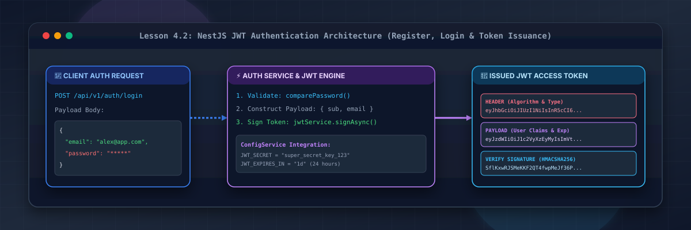
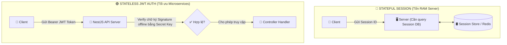
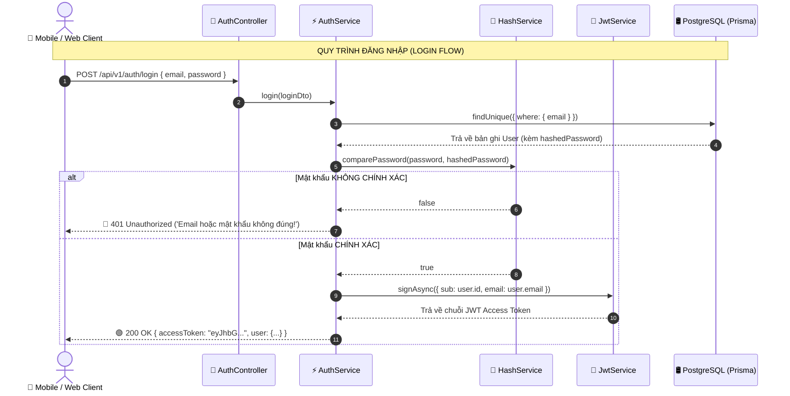

# Lesson 4.2: JWT Auth — Đăng Ký, Đăng Nhập & Phát Hành Access Token Trong NestJS

<p align="center">
  
  
  
  
  
</p>

<p align="center">
  
</p>

---

> [!NOTE]
> ⏱️ **Thời lượng dự kiến:** 15 – 18 phút  
> 🎯 **Mục tiêu bài học:** Thấu hiểu cơ chế Xác thực không lưu trạng thái (Stateless Authentication) dựa trên JSON Web Token (JWT); phân tích chi tiết 3 phần cốt lõi của JWT: Header, Payload, Signature; cài đặt và cấu hình `@nestjs/jwt` kết hợp `ConfigService` để nạp mã bí mật `JWT_SECRET` và thời hạn `expiresIn`; tự tay triển khai quy trình Đăng ký (Register), Đăng nhập (Login) và phát hành Access Token trong `AuthService` & `AuthController`; thực hành kịch bản kiểm thử mã hóa / giải mã token bằng cURL và jwt.io.

---

## 1. Stateful Session vs Stateless JWT Authentication

### 💡 Ẩn Dụ Thực Tế: Thẻ Thành Viên CLB vs Vé Xem Phim QRCode

Hãy so sánh hai phương thức xác thực người dùng phổ biến nhất trong phát triển ứng dụng Web:

1. **Stateful Session (Phương pháp truyền thống - Thẻ thành viên CLB):**
   - Lễ tân (Server) phải mở sổ nhật ký lưu vết (Session Store / Redis) để dò tìm tên bạn. Nếu Server có 10 máy tính (Cluster/Microservices), các máy tính phải chia sẻ bộ nhớ Session với nhau.
   - 🔴 **Nhược điểm:** Tốn tài nguyên RAM trên Server, khó mở rộng hệ thống theo chiều ngang (Horizontal Scaling).

2. **Stateless JWT Authentication (Phương pháp hiện đại - Vé xem phim QRCode):**
   - Tấm vé (JWT Token) chứa sẵn thông tin của bạn (Tên, Số ghế, Hạn dùng) và được ký bằng **Con dấu chống giả mạo (Signature)**. Khi bạn trình vé, Server chỉ cần tự dùng Secret Key để verify chữ ký mà **không cần truy vấn Database hay Session Store**!
   - 🟢 **Ưu điểm:** Khả năng mở rộng không giới hạn, cực kỳ phù hợp cho RESTful API, Mobile App và Microservices.



---

### 🔹 Giải Mã Cấu Trúc 3 Phần Của JSON Web Token (JWT)

Chuỗi JWT gồm 3 phần phân tách nhau bởi dấu chấm (`.`): `Header.Payload.Signature`

```text
  eyJhbGciOiJIUzI1Ni... . eyJzdWIiOiJ1c2VyXzEyMy... . SflKxwRJSMeKKF2QT4fwpMeJf...
  └───────────────────┘   └──────────────────────┘   └───────────────────────────┘
            │                        │                             │
    🔴 1. HEADER             🟣 2. PAYLOAD                 🔵 3. SIGNATURE
  (Thuật toán & Loại)     (Dữ liệu User & Hạn dùng)     (Chữ ký chống giả mạo)
```

1. 🔴 **Header:** Khai báo thuật toán mã hóa (ví dụ `HS256`) và loại Token (`JWT`).
2. 🟣 **Payload (Claims):** Chứa thông tin người dùng được giải mã công khai (ví dụ `sub`: User ID, `email`, `iat`: Ngày phát hành, `exp`: Ngày hết hạn).
3. 🔵 **Signature:** Chuỗi chữ ký được tạo ra bằng thuật toán:
   `HMACSHA256(base64UrlEncode(Header) + "." + base64UrlEncode(Payload), JWT_SECRET)`
   > [!WARNING]
   > **Lưu ý an toàn:** Dữ liệu trong **Payload** chỉ được mã hóa Base64 chứ **KHÔNG ĐƯỢC mã hóa mật mật**! Do đó, **tuyệt đối không đặt thông tin nhạy cảm** (như Password, OTP hay thẻ tín dụng) vào trong JWT Payload.

---

## 2. Luồng Hoạt Động Của AuthService Trong NestJS



---

## 3. Hướng Dẫn Thực Hành Step-by-Step — Cài Đặt & Triển Khai JWT Auth

### 📌 Bước 0: Cài Đặt Thư Viện NestJS JWT & Passport

Mở Terminal tại thư mục gốc dự án và cài đặt bộ thư viện xác thực:

```bash
pnpm add @nestjs/jwt @nestjs/passport passport passport-jwt
pnpm add -D @types/passport-jwt
```

---

### 📌 Bước 1: Khai Báo Biến Môi Trường JWT Trong `.env`

Mở file `.env` và thêm chuỗi bí mật cùng thời gian hết hạn token:

📄 **`.env`**

```env
# JWT Secret Key (Trong thực tế cần dùng chuỗi ngẫu nhiên đủ dài và bảo mật)
JWT_SECRET="nest_basic_course_super_secret_key_2026"
JWT_EXPIRES_IN="1d"
```

---

### 📌 Bước 2: Tạo DTOs Cho Đăng Ký & Đăng Nhập

Tạo thư mục `src/auth/dto/` và triển khai các DTO validation:

#### 1. DTO Đăng Ký (`RegisterDto`):

📄 **`src/auth/dto/register.dto.ts`**

```typescript
import {
  IsEmail,
  IsNotEmpty,
  IsOptional,
  IsString,
  MinLength,
} from 'class-validator';

export class RegisterDto {
  @IsEmail({}, { message: 'Email không đúng định dạng chuẩn!' })
  @IsNotEmpty({ message: 'Email không được để trống!' })
  email: string;

  @IsString({ message: 'Mật khẩu phải là chuỗi ký tự!' })
  @IsNotEmpty({ message: 'Mật khẩu không được để trống!' })
  @MinLength(6, { message: 'Mật khẩu phải có ít nhất 6 ký tự!' })
  password: string;

  @IsOptional()
  @IsString({ message: 'Họ và tên phải là chuỗi ký tự!' })
  name?: string;
}
```

#### 2. DTO Đăng Nhập (`LoginDto`):

📄 **`src/auth/dto/login.dto.ts`**

```typescript
import { IsEmail, IsNotEmpty, IsString, MinLength } from 'class-validator';

export class LoginDto {
  @IsEmail({}, { message: 'Email không đúng định dạng chuẩn!' })
  @IsNotEmpty({ message: 'Email không được để trống!' })
  email: string;

  @IsString({ message: 'Mật khẩu phải là chuỗi ký tự!' })
  @IsNotEmpty({ message: 'Mật khẩu không được để trống!' })
  @MinLength(6, { message: 'Mật khẩu phải có ít nhất 6 ký tự!' })
  password: string;
}
```

---

### 📌 Bước 3: Cấu Hình `AuthModule` Với `JwtModule.registerAsync()`

Tạo tệp `src/auth/auth.module.ts` nạp cấu hình `JWT_SECRET` từ `ConfigService`:

📄 **`src/auth/auth.module.ts`**

```typescript
import { Module } from '@nestjs/common';
import { ConfigModule, ConfigService } from '@nestjs/config';
import { JwtModule } from '@nestjs/jwt';
import { AuthController } from './auth.controller';
import { AuthService } from './auth.service';

@Module({
  imports: [
    // Kích hoạt JwtModule bất đồng bộ để đọc được biến môi trường từ ConfigService
    JwtModule.registerAsync({
      imports: [ConfigModule],
      inject: [ConfigService],
      useFactory: (configService: ConfigService) => ({
        secret: configService.get<string>('JWT_SECRET'),
        signOptions: {
          expiresIn: configService.get<string>('JWT_EXPIRES_IN', '1d'),
        },
      }),
    }),
  ],
  controllers: [AuthController],
  providers: [AuthService],
  exports: [AuthService],
})
export class AuthModule {}
```

---

### 📌 Bước 4: Triển Khai `AuthService` Băm Mật Khẩu & Phát Hành Token

Tạo tệp `src/auth/auth.service.ts` chứa nghiệp vụ xử lý chính:

📄 **`src/auth/auth.service.ts`**

```typescript
import {
  ConflictException,
  Injectable,
  UnauthorizedException,
} from '@nestjs/common';
import { JwtService } from '@nestjs/jwt';
import { HashService } from '../shared/services/hash.service';
import { PrismaService } from '../prisma/prisma.service';
import { LoginDto } from './dto/login.dto';
import { RegisterDto } from './dto/register.dto';

@Injectable()
export class AuthService {
  constructor(
    private readonly prisma: PrismaService,
    private readonly hashService: HashService,
    private readonly jwtService: JwtService,
  ) {}

  /**
   * Xử lý đăng ký tài khoản mới
   */
  async register(registerDto: RegisterDto) {
    const { email, password, name } = registerDto;

    // 1. Kiểm tra email đã tồn tại trong CSDL chưa
    const existingUser = await this.prisma.user.findUnique({
      where: { email },
    });
    if (existingUser) {
      throw new ConflictException('Email này đã được đăng ký!');
    }

    // 2. Băm mật khẩu bằng HashService
    const hashedPassword = await this.hashService.hashPassword(password);

    // 3. Lưu người dùng vào CSDL (Khớp với User Model trong schema.prisma)
    const user = await this.prisma.user.create({
      data: {
        email,
        password: hashedPassword,
        name,
      },
    });

    // 4. Phát hành JWT Access Token
    const accessToken = await this.generateAccessToken(user.id, user.email);

    const { password: _, ...userWithoutPassword } = user;
    return {
      user: userWithoutPassword,
      accessToken,
    };
  }

  /**
   * Xử lý đăng nhập hệ thống
   */
  async login(loginDto: LoginDto) {
    const { email, password } = loginDto;

    // 1. Tìm người dùng theo email
    const user = await this.prisma.user.findUnique({
      where: { email },
    });
    if (!user) {
      throw new UnauthorizedException('Email hoặc mật khẩu không chính xác!');
    }

    // 2. So sánh mật khẩu bằng HashService
    const isPasswordValid = await this.hashService.comparePassword(
      password,
      user.password,
    );
    if (!isPasswordValid) {
      throw new UnauthorizedException('Email hoặc mật khẩu không chính xác!');
    }

    // 3. Phát hành JWT Access Token
    const accessToken = await this.generateAccessToken(user.id, user.email);

    const { password: _, ...userWithoutPassword } = user;
    return {
      user: userWithoutPassword,
      accessToken,
    };
  }

  /**
   * Helper phát hành JWT Access Token
   */
  private async generateAccessToken(
    userId: number,
    email: string,
  ): Promise<string> {
    const payload = { sub: userId, email };
    return this.jwtService.signAsync(payload);
  }
}
```

---

### 📌 Bước 5: Triển Khai `AuthController` Cho Endpoint `/auth`

Tạo tệp `src/auth/auth.controller.ts`:

📄 **`src/auth/auth.controller.ts`**

```typescript
import {
  Body,
  Controller,
  HttpCode,
  HttpStatus,
  Post,
  Version,
} from '@nestjs/common';
import { ResponseMessage } from '../common/decorators/response-message.decorator';
import { AuthService } from './auth.service';
import { LoginDto } from './dto/login.dto';
import { RegisterDto } from './dto/register.dto';

@Controller('auth')
export class AuthController {
  constructor(private readonly authService: AuthService) {}

  @Version('1')
  @Post('register')
  @ResponseMessage('Đăng ký tài khoản thành công!')
  async register(@Body() registerDto: RegisterDto) {
    return this.authService.register(registerDto);
  }

  @Version('1')
  @Post('login')
  @HttpCode(HttpStatus.OK)
  @ResponseMessage('Đăng nhập thành công!')
  async login(@Body() loginDto: LoginDto) {
    return this.authService.login(loginDto);
  }
}
```

---

## 4. Kịch Bản Kiểm Tra & Thử Nghiệm (Hands-on Lab)

### 🟢 Kịch Bản 1: Thành Công — Đăng Ký & Đăng Nhập Nhận JWT Access Token

Khởi động ứng dụng NestJS và mở Terminal gửi lệnh cURL:

#### 1. Đăng ký tài khoản mới:

```bash
curl -X POST http://localhost:3000/api/v1/auth/register \
  -H "Content-Type: application/json" \
  -d '{
    "email": "alex@example.com",
    "password": "Password123!",
    "name": "Alex Johnson"
  }'
```

📥 **Phản hồi HTTP trả về (`201 Created` kèm `accessToken`):**

```json
{
  "statusCode": 201,
  "message": "Đăng ký tài khoản thành công!",
  "data": {
    "user": {
      "id": 1,
      "email": "alex@example.com",
      "name": "Alex Johnson",
      "role": "USER",
      "createdAt": "2026-08-13T15:35:00.000Z",
      "updatedAt": "2026-08-13T15:35:00.000Z"
    },
    "accessToken": "eyJhbGciOiJIUzI1NiIsInR5cCI6IkpXVCJ9.eyJzdWIiOjEsImVtYWlsIjoiYWxleEBleGFtcGxlLmNvbSI..."
  },
  "timestamp": "2026-08-13T15:35:00.000Z",
  "path": "/api/v1/auth/register"
}
```

#### 2. Đăng nhập hệ thống:

```bash
curl -X POST http://localhost:3000/api/v1/auth/login \
  -H "Content-Type: application/json" \
  -d '{
    "email": "alex@example.com",
    "password": "Password123!"
  }'
```

📥 **Phản hồi HTTP nhận được (`200 OK`):**

```json
{
  "statusCode": 200,
  "message": "Đăng nhập thành công!",
  "data": {
    "user": {
      "id": 1,
      "email": "alex@example.com",
      "name": "Alex Johnson",
      "role": "USER",
      "createdAt": "2026-08-13T15:35:00.000Z",
      "updatedAt": "2026-08-13T15:35:00.000Z"
    },
    "accessToken": "eyJhbGciOiJIUzI1NiIsInR5cCI6IkpXVCJ9..."
  }
}
```

🔍 **Kiểm tra và giải mã Token trên website [jwt.io](https://jwt.io):**

- Copy chuỗi `accessToken` vừa nhận được dán vào ô Debugger của jwt.io.
- **Payload nhận được:**
  ```json
  {
    "sub": 1,
    "email": "alex@example.com",
    "iat": 1770910500,
    "exp": 1770996900
  }
  ```

✅ **Kết quả:** JWT Token được ký và phát hành chính xác với các thuộc tính claim chuẩn mực.

---

### 🔴 Kịch Bản 2: Kiểm Thử Lỗi — Đăng Nhập Sai Mật Khẩu Hoặc Trùng Email

#### Test 1: Đăng nhập với mật khẩu sai:

```bash
curl -X POST http://localhost:3000/api/v1/auth/login \
  -H "Content-Type: application/json" \
  -d '{
    "email": "alex@example.com",
    "password": "WrongPassword!"
  }'
```

📥 **Phản hồi HTTP nhận được (`401 Unauthorized`):**

```json
{
  "statusCode": 401,
  "message": "Email hoặc mật khẩu không chính xác!",
  "error": "Unauthorized",
  "timestamp": "2026-08-13T15:35:10.000Z",
  "path": "/api/v1/auth/login"
}
```

✅ **Kết quả:** Hệ thống bảo vệ an toàn, không phát hành token khi sai mật khẩu.

---

## 5. Tổng Kết Bài Học & Checklist Ghi Nhớ

```mermaid
mindmap
  root(("NestJS JWT Authentication"))
    "Cơ chế Stateless"
      "Không tốn RAM Session Store"
      "Dễ dàng mở rộng Microservices"
      "Gửi qua Header Authorization Bearer"
    "Cấu trúc JWT"
      "Header (Algorithm HS256)"
      "Payload (sub, email, iat, exp)"
      "Signature (Secret Key Sign)"
    "Cấu hình NestJS"
      "JwtModule.registerAsync()"
      "Đọc JWT_SECRET từ ConfigService"
      "Thiết lập expiresIn: 1d"
    "Luồng Nghiệp Vụ"
      "register(): Băm pass -> Lưu DB -> Sign Token"
      "login(): So sánh pass -> Sign Token"
```

### ✅ Checklist Ghi Nhớ Bài Học:

- [x] Phân biệt được sự khác nhau giữa Stateful Session và Stateless JWT Authentication.
- [x] Nắm vững cấu trúc 3 phần của JWT Token (Header, Payload, Signature).
- [x] Cài đặt các gói `@nestjs/jwt`, `@nestjs/passport`, `passport-jwt`.
- [x] Cấu hình `JwtModule.registerAsync()` nạp `JWT_SECRET` và `JWT_EXPIRES_IN` từ `ConfigService`.
- [x] Triển khai thành công hai phương thức `register()` và `login()` trong `AuthService`.
- [x] Thử nghiệm thành công cURL nhận về Access Token và kiểm tra payload trên jwt.io.

---

👉 **Bài tiếp theo:** [Lesson 4.3: Guards — Bảo Vệ API Bằng JwtAuthGuard & Passport Strategy](../lesson-4.3/lesson-4.3.md)
