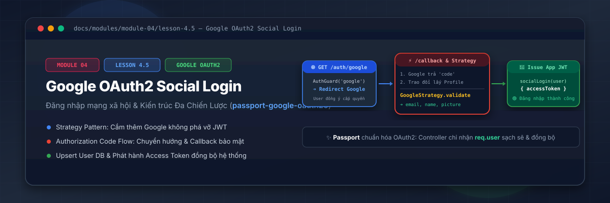
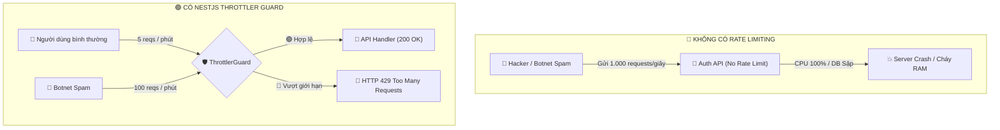
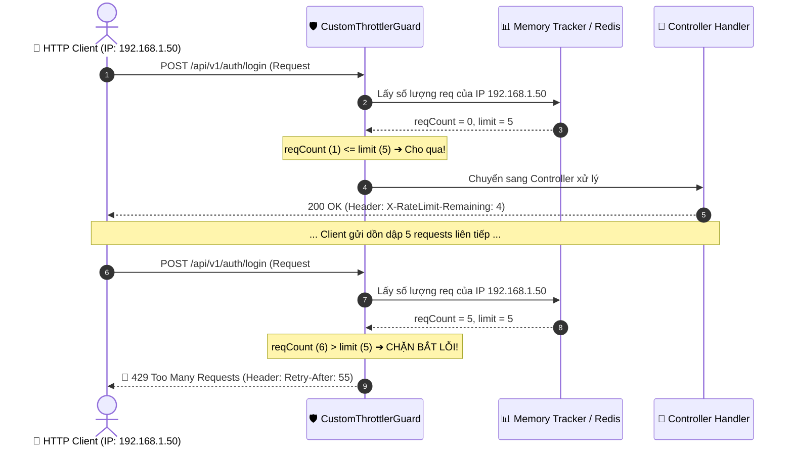

# Lesson 4.5: Rate Limiting — Giới Hạn Lượt Gọi Request Với @nestjs/throttler Trong NestJS

<p align="center">
  
  
  
  
  
</p>

<p align="center">
  
</p>

---

> [!NOTE]
> ⏱️ **Thời lượng dự kiến:** 12 – 15 phút  
> 🎯 **Mục tiêu bài học:** Nắm vững giải pháp bảo vệ hệ thống khỏi các cuộc tấn công Brute-force Login, Spam API và DoS/DDoS ở tầng ứng dụng bằng kỹ thuật Rate Limiting; làm chủ thư viện chính chủ `@nestjs/throttler`; tự tay cấu hình nhiều khung thời gian Rate Limit linh hoạt (Named Throttlers `short`, `medium`, `long`); tùy biến thắt chặt hoặc nới lỏng giới hạn bằng `@Throttle()` và `@SkipThrottle()`; tùy chỉnh Custom `ThrottlerGuard` trả về thông báo lỗi `429 Too Many Requests` tiếng Việt chuyên nghiệp; thực hành kịch bản kiểm thử gửi spam request dồn dập và quan sát HTTP Headers `X-RateLimit-*`.

---

## 1. Tại Sao Mọi API Enterprise Đều Cần Rate Limiting?

### 💡 Ẩn Dụ Thực Tế: Cửa Xoay Kiểm Soát Đám Đông Tại Sân Vận Động

Hãy tưởng tượng trang web của bạn như một **Sân Vận Động Quốc Gia**:

- Nếu không có **Cửa Xoay Kiểm Soát (Rate Limiter)** ở cổng vào, hàng ngàn người có thể tràn vào cùng một lúc, gây giẫm đạp và sập toàn bộ cổng ra vào.
- Cửa xoay được cài đặt quy tắc: Mỗi người (IP Address) chỉ được đi qua 1 lần mỗi 2 giây, và tối đa 5 người trong 1 phút.
- Nếu một đối tượng cố tình lao vào cửa xoay liên tục (Spam / Botnet), cửa xoay sẽ tự động khóa lại và thông báo: _"Bạn đã di chuyển quá nhanh! Hãy kiên nhẫn chờ 60 giây nữa."_ (`429 Too Many Requests`).



---

### 🔹 Các Mối Đe Dọa Mà Rate Limiting Ngăn Chặn

1. **Tấn công Brute-force Login:** Hacker dùng từ điển thử hàng triệu mật khẩu vào API `/auth/login`. Rate Limiting sẽ khóa IP đó ngay sau 5 lần thử sai.
2. **Tấn công Spam API (Resource Exhaustion):** Bot tự động gọi API đăng ký tài khoản, gửi bình luận rác hoặc tải file làm cạn kiệt tài nguyên CSDL & Ổ đĩa.
3. **Tấn công DoS/DDoS Tầng 7 (Application Layer):** Gửi liên tục các câu truy vấn nặng (Search, Aggregation) khiến CPU máy chủ quá tải.
4. **Kiểm soát chi phí API bên thứ 3:** Ngăn ngừa nguy cơ bị vọt hóa đơn khi dùng các dịch vụ tính phí theo lượt gọi (OpenAI, Twilio SMS, SendGrid Mail).

---

## 2. Luồng Hoạt Động Của ThrottlerGuard Trong NestJS

Thư viện `@nestjs/throttler` sử dụng thuật toán **Sliding Window Log** để đếm số lượng Request dựa trên IP của Client trong một khoảng thời gian `ttl` (Time-To-Live tính bằng miligiây):



---

## 3. Hướng Dẫn Thực Hành Step-by-Step — Triển Khai `@nestjs/throttler`

### 📌 Bước 0: Cài Đặt Thư Viện `@nestjs/throttler`

Mở Terminal tại thư mục gốc của dự án và cài đặt gói chính chủ:

```bash
pnpm add @nestjs/throttler
```

---

### 📌 Bước 1: Cấu Hình `ThrottlerModule` Trong `AppModule`

NestJS v10+ hỗ trợ cấu hình nhiều bộ đếm (Named Throttlers) cùng lúc cho các khung thời gian khác nhau (giây, phút, giờ).

Mở tệp `src/app.module.ts` và khai báo cấu hình:

📄 **`src/app.module.ts`**

```typescript
import { Module } from '@nestjs/common';
import { ConfigModule, ConfigService } from '@nestjs/config';
import { APP_GUARD } from '@nestjs/core';
import { ThrottlerModule } from '@nestjs/throttler';
import { AuthModule } from './auth/auth.module';
import { CustomThrottlerGuard } from './common/guards/custom-throttler.guard';

@Module({
  imports: [
    AuthModule,
    // 🛡️ Cấu hình ThrottlerModule bất đồng bộ
    ThrottlerModule.forRootAsync({
      imports: [ConfigModule],
      inject: [ConfigService],
      useFactory: (configService: ConfigService) => ({
        throttlers: [
          {
            name: 'short',
            ttl: 1000, // 1 giây
            limit: 3, // Tối đa 3 requests/giây (Chống spam nhấp chuột dồn dập)
          },
          {
            name: 'medium',
            ttl: 10000, // 10 giây
            limit: 20, // Tối đa 20 requests/10 giây
          },
          {
            name: 'long',
            ttl: 60000, // 60 giây (1 phút)
            limit: 100, // Tối đa 100 requests/phút (Mặc định toàn hệ thống)
          },
        ],
      }),
    }),
  ],
  providers: [
    // 🛡️ Đăng ký CustomThrottlerGuard làm Global Guard
    {
      provide: APP_GUARD,
      useClass: CustomThrottlerGuard,
    },
  ],
})
export class AppModule {}
```

---

### 📌 Bước 2: Viết `CustomThrottlerGuard` Tùy Chỉnh Thông Báo Lỗi Tiếng Việt

Mặc định `@nestjs/throttler` trả về thông báo lỗi bằng tiếng Anh (`ThrottlerException: Throttler limit exceeded`). Chúng ta sẽ tạo `CustomThrottlerGuard` kế thừa `ThrottlerGuard` để tùy chỉnh phản hồi JSON tiếng Việt chuyên nghiệp:

Tạo tệp `src/common/guards/custom-throttler.guard.ts`:

📄 **`src/common/guards/custom-throttler.guard.ts`**

```typescript
import { Injectable, ThrottlerException } from '@nestjs/common';
import { ThrottlerGuard } from '@nestjs/throttler';

@Injectable()
export class CustomThrottlerGuard extends ThrottlerGuard {
  // Override phương thức quăng ngoại lệ khi người dùng vượt quá Rate Limit
  protected override async throwThrottlingException(
    context: any,
    throttlerLimitDetail: any,
  ): Promise<void> {
    const { timeToBlockExpire } = throttlerLimitDetail;

    // Tính số giây người dùng cần chờ trước khi thử lại
    const secondsToWait = Math.ceil(timeToBlockExpire / 1000);

    throw new ThrottlerException(
      `Bạn đã gửi quá nhiều yêu cầu! Vui lòng thử lại sau ${secondsToWait} giây.`,
    );
  }
}
```

---

### 📌 Bước 3: Tùy Chỉnh Rate Limit Cho Các API Nhạy Cảm (`@Throttle` & `@SkipThrottle`)

Mở tệp `src/auth/auth.controller.ts` và thắt chặt Rate Limit cho API Đăng nhập/Đăng ký để chống Brute-force:

📄 **`src/auth/auth.controller.ts`**

```typescript
import {
  Body,
  Controller,
  HttpCode,
  HttpStatus,
  Post,
  Version,
} from '@nestjs/common';
import { SkipThrottle, Throttle } from '@nestjs/throttler';
import { Public } from '../common/decorators/public.decorator';
import { ResponseMessage } from '../common/decorators/response-message.decorator';
import { AuthService } from './auth.service';
import { LoginDto } from './dto/login.dto';
import { RegisterDto } from './dto/register.dto';

@Controller('auth')
export class AuthController {
  constructor(private readonly authService: AuthService) {}

  // 🔒 Thắt chặt riêng cho API Login: Tối đa 5 lần thử trong 60 giây
  @Public()
  @Throttle({ default: { ttl: 60000, limit: 5 } })
  @Version('1')
  @Post('login')
  @HttpCode(HttpStatus.OK)
  @ResponseMessage('Đăng nhập thành công!')
  async login(@Body() loginDto: LoginDto) {
    return this.authService.login(loginDto);
  }

  @Public()
  @Throttle({ default: { ttl: 60000, limit: 3 } }) // Tối đa 3 lần đăng ký/phút
  @Version('1')
  @Post('register')
  @ResponseMessage('Đăng ký tài khoản thành công!')
  async register(@Body() registerDto: RegisterDto) {
    return this.authService.register(registerDto);
  }

  // 🔓 Bỏ qua kiểm tra Rate Limit cho API Healthcheck
  @Public()
  @SkipThrottle()
  @Version('1')
  @Post('health-ping')
  async ping() {
    return { status: 'pong' };
  }
}
```

> [!TIP]
> **Các Decorator điều khiển Rate Limit:**
>
> - `@Throttle({ default: { ttl, limit } })`: Thắt chặt hoặc thay đổi tham số Rate Limit riêng cho Route Handler / Controller đó.
> - `@SkipThrottle()`: Bỏ qua hoàn toàn việc kiểm tra Rate Limit (dành cho API Healthcheck, Webhook từ bên thứ 3 tin tưởng).

---

## 4. Kịch Bản Kiểm Tra & Thử Nghiệm (Hands-on Lab)

### 🟢 Kịch Bản 1: Thành Công — Gọi API Bình Thường & Quan Sát Response Headers

Thực hiện 1 câu lệnh cURL tới API Đăng nhập và bật cờ `-i` để xem Response Headers:

```bash
curl -i -X POST http://localhost:3000/api/v1/auth/login \
  -H "Content-Type: application/json" \
  -d '{"email": "alex@example.com", "password": "Password123!"}'
```

📥 **Phản hồi HTTP Headers nhận được từ Server:**

```text
HTTP/1.1 200 OK
X-RateLimit-Limit-short: 3
X-RateLimit-Remaining-short: 2
X-RateLimit-Reset-short: 1
X-RateLimit-Limit-medium: 20
X-RateLimit-Remaining-medium: 19
X-RateLimit-Reset-medium: 10
X-RateLimit-Limit-default: 5
X-RateLimit-Remaining-default: 4
X-RateLimit-Reset-default: 60
Content-Type: application/json; charset=utf-8
```

✅ **Kết quả:** NestJS tự động trả về mảng Headers `X-RateLimit-*` giúp Client/Frontend biết chính xác họ còn bao nhiêu lượt gọi API nữa!

---

### 🔴 Kịch Bản 2: Spam Request (Blocked Flow) — Gửi 10 Request Dồn Dập Vào API Login

Mở Terminal và chạy vòng lặp Bash Script gửi 10 yêu cầu POST liên tục trong vài giây:

```bash
for i in {1..8}; do
  echo "--- Request #$i ---"
  curl -s -X POST http://localhost:3000/api/v1/auth/login \
    -H "Content-Type: application/json" \
    -d '{"email": "hacker@example.com", "password": "wrong_password"}'
  echo ""
done
```

📥 **Kết quả hiển thị tại Terminal:**

- **Request #1 -> #5:** Trả về `401 Unauthorized` (Do sai mật khẩu, hệ thống vẫn cho phép thử).
- **Request #6 -> #8 (Bị thắt chặt bởi `@Throttle({ default: { limit: 5 } })`):**

```json
HTTP/1.1 429 Too Many Requests
Content-Type: application/json

{
  "statusCode": 429,
  "message": "Bạn đã gửi quá nhiều yêu cầu! Vui lòng thử lại sau 58 giây.",
  "error": "Too Many Requests",
  "timestamp": "2026-08-13T17:20:00.000Z",
  "path": "/api/v1/auth/login"
}
```

✅ **Kết quả:** `CustomThrottlerGuard` phát hiện hành vi spam/brute-force và chặn đứng ngay từ Yêu cầu thứ 6, bảo vệ CSDL khỏi quá tải!

---

## 5. Tổng Kết Bài Học & Checklist Ghi Nhớ

```mermaid
mindmap
  root(("NestJS Rate Limiting"))
    "Tầm quan trọng"
      "Chống Brute-force Login"
      "Chống Spam API & Botnet"
      "Bảo vệ CPU/RAM Server"
      "Tiết kiệm chi phí API 3rd party"
    "Cấu hình ThrottlerModule"
      "Named Throttlers (short, medium, long)"
      "ttl (Time-To-Live ms)"
      "limit (Số lượt tối đa)"
    "Decorators linh hoạt"
      "@Throttle() thắt chặt Route"
      "@SkipThrottle() bỏ qua Route"
    "CustomThrottlerGuard"
      "Triển khai Global Guard (APP_GUARD)"
      "Override throwThrottlingException"
      "Trả về 429 với message tiếng Việt"
```

### ✅ Checklist Ghi Nhớ Bài Học:

- [x] Thấu hiểu tầm quan trọng của Rate Limiting trong việc bảo vệ API khỏi tấn công Brute-force và DoS/DDoS.
- [x] Cài đặt thư viện `@nestjs/throttler` chính chủ.
- [x] Cấu hình `ThrottlerModule` với mảng các bộ đếm `throttlers` (`short`, `medium`, `long`).
- [x] Tạo thành công `CustomThrottlerGuard` trả về lỗi HTTP 429 tiếng Việt thân thiện.
- [x] Đăng ký `CustomThrottlerGuard` làm Global Guard trong `AppModule`.
- [x] Sử dụng thành thạo `@Throttle()` cho API Đăng nhập/Đăng ký và `@SkipThrottle()` cho API Healthcheck.
- [x] Thử nghiệm thành công cURL gửi spam request và đọc các HTTP Headers `X-RateLimit-*`.

---

👉 **Bài tiếp theo:** [Lesson 5.1: Posts API — CRUD Bài Viết & Phân Trang Cursor/Offset](../../module-05/lesson-5.1/lesson-5.1.md)
