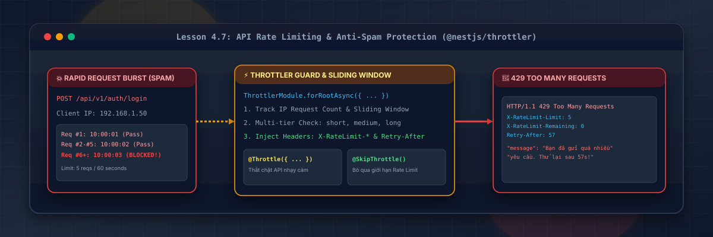
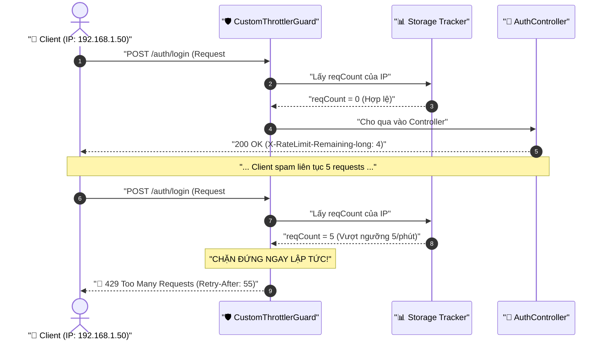

# Lesson 4.7: Rate Limiting — Giới Hạn Lượt Gọi Request Với @nestjs/throttler Trong NestJS

<p align="center">
  
  
  
  
  
  
</p>

<p align="center">
  
</p>

---

> [!NOTE]
> ⏱️ **Thời lượng dự kiến:** 12 – 15 phút  
> 🎯 **Mục tiêu bài học:**
>
> - Hiểu sâu sắc bản chất cuộc tấn công **Brute-Force Attack** và vì sao cần áp dụng **Rate Limiting** để bảo vệ hệ thống.
> - Làm chủ cơ chế **Sliding Window Log** và các HTTP Headers `X-RateLimit-*` & `Retry-After`.
> - Cấu hình **Multi-Tier Throttlers** (`short`, `medium`, `long`) trong `AppModule`.
> - Tùy biến `CustomThrottlerGuard` trả về mã lỗi `429 Too Many Requests` tiếng Việt chuyên nghiệp.
> - Điều khiển linh hoạt qua Decorators: `@Throttle()` (siết chặt) và `@SkipThrottle()` (miễn trừ).

---

## 1. Đặt Vấn Đề: Tấn Công Brute Force Attack — "Thử Nhiều Mật Khẩu Đến Khi Đúng"

<p align="center">
  
</p>

### 🔹 Bản Chất & Cách Thức Tấn Công

- **Khái niệm:** Kẻ tấn công dùng bot tự động gửi hàng loạt mật khẩu phổ biến (`123456`, `password`, `admin`, `letmein`, `s3cr3t`...) vào API `/auth/login` cho đến khi tìm ra mật khẩu chính xác.
- **Tác hại kép (Double Impact):**
  1. 🔓 **Chiếm đoạt tài khoản (Account Takeover):** Dễ dàng bẻ khóa người dùng đặt mật khẩu yếu hoặc dùng chung một mật khẩu trên nhiều website.
  2. 💥 **Tê liệt máy chủ (CPU 100%):** Mỗi request login phải chạy hàm băm `bcrypt.compare()`. Hàm này ngốn nhiều chu kỳ CPU, khiến server cạn kiệt tài nguyên chỉ sau vài trăm lượt thử/giây.

---

## 2. Giải Pháp: Rate Limiting & Cơ Chế Cửa Xoay Bảo Vệ Toàn Diện API

### 💡 Ẩn Dụ Thực Tế: Cửa Xoay Kiểm Soát Tại Sân Vận Động

- **Không có cửa xoay:** Hàng ngàn người ùa vào cùng lúc ➔ Quá tải cổng, giẫm đạp (Server crash / 502 Bad Gateway).
- **Có cửa xoay (Throttler Guard):** Mỗi người (Client IP) chỉ được đi qua tối đa 1 lần/giây, không quá 5 lần/phút.
- **Cố tình spam:** Cửa tự động khóa chốt, yêu cầu chờ lượt kế tiếp (`HTTP 429 Too Many Requests`).

<p align="center">
  
</p>

---

### 🛡️ 4 Hiểm Họa Mà Rate Limiting Ngăn Chặn

| Hiểm Họa                           | Kịch Bản Tấn Công                                 | Giải Pháp Của Rate Limiting                   |
| :--------------------------------- | :------------------------------------------------ | :-------------------------------------------- |
| 🔑 **Brute-Force Login**           | Dò hàng ngàn mật khẩu vào `/auth/login`.          | Khóa IP sau 5 lần thử sai / phút.             |
| 🤖 **Spam Cạn Kiệt Tài Nguyên**    | Bot spam gửi OTP SMS, tạo tài khoản ảo, ghi file. | Giới hạn hạn ngạch tạo mới theo IP/User.      |
| 💥 **DoS Tầng Ứng Dụng (Layer 7)** | Bắn phá liên tục vào các API tính toán nặng.      | Giữ CPU/RAM máy chủ luôn dưới ngưỡng an toàn. |
| 💸 **Vọt Chi Phí 3rd-Party**       | Spam các API trả phí (OpenAI, Twilio, SendGrid).  | Ngăn chặn rủi ro thủng ví hóa đơn Cloud.      |

---

## 3. Cơ Chế Hoạt Động & Thuật Toán Sliding Window Log

### 🔹 Sliding Window Log (Cửa Sổ Trượt) vs Fixed Window (Cửa Sổ Cố Định)

- **Fixed Window (Lỗi ranh giới):** Nếu cho phép 10 reqs/phút, hacker có thể gửi 10 reqs vào `10:00:59` và 10 reqs vào `10:01:00` ➔ Server phải chịu **20 reqs trong 1 giây**.
- **Sliding Window Log (Chuẩn của `@nestjs/throttler`):** Tính toán chính xác theo từng mili-giây trượt. Giới hạn luôn được bảo đảm ở bất kỳ khung thời gian nào.



### 🔹 4 Headers Tiêu Chuẩn Phản Hồi Từ Throttler

- `X-RateLimit-Limit-<name>`: Số request tối đa cho phép trong chu kỳ.
- `X-RateLimit-Remaining-<name>`: Số lượt request còn lại.
- `X-RateLimit-Reset-<name>`: Số giây cho đến khi bộ đếm được reset.
- `Retry-After`: Số giây client cần chờ khi bị chặn mã `429`.

---

## 4. Hướng Dẫn Thực Hành Step-by-Step

### 📌 Bước 0: Cài Đặt Package

```bash
pnpm add @nestjs/throttler
```

---

### 📌 Bước 1: Cấu Hình Phòng Thủ Đa Tầng Trong `AppModule`

Khai báo 3 tầng kiểm soát:

- `short`: 3 reqs / 1 giây (chống click đúp, spam burst).
- `medium`: 20 reqs / 10 giây (chống scraping).
- `long`: 100 reqs / 60 giây (giới hạn dung lượng toàn cục).

📄 **`src/app.module.ts`**

```typescript
import { MiddlewareConsumer, Module, RequestMethod } from '@nestjs/common';
import { AppController } from './app.controller';
import { AppService } from './app.service';
import { ConfigModule } from '@nestjs/config';
import { envValidationSchema } from './config/env.validation';
import { PrismaModule } from './prisma/prisma.module';
import { UsersModule } from './users/users.module';
import { PostsModule } from './posts/posts.module';
import { APP_FILTER, APP_GUARD, APP_INTERCEPTOR } from '@nestjs/core';
import { PrismaClientExceptionFilter } from './shared/filters/prisma-client-exception.filter';
import { LoggerMiddleware } from './shared/middleware/logger.middleware';
import { HttpExceptionFilter } from './shared/filters/http-exception.filter';
import { TransformInterceptor } from './shared/interceptors/transform.interceptor';
import { SharedServiceModule } from './shared/services/shared-service.module';
import { AuthModule } from './auth/auth.module';
import { JwtAuthGuard } from './auth/guards/jwt-auth.guard';
// 🛡️ Import Throttler & Custom Guard
import { ThrottlerModule } from '@nestjs/throttler';
import { CustomThrottlerGuard } from './shared/guards/custom-throttler.guard';

@Module({
  imports: [
    ConfigModule.forRoot({
      validationSchema: envValidationSchema,
      isGlobal: true,
    }),
    PrismaModule,
    SharedServiceModule,
    UsersModule,
    PostsModule,
    AuthModule,
    // 🛡️ Cấu hình Multi-Tier Throttlers
    ThrottlerModule.forRootAsync({
      useFactory: () => ({
        throttlers: [
          { name: 'short', ttl: 1000, limit: 3 }, // 3 reqs / 1s
          { name: 'medium', ttl: 10000, limit: 20 }, // 20 reqs / 10s
          { name: 'long', ttl: 60000, limit: 100 }, // 100 reqs / 1m
        ],
      }),
    }),
  ],
  controllers: [AppController],
  providers: [
    AppService,
    { provide: APP_FILTER, useClass: PrismaClientExceptionFilter },
    { provide: APP_FILTER, useClass: HttpExceptionFilter },
    { provide: APP_INTERCEPTOR, useClass: TransformInterceptor },
    // 🛡️ Guard 1: CustomThrottlerGuard (Đặt ĐẦU TIÊN để chặn spam sớm nhất)
    {
      provide: APP_GUARD,
      useClass: CustomThrottlerGuard,
    },
    // 🛡️ Guard 2: JwtAuthGuard (Chỉ chạy khi request đã vượt qua Rate Limit)
    {
      provide: APP_GUARD,
      useClass: JwtAuthGuard,
    },
  ],
})
export class AppModule {
  configure(consumer: MiddlewareConsumer) {
    consumer
      .apply(LoggerMiddleware)
      .exclude({ path: 'health', method: RequestMethod.GET })
      .forRoutes('{*path}');
  }
}
```

> [!TIP]
> **Thứ tự Guard rất quan trọng:** Đặt `CustomThrottlerGuard` trước `JwtAuthGuard` giúp server chặn spam ngay tại RAM, không tốn CPU giải mã token JWT hay query database.

---

### 📌 Bước 2: Viết `CustomThrottlerGuard` Báo Lỗi Tiếng Việt

Tạo tệp `src/shared/guards/custom-throttler.guard.ts`:

📄 **`src/shared/guards/custom-throttler.guard.ts`**

```typescript
import { ExecutionContext, Injectable } from '@nestjs/common';
import {
  ThrottlerException,
  ThrottlerGuard,
  ThrottlerLimitDetail,
} from '@nestjs/throttler';

@Injectable()
export class CustomThrottlerGuard extends ThrottlerGuard {
  protected throwThrottlingException(
    context: ExecutionContext,
    throttlerLimitDetail: ThrottlerLimitDetail,
  ): Promise<void> {
    const timeToWait =
      throttlerLimitDetail.timeToBlockExpire ||
      throttlerLimitDetail.timeToExpire;

    const secondsToWait = Math.ceil(timeToWait / 1000);

    throw new ThrottlerException(
      `Bạn đã gửi quá nhiều yêu cầu! Vui lòng thử lại sau ${secondsToWait} giây.`,
    );
  }
}
```

---

### 📌 Bước 3: Gắn Decorator Tùy Chỉnh Trong `AuthController`

Mở tệp `src/auth/auth.controller.ts`:

📄 **`src/auth/auth.controller.ts`**

```typescript
import {
  Body,
  Controller,
  Get,
  HttpCode,
  HttpStatus,
  Post,
  UseGuards,
} from '@nestjs/common';
import { SkipThrottle, Throttle } from '@nestjs/throttler';
import { ResponseMessage } from '@/shared/decorators/response-message.decorator';
import { AuthService } from './auth.service';
import { LoginDto } from './dto/login.dto';
import { RegisterDto } from './dto/register.dto';
import { GoogleAuthGuard } from './guards/google-auth.guard';
import { type GoogleUser } from './interfaces/google-user.interface';
import { Public } from '@/shared/decorators/public.decorator';
import { CurrentUser } from '@/shared/decorators/current-user.decorator';

@Public()
@Controller('auth')
export class AuthController {
  constructor(private readonly authService: AuthService) {}

  // 🔒 Đăng ký: Tối đa 1 req/giây & 3 lần đăng ký / phút
  @Throttle({
    short: { limit: 1, ttl: 1000 },
    long: { limit: 3, ttl: 60000 },
  })
  @Post('register')
  @ResponseMessage('Đăng ký tài khoản thành công!')
  async register(@Body() registerDto: RegisterDto) {
    return this.authService.register(registerDto);
  }

  // 🔒 Đăng nhập: Chống Brute-Force (Tối đa 1 req/giây & 5 lần thử / phút)
  @Throttle({
    short: { limit: 1, ttl: 1000 },
    long: { limit: 5, ttl: 60000 },
  })
  @Post('login')
  @HttpCode(HttpStatus.OK)
  @ResponseMessage('Đăng nhập thành công!')
  async login(@Body() loginDto: LoginDto) {
    return this.authService.login(loginDto);
  }

  // 🔓 Bỏ qua kiểm tra Rate Limit cho Healthcheck
  @SkipThrottle()
  @Get('health')
  async healthCheck() {
    return { status: 'healthy', timestamp: new Date().toISOString() };
  }

  @Get('google')
  @UseGuards(GoogleAuthGuard)
  async googleAuth() {}

  @Get('google/callback')
  @UseGuards(GoogleAuthGuard)
  async googleAuthCallback(@CurrentUser() userData: GoogleUser) {
    return this.authService.socialLogin(userData);
  }
}
```

---

## 5. Kịch Bản Kiểm Thử Thực Tế (Hands-on Lab)

Khởi động dự án: `pnpm start:dev`

### 🟢 Kịch Bản 1: Gọi API Hợp Lệ & Xem Headers

```bash
curl -i -X POST http://localhost:3000/api/v1/auth/login \
  -H "Content-Type: application/json" \
  -d '{"email": "alex@example.com", "password": "Password123!"}'
```

📥 **Headers nhận được:**

```http
HTTP/1.1 200 OK
X-RateLimit-Limit-short: 1
X-RateLimit-Remaining-short: 0
X-RateLimit-Limit-long: 5
X-RateLimit-Remaining-long: 4
X-RateLimit-Reset-long: 60
```

👉 `long: 5` và `Remaining: 4` chứng minh `@Throttle({ long: { limit: 5 } })` đã hoạt động chính xác.

---

### 🔴 Kịch Bản 2: Mô Phỏng Tấn Công Brute-Force Dồn Dập Bằng Bash Script

Chạy script gửi nhanh 8 requests dò mật khẩu sai vào API Login:

```bash
for i in {1..8}; do
  echo -n "Req #$i: "
  curl -s -i -X POST http://localhost:3000/api/v1/auth/login \
    -H "Content-Type: application/json" \
    -d '{"email": "hacker@example.com", "password": "wrong"}' | grep -E "HTTP/|Retry-After|message"
  sleep 0.1
done
```

📥 **Kết quả tại Terminal:**

```text
Req #1: HTTP/1.1 401 Unauthorized
Req #2: HTTP/1.1 401 Unauthorized
... (Req #3 - #5 vẫn xử lý bình thường) ...
Req #6: HTTP/1.1 429 Too Many Requests
Retry-After: 58
{"statusCode":429,"message":"Bạn đã gửi quá nhiều yêu cầu! Vui lòng thử lại sau 58 giây."...}
Req #7: HTTP/1.1 429 Too Many Requests
```

👉 Đúng sau 5 lần thử sai, `CustomThrottlerGuard` lập tức khóa kết nối và ném mã `429`, bảo vệ tài khoản người dùng khỏi cuộc tấn công Brute-Force.

---

### 🟡 Kịch Bản 3: Kiểm Thử Miễn Trừ Với `@SkipThrottle()`

Gửi liên tiếp 10 requests vào endpoint healthcheck:

```bash
for i in {1..10}; do curl -s -o /dev/null -w "%{http_code} " http://localhost:3000/api/v1/auth/health; done
```

📥 **Kết quả:** `200 200 200 200 200 200 200 200 200 200` ➔ `@SkipThrottle()` hoạt động hoàn hảo!

---

## 6. Tổng Kết & Checklist Ghi Nhớ

```mermaid
mindmap
  root(("Rate Limiting"))
    "Mục đích cốt lõi"
      "Triệt tiêu Brute-force Login"
      "Chống Spam cạn RAM / DB"
      "Bảo vệ chi phí API bên ngoài"
    "Cấu hình AppModule"
      "Multi-Tier (short, medium, long)"
      "CustomThrottlerGuard trước JwtAuthGuard"
    "CustomThrottlerGuard"
      "Override throwThrottlingException"
      "Báo lỗi 429 tiếng Việt chuẩn filter"
    "Decorators"
      "@Throttle() tùy chỉnh theo route"
      "@SkipThrottle() miễn trừ kiểm tra"
```

### ✅ Checklist Ghi Nhớ:

- [x] Hiểu rõ bản chất cuộc tấn công **Brute-Force Attack** và cách Rate Limiting vô hiệu hóa nó.
- [x] Phân biệt được Sliding Window Log với Fixed Window.
- [x] Cấu hình Named Throttlers (`short`, `medium`, `long`) trong `AppModule`.
- [x] Đăng ký `CustomThrottlerGuard` trước `JwtAuthGuard`.
- [x] Viết `CustomThrottlerGuard` chuẩn Type-Safe và thông báo lỗi tiếng Việt.
- [x] Vận dụng `@Throttle()` và `@SkipThrottle()` trên Controller.
- [x] Đọc hiểu các Response Headers `X-RateLimit-*` & `Retry-After`.

---

👉 **Bài tiếp theo:** [Lesson 5.1: OpenAPI (Swagger) — Tự Động Hóa Tài Liệu API & Kiểm Thử Tương Tác Với @nestjs/swagger](../../module-05/lesson-5.1/lesson-5.1.md)
