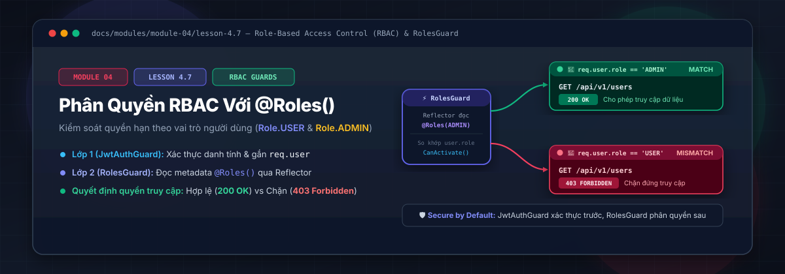
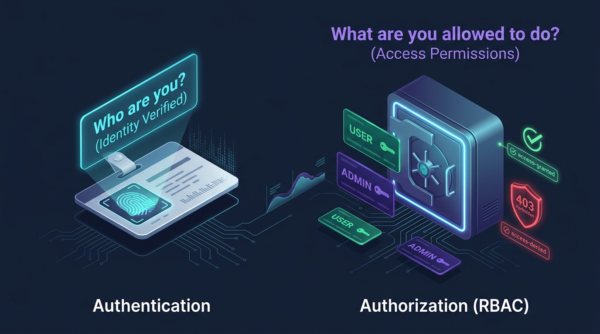
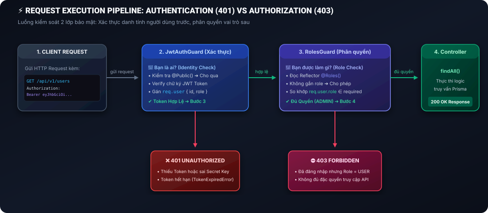

# Lesson 4.7: Role-Based Access Control (RBAC) — Phân Quyền Người Dùng Với @Roles() & RolesGuard Trong NestJS

<p align="center">
  
  
  
  
  
  
</p>

<p align="center">
  
</p>

---

> [!NOTE]
> ⏱️ **Thời lượng dự kiến:** 12 – 15 phút  
> 🎯 **Mục tiêu bài học:**
>
> - Phân biệt rạch ròi giữa hai khái niệm nền tảng trong bảo mật ứng dụng: **Authentication (Xác thực danh tính - 401 Unauthorized)** và **Authorization (Phân quyền truy cập - 403 Forbidden)**.
> - Hiểu rõ bản chất mô hình **RBAC (Role-Based Access Control)** dựa trên trường `role` (`Role.USER` / `Role.ADMIN`) đã định nghĩa trong Prisma Schema.
> - Xây dựng Custom Route Decorator **`@Roles(...roles: Role[])`** sử dụng `SetMetadata` với kiểu dữ liệu an toàn Type-Safe 100%.
> - Triển khai **`RolesGuard`** với interface `CanActivate`, phối hợp cùng **`Reflector`** để trích xuất metadata từ Handler (Method) và Controller (Class).
> - Thấu hiểu cơ chế hoạt động của **Guard Execution Chain**: Vì sao `JwtAuthGuard` bắt buộc phải chạy trước để đính kèm `request.user`, sau đó `RolesGuard` mới thẩm định quyền hạn.
> - Đăng ký `RolesGuard` toàn cục qua token **`APP_GUARD`** trong `AppModule`.
> - Thực hành khóa API `GET /users` chỉ dành riêng cho Quản trị viên (`ADMIN`) và kiểm thử bằng kịch bản cURL thực tế.

---

## 1. Bản Chất Authorization & Phân Biệt 401 Unauthorized vs 403 Forbidden

Trong bài học trước (Lesson 4.6), chúng ta đã xây dựng thành công **Global `JwtAuthGuard`**. Bất kỳ request nào gửi lên hệ thống đều phải xuất trình JWT Access Token hợp lệ, nếu không sẽ bị chặn ngay lập tức.

Tuy nhiên, việc biết được **"Bạn là ai?" (Authentication)** chỉ là bước khởi đầu. Một hệ thống thực tế luôn có sự phân cấp người dùng:

- Người dùng thông thường (`USER`) chỉ được phép xem thông tin cá nhân, đăng bài viết hoặc bình luận.
- Quản trị viên (`ADMIN`) có toàn quyền xem danh sách tất cả tài khoản, khóa người dùng hoặc xóa bài viết vi phạm.

Nếu chỉ có `JwtAuthGuard`, một người dùng có vai trò `USER` khi đã đăng nhập vẫn có thể gọi API quản trị nhạy cảm `GET /api/v1/users`! Đó là lý do chúng ta cần đến **Authorization (Phân quyền)**.

<p align="center">
  
</p>

### ⚖️ Phân Biệt Nhanh: 401 Unauthorized vs 403 Forbidden

- **`401 Unauthorized` (Authentication — Xác thực danh tính):** Xảy ra khi request **chưa xác minh được danh tính** người gửi (thiếu Bearer Token, token sai chữ ký hoặc đã hết hạn). Trách nhiệm xử lý thuộc về `JwtAuthGuard`.
- **`403 Forbidden` (Authorization — Phân quyền truy cập):** Xảy ra khi danh tính người dùng **đã được xác thực thành công**, nhưng tài khoản **không đủ quyền hạn / vai trò** để truy cập tài nguyên yêu cầu. Trách nhiệm xử lý thuộc về `RolesGuard`.

---

## 2. Kiến Trúc Request Pipeline & Luồng Hoạt Động Của RolesGuard

Trong kiến trúc NestJS, **Guards** là các lớp triển khai interface `CanActivate`. Khi một HTTP Request được gửi đến, NestJS sẽ thực thi Guards sau giai đoạn Middlewares và trước Interceptors / Pipes / Controller Handler.

Khi tích hợp cả hai lớp bảo vệ, thứ tự thực thi của Guard mang tính **sống còn**:

<p align="center">
  
</p>

> [!IMPORTANT]
> **Quy tắc bất biến:** `JwtAuthGuard` **BẮT BUỘC** phải chạy trước `RolesGuard`. Vì nếu `RolesGuard` chạy trước, `request.user` vẫn còn giá trị `undefined`, dẫn đến việc không thể xác định được vai trò của người dùng và luôn trả về lỗi!

---

## 3. Hướng Dẫn Triển Khai Step-by-Step (Hands-on Implementation)

Chúng ta sẽ triển khai hệ thống phân quyền RBAC chuẩn NestJS Enterprise theo từng bước rõ ràng.

### Bước 1: Khai Báo Metadata Key Cho Roles

Trong tệp chứa các hằng số metadata, chúng ta bổ sung khóa `ROLES_KEY` để định danh dữ liệu phân quyền được lưu trữ bởi NestJS `Reflector`:

📄 **`src/shared/constants/metadata.constant.ts`**

```typescript
export const RESPONSE_MESSAGE_KEY = 'RESPONSE_MESSAGE_KEY';
export const BYPASS_TRANSFORM_KEY = 'BYPASS_TRANSFORM_KEY';
export const IS_PUBLIC_KEY = 'IS_PUBLIC_KEY';
export const ROLES_KEY = 'ROLES_KEY'; // 🔑 Khóa metadata lưu trữ vai trò được phép truy cập
```

---

### Bước 2: Tạo Custom Decorator `@Roles()`

Để gán nhãn vai trò được phép truy cập lên các API Endpoint một cách tự nhiên và sạch sẽ, chúng ta tạo Custom Decorator `@Roles()` sử dụng hàm `SetMetadata` của `@nestjs/common`.

Đặc biệt, chúng ta tận dụng enum `Role` từ Prisma Client để đảm bảo tính an toàn kiểu dữ liệu (**Type-Safety 100%**), ngăn chặn hoàn toàn việc gõ sai chuỗi ký tự (như `'admin'` thay vì `'ADMIN'`):

📄 **`src/shared/decorators/roles.decorator.ts`**

```typescript
import { SetMetadata } from '@nestjs/common';
import { Role } from '@/generated/prisma/enums';
import { ROLES_KEY } from '../constants/metadata.constant';

/**
 * 🏷️ Decorator @Roles() dùng để khai báo các vai trò được phép truy cập Route
 * Hỗ trợ truyền 1 hoặc nhiều vai trò:
 * @example @Roles(Role.ADMIN)
 * @example @Roles(Role.ADMIN, Role.USER)
 */
export const Roles = (...roles: Role[]) => SetMetadata(ROLES_KEY, roles);
```

> [!TIP]
> Bằng cách sử dụng toán tử Rest Parameter `...roles: Role[]`, decorator cho phép bạn truyền vào một hoặc nhiều vai trò cùng lúc: `@Roles(Role.ADMIN)` hoặc `@Roles(Role.ADMIN, Role.USER)`.

---

### Bước 3: Xây Dựng `RolesGuard` Thẩm Định Quyền Hạn

Bây giờ, chúng ta tạo lớp bảo vệ `RolesGuard`. Guard này sẽ:

1. Sử dụng `Reflector.getAllAndOverride()` để đọc mảng `requiredRoles` gắn trên route.
2. Kiểm tra `request.user` do `JwtAuthGuard` cung cấp.
3. So khớp vai trò của user với danh sách cho phép.

📄 **`src/auth/guards/roles.guard.ts`**

```typescript
import {
  CanActivate,
  ExecutionContext,
  ForbiddenException,
  Injectable,
} from '@nestjs/common';
import { Reflector } from '@nestjs/core';
import { Role } from '@/generated/prisma/enums';
import { ROLES_KEY } from '@/shared/constants/metadata.constant';
import { UserData } from '../interfaces/jwt.interface';

@Injectable()
export class RolesGuard implements CanActivate {
  constructor(private readonly reflector: Reflector) {}

  canActivate(context: ExecutionContext): boolean {
    // 1. Trích xuất metadata vai trò yêu cầu từ Handler (Method) và Class (Controller)
    const requiredRoles = this.reflector.getAllAndOverride<Role[]>(ROLES_KEY, [
      context.getHandler(),
      context.getClass(),
    ]);

    // 2. Nếu route không khai báo @Roles(), mặc định cho phép truy cập (Dành cho mọi user đã login)
    if (!requiredRoles || requiredRoles.length === 0) {
      return true;
    }

    // 3. Trích xuất thông tin user từ request (đã được JwtAuthGuard giải mã và đính kèm)
    const request = context.switchToHttp().getRequest<{ user?: UserData }>();
    const user = request.user;

    // 4. Nếu không tìm thấy thông tin user hoặc user không có vai trò hợp lệ
    if (!user || !user.role) {
      throw new ForbiddenException(
        'Bạn không có quyền truy cập vào tài nguyên này!',
      );
    }

    // 5. Kiểm tra xem vai trò của user có nằm trong danh sách requiredRoles hay không
    const hasRole = requiredRoles.includes(user.role);
    if (!hasRole) {
      throw new ForbiddenException(
        'Bạn không có quyền truy cập vào tài nguyên này!',
      );
    }

    return true;
  }
}
```

#### 💡 Vì Sao Sử Dụng `reflector.getAllAndOverride()`?

Phương thức `getAllAndOverride()` nhận vào một mảng chứa 2 mục tiêu: `context.getHandler()` (Hàm xử lý cụ thể) và `context.getClass()` (Lớp Controller):

- Nếu bạn gắn `@Roles(Role.USER)` ở cấp độ Class Controller, nhưng trên một hàm nhạy cảm lại gắn `@Roles(Role.ADMIN)`, hàm `getAllAndOverride` sẽ ưu tiên lấy cấu hình chặt chẽ hơn tại cấp Handler để ghi đè (override) cấu hình chung của Class.

---

### Bước 4: Đăng Ký `RolesGuard` Toàn Cục Với `APP_GUARD`

Để không phải viết `@UseGuards(RolesGuard)` lặp đi lặp lại ở từng Controller, chúng ta đăng ký `RolesGuard` thành **Global Guard** bằng token `APP_GUARD` trong `AppModule`.

Khi đăng ký qua `APP_GUARD`, NestJS sẽ tự động giải quyết các Dependency cần thiết (như `Reflector`) và áp dụng cho toàn bộ dự án.

📄 **`src/app.module.ts`**

```typescript
import { MiddlewareConsumer, Module, RequestMethod } from '@nestjs/common';
import { AppController } from './app.controller';
import { AppService } from './app.service';
import { ConfigModule } from '@nestjs/config';
import { envValidationSchema } from './config/env.validation';
import { PrismaModule } from './prisma/prisma.module';
import { UsersModule } from './users/users.module';
import { PostsModule } from './posts/posts.module';
import { APP_FILTER, APP_GUARD, APP_INTERCEPTOR } from '@nestjs/core';
import { PrismaClientExceptionFilter } from './shared/filters/prisma-client-exception.filter';
import { LoggerMiddleware } from './shared/middleware/logger.middleware';
import { HttpExceptionFilter } from './shared/filters/http-exception.filter';
import { TransformInterceptor } from './shared/interceptors/transform.interceptor';
import { SharedServiceModule } from './shared/services/shared-service.module';
import { AuthModule } from './auth/auth.module';
import { JwtAuthGuard } from './auth/guards/jwt-auth.guard';
import { RolesGuard } from './auth/guards/roles.guard';

@Module({
  imports: [
    ConfigModule.forRoot({
      validationSchema: envValidationSchema,
      isGlobal: true,
    }),
    PrismaModule,
    SharedServiceModule,
    UsersModule,
    PostsModule,
    AuthModule,
  ],
  controllers: [AppController],
  providers: [
    AppService,
    {
      provide: APP_FILTER,
      useClass: PrismaClientExceptionFilter,
    },
    {
      provide: APP_FILTER,
      useClass: HttpExceptionFilter,
    },
    {
      provide: APP_INTERCEPTOR,
      useClass: TransformInterceptor,
    },
    // 🔒 1. Xác thực danh tính: Kiểm tra JWT Token trước
    {
      provide: APP_GUARD,
      useClass: JwtAuthGuard,
    },
    // 🛡️ 2. Phân quyền truy cập: Kiểm tra quyền hạn vai trò sau
    {
      provide: APP_GUARD,
      useClass: RolesGuard,
    },
  ],
  exports: [],
})
export class AppModule {
  configure(consumer: MiddlewareConsumer) {
    consumer
      .apply(LoggerMiddleware)
      .exclude({
        path: 'health',
        method: RequestMethod.GET,
      })
      .forRoutes('{*path}');
  }
}
```

> [!CAUTION]
> **Quy Tắc Thứ Tự Providers:** NestJS duyệt mảng `providers` theo thứ tự từ trên xuống dưới. Vì vậy `JwtAuthGuard` **bắt buộc** phải được đặt trước `RolesGuard`!

---

### Bước 5: Áp Dụng Phân Quyền Trong `UsersController`

Bây giờ hệ thống bảo mật đã hoàn chỉnh. Hãy bảo vệ API `GET /users` (Lấy danh sách tất cả người dùng):

- Chỉ người dùng có vai trò `Role.ADMIN` mới có thể gọi API này.
- API `getProfile` không gắn `@Roles()` nên bất kỳ người dùng nào đã đăng nhập (`USER` hoặc `ADMIN`) đều có thể truy cập thông tin của bản thân.

📄 **`src/users/users.controller.ts`**

```typescript
import { Body, Controller, Get, Post } from '@nestjs/common';
import { UsersService } from './users.service';
import { CreateUserDto } from './dto/create-user.dto';
import { type UserData } from '@/auth/interfaces/jwt.interface';
import { CurrentUser } from '@/shared/decorators/current-user.decorator';
import { Roles } from '@/shared/decorators/roles.decorator';
import { Role } from '@/generated/prisma/enums';

@Controller('users')
export class UsersController {
  constructor(private readonly usersService: UsersService) {}

  // 👑 Phân quyền: CHỈ Quản trị viên (ADMIN) mới được phép xem danh sách người dùng!
  @Roles(Role.ADMIN)
  @Get()
  findAll() {
    return this.usersService.findAll();
  }

  @Post()
  createUser(@Body() body: CreateUserDto) {
    return this.usersService.create(body);
  }

  // 👤 Mọi tài khoản đã đăng nhập (USER lẫn ADMIN) đều có thể xem hồ sơ cá nhân của mình
  @Get('profile')
  getProfile(@CurrentUser() userData: UserData) {
    return {
      message: 'Xác thực tài khoản thành công qua NativeAuthGuard!',
      user: userData,
    };
  }
}
```

---

## 4. Kịch Bản Kiểm Tra & Thử Nghiệm (Hands-on Lab)

Để kiểm chứng hệ thống phân quyền hoạt động chuẩn xác, chúng ta tiến hành kiểm thử thông qua 3 kịch bản thực tế với lệnh cURL.

Hãy khởi chạy máy chủ NestJS:

```bash
pnpm run start:dev
```

---

### 🟢 Kịch Bản 1: Đăng Nhập Tài Khoản ADMIN & Truy Cập Thành Công (200 OK)

Giả sử trong database chúng ta có tài khoản quản trị viên `admin@example.com` với vai trò `role: ADMIN`.

#### 1. Đăng nhập để lấy Access Token của ADMIN:

```bash
curl -X POST http://localhost:3000/api/v1/auth/login \
  -H "Content-Type: application/json" \
  -d '{
    "email": "admin@example.com",
    "password": "Password123@"
  }'
```

📥 **Phản hồi nhận được Access Token:**

```json
{
  "statusCode": 200,
  "message": "Đăng nhập thành công!",
  "data": {
    "accessToken": "eyJhbGciOiJIUzI1NiIsInR5cCI6IkpXVCJ9.eyJzdWIiOjEsImVtYWlsIjoiYWRtaW5AZXhhbXBsZS5jb20iLCJyb2xlIjoiQURNSU4iLCJpYXQiOjE3Mzg1MTE2MDB9...",
    "user": {
      "id": 1,
      "email": "admin@example.com",
      "role": "ADMIN"
    }
  }
}
```

#### 2. Dùng Token của ADMIN gọi API `GET /api/v1/users`:

```bash
curl -X GET http://localhost:3000/api/v1/users \
  -H "Authorization: Bearer <ADMIN_ACCESS_TOKEN>"
```

📥 **Kết quả (`200 OK`):**

```json
{
  "statusCode": 200,
  "message": "Thực hiện thành công",
  "data": [
    {
      "id": 1,
      "email": "admin@example.com",
      "name": "Super Admin",
      "role": "ADMIN"
    },
    {
      "id": 2,
      "email": "user@example.com",
      "name": "Normal User",
      "role": "USER"
    }
  ],
  "timestamp": "2026-09-30T11:45:00.000Z"
}
```

✅ **Kết luận:** Quản trị viên mang vai trò `ADMIN` khớp với `@Roles(Role.ADMIN)`, `RolesGuard` cho phép vượt qua và lấy danh sách thành công!

---

### 🔴 Kịch Bản 2: Tài Khoản USER Thường Cố Tình Gọi API ADMIN (Bị Chặn 403 Forbidden)

Bây giờ, chúng ta đăng nhập bằng tài khoản người dùng thông thường `user@example.com` có `role: USER`.

#### 1. Đăng nhập lấy Token của USER:

```bash
curl -X POST http://localhost:3000/api/v1/auth/login \
  -H "Content-Type: application/json" \
  -d '{
    "email": "user@example.com",
    "password": "Password123@"
  }'
```

#### 2. Dùng Token của USER cố tình gọi API Quản trị `GET /api/v1/users`:

```bash
curl -X GET http://localhost:3000/api/v1/users \
  -H "Authorization: Bearer <USER_ACCESS_TOKEN>"
```

📥 **Phản hồi nhận được (`403 Forbidden`) thông qua `HttpExceptionFilter`:**

```json
{
  "statusCode": 403,
  "message": "Bạn không có quyền truy cập vào tài nguyên này!",
  "error": "Forbidden",
  "timestamp": "2026-09-30T11:46:15.000Z",
  "path": "/api/v1/users"
}
```

✅ **Kết luận:** `JwtAuthGuard` xác thực thành công (Token hợp lệ), nhưng `RolesGuard` phát hiện `user.role === 'USER'` không nằm trong `@Roles(Role.ADMIN)`. Lập tức bắn ra `ForbiddenException` và chặn đứng truy cập trái phép!

---

### 🔴 Kịch Bản 3: Request Không Gửi Token (Bị Chặn 401 Unauthorized Ngay Vòng Gửi Xe)

Thử gọi API `GET /api/v1/users` nhưng hoàn toàn không gửi kèm Bearer Token:

```bash
curl -X GET http://localhost:3000/api/v1/users
```

📥 **Phản hồi nhận được (`401 Unauthorized`):**

```json
{
  "statusCode": 401,
  "message": "Bạn cần đăng nhập (gửi kèm Bearer Token) để truy cập tài nguyên này!",
  "error": "Unauthorized",
  "timestamp": "2026-09-30T11:47:00.000Z",
  "path": "/api/v1/users"
}
```

✅ **Kết luận:** Yêu cầu bị `JwtAuthGuard` từ chối ngay tại lớp số 1. `RolesGuard` thậm chí không cần phải chạy, giúp tiết kiệm chu kỳ xử lý của CPU máy chủ!

---

## 5. Mở Rộng: Kỹ Thuật Phân Quyền Chuyên Sâu Trong Dự Án Lớn

### 🎯 1. Áp Dụng `@Roles()` Ở Cấp Độ Controller (Class-Level)

Nếu bạn có một Controller dành riêng cho quản trị (ví dụ `AdminController`), thay vì phải gắn `@Roles(Role.ADMIN)` ở từng phương thức, bạn có thể đặt trực tiếp trên khai báo Class:

```typescript
@Roles(Role.ADMIN) // 🔒 Toàn bộ routes bên trong controller này đều yêu cầu quyền ADMIN
@Controller('admin')
export class AdminController {
  @Get('dashboard')
  getDashboard() { ... }

  @Delete('users/:id')
  deleteUser() { ... }
}
```

### 🎯 2. Decorator Composition: Tạo `@AdminOnly()`

Để code ngắn gọn và dễ bảo trì hơn, chúng ta có thể kết hợp các decorators bằng `applyDecorators`:

📄 **`src/shared/decorators/admin-only.decorator.ts`**

```typescript
import { applyDecorators } from '@nestjs/common';
import { Role } from '@/generated/prisma/enums';
import { Roles } from './roles.decorator';

export function AdminOnly() {
  return applyDecorators(Roles(Role.ADMIN));
}
```

Sử dụng trực tiếp trong Controller:

```typescript
@AdminOnly()
@Get('statistics')
getStats() {
  return this.usersService.getStats();
}
```

---

## 6. Tổng Kết Bài Học & Checklist Ghi Nhớ

```mermaid
mindmap
  root(("Phân Quyền RBAC Trong NestJS"))
    "Authentication vs Authorization"
      "401 Unauthorized: Chưa xác thực danh tính"
      "403 Forbidden: Không đủ quyền hạn vai trò"
    "Cấu Trúc Triển Khai"
      "Prisma Enum: Role.USER & Role.ADMIN"
      "ROLES_KEY metadata constant"
      "Custom Decorator: @Roles(...roles: Role[])"
      "RolesGuard với CanActivate & Reflector"
    "Cơ Chế Thực Thi Guard Chain"
      "JwtAuthGuard chạy trước giải mã token"
      "request.user được nạp sẵn userId & role"
      "RolesGuard chạy sau kiểm tra quyền"
      "Đăng ký Global Guard bằng APP_GUARD"
```

### ✅ Checklist Ghi Nhớ Bài Học:

- [x] Hiểu sâu sự khác biệt bản chất giữa **Authentication (401)** và **Authorization (403)**.
- [x] Nắm rõ cấu trúc vai trò người dùng thông qua **Prisma Enum `Role`** (`USER`, `ADMIN`).
- [x] Tự tay tạo **`ROLES_KEY`** và Custom Route Decorator **`@Roles()`** chuẩn Type-Safe.
- [x] Triển khai **`RolesGuard`** sử dụng `Reflector.getAllAndOverride()` để đọc metadata ở cả cấp Method và Class.
- [x] Thấu hiểu lý do vì sao **`JwtAuthGuard` phải được đăng ký trước `RolesGuard`** trong mảng `providers` của `AppModule`.
- [x] Áp dụng thành công `@Roles(Role.ADMIN)` để bảo vệ API danh sách người dùng `GET /users`.
- [x] Kiểm thử thực tế thành công cả 3 kịch bản qua cURL: ADMIN truy cập (200 OK), USER bị chặn (403 Forbidden), và Không gửi token (401 Unauthorized).

---

👉 **Bài tiếp theo:** [Lesson 4.8: Rate Limiting — Giới Hạn Lượt Gọi Request Với @nestjs/throttler Trong NestJS](../lesson-4.8/lesson-4.8.md)
