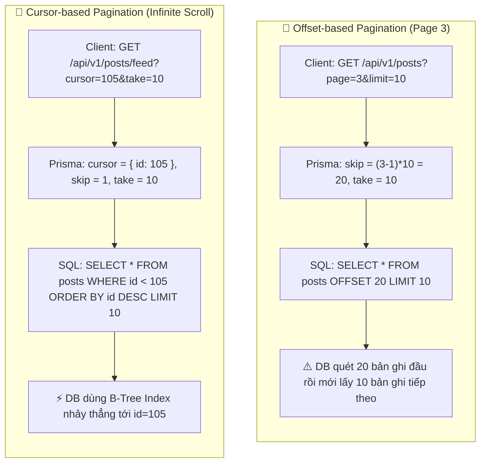
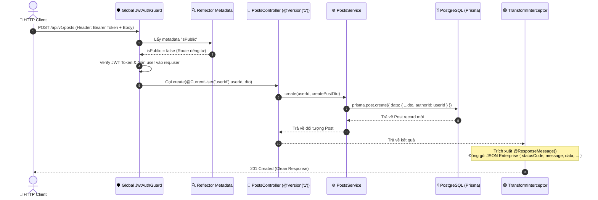

# Lesson 5.1: Posts API — CRUD Bài Viết & Phân Trang Cursor/Offset Trong NestJS

<p align="center">
  
  
  
  
  
</p>

<p align="center">
  
</p>

---

> [!NOTE]
> ⏱️ **Thời lượng dự kiến:** 12 – 15 phút  
> 🎯 **Mục tiêu bài học:** Nắm vững cách xây dựng bộ API CRUD quản lý Bài viết (`Post`) liên kết với Tác giả (`User`); phân tích chuyên sâu kỹ thuật **Offset-based Pagination** (Trang/Giới hạn) và **Cursor-based Pagination** (Con trỏ/Cuộn vô tận); làm chủ cách viết Prisma Queries tối ưu, chuẩn hóa DTOs Validation với `class-validator`, đồng bộ các chuẩn mực Request Pipeline đã học: URI Versioning (`@Version('1')`), Chuẩn hóa JSON Response (`@ResponseMessage()`), bypass bảo mật (`@Public()`) và trích xuất thông tin người dùng Type-Safe bằng (`@CurrentUser('userId')`).

---

## 1. Tổng Quan CRUD Posts & Chiến Lược Phân Trang (Pagination Strategy)

### 💡 Ẩn Dụ Thực Tế: Danh Sách Bài Đăng Trên Mạng Xã Hội (Social Feed)

Trong các ứng dụng như Facebook, LinkedIn hay Twitter/X, mỗi ngày có hàng triệu bài đăng mới được xuất bản. Nếu backend trả về toàn bộ danh sách bài viết trong một câu lệnh `SELECT * FROM posts`, hệ thống sẽ gặp các vấn đề nghiêm trọng:

1. **Tràn bộ nhớ (Out of Memory - OOM):** Truy vấn hàng trăm nghìn bản ghi ngốn băng thông và RAM của Server.
2. **Trải nghiệm người dùng kém (Slow Latency):** Mobile App hoặc Frontend phải đợi vài giây chỉ để hiển thị 10 bài viết đầu tiên.

Để giải quyết vấn đề này, chúng ta bắt buộc phải áp dụng **Kỹ thuật Phân trang (Pagination)**. Có 2 chiến lược phân trang phổ biến nhất trong phát triển ứng dụng hiện đại:

---

### 🔹 So Sánh Chi Tiết: Offset-based vs Cursor-based Pagination

| Tiêu chí                    | Offset-based Pagination (Phân Trang Trang)                                                                           | Cursor-based Pagination (Phân Trang Con Trỏ)                                                |
| :-------------------------- | :------------------------------------------------------------------------------------------------------------------- | :------------------------------------------------------------------------------------------ |
| **Cú pháp Query**           | `page=3&limit=10` (`skip: 20, take: 10`)                                                                             | `cursor=105&take=10` (`cursor: { id: 105 }, take: 10`)                                      |
| **Câu lệnh SQL**            | `SELECT * FROM posts OFFSET 20 LIMIT 10;`                                                                            | `SELECT * FROM posts WHERE id < 105 ORDER BY id DESC LIMIT 10;`                             |
| **Hiệu năng (Performance)** | **Chậm O(N)** khi `OFFSET` lớn (Database phải quét qua tất cả bản ghi trước đó).                                     | **Siêu nhanh O(1)** nhờ tận dụng Index B-Tree (`WHERE id < cursor`).                        |
| **Vấn đề Data Drift**       | **Dễ bị trùng hoặc bỏ sót:** Nếu có ai đó đăng bài mới ở Page 1, toàn bộ dữ liệu ở Page 2 sẽ bị đẩy lùi sang Page 3. | **Nhất quán 100%:** Con trỏ (`cursor`) đánh dấu chính xác vị trí bài viết cuối cùng đã xem. |
| **Trường hợp sử dụng**      | Trang Quản trị (Admin Dashboard), Danh sách có nút chuyển trang (`1, 2, 3... N`).                                    | Bảng tin Mạng xã hội (Newsfeed), Cuộn vô tận (Infinite Scroll), Real-time Chat.             |



---

## 2. Đồng Bộ Kiến Trúc Request Pipeline & Standard Response Format

Để bài viết kế thừa toàn bộ các công cụ chuẩn hóa đã xây dựng từ **Module 3 & Module 4**, luồng xử lý bài viết tuân theo Request Pipeline thống nhất:

1. **Global `JwtAuthGuard` (Module 4):** Mặc định bảo vệ tất cả API. Các API xem danh sách (`GET /posts`, `GET /posts/feed`, `GET /posts/:id`) dùng trang trí `@Public()` để cho phép truy cập công khai.
2. **Custom Decorator `@CurrentUser('userId')` (Module 4):** Trích xuất trực tiếp `userId` dạng số nguyên từ `req.user` mà không cần dùng `@Request() req: any`.
3. **API Versioning `@Version('1')` (Module 3):** Định tuyến URL theo chuẩn `/api/v1/posts`.
4. **Custom Decorator `@ResponseMessage()` & `TransformInterceptor` (Module 3):** Đóng gói thành công thành định dạng JSON Enterprise: `{ statusCode, message, data, timestamp, path }`.



---

## 3. Hướng Dẫn Thực Hành Step-by-Step — Triển Khai Posts Module

### 📌 Bước 1: Khởi Tạo DTOs Cho Posts Module

Tạo các tệp DTO quy định dữ liệu đầu vào trong thư mục `src/posts/dto/`:

📄 **`src/posts/dto/create-post.dto.ts`**

```typescript
import {
  IsBoolean,
  IsNotEmpty,
  IsOptional,
  IsString,
  MinLength,
} from 'class-validator';

export class CreatePostDto {
  @IsString({ message: 'Tiêu đề bài viết phải là chuỗi ký tự' })
  @IsNotEmpty({ message: 'Tiêu đề bài viết không được để trống' })
  @MinLength(5, { message: 'Tiêu đề bài viết phải có ít nhất 5 ký tự' })
  title: string;

  @IsString({ message: 'Nội dung bài viết phải là chuỗi ký tự' })
  @IsNotEmpty({ message: 'Nội dung bài viết không được để trống' })
  content: string;

  @IsOptional()
  @IsBoolean({ message: 'Trạng thái xuất bản phải là kiểu boolean' })
  published?: boolean;
}
```

📄 **`src/posts/dto/update-post.dto.ts`**

```typescript
import { PartialType } from '@nestjs/mapped-types';
import { CreatePostDto } from './create-post.dto';

export class UpdatePostDto extends PartialType(CreatePostDto) {}
```

📄 **`src/posts/dto/query-post.dto.ts`**

```typescript
import { Type } from 'class-transformer';
import { IsInt, IsOptional, IsString, Max, Min } from 'class-validator';

export class QueryPostDto {
  // --- Offset-based Pagination Params ---
  @IsOptional()
  @Type(() => Number)
  @IsInt({ message: 'Số trang page phải là số nguyên' })
  @Min(1, { message: 'Số trang tối thiểu là 1' })
  page?: number = 1;

  @IsOptional()
  @Type(() => Number)
  @IsInt({ message: 'Số lượng bản ghi limit phải là số nguyên' })
  @Min(1, { message: 'Số lượng bản ghi tối thiểu là 1' })
  @Max(100, { message: 'Tối đa 100 bản ghi trên 1 trang' })
  limit?: number = 10;

  // --- Cursor-based Pagination Params ---
  @IsOptional()
  @Type(() => Number)
  @IsInt({ message: 'Cursor phải là ID của bài viết dạng số nguyên' })
  cursor?: number;

  @IsOptional()
  @Type(() => Number)
  @IsInt({ message: 'Take phải là số nguyên' })
  @Min(1)
  @Max(100)
  take?: number = 10;

  // --- Search & Filter ---
  @IsOptional()
  @IsString()
  search?: string;
}
```

---

### 📌 Bước 2: Triển Khai `PostsService` Tương Tác CSDL Qua Prisma

Tạo tệp service xử lý toàn bộ nghiệp vụ CRUD và hai thuật toán phân trang:

📄 **`src/posts/posts.service.ts`**

```typescript
import {
  ForbiddenException,
  Injectable,
  NotFoundException,
} from '@nestjs/common';
import { PrismaService } from '../prisma/prisma.service';
import { CreatePostDto } from './dto/create-post.dto';
import { QueryPostDto } from './dto/query-post.dto';
import { UpdatePostDto } from './dto/update-post.dto';

@Injectable()
export class PostsService {
  constructor(private readonly prisma: PrismaService) {}

  // 1. Tạo bài viết mới
  async create(authorId: number, createPostDto: CreatePostDto) {
    return this.prisma.post.create({
      data: {
        ...createPostDto,
        authorId,
      },
      include: {
        author: {
          select: { id: true, email: true, name: true },
        },
      },
    });
  }

  // 2. Phân trang dạng Offset-based (Dùng cho Trang Admin / Web Table)
  async findAllOffset(query: QueryPostDto) {
    const { page = 1, limit = 10, search } = query;
    const skip = (page - 1) * limit;

    const where = search
      ? {
          OR: [
            { title: { contains: search, mode: 'insensitive' as const } },
            { content: { contains: search, mode: 'insensitive' as const } },
          ],
        }
      : {};

    const [items, totalItems] = await Promise.all([
      this.prisma.post.findMany({
        where,
        skip,
        take: limit,
        orderBy: { createdAt: 'desc' },
        include: {
          author: {
            select: { id: true, email: true, name: true },
          },
        },
      }),
      this.prisma.post.count({ where }),
    ]);

    const totalPages = Math.ceil(totalItems / limit);

    return {
      items,
      meta: {
        page,
        limit,
        totalItems,
        totalPages,
        hasNextPage: page < totalPages,
        hasPreviousPage: page > 1,
      },
    };
  }

  // 3. Phân trang dạng Cursor-based (Dùng cho Mobile App / Infinite Scroll Feed)
  async findAllCursor(query: QueryPostDto) {
    const { cursor, take = 10, search } = query;

    const where = search
      ? {
          OR: [
            { title: { contains: search, mode: 'insensitive' as const } },
            { content: { contains: search, mode: 'insensitive' as const } },
          ],
        }
      : {};

    const items = await this.prisma.post.findMany({
      where,
      take: take + 1, // Lấy dư 1 phần tử để kiểm tra hasNextPage
      ...(cursor ? { cursor: { id: cursor }, skip: 1 } : {}),
      orderBy: { id: 'desc' },
      include: {
        author: {
          select: { id: true, email: true, name: true },
        },
      },
    });

    let hasNextPage = false;
    if (items.length > take) {
      hasNextPage = true;
      items.pop(); // Loại bỏ phần tử dư thừa
    }

    const nextCursor = items.length > 0 ? items[items.length - 1].id : null;

    return {
      items,
      meta: {
        take,
        nextCursor,
        hasNextPage,
      },
    };
  }

  // 4. Lấy chi tiết bài viết theo ID
  async findOne(id: number) {
    const post = await this.prisma.post.findUnique({
      where: { id },
      include: {
        author: { select: { id: true, email: true, name: true } },
        comments: {
          select: { id: true, content: true, createdAt: true, authorId: true },
          orderBy: { createdAt: 'desc' },
        },
      },
    });

    if (!post) {
      throw new NotFoundException(`Không tìm thấy bài viết với ID #${id}`);
    }

    return post;
  }

  // 5. Cập nhật bài viết (Chỉ chính chủ tác giả mới được cập nhật)
  async update(id: number, userId: number, updatePostDto: UpdatePostDto) {
    const post = await this.findOne(id);

    if (post.authorId !== userId) {
      throw new ForbiddenException('Bạn không có quyền chỉnh sửa bài viết này');
    }

    return this.prisma.post.update({
      where: { id },
      data: updatePostDto,
      include: {
        author: { select: { id: true, email: true, name: true } },
      },
    });
  }

  // 6. Xóa bài viết (Chỉ chính chủ tác giả mới được xóa)
  async remove(id: number, userId: number) {
    const post = await this.findOne(id);

    if (post.authorId !== userId) {
      throw new ForbiddenException('Bạn không có quyền xóa bài viết này');
    }

    await this.prisma.post.delete({ where: { id } });

    return { id };
  }
}
```

---

### 📌 Bước 3: Triển Khai `PostsController` Đồng Bộ Các Custom Decorators

Tạo tệp controller áp dụng chuẩn mực `@Version('1')`, `@ResponseMessage()`, `@Public()`, và `@CurrentUser('userId')`:

📄 **`src/posts/posts.controller.ts`**

```typescript
import {
  Body,
  Controller,
  Delete,
  Get,
  HttpCode,
  HttpStatus,
  Param,
  ParseIntPipe,
  Patch,
  Post,
  Query,
  Version,
} from '@nestjs/common';
import { CurrentUser } from '../common/decorators/current-user.decorator';
import { Public } from '../common/decorators/public.decorator';
import { ResponseMessage } from '../common/decorators/response-message.decorator';
import { CreatePostDto } from './dto/create-post.dto';
import { QueryPostDto } from './dto/query-post.dto';
import { UpdatePostDto } from './dto/update-post.dto';
import { PostsService } from './posts.service';

@Controller('posts')
export class PostsController {
  constructor(private readonly postsService: PostsService) {}

  // 1. POST /posts — Tạo bài viết mới (Mặc định riêng tư: Cần JWT Access Token)
  @Version('1')
  @Post()
  @HttpCode(HttpStatus.CREATED)
  @ResponseMessage('Tạo bài viết mới thành công!')
  create(
    @CurrentUser('userId') userId: number,
    @Body() createPostDto: CreatePostDto,
  ) {
    return this.postsService.create(userId, createPostDto);
  }

  // 2. GET /posts — Lấy danh sách bài viết phân trang Offset (Public API)
  @Public()
  @Version('1')
  @Get()
  @ResponseMessage('Lấy danh sách bài viết phân trang thành công!')
  findAllOffset(@Query() query: QueryPostDto) {
    return this.postsService.findAllOffset(query);
  }

  // 3. GET /posts/feed — Lấy newsfeed cuộn vô tận phân trang Cursor (Public API)
  @Public()
  @Version('1')
  @Get('feed')
  @ResponseMessage('Lấy newsfeed cuộn vô tận thành công!')
  findAllCursor(@Query() query: QueryPostDto) {
    return this.postsService.findAllCursor(query);
  }

  // 4. GET /posts/:id — Xem chi tiết bài viết (Public API)
  @Public()
  @Version('1')
  @Get(':id')
  @ResponseMessage('Lấy thông tin chi tiết bài viết thành công!')
  findOne(@Param('id', ParseIntPipe) id: number) {
    return this.postsService.findOne(id);
  }

  // 5. PATCH /posts/:id — Chỉnh sửa bài viết (Mặc định riêng tư & Kiểm tra chính chủ)
  @Version('1')
  @Patch(':id')
  @ResponseMessage('Cập nhật bài viết thành công!')
  update(
    @Param('id', ParseIntPipe) id: number,
    @CurrentUser('userId') userId: number,
    @Body() updatePostDto: UpdatePostDto,
  ) {
    return this.postsService.update(id, userId, updatePostDto);
  }

  // 6. DELETE /posts/:id — Xóa bài viết (Mặc định riêng tư & Kiểm tra chính chủ)
  @Version('1')
  @Delete(':id')
  @ResponseMessage('Xóa bài viết thành công!')
  remove(
    @Param('id', ParseIntPipe) id: number,
    @CurrentUser('userId') userId: number,
  ) {
    return this.postsService.remove(id, userId);
  }
}
```

---

### 📌 Bước 4: Đăng Ký `PostsModule`

Đóng gói và khai báo `PostsModule` trong hệ thống:

📄 **`src/posts/posts.module.ts`**

```typescript
import { Module } from '@nestjs/common';
import { PostsService } from './posts.service';
import { PostsController } from './posts.controller';

@Module({
  controllers: [PostsController],
  providers: [PostsService],
  exports: [PostsService],
})
export class PostsModule {}
```

Và khai báo thêm `PostsModule` vào `AppModule`:

📄 **`src/app.module.ts`**

```typescript
import { Module } from '@nestjs/common';
import { PostsModule } from './posts/posts.module';

@Module({
  imports: [
    // các module khác...
    PostsModule,
  ],
})
export class AppModule {}
```

---

## 4. Kịch Bản Kiểm Tra & Thử Nghiệm (Hands-on Lab)

> [!TIP]
> Hãy chắc chắn rằng bạn đã khởi chạy PostgreSQL Docker Container (`docker compose up -d`) và ứng dụng NestJS (`pnpm dev`).

### 🟢 Kịch Bản 1: Thành Công (Success Flow)

#### 1. Tạo bài viết mới thành công

Gửi Request HTTP POST tới `/api/v1/posts` kèm theo Bearer JWT Access Token:

```bash
curl -X POST http://localhost:3000/api/v1/posts \
  -H "Authorization: Bearer <YOUR_ACCESS_TOKEN>" \
  -H "Content-Type: application/json" \
  -d '{
    "title": "Hướng dẫn phân trang Cursor-based trong NestJS",
    "content": "Kỹ thuật phân trang con trỏ giúp tăng tốc Feed gấp 10 lần so với Offset...",
    "published": true
  }'
```

**Kết quả kỳ vọng (Đã qua `TransformInterceptor` đóng gói JSON Enterprise - HTTP 201 Created):**

```json
{
  "statusCode": 201,
  "message": "Tạo bài viết mới thành công!",
  "data": {
    "id": 1,
    "title": "Hướng dẫn phân trang Cursor-based trong NestJS",
    "content": "Kỹ thuật phân trang con trỏ giúp tăng tốc Feed gấp 10 lần so với Offset...",
    "published": true,
    "createdAt": "2026-08-14T10:55:00.000Z",
    "updatedAt": "2026-08-14T10:55:00.000Z",
    "authorId": 1,
    "author": {
      "id": 1,
      "email": "dev@nestjs.com",
      "name": "Alex Developer"
    }
  },
  "timestamp": "2026-08-14T10:55:00.000Z",
  "path": "/api/v1/posts"
}
```

---

#### 2. Phân trang Offset (Page 1, Limit 2)

```bash
curl -X GET "http://localhost:3000/api/v1/posts?page=1&limit=2"
```

**Kết quả kỳ vọng (HTTP status `200 OK`):**

```json
{
  "statusCode": 200,
  "message": "Lấy danh sách bài viết phân trang thành công!",
  "data": {
    "items": [
      {
        "id": 2,
        "title": "Bài viết số 2",
        "author": {
          "id": 1,
          "email": "dev@nestjs.com",
          "name": "Alex Developer"
        }
      },
      {
        "id": 1,
        "title": "Hướng dẫn phân trang Cursor-based trong NestJS",
        "author": {
          "id": 1,
          "email": "dev@nestjs.com",
          "name": "Alex Developer"
        }
      }
    ],
    "meta": {
      "page": 1,
      "limit": 2,
      "totalItems": 2,
      "totalPages": 1,
      "hasNextPage": false,
      "hasPreviousPage": false
    }
  },
  "timestamp": "2026-08-14T10:55:05.000Z",
  "path": "/api/v1/posts"
}
```

---

#### 3. Phân trang Cursor Cuộn Vô Tận (Feed API)

```bash
curl -X GET "http://localhost:3000/api/v1/posts/feed?take=1"
```

**Kết quả kỳ vọng trang đầu tiên:**

```json
{
  "statusCode": 200,
  "message": "Lấy newsfeed cuộn vô tận thành công!",
  "data": {
    "items": [
      {
        "id": 2,
        "title": "Bài viết số 2"
      }
    ],
    "meta": {
      "take": 1,
      "nextCursor": 2,
      "hasNextPage": true
    }
  },
  "timestamp": "2026-08-14T10:55:10.000Z",
  "path": "/api/v1/posts/feed"
}
```

**Lấy trang tiếp theo bằng `cursor=2`:**

```bash
curl -X GET "http://localhost:3000/api/v1/posts/feed?cursor=2&take=1"
```

---

### 🔴 Kịch Bản 2: Kiểm Thử Lỗi & Ngăn Chặn (Blocked / Error Flow)

#### 1. Lỗi Validation DTO (Thiếu title & content quá ngắn)

```bash
curl -X POST http://localhost:3000/api/v1/posts \
  -H "Authorization: Bearer <YOUR_ACCESS_TOKEN>" \
  -H "Content-Type: application/json" \
  -d '{
    "title": "Nest",
    "content": ""
  }'
```

**Kết quả kỳ vọng (Qua `HttpExceptionFilter` toàn cục từ Lesson 3.4 - HTTP 400 Bad Request):**

```json
{
  "statusCode": 400,
  "message": [
    "Tiêu đề bài viết phải có ít nhất 5 ký tự",
    "Nội dung bài viết không được để trống"
  ],
  "error": "Bad Request",
  "timestamp": "2026-08-14T10:55:15.000Z",
  "path": "/api/v1/posts"
}
```

---

#### 2. Lỗi Forbidden 403 khi Xóa Bài Viết Không Chính Chủ

User B (ID = 2) gửi request xóa Bài viết #1 do User A (ID = 1) tạo ra:

```bash
curl -X DELETE http://localhost:3000/api/v1/posts/1 \
  -H "Authorization: Bearer <TOKEN_USER_B>"
```

**Kết quả kỳ vọng (HTTP status `403 Forbidden`):**

```json
{
  "statusCode": 403,
  "message": "Bạn không có quyền xóa bài viết này",
  "error": "Forbidden",
  "timestamp": "2026-08-14T10:55:20.000Z",
  "path": "/api/v1/posts/1"
}
```

---

## 5. Tổng Kết Bài Học & Checklist Ghi Nhớ

```mermaid
mindmap
  root((Posts API & Phân Trang))
    Thao Tác CRUD
      Create: Gán tác giả qua @CurrentUser('userId')
      Read: Offset vs Cursor Pagination
      Update & Delete: Kiểm tra quyền chính chủ authorId
    Kỹ Thuật Phân Trang
      Offset Based: Page & Limit - Phù hợp Admin
      Cursor Based: Cursor & Take - Phù hợp Infinite Feed
    Đồng Bộ Architecture
      Global JwtAuthGuard & @Public() decorator
      @Version('1') & URI Versioning /api/v1/posts
      @ResponseMessage() & TransformInterceptor response format
```

### ✅ Checklist Ghi Nhớ Bài Học:

- [x] Hiểu bản chất và sự khác biệt về hiệu năng giữa **Offset-based** (`OFFSET/LIMIT`) và **Cursor-based** (`WHERE id < cursor`).
- [x] Thiết kế DTOs validation chuẩn mực cho Create, Update và Query params (`page`, `limit`, `cursor`, `take`).
- [x] Đã đồng bộ kiến trúc Request Pipeline: `@Public()` cho Public API, `@CurrentUser('userId')` cho Protected API.
- [x] Áp dụng `@Version('1')` và `@ResponseMessage()` để tạo JSON Enterprise Response đồng nhất với các Module trước.
- [x] Kiểm soát phân quyền chính chủ bài viết, chặn đứng hành vi sửa/xóa trái phép với `ForbiddenException` (`403 Forbidden`).

---

👉 **Bài tiếp theo:** Lesson 5.2: File Upload - Upload ảnh đại diện/bài viết với Multer
